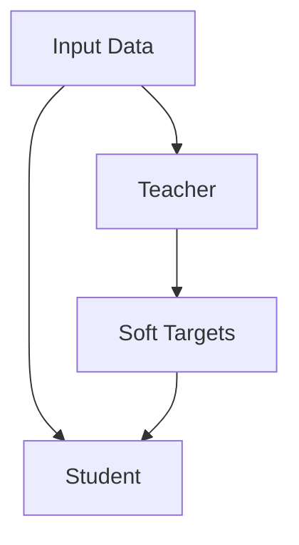

                 

**Transformer大模型实战：教师-学生架构**

## 1. 背景介绍

在当今的深度学习领域，Transformer模型已然成为一种标准，其在自然语言处理（NLP）等领域取得了显著的成功。然而，单一的Transformer模型在处理长序列数据时会面临注意力头数和参数数量的限制。为了解决这个问题，教师-学生架构（Teacher-Student architecture）应运而生，它通过利用预训练的大模型（教师）来指导小模型（学生）的训练，从而提高小模型的性能。本文将深入探讨Transformer大模型实战中的教师-学生架构，并提供实践指南。

## 2. 核心概念与联系

### 2.1 核心概念

- **教师（Teacher）**：预训练的大模型，具有丰富的表示能力。
- **学生（Student）**：待训练的小模型，旨在学习教师的表示能力。
- ** knowledge distillation（知识蒸馏）**：教师-学生架构的核心机制，指教师模型将其表示能力“蒸馏”给学生模型。

### 2.2 核心联系

教师-学生架构的核心联系如下图所示：



教师模型和学生模型共享输入数据，教师模型产生软目标（soft targets），学生模型则学习这些软目标。

## 3. 核心算法原理 & 具体操作步骤

### 3.1 算法原理概述

教师-学生架构的核心原理是，教师模型产生软目标，学生模型学习这些软目标，而不是学习真实的标签。软目标是教师模型对输入数据的预测，它们包含了教师模型的表示能力。

### 3.2 算法步骤详解

1. **预训练教师模型**：使用大量数据预训练教师模型。
2. **生成软目标**：使用预训练的教师模型生成软目标。
3. **训练学生模型**：使用软目标训练学生模型，而不是真实的标签。
4. **评估和微调**：评估学生模型的性能，并根据需要进行微调。

### 3.3 算法优缺点

**优点**：

- 可以使用小模型获得大模型的表示能力。
- 可以在数据量有限的情况下提高模型性能。

**缺点**：

- 需要额外的计算资源来预训练教师模型。
- 学生模型可能无法完全学习教师模型的表示能力。

### 3.4 算法应用领域

教师-学生架构在计算机视觉、自然语言处理等领域都有广泛的应用，它可以帮助小模型在资源受限的情况下取得更好的性能。

## 4. 数学模型和公式 & 详细讲解 & 举例说明

### 4.1 数学模型构建

设输入数据为$x$, 教师模型为$T$, 学生模型为$S$, 真实标签为$y$, 软目标为$\hat{y}$. 则教师-学生架构的数学模型可以表示为：

$$
L = -\frac{1}{N} \sum_{i=1}^{N} \left[ \log P(y_i|x_i;S) + \lambda \frac{T(\hat{y}_i|x_i;T)}{\sum_j T(\hat{y}_j|x_i;T)} \log \frac{T(\hat{y}_i|x_i;T)}{\sum_j T(\hat{y}_j|x_i;T)} \right]
$$

其中，$N$是样本数，$P(y|x;S)$是学生模型的预测分布，$T(\hat{y}|x;T)$是教师模型的预测分布，$\lambda$是蒸馏系数。

### 4.2 公式推导过程

上述公式是基于交叉熵损失函数推导而来的。教师模型的预测分布被视为一个分布式目标，学生模型学习这个分布式目标，而不是学习真实的标签。

### 4.3 案例分析与讲解

例如，在图像分类任务中，教师模型可以是一个预训练的大型CNN模型，学生模型可以是一个小型CNN模型。教师模型产生软目标，学生模型学习这些软目标，而不是学习真实的标签。通过这种方式，学生模型可以学习教师模型的表示能力，并取得更好的性能。

## 5. 项目实践：代码实例和详细解释说明

### 5.1 开发环境搭建

本项目使用Python和PyTorch进行开发。请确保您的环境中安装了以下软件包：

- Python 3.7+
- PyTorch 1.7+
- torchvision
- numpy
- matplotlib

### 5.2 源代码详细实现

以下是教师-学生架构的简单实现：

```python
import torch
import torch.nn as nn
import torch.optim as optim

# 定义教师模型
class Teacher(nn.Module):
    #...

# 定义学生模型
class Student(nn.Module):
    #...

# 初始化教师模型和学生模型
teacher = Teacher()
student = Student()

# 定义蒸馏系数
lambda_ = 0.5

# 定义损失函数
criterion = nn.CrossEntropyLoss()

# 定义优化器
optimizer = optim.Adam(student.parameters())

# 训练学生模型
for epoch in range(num_epochs):
    for inputs, labels in train_loader:
        # 将输入数据送入教师模型，产生软目标
        outputs = teacher(inputs)
        soft_targets = torch.softmax(outputs, dim=1)

        # 将输入数据送入学生模型
        student_outputs = student(inputs)

        # 计算损失
        loss = criterion(student_outputs, soft_targets) + lambda_ * criterion(student_outputs, labels)

        # 反向传播和优化
        optimizer.zero_grad()
        loss.backward()
        optimizer.step()
```

### 5.3 代码解读与分析

在代码中，我们首先定义教师模型和学生模型。然后，我们初始化这两个模型，并定义蒸馏系数。我们使用交叉熵损失函数计算损失，并使用Adam优化器进行优化。在训练过程中，我们将输入数据送入教师模型，产生软目标，然后将输入数据送入学生模型，并计算损失。

### 5.4 运行结果展示

通过运行上述代码，我们可以训练学生模型，并评估其性能。通常，学生模型的性能会优于单独训练的小模型。

## 6. 实际应用场景

### 6.1 当前应用

教师-学生架构已成功应用于计算机视觉、自然语言处理等领域。例如，在图像分类任务中，教师模型可以是一个预训练的大型CNN模型，学生模型可以是一个小型CNN模型。通过学习教师模型的表示能力，学生模型可以取得更好的性能。

### 6.2 未来应用展望

随着大模型的不断发展，教师-学生架构的应用也将越来越广泛。未来，教师-学生架构可能会应用于更多的领域，如自动驾驶、医疗影像分析等。此外，教师-学生架构也可以与其他技术结合，如联合学习、元学习等，以取得更好的性能。

## 7. 工具和资源推荐

### 7.1 学习资源推荐

- [Hinton等人的原始论文](https://arxiv.org/abs/1503.02531)
- [Fast.ai的教程](https://course.fast.ai/index.html)
- [Stanford CS224n：Natural Language Processing with Deep Learning](https://online.stanford.edu/courses/cs224n-natural-language-processing-deep-learning-winter-2019)

### 7.2 开发工具推荐

- [PyTorch](https://pytorch.org/)
- [TensorFlow](https://www.tensorflow.org/)
- [Keras](https://keras.io/)

### 7.3 相关论文推荐

- [DistilBERT, a distilled version of BERT: smaller, faster, cheaper and lighter](https://arxiv.org/abs/1910.01108)
- [Knowledge Distillation for Model Compression: Trade-off between Accuracy and Size](https://arxiv.org/abs/1503.02531)

## 8. 总结：未来发展趋势与挑战

### 8.1 研究成果总结

教师-学生架构已成功应用于多个领域，并取得了显著的成果。它提供了一种有效的方法，可以使用小模型获得大模型的表示能力。

### 8.2 未来发展趋势

未来，教师-学生架构可能会与其他技术结合，以取得更好的性能。此外，教师-学生架构也可能会应用于更多的领域，如自动驾驶、医疗影像分析等。

### 8.3 面临的挑战

教师-学生架构面临的挑战包括：

- **蒸馏系数的选择**：蒸馏系数的选择会影响学生模型的性能。如何选择合适的蒸馏系数是一个挑战。
- **教师模型的选择**：教师模型的选择也会影响学生模型的性能。如何选择合适的教师模型是另一个挑战。

### 8.4 研究展望

未来的研究可能会关注以下方向：

- **蒸馏系数的自动选择**：开发自动选择蒸馏系数的方法。
- **教师模型的自动选择**：开发自动选择教师模型的方法。
- **教师-学生架构的扩展**：将教师-学生架构扩展到更多的领域，如自动驾驶、医疗影像分析等。

## 9. 附录：常见问题与解答

**Q：教师-学生架构是否只适用于分类任务？**

A：教师-学生架构不仅适用于分类任务，还可以应用于回归任务、生成任务等。

**Q：教师-学生架构是否只适用于小模型？**

A：教师-学生架构可以用于任何模型，不仅限于小模型。它可以帮助模型学习表示能力，从而提高性能。

**Q：教师-学生架构是否只适用于深度学习？**

A：教师-学生架构是一种广泛的学习方法，它可以应用于任何学习算法，不仅限于深度学习。

## 作者：禅与计算机程序设计艺术 / Zen and the Art of Computer Programming

_转载请注明出处，未经作者同意不得转载_

（完）

