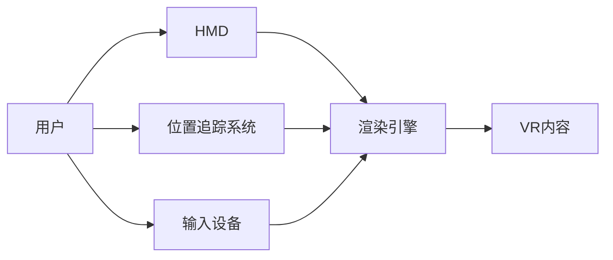

                 

**VR应用开发：构建沉浸式体验**

**作者：禅与计算机程序设计艺术 / Zen and the Art of Computer Programming**

## 1. 背景介绍

虚拟现实（Virtual Reality，VR）技术自问世以来，就以其提供的沉浸式体验而备受关注。随着技术的不断发展，VR从军事、医疗等领域走进了大众生活，成为一种全新的交互方式。本文将深入探讨VR应用开发，帮助读者构建自己的沉浸式体验。

## 2. 核心概念与联系

### 2.1 VR系统架构

VR系统主要由头戴式显示器（Head-Mounted Display，HMD）、位置追踪系统、输入设备和渲染引擎组成。如下图所示：

### 2.2 VR渲染原理

VR渲染需要实时渲染用户视角下的场景，以提供流畅的体验。渲染过程包括场景构建、渲染准备、渲染循环和渲染结果输出。

## 3. 核心算法原理 & 具体操作步骤

### 3.1 立体视觉原理

VR利用立体视觉原理提供沉浸式体验。人眼通过双目视觉获取立体信息，VR通过为左右眼分别渲染略有不同的图像，模拟这种双目视觉，从而创造出立体感。

### 3.2 头部追踪算法

头部追踪算法用于实时获取用户头部位置和方向，以更新渲染视角。常用的头部追踪算法包括外部追踪和内部追踪。

### 3.3 运动模糊消除算法

运动模糊是VR中常见的问题，它会导致用户感到眩晕。运动模糊消除算法通过对渲染帧进行插值和重新排序，消除运动模糊。

### 3.4 VR算法应用领域

VR算法在游戏、电影、教育、医疗等领域都有广泛应用。例如，在医疗领域，VR可以提供疼痛分散和康复训练的新方法。

## 4. 数学模型和公式 & 详细讲解 & 举例说明

### 4.1 视差原理

视差原理是立体视觉的数学基础。给定两个相机的内外参数和基线长度，可以计算出物体的深度信息。

$$
Z = \frac{B \cdot f}{d}
$$

其中，$Z$为物体深度，$B$为基线长度，$f$为相机焦距，$d$为左右相机图像上物体的视差。

### 4.2 头部追踪模型

头部追踪模型通常使用六自由度（6DoF）表示头部位置和方向。头部追踪数据可以通过外部追踪设备或内部追踪算法获取。

### 4.3 案例分析：VR头部追踪

假设我们使用外部追踪设备获取头部追踪数据，并使用6DoF表示头部位置和方向。我们可以将头部追踪数据与场景模型结合，实时渲染用户视角下的场景。

## 5. 项目实践：代码实例和详细解释说明

### 5.1 开发环境搭建

我们将使用Unity和Oculus Integration开发VR应用。首先，安装Unity Hub，并创建一个新的3D项目。然后，安装Oculus Integration，并配置Unity项目以支持VR。

### 5.2 源代码详细实现

我们将创建一个简单的VR场景，用户可以在其中移动和查看3D模型。我们将使用Oculus Integration提供的API获取头部追踪数据，并实时渲染场景。

### 5.3 代码解读与分析

在Unity中，我们需要创建一个新的C#脚本，并使用Oculus Integration提供的API获取头部追踪数据。然后，我们可以使用这些数据更新相机位置，实时渲染场景。

### 5.4 运行结果展示

在Oculus Quest或其他VR设备上运行应用，用户将能够在VR场景中移动和查看3D模型。通过头部追踪，用户的视角将实时更新，提供流畅的沉浸式体验。

## 6. 实际应用场景

### 6.1 VR在游戏中的应用

VR为游戏带来了全新的交互方式。例如，在第一人称射击游戏中，玩家可以通过头部转动查看周围环境，提供更真实的体验。

### 6.2 VR在教育中的应用

VR可以提供互动式的学习体验。例如，学生可以在VR中探索历史事件或科学现象，从而加深对知识的理解。

### 6.3 VR在医疗中的应用

VR可以提供疼痛分散和康复训练的新方法。例如，VR疗法可以帮助患者分散注意力，减轻疼痛，并提供互动式的康复训练。

### 6.4 未来应用展望

随着技术的不断发展，VR有望在更多领域得到应用。例如，VR可以提供更真实的远程会议体验，或为远程医疗提供新的工具。

## 7. 工具和资源推荐

### 7.1 学习资源推荐

- "Virtual Reality in a Nutshell" by Tony Parisi
- "Introduction to Virtual Reality" by Jon Peddie Research
- "VR/AR Association" (https://www.thevrara.com/)

### 7.2 开发工具推荐

- Unity (https://unity.com/)
- Unreal Engine (https://www.unrealengine.com/)
- Oculus Integration (https://developer.oculus.com/documentation/unity/unity-integration/)

### 7.3 相关论文推荐

- "Virtual Reality: A Survey of the State of the Art" by Paul Milgram and Fumio Kishino
- "The Virtual Reality Handbook" by Mark Bolas, Blair MacIntyre, and Bruce Thomas

## 8. 总结：未来发展趋势与挑战

### 8.1 研究成果总结

本文介绍了VR应用开发的核心概念、算法原理、数学模型和项目实践。我们讨论了VR在游戏、教育和医疗等领域的应用，并推荐了相关学习资源和开发工具。

### 8.2 未来发展趋势

随着技术的不断发展，VR有望在更多领域得到应用。未来，我们将看到更小巧、更便宜、更舒适的VR设备，以及更先进的渲染技术。

### 8.3 面临的挑战

然而，VR技术仍面临着许多挑战。例如，运动模糊和眩晕等问题仍需要解决，以提供更舒适的用户体验。此外，VR内容的创作和分发也需要进一步发展。

### 8.4 研究展望

未来的研究将关注于解决上述挑战，并开发新的VR应用。例如，我们将看到更多的VR应用在医疗、教育和远程会议等领域得到应用。此外，我们也将看到更多的研究关注于VR技术的基础理论和数学模型。

## 9. 附录：常见问题与解答

**Q：VR头盔会导致眩晕吗？**

**A：**是的，VR头盔可能会导致眩晕。这通常是由于运动模糊导致的。一些用户可能对VR头盔更敏感，因此需要小心使用。

**Q：VR需要强大的计算机吗？**

**A：**是的，VR需要强大的计算机。渲染VR场景需要大量的计算资源，因此高性能的GPU和CPU是必需的。

**Q：VR有哪些应用领域？**

**A：**VR有许多应用领域，包括游戏、教育、医疗、远程会议等。VR还可以用于设计、建筑和工程等领域。

**Q：VR技术的未来发展方向是什么？**

**A：**VR技术的未来发展方向包括更小巧、更便宜、更舒适的VR设备，以及更先进的渲染技术。此外，我们也将看到更多的VR应用在更多领域得到应用。

**Q：VR技术面临的挑战是什么？**

**A：**VR技术面临的挑战包括运动模糊和眩晕等问题，以提供更舒适的用户体验。此外，VR内容的创作和分发也需要进一步发展。

**Q：如何开始VR开发？**

**A：**开始VR开发的第一步是学习VR技术的基础知识。然后，您可以选择一个VR开发平台，如Unity或Unreal Engine，并开始创建自己的VR应用。

