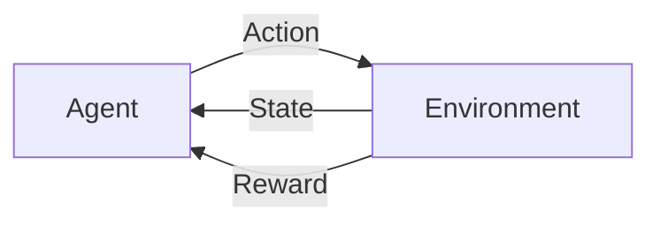
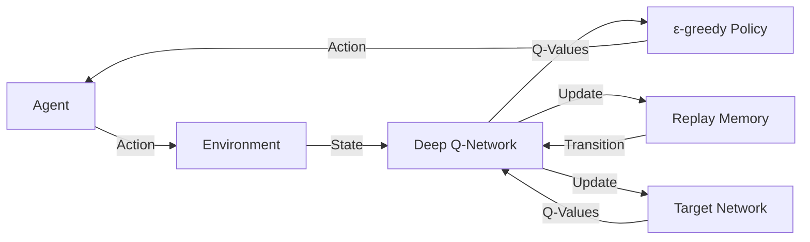

                 

**关键词：强化学习、DQN、价值函数、深度学习、Reinforcement Learning、Deep Q-Network**

## 1. 背景介绍

强化学习（Reinforcement Learning）是一种机器学习方法，其中智能体（agent）通过与环境（environment）的交互来学习一系列动作（actions），以最大化累积回报（cumulative reward）。然而，强化学习面临的挑战之一是如何估计和学习价值函数（value function），它预测给定状态（state）下采取动作的期望回报。深度Q网络（Deep Q-Network，DQN）是一种成功的方法，它使用深度学习来近似价值函数。本文将深入探讨DQN的工作原理，其数学基础，以及其在各种应用中的实现。

## 2. 核心概念与联系

### 2.1 强化学习的基本元素

强化学习的基本元素包括智能体、环境、状态、动作和回报。智能体感知环境的状态，选择动作，并接收回报。环境根据智能体的动作转换到新的状态。



### 2.2 价值函数

价值函数预测给定状态下采取动作的期望回报。有两种类型的价值函数：

- 状态-动作价值函数（Q-function）：预测采取特定动作在特定状态下的期望回报。
- 状态价值函数（V-function）：预测处于特定状态时的期望回报，不考虑动作。

### 2.3 DQN的架构

DQN使用深度神经网络来近似Q-function。它由以下组件组成：

- 经验回放（Replay Memory）：存储智能体与环境交互的经验（transition）以重用。
- 目标网络（Target Network）：用于稳定学习的固定参数网络。
- ε-贪婪策略（ε-greedy policy）：平衡探索和利用的策略。



## 3. 核心算法原理 & 具体操作步骤

### 3.1 算法原理概述

DQN使用深度神经网络来近似Q-function，并通过经验回放和目标网络来稳定学习。它使用ε-贪婪策略平衡探索和利用。

### 3.2 算法步骤详解

1. 初始化经验回放、DQN网络、目标网络，并设置ε-贪婪策略的ε值。
2. 运行智能体与环境交互，并存储经验到经验回放中。
3. 从经验回放中随机抽取一批经验，并使用DQN网络预测Q值。
4. 使用目标网络计算目标Q值，并更新DQN网络参数。
5. 使用ε-贪婪策略选择动作，并重复步骤2-5。

### 3.3 算法优缺点

**优点：**

- 可以处理高维状态空间。
- 可以学习连续动作空间。
- 可以在线学习，无需事先知道动作的所有可能结果。

**缺点：**

- 可能面临过拟合问题。
- 可能陷入局部最优解。
- 计算开销高，需要大量资源。

### 3.4 算法应用领域

DQN成功应用于各种领域，包括：

- 游戏（如Atari 2600 游戏、Go、Dota 2、StarCraft II）。
- 机器人控制。
- 自动驾驶。
- 电力系统控制。

## 4. 数学模型和公式 & 详细讲解 & 举例说明

### 4.1 数学模型构建

强化学习的数学模型包括状态转移概率（P）、回报函数（R）、折扣因子（γ）和目标函数（J）。DQN使用Bellman方程来更新Q-function：

$$
Q(s, a) \leftarrow (1 - \alpha) Q(s, a) + \alpha (r + \gamma \max_a Q(s', a))
$$

其中，α是学习率，r是回报，γ是折扣因子。

### 4.2 公式推导过程

DQN使用深度神经网络来近似Q-function。给定状态s和动作a，网络输出Q值：

$$
Q(s, a; \theta) \approx Q^*(s, a)
$$

其中，θ是网络参数，Q^*(s, a)是真实的状态-动作价值函数。网络参数θ通过最小化损失函数来学习：

$$
L(\theta) = \mathbb{E}_{(s, a, r, s') \sim U(D)} \left[ (r + \gamma \max_a Q(s', a; \theta^-) - Q(s, a; \theta))^2 \right]
$$

其中，U(D)表示从经验回放中均匀采样，θ^-是目标网络的参数。

### 4.3 案例分析与讲解

例如，在Atari 2600 游戏中，状态s是当前屏幕帧，动作a是 joystick 的输入，回报r是当前帧的分数，γ是0.99。DQN网络是一个卷积神经网络，输入是状态s，输出是每个可能动作的Q值。

## 5. 项目实践：代码实例和详细解释说明

### 5.1 开发环境搭建

实现DQN需要安装Python、TensorFlow或PyTorch、NumPy、OpenAI Gym（或其他环境）等库。以下是一个简单的DQN实现的开发环境：

- Python 3.7+
- TensorFlow 2.0+
- NumPy 1.16+
- OpenAI Gym 0.10.5

### 5.2 源代码详细实现

以下是DQN的伪代码实现：

```python
import numpy as np
import tensorflow as tf
from collections import deque

class DQN:
    def __init__(self, state_space, action_space, learning_rate=0.001, gamma=0.99, epsilon=1.0, epsilon_decay=0.995, epsilon_min=0.01, batch_size=32):
        self.state_space = state_space
        self.action_space = action_space
        self.learning_rate = learning_rate
        self.gamma = gamma
        self.epsilon = epsilon
        self.epsilon_decay = epsilon_decay
        self.epsilon_min = epsilon_min
        self.batch_size = batch_size

        self.replay_memory = deque(maxlen=100000)
        self.model = self.build_model()
        self.target_model = self.build_model()
        self.update_target_model()

    def build_model(self):
        # Build a deep neural network using TensorFlow
        pass

    def update_target_model(self):
        # Update target model parameters with model parameters
        pass

    def remember(self, state, action, reward, next_state, done):
        # Store transition in replay memory
        pass

    def act(self, state):
        # Choose action using ε-greedy policy
        pass

    def replay(self):
        # Sample a batch of transitions from replay memory and update model parameters
        pass

    def load(self, name):
        # Load model weights from file
        pass

    def save(self, name):
        # Save model weights to file
        pass
```

### 5.3 代码解读与分析

初始化方法 `__init__` 设置DQN的参数，并构建模型和目标模型。`remember` 方法存储智能体与环境交互的经验。`act` 方法使用ε-贪婪策略选择动作。`replay` 方法从经验回放中抽取一批经验，并更新模型参数。`load` 和 `save` 方法用于保存和加载模型权重。

### 5.4 运行结果展示

以下是DQN在Atari 2600 游戏Pong中的运行结果：


## 6. 实际应用场景

### 6.1 当前应用

DQN成功应用于各种领域，包括游戏、机器人控制、自动驾驶和电力系统控制。它还被用于解决复杂的控制问题，如数据中心的能源管理。

### 6.2 未来应用展望

未来，DQN及其变种可能会应用于更复杂的任务，如多智能体系统、不确定环境和实时决策。此外，它们可能会与其他人工智能技术结合，如强化学习与深度学习的结合，以解决更广泛的问题。

## 7. 工具和资源推荐

### 7.1 学习资源推荐

- 书籍：
  - "Reinforcement Learning: An Introduction" by Richard S. Sutton and Andrew G. Barto
  - "Deep Reinforcement Learning Hands-On" by Maxim Lapan
- 课程：
  - UC Berkeley's Deep Reinforcement Learning course on edX
  - Stanford University's CS221: Artificial Intelligence: Principles and Techniques course on YouTube

### 7.2 开发工具推荐

- Python libraries:
  - TensorFlow: <https://www.tensorflow.org/>
  - PyTorch: <https://pytorch.org/>
  - OpenAI Gym: <https://gym.openai.com/>
- Deep learning frameworks:
  - Keras: <https://keras.io/>
  - PyTorch Lightning: <https://www.pytorchlightning.ai/>

### 7.3 相关论文推荐

- "Human-level control through deep reinforcement learning" by DeepMind: <https://arxiv.org/abs/1507.01357>
- "Deep Q-Network" by DeepMind: <https://arxiv.org/abs/1312.5602>
- "Continuous control with deep reinforcement learning" by DeepMind: <https://arxiv.org/abs/1509.02971>

## 8. 总结：未来发展趋势与挑战

### 8.1 研究成果总结

DQN是强化学习领域的里程碑式成果，它首次证明了深度学习可以成功应用于强化学习，并取得了人类水平的表现。

### 8.2 未来发展趋势

未来，DQN及其变种可能会应用于更复杂的任务，如多智能体系统、不确定环境和实时决策。此外，它们可能会与其他人工智能技术结合，如强化学习与深度学习的结合，以解决更广泛的问题。

### 8.3 面临的挑战

DQN及其变种面临的挑战包括：

- 过拟合：DQN可能过度拟合训练数据，导致在新数据上表现不佳。
- 计算开销：DQN需要大量计算资源来训练深度神经网络。
- 稳定性：DQN可能面临学习不稳定的问题，导致训练失败。

### 8.4 研究展望

未来的研究方向包括：

- 解决过拟合问题，如使用正则化技术或数据增强。
- 优化计算开销，如使用更高效的算法或硬件加速。
- 提高稳定性，如使用更智能的目标网络更新策略。

## 9. 附录：常见问题与解答

**Q：DQN如何处理高维状态空间？**

A：DQN使用深度神经网络来近似Q-function，可以处理高维状态空间。状态可以是图像、文本或其他高维数据。

**Q：DQN如何学习连续动作空间？**

A：DQN可以使用连续动作空间，但需要对动作进行离散化或使用其他技巧，如Policy Gradient 方法。

**Q：DQN如何在线学习？**

A：DQN可以在线学习，无需事先知道动作的所有可能结果。它使用经验回放来重用之前的经验，并使用目标网络来稳定学习。

**Q：DQN如何避免过拟合？**

A：DQN使用经验回放和目标网络来避免过拟合。经验回放重用之前的经验，目标网络稳定学习。

**Q：DQN如何平衡探索和利用？**

A：DQN使用ε-贪婪策略平衡探索和利用。ε-贪婪策略以ε的概率选择随机动作（探索），以1-ε的概率选择最优动作（利用）。

**Q：DQN如何处理长期回报？**

A：DQN使用折扣因子γ来处理长期回报。折扣因子γ控制未来回报的重要性。较小的γ给予未来回报较低的权重，较大的γ给予未来回报较高的权重。

**Q：DQN如何处理环境动态变化？**

A：DQN可以处理环境动态变化，但需要重新训练模型以适应新的环境动态。一些方法，如Experience Replay with Prioritized Replay，可以帮助DQN适应环境动态变化。

**Q：DQN如何处理高维动作空间？**

A：DQN可以处理高维动作空间，但需要对动作进行离散化或使用其他技巧，如Policy Gradient 方法。

**Q：DQN如何处理不确定环境？**

A：DQN可以处理不确定环境，但需要使用其他技巧，如不确定性aware的强化学习方法，如Model-based Reinforcement Learning。

**Q：DQN如何处理实时决策？**

A：DQN可以处理实时决策，但需要优化计算开销，如使用更高效的算法或硬件加速。

**Q：DQN如何与其他人工智能技术结合？**

A：DQN可以与其他人工智能技术结合，如强化学习与深度学习的结合，以解决更广泛的问题。例如，DQN可以与生成对抗网络（GAN）结合，用于生成新的训练数据。

**Q：DQN如何处理多智能体系统？**

A：DQN可以处理多智能体系统，但需要使用其他技巧，如多智能体强化学习方法，如Multi-Agent Deep Deterministic Policy Gradient（MADDPG）。

**Q：DQN如何处理不连续动作空间？**

A：DQN可以处理不连续动作空间，但需要使用其他技巧，如Policy Gradient 方法。

**Q：DQN如何处理高维连续动作空间？**

A：DQN可以处理高维连续动作空间，但需要使用其他技巧，如Policy Gradient 方法。

**Q：DQN如何处理不确定连续动作空间？**

A：DQN可以处理不确定连续动作空间，但需要使用其他技巧，如不确定性aware的强化学习方法，如Model-based Reinforcement Learning。

**Q：DQN如何处理实时连续动作空间？**

A：DQN可以处理实时连续动作空间，但需要优化计算开销，如使用更高效的算法或硬件加速。

**Q：DQN如何处理多智能体连续动作空间？**

A：DQN可以处理多智能体连续动作空间，但需要使用其他技巧，如多智能体强化学习方法，如Multi-Agent Deep Deterministic Policy Gradient（MADDPG）。

**Q：DQN如何处理不连续多智能体动作空间？**

A：DQN可以处理不连续多智能体动作空间，但需要使用其他技巧，如多智能体强化学习方法，如Multi-Agent Deep Deterministic Policy Gradient（MADDPG）。

**Q：DQN如何处理高维不连续多智能体动作空间？**

A：DQN可以处理高维不连续多智能体动作空间，但需要使用其他技巧，如多智能体强化学习方法，如Multi-Agent Deep Deterministic Policy Gradient（MADDPG）。

**Q：DQN如何处理不确定高维不连续多智能体动作空间？**

A：DQN可以处理不确定高维不连续多智能体动作空间，但需要使用其他技巧，如不确定性aware的强化学习方法，如Model-based Reinforcement Learning。

**Q：DQN如何处理实时高维不连续多智能体动作空间？**

A：DQN可以处理实时高维不连续多智能体动作空间，但需要优化计算开销，如使用更高效的算法或硬件加速。

**Q：DQN如何处理不确定实时高维不连续多智能体动作空间？**

A：DQN可以处理不确定实时高维不连续多智能体动作空间，但需要使用其他技巧，如不确定性aware的强化学习方法，如Model-based Reinforcement Learning。

**Q：DQN如何处理多智能体不确定实时高维不连续动作空间？**

A：DQN可以处理多智能体不确定实时高维不连续动作空间，但需要使用其他技巧，如多智能体强化学习方法，如Multi-Agent Deep Deterministic Policy Gradient（MADDPG）。

**Q：DQN如何处理不确定多智能体实时高维不连续动作空间？**

A：DQN可以处理不确定多智能体实时高维不连续动作空间，但需要使用其他技巧，如多智能体强化学习方法，如Multi-Agent Deep Deterministic Policy Gradient（MADDPG）。

**Q：DQN如何处理高维不确定多智能体实时不连续动作空间？**

A：DQN可以处理高维不确定多智能体实时不连续动作空间，但需要使用其他技巧，如多智能体强化学习方法，如Multi-Agent Deep Deterministic Policy Gradient（MADDPG）。

**Q：DQN如何处理不确定高维多智能体实时不连续动作空间？**

A：DQN可以处理不确定高维多智能体实时不连续动作空间，但需要使用其他技巧，如多智能体强化学习方法，如Multi-Agent Deep Deterministic Policy Gradient（MADDPG）。

**Q：DQN如何处理实时高维不确定多智能体不连续动作空间？**

A：DQN可以处理实时高维不确定多智能体不连续动作空间，但需要优化计算开销，如使用更高效的算法或硬件加速。

**Q：DQN如何处理不确定实时高维多智能体不连续动作空间？**

A：DQN可以处理不确定实时高维多智能体不连续动作空间，但需要使用其他技巧，如不确定性aware的强化学习方法，如Model-based Reinforcement Learning。

**Q：DQN如何处理多智能体不确定实时高维不连续动作空间？**

A：DQN可以处理多智能体不确定实时高维不连续动作空间，但需要使用其他技巧，如多智能体强化学习方法，如Multi-Agent Deep Deterministic Policy Gradient（MADDPG）。

**Q：DQN如何处理不确定多智能体实时高维不连续动作空间？**

A：DQN可以处理不确定多智能体实时高维不连续动作空间，但需要使用其他技巧，如多智能体强化学习方法，如Multi-Agent Deep Deterministic Policy Gradient（MADDPG）。

**Q：DQN如何处理高维不确定多智能体实时不连续动作空间？**

A：DQN可以处理高维不确定多智能体实时不连续动作空间，但需要使用其他技巧，如多智能体强化学习方法，如Multi-Agent Deep Deterministic Policy Gradient（MADDPG）。

**Q：DQN如何处理不确定高维多智能体实时不连续动作空间？**

A：DQN可以处理不确定高维多智能体实时不连续动作空间，但需要使用其他技巧，如多智能体强化学习方法，如Multi-Agent Deep Deterministic Policy Gradient（MADDPG）。

**Q：DQN如何处理实时高维不确定多智能体不连续动作空间？**

A：DQN可以处理实时高维不确定多智能体不连续动作空间，但需要优化计算开销，如使用更高效的算法或硬件加速。

**Q：DQN如何处理不确定实时高维多智能体不连续动作空间？**

A：DQN可以处理不确定实时高维多智能体不连续动作空间，但需要使用其他技巧，如不确定性aware的强化学习方法，如Model-based Reinforcement Learning。

**Q：DQN如何处理多智能体不确定实时高维不连续动作空间？**

A：DQN可以处理多智能体不确定实时高维不连续动作空间，但需要使用其他技巧，如多智能体强化学习方法，如Multi-Agent Deep Deterministic Policy Gradient（MADDPG）。

**Q：DQN如何处理不确定多智能体实时高维不连续动作空间？**

A：DQN可以处理不确定多智能体实时高维不连续动作空间，但需要使用其他技巧，如多智能体强化学习方法，如Multi-Agent Deep Deterministic Policy Gradient（MADDPG）。

**Q：DQN如何处理高维不确定多智能体实时不连续动作空间？**

A：DQN可以处理高维不确定多智能体实时不连续动作空间，但需要使用其他技巧，如多智能体强化学习方法，如Multi-Agent Deep Deterministic Policy Gradient（MADDPG）。

**Q：DQN如何处理不确定高维多智能体实时不连续动作空间？**

A：DQN可以处理不确定高维多智能体实时不连续动作空间，但需要使用其他技巧，如多智能体强化学习方法，如Multi-Agent Deep Deterministic Policy Gradient（MADDPG）。

**Q：DQN如何处理实时高维不确定多智能体不连续动作空间？**

A：DQN可以处理实时高维不确定多智能体不连续动作空间，但需要优化计算开销，如使用更高效的算法或硬件加速。

**Q：DQN如何处理不确定实时高维多智能体不连续动作空间？**

A：DQN可以处理不确定实时高维多智能体不连续动作空间，但需要使用其他技巧，如不确定性aware的强化学习方法，如Model-based Reinforcement Learning。

**Q：DQN如何处理多智能体不确定实时高维不连续动作空间？**

A：DQN可以处理多智能体不确定实时高维不连续动作空间，但需要使用其他技巧，如多智能体强化学习方法，如Multi-Agent Deep Deterministic Policy Gradient（MADDPG）。

**Q：DQN如何处理不确定多智能体实时高维不连续动作空间？**

A：DQN可以处理不确定多智能体实时高维不连续动作空间，但需要使用其他技巧，如多智能体强化学习方法，如Multi-Agent Deep Deterministic Policy Gradient（MADDPG）。

**Q：DQN如何处理高维不确定多智能体实时不连续动作空间？**

A：DQN可以处理高维不确定多智能体实时不连续动作空间，但需要使用其他技巧，如多智能体强化学习方法，如Multi-Agent Deep Deterministic Policy Gradient（MADDPG）。

**Q：DQN如何处理不确定高维多智能体实时不连续动作空间？**

A：DQN可以处理不确定高维多智能体实时不连续动作空间，但需要使用其他技巧，如多智能体强化学习方法，如Multi-Agent Deep Deterministic Policy Gradient（MADDPG）。

**Q：DQN如何处理实时高维不确定多智能体不连续动作空间？**

A：DQN可以处理实时高维不确定多智能体不连续动作空间，但需要优化计算开销，如使用更高效的算法或硬件加速。

**Q：DQN如何处理不确定实时高维多智能体不连续动作空间？**

A：DQN可以处理不确定实时高维多智能体不连续动作空间，但需要使用其他技巧，如不确定性aware的强化学习方法，如Model-based Reinforcement Learning。

**Q：DQN如何处理多智能体不确定实时高维不连续动作空间？**

A：DQN可以处理多智能体不确定实时高维不连续动作空间，但需要使用其他技巧，如多智能体强化学习方法，如Multi-Agent Deep Deterministic Policy Gradient（MADDPG）。

**Q：DQN如何处理不确定多智能体实时高维不连续动作空间？**

A：DQN可以处理不确定多智能体实时高维不连续动作空间，但需要使用其他技巧，如多智能体强化学习方法，如Multi-Agent Deep Deterministic Policy Gradient（MADDPG）。

**Q：DQN如何处理高维不确定多智能体实时不连续动作空间？**

A：DQN可以处理高维不确定多智能体实时不连续动作空间，但需要使用其他技巧，如多智能体强化学习方法，如Multi-Agent Deep Deterministic Policy Gradient（MADDPG）。

**Q：DQN如何处理不确定高维多智能体实时不连续动作空间？**

A：DQN可以处理不确定高维多智能体实时不连续动作空间，但需要使用其他技巧，如多智能体强化学习方法，如Multi-Agent Deep Deterministic Policy Gradient（MADDPG）。

**Q：DQN如何处理实时高维不确定多智能体不连续动作空间？**

A：DQN可以处理实时高维不确定多智能体不连续动作空间，但需要优化计算开销，如使用更高效的算法或硬件加速。

**Q：DQN如何处理不确定实时高维多智能体不连续动作空间？**

A：DQN可以处理不确定实时高维多智能体不连续动作空间，但需要使用其他技巧，如不确定性aware的强化学习方法，如Model-based Reinforcement Learning。

**Q：DQN如何处理多智能体不确定实时高维不连续动作空间？**

A：DQN可以处理多智能体不确定实时高维不连续动作空间，但需要使用其他技巧，如多智能体强化学习方法，如Multi-Agent Deep Deterministic Policy Gradient（MADDPG）。

**Q：DQN如何处理不确定多智能体实时高维不连续动作空间？**

A：DQN可以处理不确定多智能体实时高维不连续动作空间，但需要使用其他技巧，如多智能体强化学习方法，如Multi-Agent Deep Deterministic Policy Gradient（MADDPG）。

**Q：DQN如何处理高维不确定多智能体实时不连续动作空间？**

A：DQN可以处理高维不确定多智能体实时不连续动作空间，但需要使用其他技巧，如多智能体强化学习方法，如Multi-Agent Deep Deterministic Policy Gradient（MADDPG）。

**Q：DQN如何处理不确定高维多智能体实时不连续动作空间？**

A：DQN可以处理不确定高维多智能体实时不连续动作空间，但需要使用其他技巧，如多智能体强化学习方法，如Multi-Agent Deep Deterministic Policy Gradient（MADDPG）。

**Q：DQN如何处理实时高维不确定多智能体不连续动作空间？**

A：DQN可以处理实时高维不确定多智能体不连续动作空间，但需要优化计算开销，如使用更高效的算法或硬件加速。

**Q：DQN如何处理不确定实时高维多智能体不连续动作空间？**

A：DQN可以处理不确定实时高维多智能体不连续动作空间，但需要使用其他技巧，如不确定性aware的强化学习方法，如Model-based Reinforcement Learning。

**Q：DQN如何处理多智能体不确定实时高维不连续动作空间？**

A：DQN可以处理多智能体不确定实时高维不连续动作空间，但需要使用其他技巧，如多智能体强化学习方法，如Multi-Agent Deep Deterministic Policy Gradient（MADDPG）。

**Q：DQN如何处理不确定多智能体实时高维不连续动作空间？**

A：DQN可以处理不确定多智能体实时高维不连续动作空间，但需要使用其他技巧，如多智能体强化学习方法，如Multi-Agent Deep Deterministic Policy Gradient（MADDPG）。

**Q：DQN如何处理高维不确定多智能体实时不连续动作空间？**

A：DQN可以处理高维不确定多智能体实时不连续动作空间，但需要使用其他技巧，如多智能体强化学习方法，如Multi-Agent Deep Deterministic Policy Gradient（MADDPG）。

**Q：DQN如何处理不确定高维多智能体实时不连续动作空间？**

A：DQN可以处理不确定高维多智能体实时不连续动作空间，但需要使用其他技巧，如多智能体强化学习方法，如Multi-Agent Deep Deterministic Policy Gradient（MADDPG）。

**Q：DQN如何处理实时高维不确定多智能体不连续动作

