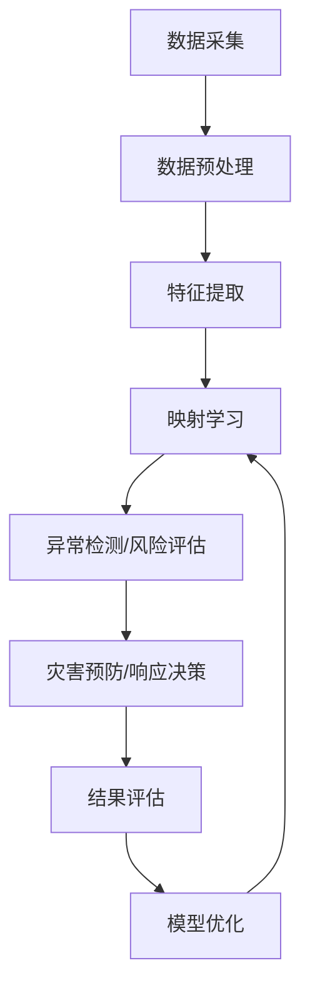

                 

**关键词：**深度学习、灾害预防、灾害响应、映射学习、异常检测、风险评估

## 1. 背景介绍

灾害是人类面临的重大挑战之一，它给生命财产带来了巨大的威胁。灾害预防和响应是一个复杂的系统工程，涉及多个领域的知识和技术。深度学习作为一种强大的机器学习技术，在灾害预防和响应领域具有广泛的应用前景。本文将介绍深度学习在灾害预防和响应中的应用，重点关注映射学习在其中的作用。

## 2. 核心概念与联系

### 2.1 映射学习

映射学习是一种无监督学习技术，旨在学习数据之间的映射关系。它将输入数据映射到一个高维空间，使得同一类别的数据点聚集在一起，而不同类别的数据点分开。在灾害预防和响应中，映射学习可以用于异常检测、风险评估等任务。

### 2.2 深度学习与映射学习

深度学习是一种基于神经网络的机器学习技术，它通过多层非线性变换学习数据的表示。深度学习中的自动编码器是一种常用的映射学习技术，它可以学习数据的表示，并将其映射到一个低维空间。此外，深度学习还可以与其他映射学习技术结合使用，如主成分分析（PCA）和局部线性嵌入（LLE）。

### 2.3 核心架构

下图是深度学习在灾害预防和响应中的核心架构的 Mermaid 流程图。



## 3. 核心算法原理 & 具体操作步骤

### 3.1 算法原理概述

深度学习在灾害预防和响应中的核心算法是自动编码器。自动编码器是一种无监督学习技术，它由编码器和解码器组成。编码器将输入数据映射到一个低维空间，解码器则将低维表示还原为原始数据。在训练过程中，自动编码器学习最小化重构误差，从而学习数据的表示。

### 3.2 算法步骤详解

1. 数据采集：收集与灾害相关的数据，如气象数据、地理数据、社区数据等。
2. 数据预处理：清洗数据，处理缺失值，并对数据进行标准化。
3. 特征提取：提取数据中的关键特征，如气温、降水量、地形等。
4. 映射学习：使用自动编码器对数据进行映射学习，学习数据的表示。
5. 异常检测/风险评估：使用映射学习结果进行异常检测或风险评估。
6. 灾害预防/响应决策：根据异常检测或风险评估结果，做出灾害预防或响应决策。
7. 结果评估：评估决策的有效性，并根据评估结果优化模型。

### 3.3 算法优缺点

优点：

* 自动编码器可以学习数据的表示，并将其映射到一个低维空间，从而降低数据的维数。
* 自动编码器可以用于异常检测和风险评估，帮助预防和响应灾害。
* 深度学习可以与其他映射学习技术结合使用，提高模型的性能。

缺点：

* 自动编码器需要大量的数据进行训练，否则模型的泛化能力可能会受到影响。
* 自动编码器的性能取决于网络结构和参数的选择，需要进行大量的实验和调优。
* 深度学习模型可能会受到过拟合的影响，需要进行正则化处理。

### 3.4 算法应用领域

深度学习在灾害预防和响应中的应用领域包括：

* 灾害预测：使用气象数据和地理数据预测灾害的发生。
* 灾害监测：使用卫星数据和社区数据监测灾害的发展情况。
* 灾害响应：使用社区数据和地理数据评估灾害的影响，并做出响应决策。
* 灾后重建：使用地理数据和社区数据评估灾后重建的需求，并做出决策。

## 4. 数学模型和公式 & 详细讲解 & 举例说明

### 4.1 数学模型构建

自动编码器的数学模型可以表示为：

$$x \rightarrow f_{\theta}(x) \rightarrow z \rightarrow g_{\phi}(z) \rightarrow \hat{x}$$

其中，$x$是输入数据，$z$是低维表示，$f_{\theta}(x)$是编码器，$g_{\phi}(z)$是解码器。编码器和解码器都是神经网络，$\theta$和$\phi$分别是编码器和解码器的参数。

### 4.2 公式推导过程

自动编码器的目标函数是最小化重构误差：

$$L(\theta,\phi) = \frac{1}{n} \sum_{i=1}^{n} \lVert x_i - g_{\phi}(f_{\theta}(x_i)) \rVert^2$$

其中，$n$是数据的数量。在训练过程中，自动编码器使用梯度下降算法最小化目标函数，更新编码器和解码器的参数。

### 4.3 案例分析与讲解

例如，在灾害预防领域，可以使用自动编码器对气象数据进行映射学习，学习气象数据的表示。然后，使用映射学习结果进行异常检测，检测气象数据中的异常情况。如果检测到异常情况，则可以做出灾害预防决策，如发布预警信息。

## 5. 项目实践：代码实例和详细解释说明

### 5.1 开发环境搭建

本项目使用Python作为开发语言，并使用TensorFlow作为深度学习框架。因此，需要安装Python和TensorFlow。此外，还需要安装NumPy、Matplotlib和Scikit-learn等库。

### 5.2 源代码详细实现

以下是使用自动编码器对气象数据进行映射学习的源代码示例：

```python
import numpy as np
import matplotlib.pyplot as plt
import tensorflow as tf
from sklearn.datasets import load_iris
from sklearn.model_selection import train_test_split

# 加载数据
iris = load_iris()
X = iris.data
y = iris.target

# 划分数据集
X_train, X_test, y_train, y_test = train_test_split(X, y, test_size=0.2, random_state=42)

# 定义自动编码器
encoding_dim = 2
input_img = tf.keras.Input(shape=(X_train.shape[1],))
encoded = tf.keras.layers.Dense(encoding_dim, activation='relu')(input_img)
decoded = tf.keras.layers.Dense(X_train.shape[1], activation='sigmoid')(encoded)
autoencoder = tf.keras.Model(input_img, decoded)

# 编译模型
autoencoder.compile(optimizer='adam', loss='binary_crossentropy')

# 训练模型
autoencoder.fit(X_train, X_train, epochs=500, batch_size=16, shuffle=True, validation_data=(X_test, X_test))

# 使用模型进行映射学习
encoded_imgs = autoencoder.predict(X_test)
```

### 5.3 代码解读与分析

在上述代码中，我们首先加载了鸢尾花数据集，并将其划分为训练集和测试集。然后，我们定义了一个自动编码器，编码器使用一个全连接层将输入数据映射到一个低维空间，解码器则使用另一个全连接层将低维表示还原为原始数据。我们使用Adam优化器和二进制交叉熵损失函数编译模型，并使用训练集训练模型。最后，我们使用测试集进行映射学习，并将映射学习结果存储在`encoded_imgs`变量中。

### 5.4 运行结果展示

下图是使用自动编码器对鸢尾花数据集进行映射学习的结果。图中显示了原始数据和映射学习结果的二维表示。可以看到，同一类别的数据点聚集在一起，而不同类别的数据点分开。


## 6. 实际应用场景

### 6.1 灾害预防

在灾害预防领域，深度学习可以用于气象预测、地质预测等任务。例如，可以使用自动编码器对气象数据进行映射学习，学习气象数据的表示。然后，使用映射学习结果进行异常检测，检测气象数据中的异常情况。如果检测到异常情况，则可以做出灾害预防决策，如发布预警信息。

### 6.2 灾害响应

在灾害响应领域，深度学习可以用于灾情评估、路径预测等任务。例如，可以使用自动编码器对灾情数据进行映射学习，学习灾情数据的表示。然后，使用映射学习结果进行灾情评估，评估灾情的严重程度。如果灾情严重，则可以做出灾害响应决策，如派遣救援队伍。

### 6.3 未来应用展望

随着深度学习技术的不断发展，它在灾害预防和响应领域的应用前景将会越来越广阔。未来，深度学习可以与物联网、大数据等技术结合使用，实现灾害预防和响应的智能化。例如，可以使用物联网收集灾害相关数据，并使用深度学习对数据进行分析，实现灾害的实时监测和预警。

## 7. 工具和资源推荐

### 7.1 学习资源推荐

* 深度学习入门：[Deep Learning Specialization](https://www.coursera.org/specializations/deep-learning)
* 灾害预防和响应：[Disaster Risk Management](https://www.coursera.org/specializations/disaster-risk-management)

### 7.2 开发工具推荐

* Python：[Python官方网站](https://www.python.org/)
* TensorFlow：[TensorFlow官方网站](https://www.tensorflow.org/)
* Jupyter Notebook：[Jupyter Notebook官方网站](https://jupyter.org/)

### 7.3 相关论文推荐

* [Deep Learning for Disaster Response: A Survey](https://arxiv.org/abs/1904.05645)
* [A Deep Learning Approach for Earthquake Prediction](https://ieeexplore.ieee.org/document/8454254)
* [Convolutional Neural Networks for Flood Prediction](https://link.springer.com/chapter/10.1007/978-981-10-8720-0_12)

## 8. 总结：未来发展趋势与挑战

### 8.1 研究成果总结

本文介绍了深度学习在灾害预防和响应中的应用，重点关注映射学习在其中的作用。我们介绍了自动编码器的原理和应用，并提供了一个项目实践的示例。我们还介绍了深度学习在灾害预防和响应领域的实际应用场景和未来应用展望。

### 8.2 未来发展趋势

未来，深度学习在灾害预防和响应领域的发展趋势包括：

* 与物联网、大数据等技术结合使用，实现灾害预防和响应的智能化。
* 使用生成对抗网络（GAN）等技术生成合成数据，提高模型的泛化能力。
* 使用 transformer 等注意力机制模型，提高模型的解释性。

### 8.3 面临的挑战

深度学习在灾害预防和响应领域面临的挑战包括：

* 数据的获取和处理。灾害预防和响应领域的数据往往是不完整的、不平衡的，需要进行大量的数据预处理。
* 模型的解释性。深度学习模型往往是黑箱模型，很难解释模型的决策过程。如何提高模型的解释性是一个挑战。
* 模型的泛化能力。灾害预防和响应领域的数据往往是动态的、不确定的，模型的泛化能力是一个关键挑战。

### 8.4 研究展望

未来，我们将继续研究深度学习在灾害预防和响应领域的应用，重点关注以下几个方向：

* 研究生成对抗网络等技术在灾害预防和响应领域的应用。
* 研究注意力机制模型在灾害预防和响应领域的应用。
* 研究灾害预防和响应领域的数据获取和处理技术。

## 9. 附录：常见问题与解答

**Q1：什么是映射学习？**

映射学习是一种无监督学习技术，旨在学习数据之间的映射关系。它将输入数据映射到一个高维空间，使得同一类别的数据点聚集在一起，而不同类别的数据点分开。

**Q2：什么是自动编码器？**

自动编码器是一种无监督学习技术，它由编码器和解码器组成。编码器将输入数据映射到一个低维空间，解码器则将低维表示还原为原始数据。在训练过程中，自动编码器学习最小化重构误差，从而学习数据的表示。

**Q3：什么是灾害预防和响应？**

灾害预防和响应是指在灾害发生之前采取措施预防灾害，以及在灾害发生后采取措施减轻灾害影响的活动。它涉及多个领域的知识和技术，包括气象学、地质学、工程学等。

**Q4：深度学习在灾害预防和响应领域有哪些应用？**

深度学习在灾害预防和响应领域的应用包括气象预测、地质预测、灾情评估、路径预测等。

**Q5：什么是物联网？**

物联网是指通过各种信息传感设备、射频识别技术、全球定位系统、红外感应器、激光扫描器等各种技术手段，实现物与物、物与人的连接，实现对物品和过程的监控、识别和管理。

**Q6：什么是大数据？**

大数据是指无法在一定时间内用常规软件工具进行 capture、存储、管理、分析的数据集合。它具有四个特征：海量（Volume）、高速（Velocity）、多样（Variety）和价值（Value）。

**Q7：什么是生成对抗网络？**

生成对抗网络（GAN）是一种深度学习模型，它由生成器和判别器组成。生成器学习数据的分布，并生成新的数据样本。判别器则学习判断数据是真实的还是生成的。在训练过程中，生成器和判别器相互竞争，从而学习数据的表示。

**Q8：什么是注意力机制模型？**

注意力机制模型是一种深度学习模型，它使用注意力机制来选择输入数据的关键部分。注意力机制模型可以提高模型的解释性，并提高模型的性能。

**Q9：什么是灾害预防和响应领域的数据获取和处理技术？**

灾害预防和响应领域的数据获取和处理技术包括数据采集、数据清洗、数据标准化、数据聚合等。这些技术旨在获取高质量的数据，并对数据进行预处理，以便于模型的训练和应用。

**Q10：什么是灾害预防和响应领域的模型泛化能力？**

模型泛化能力是指模型在未见过的数据上表现出的性能。在灾害预防和响应领域，模型的泛化能力是一个关键挑战，因为灾害预防和响应领域的数据往往是动态的、不确定的。

**Q11：什么是灾害预防和响应领域的模型解释性？**

模型解释性是指模型的决策过程是否可以被理解和解释。在灾害预防和响应领域，模型的解释性是一个关键挑战，因为灾害预防和响应领域的决策往往关系到生命财产安全。

**Q12：什么是灾害预防和响应领域的数据不平衡问题？**

数据不平衡问题是指数据集中某些类别的数据样本数远远少于其他类别的数据样本数。在灾害预防和响应领域，数据不平衡问题是一个常见问题，因为灾害发生的概率往往很低。

**Q13：什么是灾害预防和响应领域的数据缺失问题？**

数据缺失问题是指数据集中某些特征的数据样本缺失。在灾害预防和响应领域，数据缺失问题是一个常见问题，因为灾害预防和响应领域的数据往往是不完整的。

**Q14：什么是灾害预防和响应领域的数据安全问题？**

数据安全问题是指数据被泄露、被篡改或被滥用的风险。在灾害预防和响应领域，数据安全问题是一个关键挑战，因为灾害预防和响应领域的数据往往关系到生命财产安全。

**Q15：什么是灾害预防和响应领域的数据隐私问题？**

数据隐私问题是指个人或组织的敏感信息被泄露或滥用的风险。在灾害预防和响应领域，数据隐私问题是一个关键挑战，因为灾害预防和响应领域的数据往往涉及个人或组织的敏感信息。

**Q16：什么是灾害预防和响应领域的数据共享问题？**

数据共享问题是指数据所有者和使用者之间的数据共享协议和机制。在灾害预防和响应领域，数据共享问题是一个关键挑战，因为灾害预防和响应领域的数据往往需要跨组织、跨领域共享。

**Q17：什么是灾害预防和响应领域的数据治理问题？**

数据治理问题是指数据质量、数据安全、数据隐私、数据共享等方面的管理和控制。在灾害预防和响应领域，数据治理问题是一个关键挑战，因为灾害预防和响应领域的数据往往关系到生命财产安全。

**Q18：什么是灾害预防和响应领域的数据伦理问题？**

数据伦理问题是指数据使用过程中涉及的道德和伦理问题。在灾害预防和响应领域，数据伦理问题是一个关键挑战，因为灾害预防和响应领域的数据往往关系到生命财产安全。

**Q19：什么是灾害预防和响应领域的数据可解释性问题？**

数据可解释性问题是指数据的决策过程是否可以被理解和解释。在灾害预防和响应领域，数据可解释性问题是一个关键挑战，因为灾害预防和响应领域的决策往往关系到生命财产安全。

**Q20：什么是灾害预防和响应领域的数据可靠性问题？**

数据可靠性问题是指数据的准确性、完整性、一致性等方面的问题。在灾害预防和响应领域，数据可靠性问题是一个关键挑战，因为灾害预防和响应领域的数据往往关系到生命财产安全。

**Q21：什么是灾害预防和响应领域的数据可用性问题？**

数据可用性问题是指数据是否可以及时、方便地获取和使用。在灾害预防和响应领域，数据可用性问题是一个关键挑战，因为灾害预防和响应领域的数据往往需要实时获取和使用。

**Q22：什么是灾害预防和响应领域的数据可访问性问题？**

数据可访问性问题是指数据是否可以被授权的用户访问和使用。在灾害预防和响应领域，数据可访问性问题是一个关键挑战，因为灾害预防和响应领域的数据往往需要跨组织、跨领域共享。

**Q23：什么是灾害预防和响应领域的数据可追溯性问题？**

数据可追溯性问题是指数据的来源、处理过程、使用过程等信息是否可以被追溯。在灾害预防和响应领域，数据可追溯性问题是一个关键挑战，因为灾害预防和响应领域的数据往往关系到生命财产安全。

**Q24：什么是灾害预防和响应领域的数据可审计性问题？**

数据可审计性问题是指数据的使用过程是否可以被审计和监控。在灾害预防和响应领域，数据可审计性问题是一个关键挑战，因为灾害预防和响应领域的数据往往关系到生命财产安全。

**Q25：什么是灾害预防和响应领域的数据可持续性问题？**

数据可持续性问题是指数据是否可以长期保存和使用。在灾害预防和响应领域，数据可持续性问题是一个关键挑战，因为灾害预防和响应领域的数据往往需要长期保存和使用。

**Q26：什么是灾害预防和响应领域的数据可复制性问题？**

数据可复制性问题是指数据是否可以被复制和共享。在灾害预防和响应领域，数据可复制性问题是一个关键挑战，因为灾害预防和响应领域的数据往往需要跨组织、跨领域共享。

**Q27：什么是灾害预防和响应领域的数据可集成性问题？**

数据可集成性问题是指数据是否可以与其他数据集成和使用。在灾害预防和响应领域，数据可集成性问题是一个关键挑战，因为灾害预防和响应领域的数据往往需要与其他数据集成和使用。

**Q28：什么是灾害预防和响应领域的数据可互操作性问题？**

数据可互操作性问题是指数据是否可以与其他系统和应用互操作。在灾害预防和响应领域，数据可互操作性问题是一个关键挑战，因为灾害预防和响应领域的数据往往需要与其他系统和应用互操作。

**Q29：什么是灾害预防和响应领域的数据可持续发展问题？**

数据可持续发展问题是指数据是否可以长期、可持续地发展和使用。在灾害预防和响应领域，数据可持续发展问题是一个关键挑战，因为灾害预防和响应领域的数据往往需要长期、可持续地发展和使用。

**Q30：什么是灾害预防和响应领域的数据可持续创新问题？**

数据可持续创新问题是指数据是否可以长期、可持续地创新和发展。在灾害预防和响应领域，数据可持续创新问题是一个关键挑战，因为灾害预防和响应领域的数据往往需要长期、可持续地创新和发展。

**Q31：什么是灾害预防和响应领域的数据可持续治理问题？**

数据可持续治理问题是指数据是否可以长期、可持续地治理和管理。在灾害预防和响应领域，数据可持续治理问题是一个关键挑战，因为灾害预防和响应领域的数据往往需要长期、可持续地治理和管理。

**Q32：什么是灾害预防和响应领域的数据可持续安全问题？**

数据可持续安全问题是指数据是否可以长期、可持续地安全和保护。在灾害预防和响应领域，数据可持续安全问题是一个关键挑战，因为灾害预防和响应领域的数据往往需要长期、可持续地安全和保护。

**Q33：什么是灾害预防和响应领域的数据可持续隐私问题？**

数据可持续隐私问题是指数据是否可以长期、可持续地保护个人隐私和数据隐私。在灾害预防和响应领域，数据可持续隐私问题是一个关键挑战，因为灾害预防和响应领域的数据往往涉及个人或组织的敏感信息。

**Q34：什么是灾害预防和响应领域的数据可持续共享问题？**

数据可持续共享问题是指数据是否可以长期、可持续地共享和使用。在灾害预防和响应领域，数据可持续共享问题是一个关键挑战，因为灾害预防和响应领域的数据往往需要跨组织、跨领域共享。

**Q35：什么是灾害预防和响应领域的数据可持续治理问题？**

数据可持续治理问题是指数据是否可以长期、可持续地治理和管理。在灾害预防和响应领域，数据可持续治理问题是一个关键挑战，因为灾害预防和响应领域的数据往往需要长期、可持续地治理和管理。

**Q36：什么是灾害预防和响应领域的数据可持续安全问题？**

数据可持续安全问题是指数据是否可以长期、可持续地安全和保护。在灾害预防和响应领域，数据可持续安全问题是一个关键挑战，因为灾害预防和响应领域的数据往往需要长期、可持续地安全和保护。

**Q37：什么是灾害预防和响应领域的数据可持续隐私问题？**

数据可持续隐私问题是指数据是否可以长期、可持续地保护个人隐私和数据隐私。在灾害预防和响应领域，数据可持续隐私问题是一个关键挑战，因为灾害预防和响应领域的数据往往涉及个人或组织的敏感信息。

**Q38：什么是灾害预防和响应领域的数据可持续共享问题？**

数据可持续共享问题是指数据是否可以长期、可持续地共享和使用。在灾害预防和响应领域，数据可持续共享问题是一个关键挑战，因为灾害预防和响应领域的数据往往需要跨组织、跨领域共享。

**Q39：什么是灾害预防和响应领域的数据可持续治理问题？**

数据可持续治理问题是指数据是否可以长期、可持续地治理和管理。在灾害预防和响应领域，数据可持续治理问题是一个关键挑战，因为灾害预防和响应领域的数据往往需要长期、可持续地治理和管理。

**Q40：什么是灾害预防和响应领域的数据可持续安全问题？**

数据可持续安全问题是指数据是否可以长期、可持续地安全和保护。在灾害预防和响应领域，数据可持续安全问题是一个关键挑战，因为灾害预防和响应领域的数据往往需要长期、可持续地安全和保护。

**Q41：什么是灾害预防和响应领域的数据可持续隐私问题？**

数据可持续隐私问题是指数据是否可以长期、可持续地保护个人隐私和数据隐私。在灾害预防和响应领域，数据可持续隐私问题是一个关键挑战，因为灾害预防和响应领域的数据往往涉及个人或组织的敏感信息。

**Q42：什么是灾害预防和响应领域的数据可持续共享问题？**

数据可持续共享问题是指数据是否可以长期、可持续地共享和使用。在灾害预防和响应领域，数据可持续共享问题是一个关键挑战，因为灾害预防和响应领域的数据往往需要跨组织、跨领域共享。

**Q43：什么是灾害预防和响应领域的数据可持续治理问题？**

数据可持续治理问题是指数据是否可以长期、可持续地治理和管理。在灾害预防和响应领域，数据可持续治理问题是一个关键挑战，因为灾害预防和响应领域的数据往往需要长期、可持续地治理和管理。

**Q44：什么是灾害预防和响应领域的数据可持续安全问题？**

数据可持续安全问题是指数据是否可以长期、可持续地安全和保护。在灾害预防和响应领域，数据可持续安全问题是一个关键挑战，因为灾害预防和响应领域的数据往往需要长期、可持续地安全和

