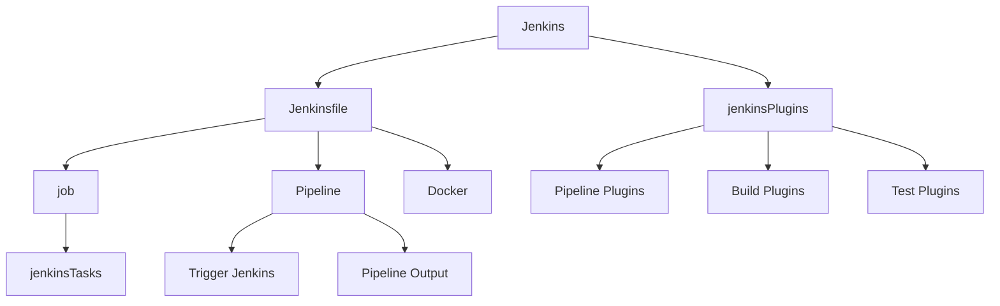

                 

# 持续集成（CI）服务器：Jenkins 和 GitLab CI

> 关键词：持续集成(CI), 自动化测试, 部署, 持续交付, Jenkins, GitLab CI

## 1. 背景介绍

随着软件开发的日益复杂化和团队协作的深入，持续集成(CI)已成为软件开发过程中不可或缺的一部分。它通过自动化测试和部署，确保代码变更可以迅速、可靠地集成到主项目中，提升了开发效率和软件质量。其中，持续集成服务器是CI系统的核心组成部分，负责调度和协调自动化流程，本文将介绍两种常用的CI服务器：Jenkins和GitLab CI，并对比其优缺点及应用场景。

## 2. 核心概念与联系

### 2.1 核心概念概述

- **持续集成（Continuous Integration, CI）**：指将代码变更频繁集成到主项目中，并通过自动化测试保证软件质量。
- **持续交付（Continuous Delivery, CD）**：在CI基础上，进一步自动化部署流程，使软件能够快速、可靠地发布到生产环境。
- **持续部署（Continuous Deployment）**：CD的最终目标，即代码变更自动部署到生产环境，无需人工干预。

- **Jenkins**：一个开源的自动化服务器，支持多种插件和插件管理机制，适用于小型到中型项目。
- **GitLab CI**：GitLab自带的原生CI系统，与GitLab紧密集成，适用于中大型项目。

### 2.2 核心概念原理和架构的 Mermaid 流程图



## 3. 核心算法原理 & 具体操作步骤

### 3.1 算法原理概述

Jenkins和GitLab CI的原理核心是自动化执行预定义的流程，通过定时触发、事件触发等方式启动任务，执行自动化脚本和测试，生成报告和日志。

Jenkins的核心是Jenkinsfile，一个包含自动化脚本的文本文件，用于定义各个任务的执行顺序和依赖关系。而GitLab CI则直接与GitLab仓库关联，通过.gitlab-ci.yml文件来定义CI/CD流程。

### 3.2 算法步骤详解

#### 3.2.1 Jenkins的配置与使用

1. **环境搭建**：下载Jenkins并启动，配置Jenkins环境，包括安装插件、设置用户权限等。

2. **Jenkinsfile编写**：编写Jenkinsfile，定义任务的执行顺序和依赖关系，例如：
   ```groovy
   pipeline {
       agent any
      触发方式 {
           trigger 'pull'
      }
       stages {
           stage('编译') {
               steps {
                   sh 'mvn install'
               }
           }
           stage('测试') {
               steps {
                   sh 'mvn test'
               }
           }
           stage('部署') {
               steps {
                   withCredentials([file('config.properties')]) {
                       sh 'mvn deploy'
                   }
               }
           }
       }
   }
   ```

3. **触发执行**：配置触发方式（定时触发、手动触发、Git推送触发等），并设置触发条件和执行计划。

4. **执行与监控**：通过Web界面或命令行执行Jenkins任务，并监控执行进度和日志。

#### 3.2.2 GitLab CI的配置与使用

1. **环境搭建**：在GitLab项目中启用CI/CD，配置CI/CD令牌和仓库，安装GitLab CI插件。

2. **.gitlab-ci.yml编写**：编写.gitlab-ci.yml文件，定义CI/CD流程，例如：
   ```yaml
   stages:
     - build
     - test
     - deploy

   build:
     stage: build
     script:
       - echo 'Building the project...'
       - mvn install

   test:
     stage: test
     script:
       - echo 'Testing the project...'
       - mvn test

   deploy:
     stage: deploy
     script:
       - echo 'Deploying the project...'
       - mvn deploy
   ```

3. **触发执行**：通过Git Push或手动触发，执行.gitlab-ci.yml中的任务，GitLab CI将自动检测、执行并生成报告。

4. **执行与监控**：通过GitLab界面或CI/CD Pipeline查看执行情况，监控任务进度和日志。

### 3.3 算法优缺点

**Jenkins的优缺点**：
- **优点**：开源免费，高度定制化，支持丰富的插件，适用于多种编程语言和框架。
- **缺点**：界面复杂，学习曲线陡峭，配置繁琐，安全性较弱，资源占用较高。

**GitLab CI的优缺点**：
- **优点**：与GitLab深度集成，易于管理，支持丰富的CI/CD功能，安全性高，资源管理高效。
- **缺点**：部分功能需要付费，配置相对简单，灵活性稍逊于Jenkins。

### 3.4 算法应用领域

Jenkins和GitLab CI在实际应用中有着广泛的应用场景：

- **小型到中型项目**：Jenkins由于其高度定制化和插件丰富的特性，适合处理复杂的多语言、多框架项目，如Spring、Node.js等。
- **中大型项目**：GitLab CI则以其与GitLab的紧密集成，适合处理复杂的软件工程项目，如DevOps、CI/CD管道等。

## 4. 数学模型和公式 & 详细讲解 & 举例说明

### 4.1 数学模型构建

Jenkins和GitLab CI的配置和执行逻辑可以抽象为一个简单的数学模型，其中任务、阶段和触发条件是模型的关键元素。

以Jenkins为例，其配置文件Jenkinsfile可以看作是一个任务执行的函数，每个任务定义为一个函数，函数体内执行具体的命令或脚本。任务的执行顺序和依赖关系则通过函数之间的调用关系来表示。

### 4.2 公式推导过程

假设有N个任务，每个任务需要执行M个阶段，每个阶段的任务数为S，则Jenkinsfile的任务执行总次数T可以表示为：

$$
T = N \times \left( \sum_{i=1}^M S_i \right)
$$

其中，$S_i$表示第i个阶段的任务数。

对于GitLab CI，其配置文件.gitlab-ci.yml则可以看作是一个函数序列，每个函数代表一个阶段，函数体内定义了该阶段的测试任务。任务的执行顺序和依赖关系则通过函数之间的调用关系和变量依赖关系来表示。

### 4.3 案例分析与讲解

以Spring Boot项目为例，Jenkins和GitLab CI的配置文件分别如下：

**Jenkinsfile**：
```groovy
pipeline {
    agent any
    trigger 'pull'
    stages {
        stage('编译') {
            steps {
                sh 'mvn install'
            }
        }
        stage('测试') {
            steps {
                sh 'mvn test'
            }
        }
        stage('部署') {
            steps {
                withCredentials([file('config.properties')]) {
                    sh 'mvn deploy'
                }
            }
        }
    }
}
```

**.gitlab-ci.yml**：
```yaml
stages:
  - build
  - test
  - deploy

build:
  stage: build
  script:
    - echo 'Building the project...'
    - mvn install

test:
  stage: test
  script:
    - echo 'Testing the project...'
    - mvn test

deploy:
  stage: deploy
  script:
    - echo 'Deploying the project...'
    - mvn deploy
```

两个配置文件的功能基本一致，都定义了编译、测试和部署三个阶段的自动化任务，但具体实现方式有所不同。Jenkinsfile使用pipeline结构，通过触发器和stage定义任务执行顺序，而.gitlab-ci.yml使用stage和script定义任务执行流程。

## 5. 项目实践：代码实例和详细解释说明

### 5.1 开发环境搭建

#### 5.1.1 Jenkins环境搭建

1. **下载Jenkins**：从官网下载最新版本的Jenkins，并解压缩到指定目录。
2. **安装Jenkins**：执行Jenkins的启动脚本，启动Jenkins服务。
3. **配置Jenkins**：配置Jenkins环境，包括安装插件、设置用户权限等。

#### 5.1.2 GitLab CI环境搭建

1. **登录GitLab**：登录GitLab，创建项目并启用CI/CD。
2. **配置CI/CD令牌**：在项目的CI/CD配置页面，配置CI/CD令牌。
3. **安装GitLab CI插件**：安装并配置GitLab CI插件。

### 5.2 源代码详细实现

#### 5.2.1 Jenkins实现

1. **编写Jenkinsfile**：根据项目需求编写Jenkinsfile，定义任务和执行顺序。
2. **配置触发方式**：在Jenkins界面配置触发方式，设置定时触发、手动触发或Git推送触发。
3. **执行任务**：通过Web界面或命令行执行Jenkins任务，并监控执行进度和日志。

#### 5.2.2 GitLab CI实现

1. **编写.gitlab-ci.yml**：根据项目需求编写.gitlab-ci.yml文件，定义CI/CD流程。
2. **配置触发条件**：在GitLab界面配置触发条件，设置定时触发或Git推送触发。
3. **执行任务**：通过GitLab界面或CI/CD Pipeline查看执行情况，监控任务进度和日志。

### 5.3 代码解读与分析

**Jenkins任务执行顺序**：

- **编译任务**：通过`sh 'mvn install'`执行Maven编译命令，确保代码变更正确编译。
- **测试任务**：通过`sh 'mvn test'`执行Maven测试命令，确保代码变更通过自动化测试。
- **部署任务**：通过`sh 'mvn deploy'`执行Maven部署命令，确保代码变更成功部署到生产环境。

**GitLab CI任务执行流程**：

- **build**：通过`mvn install`执行编译命令，确保代码变更正确编译。
- **test**：通过`mvn test`执行测试命令，确保代码变更通过自动化测试。
- **deploy**：通过`mvn deploy`执行部署命令，确保代码变更成功部署到生产环境。

### 5.4 运行结果展示

通过Jenkins和GitLab CI执行上述任务，可以得到以下结果：

- Jenkins：通过Web界面查看任务执行进度和日志，可以通过Pipeline Dashboard监控执行情况。
- GitLab CI：通过CI/CD Pipeline查看任务执行进度和日志，可以通过Pipeline Graph和Pipeline Statistic监控执行情况。

## 6. 实际应用场景

### 6.1 持续集成(CI)

在软件开发过程中，持续集成(CI)扮演着重要角色，通过自动化测试和构建，确保代码变更可以及时集成到主项目中，提升开发效率和软件质量。

- **Jenkins**：适用于小型到中型项目，支持高度定制化的自动化流程，适用于复杂的多语言、多框架项目。
- **GitLab CI**：适用于中大型项目，与GitLab深度集成，易于管理和配置，适用于复杂的软件工程项目。

### 6.2 持续交付(CD)

持续交付(CD)是CI的高级形式，通过自动化部署流程，使软件能够快速、可靠地发布到生产环境。

- **Jenkins**：通过Jenkins Pipeline和Pipeline Plugins，可以实现复杂的持续交付流程，适用于多语言、多框架项目。
- **GitLab CI**：通过CI/CD Pipeline和CI/CD变量管理，可以实现高效的持续交付流程，适用于中大型项目。

### 6.3 持续部署(DevOps)

持续部署(DevOps)是CD的最终目标，即代码变更自动部署到生产环境，无需人工干预。

- **Jenkins**：通过Jenkins Pipeline和Pipeline Plugins，可以实现复杂的持续部署流程，适用于多语言、多框架项目。
- **GitLab CI**：通过CI/CD Pipeline和CI/CD变量管理，可以实现高效的持续部署流程，适用于中大型项目。

## 7. 工具和资源推荐

### 7.1 学习资源推荐

- **《Jenkins: The Definitive Guide》**：Jenkins的官方文档，包含详细的使用指南和插件文档。
- **《GitLab CI/CD Documentation》**：GitLab的官方文档，包含详细的CI/CD配置和使用指南。
- **《Jenkins Pipeline with Groovy》**：Jenkins Pipeline的官方教程，详细讲解了Pipeline的语法和用法。
- **《CI/CD with GitLab CI》**：GitLab CI的官方教程，详细讲解了CI/CD的配置和实践。

### 7.2 开发工具推荐

- **Jenkins**：一个开源的自动化服务器，支持多种插件和插件管理机制，适用于小型到中型项目。
- **GitLab CI**：GitLab自带的原生CI系统，与GitLab深度集成，适用于中大型项目。
- **CI/CD Pipeline**：GitLab的CI/CD Pipeline工具，支持复杂的自动化流程配置和变量管理。
- **Pipeline Plugins**：Jenkins的Pipeline Plugins，支持多种自动化任务和测试框架。

### 7.3 相关论文推荐

- **《Continuous Integration: Processes, Tools and Techniques》**：探讨了CI的流程、工具和技术，介绍了CI的最佳实践。
- **《Continuous Delivery: Reliable Software Releases through Build, Test and Deploy Automation》**：介绍了CI/CD的流程、工具和技术，探讨了CD的最佳实践。
- **《Jenkins: The Ultimate Guide》**：详细介绍了Jenkins的使用和最佳实践，探讨了Jenkins的配置和管理。
- **《GitLab CI/CD: Master Your CI/CD Pipeline》**：详细介绍了GitLab CI/CD的使用和最佳实践，探讨了CI/CD的配置和管理。

## 8. 总结：未来发展趋势与挑战

### 8.1 研究成果总结

持续集成和持续交付是软件开发的重要实践，Jenkins和GitLab CI是实现CI/CD的最佳工具之一。通过Jenkins和GitLab CI，可以实现高效的自动化测试和部署，提升开发效率和软件质量。

### 8.2 未来发展趋势

未来，持续集成和持续交付将继续成为软件开发的重要实践，Jenkins和GitLab CI也将不断发展，满足更多复杂场景的需求。

- **Jenkins**：将继续完善其插件生态和社区支持，提升配置和管理效率，支持更多新功能和特性。
- **GitLab CI**：将继续与GitLab深度集成，提升CI/CD性能和稳定性，支持更多复杂场景的自动化流程。

### 8.3 面临的挑战

尽管Jenkins和GitLab CI在实际应用中表现出色，但仍面临一些挑战：

- **配置复杂**：Jenkins的配置相对复杂，学习曲线陡峭，需要一定的技术背景。
- **资源占用**：Jenkins和GitLab CI的资源占用较高，需要考虑性能和稳定性问题。
- **安全性**：Jenkins和GitLab CI的安全性需要进一步提升，避免敏感信息泄露和攻击。

### 8.4 研究展望

未来，Jenkins和GitLab CI的研究方向将集中在以下几个方面：

- **配置简化**：简化配置和管理流程，降低学习成本和操作难度。
- **性能优化**：提升性能和稳定性，优化资源占用，提升用户体验。
- **安全性增强**：增强安全防护能力，避免敏感信息泄露和攻击。
- **跨平台支持**：支持更多平台和环境，提升跨平台适配能力。

## 9. 附录：常见问题与解答

**Q1: Jenkins和GitLab CI的区别是什么？**

A: Jenkins和GitLab CI的区别主要在于其架构、集成和社区支持。Jenkins是一个独立的自动化服务器，支持丰富的插件和扩展，适用于小型到中型项目。GitLab CI是GitLab自带的原生CI系统，与GitLab深度集成，适用于中大型项目。

**Q2: Jenkins和GitLab CI哪个更好用？**

A: Jenkins和GitLab CI各有优缺点，选择哪一个取决于具体项目需求。Jenkins支持高度定制化的自动化流程，适用于复杂的多语言、多框架项目。GitLab CI与GitLab深度集成，易于管理和配置，适用于中大型项目。

**Q3: Jenkins和GitLab CI如何进行跨平台支持？**

A: Jenkins和GitLab CI都支持跨平台支持，可以通过插件和配置来实现。Jenkins支持多种操作系统和平台，可以通过配置Jenkins环境来支持不同平台。GitLab CI支持多种操作系统和平台，可以通过设置CI/CD变量和环境变量来实现跨平台支持。

---

作者：禅与计算机程序设计艺术 / Zen and the Art of Computer Programming

