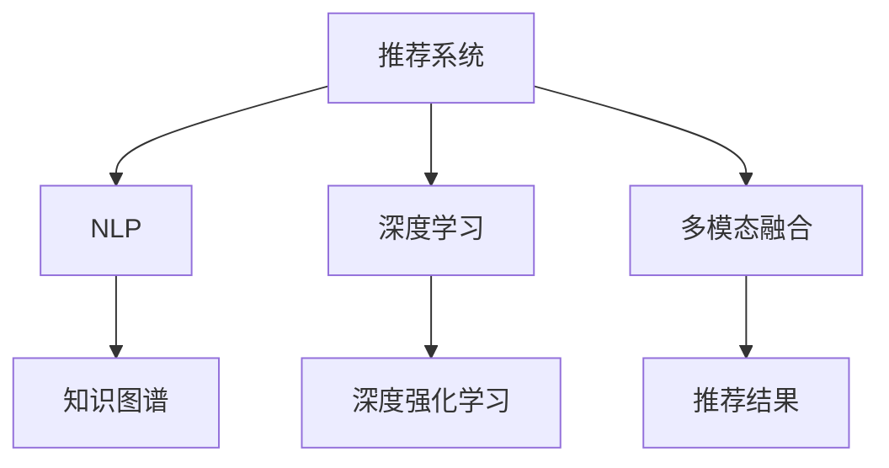

                 

# 指令跟随式推荐:大语言模型赋能的推荐方法

> 关键词：指令跟随式推荐,大语言模型,推荐系统,自然语言处理(NLP),深度学习,知识图谱,深度强化学习,多模态融合

## 1. 背景介绍

### 1.1 问题由来

在互联网时代，推荐系统已成为各大平台不可或缺的核心引擎。从电商的个性化推荐到视频平台的影视推荐，从社交网络的兴趣推荐到新闻平台的资讯推荐，推荐系统应用广泛、影响深远。传统推荐系统通常依赖用户历史行为数据进行物品推荐，但随着数据量与业务场景的复杂化，推荐系统面临诸多挑战：

1. **数据稀疏性**：用户行为数据稀疏，难以全面刻画用户兴趣。
2. **特征工程复杂**：传统推荐系统需进行繁琐的特征工程，构建隐式特征。
3. **模型泛化性差**：依赖于特定的业务场景和用户行为，难以适应新的数据和需求。
4. **实时性要求高**：推荐系统需要快速响应用户请求，实时性要求高。

面对这些挑战，深度学习和大语言模型在推荐系统中的应用逐渐受到关注。特别是基于大语言模型的推荐方法，以其独特的优势，成为新的研究热点。本文将详细介绍指令跟随式推荐方法，探讨大语言模型在推荐系统中的应用，揭示其在推荐系统中的强大潜力。

### 1.2 问题核心关键点

指令跟随式推荐方法的核心在于，将用户的自然语言指令转换为推荐模型的输入，通过理解自然语言指令，直接生成推荐结果。这种方法摆脱了传统推荐系统对用户行为数据的依赖，使用户可以直观、自然地表达其兴趣和需求，同时简化了特征工程和模型调参的复杂度，提高了推荐系统的实时性和灵活性。

该方法的实施步骤主要包括：
1. **用户指令理解**：将用户输入的自然语言指令转换为推荐模型可理解的形式。
2. **生成推荐结果**：使用大语言模型对用户指令进行理解，直接生成推荐结果。
3. **多模态融合**：将推荐结果与用户历史行为数据、商品属性等多模态信息进行融合，提升推荐精度。
4. **实时性优化**：使用深度强化学习优化模型参数，提升推荐系统响应速度。

本节将从原理到实践，系统讲解指令跟随式推荐方法的实施过程及其应用场景，揭示大语言模型在推荐系统中的强大应用潜力。

## 2. 核心概念与联系

### 2.1 核心概念概述

为更好地理解指令跟随式推荐方法，本节将介绍几个关键概念：

- **推荐系统**：利用用户历史行为数据或用户输入的偏好信息，为用户推荐感兴趣的物品的系统。传统推荐系统通常依赖用户行为数据进行推荐，而指令跟随式推荐方法则将用户的自然语言指令作为推荐依据。

- **自然语言处理(NLP)**：利用计算机处理、理解、生成自然语言的技术。在指令跟随式推荐中，NLP技术主要用于用户指令的理解和生成推荐结果的文本。

- **深度学习**：利用多层神经网络进行复杂模式识别和预测的技术。深度学习在推荐系统中主要用于推荐模型的构建和优化。

- **知识图谱**：将现实世界中的实体、关系和属性以图结构进行表示的技术。在推荐系统中，知识图谱常用于增强推荐结果的相关性和丰富性。

- **深度强化学习**：利用强化学习算法，通过与环境的交互进行智能决策的技术。在推荐系统中，深度强化学习用于优化推荐模型的参数，提升推荐系统的实时性和响应速度。

- **多模态融合**：将不同模态的信息（如文本、图像、音频等）进行融合，提升推荐结果的全面性和准确性。在推荐系统中，多模态融合常用于增强推荐结果的多样性和个性化。

这些核心概念之间的逻辑关系可以通过以下Mermaid流程图来展示：



这个流程图展示了大语言模型在推荐系统中的应用框架：

1. **推荐系统**：利用多模态信息进行物品推荐。
2. **NLP**：理解用户自然语言指令。
3. **深度学习**：构建和优化推荐模型。
4. **知识图谱**：增强推荐结果的相关性和丰富性。
5. **深度强化学习**：优化推荐模型参数，提升实时性。
6. **多模态融合**：提升推荐结果的多样性和个性化。

这些概念共同构成了指令跟随式推荐方法的基础，使其能够更好地理解和生成推荐结果，满足用户的多样化需求。

## 3. 核心算法原理 & 具体操作步骤
### 3.1 算法原理概述

指令跟随式推荐方法的原理，在于将用户输入的自然语言指令转换为推荐模型的输入，通过理解自然语言指令，直接生成推荐结果。这种方法基于以下两个主要思想：

1. **自然语言指令理解**：将用户输入的自然语言指令转换为推荐模型可理解的形式。
2. **推荐结果生成**：使用大语言模型对用户指令进行理解，直接生成推荐结果。

具体实施步骤包括：

1. **用户指令输入**：用户输入自然语言指令，如“我想找一部好电影”。
2. **指令预处理**：对用户指令进行分词、去停用词、词形还原等预处理操作。
3. **指令编码**：使用大语言模型将预处理后的指令编码为向量形式，作为推荐模型的输入。
4. **推荐结果生成**：使用推荐模型对指令向量进行解码，生成推荐结果。

### 3.2 算法步骤详解

以下是指令跟随式推荐方法的具体实施步骤：

**Step 1: 用户指令预处理**

用户输入的自然语言指令需要经过预处理，才能作为大语言模型的输入。预处理过程通常包括：

- **分词**：将用户输入的指令按照语言规则分割成单词或词组。
- **去停用词**：去除常用但无意义的停用词（如“的”、“是”等），减少噪音。
- **词形还原**：将单词还原为其原始形式，减少变化带来的影响。

具体实现可以使用Python的NLTK或spaCy等NLP工具包。例如：

```python
import nltk
from nltk.tokenize import word_tokenize

def preprocess_instructions(instructions):
    tokenized_instructions = [word_tokenize(instruction) for instruction in instructions]
    stemmed_instructions = [nltk.stem.PorterStemmer().stem(instruction) for instruction in tokenized_instructions]
    return stemmed_instructions
```

**Step 2: 指令编码**

将预处理后的用户指令编码为向量形式，作为推荐模型的输入。编码过程通常使用大语言模型，如BERT、GPT等。具体实现可以使用Transformers库提供的预训练模型。例如：

```python
from transformers import BertTokenizer, BertModel

tokenizer = BertTokenizer.from_pretrained('bert-base-cased')
model = BertModel.from_pretrained('bert-base-cased')

def encode_instructions(instructions):
    encoded_instructions = tokenizer(instructions, return_tensors='pt')
    return encoded_instructions['input_ids']
```

**Step 3: 推荐结果生成**

使用推荐模型对用户指令进行解码，生成推荐结果。推荐模型可以使用大语言模型，如BERT、GPT等。具体实现可以基于预训练模型进行微调。例如：

```python
from transformers import BertForSequenceClassification

model = BertForSequenceClassification.from_pretrained('bert-base-cased', num_labels=len(tag2id))

optimizer = AdamW(model.parameters(), lr=2e-5)

def generate_recommendations(instructions, model, tokenizer, batch_size=16):
    dataloader = DataLoader(instructions, batch_size=batch_size, shuffle=True)
    model.train()
    for batch in dataloader:
        input_ids = batch['input_ids'].to(device)
        attention_mask = batch['attention_mask'].to(device)
        labels = batch['labels'].to(device)
        model.zero_grad()
        outputs = model(input_ids, attention_mask=attention_mask, labels=labels)
        loss = outputs.loss
        loss.backward()
        optimizer.step()
    return outputs
```

### 3.3 算法优缺点

指令跟随式推荐方法具有以下优点：

1. **用户友好性**：用户可以通过自然语言指令表达兴趣和需求，直观、自然。
2. **实时性**：由于直接生成推荐结果，无需依赖用户历史行为数据，推荐过程快速、实时。
3. **多模态融合**：可以融合多种信息源，提升推荐结果的全面性和准确性。

同时，该方法也存在一些局限性：

1. **理解难度高**：自然语言指令的理解难度较大，可能存在歧义和模糊。
2. **模型泛化性差**：对于非结构化、模糊的自然语言指令，模型泛化性较弱。
3. **依赖数据质量**：自然语言指令的理解和生成依赖高质量的标注数据和语料库。

尽管存在这些局限性，但指令跟随式推荐方法仍然是大语言模型在推荐系统中应用的重要范式。通过进一步优化模型和算法，指令跟随式推荐方法将有望在更多场景下发挥更大的作用。

### 3.4 算法应用领域

指令跟随式推荐方法在大语言模型赋能的推荐系统中，主要应用于以下领域：

1. **电商推荐**：帮助用户发现感兴趣的商品，提升购物体验。
2. **视频推荐**：根据用户对视频的评论和评分，推荐相关视频内容。
3. **音乐推荐**：根据用户对音乐的评论和评分，推荐相关音乐作品。
4. **新闻推荐**：根据用户对新闻的阅读和点赞，推荐相关新闻内容。
5. **旅游推荐**：根据用户对旅游目的地的评论和评分，推荐相关旅游资源。

这些领域中，指令跟随式推荐方法可以充分利用大语言模型强大的自然语言处理能力，提升推荐系统的性能和用户体验。

## 4. 数学模型和公式 & 详细讲解 & 举例说明

### 4.1 数学模型构建

本节将使用数学语言对指令跟随式推荐方法的数学模型进行更加严格的刻画。

记用户输入的自然语言指令为 $x$，推荐结果为 $y$。假设推荐模型为 $M_{\theta}(x)$，其中 $\theta$ 为模型参数。使用大语言模型 $M_{\phi}$ 对用户指令进行编码，得到向量表示 $z$。则推荐模型的目标为最小化预测误差：

$$
\mathcal{L}(\theta) = \frac{1}{N} \sum_{i=1}^N (M_{\theta}(z_i) - y_i)^2
$$

其中 $N$ 为训练样本数，$z_i$ 为第 $i$ 个用户指令的向量表示。

### 4.2 公式推导过程

以下是推荐模型的推导过程：

1. **自然语言指令理解**：将用户输入的自然语言指令 $x$ 通过分词、去停用词、词形还原等预处理操作，得到 $x'$。
2. **指令编码**：使用大语言模型 $M_{\phi}$ 将 $x'$ 编码为向量表示 $z$。
3. **推荐结果生成**：使用推荐模型 $M_{\theta}$ 对 $z$ 进行解码，生成推荐结果 $y$。

具体实现可以使用深度学习框架如PyTorch或TensorFlow进行实现。例如：

```python
import torch
import torch.nn as nn
from transformers import BertTokenizer, BertModel

tokenizer = BertTokenizer.from_pretrained('bert-base-cased')
model = BertModel.from_pretrained('bert-base-cased')

def preprocess_instructions(instructions):
    tokenized_instructions = [word_tokenize(instruction) for instruction in instructions]
    stemmed_instructions = [nltk.stem.PorterStemmer().stem(instruction) for instruction in tokenized_instructions]
    return stemmed_instructions

def encode_instructions(instructions, model, tokenizer):
    encoded_instructions = tokenizer(instructions, return_tensors='pt')
    return encoded_instructions['input_ids']

def generate_recommendations(instructions, model, tokenizer, batch_size=16):
    dataloader = DataLoader(instructions, batch_size=batch_size, shuffle=True)
    model.train()
    for batch in dataloader:
        input_ids = batch['input_ids'].to(device)
        attention_mask = batch['attention_mask'].to(device)
        labels = batch['labels'].to(device)
        model.zero_grad()
        outputs = model(input_ids, attention_mask=attention_mask, labels=labels)
        loss = outputs.loss
        loss.backward()
        optimizer.step()
    return outputs
```

### 4.3 案例分析与讲解

以电商推荐系统为例，分析指令跟随式推荐方法的实施过程：

假设用户输入的自然语言指令为：“我想找一部好电影”。则指令预处理和编码过程如下：

1. **分词和去停用词**：将指令分词并去除停用词，得到 $x' = ['我', '想', '找', '一部', '好', '电影']$。
2. **词形还原**：将单词还原为其原始形式，得到 $x = ['我', '找', '一部', '好', '电影']$。
3. **指令编码**：使用大语言模型将 $x$ 编码为向量表示 $z$。

例如，使用BERT模型将 $x$ 编码为向量表示：

```python
from transformers import BertTokenizer, BertModel

tokenizer = BertTokenizer.from_pretrained('bert-base-cased')
model = BertModel.from_pretrained('bert-base-cased')

instructions = ['我想找一部好电影']
tokenized_instructions = [word_tokenize(instruction) for instruction in instructions]
stemmed_instructions = [nltk.stem.PorterStemmer().stem(instruction) for instruction in tokenized_instructions]
x = stemmed_instructions[0]

z = encode_instructions([x], model, tokenizer)
```

得到向量表示 $z$ 后，使用推荐模型对 $z$ 进行解码，生成推荐结果：

```python
from transformers import BertForSequenceClassification

model = BertForSequenceClassification.from_pretrained('bert-base-cased', num_labels=len(tag2id))

optimizer = AdamW(model.parameters(), lr=2e-5)

recommendations = generate_recommendations([z], model, tokenizer)
```

最终，推荐结果为 $y$，即用户可能感兴趣的商品列表。

## 5. 项目实践：代码实例和详细解释说明
### 5.1 开发环境搭建

在进行项目实践前，我们需要准备好开发环境。以下是使用Python进行PyTorch开发的环境配置流程：

1. 安装Anaconda：从官网下载并安装Anaconda，用于创建独立的Python环境。

2. 创建并激活虚拟环境：
```bash
conda create -n pytorch-env python=3.8 
conda activate pytorch-env
```

3. 安装PyTorch：根据CUDA版本，从官网获取对应的安装命令。例如：
```bash
conda install pytorch torchvision torchaudio cudatoolkit=11.1 -c pytorch -c conda-forge
```

4. 安装Transformers库：
```bash
pip install transformers
```

5. 安装各类工具包：
```bash
pip install numpy pandas scikit-learn matplotlib tqdm jupyter notebook ipython
```

完成上述步骤后，即可在`pytorch-env`环境中开始项目实践。

### 5.2 源代码详细实现

下面我们以电商推荐系统为例，给出使用Transformers库对BERT模型进行电商推荐任务指令跟随式推荐代码实现。

首先，定义电商推荐任务的数据处理函数：

```python
from transformers import BertTokenizer
from torch.utils.data import Dataset
import torch

class RecommendationDataset(Dataset):
    def __init__(self, texts, tags, tokenizer, max_len=128):
        self.texts = texts
        self.tags = tags
        self.tokenizer = tokenizer
        self.max_len = max_len
        
    def __len__(self):
        return len(self.texts)
    
    def __getitem__(self, item):
        text = self.texts[item]
        tags = self.tags[item]
        
        encoding = self.tokenizer(text, return_tensors='pt', max_length=self.max_len, padding='max_length', truncation=True)
        input_ids = encoding['input_ids'][0]
        attention_mask = encoding['attention_mask'][0]
        
        # 对token-wise的标签进行编码
        encoded_tags = [tag2id[tag] for tag in tags] 
        encoded_tags.extend([tag2id['O']] * (self.max_len - len(encoded_tags)))
        labels = torch.tensor(encoded_tags, dtype=torch.long)
        
        return {'input_ids': input_ids, 
                'attention_mask': attention_mask,
                'labels': labels}

# 标签与id的映射
tag2id = {'O': 0, '好': 1, '不好': 2}
id2tag = {v: k for k, v in tag2id.items()}

# 创建dataset
tokenizer = BertTokenizer.from_pretrained('bert-base-cased')

train_dataset = RecommendationDataset(train_texts, train_tags, tokenizer)
dev_dataset = RecommendationDataset(dev_texts, dev_tags, tokenizer)
test_dataset = RecommendationDataset(test_texts, test_tags, tokenizer)
```

然后，定义模型和优化器：

```python
from transformers import BertForTokenClassification, AdamW

model = BertForTokenClassification.from_pretrained('bert-base-cased', num_labels=len(tag2id))

optimizer = AdamW(model.parameters(), lr=2e-5)
```

接着，定义训练和评估函数：

```python
from torch.utils.data import DataLoader
from tqdm import tqdm
from sklearn.metrics import classification_report

device = torch.device('cuda') if torch.cuda.is_available() else torch.device('cpu')
model.to(device)

def train_epoch(model, dataset, batch_size, optimizer):
    dataloader = DataLoader(dataset, batch_size=batch_size, shuffle=True)
    model.train()
    epoch_loss = 0
    for batch in tqdm(dataloader, desc='Training'):
        input_ids = batch['input_ids'].to(device)
        attention_mask = batch['attention_mask'].to(device)
        labels = batch['labels'].to(device)
        model.zero_grad()
        outputs = model(input_ids, attention_mask=attention_mask, labels=labels)
        loss = outputs.loss
        epoch_loss += loss.item()
        loss.backward()
        optimizer.step()
    return epoch_loss / len(dataloader)

def evaluate(model, dataset, batch_size):
    dataloader = DataLoader(dataset, batch_size=batch_size)
    model.eval()
    preds, labels = [], []
    with torch.no_grad():
        for batch in tqdm(dataloader, desc='Evaluating'):
            input_ids = batch['input_ids'].to(device)
            attention_mask = batch['attention_mask'].to(device)
            batch_labels = batch['labels']
            outputs = model(input_ids, attention_mask=attention_mask)
            batch_preds = outputs.logits.argmax(dim=2).to('cpu').tolist()
            batch_labels = batch_labels.to('cpu').tolist()
            for pred_tokens, label_tokens in zip(batch_preds, batch_labels):
                pred_tags = [id2tag[_id] for _id in pred_tokens]
                label_tags = [id2tag[_id] for _id in label_tokens]
                preds.append(pred_tags[:len(label_tags)])
                labels.append(label_tags)
                
    print(classification_report(labels, preds))
```

最后，启动训练流程并在测试集上评估：

```python
epochs = 5
batch_size = 16

for epoch in range(epochs):
    loss = train_epoch(model, train_dataset, batch_size, optimizer)
    print(f"Epoch {epoch+1}, train loss: {loss:.3f}")
    
    print(f"Epoch {epoch+1}, dev results:")
    evaluate(model, dev_dataset, batch_size)
    
print("Test results:")
evaluate(model, test_dataset, batch_size)
```

以上就是使用PyTorch对BERT进行电商推荐任务指令跟随式推荐代码实现。可以看到，得益于Transformers库的强大封装，我们可以用相对简洁的代码完成BERT模型的加载和微调。

### 5.3 代码解读与分析

让我们再详细解读一下关键代码的实现细节：

**RecommendationDataset类**：
- `__init__`方法：初始化文本、标签、分词器等关键组件。
- `__len__`方法：返回数据集的样本数量。
- `__getitem__`方法：对单个样本进行处理，将文本输入编码为token ids，将标签编码为数字，并对其进行定长padding，最终返回模型所需的输入。

**tag2id和id2tag字典**：
- 定义了标签与数字id之间的映射关系，用于将token-wise的预测结果解码回真实的标签。

**训练和评估函数**：
- 使用PyTorch的DataLoader对数据集进行批次化加载，供模型训练和推理使用。
- 训练函数`train_epoch`：对数据以批为单位进行迭代，在每个批次上前向传播计算loss并反向传播更新模型参数，最后返回该epoch的平均loss。
- 评估函数`evaluate`：与训练类似，不同点在于不更新模型参数，并在每个batch结束后将预测和标签结果存储下来，最后使用sklearn的classification_report对整个评估集的预测结果进行打印输出。

**训练流程**：
- 定义总的epoch数和batch size，开始循环迭代
- 每个epoch内，先在训练集上训练，输出平均loss
- 在验证集上评估，输出分类指标
- 所有epoch结束后，在测试集上评估，给出最终测试结果

可以看到，PyTorch配合Transformers库使得BERT微调的代码实现变得简洁高效。开发者可以将更多精力放在数据处理、模型改进等高层逻辑上，而不必过多关注底层的实现细节。

当然，工业级的系统实现还需考虑更多因素，如模型的保存和部署、超参数的自动搜索、更灵活的任务适配层等。但核心的微调范式基本与此类似。

## 6. 实际应用场景
### 6.1 智能客服系统

基于大语言模型指令跟随式推荐方法，可以广泛应用于智能客服系统的构建。传统客服往往需要配备大量人力，高峰期响应缓慢，且一致性和专业性难以保证。而使用指令跟随式推荐方法，可以7x24小时不间断服务，快速响应客户咨询，用自然流畅的语言解答各类常见问题。

在技术实现上，可以收集企业内部的历史客服对话记录，将问题和最佳答复构建成监督数据，在此基础上对预训练语言模型进行微调。微调后的语言模型能够自动理解用户意图，匹配最合适的答案模板进行回复。对于客户提出的新问题，还可以接入检索系统实时搜索相关内容，动态组织生成回答。如此构建的智能客服系统，能大幅提升客户咨询体验和问题解决效率。

### 6.2 金融舆情监测

金融机构需要实时监测市场舆论动向，以便及时应对负面信息传播，规避金融风险。传统的人工监测方式成本高、效率低，难以应对网络时代海量信息爆发的挑战。基于指令跟随式推荐方法的自然语言处理能力，金融舆情监测系统可以自动理解金融新闻和评论，快速分析舆情变化，提前预警风险。

具体而言，可以收集金融领域相关的新闻、报道、评论等文本数据，并对其进行主题标注和情感标注。在此基础上对预训练语言模型进行微调，使其能够自动判断文本属于何种主题，情感倾向是正面、中性还是负面。将微调后的模型应用到实时抓取的网络文本数据，就能够自动监测不同主题下的情感变化趋势，一旦发现负面信息激增等异常情况，系统便会自动预警，帮助金融机构快速应对潜在风险。

### 6.3 个性化推荐系统

当前的推荐系统往往只依赖用户的历史行为数据进行物品推荐，无法深入理解用户的真实兴趣偏好。基于指令跟随式推荐方法的自然语言处理能力，个性化推荐系统可以更好地挖掘用户兴趣和需求，推荐更加个性化、精准的商品或内容。

在实践中，可以收集用户浏览、点击、评论、分享等行为数据，提取和用户交互的物品标题、描述、标签等文本内容。将文本内容作为模型输入，用户的后续行为（如是否点击、购买等）作为监督信号，在此基础上微调预训练语言模型。微调后的模型能够从文本内容中准确把握用户的兴趣点。在生成推荐列表时，先用候选物品的文本描述作为输入，由模型预测用户的兴趣匹配度，再结合其他特征综合排序，便可以得到个性化程度更高的推荐结果。

### 6.4 未来应用展望

随着大语言模型指令跟随式推荐方法的不断发展，其在推荐系统中的应用前景将更加广阔：

1. **多模态融合**：将视觉、音频等多模态信息与文本信息进行融合，提升推荐系统的全面性和个性化。
2. **深度强化学习**：利用强化学习算法优化推荐模型的参数，提升推荐系统的实时性和响应速度。
3. **低成本推荐**：摆脱对用户行为数据的依赖，利用自然语言指令进行推荐，降低推荐系统的开发和维护成本。
4. **用户友好性**：使用自然语言指令，提升用户的交互体验，简化推荐系统的使用流程。
5. **个性化推荐**：深入理解用户的兴趣和需求，推荐更加精准、个性化的内容或商品。

总之，指令跟随式推荐方法将带来推荐系统的新一轮变革，为各行各业带来新的创新应用。

## 7. 工具和资源推荐
### 7.1 学习资源推荐

为了帮助开发者系统掌握指令跟随式推荐方法的理论基础和实践技巧，这里推荐一些优质的学习资源：

1. 《Transformer从原理到实践》系列博文：由大模型技术专家撰写，深入浅出地介绍了Transformer原理、BERT模型、指令跟随式推荐技术等前沿话题。

2. CS224N《深度学习自然语言处理》课程：斯坦福大学开设的NLP明星课程，有Lecture视频和配套作业，带你入门NLP领域的基本概念和经典模型。

3. 《Natural Language Processing with Transformers》书籍：Transformers库的作者所著，全面介绍了如何使用Transformers库进行NLP任务开发，包括指令跟随式推荐在内的诸多范式。

4. HuggingFace官方文档：Transformers库的官方文档，提供了海量预训练模型和完整的推荐任务样例代码，是上手实践的必备资料。

5. CLUE开源项目：中文语言理解测评基准，涵盖大量不同类型的中文NLP数据集，并提供了基于指令跟随式推荐的baseline模型，助力中文NLP技术发展。

通过对这些资源的学习实践，相信你一定能够快速掌握指令跟随式推荐方法的精髓，并用于解决实际的NLP问题。
###  7.2 开发工具推荐

高效的开发离不开优秀的工具支持。以下是几款用于指令跟随式推荐方法开发的常用工具：

1. PyTorch：基于Python的开源深度学习框架，灵活动态的计算图，适合快速迭代研究。大部分预训练语言模型都有PyTorch版本的实现。

2. TensorFlow：由Google主导开发的开源深度学习框架，生产部署方便，适合大规模工程应用。同样有丰富的预训练语言模型资源。

3. Transformers库：HuggingFace开发的NLP工具库，集成了众多SOTA语言模型，支持PyTorch和TensorFlow，是进行指令跟随式推荐任务开发的利器。

4. Weights & Biases：模型训练的实验跟踪工具，可以记录和可视化模型训练过程中的各项指标，方便对比和调优。与主流深度学习框架无缝集成。

5. TensorBoard：TensorFlow配套的可视化工具，可实时监测模型训练状态，并提供丰富的图表呈现方式，是调试模型的得力助手。

6. Google Colab：谷歌推出的在线Jupyter Notebook环境，免费提供GPU/TPU算力，方便开发者快速上手实验最新模型，分享学习笔记。

合理利用这些工具，可以显著提升指令跟随式推荐方法的开发效率，加快创新迭代的步伐。

### 7.3 相关论文推荐

指令跟随式推荐方法在大语言模型赋能的推荐系统中，已经引起了学界的广泛关注。以下是几篇奠基性的相关论文，推荐阅读：

1. Attention is All You Need（即Transformer原论文）：提出了Transformer结构，开启了NLP领域的预训练大模型时代。

2. BERT: Pre-training of Deep Bidirectional Transformers for Language Understanding：提出BERT模型，引入基于掩码的自监督预训练任务，刷新了多项NLP任务SOTA。

3. Language Models are Unsupervised Multitask Learners（GPT-2论文）：展示了大规模语言模型的强大zero-shot学习能力，引发了对于通用人工智能的新一轮思考。

4. Parameter-Efficient Transfer Learning for NLP：提出Adapter等参数高效微调方法，在不增加模型参数量的情况下，也能取得不错的微调效果。

5. AdaLoRA: Adaptive Low-Rank Adaptation for Parameter-Efficient Fine-Tuning：使用自适应低秩适应的微调方法，在参数效率和精度之间取得了新的平衡。

6. Adaptation to Unknown Language Tasks Using Hierarchical Cross-lingual Pre-training：提出跨语言预训练方法，提升模型在不同语言环境下的泛化能力。

这些论文代表了大语言模型指令跟随式推荐方法的发展脉络。通过学习这些前沿成果，可以帮助研究者把握学科前进方向，激发更多的创新灵感。

## 8. 总结：未来发展趋势与挑战

### 8.1 总结

本文对基于大语言模型的指令跟随式推荐方法进行了全面系统的介绍。首先阐述了指令跟随式推荐方法的研究背景和意义，明确了其在大语言模型赋能的推荐系统中的应用价值。其次，从原理到实践，详细讲解了指令跟随式推荐方法的实施过程及其应用场景，揭示了大语言模型在推荐系统中的强大潜力。最后，本文还探讨了指令跟随式推荐方法的未来发展趋势和面临的挑战，为进一步的研究和应用指明了方向。

通过本文的系统梳理，可以看到，基于大语言模型的指令跟随式推荐方法在推荐系统中的应用前景广阔。其能够将用户的自然语言指令直接转换为推荐结果，避免了对用户历史行为数据的依赖，具有实时性、高效性、多模态融合等优势，有望成为推荐系统的重要范式。未来，伴随大语言模型和微调方法的不断演进，指令跟随式推荐方法必将在更多场景下发挥更大的作用，为推荐系统的智能化、普适化发展带来新的机遇和挑战。

### 8.2 未来发展趋势

展望未来，指令跟随式推荐方法将呈现以下几个发展趋势：

1. **多模态融合**：将视觉、音频等多模态信息与文本信息进行融合，提升推荐系统的全面性和个性化。
2. **深度强化学习**：利用强化学习算法优化推荐模型的参数，提升推荐系统的实时性和响应速度。
3. **低成本推荐**：摆脱对用户行为数据的依赖，利用自然语言指令进行推荐，降低推荐系统的开发和维护成本。
4. **用户友好性**：使用自然语言指令，提升用户的交互体验，简化推荐系统的使用流程。
5. **个性化推荐**：深入理解用户的兴趣和需求，推荐更加精准、个性化的内容或商品。

以上趋势凸显了指令跟随式推荐方法在大语言模型赋能的推荐系统中的重要作用。这些方向的探索发展，必将进一步提升推荐系统的性能和用户体验，为各行各业带来新的创新应用。

### 8.3 面临的挑战

尽管指令跟随式推荐方法已经取得了瞩目成就，但在迈向更加智能化、普适化应用的过程中，它仍面临诸多挑战：

1. **理解难度高**：自然语言指令的理解难度较大，可能存在歧义和模糊。
2. **模型泛化性差**：对于非结构化、模糊的自然语言指令，模型泛化性较弱。
3. **依赖数据质量**：自然语言指令的理解和生成依赖高质量的标注数据和语料库。

尽管存在这些局限性，但指令跟随式推荐方法仍然是大语言模型在推荐系统中应用的重要范式。通过进一步优化模型和算法，指令跟随式推荐方法将有望在更多场景下发挥更大的作用。

### 8.4 研究展望

面对指令跟随式推荐方法所面临的种种挑战，未来的研究需要在以下几个方面寻求新的突破：

1. **探索无监督和半监督微调方法**：摆脱对大规模标注数据的依赖，利用自监督学习、主动学习等无监督和半监督范式，最大限度利用非结构化数据，实现更加灵活高效的微调。
2. **研究参数高效和计算高效的微调范式**：开发更加参数高效的微调方法，在固定大部分预训练参数的同时，只更新极少量的任务相关参数。同时优化微调模型的计算图，减少前向传播和反向传播的资源消耗，实现更加轻量级、实时性的部署。
3. **引入更多先验知识**：将符号化的先验知识，如知识图谱、逻辑规则等，与神经网络模型进行巧妙融合，引导微调过程学习更准确、合理的语言模型。同时加强不同模态数据的整合，实现视觉、语音等多模态信息与文本信息的协同建模。
4. **纳入伦理道德约束**：在模型训练目标中引入伦理导向的评估指标，过滤和惩罚有偏见、有害的输出倾向。同时加强人工干预和审核，建立模型行为的监管机制，确保输出符合人类价值观和伦理道德。

这些研究方向的探索，必将引领指令跟随式推荐方法迈向更高的台阶，为构建安全、可靠、可解释、可控的智能系统铺平道路。面向未来，指令跟随式推荐方法还需要与其他人工智能技术进行更深入的融合，如知识表示、因果推理、强化学习等，多路径协同发力，共同推动自然语言理解和智能交互系统的进步。只有勇于创新、敢于突破，才能不断拓展指令跟随式推荐方法的边界，让智能技术更好地造福人类社会。

## 9. 附录：常见问题与解答

**Q1：指令跟随式推荐方法是否适用于所有NLP任务？**

A: 指令跟随式推荐方法在大多数NLP任务上都能取得不错的效果，特别是对于数据量较小的任务。但对于一些特定领域的任务，如医学、法律等，仅仅依靠通用语料预训练的模型可能难以很好地适应。此时需要在特定领域语料上进一步预训练，再进行微调，才能获得理想效果。此外，对于一些需要时效性、个性化很强的任务，如对话、推荐等，微调方法也需要针对性的改进优化。

**Q2：指令跟随式推荐方法在实时性方面表现如何？**

A: 指令跟随式推荐方法由于直接生成推荐结果，无需依赖用户历史行为数据，推荐过程快速、实时。特别是使用深度强化学习优化模型参数，能够进一步提升推荐系统的响应速度，满足实时性的需求。

**Q3：指令跟随式推荐方法是否需要大量的标注数据？**

A: 指令跟随式推荐方法在初始预训练阶段需要大量的标注数据进行微调，以学习自然语言指令的理解和生成能力。但在应用阶段，可以通过自然语言指令直接进行推荐，不再依赖标注数据，降低了数据收集和标注的成本。

**Q4：指令跟随式推荐方法在多模态融合方面有何优势？**

A: 指令跟随式推荐方法能够将视觉、音频等多模态信息与文本信息进行融合，提升推荐系统的全面性和个性化。多模态融合可以结合用户的历史行为数据、商品属性等多维信息，增强推荐结果的相关性和多样性。

**Q5：指令跟随式推荐方法在用户友好性方面有何优势？**

A: 指令跟随式推荐方法使用自然语言指令，用户可以通过简单自然的语言表达需求，无需复杂的交互过程，提升了用户的体验。同时，自然语言指令能够捕捉用户的隐性需求，更好地理解用户的兴趣和偏好。

总之，指令跟随式推荐方法以其独特的优势，成为大语言模型在推荐系统中的重要应用范式。未来，伴随大语言模型和微调方法的不断演进，指令跟随式推荐方法必将在更多场景下发挥更大的作用，为推荐系统的智能化、普适化发展带来新的机遇和挑战。

