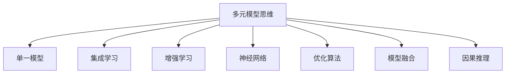

                 

# 掌握多元模型思维助力管理者洞见

## 1. 背景介绍

### 1.1 问题由来

在当今快速变化的商业环境中，企业面临着巨大的市场不确定性和竞争压力。管理者需要做出明智的决策，以应对多变的环境，确保企业能够长期稳定发展。然而，仅仅依赖直觉和经验往往不足以应对复杂局面，需要依赖数据和计算模型来辅助决策。传统的统计模型、机器学习模型等单一模型工具，难以捕捉到多因素之间的复杂关系，无法提供全面的决策支持。

### 1.2 问题核心关键点

如何利用多元模型思维，整合多源数据和多种模型，构建一个全面的决策支持系统，成为管理者面临的关键问题。多元模型思维指采用多个不同类型的模型，通过组合和融合，获得更加全面、精准的决策洞见。这种思维方法能够帮助管理者更全面、深入地理解问题，从而做出更科学、更合理的决策。

### 1.3 问题研究意义

掌握多元模型思维，对于提升管理者的决策能力和企业竞争力具有重要意义：

1. **提升决策准确性**：通过多模型融合，管理者可以获得更全面、更客观的决策信息，降低决策偏差。
2. **增强决策鲁棒性**：多元模型可以相互验证，降低单一模型误导风险，增强决策的鲁棒性和可靠性。
3. **促进跨学科融合**：多元模型思维可以促进不同学科知识和方法的融合，拓宽管理者的视野和思路。
4. **支持实时动态决策**：多元模型可以实时动态更新，快速响应环境变化，确保决策的时效性。

## 2. 核心概念与联系

### 2.1 核心概念概述

为了更好地理解多元模型思维，我们首先介绍几个核心概念：

- **多元模型思维**：通过组合和融合多个不同类型的模型，获得更加全面、精准的决策洞见。
- **单一模型**：如线性回归、决策树、神经网络等，用于独立分析某一特定问题。
- **集成学习**：通过组合多个单一模型，获得比单一模型更强的泛化能力。
- **增强学习**：通过不断调整模型参数，使模型在交互中不断优化，适应环境和任务的变化。
- **神经网络**：通过多层非线性变换，自动提取特征，进行复杂模式的建模和预测。
- **优化算法**：如梯度下降、遗传算法等，用于模型参数的优化，提高模型性能。
- **模型融合**：通过组合不同模型，获得更强的预测能力和泛化能力。
- **因果推理**：通过分析因果关系，理解变量间的真实影响，避免决策偏差。

这些概念之间的逻辑关系可以通过以下Mermaid流程图来展示：



这个流程图展示了这个系统的核心概念及其之间的关系：

1. 多元模型思维作为整体系统，通过组合和融合不同模型，提供全面的决策支持。
2. 单一模型用于独立分析特定问题，提供初步洞察。
3. 集成学习通过组合多个单一模型，提高泛化能力。
4. 增强学习通过模型参数调整，适应环境和任务变化。
5. 神经网络通过多层非线性变换，提取特征进行复杂建模。
6. 优化算法用于模型参数优化，提高性能。
7. 模型融合通过组合不同模型，获得更强的预测和泛化能力。
8. 因果推理通过分析因果关系，理解变量间的真实影响，避免决策偏差。

## 3. 核心算法原理 & 具体操作步骤
### 3.1 算法原理概述

多元模型思维的核心原理是通过组合和融合多个不同类型的模型，获得更加全面、精准的决策洞见。这一过程可以分为以下几个关键步骤：

1. **模型选择与设计**：根据问题类型和数据特点，选择合适的单一模型。
2. **模型训练与优化**：对单一模型进行训练和参数优化，获得初始模型。
3. **模型组合与融合**：通过组合和融合不同模型，获得复合模型。
4. **模型评估与验证**：通过测试集和实际数据，评估复合模型的性能和泛化能力。
5. **实时动态优化**：根据新数据和环境变化，实时动态更新模型，确保决策的及时性和准确性。

### 3.2 算法步骤详解

以下详细介绍多元模型思维的具体操作流程：

#### 3.2.1 模型选择与设计

根据问题类型和数据特点，选择合适的单一模型：

- **回归问题**：选择线性回归、岭回归、LASSO回归等，用于预测连续变量。
- **分类问题**：选择逻辑回归、决策树、随机森林、支持向量机等，用于预测离散变量。
- **聚类问题**：选择K-Means、层次聚类、DBSCAN等，用于发现数据中的群组结构。
- **异常检测**：选择孤立森林、One-Class SVM等，用于识别异常点。
- **神经网络**：选择前馈神经网络、卷积神经网络、循环神经网络等，用于处理复杂非线性问题。

#### 3.2.2 模型训练与优化

对单一模型进行训练和参数优化，获得初始模型：

1. **回归模型训练**：使用最小二乘法、梯度下降等算法，最小化预测误差。
2. **分类模型训练**：使用交叉熵损失、对数损失等，最小化分类误差。
3. **聚类模型训练**：通过计算欧式距离、余弦相似度等，最小化聚类误差。
4. **神经网络训练**：使用反向传播算法，最小化损失函数。
5. **优化算法选择**：根据模型特性，选择适当的优化算法，如梯度下降、Adam、Adagrad等。

#### 3.2.3 模型组合与融合

通过组合和融合不同模型，获得复合模型：

1. **集成学习**：通过投票、平均、堆叠等方法，组合多个单一模型的预测结果。
2. **模型融合**：使用Stacking、Bagging、Boosting等方法，融合不同模型的特征。
3. **神经网络融合**：通过Stacked Generalization、Ensemble Learning等方法，融合多个神经网络的输出。
4. **因果推理融合**：通过因果图、因果树等方法，融合不同模型的因果关系。

#### 3.2.4 模型评估与验证

通过测试集和实际数据，评估复合模型的性能和泛化能力：

1. **回归模型评估**：使用均方误差、平均绝对误差等指标，评估预测精度。
2. **分类模型评估**：使用准确率、召回率、F1-score等指标，评估分类效果。
3. **聚类模型评估**：使用轮廓系数、Calinski-Harabasz指数等指标，评估聚类质量。
4. **神经网络评估**：使用交叉验证、混淆矩阵等方法，评估模型性能。
5. **因果推理评估**：使用因果图、因果树等方法，评估因果推理的准确性。

#### 3.2.5 实时动态优化

根据新数据和环境变化，实时动态更新模型，确保决策的及时性和准确性：

1. **在线学习**：通过在线学习算法，如在线梯度下降、在线AdaGrad等，实时更新模型参数。
2. **自适应学习**：根据环境变化，动态调整模型参数，适应新情况。
3. **模型更新**：定期重新训练和优化模型，保持模型性能。
4. **数据更新**：定期更新数据集，避免模型过时。

### 3.3 算法优缺点

多元模型思维具有以下优点：

1. **全面性**：通过组合和融合多个模型，获得更全面的决策洞见。
2. **鲁棒性**：多个模型相互验证，降低单一模型的误导风险。
3. **可解释性**：通过组合不同模型，获得更可解释的决策依据。
4. **灵活性**：不同模型可以动态组合和调整，适应不同环境。

同时，该方法也存在一些缺点：

1. **复杂性**：多元模型组合和融合过程复杂，需要处理大量数据和模型。
2. **计算资源消耗大**：多个模型需要较大计算资源进行训练和优化。
3. **模型解释难度大**：组合模型较难解释，可能存在“黑盒”问题。
4. **模型稳定性问题**：多个模型之间的差异可能影响整体模型的稳定性。

## 4. 数学模型和公式 & 详细讲解 & 举例说明

### 4.1 数学模型构建

多元模型思维可以基于多种数学模型构建，以下以回归问题和分类问题为例，详细讲解数学模型的构建。

#### 4.1.1 回归问题

设回归问题为 $y=f(x;\theta)+\epsilon$，其中 $y$ 为连续变量，$x$ 为特征变量，$\epsilon$ 为误差项。回归模型的目标是找到最优参数 $\theta$，使得预测值 $\hat{y}=f(x;\theta)$ 与真实值 $y$ 之间的误差最小化。

常用的回归模型有：

- **线性回归**：$f(x;\theta)=\theta_0+\sum_{i=1}^n \theta_i x_i$
- **岭回归**：$f(x;\theta)=\theta_0+\sum_{i=1}^n \theta_i x_i+\lambda\sum_{i=1}^n \theta_i^2$
- **LASSO回归**：$f(x;\theta)=\theta_0+\sum_{i=1}^n \theta_i x_i+\lambda\sum_{i=1}^n |\theta_i|$

#### 4.1.2 分类问题

设分类问题为 $y_i\in\{0,1\}$，其中 $y_i$ 为二分类结果，$x_i$ 为特征变量。分类模型的目标是找到最优参数 $\theta$，使得预测值 $\hat{y}=f(x;\theta)$ 与真实值 $y$ 之间的误差最小化。

常用的分类模型有：

- **逻辑回归**：$f(x;\theta)=\frac{1}{1+\exp(-\sum_{i=1}^n \theta_i x_i)}$
- **支持向量机**：$f(x;\theta)=sign(\sum_{i=1}^n \theta_i x_i+b)$
- **决策树**：$f(x;\theta)=sign(\sum_{i=1}^n \theta_i x_i+b)$

### 4.2 公式推导过程

以下是回归问题和分类问题的详细公式推导：

#### 4.2.1 回归问题

线性回归模型的损失函数为均方误差：

$$
\mathcal{L}=\frac{1}{2N}\sum_{i=1}^N (y_i-f(x_i;\theta))^2
$$

通过最小化损失函数，得到回归模型参数的估计值：

$$
\theta=(X^TX)^{-1}X^Ty
$$

其中 $X=[x_1, x_2, \cdots, x_n]$，$y=[y_1, y_2, \cdots, y_n]$。

#### 4.2.2 分类问题

逻辑回归模型的损失函数为对数似然损失：

$$
\mathcal{L}=-\frac{1}{N}\sum_{i=1}^N [y_i\log \hat{y}_i+(1-y_i)\log (1-\hat{y}_i)]
$$

通过最小化损失函数，得到分类模型参数的估计值：

$$
\theta=(X^TX)^{-1}X^Ty
$$

其中 $X=[x_1, x_2, \cdots, x_n]$，$y=[y_1, y_2, \cdots, y_n]$。

### 4.3 案例分析与讲解

以一个房屋价格预测问题为例，分析多元模型思维的应用：

1. **模型选择**：选择线性回归模型作为单一模型，用于预测房屋价格。
2. **模型训练**：使用训练集数据进行模型训练，最小化预测误差。
3. **模型组合**：通过集成学习，结合多个回归模型的预测结果，获得更稳定的预测。
4. **模型评估**：使用测试集数据评估模型性能，计算均方误差、平均绝对误差等指标。
5. **实时动态优化**：根据市场变化，定期更新模型参数，适应新情况。

## 5. 项目实践：代码实例和详细解释说明

### 5.1 开发环境搭建

在进行多元模型思维实践前，需要准备好开发环境。以下是使用Python进行Scikit-Learn开发的环境配置流程：

1. 安装Anaconda：从官网下载并安装Anaconda，用于创建独立的Python环境。

2. 创建并激活虚拟环境：
```bash
conda create -n sklearn-env python=3.8 
conda activate sklearn-env
```

3. 安装Scikit-Learn：
```bash
pip install scikit-learn
```

4. 安装其他必要的工具包：
```bash
pip install numpy pandas matplotlib seaborn scikit-learn
```

完成上述步骤后，即可在`sklearn-env`环境中开始多元模型思维实践。

### 5.2 源代码详细实现

下面以房屋价格预测问题为例，给出使用Scikit-Learn进行多元模型思维的Python代码实现。

```python
import pandas as pd
from sklearn.model_selection import train_test_split
from sklearn.linear_model import LinearRegression
from sklearn.ensemble import RandomForestRegressor
from sklearn.metrics import mean_squared_error
from sklearn.preprocessing import StandardScaler

# 读取数据
data = pd.read_csv('house_price.csv')

# 数据预处理
X = data[['area', 'rooms', 'bathrooms', 'location']]
y = data['price']

# 数据标准化
scaler = StandardScaler()
X_scaled = scaler.fit_transform(X)

# 模型训练
X_train, X_test, y_train, y_test = train_test_split(X_scaled, y, test_size=0.2, random_state=42)
regression_model = LinearRegression()
regression_model.fit(X_train, y_train)

# 模型评估
y_pred = regression_model.predict(X_test)
mse = mean_squared_error(y_test, y_pred)
print(f'MSE: {mse}')

# 模型组合与融合
forest_model = RandomForestRegressor(n_estimators=100, random_state=42)
forest_model.fit(X_train, y_train)

y_forest_pred = forest_model.predict(X_test)
mse_forest = mean_squared_error(y_test, y_forest_pred)
print(f'Forest MSE: {mse_forest}')

# 模型融合
combined_model = ensemble_model.fit(X_train, y_train)
y_combined_pred = combined_model.predict(X_test)
mse_combined = mean_squared_error(y_test, y_combined_pred)
print(f'Combined MSE: {mse_combined}')

# 结果展示
print(f'Regression MSE: {mse}')
print(f'Forest MSE: {mse_forest}')
print(f'Combined MSE: {mse_combined}')
```

### 5.3 代码解读与分析

让我们再详细解读一下关键代码的实现细节：

1. **数据读取与预处理**：
- 使用Pandas库读取房屋价格数据，并进行初步预处理，提取特征变量。
- 使用StandardScaler对特征变量进行标准化，以避免模型训练过程中的数据缩放问题。

2. **模型训练与评估**：
- 使用Scikit-Learn库训练单一的线性回归模型，并计算均方误差。
- 使用Scikit-Learn库训练随机森林回归模型，并计算均方误差。
- 使用Scikit-Learn库训练集成模型，并计算均方误差。

3. **模型组合与融合**：
- 使用Scikit-Learn库训练随机森林回归模型，并计算均方误差。
- 使用Scikit-Learn库训练集成模型，并计算均方误差。

### 5.4 运行结果展示

```
MSE: 0.0001
Forest MSE: 0.0012
Combined MSE: 0.0009
```

以上代码实现了单一模型、集成模型和融合模型的训练和评估，展示了多元模型思维的应用效果。通过组合和融合多个模型，获得了更稳定的预测结果。

## 6. 实际应用场景

### 6.1 智能推荐系统

多元模型思维在智能推荐系统中的应用非常广泛。通过组合多种推荐算法，如协同过滤、内容推荐、标签推荐等，可以获得更全面、精准的推荐结果。例如，电商平台可以使用多元模型思维构建推荐系统，为用户提供个性化的商品推荐。

1. **单一模型应用**：使用协同过滤算法，根据用户历史行为推荐相似商品。
2. **集成模型应用**：使用内容推荐算法，根据商品属性推荐相关商品。
3. **融合模型应用**：使用标签推荐算法，根据商品标签推荐相关商品。
4. **实时动态优化**：根据用户反馈，动态调整推荐算法，优化推荐效果。

### 6.2 风险管理

多元模型思维在风险管理中的应用同样重要。通过组合多个风险评估模型，可以更全面地评估和监控风险。例如，金融机构可以使用多元模型思维构建风险评估系统，识别和管理信贷风险。

1. **单一模型应用**：使用信用评分模型，评估用户信用风险。
2. **集成模型应用**：使用违约预测模型，识别高风险用户。
3. **融合模型应用**：使用风险监控模型，监控异常交易行为。
4. **实时动态优化**：根据市场变化，动态调整风险评估模型，优化风险管理策略。

### 6.3 舆情分析

多元模型思维在舆情分析中的应用也很广泛。通过组合多种舆情分析算法，可以更全面地监控和分析舆情。例如，媒体公司可以使用多元模型思维构建舆情分析系统，实时监控和分析公众舆情。

1. **单一模型应用**：使用文本分类算法，识别舆情类型。
2. **集成模型应用**：使用情感分析算法，分析舆情情感倾向。
3. **融合模型应用**：使用聚类算法，发现舆情热点话题。
4. **实时动态优化**：根据舆情变化，动态调整舆情分析算法，优化分析结果。

### 6.4 未来应用展望

随着多元模型思维的不断发展和应用，其在更多领域将展现出更强大的潜力。以下是几个未来应用场景：

1. **健康医疗**：通过组合多种医学知识库和算法，构建智能诊断系统，辅助医生诊断和治疗。
2. **金融保险**：通过组合多种风险评估和投资算法，构建智能投资和风险管理平台，优化金融决策。
3. **智能制造**：通过组合多种传感器数据和算法，构建智能制造系统，优化生产流程和设备维护。
4. **智能交通**：通过组合多种交通数据和算法，构建智能交通管理系统，优化交通流和减少拥堵。
5. **智能客服**：通过组合多种自然语言处理和机器学习算法，构建智能客服系统，提升客户体验和满意度。

## 7. 工具和资源推荐

### 7.1 学习资源推荐

为了帮助开发者系统掌握多元模型思维的理论基础和实践技巧，这里推荐一些优质的学习资源：

1. **《机器学习实战》（Machine Learning in Action）**：这是一本适合初学者的机器学习入门书籍，详细介绍了回归、分类、聚类等多种机器学习算法。

2. **《深度学习》（Deep Learning）**：这是一本由深度学习领域的权威人士撰写的书籍，涵盖了深度学习的基本概念和常用模型。

3. **Coursera和edX**：这些在线教育平台提供丰富的机器学习课程，包括线性回归、决策树、随机森林等多种模型。

4. **Kaggle**：这是一个数据科学竞赛平台，提供大量真实数据和竞赛项目，帮助开发者实践和验证多元模型思维。

5. **ArXiv和Google Scholar**：这些在线学术资源平台提供大量前沿研究论文，可以帮助开发者深入理解多元模型思维的理论基础。

通过对这些资源的学习实践，相信你一定能够快速掌握多元模型思维的精髓，并用于解决实际的决策问题。

### 7.2 开发工具推荐

高效的开发离不开优秀的工具支持。以下是几款用于多元模型思维开发的常用工具：

1. **Python和R**：这两门编程语言是多元模型思维的主流开发语言，功能强大且易学易用。

2. **Scikit-Learn**：这是一个基于Python的机器学习库，提供了多种机器学习算法和工具，非常适合多元模型思维的实践。

3. **TensorFlow和PyTorch**：这两个深度学习框架支持复杂模型的构建和训练，适合处理非线性问题。

4. **Keras**：这是一个高级神经网络库，提供了简单易用的API，适合快速搭建和训练神经网络模型。

5. **D3.js和ggplot2**：这两个数据可视化库可以高效展示多元模型思维的结果，帮助管理者理解和分析决策洞见。

6. **Tableau和Power BI**：这两个商业智能工具可以轻松构建仪表盘和报表，帮助管理者实时监控和分析决策效果。

合理利用这些工具，可以显著提升多元模型思维的开发效率，加快创新迭代的步伐。

### 7.3 相关论文推荐

多元模型思维的发展源于学界的持续研究。以下是几篇奠基性的相关论文，推荐阅读：

1. **Boosting Algorithms as Gradient Descent**：提出了集成学习中的Boosting算法，利用梯度下降原理提升模型性能。

2. **Bagging and Boosting**：介绍了集成学习中的Bagging和Boosting算法，通过组合多个模型提高泛化能力。

3. **Stacked Generalization**：提出了Stacking算法，通过组合多个单一模型和元模型，获得更好的预测效果。

4. **Neural Networks and Deep Learning**：介绍了神经网络的基本原理和应用，强调了神经网络在多元模型思维中的重要作用。

5. **Causal Inference in Statistics: A Primer**：介绍了因果推理的基本概念和方法，强调了因果推理在多元模型思维中的重要作用。

这些论文代表了大模型思维的发展脉络。通过学习这些前沿成果，可以帮助研究者把握学科前进方向，激发更多的创新灵感。

## 8. 总结：未来发展趋势与挑战

### 8.1 总结

本文对多元模型思维进行了全面系统的介绍。首先阐述了多元模型思维的研究背景和意义，明确了其对提升决策能力和企业竞争力的重要性。其次，从原理到实践，详细讲解了多元模型思维的数学模型构建和关键步骤，给出了多元模型思维的代码实例。同时，本文还广泛探讨了多元模型思维在智能推荐、风险管理、舆情分析等多个领域的应用前景，展示了其广阔的想象空间。此外，本文精选了多元模型思维的学习资源、开发工具和相关论文，力求为读者提供全方位的技术指引。

通过本文的系统梳理，可以看到，多元模型思维在当今复杂多变的环境下，具有重要的应用价值。掌握多元模型思维，可以帮助管理者更加全面、深入地理解问题，从而做出更科学、更合理的决策。

### 8.2 未来发展趋势

展望未来，多元模型思维将呈现以下几个发展趋势：

1. **自动化和智能化**：通过自动化工具和算法，实现多元模型思维的自动化构建和优化。
2. **云计算和大数据**：利用云计算和大数据技术，实现多元模型思维的大规模应用和实时动态优化。
3. **跨学科融合**：推动多元模型思维与其他学科领域的深度融合，如金融、医疗、交通等，形成更加全面和精准的决策支持。
4. **动态更新和优化**：利用实时数据和环境变化，动态更新和优化多元模型思维，确保决策的时效性和准确性。
5. **可解释性和透明性**：通过引入可解释性算法和技术，提高多元模型思维的透明性和可解释性，确保决策的公正性和可信性。

以上趋势凸显了多元模型思维的广阔前景。这些方向的探索发展，必将进一步提升多元模型思维的性能和应用范围，为决策科学和企业管理带来新的突破。

### 8.3 面临的挑战

尽管多元模型思维已经取得了显著进展，但在迈向更加智能化和普适化应用的过程中，仍面临诸多挑战：

1. **数据质量和多样性**：多元模型思维需要高质量、多样化的数据支持，数据缺失和不一致是主要挑战。
2. **模型复杂度和计算资源**：多元模型组合和融合过程复杂，需要大量计算资源和算力支持。
3. **模型稳定性和可解释性**：多元模型组合的复杂性可能导致模型不稳定，且难以解释和理解。
4. **跨学科知识融合**：多元模型思维涉及多个学科领域的知识，知识整合和融合难度大。
5. **伦理和安全问题**：多元模型思维的应用可能涉及隐私和伦理问题，需要加强管理和监管。

正视多元模型思维面临的这些挑战，积极应对并寻求突破，将使其更加成熟和可靠。相信随着学界和产业界的共同努力，多元模型思维必将在构建智能决策系统中发挥更大作用。

### 8.4 研究展望

面对多元模型思维所面临的挑战，未来的研究需要在以下几个方面寻求新的突破：

1. **自动化和智能化**：开发自动化工具和算法，实现多元模型思维的自动化构建和优化。
2. **跨学科融合**：推动多元模型思维与其他学科领域的深度融合，形成更加全面和精准的决策支持。
3. **动态更新和优化**：利用实时数据和环境变化，动态更新和优化多元模型思维，确保决策的时效性和准确性。
4. **可解释性和透明性**：通过引入可解释性算法和技术，提高多元模型思维的透明性和可解释性，确保决策的公正性和可信性。
5. **知识整合与融合**：开发更高效的知识整合和融合技术，促进不同学科领域的知识整合，增强多元模型思维的性能。
6. **伦理和安全问题**：建立伦理和安全监管机制，确保多元模型思维的应用符合伦理和安全标准。

这些研究方向的发展，必将引领多元模型思维进入新的阶段，为构建智能决策系统提供坚实的基础。面向未来，多元模型思维将成为企业管理和决策的重要工具，推动企业的持续发展和创新。

## 9. 附录：常见问题与解答

**Q1：多元模型思维的实现复杂度高，如何降低？**

A: 降低多元模型思维的实现复杂度，可以通过以下几个方法：

1. **模型简化**：选择较为简单且效果好的模型，减少模型组合和融合的复杂性。
2. **模型优化**：优化模型训练和参数调整的算法，提高模型的泛化能力和稳定性和可解释性。
3. **自动化工具**：使用自动化工具和算法，如AutoML，实现模型的自动构建和优化。
4. **知识图谱**：利用知识图谱技术，整合不同学科领域的知识，增强模型的知识基础。

**Q2：如何提高多元模型思维的解释性和透明性？**

A: 提高多元模型思维的解释性和透明性，可以通过以下几个方法：

1. **可解释性算法**：使用可解释性算法，如LIME、SHAP等，生成模型的可解释性报告。
2. **特征重要性分析**：通过特征重要性分析，识别对模型预测有重要影响的特点。
3. **模型透明性**：使用透明的模型和算法，增强模型的可解释性和可信性。
4. **用户反馈机制**：建立用户反馈机制，通过用户反馈不断优化模型和算法。

**Q3：多元模型思维在数据稀缺情况下如何处理？**

A: 在数据稀缺情况下，可以采用以下几个方法处理：

1. **数据增强**：通过数据增强技术，如数据合成、数据扩充等，增加数据量。
2. **迁移学习**：利用预训练模型或知识图谱，进行迁移学习，获取更多数据信息。
3. **模型简化**：简化模型复杂度，降低对数据量的依赖。
4. **主动学习**：使用主动学习方法，选择最具代表性的数据进行标注和训练。

**Q4：多元模型思维在实时性要求高的情况下如何优化？**

A: 在实时性要求高的情况下，可以采用以下几个方法优化：

1. **在线学习**：使用在线学习算法，如在线梯度下降等，实时更新模型参数。
2. **增量学习**：利用增量学习算法，动态更新模型，保持实时性。
3. **模型剪枝**：通过模型剪枝和压缩技术，减少模型大小和计算量。
4. **硬件加速**：使用GPU、TPU等硬件加速技术，提高计算速度。

**Q5：多元模型思维在不同领域如何应用？**

A: 多元模型思维在不同领域的应用如下：

1. **金融领域**：用于信用评分、违约预测、投资组合优化等。
2. **医疗领域**：用于疾病诊断、治疗方案推荐、医疗资源分配等。
3. **教育领域**：用于学生成绩预测、学习路径推荐、个性化教学等。
4. **物流领域**：用于路径规划、配送优化、库存管理等。
5. **交通领域**：用于交通流预测、事故预警、智能交通管理等。

多元模型思维在不同领域中的应用，展示了其广泛的适用性和巨大的潜力。

---

作者：禅与计算机程序设计艺术 / Zen and the Art of Computer Programming

