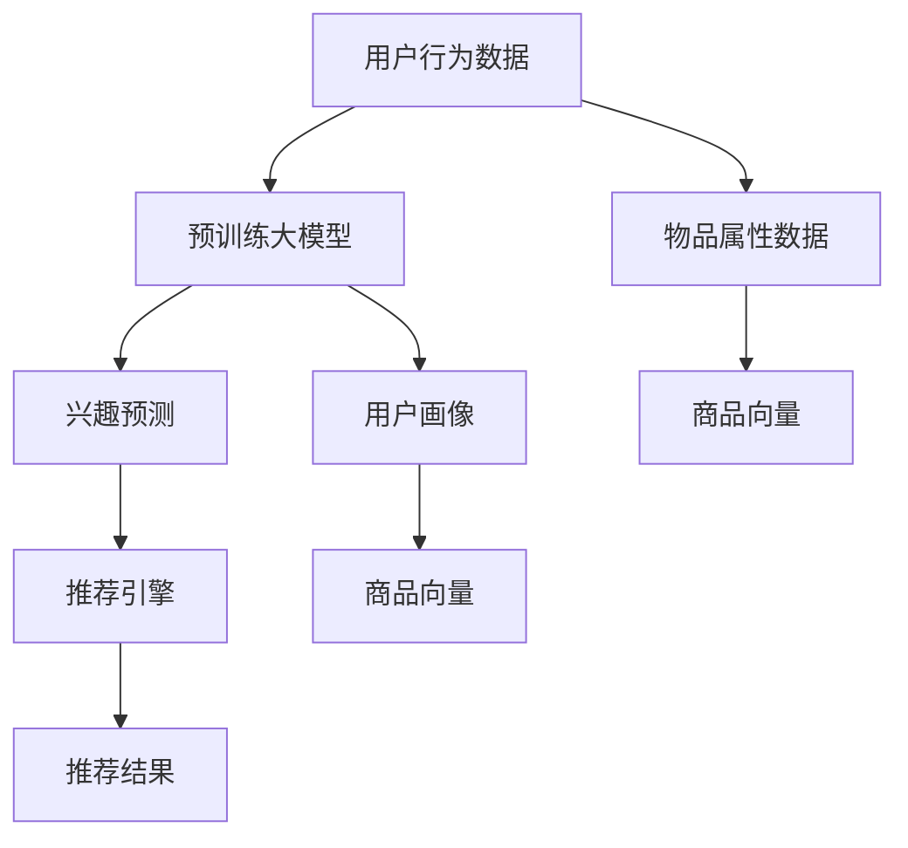

                 

# 探索AI大模型在电商平台跨品类推荐中的潜力

## 1. 背景介绍

随着电商平台用户需求的日益多样化，个性化推荐系统已经成为提高用户满意度、促进销售的重要手段。传统的推荐算法主要基于用户行为数据进行相似度匹配，在处理高维稀疏数据和长尾问题时表现有限。而利用AI大模型进行推荐，则能够更好地捕捉用户兴趣的多样性和复杂性，提供更加精准、全面的个性化推荐。

在实践中，大模型结合推荐系统的技术架构已经得到了广泛应用，如淘宝的“风尚购物助手”、京东的“聚美优品”等。这些系统基于大模型进行用户行为建模和兴趣预测，并通过推荐引擎为用户推荐商品。通过这些成功案例，大模型在电商平台推荐中的巨大潜力逐渐被业界认可。

## 2. 核心概念与联系

### 2.1 核心概念概述

- **AI大模型**：指基于深度学习模型，在超大语料库上进行预训练，具备强大的表示和理解能力的模型。
- **推荐系统**：通过用户行为数据、物品属性数据等，预测用户对商品或服务的偏好，并推荐相应商品的系统。
- **个性化推荐**：根据用户的历史行为和兴趣，为用户推荐最合适的商品或服务。
- **跨品类推荐**：针对用户对不同类别的商品需求，综合考虑多个品类商品的关系，进行跨品类推荐。

通过将AI大模型与推荐系统相结合，可以有效提升推荐的个性化水平和覆盖面，同时改善推荐的准确性，驱动电商平台的业务增长。

### 2.2 核心概念原理和架构的 Mermaid 流程图



## 3. 核心算法原理 & 具体操作步骤

### 3.1 算法原理概述

基于AI大模型的跨品类推荐系统，主要利用大模型的预训练能力，对用户兴趣和物品属性进行建模，进而实现跨品类推荐。算法流程如下：

1. **用户画像构建**：利用预训练大模型对用户的历史行为数据进行处理，得到用户画像向量。
2. **物品属性表示**：将商品的属性信息通过预训练大模型编码为商品向量。
3. **兴趣预测**：通过用户画像向量与商品向量的相似度计算，预测用户对不同类别的商品感兴趣程度。
4. **跨品类推荐**：根据兴趣预测结果，生成跨品类推荐列表，并通过推荐引擎为用户展示。

### 3.2 算法步骤详解

#### 3.2.1 用户画像构建

利用预训练大模型（如BERT）对用户历史行为数据进行处理，得到用户画像向量。具体步骤如下：

1. 数据预处理：将用户行为数据进行清洗、归一化等处理，转化为模型可接受的格式。
2. 文本编码：将用户行为数据编码为文本形式，作为大模型的输入。
3. 模型输出：将处理后的文本输入到预训练大模型中，得到用户画像向量。

#### 3.2.2 物品属性表示

将商品的属性信息通过预训练大模型编码为商品向量。具体步骤如下：

1. 数据预处理：将商品属性数据进行清洗、归一化等处理，转化为模型可接受的格式。
2. 文本编码：将商品属性数据编码为文本形式，作为大模型的输入。
3. 模型输出：将处理后的文本输入到预训练大模型中，得到商品向量。

#### 3.2.3 兴趣预测

利用用户画像向量与商品向量的相似度计算，预测用户对不同类别的商品感兴趣程度。具体步骤如下：

1. 向量计算：将用户画像向量和商品向量拼接，得到联合向量。
2. 相似度计算：使用余弦相似度、点积等方法计算用户画像向量与商品向量的相似度。
3. 兴趣得分：将相似度得分作为用户对商品的兴趣度。

#### 3.2.4 跨品类推荐

根据兴趣预测结果，生成跨品类推荐列表，并通过推荐引擎为用户展示。具体步骤如下：

1. 兴趣聚类：将用户对不同品类商品的兴趣得分进行聚类，得到用户的兴趣类别。
2. 品类关联：建立不同品类商品之间的关联关系，生成品类关联图。
3. 推荐生成：根据用户兴趣类别和品类关联图，生成跨品类推荐列表。

### 3.3 算法优缺点

#### 3.3.1 优点

1. **模型灵活性**：预训练大模型具备强大的泛化能力，可以处理不同品类之间的复杂关系。
2. **特征表示能力**：通过大模型学习到的特征表示，能够充分挖掘用户兴趣的多样性和复杂性。
3. **数据利用率**：能够有效利用长尾数据，提高推荐系统的覆盖面。
4. **推荐多样化**：能够生成跨品类推荐，为用户提供更多样化的商品选择。

#### 3.3.2 缺点

1. **计算资源消耗大**：大模型训练和推理需要大量的计算资源，对硬件要求较高。
2. **预训练数据需求高**：需要足够的多样化和高质量的预训练数据，才能保证模型的泛化能力。
3. **模型解释性不足**：大模型通常被视为“黑盒”，缺乏可解释性，难以理解和调试。
4. **泛化能力有限**：当商品品类之间关系复杂时，模型的泛化能力可能受限。

### 3.4 算法应用领域

AI大模型在电商平台跨品类推荐中的应用，具有广阔的前景。具体应用领域包括：

1. **多品类推荐**：针对用户对多个品类商品的需求，提供跨品类推荐。
2. **个性化商品推荐**：通过分析用户历史行为数据，对用户进行画像建模，生成个性化推荐。
3. **内容推荐**：将推荐系统应用于内容推荐场景，如视频、音乐、文章等。
4. **精准广告投放**：利用用户画像和商品属性，实现精准广告投放。
5. **供应链优化**：分析用户对不同品类商品的兴趣，优化供应链策略，提升商品周转率。

## 4. 数学模型和公式 & 详细讲解 & 举例说明

### 4.1 数学模型构建

基于AI大模型的跨品类推荐系统，主要涉及以下几个数学模型：

1. **用户画像向量**：$U$，表示用户兴趣的向量表示。
2. **商品向量**：$I$，表示商品属性的向量表示。
3. **用户兴趣得分**：$S_{ui}$，表示用户对商品$u$的兴趣得分。
4. **品类关联图**：$G$，表示不同品类商品之间的关联关系。

### 4.2 公式推导过程

#### 4.2.1 用户画像向量计算

利用预训练大模型对用户历史行为数据进行处理，得到用户画像向量$U$。公式如下：

$$U = \text{BERT}(Users\_Data)$$

其中$Users\_Data$表示用户历史行为数据。

#### 4.2.2 商品向量计算

利用预训练大模型对商品属性信息进行处理，得到商品向量$I$。公式如下：

$$I = \text{BERT}(Items\_Attributes)$$

其中$Items\_Attributes$表示商品属性信息。

#### 4.2.3 用户兴趣得分计算

利用用户画像向量与商品向量的余弦相似度，计算用户对商品$u$的兴趣得分$S_{ui}$。公式如下：

$$S_{ui} = \cos(U, I_u)$$

其中$I_u$表示商品$u$的商品向量。

#### 4.2.4 品类关联图构建

将不同品类商品之间的关联关系通过图结构表示，得到品类关联图$G$。公式如下：

$$G = (V, E)$$

其中$V$表示品类节点集合，$E$表示品类关系边集合。

### 4.3 案例分析与讲解

假设用户$A$对品类$P1$和$P2$的商品感兴趣，商品$I1$和$I2$属于品类$P1$，商品$I3$和$I4$属于品类$P2$。基于上述数学模型，计算用户$A$对不同品类商品的兴趣得分。

1. 利用预训练大模型，对用户历史行为数据进行处理，得到用户画像向量$U_A$。
2. 利用预训练大模型，对商品属性信息进行处理，得到商品向量$I1, I2, I3, I4$。
3. 计算用户$A$对商品$I1, I2, I3, I4$的兴趣得分$S_{A1}, S_{A2}, S_{A3}, S_{A4}$。
4. 利用品类关联图$G$，生成跨品类推荐列表。

## 5. 项目实践：代码实例和详细解释说明

### 5.1 开发环境搭建

在进行跨品类推荐系统开发前，我们需要准备好开发环境。以下是使用Python进行TensorFlow开发的开发环境配置流程：

1. 安装Anaconda：从官网下载并安装Anaconda，用于创建独立的Python环境。

2. 创建并激活虚拟环境：
```bash
conda create -n tf-env python=3.8 
conda activate tf-env
```

3. 安装TensorFlow：根据CUDA版本，从官网获取对应的安装命令。例如：
```bash
conda install tensorflow tensorflow-estimator tensorflow-gpu=2.7.0 -c conda-forge
```

4. 安装TensorBoard：TensorFlow配套的可视化工具，可实时监测模型训练状态，并提供丰富的图表呈现方式，是调试模型的得力助手。

5. 安装Keras：Keras是TensorFlow的高层API，提供简单易用的接口，方便模型开发。

### 5.2 源代码详细实现

下面是基于TensorFlow的跨品类推荐系统开发代码实现，具体步骤如下：

1. 数据预处理：将用户历史行为数据和商品属性数据进行清洗、归一化等处理，转化为模型可接受的格式。
2. 文本编码：利用BERT模型将用户历史行为数据和商品属性数据编码为文本形式。
3. 兴趣预测：使用余弦相似度计算用户画像向量与商品向量的相似度，得到用户对不同品类商品的兴趣得分。
4. 推荐生成：根据用户兴趣得分和品类关联图，生成跨品类推荐列表。

```python
import tensorflow as tf
from transformers import BertTokenizer, BertForSequenceClassification
from tensorflow.keras.layers import Embedding, Dot, Dense

# 定义用户画像向量计算模块
class UserEmbedding(tf.keras.layers.Layer):
    def __init__(self, embed_size=128, **kwargs):
        super(UserEmbedding, self).__init__(**kwargs)
        self.bert = BertForSequenceClassification.from_pretrained('bert-base-cased', num_labels=1)
        self.embedding = Embedding(input_dim=1024, output_dim=embed_size)

    def call(self, inputs, training=False):
        features = self.bert(inputs)
        embedding = self.embedding(features)
        return embedding

# 定义商品向量计算模块
class ItemEmbedding(tf.keras.layers.Layer):
    def __init__(self, embed_size=128, **kwargs):
        super(ItemEmbedding, self).__init__(**kwargs)
        self.bert = BertForSequenceClassification.from_pretrained('bert-base-cased', num_labels=1)
        self.embedding = Embedding(input_dim=1024, output_dim=embed_size)

    def call(self, inputs, training=False):
        features = self.bert(inputs)
        embedding = self.embedding(features)
        return embedding

# 定义用户兴趣得分计算模块
class InterestScore(tf.keras.layers.Layer):
    def __init__(self, **kwargs):
        super(InterestScore, self).__init__(**kwargs)
        self.dot = Dot(axes=1, normalize=True)

    def call(self, user, item):
        return self.dot([user, item])

# 定义品类关联图模块
class CategoryGraph(tf.keras.layers.Layer):
    def __init__(self, num_categories=10, **kwargs):
        super(CategoryGraph, self).__init__(**kwargs)
        self.num_categories = num_categories

    def build(self, input_shape):
        self.weight = self.add_weight(name='weights', shape=(self.num_categories, self.num_categories), initializer='glorot_uniform')

    def call(self, inputs):
        category = inputs[:, :self.num_categories]
        return tf.matmul(category, self.weight)

# 定义推荐生成模块
class Recommendation(tf.keras.layers.Layer):
    def __init__(self, **kwargs):
        super(Recommendation, self).__init__(**kwargs)
        self.gate = Dense(1, activation='sigmoid')

    def call(self, interest_score, category_graph):
        category_vector = category_graph(inputs)
        joint_score = interest_score + category_vector
        weighted_score = self.gate(joint_score)
        return weighted_score

# 构建推荐模型
user_embedding = UserEmbedding()
item_embedding = ItemEmbedding()
interest_score = InterestScore()
category_graph = CategoryGraph()
recommendation = Recommendation()

# 定义模型输入输出
inputs = tf.keras.Input(shape=(None,))
user = user_embedding(inputs)
item = item_embedding(inputs)
joint_score = interest_score(user, item)
category_graph = category_graph(inputs)
recommendation_score = recommendation(joint_score, category_graph)
recommendation = tf.keras.layers.Lambda(lambda x: tf.concat([x, user_embedding(inputs)], axis=1))

# 定义模型损失函数
loss = tf.keras.losses.MeanSquaredError()

# 定义模型优化器
optimizer = tf.keras.optimizers.Adam(learning_rate=0.001)

# 定义模型编译
model = tf.keras.Model(inputs=inputs, outputs=recommendation_score)
model.compile(optimizer=optimizer, loss=loss)

# 定义数据集
train_dataset = tf.data.Dataset.from_tensor_slices((train_inputs, train_labels))
train_dataset = train_dataset.shuffle(buffer_size=1000).batch(batch_size=32)
val_dataset = tf.data.Dataset.from_tensor_slices((val_inputs, val_labels))
val_dataset = val_dataset.shuffle(buffer_size=1000).batch(batch_size=32)
test_dataset = tf.data.Dataset.from_tensor_slices((test_inputs, test_labels))
test_dataset = test_dataset.shuffle(buffer_size=1000).batch(batch_size=32)

# 训练模型
model.fit(train_dataset, epochs=10, validation_data=val_dataset)
```

### 5.3 代码解读与分析

让我们再详细解读一下关键代码的实现细节：

**UserEmbedding类**：
- `__init__`方法：初始化预训练BERT模型和用户画像向量embedding层。
- `call`方法：将用户历史行为数据输入BERT模型，得到用户画像向量embedding。

**ItemEmbedding类**：
- `__init__`方法：初始化预训练BERT模型和商品向量embedding层。
- `call`方法：将商品属性数据输入BERT模型，得到商品向量embedding。

**InterestScore类**：
- `__init__`方法：初始化余弦相似度计算模块。
- `call`方法：计算用户画像向量与商品向量的相似度，得到用户对商品的兴趣得分。

**CategoryGraph类**：
- `__init__`方法：初始化品类关联图权重矩阵。
- `build`方法：构建品类关联图权重矩阵。
- `call`方法：计算品类关联图。

**Recommendation类**：
- `__init__`方法：初始化推荐得分计算模块。
- `call`方法：将用户兴趣得分和品类关联图进行加权，得到推荐得分。

**模型构建**：
- 使用Keras定义用户画像向量计算模块、商品向量计算模块、用户兴趣得分计算模块、品类关联图模块、推荐生成模块。
- 定义模型输入、输出和损失函数。
- 定义模型优化器。
- 定义数据集，进行模型训练。

## 6. 实际应用场景

### 6.1 电商平台推荐

电商平台推荐系统是AI大模型跨品类推荐技术的重要应用场景。通过结合大模型的预训练能力和推荐算法，电商平台可以为用户提供更加精准和多样化的推荐。

具体应用包括：
- **商品推荐**：针对用户对不同品类商品的需求，生成跨品类推荐列表。
- **用户画像建模**：利用用户历史行为数据，对用户进行画像建模，生成个性化推荐。
- **内容推荐**：将推荐系统应用于内容推荐场景，如视频、音乐、文章等。

### 6.2 社交媒体推荐

社交媒体推荐系统同样可以利用AI大模型进行跨品类推荐。通过分析用户的历史行为数据和社交网络关系，大模型可以生成更精准的推荐内容，提升用户活跃度和满意度。

具体应用包括：
- **新闻推荐**：根据用户兴趣，生成跨品类新闻推荐列表。
- **视频推荐**：根据用户观看历史，生成跨品类视频推荐列表。
- **广告推荐**：根据用户兴趣，生成跨品类广告推荐列表。

### 6.3 智能家居推荐

智能家居推荐系统可以利用AI大模型进行跨品类推荐。通过分析用户的生活习惯和环境数据，大模型可以生成更符合用户需求的推荐方案，提升用户的生活质量和体验。

具体应用包括：
- **家电推荐**：根据用户的生活习惯，生成跨品类家电推荐列表。
- **家居装修推荐**：根据用户的家居环境，生成跨品类家居装修推荐方案。
- **健康推荐**：根据用户的健康数据，生成跨品类健康推荐列表。

### 6.4 未来应用展望

随着AI大模型技术的不断发展，其在跨品类推荐方面的应用将更加广泛。未来，基于大模型的跨品类推荐系统有望在更多领域得到应用，带来新的技术突破和产业变革。

在智慧医疗领域，大模型可以结合病历数据，生成跨品类医疗推荐方案，辅助医生诊疗，提高医疗服务的智能化水平。

在智慧城市治理中，大模型可以结合城市数据，生成跨品类城市管理方案，提升城市管理的自动化和智能化水平。

## 7. 工具和资源推荐

### 7.1 学习资源推荐

为了帮助开发者系统掌握AI大模型跨品类推荐技术，这里推荐一些优质的学习资源：

1. TensorFlow官方文档：提供完整的TensorFlow框架和API使用指南，适合初学者和进阶开发者。
2. Keras官方文档：提供Keras框架和API使用指南，适合TensorFlow高级用户。
3. Deep Learning Specialization课程：由Andrew Ng教授主讲，涵盖深度学习的基础知识和应用实践，适合入门开发者。
4. Transformers库官方文档：提供Transformers库和BERT模型的使用指南，适合自然语言处理开发者。
5. AI大模型综述论文：综述AI大模型的最新研究成果和应用场景，适合学术研究开发者。

通过对这些资源的学习实践，相信你一定能够快速掌握AI大模型跨品类推荐技术的精髓，并用于解决实际的推荐问题。

### 7.2 开发工具推荐

高效的开发离不开优秀的工具支持。以下是几款用于AI大模型跨品类推荐开发的常用工具：

1. TensorFlow：基于Python的开源深度学习框架，灵活动态的计算图，适合快速迭代研究。
2. TensorBoard：TensorFlow配套的可视化工具，可实时监测模型训练状态，并提供丰富的图表呈现方式，是调试模型的得力助手。
3. Weights & Biases：模型训练的实验跟踪工具，可以记录和可视化模型训练过程中的各项指标，方便对比和调优。
4. HuggingFace Transformers库：提供预训练语言模型和微调方法，适合自然语言处理开发者。
5. Keras：Keras是TensorFlow的高层API，提供简单易用的接口，方便模型开发。

合理利用这些工具，可以显著提升AI大模型跨品类推荐任务的开发效率，加快创新迭代的步伐。

### 7.3 相关论文推荐

AI大模型跨品类推荐技术的研究源于学界的持续研究。以下是几篇奠基性的相关论文，推荐阅读：

1. Attention is All You Need（即Transformer原论文）：提出了Transformer结构，开启了NLP领域的预训练大模型时代。
2. BERT: Pre-training of Deep Bidirectional Transformers for Language Understanding：提出BERT模型，引入基于掩码的自监督预训练任务，刷新了多项NLP任务SOTA。
3. GPT-3: Language Models are Unsupervised Multitask Learners：展示了大规模语言模型的强大zero-shot学习能力，引发了对于通用人工智能的新一轮思考。
4. Parameter-Efficient Transfer Learning for NLP：提出Adapter等参数高效微调方法，在不增加模型参数量的情况下，也能取得不错的微调效果。
5. Fine-tune pretrained language models for domain-specific question-answering：介绍预训练语言模型在特定领域任务上的微调方法，适合跨品类推荐系统的应用。

这些论文代表了大模型跨品类推荐技术的发展脉络。通过学习这些前沿成果，可以帮助研究者把握学科前进方向，激发更多的创新灵感。

## 8. 总结：未来发展趋势与挑战

### 8.1 总结

本文对基于AI大模型的跨品类推荐系统进行了全面系统的介绍。首先阐述了跨品类推荐系统的背景和意义，明确了AI大模型在提升推荐系统性能方面的独特价值。其次，从原理到实践，详细讲解了跨品类推荐系统的数学原理和关键步骤，给出了跨品类推荐系统开发的完整代码实例。同时，本文还广泛探讨了跨品类推荐系统在电商平台、社交媒体、智能家居等多个领域的应用前景，展示了跨品类推荐系统的大有可为。

通过本文的系统梳理，可以看到，基于AI大模型的跨品类推荐系统正在成为推荐系统的重要范式，极大地提升推荐的个性化水平和覆盖面，驱动电商平台业务增长。未来，伴随AI大模型技术的不断发展，跨品类推荐系统有望在更多领域得到应用，为推荐系统带来新的突破。

### 8.2 未来发展趋势

展望未来，AI大模型跨品类推荐技术将呈现以下几个发展趋势：

1. **模型规模持续增大**：随着算力成本的下降和数据规模的扩张，预训练大模型参数量还将持续增长。超大规模语言模型蕴含的丰富语言知识，有望支撑更加复杂多变的跨品类推荐。
2. **参数高效微调方法**：开发更多参数高效的微调方法，如Adapter等，在固定大部分预训练参数的同时，只更新极少量的任务相关参数，提高微调效率和模型泛化能力。
3. **多模态跨品类推荐**：融合视觉、语音、文本等多模态信息，实现跨品类推荐，提升推荐系统对复杂多变用户需求的理解能力。
4. **知识增强跨品类推荐**：将符号化的先验知识，如知识图谱、逻辑规则等，与神经网络模型进行融合，增强推荐系统对用户的理解能力，提升推荐效果。
5. **跨品类推荐系统部署优化**：优化跨品类推荐系统的计算图，减少前向传播和反向传播的资源消耗，实现更加轻量级、实时性的部署，提升推荐系统的响应速度和资源利用率。

以上趋势凸显了AI大模型跨品类推荐技术的广阔前景。这些方向的探索发展，必将进一步提升推荐系统的性能和应用范围，为电商平台、社交媒体、智能家居等领域带来新的突破。

### 8.3 面临的挑战

尽管AI大模型跨品类推荐技术已经取得了瞩目成就，但在迈向更加智能化、普适化应用的过程中，它仍面临着诸多挑战：

1. **计算资源消耗大**：AI大模型训练和推理需要大量的计算资源，对硬件要求较高。
2. **预训练数据需求高**：需要足够的多样化和高质量的预训练数据，才能保证模型的泛化能力。
3. **模型解释性不足**：AI大模型通常被视为“黑盒”，缺乏可解释性，难以理解和调试。
4. **泛化能力有限**：当品类之间关系复杂时，模型的泛化能力可能受限。
5. **隐私与安全问题**：用户数据的隐私保护和安全性问题，需要严格遵守法律法规，并采取有效的技术手段进行保障。

### 8.4 研究展望

面对AI大模型跨品类推荐技术所面临的种种挑战，未来的研究需要在以下几个方面寻求新的突破：

1. **探索无监督和半监督跨品类推荐方法**：摆脱对大规模标注数据的依赖，利用自监督学习、主动学习等无监督和半监督范式，最大限度利用非结构化数据，实现更加灵活高效的跨品类推荐。
2. **研究参数高效和计算高效的跨品类推荐范式**：开发更加参数高效的跨品类推荐方法，在固定大部分预训练参数的同时，只更新极少量的任务相关参数。同时优化跨品类推荐模型的计算图，减少前向传播和反向传播的资源消耗，实现更加轻量级、实时性的部署。
3. **融合因果和对比学习范式**：通过引入因果推断和对比学习思想，增强跨品类推荐模型建立稳定因果关系的能力，学习更加普适、鲁棒的语言表征，从而提升模型泛化性和抗干扰能力。
4. **引入更多先验知识**：将符号化的先验知识，如知识图谱、逻辑规则等，与神经网络模型进行巧妙融合，引导跨品类推荐过程学习更准确、合理的语言模型。同时加强不同模态数据的整合，实现视觉、语音等多模态信息与文本信息的协同建模。
5. **结合因果分析和博弈论工具**：将因果分析方法引入跨品类推荐模型，识别出模型决策的关键特征，增强推荐输出的因果性和逻辑性。借助博弈论工具刻画人机交互过程，主动探索并规避模型的脆弱点，提高系统稳定性。
6. **纳入伦理道德约束**：在模型训练目标中引入伦理导向的评估指标，过滤和惩罚有偏见、有害的输出倾向。同时加强人工干预和审核，建立模型行为的监管机制，确保输出符合人类价值观和伦理道德。

这些研究方向的探索，必将引领AI大模型跨品类推荐技术迈向更高的台阶，为推荐系统带来新的突破。面向未来，AI大模型跨品类推荐技术还需要与其他人工智能技术进行更深入的融合，如知识表示、因果推理、强化学习等，多路径协同发力，共同推动推荐系统的进步。只有勇于创新、敢于突破，才能不断拓展跨品类推荐系统的边界，让推荐系统更好地服务用户，驱动产业数字化转型升级。

## 9. 附录：常见问题与解答

**Q1：跨品类推荐系统对预训练数据的需求有哪些？**

A: 跨品类推荐系统对预训练数据的需求较高，主要包括以下几个方面：
1. **多样性**：预训练数据需要包含丰富多样的品类商品属性信息，以覆盖所有可能的商品品类。
2. **质量**：预训练数据需要高质量、完整性高，以避免噪声数据对模型的影响。
3. **实时性**：预训练数据需要及时更新，以反映当前品类商品的最新属性信息。

**Q2：如何评估跨品类推荐系统的性能？**

A: 跨品类推荐系统的性能评估通常包括以下几个指标：
1. **覆盖率**：推荐列表中包含不同品类商品的种类数量。
2. **准确率**：推荐列表中包含用户感兴趣的品类商品的比例。
3. **召回率**：推荐列表中包含用户所有感兴趣品类商品的比例。
4. **多样性**：推荐列表中品类商品的多样性，避免过度集中。
5. **点击率**：用户点击推荐列表中品类商品的比例。

**Q3：跨品类推荐系统在电商平台的应用有哪些？**

A: 跨品类推荐系统在电商平台的应用包括：
1. **商品推荐**：针对用户对不同品类商品的需求，生成跨品类推荐列表。
2. **用户画像建模**：利用用户历史行为数据，对用户进行画像建模，生成个性化推荐。
3. **内容推荐**：将推荐系统应用于内容推荐场景，如视频、音乐、文章等。
4. **广告推荐**：根据用户兴趣，生成跨品类广告推荐列表。

**Q4：跨品类推荐系统的计算资源消耗大，如何优化？**

A: 跨品类推荐系统的计算资源消耗大，可以采取以下优化措施：
1. **分布式训练**：利用多台机器进行分布式训练，加速模型训练过程。
2. **混合精度训练**：将浮点模型转为定点模型，压缩存储空间，提高计算效率。
3. **梯度累积**：将多个小批量梯度进行累积，减少每个批次的计算量。
4. **模型压缩**：采用剪枝、量化等技术，压缩模型参数和大小，减少计算资源消耗。
5. **资源共享**：将大模型的参数共享到多台服务器上，提高资源利用率。

**Q5：跨品类推荐系统在社交媒体中的应用有哪些？**

A: 跨品类推荐系统在社交媒体中的应用包括：
1. **新闻推荐**：根据用户兴趣，生成跨品类新闻推荐列表。
2. **视频推荐**：根据用户观看历史，生成跨品类视频推荐列表。
3. **广告推荐**：根据用户兴趣，生成跨品类广告推荐列表。

**Q6：跨品类推荐系统的部署安全性如何保障？**

A: 跨品类推荐系统的部署安全性需要采取以下措施：
1. **数据加密**：对用户数据进行加密存储和传输，保障用户隐私。
2. **访问控制**：设置严格的访问控制机制，防止未经授权的访问。
3. **安全审计**：定期对系统进行安全审计，发现并修复安全漏洞。
4. **异常检测**：利用异常检测技术，发现并阻止恶意攻击行为。
5. **模型解释性**：提高模型输出解释性，增强用户对系统的信任度。

**Q7：跨品类推荐系统的隐私保护有哪些措施？**

A: 跨品类推荐系统的隐私保护需要采取以下措施：
1. **数据匿名化**：对用户数据进行匿名化处理，保护用户隐私。
2. **差分隐私**：采用差分隐私技术，保护用户数据的隐私性。
3. **用户授权**：在收集和处理用户数据时，取得用户授权，保护用户隐私权。
4. **安全存储**：对用户数据进行安全存储，防止数据泄露。
5. **数据脱敏**：对敏感数据进行脱敏处理，减少隐私风险。

通过这些措施，可以有效保障跨品类推荐系统的隐私保护，确保用户数据的安全性。

---

作者：禅与计算机程序设计艺术 / Zen and the Art of Computer Programming

