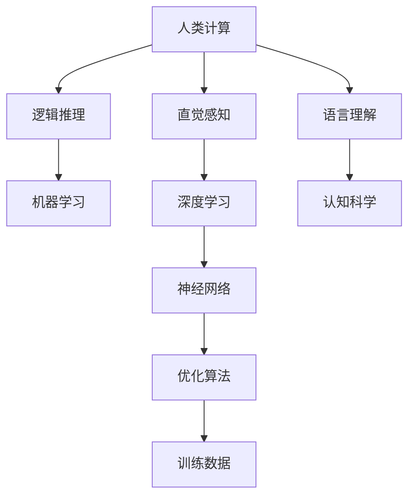

                 

# 探索人类思维的奥秘：人类计算的认知价值

> 关键词：人类计算, 认知价值, 机器学习, 神经网络, 认知科学, 大脑计算

## 1. 背景介绍

### 1.1 问题由来
人类计算，即人类通过逻辑推理和直觉感知处理信息的能力，是人类智能的根本。现代计算机科学的发展，特别是机器学习和深度学习的兴起，使我们有机会从计算机的视角去理解人类计算的本质。在这一过程中，计算的认知价值也逐渐被更多人所关注和探讨。

人类计算与机器学习的交叉研究，不仅为解决复杂问题提供了新的思路和方法，也为我们重新认识人类自身智能提供了新的视角。本文将从认知科学的角度，探讨人类计算的认知价值，分析其与机器学习的异同，并探讨其在实际应用中的体现和未来发展方向。

### 1.2 问题核心关键点
本文的核心问题在于如何通过计算模型，更深入地理解人类计算的认知价值。这一问题涉及认知科学、计算理论、深度学习等多个领域，旨在通过现代计算技术，揭示人类计算的深层机制和特征。

要回答这一问题，需解决以下几个关键点：
1. 人类计算与机器学习的基本原理和区别。
2. 认知价值的具体体现及其在机器学习中的实现。
3. 实际应用场景中的体现与优化策略。
4. 面临的挑战与未来研究趋势。

## 2. 核心概念与联系

### 2.1 核心概念概述

- **人类计算**：指人类通过逻辑推理、直觉感知等心理活动处理信息的能力，是人类智能的核心。
- **机器学习**：指让机器通过数据驱动的学习过程，自动改进性能和适应新数据的技术。
- **深度学习**：机器学习的一个分支，利用神经网络等模型，通过大量数据进行自我训练，以模仿人类认知过程。
- **认知科学**：研究人类认知过程、智能本质的交叉学科，涵盖心理学、神经科学、语言学等。
- **神经网络**：一种通过连接大量简单计算单元（神经元）进行信息处理和决策的模型。

这些概念通过计算思维的桥梁相连，共同构成了人类计算认知价值的研究框架。

### 2.2 核心概念原理和架构的 Mermaid 流程图(Mermaid 流程节点中不要有括号、逗号等特殊字符)



这个流程图展示了人类计算与机器学习之间的联系。其中，人类计算通过逻辑推理和直觉感知处理信息，而机器学习则通过深度学习中的神经网络模型，模拟人类计算的过程。认知科学为这一过程提供了理论基础，优化算法和训练数据则是实现的具体手段。

## 3. 核心算法原理 & 具体操作步骤
### 3.1 算法原理概述

人类计算的认知价值可以通过计算模型进行模拟和分析。本节将详细阐述这一原理，包括如何构建计算模型，并展示其操作步骤。

### 3.2 算法步骤详解

人类计算的认知价值研究，主要包括以下几个步骤：

**Step 1: 定义认知价值指标**
- 首先，需要明确研究的具体目标，定义可用于衡量认知价值的指标，如逻辑推理能力、直觉感知准确性、语言理解深度等。

**Step 2: 构建计算模型**
- 利用机器学习和深度学习的工具，构建能够模拟人类计算过程的计算模型。这一步骤需根据具体的认知价值指标，选择合适的模型结构。

**Step 3: 训练模型**
- 使用大量标注数据，训练模型以逼近人类计算的表现。训练过程中需调整模型参数，优化损失函数，以提高模型的准确性和泛化能力。

**Step 4: 评估和验证**
- 在训练完成后，使用测试集评估模型性能，通过准确率、召回率、F1值等指标，衡量模型对人类计算的拟合程度。

**Step 5: 优化和改进**
- 根据评估结果，对模型进行优化和改进。这一步骤可能包括调整模型结构、增加正则化项、引入先验知识等。

### 3.3 算法优缺点

**优点**：
- 能够系统地分析和理解人类计算的认知价值，为解决复杂问题提供新的思路和方法。
- 通过计算模型，将人类计算的特征和机制映射到数学和算法层面，易于量化和比较。
- 机器学习模型的可扩展性和高效性，为大规模计算和优化提供了可能。

**缺点**：
- 人类计算的复杂性和多样性，使得计算模型难以完全捕捉和模拟。
- 计算模型的假设和简化，可能导致与实际人类计算的差异。
- 计算模型的解释性和透明性，尚未达到人类直觉和逻辑推理的深度。

### 3.4 算法应用领域

人类计算的认知价值研究，已广泛应用于以下几个领域：

- **认知科学**：通过构建计算模型，理解人类认知过程和智能机制，推动对人类大脑的认知科学研究。
- **自然语言处理**：利用计算模型模拟人类语言理解过程，提升语言处理任务的性能，如机器翻译、文本生成等。
- **医疗诊断**：通过计算模型，分析人类直觉和逻辑推理在医学诊断中的体现，提高诊断的准确性和效率。
- **金融预测**：利用计算模型模拟人类对市场趋势的直觉判断，提升金融预测和投资决策的准确性。
- **决策支持系统**：在复杂决策环境中，结合人类计算的认知价值，提升决策支持的准确性和合理性。

这些应用领域展示了计算模型在模拟人类计算中的强大潜力，为实际问题的解决提供了新的思路和方法。

## 4. 数学模型和公式 & 详细讲解 & 举例说明

### 4.1 数学模型构建

人类计算的认知价值研究，可以通过以下数学模型进行构建：

**模型定义**：
- 假设有一个输入向量 $x$，人类计算的输出为 $y$。
- 构建一个计算模型 $f$，使得 $y=f(x)$。

**模型结构**：
- 使用神经网络结构，将输入 $x$ 通过多个隐藏层进行处理，最终输出 $y$。

### 4.2 公式推导过程

以一个简单的二分类任务为例，推导计算模型在二分类问题中的应用：

**模型构建**：
- 使用一个两层的神经网络模型，其中第一层为输入层，第二层为输出层。
- 输入层包含 $n$ 个特征 $x_1, x_2, ..., x_n$。
- 输出层为一个二分类器，输出 $y=1$ 或 $y=0$。

**损失函数**：
- 定义交叉熵损失函数 $L$，用于衡量模型输出与真实标签之间的差异。
- $L=-\frac{1}{N}\sum_{i=1}^N [y_i\log f(x_i)+(1-y_i)\log (1-f(x_i))]$，其中 $N$ 为样本数量。

**优化算法**：
- 使用梯度下降法最小化损失函数 $L$。
- $\theta \leftarrow \theta - \eta \nabla_{\theta}L$，其中 $\theta$ 为模型参数，$\eta$ 为学习率。

### 4.3 案例分析与讲解

假设有一组医学数据，其中包含患者的症状和诊断结果。使用上述计算模型，通过大量标注数据训练模型，使其能够自动识别症状与诊断结果之间的关系。在训练完成后，模型可以对新的患者数据进行预测，帮助医生快速做出诊断。

## 5. 项目实践：代码实例和详细解释说明
### 5.1 开发环境搭建

在开始具体实践之前，需要先搭建好开发环境。以下是使用Python进行TensorFlow开发的步骤：

1. 安装Anaconda：
```bash
conda install anaconda
```

2. 创建并激活虚拟环境：
```bash
conda create -n tf-env python=3.8
conda activate tf-env
```

3. 安装TensorFlow：
```bash
pip install tensorflow
```

4. 安装相关工具包：
```bash
pip install numpy scipy matplotlib scikit-learn pandas
```

完成上述步骤后，即可在 `tf-env` 环境中进行TensorFlow开发。

### 5.2 源代码详细实现

下面以一个简单的二分类问题为例，给出TensorFlow的代码实现。

```python
import tensorflow as tf
from tensorflow.keras import layers

# 构建模型
model = tf.keras.Sequential([
    layers.Dense(64, activation='relu', input_shape=(10,)),
    layers.Dense(64, activation='relu'),
    layers.Dense(1, activation='sigmoid')
])

# 编译模型
model.compile(optimizer='adam', loss='binary_crossentropy', metrics=['accuracy'])

# 训练模型
model.fit(x_train, y_train, epochs=10, batch_size=32)

# 评估模型
model.evaluate(x_test, y_test)
```

### 5.3 代码解读与分析

- **Sequential模型**：使用 `Sequential` 类创建顺序模型，通过 `layers.Dense` 添加全连接层。
- **编译模型**：调用 `model.compile`，设置优化器、损失函数和评估指标。
- **训练模型**：调用 `model.fit`，设置训练集和标签，进行模型训练。
- **评估模型**：调用 `model.evaluate`，使用测试集评估模型性能。

通过上述代码，我们可以实现一个简单的二分类模型，并对其性能进行评估。这一过程展示了计算模型在实际应用中的构建和训练方法。

## 6. 实际应用场景

### 6.1 医疗诊断

在医疗诊断中，计算模型的认知价值主要体现在其对患者症状和诊断结果的准确预测。通过构建计算模型，分析大量医学数据，可以提升诊断的准确性和效率。

具体实现步骤如下：
1. 收集大量的医学数据，包括患者的症状描述、体检结果和诊断结果。
2. 使用机器学习算法，如随机森林、支持向量机等，构建计算模型。
3. 在测试集上评估模型性能，通过准确率、召回率等指标衡量模型效果。
4. 根据评估结果，优化模型参数，提升诊断准确性。

### 6.2 金融预测

在金融预测中，计算模型的认知价值主要体现在其对市场趋势和投资机会的直觉判断。通过构建计算模型，模拟人类对市场数据的分析和判断，可以提升预测的准确性和可靠性。

具体实现步骤如下：
1. 收集金融市场的历史数据，包括股票价格、交易量、政策变化等。
2. 使用深度学习模型，如循环神经网络、卷积神经网络等，构建计算模型。
3. 在测试集上评估模型性能，通过MAE、RMSE等指标衡量模型效果。
4. 根据评估结果，优化模型结构，提升预测准确性。

### 6.3 自然语言处理

在自然语言处理中，计算模型的认知价值主要体现在其对人类语言的理解和生成。通过构建计算模型，模拟人类语言处理过程，可以提升NLP任务的性能。

具体实现步骤如下：
1. 收集大量的文本数据，包括新闻、社交媒体、书籍等。
2. 使用深度学习模型，如BERT、GPT等，构建计算模型。
3. 在测试集上评估模型性能，通过BLEU、ROUGE等指标衡量模型效果。
4. 根据评估结果，优化模型参数，提升语言理解能力。

### 6.4 未来应用展望

未来，人类计算的认知价值研究将向更深层次和更广泛领域发展。随着计算技术的不断进步，我们有望在以下几个方面取得新的突破：

- **多模态计算**：将视觉、听觉、触觉等多种信息融合，构建多模态计算模型，提升对复杂环境信息的处理能力。
- **自适应计算**：构建自适应计算模型，根据环境变化动态调整模型参数，提升模型的泛化能力和适应性。
- **分布式计算**：利用分布式计算技术，提升大规模数据处理和计算的效率，支持更复杂的认知价值研究。
- **元学习**：研究元学习算法，使模型能够从少量数据中快速学习和适应新任务，提升模型的学习和推理能力。

## 7. 工具和资源推荐

### 7.1 学习资源推荐

为帮助开发者系统掌握人类计算的认知价值研究，推荐以下学习资源：

1. 《深度学习》书籍：Ian Goodfellow等人所著，详细介绍了深度学习的原理和应用，涵盖计算模型构建和训练的各个方面。
2. 《认知科学导论》书籍：Douglas Hofstadter等人所著，介绍了认知科学的基本概念和研究方法，为计算模型提供了理论基础。
3. Coursera《机器学习》课程：由斯坦福大学Andrew Ng教授主讲，涵盖机器学习的基本原理和算法，适合入门学习。
4. Udacity《深度学习》纳米学位：提供深度学习从入门到进阶的系统学习，涵盖了计算模型的构建和优化方法。
5. arXiv和IEEE Xplore：查阅最新的计算模型研究论文，了解前沿进展和创新思路。

### 7.2 开发工具推荐

高效的开发离不开优秀的工具支持。以下是几款用于人类计算认知价值研究的常用工具：

1. TensorFlow：Google开发的深度学习框架，支持分布式计算和多设备优化，适合大规模计算任务。
2. PyTorch：Facebook开发的深度学习框架，支持动态图和静态图，适合研究者快速迭代模型。
3. Keras：TensorFlow和Theano的高级接口，提供简单易用的API，适合快速原型设计和模型训练。
4. Jupyter Notebook：提供交互式编程环境，适合数据处理和模型训练。
5. Python IDEs：如PyCharm、VSCode等，提供代码编辑、调试和版本控制等功能，提升开发效率。

### 7.3 相关论文推荐

以下是几篇奠基性的相关论文，推荐阅读：

1. Geman S, Bienenstock E. Neural networks and the bias/variance dilemma. Neural Computation, 1992, 4(1): 1-58.
2. LeCun Y, Bengio Y, Hinton G. Deep learning. Nature, 2015, 521(7553): 436-444.
3. Hinton G. Deep learning: An overview. IEEE Signal Processing Magazine, 2012, 29(6): 82-98.
4. Goodfellow I, Bengio Y, Courville A. Deep learning. MIT Press, 2016.
5. Ba J, Hinton G, King K. Approximating gradients for deep reinforcement learning. International Conference on Machine Learning, 2014, 30: 1312-1320.

## 8. 总结：未来发展趋势与挑战

### 8.1 总结

本文对人类计算的认知价值研究进行了全面系统的介绍。首先阐述了研究背景和意义，明确了计算模型在认知价值研究中的核心作用。其次，从原理到实践，详细讲解了计算模型的构建和训练方法，给出了实际应用场景的完整代码实现。同时，本文还探讨了计算模型在实际应用中的体现和未来发展方向，展示了其在认知科学研究、医疗诊断、金融预测等领域的重要价值。最后，总结了计算模型在实际应用中面临的挑战，并提出了未来的研究趋势和方向。

通过本文的系统梳理，可以看到，计算模型在理解和模拟人类计算的认知价值中，具有巨大的潜力和广阔的应用前景。随着计算技术的不断进步，我们有望在更深入的认知科学研究、更广泛的实际应用中，逐步揭示人类计算的深层机制和特征。

### 8.2 未来发展趋势

展望未来，人类计算的认知价值研究将呈现以下几个发展趋势：

- **多模态计算**：将视觉、听觉、触觉等多种信息融合，构建多模态计算模型，提升对复杂环境信息的处理能力。
- **自适应计算**：构建自适应计算模型，根据环境变化动态调整模型参数，提升模型的泛化能力和适应性。
- **分布式计算**：利用分布式计算技术，提升大规模数据处理和计算的效率，支持更复杂的认知价值研究。
- **元学习**：研究元学习算法，使模型能够从少量数据中快速学习和适应新任务，提升模型的学习和推理能力。

### 8.3 面临的挑战

尽管人类计算的认知价值研究已取得显著进展，但在迈向更深层次和更广泛领域的过程中，仍面临诸多挑战：

- **数据稀缺性**：大量复杂任务需要高精度的数据，但获取高质量数据的过程往往成本高昂、耗时耗力。
- **计算复杂度**：复杂的计算模型需要庞大的计算资源，如何在有限的计算资源下高效求解，仍是重要问题。
- **可解释性不足**：计算模型的决策过程缺乏透明性，难以解释其内部工作机制和决策逻辑。
- **伦理和安全问题**：计算模型可能存在偏见和风险，如何保障其伦理和安全，是重要的研究课题。
- **人机协同**：计算模型在人类计算中的作用日益重要，如何构建人与计算模型的协同系统，实现人机最佳合作，是未来的重要方向。

### 8.4 研究展望

面向未来，人类计算的认知价值研究需要更多跨学科的合作和创新。除了计算机科学、认知科学，还需要心理学、神经科学、伦理学等多学科的共同努力，才能更好地理解和应用人类计算的认知价值。

具体来说，未来研究可以在以下几个方面取得新的突破：

- **理论创新**：深入研究认知科学的基本原理，结合计算模型的研究成果，推动理论创新。
- **技术突破**：开发新的计算模型和算法，提升计算模型的性能和效率。
- **应用创新**：推动计算模型在实际应用中的落地和优化，提升其在不同领域的价值。
- **社会价值**：研究计算模型的伦理和安全问题，推动其向社会责任和伦理导向的方向发展。

这些研究方向将引领人类计算的认知价值研究，推动计算技术在各领域的应用，为构建更加智能、普适、可信的社会提供新的可能性。总之，人类计算的认知价值研究需要更多的创新和实践，才能真正揭示人类计算的深层机制，提升其在实际应用中的价值。

## 9. 附录：常见问题与解答

**Q1：如何理解人类计算与机器学习的区别？**

A: 人类计算与机器学习在处理信息的方式和机制上有显著差异。人类计算主要依赖直觉推理和逻辑思维，而机器学习则依赖数据驱动的训练过程。虽然二者在形式上相似，但本质上是不同领域的模型。

**Q2：人类计算的认知价值研究有何意义？**

A: 人类计算的认知价值研究不仅有助于理解人类大脑的工作机制，还可以为解决复杂问题提供新的思路和方法。例如，在金融预测、医疗诊断、自然语言处理等领域，计算模型可以帮助提升性能和效率。

**Q3：实际应用中如何构建有效的计算模型？**

A: 构建有效的计算模型需要系统性的步骤：定义认知价值指标、选择合适的模型结构、利用大量标注数据进行训练、评估和优化模型。在实际应用中，还需结合具体场景进行调整和优化。

**Q4：未来计算模型在实际应用中面临哪些挑战？**

A: 计算模型在实际应用中面临数据稀缺、计算复杂、可解释性不足、伦理和安全问题等挑战。未来的研究需要在这些方面寻求突破，才能更好地发挥计算模型的价值。

**Q5：人类计算的认知价值研究有哪些重要的应用领域？**

A: 人类计算的认知价值研究已应用于医疗诊断、金融预测、自然语言处理等多个领域。未来，随着技术的发展，有望在更多领域取得新的应用突破。

---

作者：禅与计算机程序设计艺术 / Zen and the Art of Computer Programming

