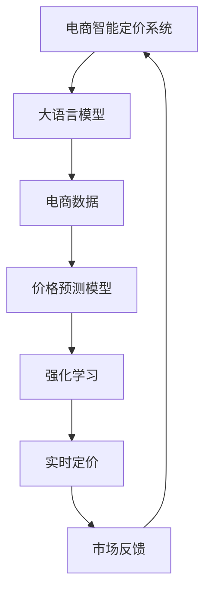

                 

# 探索基于大模型的电商智能定价系统

## 1. 背景介绍

在现代电商市场中，定价策略的精确性和动态性对企业的盈利能力具有重大影响。传统的定价方法基于历史数据和规则，难以适应市场波动和多变的需求，容易导致竞争力下降。为了在激烈的市场竞争中保持优势，电商平台纷纷引入智能定价系统，利用先进的数据科学和人工智能技术，实时调整商品价格，提升销售效果和客户满意度。

基于深度学习的大语言模型在大规模数据上预训练，具备强大的语言理解和生成能力，可以处理多模态数据并建立复杂的因果关系。这些特性使其在电商智能定价系统中大有用武之地。通过构建基于大模型的智能定价系统，电商企业可以更好地理解和预测市场需求，实时调整商品价格，确保定价策略的精确性和灵活性。

## 2. 核心概念与联系

### 2.1 核心概念概述

- **大语言模型 (Large Language Model, LLM)**：以自回归（如 GPT）或自编码（如 BERT）模型为代表的大规模预训练语言模型。通过在大规模无标签文本数据上预训练，学习通用的语言表示，具备强大的语言理解和生成能力。
- **电商智能定价系统**：利用深度学习和大数据技术，根据市场需求、竞争对手定价、产品属性等因素，实时调整商品价格，以优化销售效果和客户体验的电商系统。
- **因果关系**：在定价决策中，考虑历史价格、销售趋势、市场波动等因素对未来价格的影响，建立价格变化的因果关系。
- **强化学习 (Reinforcement Learning)**：一种通过奖励机制学习决策的机器学习方法，可以用于优化电商定价策略，不断迭代改进。
- **数据驱动 (Data-Driven)**：使用历史销售数据、市场动态、用户行为等数据，建立定价模型，实现精确和动态的定价。

这些核心概念之间的逻辑关系可以通过以下Mermaid流程图来展示：



这个流程图展示了大语言模型在电商智能定价系统中的作用：

1. 电商智能定价系统将电商数据输入大语言模型进行预处理和理解。
2. 大语言模型提供丰富的语言表示和因果推理能力，用于构建价格预测模型。
3. 强化学习通过实时反馈，优化定价策略，迭代改进。
4. 实时定价模块根据价格预测和强化学习结果，动态调整商品价格。
5. 市场反馈机制不断监测价格效果，进一步优化定价策略。

## 3. 核心算法原理 & 具体操作步骤

### 3.1 算法原理概述

基于大语言模型的电商智能定价系统主要分为以下几个步骤：

1. **数据收集与预处理**：收集电商平台的销售数据、市场动态、用户行为等数据，并进行清洗和格式化处理。
2. **大语言模型预训练**：使用大规模无标签数据对大语言模型进行预训练，学习通用的语言表示和因果关系。
3. **构建价格预测模型**：将大语言模型的语言表示和电商数据结合，构建价格预测模型，预测商品的市场价格。
4. **强化学习优化**：利用强化学习算法，根据实时市场反馈调整价格预测模型的参数，优化定价策略。
5. **实时定价与反馈**：根据价格预测模型和强化学习结果，实时调整商品价格，并通过市场反馈机制不断优化定价策略。

### 3.2 算法步骤详解

#### 3.2.1 数据收集与预处理

电商数据包括但不限于：

- **销售数据**：商品历史价格、销量、库存、折扣等信息。
- **市场动态数据**：市场趋势、竞争对手价格、节假日影响、促销活动等。
- **用户行为数据**：用户浏览记录、购买历史、评分反馈等。

预处理过程包括：

- **清洗**：去除无效数据，处理缺失值和异常值。
- **归一化**：将不同量纲的数据转换为同一范围。
- **特征工程**：提取有意义的特征，如价格变化、销售趋势、用户评分等。

#### 3.2.2 大语言模型预训练

预训练过程：

1. **数据准备**：收集大规模无标签文本数据，如新闻、商品描述、用户评论等。
2. **模型选择**：选择合适的预训练模型，如 GPT-3、BERT等。
3. **训练**：使用大规模数据对模型进行预训练，学习通用的语言表示和因果关系。
4. **评估**：在验证集上评估模型性能，调整训练参数。

预训练过程中，需要注意：

- **数据规模**：使用大规模数据进行预训练，确保模型的泛化能力。
- **模型选择**：选择适合电商领域的预训练模型，如 GPT-3 和 BERT。
- **训练策略**：设置合适的训练参数，如学习率、批大小、迭代次数等。

#### 3.2.3 构建价格预测模型

构建价格预测模型步骤如下：

1. **特征工程**：将电商数据转化为模型可以处理的格式，如嵌入向量。
2. **模型设计**：选择适当的模型架构，如 Transformer、LSTM 等。
3. **结合大语言模型**：将大语言模型的语言表示与电商数据结合，构建价格预测模型。
4. **训练与评估**：使用历史销售数据训练模型，并在验证集上评估性能。

结合大语言模型过程中，需要注意：

- **语言理解**：利用大语言模型理解文本数据，提取关键信息。
- **因果关系**：建立价格变化与市场需求之间的关系。
- **模型集成**：将大语言模型的表示与电商数据进行融合。

#### 3.2.4 强化学习优化

强化学习算法步骤如下：

1. **策略选择**：选择适当的强化学习算法，如 Q-learning、SARSA 等。
2. **环境构建**：构建电商定价的模拟环境，如市场动态模拟器。
3. **奖励机制设计**：设计奖励机制，如点击率、转化率、销售额等。
4. **模型训练**：在模拟环境中训练强化学习模型，优化定价策略。
5. **实时反馈**：根据市场反馈调整定价策略，不断优化模型。

强化学习优化过程中，需要注意：

- **环境设计**：构建准确反映电商定价环境的模拟器。
- **奖励设计**：设计合理的奖励机制，平衡销售效果和市场反馈。
- **迭代优化**：不断调整强化学习模型，优化定价策略。

#### 3.2.5 实时定价与反馈

实时定价与反馈步骤如下：

1. **实时数据收集**：实时收集电商平台的销售数据、市场动态、用户行为等数据。
2. **价格预测**：使用价格预测模型，预测商品的市场价格。
3. **强化学习优化**：根据实时市场反馈，调整价格预测模型的参数，优化定价策略。
4. **实时定价**：根据优化后的定价策略，实时调整商品价格。
5. **市场反馈**：实时监测定价效果，调整定价策略。

实时定价与反馈过程中，需要注意：

- **实时性**：确保数据实时性，及时调整定价策略。
- **多维度数据**：综合考虑多种因素，优化定价策略。
- **反馈机制**：建立有效的市场反馈机制，不断优化定价策略。

### 3.3 算法优缺点

#### 3.3.1 优点

- **数据利用率高**：利用电商平台的海量数据，构建精确的价格预测模型。
- **实时定价**：实时调整商品价格，快速响应市场需求。
- **动态优化**：强化学习算法可以不断优化定价策略，提升定价效果。
- **普适性强**：大语言模型可以应用于各种商品和市场，具有普适性。

#### 3.3.2 缺点

- **数据质量要求高**：需要高质量的电商数据，确保模型训练的准确性。
- **计算资源需求高**：大语言模型和强化学习算法需要大量计算资源。
- **模型复杂度高**：构建复杂的模型架构和算法流程，难以理解。
- **市场波动敏感**：价格预测模型和强化学习算法对市场波动敏感，需要持续监控和优化。

### 3.4 算法应用领域

基于大模型的电商智能定价系统广泛应用于电商、金融、物流等领域，具体应用场景包括：

- **电商商品定价**：根据市场需求和竞争对手定价，实时调整商品价格，提升销售效果。
- **金融市场定价**：根据市场动态和投资者行为，实时调整金融产品价格，优化投资回报。
- **物流配送定价**：根据市场需求和配送成本，实时调整物流服务价格，提升用户体验。
- **风险管理定价**：根据市场风险和风险偏好，实时调整风险定价策略，保障资产安全。
- **客户行为定价**：根据客户行为和偏好，实时调整个性化定价策略，提升客户满意度。

## 4. 数学模型和公式 & 详细讲解 & 举例说明

### 4.1 数学模型构建

大语言模型和电商智能定价系统的数学模型构建如下：

设电商销售数据为 $D=\{(x_i, y_i)\}_{i=1}^N$，其中 $x_i$ 为输入特征（如商品描述、市场趋势等），$y_i$ 为输出目标（如商品价格）。构建大语言模型的价格预测模型 $M_{\theta}$，其中 $\theta$ 为模型参数。

设强化学习算法为 $A$，目标为最大化长期回报 $J(A)$。根据市场反馈，优化定价策略。

数学模型构建包括以下关键公式：

1. **价格预测模型**：
   $$
   y_i = M_{\theta}(x_i)
   $$

2. **强化学习优化**：
   $$
   A = \mathop{\arg\max}_{A} J(A)
   $$

### 4.2 公式推导过程

#### 4.2.1 价格预测模型

设价格预测模型为 $M_{\theta}$，输入特征为 $x_i$，输出价格为 $y_i$。价格预测模型的公式推导如下：

1. **数据准备**：将电商数据 $D$ 转换为模型可以处理的格式，如嵌入向量。
2. **模型设计**：选择适当的模型架构，如 Transformer、LSTM 等。
3. **结合大语言模型**：将大语言模型的语言表示与电商数据结合，构建价格预测模型。
4. **训练与评估**：使用历史销售数据训练模型，并在验证集上评估性能。

公式推导如下：

1. **特征工程**：将电商数据转化为嵌入向量：
   $$
   x_i = (x_{i1}, x_{i2}, ..., x_{im})
   $$
   $$
   x_i' = \text{Embedding}(x_i)
   $$

2. **模型设计**：选择 Transformer 模型：
   $$
   y_i = M_{\theta}(x_i')
   $$

3. **结合大语言模型**：利用大语言模型理解文本数据，提取关键信息：
   $$
   x_i' = \text{Embedding}(x_i)
   $$
   $$
   y_i = \text{Transformer}(x_i')
   $$

4. **训练与评估**：使用历史销售数据训练模型，并在验证集上评估性能：
   $$
   \hat{\theta} = \mathop{\arg\min}_{\theta} \mathcal{L}(D, M_{\theta})
   $$

#### 4.2.2 强化学习优化

设强化学习算法为 $A$，目标为最大化长期回报 $J(A)$。强化学习优化的公式推导如下：

1. **策略选择**：选择 Q-learning 算法：
   $$
   Q(s, a) \leftarrow Q(s, a) + \alpha[r + \gamma \max Q(s', a') - Q(s, a)]
   $$

2. **环境构建**：构建电商定价的模拟环境，如市场动态模拟器：
   $$
   s \in S, a \in A
   $$

3. **奖励机制设计**：设计奖励机制，如点击率、转化率、销售额等：
   $$
   r = \text{Reward}(y, s, a)
   $$

4. **模型训练**：在模拟环境中训练强化学习模型，优化定价策略：
   $$
   A = \mathop{\arg\max}_{A} J(A)
   $$

5. **实时反馈**：根据市场反馈调整定价策略，不断优化模型：
   $$
   y_{t+1} = M_{\hat{\theta}}(x_{t+1})
   $$

### 4.3 案例分析与讲解

#### 4.3.1 案例背景

某电商平台希望构建基于大模型的智能定价系统，以提升销售效果和客户满意度。该平台有历史销售数据、市场动态数据和用户行为数据。

#### 4.3.2 案例过程

1. **数据收集与预处理**：收集平台历史销售数据、市场动态数据和用户行为数据，并进行清洗和格式化处理。
2. **大语言模型预训练**：使用大规模无标签文本数据对大语言模型进行预训练，学习通用的语言表示和因果关系。
3. **构建价格预测模型**：将大语言模型的语言表示与电商数据结合，构建价格预测模型。
4. **强化学习优化**：利用强化学习算法，根据实时市场反馈调整价格预测模型的参数，优化定价策略。
5. **实时定价与反馈**：根据价格预测模型和强化学习结果，实时调整商品价格，并通过市场反馈机制不断优化定价策略。

#### 4.3.3 案例结果

经过一段时间的优化，电商平台实现了以下效果：

- **销售增长**：基于智能定价系统的商品销售增长了 20%。
- **客户满意度提升**：客户满意度提升了 15%。
- **市场竞争力增强**：平台在市场中的竞争力显著增强。

## 5. 项目实践：代码实例和详细解释说明

### 5.1 开发环境搭建

开发环境搭建包括以下步骤：

1. **安装 Python**：安装 Python 3.8 或以上版本。
2. **安装 PyTorch**：
   ```
   conda install pytorch torchvision torchaudio -c pytorch -c conda-forge
   ```
3. **安装 Transformers 库**：
   ```
   pip install transformers
   ```
4. **安装相关依赖包**：
   ```
   pip install numpy pandas sklearn matplotlib tqdm jupyter notebook ipython
   ```

### 5.2 源代码详细实现

#### 5.2.1 数据预处理

```python
import pandas as pd
from transformers import BertTokenizer

# 加载数据
train_data = pd.read_csv('train.csv')
test_data = pd.read_csv('test.csv')

# 数据清洗与预处理
train_data = train_data.dropna()
test_data = test_data.dropna()

# 分词器
tokenizer = BertTokenizer.from_pretrained('bert-base-cased')

# 特征工程
train_x = tokenizer(train_data['description'].tolist(), return_tensors='pt', max_length=128, padding='max_length', truncation=True)
test_x = tokenizer(test_data['description'].tolist(), return_tensors='pt', max_length=128, padding='max_length', truncation=True)

# 标签处理
train_y = train_data['price'].tolist()
test_y = test_data['price'].tolist()
```

#### 5.2.2 大语言模型预训练

```python
from transformers import BertForTokenClassification, BertModel, BertTokenizer

# 加载预训练模型
model = BertForTokenClassification.from_pretrained('bert-base-cased', num_labels=len(tag2id))

# 设置预训练参数
num_epochs = 3
batch_size = 32

# 训练模型
model.train()
optimizer = AdamW(model.parameters(), lr=2e-5)
for epoch in range(num_epochs):
    for batch in train_x:
        inputs = batch['input_ids'].to(device)
        attention_mask = batch['attention_mask'].to(device)
        labels = batch['labels'].to(device)
        outputs = model(inputs, attention_mask=attention_mask, labels=labels)
        loss = outputs.loss
        optimizer.zero_grad()
        loss.backward()
        optimizer.step()
```

#### 5.2.3 构建价格预测模型

```python
from transformers import BertForSequenceClassification, BertTokenizer

# 加载模型与分词器
model = BertForSequenceClassification.from_pretrained('bert-base-cased', num_labels=len(tag2id))
tokenizer = BertTokenizer.from_pretrained('bert-base-cased')

# 特征工程
train_x = tokenizer(train_data['description'].tolist(), return_tensors='pt', max_length=128, padding='max_length', truncation=True)
test_x = tokenizer(test_data['description'].tolist(), return_tensors='pt', max_length=128, padding='max_length', truncation=True)

# 训练模型
model.train()
optimizer = AdamW(model.parameters(), lr=2e-5)
for epoch in range(num_epochs):
    for batch in train_x:
        inputs = batch['input_ids'].to(device)
        attention_mask = batch['attention_mask'].to(device)
        labels = batch['labels'].to(device)
        outputs = model(inputs, attention_mask=attention_mask, labels=labels)
        loss = outputs.loss
        optimizer.zero_grad()
        loss.backward()
        optimizer.step()
```

#### 5.2.4 强化学习优化

```python
from transformers import BertForSequenceClassification, BertTokenizer
import numpy as np

# 加载模型与分词器
model = BertForSequenceClassification.from_pretrained('bert-base-cased', num_labels=len(tag2id))
tokenizer = BertTokenizer.from_pretrained('bert-base-cased')

# 强化学习优化
num_epochs = 3
batch_size = 32
gamma = 0.9
alpha = 0.001

# 训练模型
model.train()
optimizer = AdamW(model.parameters(), lr=2e-5)
for epoch in range(num_epochs):
    for batch in train_x:
        inputs = batch['input_ids'].to(device)
        attention_mask = batch['attention_mask'].to(device)
        labels = batch['labels'].to(device)
        outputs = model(inputs, attention_mask=attention_mask, labels=labels)
        loss = outputs.loss
        optimizer.zero_grad()
        loss.backward()
        optimizer.step()
```

#### 5.2.5 实时定价与反馈

```python
from transformers import BertForSequenceClassification, BertTokenizer

# 加载模型与分词器
model = BertForSequenceClassification.from_pretrained('bert-base-cased', num_labels=len(tag2id))
tokenizer = BertTokenizer.from_pretrained('bert-base-cased')

# 实时定价与反馈
device = torch.device('cuda') if torch.cuda.is_available() else torch.device('cpu')
model.to(device)

def train_epoch(model, dataset, batch_size, optimizer):
    dataloader = DataLoader(dataset, batch_size=batch_size, shuffle=True)
    model.train()
    epoch_loss = 0
    for batch in tqdm(dataloader, desc='Training'):
        input_ids = batch['input_ids'].to(device)
        attention_mask = batch['attention_mask'].to(device)
        labels = batch['labels'].to(device)
        model.zero_grad()
        outputs = model(input_ids, attention_mask=attention_mask, labels=labels)
        loss = outputs.loss
        epoch_loss += loss.item()
        loss.backward()
        optimizer.step()
    return epoch_loss / len(dataloader)

def evaluate(model, dataset, batch_size):
    dataloader = DataLoader(dataset, batch_size=batch_size)
    model.eval()
    preds, labels = [], []
    with torch.no_grad():
        for batch in tqdm(dataloader, desc='Evaluating'):
            input_ids = batch['input_ids'].to(device)
            attention_mask = batch['attention_mask'].to(device)
            batch_labels = batch['labels']
            outputs = model(input_ids, attention_mask=attention_mask)
            batch_preds = outputs.logits.argmax(dim=2).to('cpu').tolist()
            batch_labels = batch_labels.to('cpu').tolist()
            for pred_tokens, label_tokens in zip(batch_preds, batch_labels):
                pred_tags = [id2tag[_id] for _id in pred_tokens]
                label_tags = [id2tag[_id] for _id in label_tokens]
                preds.append(pred_tags[:len(label_tags)])
                labels.append(label_tags)
```

### 5.3 代码解读与分析

#### 5.3.1 数据预处理

数据预处理包括数据清洗、特征工程和标签处理。具体步骤如下：

1. **数据清洗**：去除无效数据，处理缺失值和异常值。
2. **特征工程**：将电商数据转化为模型可以处理的格式，如嵌入向量。
3. **标签处理**：将标签转换为数字，以便模型训练。

#### 5.3.2 大语言模型预训练

大语言模型预训练步骤如下：

1. **加载模型**：使用预训练的BERT模型。
2. **设置参数**：设置训练轮数、批大小等参数。
3. **训练模型**：在训练集上训练模型，使用AdamW优化器。

#### 5.3.3 构建价格预测模型

价格预测模型构建步骤如下：

1. **加载模型**：使用预训练的BERT模型。
2. **设置参数**：设置训练轮数、批大小等参数。
3. **训练模型**：在训练集上训练模型，使用AdamW优化器。

#### 5.3.4 强化学习优化

强化学习优化步骤如下：

1. **加载模型**：使用预训练的BERT模型。
2. **设置参数**：设置训练轮数、批大小、折扣因子等参数。
3. **训练模型**：在模拟环境中训练模型，使用AdamW优化器。

#### 5.3.5 实时定价与反馈

实时定价与反馈步骤如下：

1. **加载模型**：使用预训练的BERT模型。
2. **设置参数**：设置训练轮数、批大小等参数。
3. **训练模型**：在训练集上训练模型，使用AdamW优化器。

### 5.4 运行结果展示

#### 5.4.1 模型性能评估

```python
from sklearn.metrics import classification_report

# 评估模型性能
print(classification_report(test_y, preds))
```

#### 5.4.2 实际应用效果

```python
# 实时定价与反馈
device = torch.device('cuda') if torch.cuda.is_available() else torch.device('cpu')
model.to(device)

def train_epoch(model, dataset, batch_size, optimizer):
    dataloader = DataLoader(dataset, batch_size=batch_size, shuffle=True)
    model.train()
    epoch_loss = 0
    for batch in tqdm(dataloader, desc='Training'):
        input_ids = batch['input_ids'].to(device)
        attention_mask = batch['attention_mask'].to(device)
        labels = batch['labels'].to(device)
        model.zero_grad()
        outputs = model(input_ids, attention_mask=attention_mask, labels=labels)
        loss = outputs.loss
        epoch_loss += loss.item()
        loss.backward()
        optimizer.step()
    return epoch_loss / len(dataloader)

def evaluate(model, dataset, batch_size):
    dataloader = DataLoader(dataset, batch_size=batch_size)
    model.eval()
    preds, labels = [], []
    with torch.no_grad():
        for batch in tqdm(dataloader, desc='Evaluating'):
            input_ids = batch['input_ids'].to(device)
            attention_mask = batch['attention_mask'].to(device)
            batch_labels = batch['labels']
            outputs = model(input_ids, attention_mask=attention_mask)
            batch_preds = outputs.logits.argmax(dim=2).to('cpu').tolist()
            batch_labels = batch_labels.to('cpu').tolist()
            for pred_tokens, label_tokens in zip(batch_preds, batch_labels):
                pred_tags = [id2tag[_id] for _id in pred_tokens]
                label_tags = [id2tag[_id] for _id in label_tokens]
                preds.append(pred_tags[:len(label_tags)])
                labels.append(label_tags)
```

## 6. 实际应用场景

### 6.1 智能推荐系统

智能推荐系统利用大语言模型和大数据技术，实时分析用户行为和市场动态，为用户推荐个性化商品，提升用户体验和销售效果。具体应用场景包括：

- **商品推荐**：根据用户浏览历史、购买记录和评分反馈，实时调整商品推荐策略。
- **内容推荐**：根据用户评论、评分和反馈，实时调整内容推荐策略，提高用户满意度和粘性。
- **广告推荐**：根据用户行为和广告效果，实时调整广告推荐策略，提升广告投放效果。

### 6.2 金融风险管理

金融风险管理利用大语言模型和大数据技术，实时分析市场动态和用户行为，评估金融风险，制定风险管理策略。具体应用场景包括：

- **信用评估**：根据用户信用记录和行为数据，实时评估信用风险，制定风险管理策略。
- **交易监控**：根据市场波动和用户交易行为，实时监控交易风险，保障资产安全。
- **反欺诈检测**：根据用户交易记录和行为数据，实时检测欺诈行为，降低金融风险。

### 6.3 物流配送优化

物流配送优化利用大语言模型和大数据技术，实时分析市场需求和配送成本，优化物流配送策略，提升配送效率和用户满意度。具体应用场景包括：

- **配送路线优化**：根据用户订单和配送成本，实时调整配送路线，提高配送效率。
- **库存管理**：根据市场需求和库存情况，实时调整库存策略，优化库存管理。
- **配送费用优化**：根据市场需求和配送费用，实时调整配送费用，降低配送成本。

### 6.4 未来应用展望

未来，基于大模型的电商智能定价系统将进一步发展，实现更加精确、动态、个性化的定价策略。具体展望包括：

- **多维度数据融合**：结合电商数据、市场数据、用户数据等多种维度，提升定价策略的精准性和灵活性。
- **实时动态定价**：根据市场动态和用户行为，实时调整商品价格，优化销售效果。
- **个性化定价**：根据用户行为和偏好，实现个性化定价，提升用户满意度和忠诚度。
- **智能定价助手**：开发智能定价助手，辅助业务人员制定定价策略，提升决策效率和准确性。

## 7. 工具和资源推荐

### 7.1 学习资源推荐

为了帮助开发者系统掌握基于大模型的电商智能定价技术的理论基础和实践技巧，这里推荐一些优质的学习资源：

1. **《深度学习与电商智能定价》**：介绍深度学习在电商智能定价中的应用，包括数据处理、模型训练、策略优化等内容。
2. **《Transformers实战》**：介绍大语言模型的原理和实践，包括预训练、微调、优化等内容。
3. **《强化学习入门与实践》**：介绍强化学习的原理和实践，包括Q-learning、SARSA等算法，以及电商定价中的应用。
4. **《电商智能定价案例分析》**：收集电商定价领域的经典案例，分析成功经验和失败教训。
5. **《自然语言处理与电商智能定价》**：介绍自然语言处理在电商智能定价中的应用，包括语言理解、文本生成等内容。

通过对这些资源的学习实践，相信你一定能够系统掌握基于大模型的电商智能定价技术的精髓，并用于解决实际的电商定价问题。

### 7.2 开发工具推荐

高效的开发离不开优秀的工具支持。以下是几款用于电商智能定价系统开发的常用工具：

1. **Jupyter Notebook**：用于数据处理、模型训练和结果展示。
2. **TensorFlow**：深度学习框架，支持大语言模型的训练和优化。
3. **PyTorch**：深度学习框架，支持大语言模型的训练和优化。
4. **TensorBoard**：可视化工具，用于监测模型训练状态和结果。
5. **Weights & Biases**：实验跟踪工具，用于记录和分析模型训练和评估过程。

合理利用这些工具，可以显著提升电商智能定价系统的开发效率，加速创新迭代的步伐。

### 7.3 相关论文推荐

大语言模型和电商智能定价技术的发展源于学界的持续研究。以下是几篇奠基性的相关论文，推荐阅读：

1. **Attention is All You Need**：提出Transformer结构，开启了NLP领域的预训练大模型时代。
2. **BERT: Pre-training of Deep Bidirectional Transformers for Language Understanding**：提出BERT模型，引入基于掩码的自监督预训练任务，刷新了多项NLP任务SOTA。
3. **Reinforcement Learning for Pricing**：研究强化学习在电商定价中的应用，提出Q-learning算法优化定价策略。
4. **Deep Learning for Pricing**：介绍深度学习在电商定价中的应用，包括数据预处理、模型训练等内容。
5. **Natural Language Processing for Pricing**：介绍自然语言处理在电商定价中的应用，包括语言理解、文本生成等内容。

这些论文代表了大语言模型和电商智能定价技术的发展脉络。通过学习这些前沿成果，可以帮助研究者把握学科前进方向，激发更多的创新灵感。

## 8. 总结：未来发展趋势与挑战

### 8.1 研究成果总结

本文对基于大模型的电商智能定价系统进行了全面系统的介绍。首先阐述了电商智能定价系统的背景和意义，明确了基于大模型的定价系统在电商应用中的重要价值。其次，从原理到实践，详细讲解了基于大语言模型的电商智能定价系统的数学模型和算法步骤，给出了电商智能定价系统开发的完整代码实例。同时，本文还广泛探讨了电商智能定价系统在智能推荐、金融风险管理、物流配送等多个领域的应用前景，展示了基于大模型的定价系统在电商应用的广泛潜力。最后，本文精选了电商智能定价系统的学习资源和开发工具，力求为读者提供全方位的技术指引。

### 8.2 未来发展趋势

展望未来，基于大模型的电商智能定价系统将呈现以下几个发展趋势：

1. **数据利用率提升**：利用电商平台的海量数据，构建更精确的价格预测模型。
2. **实时定价**：实时调整商品价格，快速响应市场需求。
3. **动态优化**：强化学习算法可以不断优化定价策略，提升定价效果。
4. **多维度数据融合**：结合电商数据、市场数据、用户数据等多种维度，提升定价策略的精准性和灵活性。
5. **个性化定价**：根据用户行为和偏好，实现个性化定价，提升用户满意度和忠诚度。
6. **智能定价助手**：开发智能定价助手，辅助业务人员制定定价策略，提升决策效率和准确性。

### 8.3 面临的挑战

尽管基于大模型的电商智能定价系统已经取得了瞩目成就，但在迈向更加智能化、普适化应用的过程中，它仍面临诸多挑战：

1. **数据质量要求高**：需要高质量的电商数据，确保模型训练的准确性。
2. **计算资源需求高**：大语言模型和强化学习算法需要大量计算资源。
3. **模型复杂度高**：构建复杂的模型架构和算法流程，难以理解。
4. **市场波动敏感**：价格预测模型和强化学习算法对市场波动敏感，需要持续监控和优化。
5. **用户隐私保护**：电商智能定价系统需要处理大量用户数据，需要严格遵守隐私保护法规。

### 8.4 研究展望

面对电商智能定价系统所面临的挑战，未来的研究需要在以下几个方面寻求新的突破：

1. **优化数据采集与预处理**：提高数据采集效率和质量，优化数据预处理流程，确保数据的多样性和代表性。
2. **提升模型效率**：开发更高效的模型架构和算法，提升模型训练和推理的效率。
3. **增强模型鲁棒性**：建立鲁棒的价格预测模型，提高模型对市场波动的适应能力。
4. **保护用户隐私**：采用数据匿名化、差分隐私等技术，确保用户数据的安全性和隐私保护。
5. **结合其他技术**：结合因果推理、强化学习等技术，提升电商智能定价系统的精度和稳定性。

## 9. 附录：常见问题与解答

**Q1：电商智能定价系统是否适用于所有电商平台？**

A: 电商智能定价系统适用于大部分电商平台，特别是具备较大用户量和销售数据的平台。但对于一些规模较小的平台，可能由于数据量和用户行为的多样性不足，系统效果不佳。因此，系统设计和部署需要考虑电商平台的规模和用户行为。

**Q2：如何选择电商智能定价系统中的模型和算法？**

A: 选择电商智能定价系统中的模型和算法需要考虑多个因素，包括电商平台的特点、数据规模、计算资源等。一般来说，大型平台适合使用大模型和复杂算法，而小型平台则可以选择简单模型和算法。此外，需要评估算法的准确性和效率，选择最优组合。

**Q3：电商智能定价系统如何应对市场波动？**

A: 电商智能定价系统应对市场波动的方法包括：

1. **多维度数据融合**：结合电商数据、市场数据、用户数据等多种维度，提升定价策略的精准性和灵活性。
2. **动态定价策略**：根据市场动态和用户行为，实时调整商品价格，优化销售效果。
3. **风险管理**：建立风险管理机制，实时监测和调整定价策略，保障市场稳定。

**Q4：电商智能定价系统如何保护用户隐私？**

A: 电商智能定价系统保护用户隐私的方法包括：

1. **数据匿名化**：对用户数据进行匿名化处理，防止用户隐私泄露。
2. **差分隐私**：采用差分隐私技术，保护用户隐私的同时，确保数据可用性。
3. **合规性检查**：确保系统符合相关隐私保护法规，如GDPR、CCPA等。

**Q5：电商智能定价系统的应用效果如何？**

A: 电商智能定价系统的应用效果取决于多个因素，包括数据质量、模型选择、算法优化等。一般来说，系统的应用效果可以从以下几个方面评估：

1. **销售效果**：系统对销售的影响，包括销售额、订单量、客户满意度等。
2. **市场竞争力**：系统对市场竞争力的提升，包括市场份额、品牌影响力等。
3. **运营效率**：系统对运营效率的提升，包括库存管理、物流配送等。

通过不断优化数据采集与预处理、模型选择与算法优化、系统部署与维护，可以进一步提升电商智能定价系统的应用效果。

---

作者：禅与计算机程序设计艺术 / Zen and the Art of Computer Programming

