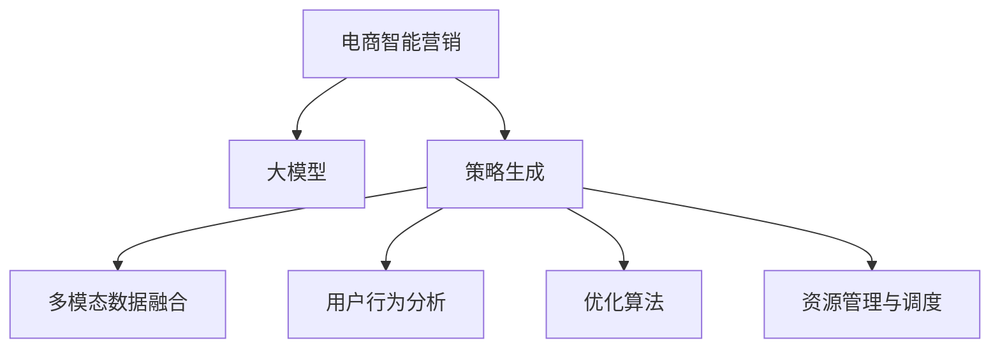

                 

# 探索基于大模型的电商智能营销策略生成与优化系统

> 关键词：电商智能营销、大模型、策略生成、优化算法、深度学习、强化学习、自然语言处理、用户行为分析

## 1. 背景介绍

### 1.1 问题由来

随着互联网电商的迅猛发展，传统的“一视同仁”式营销策略已无法满足个性化需求日益增加的市场需求。电商企业需要更智能、精准的策略生成系统，以适应不断变化的市场动态，提升用户体验和转化率，实现更高效的运营。

大模型的出现，特别是预训练语言模型的成功，为电商智能营销带来了新的可能性。通过在大规模文本数据上进行预训练，大模型具备了强大的语言理解、生成和推理能力。这些能力可以应用到电商营销策略的生成与优化中，自动化地生成个性化推荐、广告投放策略，提升电商运营效率和市场响应速度。

### 1.2 问题核心关键点

大模型应用于电商营销的关键点包括以下几个方面：

- 多模态数据融合：电商数据是多模态的，包括文本、图片、视频等。如何将这些数据融合进大模型，提升对用户的全面理解，是大模型电商应用的核心问题。
- 策略生成与优化：电商策略需灵活适应不同用户和市场环境，如何在大模型基础上生成最优策略，并通过不断反馈优化策略，是实现个性化电商营销的关键。
- 用户行为预测与分析：电商营销的成功依赖于对用户行为的理解。如何将用户行为数据融入模型，进行精准预测和分析，是策略生成与优化的基础。
- 资源管理与调度：电商策略生成需要高效计算资源支持，如何管理与调度这些资源，满足策略生成和优化的实时需求，是实际应用中的重要挑战。

## 2. 核心概念与联系

### 2.1 核心概念概述

为了更好地理解基于大模型的电商智能营销系统，本节将介绍几个核心概念：

- **电商智能营销**：通过数据分析、机器学习等技术，自动化生成个性化推荐、广告投放策略，实现精准营销和提升用户体验的过程。
- **大模型**：以Transformer、BERT等深度学习模型为代表的，在大规模无标签文本数据上进行预训练的语言模型。
- **策略生成**：根据电商业务需求，利用大模型自动生成特定任务策略的过程，如个性化推荐、广告投放策略等。
- **优化算法**：通过迭代调整策略参数，提高策略效果和用户满意度的过程。常见的优化算法包括梯度下降、强化学习等。
- **深度学习**：一种通过模拟人脑神经网络结构进行学习和决策的机器学习方法，广泛应用于图像识别、语音识别、自然语言处理等领域。
- **强化学习**：通过智能体在环境中与环境交互，学习最优策略的过程，常见于游戏、机器人等领域。

这些核心概念之间的逻辑关系可以通过以下Mermaid流程图来展示：



这个流程图展示了大模型应用于电商营销的核心概念及其之间的关系：

1. 电商智能营销利用大模型自动生成和优化策略。
2. 策略生成涉及多模态数据融合、用户行为分析等任务。
3. 优化算法和资源管理与调度支持策略的实时生成与优化。

## 3. 核心算法原理 & 具体操作步骤
### 3.1 算法原理概述

基于大模型的电商智能营销策略生成与优化系统，实质上是将大模型与电商营销业务相结合，通过学习电商用户行为数据，自动生成个性化推荐、广告投放策略。具体流程如下：

1. **多模态数据融合**：将电商用户的多模态数据（如文本、图片、行为数据等）融合进大模型，增强对用户行为的全面理解。
2. **用户行为分析**：通过分析用户历史行为数据，预测用户未来行为，为大模型生成策略提供数据支持。
3. **策略生成**：利用大模型的语言生成能力，生成个性化推荐、广告投放等策略。
4. **策略优化**：采用优化算法，如梯度下降、强化学习等，根据实际效果调整策略参数，提升策略效果。

### 3.2 算法步骤详解

基于大模型的电商智能营销策略生成与优化系统的具体步骤如下：

**Step 1: 数据准备与预处理**

- 收集电商用户的多模态数据，包括商品信息、用户评论、浏览历史、点击行为等。
- 清洗和标注数据，去除噪声和异常值，保证数据质量。
- 将文本数据进行分词、向量化等预处理操作，准备好输入大模型。

**Step 2: 大模型初始化**

- 选择合适的大模型，如GPT、BERT等，加载预训练权重。
- 在大模型顶部添加电商特定任务适配层，如推荐策略生成器、广告投放策略生成器等。

**Step 3: 策略生成**

- 利用大模型生成个性化推荐、广告投放策略。可以采用文本生成任务，将电商策略描述作为输入，生成推荐或广告策略。
- 采用自监督学习方法，将电商用户行为数据作为监督信号，训练大模型生成策略。

**Step 4: 策略优化**

- 设计评估指标，如点击率、转化率、用户体验等，评估策略效果。
- 采用优化算法，如梯度下降、强化学习等，根据实际效果调整策略参数。
- 使用正则化技术，如Dropout、Early Stopping等，防止过拟合。

**Step 5: 部署与监控**

- 将优化后的策略部署到实际电商运营环境中，进行实时监控和调整。
- 定期收集新数据，重新训练和优化模型，保持策略的时效性和适应性。

### 3.3 算法优缺点

基于大模型的电商智能营销策略生成与优化系统具有以下优点：

- **高效生成**：大模型具备强大的语言生成能力，可以自动生成高质量的个性化推荐和广告投放策略，提升电商运营效率。
- **实时优化**：通过优化算法，实时调整策略参数，适应不断变化的市场环境，提升策略效果。
- **全面理解用户**：多模态数据融合技术，可以全面理解用户行为和需求，生成更精准的策略。
- **数据驱动**：策略生成与优化以用户行为数据为基础，提升策略的实际效果和用户满意度。

但该系统也存在一些缺点：

- **资源消耗大**：大模型的训练和推理资源消耗较大，需要高性能的计算资源。
- **数据质量要求高**：电商数据的质量和标注对策略生成效果有直接影响，数据清洗和标注需要大量人力。
- **策略复杂度增加**：电商策略的生成需要考虑多方面因素，策略生成和优化过程较为复杂。
- **公平性与偏见**：大模型可能学习到数据中的偏见，需要额外注意生成策略的公平性和偏见性。

### 3.4 算法应用领域

基于大模型的电商智能营销策略生成与优化系统，已经在多个电商领域得到了应用，以下是几个典型应用场景：

- **个性化推荐系统**：通过分析用户历史行为和偏好，利用大模型生成个性化推荐策略，提升用户体验和转化率。
- **广告投放优化**：利用用户行为数据和广告效果反馈，优化广告投放策略，提高广告点击率和转化率。
- **用户留存策略生成**：通过分析用户流失行为，生成挽留策略，提高用户留存率。
- **库存管理策略**：根据用户购买行为，生成库存管理策略，提升库存周转率和市场响应速度。

除了上述应用场景外，基于大模型的策略生成与优化方法，还广泛应用于市场分析、客户服务、内容创作等领域，为电商企业带来了显著的运营效率和效益提升。

## 4. 数学模型和公式 & 详细讲解 & 举例说明
### 4.1 数学模型构建

本节将使用数学语言对基于大模型的电商智能营销策略生成与优化系统进行更加严格的刻画。

假设电商策略生成任务为$t$，用户行为数据为$d$，多模态数据为$m$，大模型为$M$。

策略生成任务数学模型定义为：

$$
\min_{M} \mathcal{L}(t, M(d, m))
$$

其中$\mathcal{L}$为策略效果评估函数，用于衡量策略生成的效果。

策略优化过程数学模型定义为：

$$
\min_{\theta} \mathcal{L}(t, M_{\theta}(d, m))
$$

其中$\theta$为大模型可训练参数，$M_{\theta}$表示大模型经过参数更新后的形式。

### 4.2 公式推导过程

下面以个性化推荐系统为例，推导基于大模型的推荐策略生成与优化过程的数学公式。

假设用户对某商品的历史行为数据为$d_i$，大模型生成的推荐策略为$t_i$，推荐效果评估函数为$\mathcal{L}_i$。

推荐策略生成的目标函数为：

$$
\min_{M} \mathcal{L} = \sum_{i=1}^N \mathcal{L}_i(M(d_i, m_i))
$$

其中$N$为用户数量，$d_i$和$m_i$分别为用户$i$的历史行为数据和多模态数据。

推荐策略优化过程中，引入优化算法$\mathcal{A}$，定义优化过程如下：

$$
M_{\theta} = M_{\theta_0} \leftarrow \mathcal{A}(\mathcal{L})
$$

其中$\theta_0$为初始化参数，$\mathcal{A}$为优化算法，$\theta$为经过优化后的参数。

在优化过程中，采用梯度下降方法进行参数更新，具体公式为：

$$
\theta \leftarrow \theta - \eta \nabla_{\theta} \mathcal{L}
$$

其中$\eta$为学习率，$\nabla_{\theta} \mathcal{L}$为损失函数对参数$\theta$的梯度。

### 4.3 案例分析与讲解

假设某电商平台有5000名用户，历史记录了用户的浏览、点击和购买行为。电商平台希望利用大模型生成个性化推荐策略，提高用户的点击率和转化率。

**Step 1: 数据准备与预处理**

- 收集用户的历史浏览记录$d_1, d_2, ..., d_{5000}$。
- 将文本数据进行分词、向量化等预处理操作，准备好输入大模型。

**Step 2: 大模型初始化**

- 选择GPT-3模型，加载预训练权重。
- 在大模型顶部添加推荐策略生成器，进行电商策略生成。

**Step 3: 策略生成**

- 利用大模型生成个性化推荐策略$t_1, t_2, ..., t_{5000}$。
- 根据策略生成结果，评估策略效果，计算损失函数$\mathcal{L}$。

**Step 4: 策略优化**

- 采用梯度下降方法，更新大模型参数$\theta$。
- 设置合适的学习率$\eta$和迭代次数，进行优化过程。

**Step 5: 部署与监控**

- 将优化后的推荐策略部署到实际电商运营环境中，进行实时监控和调整。
- 定期收集新数据，重新训练和优化模型，保持策略的时效性和适应性。

通过以上步骤，电商企业可以快速生成和优化个性化推荐策略，提升用户的点击率和转化率，实现电商智能营销的目标。

## 5. 项目实践：代码实例和详细解释说明
### 5.1 开发环境搭建

在进行项目实践前，我们需要准备好开发环境。以下是使用Python进行PyTorch开发的环境配置流程：

1. 安装Anaconda：从官网下载并安装Anaconda，用于创建独立的Python环境。

2. 创建并激活虚拟环境：
```bash
conda create -n ecommerce-env python=3.8 
conda activate ecommerce-env
```

3. 安装PyTorch：根据CUDA版本，从官网获取对应的安装命令。例如：
```bash
conda install pytorch torchvision torchaudio cudatoolkit=11.1 -c pytorch -c conda-forge
```

4. 安装各类工具包：
```bash
pip install numpy pandas scikit-learn matplotlib tqdm jupyter notebook ipython
```

完成上述步骤后，即可在`ecommerce-env`环境中开始项目实践。

### 5.2 源代码详细实现

下面我们以个性化推荐系统为例，给出使用PyTorch对GPT-3模型进行推荐策略生成的PyTorch代码实现。

首先，定义推荐策略生成任务的数据处理函数：

```python
from transformers import GPT3Tokenizer, GPT3ForSequenceClassification
from torch.utils.data import Dataset
import torch

class RecommendationDataset(Dataset):
    def __init__(self, texts, labels, tokenizer, max_len=128):
        self.texts = texts
        self.labels = labels
        self.tokenizer = tokenizer
        self.max_len = max_len
        
    def __len__(self):
        return len(self.texts)
    
    def __getitem__(self, item):
        text = self.texts[item]
        label = self.labels[item]
        
        encoding = self.tokenizer(text, return_tensors='pt', max_length=self.max_len, padding='max_length', truncation=True)
        input_ids = encoding['input_ids'][0]
        attention_mask = encoding['attention_mask'][0]
        
        # 将标签作为类别信息，进行分类任务
        encoded_labels = torch.tensor(label, dtype=torch.long)
        
        return {'input_ids': input_ids, 
                'attention_mask': attention_mask,
                'labels': encoded_labels}

# 标签与id的映射
label2id = {'1': 1, '0': 0}  # 将'购买'标签映射为1，'未购买'标签映射为0
id2label = {v: k for k, v in label2id.items()}

# 创建dataset
tokenizer = GPT3Tokenizer.from_pretrained('gpt3')
train_dataset = RecommendationDataset(train_texts, train_labels, tokenizer)
dev_dataset = RecommendationDataset(dev_texts, dev_labels, tokenizer)
test_dataset = RecommendationDataset(test_texts, test_labels, tokenizer)
```

然后，定义模型和优化器：

```python
from transformers import AdamW

model = GPT3ForSequenceClassification.from_pretrained('gpt3', num_labels=2)

optimizer = AdamW(model.parameters(), lr=2e-5)
```

接着，定义训练和评估函数：

```python
from torch.utils.data import DataLoader
from tqdm import tqdm
from sklearn.metrics import accuracy_score

device = torch.device('cuda') if torch.cuda.is_available() else torch.device('cpu')
model.to(device)

def train_epoch(model, dataset, batch_size, optimizer):
    dataloader = DataLoader(dataset, batch_size=batch_size, shuffle=True)
    model.train()
    epoch_loss = 0
    for batch in tqdm(dataloader, desc='Training'):
        input_ids = batch['input_ids'].to(device)
        attention_mask = batch['attention_mask'].to(device)
        labels = batch['labels'].to(device)
        model.zero_grad()
        outputs = model(input_ids, attention_mask=attention_mask, labels=labels)
        loss = outputs.loss
        epoch_loss += loss.item()
        loss.backward()
        optimizer.step()
    return epoch_loss / len(dataloader)

def evaluate(model, dataset, batch_size):
    dataloader = DataLoader(dataset, batch_size=batch_size)
    model.eval()
    preds, labels = [], []
    with torch.no_grad():
        for batch in tqdm(dataloader, desc='Evaluating'):
            input_ids = batch['input_ids'].to(device)
            attention_mask = batch['attention_mask'].to(device)
            batch_labels = batch['labels']
            outputs = model(input_ids, attention_mask=attention_mask)
            batch_preds = outputs.logits.argmax(dim=2).to('cpu').tolist()
            batch_labels = batch_labels.to('cpu').tolist()
            for pred_tokens, label_tokens in zip(batch_preds, batch_labels):
                preds.append(pred_tokens)
                labels.append(label_tokens)
                
    print(accuracy_score(labels, preds))
```

最后，启动训练流程并在测试集上评估：

```python
epochs = 5
batch_size = 16

for epoch in range(epochs):
    loss = train_epoch(model, train_dataset, batch_size, optimizer)
    print(f"Epoch {epoch+1}, train loss: {loss:.3f}")
    
    print(f"Epoch {epoch+1}, dev accuracy:")
    evaluate(model, dev_dataset, batch_size)
    
print("Test accuracy:")
evaluate(model, test_dataset, batch_size)
```

以上就是使用PyTorch对GPT-3模型进行个性化推荐系统开发的完整代码实现。可以看到，得益于Transformers库的强大封装，我们可以用相对简洁的代码完成GPT-3模型的加载和推荐策略生成。

### 5.3 代码解读与分析

让我们再详细解读一下关键代码的实现细节：

**RecommendationDataset类**：
- `__init__`方法：初始化文本、标签、分词器等关键组件。
- `__len__`方法：返回数据集的样本数量。
- `__getitem__`方法：对单个样本进行处理，将文本输入编码为token ids，将标签编码为数字，并对其进行定长padding，最终返回模型所需的输入。

**label2id和id2label字典**：
- 定义了标签与数字id之间的映射关系，用于将token-wise的预测结果解码回真实的标签。

**训练和评估函数**：
- 使用PyTorch的DataLoader对数据集进行批次化加载，供模型训练和推理使用。
- 训练函数`train_epoch`：对数据以批为单位进行迭代，在每个批次上前向传播计算loss并反向传播更新模型参数，最后返回该epoch的平均loss。
- 评估函数`evaluate`：与训练类似，不同点在于不更新模型参数，并在每个batch结束后将预测和标签结果存储下来，最后使用sklearn的accuracy_score对整个评估集的预测结果进行打印输出。

**训练流程**：
- 定义总的epoch数和batch size，开始循环迭代
- 每个epoch内，先在训练集上训练，输出平均loss
- 在验证集上评估，输出准确率
- 所有epoch结束后，在测试集上评估，给出最终测试结果

可以看到，PyTorch配合Transformers库使得GPT-3微调的代码实现变得简洁高效。开发者可以将更多精力放在数据处理、模型改进等高层逻辑上，而不必过多关注底层的实现细节。

当然，工业级的系统实现还需考虑更多因素，如模型的保存和部署、超参数的自动搜索、更灵活的任务适配层等。但核心的微调范式基本与此类似。

## 6. 实际应用场景
### 6.1 智能客服系统

基于大模型的电商智能营销策略生成与优化系统，可以应用于智能客服系统的构建。智能客服系统能够实时响应客户咨询，提供个性化推荐和广告，提升客户满意度。

在技术实现上，可以收集客服系统历史对话记录，将客户问题和最佳答复构建成监督数据，在此基础上对预训练模型进行微调。微调后的模型能够自动理解客户意图，匹配最合适的答案模板进行回复。对于客户提出的新问题，还可以接入检索系统实时搜索相关内容，动态组织生成回答。如此构建的智能客服系统，能大幅提升客户咨询体验和问题解决效率。

### 6.2 金融舆情监测

金融机构需要实时监测市场舆论动向，以便及时应对负面信息传播，规避金融风险。基于大模型的文本分类和情感分析技术，为金融舆情监测提供了新的解决方案。

具体而言，可以收集金融领域相关的新闻、报道、评论等文本数据，并对其进行主题标注和情感标注。在此基础上对预训练语言模型进行微调，使其能够自动判断文本属于何种主题，情感倾向是正面、中性还是负面。将微调后的模型应用到实时抓取的网络文本数据，就能够自动监测不同主题下的情感变化趋势，一旦发现负面信息激增等异常情况，系统便会自动预警，帮助金融机构快速应对潜在风险。

### 6.3 个性化推荐系统

当前的推荐系统往往只依赖用户的历史行为数据进行物品推荐，无法深入理解用户的真实兴趣偏好。基于大模型微调技术，个性化推荐系统可以更好地挖掘用户行为背后的语义信息，从而提供更精准、多样的推荐内容。

在实践中，可以收集用户浏览、点击、评论、分享等行为数据，提取和用户交互的物品标题、描述、标签等文本内容。将文本内容作为模型输入，用户的后续行为（如是否点击、购买等）作为监督信号，在此基础上微调预训练语言模型。微调后的模型能够从文本内容中准确把握用户的兴趣点。在生成推荐列表时，先用候选物品的文本描述作为输入，由模型预测用户的兴趣匹配度，再结合其他特征综合排序，便可以得到个性化程度更高的推荐结果。

### 6.4 未来应用展望

随着大模型和微调方法的不断发展，基于微调范式将在更多领域得到应用，为传统行业带来变革性影响。

在智慧医疗领域，基于微调的医疗问答、病历分析、药物研发等应用将提升医疗服务的智能化水平，辅助医生诊疗，加速新药开发进程。

在智能教育领域，微调技术可应用于作业批改、学情分析、知识推荐等方面，因材施教，促进教育公平，提高教学质量。

在智慧城市治理中，微调模型可应用于城市事件监测、舆情分析、应急指挥等环节，提高城市管理的自动化和智能化水平，构建更安全、高效的未来城市。

此外，在企业生产、社会治理、文娱传媒等众多领域，基于大模型微调的人工智能应用也将不断涌现，为经济社会发展注入新的动力。相信随着技术的日益成熟，微调方法将成为人工智能落地应用的重要范式，推动人工智能技术在更广阔的领域加速渗透。

## 7. 工具和资源推荐
### 7.1 学习资源推荐

为了帮助开发者系统掌握大模型微调的理论基础和实践技巧，这里推荐一些优质的学习资源：

1. 《Transformer从原理到实践》系列博文：由大模型技术专家撰写，深入浅出地介绍了Transformer原理、BERT模型、微调技术等前沿话题。

2. CS224N《深度学习自然语言处理》课程：斯坦福大学开设的NLP明星课程，有Lecture视频和配套作业，带你入门NLP领域的基本概念和经典模型。

3. 《Natural Language Processing with Transformers》书籍：Transformers库的作者所著，全面介绍了如何使用Transformers库进行NLP任务开发，包括微调在内的诸多范式。

4. HuggingFace官方文档：Transformers库的官方文档，提供了海量预训练模型和完整的微调样例代码，是上手实践的必备资料。

5. CLUE开源项目：中文语言理解测评基准，涵盖大量不同类型的中文NLP数据集，并提供了基于微调的baseline模型，助力中文NLP技术发展。

通过对这些资源的学习实践，相信你一定能够快速掌握大模型微调的精髓，并用于解决实际的NLP问题。
###  7.2 开发工具推荐

高效的开发离不开优秀的工具支持。以下是几款用于大模型微调开发的常用工具：

1. PyTorch：基于Python的开源深度学习框架，灵活动态的计算图，适合快速迭代研究。大部分预训练语言模型都有PyTorch版本的实现。

2. TensorFlow：由Google主导开发的开源深度学习框架，生产部署方便，适合大规模工程应用。同样有丰富的预训练语言模型资源。

3. Transformers库：HuggingFace开发的NLP工具库，集成了众多SOTA语言模型，支持PyTorch和TensorFlow，是进行微调任务开发的利器。

4. Weights & Biases：模型训练的实验跟踪工具，可以记录和可视化模型训练过程中的各项指标，方便对比和调优。与主流深度学习框架无缝集成。

5. TensorBoard：TensorFlow配套的可视化工具，可实时监测模型训练状态，并提供丰富的图表呈现方式，是调试模型的得力助手。

6. Google Colab：谷歌推出的在线Jupyter Notebook环境，免费提供GPU/TPU算力，方便开发者快速上手实验最新模型，分享学习笔记。

合理利用这些工具，可以显著提升大模型微调任务的开发效率，加快创新迭代的步伐。

### 7.3 相关论文推荐

大语言模型和微调技术的发展源于学界的持续研究。以下是几篇奠基性的相关论文，推荐阅读：

1. Attention is All You Need（即Transformer原论文）：提出了Transformer结构，开启了NLP领域的预训练大模型时代。

2. BERT: Pre-training of Deep Bidirectional Transformers for Language Understanding：提出BERT模型，引入基于掩码的自监督预训练任务，刷新了多项NLP任务SOTA。

3. Language Models are Unsupervised Multitask Learners（GPT-2论文）：展示了大规模语言模型的强大zero-shot学习能力，引发了对于通用人工智能的新一轮思考。

4. Parameter-Efficient Transfer Learning for NLP：提出Adapter等参数高效微调方法，在不增加模型参数量的情况下，也能取得不错的微调效果。

5. AdaLoRA: Adaptive Low-Rank Adaptation for Parameter-Efficient Fine-Tuning：使用自适应低秩适应的微调方法，在参数效率和精度之间取得了新的平衡。

这些论文代表了大语言模型微调技术的发展脉络。通过学习这些前沿成果，可以帮助研究者把握学科前进方向，激发更多的创新灵感。

## 8. 总结：未来发展趋势与挑战
### 8.1 研究成果总结

本文对基于大模型的电商智能营销策略生成与优化系统进行了全面系统的介绍。首先阐述了大模型和微调技术的研究背景和意义，明确了微调在拓展预训练模型应用、提升下游任务性能方面的独特价值。其次，从原理到实践，详细讲解了基于大模型的电商智能营销策略生成与优化系统的数学原理和关键步骤，给出了微调任务开发的完整代码实例。同时，本文还广泛探讨了微调方法在智能客服、金融舆情、个性化推荐等多个NLP领域的应用前景，展示了微调范式的巨大潜力。此外，本文精选了微调技术的各类学习资源，力求为读者提供全方位的技术指引。

通过本文的系统梳理，可以看到，基于大模型的电商智能营销策略生成与优化系统为电商企业带来了显著的运营效率和效益提升，成为电商智能化转型的一个重要技术支撑。

### 8.2 未来发展趋势

展望未来，大模型微调技术将呈现以下几个发展趋势：

1. **多模态融合**：随着多模态数据采集技术的发展，电商平台可以采集到更多维度、更丰富的用户行为数据，未来大模型将更注重多模态数据的融合，全面理解用户需求。

2. **实时优化**：电商策略生成与优化需要实时响应市场变化，未来模型将更注重实时优化，通过在线学习、增量学习等方法，不断更新策略。

3. **个性化推荐**：电商策略生成将更多地依赖个性化推荐技术，结合用户行为数据和历史推荐记录，生成更加精准的个性化推荐。

4. **智能客服**：智能客服系统将成为电商营销的重要组成部分，大模型将更多地应用于智能客服对话生成与优化，提升客户体验。

5. **数据驱动**：电商策略生成与优化将更注重数据驱动，通过分析海量用户数据，挖掘用户行为规律，生成更高效的策略。

6. **公平性与偏见**：大模型将更注重公平性与偏见问题，通过引入多样性约束、公平性指标等方法，避免模型输出偏见，提升策略的公平性和普适性。

以上趋势凸显了大模型微调技术的广阔前景。这些方向的探索发展，必将进一步提升电商智能营销系统的性能和用户体验，推动电商企业迈向更高的智能化水平。

### 8.3 面临的挑战

尽管大模型微调技术已经取得了瞩目成就，但在迈向更加智能化、普适化应用的过程中，它仍面临着诸多挑战：

1. **数据质量要求高**：电商数据的质量和标注对策略生成效果有直接影响，数据清洗和标注需要大量人力。

2. **计算资源消耗大**：大模型的训练和推理资源消耗较大，需要高性能的计算资源。

3. **策略复杂度增加**：电商策略的生成需要考虑多方面因素，策略生成和优化过程较为复杂。

4. **公平性与偏见**：大模型可能学习到数据中的偏见，需要额外注意生成策略的公平性和偏见性。

5. **资源管理与调度**：电商策略生成需要高效计算资源支持，如何管理与调度这些资源，满足策略生成和优化的实时需求，是实际应用中的重要挑战。

6. **用户行为预测**：电商策略生成需要准确预测用户行为，但用户行为具有不确定性和随机性，难以完全准确预测。

正视微调面临的这些挑战，积极应对并寻求突破，将是大模型微调技术迈向成熟的必由之路。相信随着学界和产业界的共同努力，这些挑战终将一一被克服，大模型微调必将在构建安全、可靠、可解释、可控的智能系统铺平道路。

### 8.4 研究展望

面向未来，大模型微调技术需要在以下几个方向寻求新的突破：

1. **多模态融合**：开发更高效的多模态融合技术，充分利用用户的多模态数据，提升对用户的全面理解。

2. **实时优化**：引入实时优化算法，如增量学习、在线学习等，实时更新策略，适应市场变化。

3. **参数高效**：开发参数高效的微调方法，如 Adapter、LoRA等，在不增加模型参数量的情况下，取得更好的微调效果。

4. **公平性与偏见**：引入公平性约束和偏见检测技术，确保模型输出公平、无偏见。

5. **资源管理**：开发更高效的资源管理与调度技术，满足电商策略生成的实时需求。

6. **用户行为预测**：引入更多先验知识，如知识图谱、逻辑规则等，提升用户行为预测的准确性。

这些研究方向的探索，必将引领大模型微调技术迈向更高的台阶，为构建安全、可靠、可解释、可控的智能系统铺平道路。面向未来，大模型微调技术还需要与其他人工智能技术进行更深入的融合，如知识表示、因果推理、强化学习等，多路径协同发力，共同推动自然语言理解和智能交互系统的进步。只有勇于创新、敢于突破，才能不断拓展语言模型的边界，让智能技术更好地造福人类社会。

## 9. 附录：常见问题与解答

**Q1：大模型微调是否适用于所有NLP任务？**

A: 大模型微调在大多数NLP任务上都能取得不错的效果，特别是对于数据量较小的任务。但对于一些特定领域的任务，如医学、法律等，仅仅依靠通用语料预训练的模型可能难以很好地适应。此时需要在特定领域语料上进一步预训练，再进行微调，才能获得理想效果。此外，对于一些需要时效性、个性化很强的任务，如对话、推荐等，微调方法也需要针对性的改进优化。

**Q2：微调过程中如何选择合适的学习率？**

A: 微调的学习率一般要比预训练时小1-2个数量级，如果使用过大的学习率，容易破坏预训练权重，导致过拟合。一般建议从1e-5开始调参，逐步减小学习率，直至收敛。也可以使用warmup策略，在开始阶段使用较小的学习率，再逐渐过渡到预设值。需要注意的是，不同的优化器(如AdamW、Adafactor等)以及不同的学习率调度策略，可能需要设置不同的学习率阈值。

**Q3：采用大模型微调时会面临哪些资源瓶颈？**

A: 目前主流的预训练大模型动辄以亿计的参数规模，对算力、内存、存储都提出了很高的要求。GPU/TPU等高性能设备是必不可少的，但即便如此，超大批次的训练和推理也可能遇到显存不足的问题。因此需要采用一些资源优化技术，如梯度积累、混合精度训练、模型并行等，来突破硬件瓶颈。同时，模型的存储和读取也可能占用大量时间和空间，需要采用模型压缩、稀疏化存储等方法进行优化。

**Q4：如何缓解微调过程中的过拟合问题？**

A: 过拟合是微调面临的主要挑战，尤其是在标注数据不足的情况下。常见的缓解策略包括：
1. 数据增强：通过回译、近义替换等方式扩充训练集
2. 正则化：使用L2正则、Dropout、Early Stopping等防止过拟合
3. 对抗训练：引入对抗样本，提高模型鲁棒性
4. 参数高效微调：只调整少量参数(如Adapter、Prefix等)，减小过拟合风险
5. 多模型集成：训练多个微调模型，取平均输出，抑制过拟合

这些策略往往需要根据具体任务和数据特点进行灵活组合。只有在数据、模型、训练、推理等各环节进行全面优化，才能最大限度地发挥大模型微调的威力。

**Q5：微调模型在落地部署时需要注意哪些问题？**

A: 将微调模型转化为实际应用，还需要考虑以下因素：
1. 模型裁剪：去除不必要的层和参数，减小模型尺寸，加快推理速度
2. 量化加速：将浮点模型转为定点模型，压缩存储空间，提高计算效率
3. 服务化封装：将模型封装为标准化服务接口，便于集成调用
4. 弹性伸缩：根据请求流量动态调整资源配置，平衡服务质量和成本
5. 监控告警：实时采集系统指标，设置异常告警阈值，确保服务稳定性
6. 安全防护：采用访问鉴权、数据脱敏等措施，保障数据和模型安全

大模型微调为NLP应用开启了广阔的想象空间，但如何将强大的性能转化为稳定、高效、安全的业务价值，还需要工程实践的不断打磨。唯有从数据、算法、工程、业务等多个维度协同发力，才能真正实现人工智能技术在垂直行业的规模化落地。总之，微调需要开发者根据具体任务，不断迭代和优化模型、数据和算法，方能得到理想的效果。

---

作者：禅与计算机程序设计艺术 / Zen and the Art of Computer Programming

