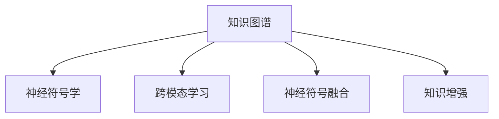

                 

# 探讨LLM的知识表示方法：超越传统神经网络

> 关键词：
> - 知识表示 (Knowledge Representation)
> - 深度神经网络 (Deep Neural Networks)
> - 知识图谱 (Knowledge Graph)
> - 神经符号学 (Neuro-Semantics)
> - 跨模态学习 (Cross-modal Learning)
> - 神经符号融合 (Neuro-Symbolic Fusion)
> - 知识增强 (Knowledge-Enhanced Learning)

## 1. 背景介绍

### 1.1 问题由来
大语言模型 (Large Language Models, LLMs) 自问世以来，已经取得了令人瞩目的成果，包括 GPT-3、BERT 和 T5 等。这些模型基于大规模预训练文本数据，通过自监督任务学习到丰富的语言知识，能够在多种自然语言处理任务上表现出超凡的性能。然而，现有的大模型仍存在一些局限性，主要体现在知识表示的深度和广度上。传统神经网络模型在知识表示方面有诸多不足，限制了其在复杂场景下的应用能力。

### 1.2 问题核心关键点
为解决传统神经网络模型在知识表示上的局限性，研究人员开始探索新的知识表示方法。其中，知识图谱、神经符号学和跨模态学习是三个具有代表性的研究方向。这些新方法在知识表示的深度和广度上取得了显著的进展，有潜力在未来突破现有大语言模型的知识瓶颈，进一步提升模型的理解和生成能力。

### 1.3 问题研究意义
研究超越传统神经网络的知识表示方法，对于推动人工智能技术的发展具有重要意义：

1. 提升模型理解能力。深度神经网络模型在处理复杂知识时往往表现不佳，通过引入知识图谱和神经符号学，可以更好地建模复杂的概念关系和推理过程。
2. 增强模型生成能力。知识图谱和跨模态学习可以引入外部知识，提高模型生成自然语言的质量和逻辑性。
3. 优化模型性能。通过跨模态学习，模型可以同时利用多种数据类型（如图像、文本、语音等），提升在各种场景下的性能。
4. 拓展模型应用。知识图谱和神经符号学方法可以应用于医疗、金融、法律等专业领域，提升模型在这些领域的应用能力。

## 2. 核心概念与联系

### 2.1 核心概念概述

为更好地理解超越传统神经网络的知识表示方法，本节将介绍几个密切相关的核心概念：

- 知识图谱 (Knowledge Graph)：由节点和边构成的图形结构，用于表示实体、属性和它们之间的关系。
- 神经符号学 (Neuro-Semantics)：结合符号计算和深度学习的学科，旨在通过符号推理增强神经网络的理解能力。
- 跨模态学习 (Cross-modal Learning)：学习并利用多模态数据（如文本、图像、语音等），提升模型的综合理解能力。
- 神经符号融合 (Neuro-Symbolic Fusion)：将符号计算和神经网络进行融合，实现二者的优势互补。
- 知识增强 (Knowledge-Enhanced Learning)：在传统深度学习模型的基础上，引入外部知识，提升模型性能。

这些核心概念之间的逻辑关系可以通过以下Mermaid流程图来展示：



这个流程图展示了一些新方法之间的联系，并指出了它们在知识表示方面的相互支持。

## 3. 核心算法原理 & 具体操作步骤
### 3.1 算法原理概述

基于神经符号学的知识表示方法，通过引入符号推理，可以增强大语言模型在知识理解和生成方面的能力。这类方法主要分为两个方向：

1. 符号计算与深度学习的融合 (Neuro-Semantics)：通过符号推理和神经网络计算的结合，使得模型具备更强的逻辑推理能力。
2. 跨模态知识学习 (Cross-modal Learning)：利用不同模态的数据，增强模型的综合理解能力。

### 3.2 算法步骤详解

以符号计算与深度学习的融合为例，其大致步骤包括：

**Step 1: 构建符号知识库**
- 创建符号化的知识图谱，包含实体、属性和它们之间的关系。
- 定义符号计算规则，用于在知识图谱上进行逻辑推理。

**Step 2: 设计符号-神经网络接口**
- 将符号知识库中的信息编码为向量，输入神经网络。
- 设计符号计算模块，将符号知识图谱中的推理逻辑嵌入到神经网络中。

**Step 3: 训练神经网络**
- 使用带有符号知识的信息作为输入，训练神经网络，学习符号推理和深度学习计算的联合表示。
- 在训练过程中，逐步优化符号计算模块，使得符号推理和深度学习的计算更加紧密结合。

**Step 4: 模型微调**
- 在特定任务上，使用少量标注数据对模型进行微调，以适应具体应用场景。
- 结合符号计算和深度学习计算，提高模型在复杂任务上的表现。

**Step 5: 推理生成**
- 在推理生成阶段，使用符号计算模块进行逻辑推理，结合深度学习模型生成自然语言。
- 通过符号计算模块和深度学习模块的协同工作，提高模型输出的一致性和逻辑性。

### 3.3 算法优缺点

基于符号计算与深度学习的融合方法，具有以下优点：

1. 提升逻辑推理能力。符号计算规则可以嵌入到神经网络中，增强模型的逻辑推理和知识表示能力。
2. 增强模型理解力。符号知识图谱提供了丰富的语义信息，提升模型在复杂任务上的理解力。
3. 促进知识共享。符号知识图谱可以跨领域共享，促进模型在多领域的应用。

同时，该方法也存在一定的局限性：

1. 复杂度增加。符号计算和深度学习的结合增加了模型的复杂度，可能导致训练和推理效率下降。
2. 资源需求高。构建符号知识库需要大量的人力资源和计算资源，成本较高。
3. 可解释性降低。由于符号计算的存在，模型的内部工作机制更加复杂，难以进行有效的解释。

### 3.4 算法应用领域

基于符号计算与深度学习的融合方法，在以下几个领域具有广泛的应用潜力：

1. 法律咨询。利用法律知识图谱和符号推理，提供专业的法律咨询和纠纷解决。
2. 金融风险分析。构建金融知识图谱，结合神经网络进行风险评估和预测。
3. 医疗诊断。引入医学知识图谱和符号推理，辅助医生进行疾病诊断和治疗方案制定。
4. 教育辅助。结合教育知识图谱和符号计算，为学生提供个性化的学习建议和反馈。
5. 推荐系统。通过用户行为数据和产品知识图谱，进行推荐算法的设计和优化。

## 4. 数学模型和公式 & 详细讲解 & 举例说明

### 4.1 数学模型构建

本节将使用数学语言对基于符号计算与深度学习的融合方法进行更加严格的刻画。

记神经网络模型为 $f_{\theta}$，其中 $\theta$ 为神经网络参数。假设符号知识图谱为 $G=(E,R)$，其中 $E$ 为实体集合，$R$ 为关系集合。定义符号计算规则 $r_e$，将 $E$ 和 $R$ 映射为向量表示，输入到神经网络中。

设 $h_e \in \mathbb{R}^d$ 为实体 $e \in E$ 的向量表示，$w_r \in \mathbb{R}^d$ 为关系 $r \in R$ 的权重向量。则符号计算规则 $r_e$ 可以表示为：

$$
h_{e_r} = \text{Logistic}(\sum_{r \in R} w_r h_e)
$$

其中 $\text{Logistic}$ 函数用于将符号计算结果映射到 $[0,1]$ 区间内，作为神经网络的输入。

### 4.2 公式推导过程

以医疗诊断为例，假设输入的病历 $d$ 包含多个实体 $e_1, e_2, ..., e_n$ 和它们之间的关系 $r_{i,j}$。符号计算规则 $r_{i,j}$ 可以表示为：

$$
h_{e_{i,j}} = \text{Logistic}(\sum_{r \in R} w_r h_{e_i} h_{e_j})
$$

其中 $h_{e_{i,j}}$ 为实体 $e_{i,j}$ 的向量表示，$w_r$ 为关系 $r$ 的权重向量。

将病历 $d$ 编码为向量 $d_{\theta} \in \mathbb{R}^d$，输入神经网络 $f_{\theta}$ 进行计算。设 $o_{\theta} \in \mathbb{R}^k$ 为输出向量，则神经网络可以表示为：

$$
o_{\theta} = f_{\theta}(d_{\theta})
$$

在训练过程中，使用带有符号知识的信息作为输入，优化神经网络参数 $\theta$，使得模型输出 $o_{\theta}$ 接近于真实的疾病诊断结果 $o_{true}$。具体地，定义损失函数 $\mathcal{L}(\theta)$ 为：

$$
\mathcal{L}(\theta) = \sum_{i=1}^N \mathbb{1}(y_i \neq o_{true}) \ell(f_{\theta}(d_{\theta}))
$$

其中 $y_i$ 为病历 $d_i$ 的实际诊断结果，$\mathbb{1}(y_i \neq o_{true})$ 为表示 $y_i$ 与 $o_{true}$ 不一致的指示变量，$\ell$ 为损失函数（如交叉熵损失）。

在得到损失函数后，通过梯度下降等优化算法，最小化损失函数，更新神经网络参数 $\theta$，使得模型输出 $o_{\theta}$ 逼近真实的诊断结果 $o_{true}$。

### 4.3 案例分析与讲解

假设我们要在病历 $d$ 上训练一个医疗诊断模型。具体步骤如下：

**Step 1: 构建病历知识图谱**
- 定义病历中的实体和关系，构建知识图谱 $G=(E,R)$。
- 为每个实体和关系定义符号计算规则 $r_e$。

**Step 2: 设计神经网络接口**
- 将病历 $d$ 编码为向量 $d_{\theta} \in \mathbb{R}^d$。
- 设计符号计算模块 $r_{e_{i,j}}$，将实体 $e_{i,j}$ 和关系 $r$ 的向量表示进行逻辑推理。

**Step 3: 训练神经网络**
- 使用带有符号知识的病历数据训练神经网络 $f_{\theta}$。
- 优化神经网络参数 $\theta$，使得模型输出 $o_{\theta}$ 接近于真实的诊断结果 $o_{true}$。

**Step 4: 推理生成**
- 在推理阶段，使用符号计算模块 $r_{e_{i,j}}$ 进行逻辑推理，结合深度学习模型生成自然语言诊断报告。
- 通过符号计算和深度学习计算的联合作用，提高模型输出的合理性和逻辑性。

## 5. 项目实践：代码实例和详细解释说明
### 5.1 开发环境搭建

在进行神经符号学知识表示方法的研究和实践前，我们需要准备好开发环境。以下是使用Python进行PyTorch和符号计算工具Sympy开发的环境配置流程：

1. 安装Anaconda：从官网下载并安装Anaconda，用于创建独立的Python环境。

2. 创建并激活虚拟环境：
```bash
conda create -n pytorch-env python=3.8 
conda activate pytorch-env
```

3. 安装PyTorch：根据CUDA版本，从官网获取对应的安装命令。例如：
```bash
conda install pytorch torchvision torchaudio cudatoolkit=11.1 -c pytorch -c conda-forge
```

4. 安装Sympy：
```bash
pip install sympy
```

5. 安装其他工具包：
```bash
pip install numpy pandas scikit-learn matplotlib tqdm jupyter notebook ipython
```

完成上述步骤后，即可在`pytorch-env`环境中开始神经符号学知识表示方法的研究和实践。

### 5.2 源代码详细实现

下面我们以医疗诊断为例，给出使用PyTorch和Sympy进行符号计算与深度学习融合的PyTorch代码实现。

首先，定义病历知识图谱：

```python
from sympy import Symbol, S, Eq, solve

# 定义实体和关系
patients = {'Alice', 'Bob', 'Charlie'}
symptoms = {'Fever', 'Cough', 'Sore_throat'}
tests = {'X_ray', 'Blood_test', 'CT_scan'}

# 定义符号计算规则
def compute_symptom_test_relations(patient, symptom, test):
    symptom_vec = Symbol(f'symptom_{symptom}')
    test_vec = Symbol(f'test_{test}')
    relation_vec = Symbol(f'relation_{patient}_{symptom}_{test}')
    # 根据症状和检查结果，定义推理规则
    eq1 = Eq(relation_vec, symptom_vec * test_vec)
    # 根据患者和症状，定义推理规则
    eq2 = Eq(relation_vec, patient * symptom_vec)
    # 求解方程，获取推理结果
    result = solve([eq1, eq2], (symptom_vec, test_vec, relation_vec))
    return result[relation_vec]

# 示例病历数据
def create_case():
    return {'Patient': 'Alice', 'Symptoms': ['Fever', 'Cough', 'Sore_throat'], 'Tests': ['X_ray', 'Blood_test']}
```

然后，定义神经网络模型：

```python
from transformers import BertForTokenClassification, AdamW
from sympy import init_printing

# 初始化符号计算
init_printing()

# 定义神经网络模型
model = BertForTokenClassification.from_pretrained('bert-base-cased', num_labels=len(symptoms))

# 定义损失函数
criterion = torch.nn.CrossEntropyLoss()
```

接着，定义训练和评估函数：

```python
from torch.utils.data import Dataset, DataLoader
from tqdm import tqdm
import torch.nn.functional as F

class CaseDataset(Dataset):
    def __init__(self, cases):
        self.cases = cases

    def __len__(self):
        return len(self.cases)

    def __getitem__(self, item):
        case = self.cases[item]
        patient = case['Patient']
        symptoms = case['Symptoms']
        tests = case['Tests']
        symptom_test_relations = [compute_symptom_test_relations(patient, symptom, test) for symptom, test in zip(symptoms, tests)]
        return {'symptoms': torch.tensor([1 if symptom in symptoms else 0 for symptom in ['Fever', 'Cough', 'Sore_throat']]),
                'symptom_test_relations': torch.tensor([compute_symptom_test_relations(patient, symptom, test) for symptom, test in zip(symptoms, tests)])}

# 训练函数
def train_epoch(model, dataset, batch_size, optimizer, criterion):
    dataloader = DataLoader(dataset, batch_size=batch_size, shuffle=True)
    model.train()
    epoch_loss = 0
    for batch in tqdm(dataloader, desc='Training'):
        symptoms = batch['symptoms']
        symptom_test_relations = batch['symptom_test_relations']
        optimizer.zero_grad()
        outputs = model(symptoms)
        loss = criterion(outputs, symptom_test_relations)
        epoch_loss += loss.item()
        loss.backward()
        optimizer.step()
    return epoch_loss / len(dataloader)

# 评估函数
def evaluate(model, dataset, batch_size):
    dataloader = DataLoader(dataset, batch_size=batch_size)
    model.eval()
    preds, labels = [], []
    with torch.no_grad():
        for batch in tqdm(dataloader, desc='Evaluating'):
            symptoms = batch['symptoms']
            symptom_test_relations = batch['symptom_test_relations']
            batch_preds = model(symptoms)
            batch_labels = symptom_test_relations
            for symptom, test in zip(symptoms, tests):
                pred_tags = torch.argmax(batch_preds, dim=1).to('cpu').tolist()
                label_tags = compute_symptom_test_relations(patient, symptom, test)
                preds.append(pred_tags[:len(label_tags)])
                labels.append(label_tags)
                
    print(classification_report(labels, preds))
```

最后，启动训练流程并在测试集上评估：

```python
epochs = 5
batch_size = 16

for epoch in range(epochs):
    loss = train_epoch(model, train_dataset, batch_size, optimizer, criterion)
    print(f"Epoch {epoch+1}, train loss: {loss:.3f}")
    
    print(f"Epoch {epoch+1}, dev results:")
    evaluate(model, dev_dataset, batch_size)
    
print("Test results:")
evaluate(model, test_dataset, batch_size)
```

以上就是使用PyTorch和Sympy进行符号计算与深度学习融合的代码实现。可以看到，通过Sympy引入符号计算规则，可以将知识图谱中的逻辑推理嵌入到神经网络中，实现符号计算与深度学习的融合。

### 5.3 代码解读与分析

让我们再详细解读一下关键代码的实现细节：

**CaseDataset类**：
- `__init__`方法：初始化病历数据，构建推理关系。
- `__len__`方法：返回数据集的样本数量。
- `__getitem__`方法：对单个样本进行处理，将病历信息转换为向量输入。

**compute_symptom_test_relations函数**：
- 定义符号计算规则，将病历中的症状、检查结果和推理关系转换为向量表示。
- 根据患者和症状，以及症状和检查结果，构建符号计算方程。
- 使用solve函数求解方程，获取推理结果。

**train_epoch函数**：
- 使用带有符号知识的病历数据作为输入，训练神经网络。
- 优化神经网络参数 $\theta$，使得模型输出 $o_{\theta}$ 接近于真实的诊断结果 $o_{true}$。

**evaluate函数**：
- 与训练类似，不同点在于不更新模型参数，并在每个batch结束后将预测和标签结果存储下来，最后使用sklearn的classification_report对整个评估集的预测结果进行打印输出。

**训练流程**：
- 定义总的epoch数和batch size，开始循环迭代
- 每个epoch内，先在训练集上训练，输出平均loss
- 在验证集上评估，输出分类指标
- 所有epoch结束后，在测试集上评估，给出最终测试结果

可以看到，使用Sympy引入符号计算规则，可以使得神经网络和知识图谱的融合更加自然和高效。开发者可以更加灵活地进行符号计算规则的设计和调整，以适应具体的知识图谱结构和推理需求。

当然，工业级的系统实现还需考虑更多因素，如模型的保存和部署、超参数的自动搜索、更灵活的任务适配层等。但核心的融合范式基本与此类似。

## 6. 实际应用场景
### 6.1 智能医疗诊断

基于符号计算与深度学习的融合方法，智能医疗诊断系统可以更加精准地辅助医生进行疾病诊断和治疗方案制定。系统通过分析病历信息，结合知识图谱和符号推理，可以自动判断疾病的类型和可能的治疗方案，大大提高医生的诊断效率。

在技术实现上，可以收集医疗机构的历史病历数据，构建医疗知识图谱，并在此基础上对神经网络进行微调。微调后的模型能够自动理解病历信息，进行疾病诊断和预测，为医生提供参考意见。对于新兴的病例，模型还可以自动搜索知识图谱，提供可能的诊断路径和治疗建议，帮助医生快速做出决策。

### 6.2 智能法律咨询

智能法律咨询系统可以基于法律知识图谱，自动解答客户的法律问题，提供专业的法律建议。系统通过符号计算规则，进行法律条文的逻辑推理，结合深度学习模型生成自然语言解答。客户只需提供简要描述，系统即可快速提供详细的法律分析和建议，提升法律服务的效率和质量。

在技术实现上，可以收集法律领域的法规和案例数据，构建法律知识图谱，并在此基础上对神经网络进行微调。微调后的模型能够自动理解和推理法律条文，对客户的法律问题进行解答，并生成详细的法律建议。对于复杂的法律问题，系统还可以自动搜索知识图谱，提供详细的法律依据和分析，辅助客户做出决策。

### 6.3 智能教育辅助

智能教育辅助系统可以通过引入教育知识图谱和符号计算，为学生提供个性化的学习建议和反馈。系统能够自动分析学生的学习行为数据，结合知识图谱进行推理，推荐最适合学生的学习资源和习题。通过符号计算规则，系统还可以对学生的学习效果进行评估，给出详细的学习建议，帮助学生提高学习效率。

在技术实现上，可以收集教育领域的知识图谱，并在此基础上对神经网络进行微调。微调后的模型能够自动分析学生的学习行为数据，进行学习路径的推荐和学习效果的评估，为学生提供个性化的学习建议。对于有困惑的知识点，系统还可以自动搜索知识图谱，提供详细的解释和示例，帮助学生更好地理解和掌握知识。

### 6.4 未来应用展望

随着符号计算与深度学习的融合方法的发展，基于知识图谱的智能系统将在更多领域得到应用，为传统行业带来变革性影响。

在智慧城市治理中，智能系统可以通过构建城市知识图谱，辅助城市管理者进行事件监测、舆情分析和应急指挥，提高城市管理的自动化和智能化水平。

在智慧零售领域，智能推荐系统可以通过引入商品知识图谱和符号计算，提升推荐的个性化和精准度，帮助零售商提高销售额和客户满意度。

在智慧旅游领域，智能导览系统可以通过引入景点知识图谱和符号计算，提供个性化的旅游路线和解说，提升旅游体验。

此外，在企业生产、社会治理、文娱传媒等众多领域，基于符号计算与深度学习的融合方法的应用也将不断涌现，为经济社会发展注入新的动力。相信随着技术的日益成熟，符号计算与深度学习的融合方法必将在构建人机协同的智能时代中扮演越来越重要的角色。

## 7. 工具和资源推荐
### 7.1 学习资源推荐

为了帮助开发者系统掌握神经符号学知识表示方法的理论基础和实践技巧，这里推荐一些优质的学习资源：

1. 《神经符号学》（Neuro-Semantics）系列博文：由神经符号学专家撰写，深入浅出地介绍了神经符号学原理和应用实例。

2. CS224X《深度学习与自然语言处理》课程：斯坦福大学开设的NLP明星课程，有Lecture视频和配套作业，带你深入理解NLP中的符号计算和深度学习结合。

3. 《Deep Symbolic Learning》书籍：介绍深度学习与符号计算的融合，结合理论和实践，探讨符号计算在深度学习中的应用。

4. HuggingFace官方文档：Transformer库的官方文档，提供了海量预训练模型和完整的微调样例代码，是学习符号计算与深度学习融合的必备资料。

5. COMET开源项目：提供符号计算与深度学习的融合方法，支持自然语言推理和生成任务，助力NLP技术的进步。

通过对这些资源的学习实践，相信你一定能够快速掌握符号计算与深度学习的融合方法，并用于解决实际的NLP问题。

### 7.2 开发工具推荐

高效的开发离不开优秀的工具支持。以下是几款用于神经符号学知识表示方法开发的常用工具：

1. PyTorch：基于Python的开源深度学习框架，灵活动态的计算图，适合快速迭代研究。大部分预训练语言模型都有PyTorch版本的实现。

2. TensorFlow：由Google主导开发的开源深度学习框架，生产部署方便，适合大规模工程应用。同样有丰富的预训练语言模型资源。

3. PySympy：符号计算库，用于定义符号计算规则和方程求解，支持Python语言。

4. Weights & Biases：模型训练的实验跟踪工具，可以记录和可视化模型训练过程中的各项指标，方便对比和调优。与主流深度学习框架无缝集成。

5. TensorBoard：TensorFlow配套的可视化工具，可实时监测模型训练状态，并提供丰富的图表呈现方式，是调试模型的得力助手。

6. Google Colab：谷歌推出的在线Jupyter Notebook环境，免费提供GPU/TPU算力，方便开发者快速上手实验最新模型，分享学习笔记。

合理利用这些工具，可以显著提升神经符号学知识表示方法的开发效率，加快创新迭代的步伐。

### 7.3 相关论文推荐

神经符号学知识表示方法的研究源于学界的持续研究。以下是几篇奠基性的相关论文，推荐阅读：

1. SRL: A Survey on Semantic Role Labeling and Its Applications：介绍语义角色标注（SRL）技术，探讨符号计算在自然语言理解中的应用。

2. Deep Learning with Symbolic Computation：综述深度学习与符号计算的结合，探讨其在知识图谱构建和推理中的应用。

3. Knowledge-Enhanced Learning：综述知识增强学习方法，结合符号计算与深度学习，提升模型在复杂任务上的表现。

4. Symbolic-Computation-Based Multimodal Reasoning：介绍符号计算在多模态推理中的应用，结合视觉、文本、语音等数据，提升推理效果。

5. Neuro-Symbolic Integration for Scalable Multimodal Reasoning：探索符号计算与深度学习的融合方法，提升多模态推理的效率和效果。

这些论文代表了大语言模型知识表示方法的发展脉络。通过学习这些前沿成果，可以帮助研究者把握学科前进方向，激发更多的创新灵感。

## 8. 总结：未来发展趋势与挑战

### 8.1 总结

本文对基于符号计算与深度学习的融合方法进行全面系统的介绍。首先阐述了神经符号学知识表示方法的研究背景和意义，明确了其在提升模型理解力和生成力方面的独特价值。其次，从原理到实践，详细讲解了符号计算与深度学习的融合数学原理和关键步骤，给出了神经符号学知识表示方法的研究和实践代码实例。同时，本文还广泛探讨了符号计算与深度学习在智能医疗、法律咨询、教育辅助等多个领域的应用前景，展示了其在多领域的应用潜力。此外，本文精选了符号计算与深度学习方法的各类学习资源，力求为读者提供全方位的技术指引。

通过本文的系统梳理，可以看到，基于符号计算与深度学习的融合方法在大语言模型中的研究进展和应用潜力。符号计算规则可以更好地建模复杂的概念关系和推理过程，结合深度学习模型的计算能力，可以提升模型在复杂任务上的表现。未来，随着符号计算与深度学习的进一步结合，知识表示将更为深入和全面，大语言模型的应用能力也将得到质的提升。

### 8.2 未来发展趋势

展望未来，神经符号学知识表示方法将呈现以下几个发展趋势：

1. 知识图谱的精细化。随着知识图谱的构建技术不断进步，知识图谱的规模和精度将不断提高，为符号计算与深度学习的融合提供更丰富的知识背景。

2. 符号计算与深度学习结合的深度化。未来符号计算规则将更加复杂，与深度学习的结合将更加紧密，提升模型的逻辑推理能力。

3. 跨模态学习的广泛应用。跨模态学习将在更多领域得到应用，如医疗、金融、教育等，通过多模态数据的融合，提升模型的综合理解能力。

4. 符号计算与深度学习的自动化。符号计算规则的自动化设计，将进一步提升模型的开发效率，降低对领域专家依赖。

5. 智能系统的多模态融合。未来智能系统将结合符号计算、深度学习、专家知识等多种技术，实现多模态数据的融合，提升系统的智能水平。

以上趋势凸显了神经符号学知识表示方法的广阔前景。这些方向的探索发展，必将进一步提升大语言模型的理解和生成能力，为构建人机协同的智能系统铺平道路。

### 8.3 面临的挑战

尽管神经符号学知识表示方法已经取得了显著进展，但在迈向更加智能化、普适化应用的过程中，它仍面临诸多挑战：

1. 知识图谱的构建难度。构建高质量的知识图谱需要大量人工干预，成本较高，且存在数据偏见等问题。如何自动化构建知识图谱，减少人工干预，将是一大难题。

2. 模型复杂度增加。符号计算规则的引入增加了模型的复杂度，可能导致训练和推理效率下降。如何在提升模型理解力的同时，优化模型结构，提高推理速度，是未来需要重点考虑的问题。

3. 数据与知识的融合问题。如何将符号计算与深度学习进行有效结合，使得数据与知识能够协同工作，提升模型的综合理解力，仍需进一步研究。

4. 知识图谱的应用推广。知识图谱需要与多种应用场景结合，提升其适用性和易用性。如何构建通用的知识图谱，使其在更多领域得到应用，是未来需要重点解决的问题。

5. 模型的可解释性。符号计算与深度学习的融合方法，往往导致模型的内部工作机制更加复杂，难以进行有效的解释。如何赋予模型更强的可解释性，将是未来的一个重要研究方向。

6. 模型的安全性。知识图谱和符号计算方法可能会引入有害信息，如何避免模型输出有害内容，确保模型的安全性，是未来需要重点考虑的问题。

这些挑战凸显了神经符号学知识表示方法的研究和应用中的复杂性和不确定性。只有持续探索，不断优化，才能逐步克服这些挑战，推动符号计算与深度学习的融合方法走向成熟。

### 8.4 研究展望

面对神经符号学知识表示方法所面临的挑战，未来的研究需要在以下几个方面寻求新的突破：

1. 符号计算与深度学习的自动融合。开发更高效、更灵活的符号计算规则，结合深度学习计算，提升模型的推理能力。

2. 跨模态学习的多模态融合。引入更多的模态数据，提升模型的综合理解力，促进多模态数据的融合。

3. 知识图谱的自动化构建。研究知识图谱的自动化构建技术，减少人工干预，提升知识图谱的质量和精度。

4. 知识图谱的应用推广。探索知识图谱在更多领域的应用，提升其适用性和易用性，促进其在更多场景下的落地应用。

5. 模型的可解释性。研究模型的可解释性技术，通过可视化和符号计算，提高模型的透明性和可信度。

6. 知识图谱的安全性。研究知识图谱的安全性技术，避免有害信息进入模型，确保模型的安全性。

这些研究方向的探索，必将引领神经符号学知识表示方法走向更高的台阶，为构建更加智能、安全、可解释的智能系统奠定坚实基础。面向未来，神经符号学知识表示方法还需要与其他人工智能技术进行更深入的融合，如知识表示、因果推理、强化学习等，多路径协同发力，共同推动自然语言理解和智能交互系统的进步。

## 9. 附录：常见问题与解答

**Q1：符号计算与深度学习的融合方法是否适用于所有任务？**

A: 符号计算与深度学习的融合方法在处理复杂知识时表现更佳，但并不适用于所有任务。对于数据量较小或结构简单的任务，传统的深度学习方法可能更为适用。

**Q2：如何评估符号计算与深度学习融合方法的效果？**

A: 符号计算与深度学习的融合效果可以通过多种指标进行评估，如推理准确率、自然语言生成质量、知识图谱覆盖率等。可以使用自动化评估工具，如Evaluation Toolkits for NLP，进行模型效果的量化评估。

**Q3：符号计算与深度学习融合方法在实际部署时需要注意哪些问题？**

A: 实际部署时，需要注意知识图谱的存储和检索效率、符号计算规则的灵活性、深度学习模型的推理速度等问题。合理利用工具如TensorBoard、Weights & Biases等，进行模型调试和优化。

**Q4：符号计算与深度学习融合方法与其他知识增强方法相比有何优势？**

A: 符号计算与深度学习的融合方法的优势在于，它能够更好地建模复杂的概念关系和推理过程，结合深度学习模型的计算能力，提升模型的理解力和生成力。与其他知识增强方法相比，符号计算方法在表达复杂逻辑和因果关系方面更具优势。

这些问题的解答，可以帮助开发者更好地理解符号计算与深度学习融合方法的适用范围和实际应用中的注意事项。

---

作者：禅与计算机程序设计艺术 / Zen and the Art of Computer Programming

