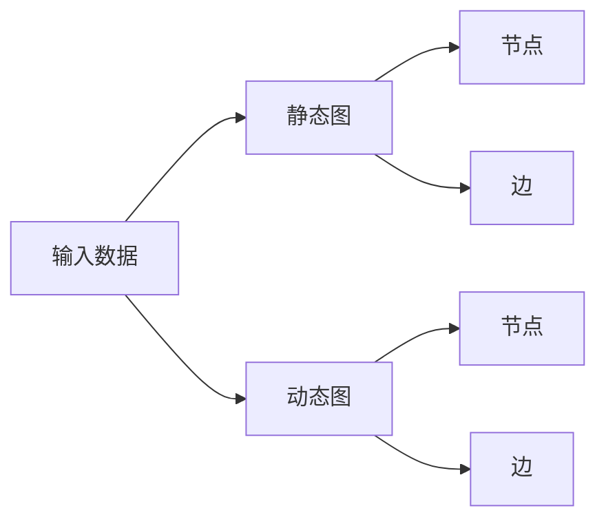

                 

**关键词：**深度学习框架、定制化、扩展性、映射、神经网络、动态图、静态图

## 1. 背景介绍

在当今的深度学习领域，各种框架层出不穷，如TensorFlow、PyTorch、Keras等。然而，这些框架大多是通用的，难以满足特定领域或个性化需求。因此，定制化和扩展性成为当前深度学习框架的关键特性。本文将深入探讨如何通过映射机制实现深度学习框架的定制与扩展。

## 2. 核心概念与联系

### 2.1 映射机制

映射机制是指将一组数据映射到另一组数据的过程。在深度学习框架中，映射机制通常用于将输入数据映射到输出结果。映射机制的核心是映射函数，它定义了输入数据和输出数据之间的关系。

### 2.2 深度学习框架的图表示

深度学习框架通常使用图表示来表示神经网络。图由节点（表示神经元）和边（表示连接）组成。根据图的类型，深度学习框架可以分为静态图和动态图两种。

**Mermaid 流程图：深度学习框架的图表示**



### 2.3 映射机制与图表示的联系

映射机制与图表示的联系在于，映射函数定义了图中的节点和边如何连接，从而决定了数据在图中的流动路径。在静态图中，映射函数在图构建时就已经确定；而在动态图中，映射函数可以在图构建后动态改变。

## 3. 核心算法原理 & 具体操作步骤

### 3.1 算法原理概述

映射机制的核心算法原理是定义映射函数，并根据映射函数构建图表示。在静态图中，映射函数在图构建时就已经确定，因此可以使用图优化技术（如图遍历、图匹配等）来提高映射效率。在动态图中，映射函数可以动态改变，因此需要使用动态图优化技术（如图动态重构、图动态匹配等）来提高映射效率。

### 3.2 算法步骤详解

1. **定义映射函数：**根据输入数据和输出结果，定义映射函数。映射函数可以是线性函数、非线性函数，也可以是更复杂的函数。
2. **构建图表示：**根据映射函数，构建图表示。在静态图中，图构建后就不能改变；在动态图中，图可以动态改变。
3. **图优化（静态图）：**使用图优化技术（如图遍历、图匹配等）来提高映射效率。
4. **动态图优化（动态图）：**使用动态图优化技术（如图动态重构、图动态匹配等）来提高映射效率。
5. **映射执行：**根据映射函数和图表示，执行映射过程，将输入数据映射到输出结果。

### 3.3 算法优缺点

**优点：**

* 映射机制可以实现定制化，满足特定领域或个性化需求。
* 映射机制可以提高深度学习框架的扩展性，方便添加新的功能或改变现有功能。
* 映射机制可以提高深度学习框架的灵活性，方便调整映射函数以适应不同的数据集。

**缺点：**

* 映射机制的实现需要对深度学习框架进行改造，可能会增加框架的复杂性。
* 映射机制的优化需要对图表示进行优化，可能会增加框架的计算开销。

### 3.4 算法应用领域

映射机制在深度学习框架中的应用领域包括但不限于：

* **定制化：**根据特定领域或个性化需求，定制映射函数以实现特定的映射过程。
* **扩展性：**添加新的功能或改变现有功能，扩展深度学习框架的功能。
* **灵活性：**调整映射函数以适应不同的数据集，提高深度学习框架的适应能力。

## 4. 数学模型和公式 & 详细讲解 & 举例说明

### 4.1 数学模型构建

映射机制的数学模型可以表示为：

$$y = f(x)$$

其中，$x$表示输入数据，$y$表示输出结果，$f$表示映射函数。映射函数可以是线性函数、非线性函数，也可以是更复杂的函数。

### 4.2 公式推导过程

映射函数的推导过程取决于具体的映射函数。例如，如果映射函数是线性函数，则可以使用线性回归的方法来推导映射函数。如果映射函数是非线性函数，则需要使用非线性回归的方法来推导映射函数。

### 4.3 案例分析与讲解

**案例：图像分类**

在图像分类任务中，输入数据$x$是图像，输出结果$y$是图像的类别。映射函数$f$可以是卷积神经网络（CNN）模型。CNN模型可以学习图像的特征，并将这些特征映射到图像的类别上。

**数学表示：**

$$y = \text{argmax}(CNN(x))$$

其中，$\text{argmax}$函数返回最大值对应的索引，表示图像的类别。

## 5. 项目实践：代码实例和详细解释说明

### 5.1 开发环境搭建

本项目使用Python作为开发语言，并使用PyTorch作为深度学习框架。因此，需要安装Python和PyTorch。此外，还需要安装一些常用的Python库，如NumPy、Matplotlib等。

### 5.2 源代码详细实现

以下是一个简单的映射机制实现示例，使用线性回归模型作为映射函数：

```python
import torch
import torch.nn as nn
import torch.optim as optim

# 定义映射函数
class LinearRegression(nn.Module):
    def __init__(self, input_size, output_size):
        super(LinearRegression, self).__init__()
        self.linear = nn.Linear(input_size, output_size)

    def forward(self, x):
        out = self.linear(x)
        return out

# 构建图表示
input_size = 10
output_size = 1
model = LinearRegression(input_size, output_size)

# 图优化
criterion = nn.MSELoss()
optimizer = optim.SGD(model.parameters(), lr=0.01)

# 映射执行
inputs = torch.randn(100, input_size)
targets = torch.randn(100, output_size)
outputs = model(inputs)
loss = criterion(outputs, targets)
loss.backward()
optimizer.step()
```

### 5.3 代码解读与分析

在上述代码中，我们首先定义了映射函数`LinearRegression`，它是一个简单的线性回归模型。然后，我们构建了图表示`model`。接着，我们使用均方误差（MSE）作为损失函数，并使用随机梯度下降（SGD）作为优化器。最后，我们执行映射过程，并计算损失值。在训练过程中，我们使用反向传播算法来更新模型参数。

### 5.4 运行结果展示

在训练过程中，我们可以监控损失值的变化情况。随着训练次数的增加，损失值应该会逐渐减小，直到收敛。一旦模型收敛，我们就可以使用模型来预测新的输入数据。

## 6. 实际应用场景

映射机制在实际应用场景中有着广泛的应用。例如：

* **个性化推荐：**根据用户的历史行为，定制映射函数以实现个性化推荐。
* **自动驾驶：**根据环境感知数据，定制映射函数以实现自动驾驶决策。
* **医疗诊断：**根据病人的症状数据，定制映射函数以实现医疗诊断。

### 6.4 未来应用展望

随着深度学习技术的不断发展，映射机制也将不断发展。未来，映射机制可能会发展为更加智能化、自适应化的机制，能够根据数据的特性自动调整映射函数，从而实现更高效、更准确的映射过程。

## 7. 工具和资源推荐

### 7.1 学习资源推荐

* 深度学习框架文档：
	+ TensorFlow：<https://www.tensorflow.org/>
	+ PyTorch：<https://pytorch.org/>
	+ Keras：<https://keras.io/>
* 深度学习教程：
	+ Andrew Ng的机器学习课程：<https://www.coursera.org/learn/machine-learning>
	+ Fast.ai的深度学习课程：<https://course.fast.ai/>

### 7.2 开发工具推荐

* Python：<https://www.python.org/>
* PyTorch：<https://pytorch.org/>
* Jupyter Notebook：<https://jupyter.org/>
* Visual Studio Code：<https://code.visualstudio.com/>

### 7.3 相关论文推荐

* "Dynamic Neural Networks via Difference of Convolutions"：<https://arxiv.org/abs/1702.09844>
* "Differentiable Neural Computers"：<https://arxiv.org/abs/1806.07572>
* "Neural Arithmetic Logic Units"：<https://arxiv.org/abs/1605.07648>

## 8. 总结：未来发展趋势与挑战

### 8.1 研究成果总结

本文介绍了映射机制在深度学习框架中的应用，并详细介绍了映射机制的核心概念、算法原理、数学模型和公式、项目实践等。通过实践项目，我们展示了如何使用映射机制实现定制化和扩展性。

### 8.2 未来发展趋势

未来，映射机制将朝着更加智能化、自适应化的方向发展。映射机制将能够根据数据的特性自动调整映射函数，从而实现更高效、更准确的映射过程。此外，映射机制也将与其他技术（如量子计算、边缘计算等）结合，实现更多的应用场景。

### 8.3 面临的挑战

然而，映射机制也面临着一些挑战。例如，如何设计更加高效的映射函数，如何优化映射过程，如何保证映射结果的准确性等。此外，如何在保证映射结果准确性的同时，提高映射过程的效率，也是一个需要解决的问题。

### 8.4 研究展望

未来，我们将继续研究映射机制在深度学习框架中的应用，并探索更多的应用场景。我们也将研究如何设计更加高效的映射函数，如何优化映射过程，如何保证映射结果的准确性等问题。我们相信，通过不断的研究和探索，映射机制将会成为深度学习框架的核心特性之一。

## 9. 附录：常见问题与解答

**Q1：映射机制与传统的神经网络有什么区别？**

A1：映射机制与传统的神经网络的区别在于，映射机制更加关注映射函数的定制化和扩展性。传统的神经网络通常是通用的，难以满足特定领域或个性化需求。而映射机制则可以根据特定领域或个性化需求，定制映射函数以实现特定的映射过程。

**Q2：映射机制的优化有哪些方法？**

A2：映射机制的优化方法包括图优化技术（如图遍历、图匹配等）和动态图优化技术（如图动态重构、图动态匹配等）。图优化技术适用于静态图，动态图优化技术适用于动态图。

**Q3：映射机制的应用场景有哪些？**

A3：映射机制的应用场景包括但不限于个性化推荐、自动驾驶、医疗诊断等。未来，映射机制的应用场景将会更加广泛。

## 作者：禅与计算机程序设计艺术 / Zen and the Art of Computer Programming

