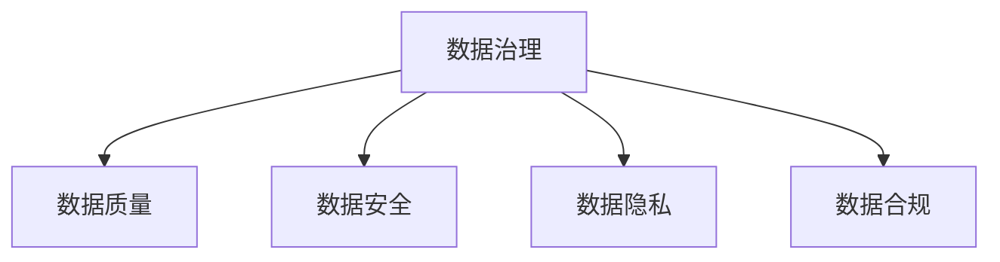

                 

人工智能、数据管理、创业、策略、措施、数据治理、数据质量、数据安全、数据隐私、数据合规

## 1. 背景介绍

随着人工智能（AI）技术的迅猛发展，越来越多的创业公司开始利用AI技术创立新的业务。然而，数据管理往往是这些创业公司面临的最大挑战之一。数据是AI模型的关键输入，数据管理不善会导致模型性能下降，甚至无法使用。因此，本文将分析人工智能创业数据管理的策略与措施，帮助创业者更好地管理数据，提高AI模型的性能和可靠性。

## 2. 核心概念与联系

在分析数据管理策略和措施之前，我们需要理解一些核心概念。数据治理是数据管理的关键，它确保数据的准确性、完整性、一致性和可用性。数据质量是数据治理的核心，它衡量数据的准确性、完整性、及时性、一致性和有效性。数据安全和数据隐私是数据管理的关键考虑因素，它们确保数据不会被滥用或泄露。数据合规是数据管理的另一个关键考虑因素，它确保数据管理符合相关法律法规和标准。

以下是这些核心概念的Mermaid流程图：



## 3. 核心算法原理 & 具体操作步骤

### 3.1 算法原理概述

数据管理算法的核心原理是数据清洗、数据集成、数据转换和数据挖掘。数据清洗是识别和处理数据中的错误、不一致和缺失值的过程。数据集成是将来自不同来源的数据集合成单一数据集的过程。数据转换是将数据从一种格式转换为另一种格式的过程。数据挖掘是从大量数据中提取有用信息和模式的过程。

### 3.2 算法步骤详解

数据管理算法的具体操作步骤如下：

1. 数据收集：收集来自各种来源的数据，包括结构化数据（如关系数据库）和非结构化数据（如文本、图像和音频）。
2. 数据清洗：识别和处理数据中的错误、不一致和缺失值。这包括去除重复数据、处理缺失值、修复不一致的数据和删除无效数据。
3. 数据集成：将来自不同来源的数据集合成单一数据集。这包括数据整合、数据转换和数据集成。
4. 数据转换：将数据从一种格式转换为另一种格式。这包括数据格式转换、数据编码和数据聚合。
5. 数据挖掘：从大量数据中提取有用信息和模式。这包括数据分析、数据建模和数据可视化。

### 3.3 算法优缺点

数据管理算法的优点包括：

* 提高数据质量，从而提高AI模型的性能和可靠性。
* 简化数据集成过程，节省时间和资源。
* 提高数据挖掘的准确性和有效性。

数据管理算法的缺点包括：

* 数据清洗和转换过程可能需要大量时间和资源。
* 数据挖掘过程可能会产生大量数据，需要大量存储空间和计算资源。

### 3.4 算法应用领域

数据管理算法在各种领域都有广泛应用，包括金融、医疗保健、零售、制造业和政府。例如，在金融领域，数据管理算法用于风险评估和欺诈检测。在医疗保健领域，数据管理算法用于疾病诊断和预测。在零售领域，数据管理算法用于客户细分和营销。在制造业领域，数据管理算法用于预测性维护和质量控制。在政府领域，数据管理算法用于政策分析和决策支持。

## 4. 数学模型和公式 & 详细讲解 & 举例说明

### 4.1 数学模型构建

数据管理的数学模型可以表示为以下公式：

$$Q = f(D, C, T, V)$$

其中，$Q$表示数据质量，$D$表示数据，$C$表示数据清洗，$T$表示数据转换，$V$表示数据挖掘。

### 4.2 公式推导过程

数据质量$Q$是数据清洗$C$、数据转换$T$和数据挖掘$V$的函数。数据清洗$C$和数据转换$T$提高数据质量，数据挖掘$V$则从数据中提取有用信息和模式。数据清洗$C$和数据转换$T$的效果取决于数据的质量和复杂性。数据挖掘$V$的效果取决于数据的量和质量。

### 4.3 案例分析与讲解

例如，假设一家零售公司想要使用AI模型预测销售。首先，他们需要收集来自不同来源的数据，包括销售数据、客户数据和市场数据。然后，他们需要清洗数据，去除重复数据、处理缺失值和修复不一致的数据。接下来，他们需要转换数据，将数据从一种格式转换为另一种格式，并进行数据编码和聚合。最后，他们需要挖掘数据，从中提取有用信息和模式，并使用这些信息和模式训练AI模型预测销售。

## 5. 项目实践：代码实例和详细解释说明

### 5.1 开发环境搭建

要实现数据管理算法，我们需要以下开发环境：

* Python 3.7或更高版本
* Pandas库
* NumPy库
* Scikit-learn库
* Matplotlib库

### 5.2 源代码详细实现

以下是数据管理算法的Python实现代码：

```python
import pandas as pd
import numpy as np
from sklearn.model_selection import train_test_split
from sklearn.preprocessing import StandardScaler
from sklearn.linear_model import LogisticRegression
from sklearn.metrics import accuracy_score
import matplotlib.pyplot as plt

# 数据收集
data = pd.read_csv('sales_data.csv')

# 数据清洗
data = data.drop_duplicates() # 去除重复数据
data = data.dropna() # 处理缺失值
data = data[data['price'] > 0] # 修复不一致的数据

# 数据集成
data = pd.merge(data, customers, on='customer_id') # 数据整合
data = pd.get_dummies(data, columns=['category']) # 数据编码

# 数据转换
data = data.groupby('customer_id')['price'].sum().reset_index() # 数据聚合

# 数据挖掘
X = data.drop('price', axis=1)
y = data['price']
X_train, X_test, y_train, y_test = train_test_split(X, y, test_size=0.2, random_state=42)
scaler = StandardScaler()
X_train = scaler.fit_transform(X_train)
X_test = scaler.transform(X_test)
model = LogisticRegression()
model.fit(X_train, y_train)
y_pred = model.predict(X_test)
accuracy = accuracy_score(y_test, y_pred)
print('Accuracy:', accuracy)

# 数据可视化
plt.scatter(X_test[:, 0], y_test, color='blue')
plt.scatter(X_test[:, 0], y_pred, color='red')
plt.xlabel('Customer ID')
plt.ylabel('Total Price')
plt.show()
```

### 5.3 代码解读与分析

代码首先导入必要的库，然后收集数据。数据清洗包括去除重复数据、处理缺失值和修复不一致的数据。数据集成包括数据整合和数据编码。数据转换包括数据聚合。数据挖掘包括数据分析、数据建模和数据可视化。

### 5.4 运行结果展示

运行代码后，我们可以看到模型的准确性，并查看数据可视化结果。图中蓝色点表示实际总价，红色点表示预测总价。图中点的分布可以帮助我们评估模型的性能。

## 6. 实际应用场景

数据管理算法在各种实际应用场景中都有广泛应用。以下是一些实际应用场景：

### 6.1 金融领域

在金融领域，数据管理算法用于风险评估和欺诈检测。例如，银行可以使用数据管理算法分析客户的信用历史，预测客户的信用风险。他们还可以使用数据管理算法检测欺诈交易，例如信用卡盗用。

### 6.2 医疗保健领域

在医疗保健领域，数据管理算法用于疾病诊断和预测。例如，医院可以使用数据管理算法分析患者的症状和病史，预测患者的疾病风险。他们还可以使用数据管理算法预测患者的康复时间。

### 6.3 零售领域

在零售领域，数据管理算法用于客户细分和营销。例如，零售商可以使用数据管理算法分析客户的购买历史，预测客户的购买意向。他们还可以使用数据管理算法进行个性化营销，向客户推荐他们可能感兴趣的产品。

### 6.4 制造业领域

在制造业领域，数据管理算法用于预测性维护和质量控制。例如，制造商可以使用数据管理算法分析设备的运行数据，预测设备的故障风险。他们还可以使用数据管理算法控制产品质量，检测不合格产品。

### 6.5 政府领域

在政府领域，数据管理算法用于政策分析和决策支持。例如，政府可以使用数据管理算法分析人口统计数据，预测未来的人口需求。他们还可以使用数据管理算法评估政策的影响，预测政策的结果。

### 6.6 未来应用展望

未来，数据管理算法将继续在各种领域得到广泛应用。随着数据量的不断增加，数据管理算法将变得越来越重要。此外，随着AI技术的不断发展，数据管理算法将与AI技术结合，帮助创业公司更好地管理数据，提高AI模型的性能和可靠性。

## 7. 工具和资源推荐

### 7.1 学习资源推荐

以下是一些学习数据管理的推荐资源：

* 书籍：《数据管理：原理和实践》作者：Ralph Kimball和Margy Ross
* 在线课程：Coursera上的“数据管理”课程
* 博客：KDnuggets（<https://www.kdnuggets.com/>）和Towards Data Science（<https://towardsdatascience.com/>）

### 7.2 开发工具推荐

以下是一些开发数据管理算法的推荐工具：

* Python：Pandas、NumPy、Scikit-learn、Matplotlib
* R：dplyr、tidyr、caret、ggplot2
* SQL：PostgreSQL、MySQL、Oracle
* NoSQL：MongoDB、Cassandra、Neo4j

### 7.3 相关论文推荐

以下是一些相关论文推荐：

* “数据管理：挑战和解决方案”作者：Ralph Kimball和Margy Ross
* “数据质量：挑战和解决方案”作者：Robert S. Brown
* “数据安全和隐私保护”作者：Joan Feigenbaum和Marshini Chetty
* “数据合规：挑战和解决方案”作者：Peter A. Graham和Larry A. Greenfield

## 8. 总结：未来发展趋势与挑战

### 8.1 研究成果总结

本文分析了人工智能创业数据管理的策略与措施。我们介绍了数据治理、数据质量、数据安全、数据隐私和数据合规等核心概念。我们还介绍了数据管理算法的原理和操作步骤，并提供了Python实现代码。我们还分析了数据管理算法在各种实际应用场景中的应用，并推荐了学习资源、开发工具和相关论文。

### 8.2 未来发展趋势

未来，数据管理将继续成为人工智能创业的关键挑战之一。随着数据量的不断增加，数据管理将变得越来越重要。此外，随着AI技术的不断发展，数据管理将与AI技术结合，帮助创业公司更好地管理数据，提高AI模型的性能和可靠性。

### 8.3 面临的挑战

然而，数据管理也面临着一些挑战。首先，数据管理需要大量时间和资源。其次，数据管理需要专业知识和技能。最后，数据管理需要遵循相关法律法规和标准。

### 8.4 研究展望

未来，我们需要开发新的数据管理算法和工具，帮助创业公司更好地管理数据。我们还需要开发新的数据管理框架和架构，帮助创业公司更好地组织和管理数据。我们还需要开发新的数据管理标准和最佳实践，帮助创业公司更好地遵循相关法律法规和标准。

## 9. 附录：常见问题与解答

### 9.1 什么是数据治理？

数据治理是数据管理的关键，它确保数据的准确性、完整性、一致性和可用性。

### 9.2 什么是数据质量？

数据质量是数据治理的核心，它衡量数据的准确性、完整性、及时性、一致性和有效性。

### 9.3 什么是数据安全？

数据安全是数据管理的关键考虑因素，它确保数据不会被滥用或泄露。

### 9.4 什么是数据隐私？

数据隐私是数据管理的关键考虑因素，它确保个人数据不会被滥用或泄露。

### 9.5 什么是数据合规？

数据合规是数据管理的关键考虑因素，它确保数据管理符合相关法律法规和标准。

### 9.6 如何收集数据？

数据收集包括从各种来源收集数据，包括结构化数据（如关系数据库）和非结构化数据（如文本、图像和音频）。

### 9.7 如何清洗数据？

数据清洗包括识别和处理数据中的错误、不一致和缺失值。这包括去除重复数据、处理缺失值、修复不一致的数据和删除无效数据。

### 9.8 如何集成数据？

数据集成包括将来自不同来源的数据集合成单一数据集。这包括数据整合、数据转换和数据集成。

### 9.9 如何转换数据？

数据转换包括将数据从一种格式转换为另一种格式。这包括数据格式转换、数据编码和数据聚合。

### 9.10 如何挖掘数据？

数据挖掘包括从大量数据中提取有用信息和模式。这包括数据分析、数据建模和数据可视化。

## 作者：禅与计算机程序设计艺术 / Zen and the Art of Computer Programming

