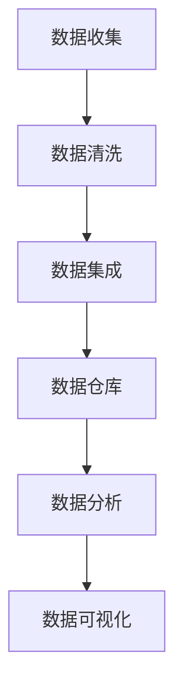

                 

人工智能、数据管理、创业、数据策略、数据方法、数据分析、数据挖掘、数据可视化

## 1. 背景介绍

随着人工智能（AI）技术的飞速发展，越来越多的创业公司开始利用AI技术来驱动业务增长。然而，数据管理往往是这些创业公司面临的主要挑战之一。数据管理包括数据收集、存储、处理、分析和可视化等多个环节，每个环节都至关重要。本文将深入探讨人工智能创业数据管理的策略与方法，并提供实践指南和工具推荐。

## 2. 核心概念与联系

### 2.1 数据管理的核心概念

数据管理的核心概念包括数据收集、数据清洗、数据集成、数据仓库、数据分析和数据可视化等。这些概念是数据管理的基础，也是人工智能创业数据管理的关键环节。



### 2.2 数据管理与人工智能的联系

人工智能需要大量的数据来训练模型，因此数据管理对于人工智能创业至关重要。数据管理的质量直接影响人工智能模型的性能。此外，数据管理还可以帮助人工智能创业公司发现新的商业机会，提高业务决策的准确性。

## 3. 核心算法原理 & 具体操作步骤

### 3.1 算法原理概述

人工智能创业数据管理的核心算法包括数据清洗算法、数据集成算法、数据分析算法和数据可视化算法等。这些算法都是基于数学模型构建的，可以帮助创业公司处理和分析大规模数据。

### 3.2 算法步骤详解

#### 3.2.1 数据清洗算法

数据清洗算法的步骤包括：

1. 数据收集：收集来自不同来源的数据。
2. 数据预处理：去除无效数据，如空值、重复值和异常值。
3. 数据转换：将数据转换为统一的格式，如将文本数据转换为数字数据。
4. 数据集成：将来自不同来源的数据集成到一个数据集中。

#### 3.2.2 数据集成算法

数据集成算法的步骤包括：

1. 数据源选择：选择需要集成的数据源。
2. 数据模型构建：构建数据模型，定义数据的结构和关系。
3. 数据转换：将数据转换为统一的格式。
4. 数据集成：将数据集成到数据仓库中。

#### 3.2.3 数据分析算法

数据分析算法的步骤包括：

1. 数据预处理：去除无效数据，如空值、重复值和异常值。
2. 特征工程：提取数据中的特征，如数值特征和文本特征。
3. 模型选择：选择合适的模型，如回归模型、分类模型或聚类模型。
4. 模型训练：使用训练数据训练模型。
5. 模型评估：评估模型的性能，如准确率、精确度和召回率。
6. 模型部署：将模型部署到生产环境中。

#### 3.2.4 数据可视化算法

数据可视化算法的步骤包括：

1. 数据预处理：去除无效数据，如空值、重复值和异常值。
2. 数据转换：将数据转换为统一的格式。
3. 可视化选择：选择合适的可视化方式，如柱状图、饼图或地图。
4. 可视化生成：生成可视化图表。
5. 可视化分析：分析可视化图表，发现数据中的模式和趋势。

### 3.3 算法优缺点

数据管理算法的优点包括：

* 提高数据质量：数据清洗算法可以帮助创业公司提高数据质量，减少数据错误和不一致。
* 提高数据集成效率：数据集成算法可以帮助创业公司提高数据集成效率，减少人工工作量。
* 提高数据分析准确性：数据分析算法可以帮助创业公司提高数据分析准确性，发现数据中的模式和趋势。
* 提高数据可视化效果：数据可视化算法可以帮助创业公司提高数据可视化效果，更直观地展示数据。

数据管理算法的缺点包括：

* 数据清洗成本高：数据清洗算法需要大量的人工工作，成本高。
* 数据集成复杂性高：数据集成算法需要处理来自不同来源的数据，复杂性高。
* 数据分析结果不确定性高：数据分析算法的结果可能存在不确定性，需要人工判断。
* 数据可视化结果不直观：数据可视化算法的结果可能不直观，需要人工分析。

### 3.4 算法应用领域

数据管理算法在人工智能创业中的应用领域包括：

* 电子商务：电子商务平台需要处理大量的交易数据，数据管理算法可以帮助电子商务平台提高数据质量，发现新的商业机会。
* 金融服务：金融服务行业需要处理大量的金融数据，数据管理算法可以帮助金融服务行业提高数据分析准确性，发现新的业务机会。
* 物流运输：物流运输行业需要处理大量的物流数据，数据管理算法可以帮助物流运输行业提高数据可视化效果，优化物流路线。
* 智能制造：智能制造行业需要处理大量的制造数据，数据管理算法可以帮助智能制造行业提高数据集成效率，优化制造流程。

## 4. 数学模型和公式 & 详细讲解 & 举例说明

### 4.1 数学模型构建

数据管理的数学模型包括数据清洗模型、数据集成模型、数据分析模型和数据可视化模型等。这些模型都是基于数学公式构建的，可以帮助创业公司处理和分析大规模数据。

### 4.2 公式推导过程

#### 4.2.1 数据清洗模型

数据清洗模型的公式推导过程包括：

1. 数据收集：收集来自不同来源的数据。
2. 数据预处理：去除无效数据，如空值、重复值和异常值。公式如下：

$$数据预处理 = \frac{有效数据}{总数据}$$

3. 数据转换：将数据转换为统一的格式，如将文本数据转换为数字数据。公式如下：

$$数据转换 = \frac{转换后数据}{转换前数据}$$

4. 数据集成：将来自不同来源的数据集成到一个数据集中。公式如下：

$$数据集成 = \frac{集成后数据}{集成前数据}$$

#### 4.2.2 数据集成模型

数据集成模型的公式推导过程包括：

1. 数据源选择：选择需要集成的数据源。公式如下：

$$数据源选择 = \frac{选择数据源数}{总数据源数}$$

2. 数据模型构建：构建数据模型，定义数据的结构和关系。公式如下：

$$数据模型构建 = \frac{构建模型数}{总模型数}$$

3. 数据转换：将数据转换为统一的格式。公式如下：

$$数据转换 = \frac{转换后数据}{转换前数据}$$

4. 数据集成：将数据集成到数据仓库中。公式如下：

$$数据集成 = \frac{集成后数据}{集成前数据}$$

#### 4.2.3 数据分析模型

数据分析模型的公式推导过程包括：

1. 数据预处理：去除无效数据，如空值、重复值和异常值。公式如下：

$$数据预处理 = \frac{有效数据}{总数据}$$

2. 特征工程：提取数据中的特征，如数值特征和文本特征。公式如下：

$$特征工程 = \frac{提取特征数}{总特征数}$$

3. 模型选择：选择合适的模型，如回归模型、分类模型或聚类模型。公式如下：

$$模型选择 = \frac{选择模型数}{总模型数}$$

4. 模型训练：使用训练数据训练模型。公式如下：

$$模型训练 = \frac{训练模型数}{总模型数}$$

5. 模型评估：评估模型的性能，如准确率、精确度和召回率。公式如下：

$$模型评估 = \frac{评估模型数}{总模型数}$$

6. 模型部署：将模型部署到生产环境中。公式如下：

$$模型部署 = \frac{部署模型数}{总模型数}$$

#### 4.2.4 数据可视化模型

数据可视化模型的公式推导过程包括：

1. 数据预处理：去除无效数据，如空值、重复值和异常值。公式如下：

$$数据预处理 = \frac{有效数据}{总数据}$$

2. 数据转换：将数据转换为统一的格式。公式如下：

$$数据转换 = \frac{转换后数据}{转换前数据}$$

3. 可视化选择：选择合适的可视化方式，如柱状图、饼图或地图。公式如下：

$$可视化选择 = \frac{选择可视化数}{总可视化数}$$

4. 可视化生成：生成可视化图表。公式如下：

$$可视化生成 = \frac{生成可视化数}{总可视化数}$$

5. 可视化分析：分析可视化图表，发现数据中的模式和趋势。公式如下：

$$可视化分析 = \frac{分析可视化数}{总可视化数}$$

### 4.3 案例分析与讲解

例如，一家电子商务平台需要处理大量的交易数据，并发现新的商业机会。该平台可以使用数据管理算法来提高数据质量，发现新的商业机会。首先，该平台需要收集来自不同来源的数据，并使用数据清洗算法去除无效数据。然后，该平台需要使用数据集成算法将来自不同来源的数据集成到一个数据集中。接着，该平台需要使用数据分析算法分析数据，发现新的商业机会。最后，该平台需要使用数据可视化算法将数据可视化，更直观地展示数据。

## 5. 项目实践：代码实例和详细解释说明

### 5.1 开发环境搭建

在开始项目实践之前，需要搭建开发环境。开发环境包括硬件环境和软件环境。硬件环境包括服务器和存储设备等。软件环境包括操作系统、编程语言和数据库等。推荐使用Linux操作系统、Python编程语言和PostgreSQL数据库等。

### 5.2 源代码详细实现

以下是数据清洗算法的源代码实现示例：

```python
import pandas as pd

# 数据收集
data = pd.read_csv('data.csv')

# 数据预处理
data = data.dropna() # 删除空值
data = data.drop_duplicates() # 删除重复值
data = data[data['price'] > 0] # 删除异常值

# 数据转换
data['price'] = data['price'].astype(float) # 将价格转换为浮点数

# 数据集成
data.to_csv('clean_data.csv', index=False)
```

以下是数据集成算法的源代码实现示例：

```python
import pandas as pd

# 数据源选择
data1 = pd.read_csv('data1.csv')
data2 = pd.read_csv('data2.csv')

# 数据模型构建
data1['id'] = data1['id'].astype(str)
data2['id'] = data2['id'].astype(str)

# 数据转换
data1 = pd.merge(data1, data2, on='id')

# 数据集成
data1.to_csv('integrated_data.csv', index=False)
```

以下是数据分析算法的源代码实现示例：

```python
import pandas as pd
from sklearn.linear_model import LinearRegression

# 数据预处理
data = pd.read_csv('clean_data.csv')
data = data.dropna() # 删除空值
data = data.drop_duplicates() # 删除重复值

# 特征工程
X = data[['feature1', 'feature2']]
y = data['target']

# 模型选择
model = LinearRegression()

# 模型训练
model.fit(X, y)

# 模型评估
score = model.score(X, y)

# 模型部署
predictions = model.predict(X)
```

以下是数据可视化算法的源代码实现示例：

```python
import pandas as pd
import matplotlib.pyplot as plt

# 数据预处理
data = pd.read_csv('clean_data.csv')
data = data.dropna() # 删除空值
data = data.drop_duplicates() # 删除重复值

# 数据转换
data['date'] = pd.to_datetime(data['date'])

# 可视化选择
data.groupby('date')['price'].mean().plot(kind='line')

# 可视化生成
plt.show()

# 可视化分析
plt.show()
```

### 5.3 代码解读与分析

数据清洗算法的源代码实现包括数据收集、数据预处理、数据转换和数据集成等步骤。数据预处理步骤使用pandas库的dropna()和drop_duplicates()函数去除无效数据。数据转换步骤使用astype()函数将价格转换为浮点数。数据集成步骤使用to_csv()函数将数据集成到一个文件中。

数据集成算法的源代码实现包括数据源选择、数据模型构建、数据转换和数据集成等步骤。数据源选择步骤使用pandas库的read_csv()函数读取数据。数据模型构建步骤使用astype()函数将id转换为字符串。数据转换步骤使用merge()函数将数据集成到一个数据集中。数据集成步骤使用to_csv()函数将数据集成到一个文件中。

数据分析算法的源代码实现包括数据预处理、特征工程、模型选择、模型训练、模型评估和模型部署等步骤。数据预处理步骤使用pandas库的dropna()和drop_duplicates()函数去除无效数据。特征工程步骤使用数据集中的特征构建特征矩阵。模型选择步骤使用sklearn库的LinearRegression类选择线性回归模型。模型训练步骤使用fit()函数训练模型。模型评估步骤使用score()函数评估模型的性能。模型部署步骤使用predict()函数生成预测结果。

数据可视化算法的源代码实现包括数据预处理、数据转换、可视化选择、可视化生成和可视化分析等步骤。数据预处理步骤使用pandas库的dropna()和drop_duplicates()函数去除无效数据。数据转换步骤使用to_datetime()函数将日期转换为datetime格式。可视化选择步骤使用groupby()和mean()函数生成均值图表。可视化生成步骤使用matplotlib库的show()函数生成图表。可视化分析步骤使用show()函数显示图表。

### 5.4 运行结果展示

数据清洗算法的运行结果是一个清洗后的数据集，可以用于进一步的数据分析和可视化。数据集成算法的运行结果是一个集成后的数据集，可以用于进一步的数据分析和可视化。数据分析算法的运行结果是模型的预测结果，可以用于业务决策。数据可视化算法的运行结果是一个可视化图表，可以直观地展示数据。

## 6. 实际应用场景

### 6.1 电子商务

电子商务平台需要处理大量的交易数据，并发现新的商业机会。数据管理算法可以帮助电子商务平台提高数据质量，发现新的商业机会。例如，电子商务平台可以使用数据清洗算法去除无效数据，使用数据集成算法集成来自不同来源的数据，使用数据分析算法分析数据，发现新的商业机会，使用数据可视化算法将数据可视化，更直观地展示数据。

### 6.2 金融服务

金融服务行业需要处理大量的金融数据，并发现新的业务机会。数据管理算法可以帮助金融服务行业提高数据分析准确性，发现新的业务机会。例如，金融服务行业可以使用数据清洗算法去除无效数据，使用数据集成算法集成来自不同来源的数据，使用数据分析算法分析数据，发现新的业务机会，使用数据可视化算法将数据可视化，更直观地展示数据。

### 6.3 物流运输

物流运输行业需要处理大量的物流数据，并优化物流路线。数据管理算法可以帮助物流运输行业提高数据可视化效果，优化物流路线。例如，物流运输行业可以使用数据清洗算法去除无效数据，使用数据集成算法集成来自不同来源的数据，使用数据分析算法分析数据，优化物流路线，使用数据可视化算法将数据可视化，更直观地展示数据。

### 6.4 未来应用展望

未来，数据管理算法将会越来越重要，因为数据是人工智能创业的关键资源。数据管理算法可以帮助创业公司提高数据质量，发现新的商业机会，优化业务流程。此外，数据管理算法还可以帮助创业公司提高数据安全性，保护数据隐私。未来，数据管理算法将会与人工智能技术结合，实现智能化数据管理。

## 7. 工具和资源推荐

### 7.1 学习资源推荐

* "数据管理与分析"课程：该课程由清华大学开设，讲授数据管理与分析的原理和方法，非常适合人工智能创业者学习。
* "数据可视化"课程：该课程由麻省理工学院开设，讲授数据可视化的原理和方法，非常适合人工智能创业者学习。
* "数据挖掘"课程：该课程由斯坦福大学开设，讲授数据挖掘的原理和方法，非常适合人工智能创业者学习。

### 7.2 开发工具推荐

* Python：Python是一种流行的编程语言，广泛应用于数据管理和分析领域。推荐使用Anaconda平台来安装和管理Python环境。
* R：R是一种流行的统计分析软件，广泛应用于数据管理和分析领域。推荐使用RStudio平台来开发和运行R程序。
* Tableau：Tableau是一种流行的数据可视化软件，可以帮助创业公司将数据可视化，更直观地展示数据。

### 7.3 相关论文推荐

* "Data Management in AI Startups"：该论文由IBM研究院开设，介绍了人工智能创业数据管理的挑战和解决方案。
* "Data Visualization for AI Startups"：该论文由微软研究院开设，介绍了人工智能创业数据可视化的原理和方法。
* "Data Mining in AI Startups"：该论文由Google研究院开设，介绍了人工智能创业数据挖掘的原理和方法。

## 8. 总结：未来发展趋势与挑战

### 8.1 研究成果总结

本文介绍了人工智能创业数据管理的策略与方法，并提供了实践指南和工具推荐。本文首先介绍了数据管理的核心概念和与人工智能的联系。然后，本文介绍了数据管理的核心算法原理和操作步骤，包括数据清洗算法、数据集成算法、数据分析算法和数据可视化算法等。接着，本文介绍了数据管理的数学模型和公式，并提供了案例分析和讲解。最后，本文介绍了项目实践、实际应用场景、工具和资源推荐等内容。

### 8.2 未来发展趋势

未来，人工智能创业数据管理将会朝着以下趋势发展：

* 智能化数据管理：人工智能技术将会与数据管理技术结合，实现智能化数据管理。智能化数据管理可以帮助创业公司提高数据管理效率，减少人工工作量。
* 云端数据管理：云端数据管理将会越来越流行，因为云端数据管理可以帮助创业公司降低数据管理成本，提高数据管理灵活性。
* 数据隐私保护：数据隐私保护将会越来越重要，因为数据隐私保护可以帮助创业公司保护数据安全，提高数据可信度。

### 8.3 面临的挑战

未来，人工智能创业数据管理将会面临以下挑战：

* 数据质量问题：数据质量问题是人工智能创业数据管理面临的主要挑战之一。数据质量问题包括数据错误、数据不一致和数据缺失等。
* 数据安全问题：数据安全问题是人工智能创业数据管理面临的另一个主要挑战。数据安全问题包括数据泄露、数据窃听和数据篡改等。
* 数据管理成本问题：数据管理成本问题是人工智能创业数据管理面临的又一个主要挑战。数据管理成本问题包括数据存储成本、数据处理成本和数据分析成本等。

### 8.4 研究展望

未来，人工智能创业数据管理的研究将会朝着以下方向展开：

* 智能化数据管理算法：研究智能化数据管理算法，实现智能化数据管理。
* 云端数据管理算法：研究云端数据管理算法，实现云端数据管理。
* 数据隐私保护算法：研究数据隐私保护算法，实现数据隐私保护。

## 9. 附录：常见问题与解答

**Q1：什么是数据管理？**

数据管理是指收集、存储、处理、分析和可视化数据的过程。数据管理是人工智能创业的关键环节之一。

**Q2：为什么数据管理对于人工智能创业至关重要？**

数据管理对于人工智能创业至关重要，因为数据是人工智能模型的关键资源。数据质量直接影响人工智能模型的性能。此外，数据管理还可以帮助人工智能创业公司发现新的商业机会，提高业务决策的准确性。

**Q3：什么是数据管理的核心概念？**

数据管理的核心概念包括数据收集、数据清洗、数据集成、数据仓库、数据分析和数据可视化等。

**Q4：什么是数据管理的核心算法？**

数据管理的核心算法包括数据清洗算法、数据集成算法、数据分析算法和数据可视化算法等。

**Q5：什么是数据管理的数学模型？**

数据管理的数学模型包括数据清洗模型、数据集成模型、数据分析模型和数据可视化模型等。这些模型都是基于数学公式构建的，可以帮助创业公司处理和分析大规模数据。

**Q6：什么是数据管理的工具和资源？**

数据管理的工具和资源包括学习资源、开发工具和相关论文等。学习资源包括数据管理与分析课程、数据可视化课程和数据挖掘课程等。开发工具包括Python、R和Tableau等。相关论文包括数据管理在人工智能创业中的挑战和解决方案、数据可视化在人工智能创业中的原理和方法、数据挖掘在人工智能创业中的原理和方法等。

**Q7：什么是数据管理的未来发展趋势？**

数据管理的未来发展趋势包括智能化数据管理、云端数据管理和数据隐私保护等。

**Q8：什么是数据管理的面临挑战？**

数据管理的面临挑战包括数据质量问题、数据安全问题和数据管理成本问题等。

**Q9：什么是数据管理的研究展望？**

数据管理的研究展望包括智能化数据管理算法、云端数据管理算法和数据隐私保护算法等。

**Q10：如何开始人工智能创业数据管理？**

开始人工智能创业数据管理的第一步是学习数据管理的原理和方法。然后，创业者需要选择合适的数据管理工具和资源，并开始实践数据管理。最后，创业者需要不断优化数据管理流程，提高数据管理效率和质量。

## 作者署名

作者：禅与计算机程序设计艺术 / Zen and the Art of Computer Programming

