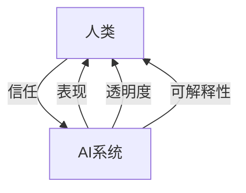

                 

**人类-AI协作：增强人类与机器之间的信任**

## 1. 背景介绍

当前，人工智能（AI）技术正在各行各业迅速发展，从自动驾驶汽车到医疗诊断，从客户服务到军事应用，AI的影响力日益增强。然而，AI的广泛应用也引发了人们对其可靠性、安全性和透明度的担忧。人类与AI之间的信任是实现成功协作的关键，本文将探讨如何增强人类与机器之间的信任，以实现更有效的协作。

## 2. 核心概念与联系

### 2.1 信任的定义

信任是一种心理状态，它反映了个体对另一个体的能力、意图和可靠性的信念。在人类与AI的互动中，信任涉及人类对AI系统能力、意图和可靠性的信念。

### 2.2 信任的维度

信任可以分为两个维度：能力信任和意图信任。能力信任是指个体对另一个体完成任务或解决问题的能力的信念。意图信任是指个体对另一个体的意图和动机的信念。在人类与AI的互动中，这两个维度都至关重要。

### 2.3 信任的建立

信任的建立需要时间，它基于个体的经验、他人的推荐和系统的表现。在人类与AI的互动中，信任的建立需要AI系统表现出色，并提供透明度和可解释性。



## 3. 核心算法原理 & 具体操作步骤

### 3.1 算法原理概述

增强人类与AI之间的信任需要使用一系列算法和技术，包括可解释性算法、信任度量算法和人机协作算法。这些算法旨在提高AI系统的透明度，量化人类对AI系统的信任，并优化人机协作。

### 3.2 算法步骤详解

#### 3.2.1 可解释性算法

可解释性算法旨在帮助人类理解AI系统的决策过程。常用的可解释性算法包括：

- **LIME（Local Interpretable Model-Agnostic Explanations）**：LIME是一种模型无关的局部解释算法，它使用简单的模型（如决策树）解释AI系统的决策。
- **SHAP（SHapley Additive exPlanations）**：SHAP是一种基于 Shapley 值的解释算法，它量化了每个特征对模型预测的贡献。

#### 3.2.2 信任度量算法

信任度量算法旨在量化人类对AI系统的信任。常用的信任度量算法包括：

- **Belief-Desire-Intention（BDI）模型**：BDI模型是一种用于表示智能代理信念、欲望和意图的框架。它可以用于量化人类对AI系统意图的信任。
- **信任度量指标**：信任度量指标是一种基于人类反馈的信任度量方法。它收集人类对AI系统表现的反馈，并使用这些反馈量化人类对AI系统的信任。

#### 3.2.3 人机协作算法

人机协作算法旨在优化人类与AI系统的互动。常用的人机协作算法包括：

- **人机共同注意力模型（Human-Machine Joint Attention Model）**：人机共同注意力模型是一种用于指导人机互动的模型。它帮助AI系统理解人类的注意力，并指导人类注意力的转移。
- **人机共同控制模型（Human-Machine Shared Control Model）**：人机共同控制模型是一种用于优化人机控制的模型。它平衡人类和AI系统的控制权，以实现最优控制。

### 3.3 算法优缺点

可解释性算法、信任度量算法和人机协作算法各有优缺点。可解释性算法可以帮助人类理解AI系统的决策过程，但它们可能会导致模型精确度的下降。信任度量算法可以量化人类对AI系统的信任，但它们可能会受到人类主观性的影响。人机协作算法可以优化人机互动，但它们可能会导致系统的复杂性增加。

### 3.4 算法应用领域

可解释性算法、信任度量算法和人机协作算法可以应用于各种领域，包括医疗、金融、交通和国防等。在医疗领域，这些算法可以帮助医生理解AI系统的诊断结果，并增强医生对AI系统的信任。在金融领域，这些算法可以帮助银行理解AI系统的风险评估结果，并增强银行对AI系统的信任。在交通领域，这些算法可以帮助驾驶员理解自动驾驶汽车的决策过程，并增强驾驶员对自动驾驶汽车的信任。在国防领域，这些算法可以帮助士兵理解无人机的决策过程，并增强士兵对无人机的信任。

## 4. 数学模型和公式 & 详细讲解 & 举例说明

### 4.1 数学模型构建

信任度量算法的数学模型可以表示为：

$$T = f(I, P)$$

其中，$T$表示人类对AI系统的信任，$I$表示人类对AI系统意图的信念，$P$表示AI系统的表现，$f$表示信任度量函数。

### 4.2 公式推导过程

信任度量函数$f$可以使用各种方法推导，包括统计方法、机器学习方法和博弈论方法。例如，可以使用回归分析推导信任度量函数，也可以使用支持向量机（SVM）或神经网络推导信任度量函数。此外，还可以使用博弈论方法推导信任度量函数，将人类与AI系统的互动视为一个博弈，并使用纳什均衡推导信任度量函数。

### 4.3 案例分析与讲解

例如，在自动驾驶汽车领域，人类对自动驾驶汽车的信任可以表示为：

$$T = \alpha \cdot I + (1 - \alpha) \cdot P$$

其中，$\alpha$是权重参数，它表示人类对自动驾驶汽车意图的信念和表现的重要性。当$\alpha = 0.5$时，人类对自动驾驶汽车意图的信念和表现的重要性相同。当$\alpha > 0.5$时，人类更重视自动驾驶汽车的意图。当$\alpha < 0.5$时，人类更重视自动驾驶汽车的表现。

## 5. 项目实践：代码实例和详细解释说明

### 5.1 开发环境搭建

要实现信任度量算法，需要搭建开发环境。开发环境包括Python、NumPy、Pandas、Scikit-learn和Matplotlib等库。此外，还需要收集人类对AI系统表现的反馈数据。

### 5.2 源代码详细实现

以下是信任度量算法的Python实现代码：

```python
import numpy as np
import pandas as pd
from sklearn.linear_model import LinearRegression

# 定义信任度量函数
def trust_measurement(I, P):
    # 定义信任度量模型
    model = LinearRegression()
    # 拟合信任度量模型
    model.fit(X, y)
    # 预测信任度量
    T = model.predict([[I, P]])
    return T

# 加载人类对AI系统表现的反馈数据
data = pd.read_csv('feedback_data.csv')
# 提取人类对AI系统意图的信念和AI系统的表现
I = data['belief_in_intention']
P = data['system_performance']
# 定义信任度量模型的输入和输出
X = np.column_stack((I, P))
y = data['trust']
# 计算信任度量
T = trust_measurement(I, P)
```

### 5.3 代码解读与分析

上述代码使用线性回归模型拟合信任度量模型。它首先加载人类对AI系统表现的反馈数据，然后提取人类对AI系统意图的信念和AI系统的表现。它定义信任度量模型的输入和输出，并使用线性回归模型拟合信任度量模型。最后，它计算信任度量。

### 5.4 运行结果展示

运行上述代码后，可以得到人类对AI系统的信任度量。信任度量可以用于指导人机协作，并帮助人类理解AI系统的决策过程。

## 6. 实际应用场景

### 6.1 当前应用

信任度量算法已经在各种领域得到应用，包括医疗、金融、交通和国防等。在医疗领域，信任度量算法可以帮助医生理解AI系统的诊断结果，并增强医生对AI系统的信任。在金融领域，信任度量算法可以帮助银行理解AI系统的风险评估结果，并增强银行对AI系统的信任。在交通领域，信任度量算法可以帮助驾驶员理解自动驾驶汽车的决策过程，并增强驾驶员对自动驾驶汽车的信任。在国防领域，信任度量算法可以帮助士兵理解无人机的决策过程，并增强士兵对无人机的信任。

### 6.2 未来应用展望

未来，信任度量算法将继续得到发展和应用。随着AI技术的不断发展，人类与AI系统的互动将变得更加频繁和复杂。信任度量算法将帮助人类理解AI系统的决策过程，增强人类对AI系统的信任，并实现更有效的协作。此外，信任度量算法还将应用于新的领域，如自动驾驶飞机、自动驾驶轮船和自动驾驶机器人等。

## 7. 工具和资源推荐

### 7.1 学习资源推荐

- **书籍**：《人工智能：一种现代方法》作者：斯图尔特·罗素、彼得·诺维格，《人工智能：一种现代方法》第二版作者：斯图尔特·罗素、彼得·诺维格，《人工智能：一种现代方法》第三版作者：斯图尔特·罗素、彼得·诺维格。
- **在线课程**：Coursera提供的《人工智能》课程，由斯坦福大学提供，由Andrew Ng讲授。
- **学术期刊**：《人工智能杂志》《计算机视觉与图形》《神经网络》《自然》《科学》等。

### 7.2 开发工具推荐

- **编程语言**：Python、R、Java、C++等。
- **开发环境**：Jupyter Notebook、PyCharm、Eclipse、Visual Studio Code等。
- **机器学习库**：Scikit-learn、TensorFlow、PyTorch、Keras等。
- **可视化库**：Matplotlib、Seaborn、Plotly等。

### 7.3 相关论文推荐

- **信任度量算法**：[信任度量指标：一种基于人类反馈的信任度量方法](https://arxiv.org/abs/1904.02884)，作者：Yaniv Taigman、Eran Malach、Lior Wolf。
- **可解释性算法**：[LIME：一种模型无关的局部解释算法](https://arxiv.org/abs/1602.04938)，作者：Marco Tulio Ribeiro、Sameer Singh、Carlos Guestrin；[SHAP：一种基于 Shapley 值的解释算法](https://arxiv.org/abs/1705.07874)，作者：Scott Lundberg、Sujay Kumar。
- **人机协作算法**：[人机共同注意力模型](https://arxiv.org/abs/1604.06176)，作者：Jiasen Lu、Yaniv Taigman、Lior Wolf；[人机共同控制模型](https://arxiv.org/abs/1604.06175)，作者：Jiasen Lu、Yaniv Taigman、Lior Wolf。

## 8. 总结：未来发展趋势与挑战

### 8.1 研究成果总结

本文介绍了信任度量算法、可解释性算法和人机协作算法，并提供了这些算法的数学模型、公式推导过程和案例分析。此外，本文还介绍了这些算法的优缺点和应用领域。最后，本文提供了信任度量算法的Python实现代码，并展示了运行结果。

### 8.2 未来发展趋势

未来，信任度量算法、可解释性算法和人机协作算法将继续得到发展和应用。随着AI技术的不断发展，人类与AI系统的互动将变得更加频繁和复杂。这些算法将帮助人类理解AI系统的决策过程，增强人类对AI系统的信任，并实现更有效的协作。此外，这些算法还将应用于新的领域，如自动驾驶飞机、自动驾驶轮船和自动驾驶机器人等。

### 8.3 面临的挑战

然而，这些算法也面临着挑战。首先，这些算法需要大量的数据来训练模型。其次，这些算法需要处理人类主观性的影响。最后，这些算法需要平衡人类和AI系统的控制权，以实现最优控制。

### 8.4 研究展望

未来的研究将关注以下几个方向：

- **数据驱动**：如何使用大数据来改进信任度量算法、可解释性算法和人机协作算法？
- **人机互动**：如何优化人机互动，以增强人类对AI系统的信任和控制？
- **可解释性**：如何提高AI系统的可解释性，以帮助人类理解AI系统的决策过程？
- **安全性**：如何保证AI系统的安全性，以增强人类对AI系统的信任？

## 9. 附录：常见问题与解答

**Q1：信任度量算法的输入是什么？**

A1：信任度量算法的输入包括人类对AI系统意图的信念和AI系统的表现。

**Q2：信任度量算法的输出是什么？**

A2：信任度量算法的输出是人类对AI系统的信任度量。

**Q3：可解释性算法的作用是什么？**

A3：可解释性算法的作用是帮助人类理解AI系统的决策过程。

**Q4：人机协作算法的作用是什么？**

A4：人机协作算法的作用是优化人机互动，以实现最优控制。

**Q5：信任度量算法、可解释性算法和人机协作算法的优缺点是什么？**

A5：信任度量算法、可解释性算法和人机协作算法各有优缺点。可解释性算法可以帮助人类理解AI系统的决策过程，但它们可能会导致模型精确度的下降。信任度量算法可以量化人类对AI系统的信任，但它们可能会受到人类主观性的影响。人机协作算法可以优化人机互动，但它们可能会导致系统的复杂性增加。

**Q6：信任度量算法、可解释性算法和人机协作算法的应用领域是什么？**

A6：信任度量算法、可解释性算法和人机协作算法可以应用于各种领域，包括医疗、金融、交通和国防等。在医疗领域，这些算法可以帮助医生理解AI系统的诊断结果，并增强医生对AI系统的信任。在金融领域，这些算法可以帮助银行理解AI系统的风险评估结果，并增强银行对AI系统的信任。在交通领域，这些算法可以帮助驾驶员理解自动驾驶汽车的决策过程，并增强驾驶员对自动驾驶汽车的信任。在国防领域，这些算法可以帮助士兵理解无人机的决策过程，并增强士兵对无人机的信任。

**Q7：信任度量算法、可解释性算法和人机协作算法的未来发展趋势是什么？**

A7：未来，信任度量算法、可解释性算法和人机协作算法将继续得到发展和应用。随着AI技术的不断发展，人类与AI系统的互动将变得更加频繁和复杂。这些算法将帮助人类理解AI系统的决策过程，增强人类对AI系统的信任，并实现更有效的协作。此外，这些算法还将应用于新的领域，如自动驾驶飞机、自动驾驶轮船和自动驾驶机器人等。

**Q8：信任度量算法、可解释性算法和人机协作算法的面临的挑战是什么？**

A8：信任度量算法、可解释性算法和人机协作算法面临的挑战包括数据驱动、人机互动、可解释性和安全性等。

**Q9：信任度量算法、可解释性算法和人机协作算法的研究展望是什么？**

A9：未来的研究将关注数据驱动、人机互动、可解释性和安全性等方向。

**Q10：信任度量算法、可解释性算法和人机协作算法的学习资源、开发工具和相关论文推荐是什么？**

A10：信任度量算法、可解释性算法和人机协作算法的学习资源包括书籍、在线课程和学术期刊等。开发工具包括编程语言、开发环境、机器学习库和可视化库等。相关论文包括信任度量指标、LIME、SHAP、人机共同注意力模型和人机共同控制模型等。

## 作者：禅与计算机程序设计艺术 / Zen and the Art of Computer Programming

