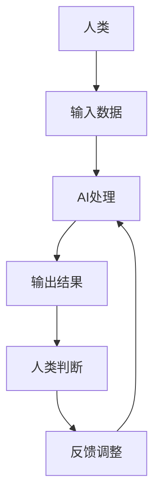

                 

**人类计算：AI时代的未来工作技能**

> 关键词：人工智能、未来工作技能、人类计算、自动化、数字化转型、人机协作

## 1. 背景介绍

在人工智能（AI）飞速发展的今天，AI已经渗透到我们的日常生活和工作中，从搜索引擎到自动驾驶汽车，再到智能客服，AI无处不在。然而，AI的发展也引发了对未来工作技能的讨论。人类该如何适应AI时代，并发展出新的工作技能？本文将探讨人类计算的概念，以及在AI时代，人类需要发展哪些未来工作技能。

## 2. 核心概念与联系

### 2.1 人类计算的概念

人类计算（Human-in-the-Loop）是指将人类作为计算过程中的一环，人类和AI共同协作完成任务。人类计算强调人类的判断、创造力和直觉，将其与AI的优势结合，发挥最大的作用。



### 2.2 人类计算与AI的联系

人类计算与AI的联系密切，AI为人类计算提供了强大的工具，帮助人类处理复杂的数据和任务。同时，人类计算也为AI提供了指导，帮助AI不断学习和进步。二者的结合，将会创造出更高效、更智能的工作模式。

## 3. 核心算法原理 & 具体操作步骤

### 3.1 算法原理概述

人类计算的核心是人机协作，其算法原理是基于人类的判断和AI的处理能力。人类提供初始输入和指导，AI则根据这些输入和指导进行处理，并输出结果。人类再根据结果进行判断，并给出反馈，指导AI的进一步处理。

### 3.2 算法步骤详解

1. **人类输入数据**：人类提供初始数据，这些数据可以是问题描述，也可以是任务的初始状态。
2. **AI处理**：AI根据人类输入的数据，进行处理。处理的结果可以是数据的分析结果，也可以是任务的进展状态。
3. **人类判断**：人类根据AI的处理结果，进行判断。判断的结果可以是对处理结果的接受或拒绝，也可以是对任务的进一步指导。
4. **反馈调整**：人类根据判断结果，给出反馈，指导AI的进一步处理。反馈可以是对数据的调整，也可以是对任务的指令。

### 3.3 算法优缺点

**优点**：人类计算结合了人类的判断和AI的处理能力，可以发挥最大的作用。人类可以利用AI处理复杂的数据和任务，同时又可以根据自己的判断进行指导，避免AI的盲目性。

**缺点**：人类计算需要人类和AI的密切协作，这对人类的技能提出了更高的要求。同时，人类计算也需要更多的时间和精力，因为人类需要不断地判断和指导。

### 3.4 算法应用领域

人类计算的应用领域非常广泛，从医疗到金融，从制造到服务业，人类计算都可以发挥作用。人类计算可以帮助人类处理复杂的数据，提高工作效率，并为人类提供更多的创造空间。

## 4. 数学模型和公式 & 详细讲解 & 举例说明

### 4.1 数学模型构建

人类计算的数学模型可以用控制论的框架来描述。控制论研究的是控制系统的行为，人类计算就是一个控制系统，人类是控制者，AI是被控制者。

### 4.2 公式推导过程

人类计算的数学模型可以用下面的公式来表示：

$$y(k) = f(u(k), y(k-1), e(k))$$

其中，$y(k)$是人类的判断，$u(k)$是人类的输入，$y(k-1)$是AI的上一时刻的输出，$e(k)$是人类的反馈。函数$f(\cdot)$描述了人类的判断规则。

### 4.3 案例分析与讲解

例如，在医疗领域，人类计算可以帮助医生处理复杂的病例。医生输入病人的症状和检查结果，AI则根据这些输入，进行病情分析。医生根据AI的分析结果，进行判断，并给出治疗方案。AI则根据医生的治疗方案，进行下一步的处理。在这个过程中，人类的判断和AI的处理能力结合，共同帮助医生做出更准确的诊断和治疗决策。

## 5. 项目实践：代码实例和详细解释说明

### 5.1 开发环境搭建

人类计算的开发环境需要支持AI的开发，同时也需要支持人机交互。常用的开发环境包括Python、TensorFlow、PyTorch等AI开发框架，以及React、Angular等人机交互框架。

### 5.2 源代码详细实现

以下是一个简单的人类计算示例的源代码。这个示例是一个简单的AI助手，帮助用户处理待办事项。

```python
class AIAssistant:
    def __init__(self):
        self.tasks = []

    def add_task(self, task):
        self.tasks.append(task)

    def process_tasks(self):
        # AI处理任务
        # 这里省略了具体的处理过程
        pass

    def get_tasks(self):
        return self.tasks

class Human:
    def __init__(self, assistant):
        self.assistant = assistant

    def input_tasks(self):
        # 人类输入任务
        # 这里省略了具体的输入过程
        pass

    def judge_tasks(self, tasks):
        # 人类判断任务
        # 这里省略了具体的判断过程
        pass

    def give_feedback(self, tasks):
        # 人类给出反馈
        # 这里省略了具体的反馈过程
        pass

def human_in_the_loop():
    assistant = AIAssistant()
    human = Human(assistant)

    # 人类输入任务
    human.input_tasks()

    # AI处理任务
    assistant.process_tasks()

    # 人类判断任务
    tasks = human.judge_tasks(assistant.get_tasks())

    # 人类给出反馈
    human.give_feedback(tasks)

if __name__ == "__main__":
    human_in_the_loop()
```

### 5.3 代码解读与分析

这个示例中，`AIAssistant`类负责处理任务，`Human`类负责输入任务、判断任务和给出反馈。`human_in_the_loop`函数则是人类计算的核心，它实现了人类输入、AI处理、人类判断和反馈的循环过程。

### 5.4 运行结果展示

运行这个示例，AI助手会帮助用户处理待办事项。用户可以输入任务，AI助手则根据这些输入，进行处理。用户根据处理结果，进行判断，并给出反馈。AI助手则根据用户的反馈，进行下一步的处理。

## 6. 实际应用场景

### 6.1 当前应用场景

人类计算已经在各个领域得到广泛应用。例如，在医疗领域，人类计算可以帮助医生处理复杂的病例；在金融领域，人类计算可以帮助金融分析师进行风险评估；在制造领域，人类计算可以帮助工程师进行设计和优化。

### 6.2 未来应用展望

随着AI技术的不断发展，人类计算的应用也将不断扩展。未来，人类计算将会渗透到更多的领域，帮助人类处理更复杂的任务。人类计算也将会和其他技术结合，创造出更智能、更高效的工作模式。

## 7. 工具和资源推荐

### 7.1 学习资源推荐

- **书籍**：《人机协作：人工智能的未来》《人类计算：人机协作的未来》《人工智能：一本入门到放弃的书》
- **在线课程**：Coursera、Udacity、edX等平台上的人工智能和人机协作课程

### 7.2 开发工具推荐

- **AI开发框架**：TensorFlow、PyTorch、Keras
- **人机交互框架**：React、Angular、Vue.js
- **开发环境**：Jupyter Notebook、Google Colab、Visual Studio Code

### 7.3 相关论文推荐

- **人机协作**：[Human-in-the-Loop Machine Learning](https://arxiv.org/abs/1905.02268)、[Human-in-the-Loop Deep Learning](https://arxiv.org/abs/1906.00209)
- **人类计算**：[Human-in-the-Loop AI: A Survey](https://arxiv.org/abs/2003.09483)、[Human-in-the-Loop Machine Learning for Healthcare](https://arxiv.org/abs/2004.05710)

## 8. 总结：未来发展趋势与挑战

### 8.1 研究成果总结

人类计算是人机协作的一种形式，它结合了人类的判断和AI的处理能力，可以发挥最大的作用。人类计算已经在各个领域得到广泛应用，并取得了显著的成果。

### 8.2 未来发展趋势

未来，人类计算将会和其他技术结合，创造出更智能、更高效的工作模式。人类计算也将会渗透到更多的领域，帮助人类处理更复杂的任务。

### 8.3 面临的挑战

然而，人类计算也面临着挑战。首先，人类计算需要人类和AI的密切协作，这对人类的技能提出了更高的要求。其次，人类计算也需要更多的时间和精力，因为人类需要不断地判断和指导。最后，人类计算也需要解决隐私和安全等问题。

### 8.4 研究展望

未来，人类计算的研究将会聚焦于以下几个方向：

- **人机协作的新模式**：研究新的人机协作模式，以发挥人类和AI的最大作用。
- **人类技能的提升**：研究如何提高人类的技能，以适应AI时代的需求。
- **隐私和安全**：研究如何保护人类的隐私和安全，以建立信任的AI系统。

## 9. 附录：常见问题与解答

**Q：人类计算和自动化有什么区别？**

A：自动化是指将人类的工作完全交给AI处理，人类计算则是人类和AI共同协作完成任务。二者的区别在于人类在其中的作用。

**Q：人类计算需要什么样的技能？**

A：人类计算需要的技能包括判断力、创造力、直觉等。这些技能是人类的优势，也是人类计算的基础。

**Q：人类计算会取代人类的工作吗？**

A：人类计算不会取代人类的工作，而是会创造出新的工作岗位。人类计算需要人类的判断和指导，这为人类提供了新的机会。

**Q：人类计算的未来是什么样的？**

A：人类计算的未来是人机协作的未来。人类和AI将会共同协作，创造出更智能、更高效的工作模式。人类计算也将会渗透到更多的领域，帮助人类处理更复杂的任务。

**作者：禅与计算机程序设计艺术 / Zen and the Art of Computer Programming**

