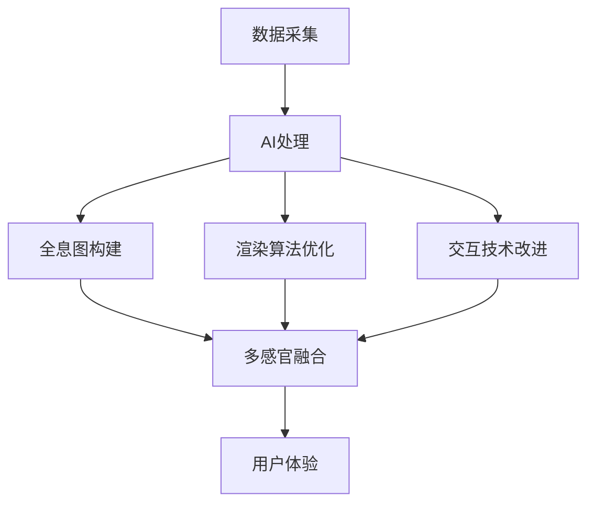

                 

**关键词：全息图、多感官融合、AI、虚拟现实、增强现实、传感器、渲染算法、交互技术**

## 1. 背景介绍

在当今数字化转型的浪潮中，虚拟现实（VR）和增强现实（AR）技术正在各行各业迅速崛起。其中，全息图技术作为这两种技术的关键组成部分，正在引领着我们迈向更加多感官、沉浸式的数字体验。本文将深入探讨全息图工程师的角色，介绍AI驱动的多感官融合技术，并提供实践指南和未来展望。

## 2. 核心概念与联系

### 2.1 全息图与多感官融合

全息图是一种三维数字表示，它记录了物体从各个角度的信息，从而允许观察者从任意角度查看该物体。多感官融合则是将视觉、听觉、触觉等多种感官信息集成到单一的体验中，从而提高用户的沉浸感和参与度。


### 2.2 AI在全息图与多感官融合中的作用

AI技术在全息图和多感官融合领域扮演着关键角色。它可以帮助构建更逼真的全息图，优化渲染算法，并改进用户与虚拟环境的交互方式。下图展示了AI在全息图和多感官融合技术中的作用：



## 3. 核心算法原理 & 具体操作步骤

### 3.1 算法原理概述

构建全息图的核心算法是光学相干散射（Optical Coherence Tomography, OCT）和结构从点云（Structure from Motion, SfM）技术。AI则通过深度学习算法，如卷积神经网络（Convolutional Neural Networks, CNN），来优化这些算法的性能。

### 3.2 算法步骤详解

1. **数据采集**：使用传感器（如相机、激光雷达）采集物体的多角度数据。
2. **预处理**：去除噪声，校准数据，并将其转换为统一的格式。
3. **特征提取**：使用CNN等深度学习算法提取关键特征，如边缘、纹理和形状。
4. **三维重建**：使用OCT或SfM算法将提取的特征重建为三维模型。
5. **渲染**：使用渲染算法（如 ray tracing）将三维模型渲染为全息图。
6. **多感官融合**：将视觉全息图与听觉、触觉等其他感官信息集成，创建多感官体验。

### 3.3 算法优缺点

**优点**：AI驱动的算法可以提高全息图的质量，加快渲染速度，并改进用户交互。此外，这些算法可以学习和适应新的数据集，从而提高其泛化能力。

**缺点**：深度学习算法需要大量的数据和计算资源，这可能会导致成本和时间上的开销。此外，这些算法的可解释性有限，这可能会导致结果的不确定性。

### 3.4 算法应用领域

全息图和多感官融合技术的应用领域包括医学成像、文化遗产保护、设计可视化、军事训练、娱乐和教育等。

## 4. 数学模型和公式 & 详细讲解 & 举例说明

### 4.1 数学模型构建

构建全息图的数学模型基于几何学和物理模型。例如，OCT算法使用光学相干散射的物理模型来重建三维结构。数学表示如下：

$$I(\tau) = |\int s(\tau')r(\tau - \tau')d\tau'|^2$$

其中，$I(\tau)$是采集到的信号强度，$\tau$是时间延迟，$s(\tau')$是源光的时域分布，$r(\tau - \tau')$是反射光的时域分布。

### 4.2 公式推导过程

推导过程涉及光学相干散射的物理原理，包括光的干涉和相位信息的提取。详细推导过程超出了本文的范围，但可以在相关文献中找到。

### 4.3 案例分析与讲解

例如，在医学成像领域，OCT技术用于非侵入性地成像眼部结构。通过扫描眼部，OCT算法可以重建眼部结构的三维模型，帮助医生诊断和治疗眼部疾病。图4.1显示了使用OCT技术成像的眼部结构。


图4.1：眼部结构OCT成像

## 5. 项目实践：代码实例和详细解释说明

### 5.1 开发环境搭建

要构建全息图和多感官融合系统，需要以下软件和硬件：

- 编程语言：Python（推荐）或C++
- 深度学习框架：TensorFlow或PyTorch
- 计算机视觉库：OpenCV
- 渲染引擎：Unity或Unreal Engine
- 硬件：高性能计算机、传感器（如相机、激光雷达）、VR/AR头盔

### 5.2 源代码详细实现

以下是构建全息图的简化代码示例，使用Python和OpenCV库：

```python
import cv2
import numpy as np

# 读取图像
img = cv2.imread('input_image.png', cv2.IMREAD_GRAYSCALE)

# 使用Canny边缘检测
edges = cv2.Canny(img, 50, 150, apertureSize=3)

# 使用Sobel算子计算梯度
sobel_x = cv2.Sobel(edges, cv2.CV_64F, 1, 0, ksize=5)
sobel_y = cv2.Sobel(edges, cv2.CV_64F, 0, 1, ksize=5)

# 计算梯度幅值
grad_mag = np.hypot(sobel_x, sobel_y)

# 保存结果
cv2.imwrite('output_image.png', grad_mag)
```

### 5.3 代码解读与分析

这段代码使用OpenCV库读取输入图像，然后使用Canny边缘检测和Sobel算子计算图像梯度。最后，它计算梯度幅值并保存结果。这只是构建全息图的第一步，后续还需要进行三维重建和渲染。

### 5.4 运行结果展示

运行这段代码后，您会得到一个梯度幅值图像，该图像可以用于后续的三维重建步骤。

## 6. 实际应用场景

### 6.1 当前应用

全息图和多感官融合技术正在各行各业得到广泛应用，包括：

- **医学**：用于非侵入性成像和手术导航。
- **考古学**：用于记录和保护文化遗产。
- **设计**：用于设计可视化和虚拟原型。
- **娱乐**：用于VR和AR游戏和电影。

### 6.2 未来应用展望

未来，全息图和多感官融合技术有望在以下领域得到进一步发展：

- **远程协作**：允许用户在虚拟环境中合作和协作。
- **教育**：提供更沉浸式的学习体验。
- **虚拟试穿**：允许用户在购买前试穿服装或其他产品。
- **数字孪生**：创建物理世界的数字副本，用于模拟和优化系统。

## 7. 工具和资源推荐

### 7.1 学习资源推荐

- **书籍**："Computer Vision: Algorithms and Applications" by Richard Szeliski
- **在线课程**：Coursera上的"Computer Vision"课程
- **文献**：IEEE Xplore和ACM Digital Library上的相关文献

### 7.2 开发工具推荐

- **编程语言**：Python（推荐）或C++
- **深度学习框架**：TensorFlow或PyTorch
- **计算机视觉库**：OpenCV
- **渲染引擎**：Unity或Unreal Engine
- **VR/AR平台**：Oculus、HTC Vive、Magic Leap

### 7.3 相关论文推荐

- "Light Field Photography with a Hand-Held Camera" by Ng et al.
- "Real-Time Dynamic Scene Reconstruction with a Single RGB-D Camera" by Izadi et al.
- "Deep Learning for 3D Reconstruction" by Eigen and Fergus

## 8. 总结：未来发展趋势与挑战

### 8.1 研究成果总结

本文介绍了全息图工程师的角色，解释了AI驱动的多感官融合技术，并提供了实践指南和未来展望。

### 8.2 未来发展趋势

未来，全息图和多感官融合技术有望在以下领域取得进展：

- **实时渲染**：使用AI优化渲染算法，实现实时渲染。
- **交互技术**：开发新的交互技术，如手势识别和脑机接口。
- **多模式感知**：集成更多模式的感官信息，如嗅觉和味觉。

### 8.3 面临的挑战

全息图和多感官融合技术面临的挑战包括：

- **计算资源**：构建高质量全息图和多感官融合系统需要大量的计算资源。
- **延迟**：实时渲染和交互需要降低延迟。
- **可用性**：系统需要易于使用，以便非技术用户也能体验。

### 8.4 研究展望

未来的研究方向包括：

- **AI驱动的渲染算法**：使用AI优化渲染算法，实现实时渲染。
- **多模式感官集成**：集成更多模式的感官信息，创建更丰富的体验。
- **可穿戴设备**：开发便携式全息图和多感官融合系统，如可穿戴设备。

## 9. 附录：常见问题与解答

**Q：全息图和多感官融合技术有什么区别？**

**A**：全息图是一种三维数字表示，它记录了物体从各个角度的信息。多感官融合则是将视觉、听觉、触觉等多种感官信息集成到单一的体验中。

**Q：AI在全息图和多感官融合技术中的作用是什么？**

**A**：AI技术在全息图和多感官融合领域扮演着关键角色。它可以帮助构建更逼真的全息图，优化渲染算法，并改进用户与虚拟环境的交互方式。

**Q：构建全息图的核心算法是什么？**

**A**：构建全息图的核心算法是光学相干散射（OCT）和结构从点云（SfM）技术。AI则通过深度学习算法，如卷积神经网络（CNN），来优化这些算法的性能。

**Q：全息图和多感官融合技术的应用领域是什么？**

**A**：全息图和多感官融合技术的应用领域包括医学成像、文化遗产保护、设计可视化、军事训练、娱乐和教育等。

**Q：未来全息图和多感官融合技术的发展趋势是什么？**

**A**：未来，全息图和多感官融合技术有望在实时渲染、交互技术和多模式感官集成等领域取得进展。

**Q：全息图和多感官融合技术面临的挑战是什么？**

**A**：全息图和多感官融合技术面临的挑战包括计算资源、延迟和可用性。

## 作者：禅与计算机程序设计艺术 / Zen and the Art of Computer Programming

