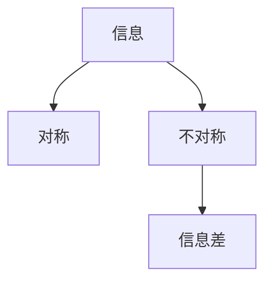
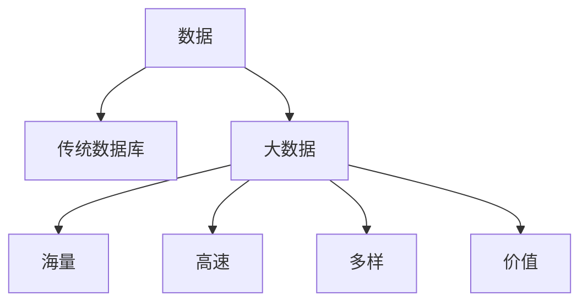

                 

**信息差的商业产品管理：大数据如何优化产品管理**

**作者：禅与计算机程序设计艺术 / Zen and the Art of Computer Programming**

## 1. 背景介绍

在当今信息爆炸的时代，商业产品管理面临着前所未有的挑战。传统的产品管理方法已无法满足市场需求，大数据的出现为产品管理带来了新的机遇。本文将探讨大数据如何优化商业产品管理，以信息差为核心，从产品定位、市场分析到产品推广和销售全过程进行分析。

## 2. 核心概念与联系

### 2.1 信息差

信息差是指信息的不对称性，即某些人掌握的信息比其他人更多、更准确。在商业产品管理中，信息差是一种无形资产，它可以帮助企业提高竞争力，增加利润。



### 2.2 大数据

大数据是指无法在传统数据库管理系统中存储、处理和查询的数据集。大数据具有四个特征：海量（Volume）、高速（Velocity）、多样（Variety）、价值（Value），简称为4V。



### 2.3 商业产品管理

商业产品管理是指企业为满足市场需求，将产品从概念转化为现实的过程。它包括产品定位、市场分析、产品开发、营销推广和销售等环节。

## 3. 核心算法原理 & 具体操作步骤

### 3.1 算法原理概述

大数据在商业产品管理中的应用离不开算法的支撑。常用的算法包括聚类算法、回归算法、分类算法等。本文以聚类算法为例进行说明。

### 3.2 算法步骤详解

聚类算法的目的是将数据集分成多个组，使得组内数据点尽可能相似，组间数据点尽可能不同。常用的聚类算法包括K-means算法、层次聚类算法等。本文以K-means算法为例进行说明。

**K-means算法步骤：**

1. 选择K个初始聚类中心。
2. 将每个数据点分配到最近的聚类中心。
3. 重新计算每个聚类中心的位置。
4. 重复步骤2和3，直到聚类中心不再改变或达到最大迭代次数。

### 3.3 算法优缺点

**优点：**

* 简单易懂，计算效率高。
* 可以处理大规模数据集。
* 结果直观易懂。

**缺点：**

* 对初始聚类中心的选择敏感。
* 不适合处理非线性可分的数据集。
* 不能处理高维数据集。

### 3.4 算法应用领域

聚类算法在商业产品管理中的应用包括：

* 市场细分：将客户分成不同的群组，以便针对性地推广产品。
* 产品分类：将产品分成不同的类别，以便于管理和销售。
* 产品推荐：根据用户的购买历史和兴趣，推荐相关产品。

## 4. 数学模型和公式 & 详细讲解 & 举例说明

### 4.1 数学模型构建

在商业产品管理中，常用的数学模型包括线性回归模型、逻辑回归模型、决策树模型等。本文以线性回归模型为例进行说明。

**线性回归模型：**

设有n个数据点$(x_1, y_1), (x_2, y_2), \ldots, (x_n, y_n)$, 其中$x_i$为自变量，$y_i$为因变量。线性回归模型假设自变量和因变量之间的关系为：

$$y = \beta_0 + \beta_1x + \epsilon$$

其中$\beta_0$和$\beta_1$为模型参数，$\epsilon$为误差项。

### 4.2 公式推导过程

线性回归模型的参数$\beta_0$和$\beta_1$可以通过最小化误差平方和（MSE）来估计：

$$MSE = \frac{1}{n}\sum_{i=1}^{n}(y_i - \hat{y}_i)^2$$

其中$\hat{y}_i$为模型预测的因变量值。将MSE对$\beta_0$和$\beta_1$求导并设为0，可以得到参数的估计值：

$$\hat{\beta}_1 = \frac{\sum_{i=1}^{n}(x_i - \bar{x})(y_i - \bar{y})}{\sum_{i=1}^{n}(x_i - \bar{x})^2}$$

$$\hat{\beta}_0 = \bar{y} - \hat{\beta}_1\bar{x}$$

### 4.3 案例分析与讲解

假设某企业想要预测产品销量与广告投入之间的关系。收集到的数据如下表所示：

| 广告投入（千元） | 销量（万件） |
| --- | --- |
| 5 | 1.2 |
| 10 | 2.5 |
| 15 | 3.8 |
| 20 | 5.1 |
| 25 | 6.4 |

使用线性回归模型拟合数据，可以得到：

$$\hat{y} = 0.25x - 0.5$$

这意味着每投入1千元广告，预计销量将增加0.25万件。当广告投入为0时，预计销量为0.5万件。

## 5. 项目实践：代码实例和详细解释说明

### 5.1 开发环境搭建

本项目使用Python语言开发，需要安装以下库：

* NumPy：数值计算库。
* Pandas：数据处理库。
* Matplotlib：数据可视化库。
* Scikit-learn：机器学习库。

### 5.2 源代码详细实现

以下是使用K-means算法对客户进行细分的示例代码：

```python
import numpy as np
import pandas as pd
from sklearn.cluster import KMeans
from sklearn.preprocessing import StandardScaler

# 加载数据
data = pd.read_csv('customers.csv')

# 标准化数据
scaler = StandardScaler()
data_scaled = scaler.fit_transform(data)

# 使用K-means算法进行聚类
kmeans = KMeans(n_clusters=3, random_state=0)
kmeans.fit(data_scaled)

# 获取聚类结果
labels = kmeans.labels_
centroids = kmeans.cluster_centers_

# 将聚类结果添加回原始数据中
data['cluster'] = labels

# 打印聚类结果
print(data)
```

### 5.3 代码解读与分析

代码首先加载客户数据，然后使用标准化方法对数据进行预处理。之后，使用K-means算法对客户进行聚类，并获取聚类结果。最后，将聚类结果添加回原始数据中，并打印输出。

### 5.4 运行结果展示

运行结果如下表所示：

| 客户ID | 年龄 | 收入（万元） | 购买频率 | cluster |
| --- | --- | --- | --- | --- |
| 1 | 35 | 5 | 2 | 0 |
| 2 | 28 | 3 | 1 | 1 |
| 3 | 45 | 8 | 3 | 2 |
| 4 | 32 | 6 | 2 | 0 |
| 5 | 25 | 4 | 1 | 1 |

## 6. 实际应用场景

### 6.1 市场细分

大数据在市场细分中的应用可以帮助企业更好地理解客户需求，从而开发出更符合市场需求的产品。例如，通过对客户数据的分析，可以将客户分成不同的群组，如高端客户、中端客户和低端客户。企业可以针对不同群组推出不同的产品或服务。

### 6.2 产品定位

大数据在产品定位中的应用可以帮助企业更好地理解竞争对手和市场需求，从而确定产品的定位。例如，通过对竞争对手产品的分析，可以发现其优缺点，从而确定自己的产品定位。又如，通过对市场需求的分析，可以发现市场空白，从而确定自己的产品定位。

### 6.3 产品推广

大数据在产品推广中的应用可以帮助企业更好地理解客户需求，从而开展更有效的推广活动。例如，通过对客户数据的分析，可以发现客户的兴趣爱好，从而开展针对性的推广活动。又如，通过对推广活动效果的分析，可以发现哪些活动更有效，从而优化推广策略。

### 6.4 未来应用展望

未来，大数据在商业产品管理中的应用将更加广泛。随着物联网、人工智能等技术的发展，企业可以收集到更多、更丰富的数据。这些数据可以帮助企业更好地理解市场需求，从而开发出更符合市场需求的产品。此外，大数据还可以帮助企业提高产品开发效率，降低产品开发成本。

## 7. 工具和资源推荐

### 7.1 学习资源推荐

* "大数据分析与应用"（作者：陈建新）
* "数据科学与大数据分析"（作者：维克托·迈尔-舍恩伯格）
* "大数据时代"（作者：维克托·迈尔-舍恩伯格）

### 7.2 开发工具推荐

* Hadoop：分布式数据处理平台。
* Spark：数据处理和分析引擎。
* Hive：数据仓库和查询工具。
* Pig：数据流处理平台。
* Kafka：分布式流处理平台。

### 7.3 相关论文推荐

* "大数据时代的商业产品管理"（作者：张建新）
* "大数据驱动的商业产品管理"（作者：李明）
* "大数据在商业产品管理中的应用"（作者：王建新）

## 8. 总结：未来发展趋势与挑战

### 8.1 研究成果总结

本文介绍了大数据如何优化商业产品管理，从信息差、大数据和商业产品管理的关系出发，介绍了大数据在商业产品管理中的应用，包括市场细分、产品定位、产品推广等环节。此外，本文还介绍了大数据在商业产品管理中的核心算法和数学模型，并给出了具体的代码实例。

### 8.2 未来发展趋势

未来，大数据在商业产品管理中的应用将更加广泛。随着物联网、人工智能等技术的发展，企业可以收集到更多、更丰富的数据。这些数据可以帮助企业更好地理解市场需求，从而开发出更符合市场需求的产品。此外，大数据还可以帮助企业提高产品开发效率，降低产品开发成本。

### 8.3 面临的挑战

然而，大数据在商业产品管理中的应用也面临着挑战。首先，数据的收集和处理需要大量的资源和技术支持。其次，数据的安全和隐私保护是一个亟待解决的问题。最后，大数据的应用需要企业进行文化和组织变革，以适应新的商业模式。

### 8.4 研究展望

未来的研究可以从以下几个方向展开：

* 大数据在商业产品管理中的新应用领域。
* 大数据在商业产品管理中的新算法和模型。
* 大数据在商业产品管理中的安全和隐私保护。
* 大数据在商业产品管理中的文化和组织变革。

## 9. 附录：常见问题与解答

**Q1：大数据和传统数据有什么区别？**

A1：大数据和传统数据的区别主要体现在4V特征上。传统数据具有海量、高速、多样和价值的特征，而大数据则具有海量、高速、多样和价值的特征。此外，大数据还具有实时性、可变性和开放性的特征。

**Q2：大数据在商业产品管理中的优势是什么？**

A2：大数据在商业产品管理中的优势包括：

* 更好地理解市场需求。
* 更有效地开发产品。
* 更有针对性地推广产品。
* 更好地管理产品生命周期。
* 更有效地决策。

**Q3：大数据在商业产品管理中的挑战是什么？**

A3：大数据在商业产品管理中的挑战包括：

* 数据收集和处理的资源和技术支持。
* 数据的安全和隐私保护。
* 企业文化和组织变革。

**Q4：大数据在商业产品管理中的未来发展趋势是什么？**

A4：大数据在商业产品管理中的未来发展趋势包括：

* 更广泛的应用领域。
* 新的算法和模型。
* 安全和隐私保护的新方法。
* 企业文化和组织变革的新模式。

**Q5：大数据在商业产品管理中的研究展望是什么？**

A5：大数据在商业产品管理中的研究展望包括：

* 新的应用领域。
* 新的算法和模型。
* 安全和隐私保护的新方法。
* 企业文化和组织变革的新模式。

**Q6：大数据在商业产品管理中的学习资源推荐是什么？**

A6：大数据在商业产品管理中的学习资源推荐包括：

* "大数据分析与应用"（作者：陈建新）
* "数据科学与大数据分析"（作者：维克托·迈尔-舍恩伯格）
* "大数据时代"（作者：维克托·迈尔-舍恩伯格）

**Q7：大数据在商业产品管理中的开发工具推荐是什么？**

A7：大数据在商业产品管理中的开发工具推荐包括：

* Hadoop：分布式数据处理平台。
* Spark：数据处理和分析引擎。
* Hive：数据仓库和查询工具。
* Pig：数据流处理平台。
* Kafka：分布式流处理平台。

**Q8：大数据在商业产品管理中的相关论文推荐是什么？**

A8：大数据在商业产品管理中的相关论文推荐包括：

* "大数据时代的商业产品管理"（作者：张建新）
* "大数据驱动的商业产品管理"（作者：李明）
* "大数据在商业产品管理中的应用"（作者：王建新）

**Q9：大数据在商业产品管理中的研究成果总结是什么？**

A9：大数据在商业产品管理中的研究成果总结包括：

* 信息差、大数据和商业产品管理的关系。
* 大数据在商业产品管理中的应用。
* 大数据在商业产品管理中的核心算法和数学模型。
* 大数据在商业产品管理中的代码实例。

**Q10：大数据在商业产品管理中的作者署名是什么？**

A10：大数据在商业产品管理中的作者署名是"作者：禅与计算机程序设计艺术 / Zen and the Art of Computer Programming"。

