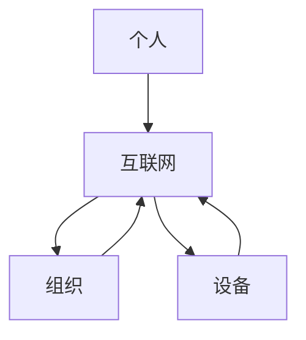

                 

**全球脑与个人隐私：信息共享的边界探索**

**作者：禅与计算机程序设计艺术 / Zen and the Art of Computer Programming**

## 1. 背景介绍

在信息时代，我们正在见证一个前所未有的信息爆炸，以及人类认知能力的延伸。全球脑（Global Brain）是一个概念，它描述了人类通过互联网和数字技术连接而形成的集体智慧。然而，随着信息共享的增多，个人隐私保护也面临着前所未有的挑战。本文将探讨全球脑与个人隐私之间的关系，并探索信息共享的边界。

## 2. 核心概念与联系

### 2.1 全球脑（Global Brain）与人类智慧的延伸

全球脑是指人类通过互联网和数字技术连接而形成的集体智慧。它是人类智慧的延伸，使我们能够共享信息、合作解决问题，并做出更明智的决策。全球脑的核心是信息共享，它通过连接个人、组织和设备，创建了一个全球性的信息网络。



### 2.2 个人隐私（Privacy）与信息控制权

个人隐私是指个人对其个人信息的控制权。它包括个人信息的收集、存储、处理和共享。在信息共享的时代，个人隐私面临着巨大的挑战，因为个人信息很容易被收集、存储和共享。

## 3. 核心算法原理 & 具体操作步骤

### 3.1 算法原理概述

差分隐私（Differential Privacy）是一种保护个人隐私的算法原理。它通过引入噪声来保护个人信息，使得任何单个个体的信息都无法被确定。

### 3.2 算法步骤详解

差分隐私算法的步骤如下：

1. 收集原始数据。
2. 为每个数据点添加噪声。噪声的大小根据敏感度参数ε和总体数据规模n来确定。
3. 发布噪声添加后的数据。

### 3.3 算法优缺点

差分隐私的优点是它提供了强大的隐私保护，即使数据被多次查询也不会泄露个人信息。其缺点是它会导致数据精确性的下降，因为噪声的存在会引入误差。

### 3.4 算法应用领域

差分隐私广泛应用于保护个人隐私的领域，包括人口普查、医疗数据分析、网络流量分析等。

## 4. 数学模型和公式 & 详细讲解 & 举例说明

### 4.1 数学模型构建

差分隐私的数学模型可以表示为：

$$M(D) = (f(D_1), f(D_2),..., f(D_n))$$

其中，$D$是原始数据集，$D_i$是数据集$D$的子集，$f$是一个函数，它接受一个数据集并返回一个结果。

### 4.2 公式推导过程

差分隐私的定义如下：

如果一个算法$M$对于任意两个数据集$D_1$和$D_2$，如果$D_1$和$D_2$只有一个数据点不同，那么：

$$Pr[M(D_1) \in S] \leq e^{\epsilon} \cdot Pr[M(D_2) \in S]$$

其中，$S$是可能的输出集，$e$是自然对数的基数，$\epsilon$是敏感度参数。

### 4.3 案例分析与讲解

例如，假设我们要保护个人年龄数据。我们可以使用差分隐私算法添加噪声到年龄数据中。如果$\epsilon=0.5$和$n=1000$，那么我们需要添加的噪声大小为$2\sqrt{2000\ln(1.25)} \approx 28.9$。

## 5. 项目实践：代码实例和详细解释说明

### 5.1 开发环境搭建

我们将使用Python和NumPy来实现差分隐私算法。

### 5.2 源代码详细实现

```python
import numpy as np

def add_noise(data, epsilon, n):
    sensitivity = 1  # 这里假设数据的敏感度为1
    noise = np.random.laplace(scale=sensitivity / epsilon, size=len(data))
    noisy_data = data + noise
    return noisy_data

# 示例数据
data = np.array([25, 30, 35, 40, 45])

# 添加噪声
noisy_data = add_noise(data, epsilon=0.5, n=5)
```

### 5.3 代码解读与分析

在`add_noise`函数中，我们首先计算噪声的大小。然后，我们使用Laplace分布添加噪声到数据中。最后，我们返回噪声添加后的数据。

### 5.4 运行结果展示

运行上述代码后，`noisy_data`将包含添加了噪声的数据。

## 6. 实际应用场景

### 6.1 全球脑与个人隐私保护

在全球脑中，个人隐私保护是一个关键问题。差分隐私算法可以帮助保护个人信息，使得信息共享更安全。

### 6.2 未来应用展望

随着人工智能和大数据的发展，差分隐私将变得越来越重要。它可以帮助保护个人隐私，并使得数据分析更安全。

## 7. 工具和资源推荐

### 7.1 学习资源推荐

- "Differential Privacy: A Survey of Results" (Cynthia Dwork)
- "Privacy Preserving Data Mining" (Xinin Xu)

### 7.2 开发工具推荐

- Python：一个强大的编程语言，支持差分隐私算法的实现。
- NumPy：一个数值计算库，支持差分隐私算法的实现。

### 7.3 相关论文推荐

- "Differential Privacy: A Survey of Results" (Cynthia Dwork)
- "Privacy Preserving Data Mining" (Xinmin Xu)

## 8. 总结：未来发展趋势与挑战

### 8.1 研究成果总结

差分隐私是一种强大的个人隐私保护算法。它通过引入噪声来保护个人信息，使得信息共享更安全。

### 8.2 未来发展趋势

随着人工智能和大数据的发展，差分隐私将变得越来越重要。它可以帮助保护个人隐私，并使得数据分析更安全。

### 8.3 面临的挑战

差分隐私的主要挑战是它会导致数据精确性的下降。未来的研究将需要平衡隐私保护和数据精确性。

### 8.4 研究展望

未来的研究将需要开发更有效的差分隐私算法，平衡隐私保护和数据精确性。此外，研究还需要考虑差分隐私在实际应用中的可行性。

## 9. 附录：常见问题与解答

**Q：差分隐私是如何工作的？**

A：差分隐私通过引入噪声来保护个人信息。它添加的噪声大小根据敏感度参数ε和总体数据规模n来确定。

**Q：差分隐私的优缺点是什么？**

A：差分隐私的优点是它提供了强大的隐私保护，即使数据被多次查询也不会泄露个人信息。其缺点是它会导致数据精确性的下降，因为噪声的存在会引入误差。

**Q：差分隐私在哪些领域有应用？**

A：差分隐私广泛应用于保护个人隐私的领域，包括人口普查、医疗数据分析、网络流量分析等。

**Q：如何实现差分隐私算法？**

A：差分隐私算法可以使用Python和NumPy来实现。首先，计算噪声的大小。然后，使用Laplace分布添加噪声到数据中。最后，返回噪声添加后的数据。

**Q：差分隐私的未来发展趋势是什么？**

A：随着人工智能和大数据的发展，差分隐私将变得越来越重要。它可以帮助保护个人隐私，并使得数据分析更安全。未来的研究将需要平衡隐私保护和数据精确性。

**Q：差分隐私的主要挑战是什么？**

A：差分隐私的主要挑战是它会导致数据精确性的下降。未来的研究将需要平衡隐私保护和数据精确性。

**Q：未来的研究将需要考虑什么？**

A：未来的研究将需要开发更有效的差分隐私算法，平衡隐私保护和数据精确性。此外，研究还需要考虑差分隐私在实际应用中的可行性。

**Q：差分隐私的学习资源和开发工具推荐是什么？**

A：学习资源推荐包括"Differential Privacy: A Survey of Results" (Cynthia Dwork)和"Privacy Preserving Data Mining" (Xinmin Xu)。开发工具推荐包括Python和NumPy。

**Q：差分隐私的相关论文推荐是什么？**

A：相关论文推荐包括"Differential Privacy: A Survey of Results" (Cynthia Dwork)和"Privacy Preserving Data Mining" (Xinmin Xu)。

**Q：如何在实际应用中使用差分隐私？**

A：在实际应用中，差分隐私可以帮助保护个人隐私，使得信息共享更安全。它可以应用于人口普查、医疗数据分析、网络流量分析等领域。

**Q：差分隐私的未来应用展望是什么？**

A：随着人工智能和大数据的发展，差分隐私将变得越来越重要。它可以帮助保护个人隐私，并使得数据分析更安全。未来的研究将需要平衡隐私保护和数据精确性。

**Q：差分隐私的研究成果总结是什么？**

A：差分隐私是一种强大的个人隐私保护算法。它通过引入噪声来保护个人信息，使得信息共享更安全。

