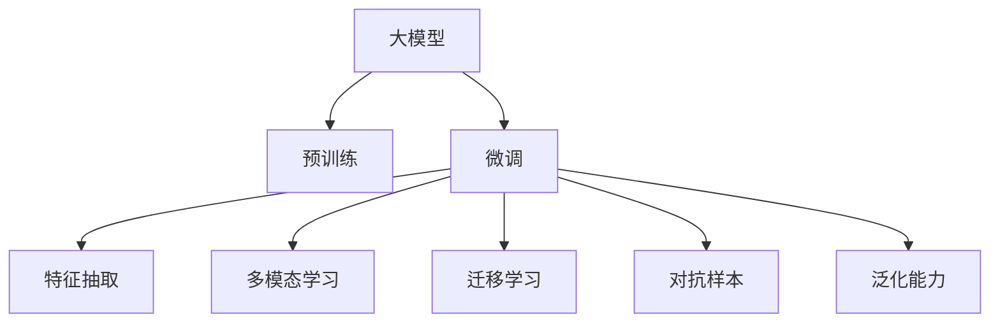

                 

## 1. 背景介绍

### 1.1 问题由来

随着互联网技术的发展，电子商务成为人们日常生活中不可或缺的一部分。电商平台如淘宝、京东、亚马逊等，拥有海量商品数据和用户行为数据。然而，如何精准、高效地从这些数据中提取有用信息，尤其是商品属性预测，是一个重要且具有挑战性的问题。

商品属性预测可以帮助电商平台在多个方面提升用户购物体验和平台运营效率。例如：

- **个性化推荐**：通过准确预测用户偏好的商品属性，推荐更加符合用户需求的物品，提升转化率和满意度。
- **库存管理**：预测未来商品需求，优化库存配置，减少缺货和过剩。
- **定价策略**：根据属性预测结果，制定更有竞争力的定价策略，提高销售额。
- **风险控制**：预测异常交易行为，防范欺诈和风险。

传统的商品属性预测方法，如统计分析和机器学习算法，面对电商平台的数据复杂性，往往难以取得令人满意的性能。而基于大模型，如BERT、GPT、Transformer等，其强大的数据处理能力和泛化性能，为商品属性预测提供了新的突破口。

### 1.2 问题核心关键点

大模型在电商平台商品属性预测中的核心关键点包括：

- **数据准备**：商品属性预测任务通常需要丰富的特征数据，如文本描述、图片、价格等。大模型需要高效处理这些多模态数据。
- **模型训练**：利用预训练模型的知识，对特定任务进行微调，提升预测精度。
- **模型应用**：将训练好的模型应用于线上预测，实时处理大量数据，返回预测结果。
- **效果评估**：使用多种评估指标，如准确率、召回率、F1值等，全面衡量模型性能。

## 2. 核心概念与联系

### 2.1 核心概念概述

为更好地理解大模型在电商平台商品属性预测中的作用，本节将介绍几个密切相关的核心概念：

- **大模型(Large Model)**：如BERT、GPT、Transformer等，通过大规模语料预训练获得强大的语言表示能力，具备强大的特征提取和泛化性能。
- **预训练(Pre-training)**：指在大规模无标签文本语料上进行预训练，学习语言的通用表示。
- **微调(Fine-tuning)**：在预训练模型的基础上，使用有标签数据进行有监督学习，优化模型在特定任务上的表现。
- **特征抽取(Feature Extraction)**：利用大模型的表示能力，从原始数据中提取有意义的特征。
- **多模态学习(Multimodal Learning)**：融合文本、图像、音频等多种模态的数据，提升模型性能。
- **迁移学习(Transfer Learning)**：将预训练模型在相关任务上的知识迁移应用到新任务中，减少数据和计算资源的投入。
- **对抗样本(Adversarial Samples)**：针对模型训练的攻击手段，通过精心设计的扰动样本，提高模型的鲁棒性。
- **泛化能力(Generalization)**：模型在新数据上的表现能力，即模型在未见过的数据上仍能保持良好性能。

这些概念之间的逻辑关系可以通过以下Mermaid流程图来展示：



这个流程图展示了大模型在电商平台商品属性预测任务中的核心概念及其之间的关系：

1. 大模型通过预训练获得基础能力。
2. 微调是对预训练模型进行任务特定的优化，提升预测精度。
3. 特征抽取利用大模型的表示能力，从数据中提取有用信息。
4. 多模态学习融合多种模态数据，提升预测能力。
5. 迁移学习将预训练模型知识迁移到新任务中。
6. 对抗样本提高模型鲁棒性，应对恶意攻击。
7. 泛化能力体现模型在新数据上的表现能力。

## 3. 核心算法原理 & 具体操作步骤

### 3.1 算法原理概述

大模型在电商平台商品属性预测中的核心算法原理基于监督学习的微调方法。具体而言，假设我们有一个电商平台商品数据集 $D=\{(x_i, y_i)\}_{i=1}^N$，其中 $x_i$ 为商品特征（包括文本、图片、价格等），$y_i$ 为对应的商品属性标签。我们的目标是找到一个模型 $M_{\theta}$，使得 $M_{\theta}(x_i)$ 的输出 $y_i$ 尽可能接近真实标签 $y_i$。

在实践中，我们通常将大模型作为初始化参数 $\theta$，利用有标签数据 $D$ 进行微调，最小化预测输出与真实标签之间的损失函数 $\mathcal{L}$：

$$
\theta^* = \mathop{\arg\min}_{\theta} \mathcal{L}(M_{\theta},D)
$$

其中 $\mathcal{L}$ 为针对商品属性预测任务的损失函数，如交叉熵损失、均方误差损失等。微调的目标是更新模型参数 $\theta$，使得其输出能够准确预测商品属性。

### 3.2 算法步骤详解

基于监督学习的大模型微调过程主要包括以下几个关键步骤：

**Step 1: 准备数据集**

- **数据收集**：收集电商平台商品数据集 $D=\{(x_i, y_i)\}_{i=1}^N$，其中 $x_i$ 为商品特征，$y_i$ 为对应的商品属性标签。
- **数据预处理**：对数据进行清洗、归一化、特征提取等预处理，以便模型更好地处理。
- **数据划分**：将数据集划分为训练集、验证集和测试集，通常训练集占比70%-80%，验证集和测试集各占10%-15%。

**Step 2: 添加任务适配层**

- **特征融合层**：将多模态数据（如文本、图片、价格等）进行融合，形成统一的结构化特征向量。
- **预测层**：根据任务类型设计合适的输出层和损失函数。对于分类任务，通常使用交叉熵损失函数。
- **训练集适配**：使用训练集对模型进行微调，以最小化预测输出与真实标签之间的损失。

**Step 3: 设置微调超参数**

- **学习率**：选择合适的学习率，如2e-5，避免破坏预训练权重。
- **批大小**：选择合适的批大小，如32，提高训练效率。
- **迭代轮数**：设定训练轮数，如20轮，确保模型收敛。
- **正则化技术**：如L2正则、Dropout等，防止模型过拟合。

**Step 4: 执行梯度训练**

- **前向传播**：将训练集数据输入模型，计算预测输出。
- **损失计算**：计算预测输出与真实标签之间的损失。
- **反向传播**：计算损失对模型参数的梯度，更新模型参数。
- **验证集评估**：周期性在验证集上评估模型性能，决定是否提前停止训练。

**Step 5: 测试和部署**

- **测试集评估**：在测试集上评估模型性能，输出评估指标如准确率、召回率、F1值等。
- **模型部署**：将训练好的模型部署到线上系统，实时处理大量数据，返回预测结果。
- **持续优化**：定期收集新数据，重新微调模型，保持其性能。

### 3.3 算法优缺点

基于监督学习的大模型商品属性预测方法具有以下优点：

- **高效性**：利用大模型的强大泛化能力，显著提升预测精度，同时减少特征工程的工作量。
- **可解释性**：大模型的输出可以直观地解释为特征向量，有助于理解模型的推理逻辑。
- **可扩展性**：大模型可以轻松扩展到多个属性预测任务，提升电商平台的智能化水平。

然而，该方法也存在一些缺点：

- **依赖标注数据**：商品属性预测需要大量标注数据，获取成本较高。
- **过拟合风险**：微调过程中容易过拟合，特别是在小规模数据集上。
- **计算资源需求高**：大模型需要强大的计算资源，对于小型电商平台可能不适用。
- **通用性不足**：针对特定商品的预测效果较好，但在新商品上表现可能不佳。

## 4. 数学模型和公式 & 详细讲解 & 举例说明

### 4.1 数学模型构建

假设我们有 $M$ 个样本，每个样本 $x_i$ 包含 $N$ 个特征，其中 $D_x$ 为特征矩阵，$D_y$ 为目标标签向量。我们的目标是使用大模型 $M_{\theta}$ 对商品属性进行预测。

定义损失函数 $\mathcal{L}$ 如下：

$$
\mathcal{L} = -\frac{1}{N}\sum_{i=1}^N y_i \log M_{\theta}(x_i)
$$

其中 $y_i$ 为真实标签，$M_{\theta}(x_i)$ 为模型预测结果。

### 4.2 公式推导过程

对于分类任务，我们使用交叉熵损失函数。模型的预测输出为概率分布 $p_i$，其对真实标签 $y_i$ 的交叉熵损失为：

$$
\mathcal{L}_i = -\sum_{j=1}^K y_{ij} \log p_{ij}
$$

其中 $K$ 为可能的属性类别数。

将 $\mathcal{L}_i$ 对所有样本求和，得到总损失函数：

$$
\mathcal{L} = -\frac{1}{N}\sum_{i=1}^N \mathcal{L}_i = -\frac{1}{N}\sum_{i=1}^N \sum_{j=1}^K y_{ij} \log p_{ij}
$$

为了便于优化，通常对模型参数 $\theta$ 进行梯度下降更新：

$$
\theta \leftarrow \theta - \eta \nabla_{\theta} \mathcal{L}
$$

其中 $\eta$ 为学习率，$\nabla_{\theta} \mathcal{L}$ 为损失函数对模型参数的梯度，可通过自动微分技术高效计算。

### 4.3 案例分析与讲解

以电商平台商品属性预测为例，假设我们的任务是将商品的类别（如鞋、衣服、电子产品等）进行预测。

**数据准备**：收集电商平台商品数据集 $D=\{(x_i, y_i)\}_{i=1}^N$，其中 $x_i$ 包含商品的图片、价格、描述等特征，$y_i$ 为对应的商品类别标签。

**模型构建**：使用BERT作为大模型，添加特征融合层和预测层，构建端到端的预测模型。

**微调训练**：在训练集上使用交叉熵损失函数进行微调训练，学习模型参数。

**效果评估**：在验证集上评估模型性能，使用准确率、召回率、F1值等指标。

**线上部署**：将训练好的模型部署到线上系统，实时处理商品数据，返回预测结果。

## 5. 项目实践：代码实例和详细解释说明

### 5.1 开发环境搭建

在进行商品属性预测实践前，我们需要准备好开发环境。以下是使用Python进行PyTorch开发的环境配置流程：

1. 安装Anaconda：从官网下载并安装Anaconda，用于创建独立的Python环境。

2. 创建并激活虚拟环境：
```bash
conda create -n pytorch-env python=3.8 
conda activate pytorch-env
```

3. 安装PyTorch：根据CUDA版本，从官网获取对应的安装命令。例如：
```bash
conda install pytorch torchvision torchaudio cudatoolkit=11.1 -c pytorch -c conda-forge
```

4. 安装各类工具包：
```bash
pip install numpy pandas scikit-learn matplotlib tqdm jupyter notebook ipython
```

完成上述步骤后，即可在`pytorch-env`环境中开始商品属性预测任务的开发。

### 5.2 源代码详细实现

下面我们以电商平台商品属性预测任务为例，给出使用PyTorch对BERT模型进行微调的PyTorch代码实现。

首先，定义商品属性预测的数据处理函数：

```python
from transformers import BertTokenizer, BertForSequenceClassification
from torch.utils.data import Dataset
import torch

class商品属性预测Dataset(Dataset):
    def __init__(self, texts, labels, tokenizer, max_len=128):
        self.texts = texts
        self.labels = labels
        self.tokenizer = tokenizer
        self.max_len = max_len
        
    def __len__(self):
        return len(self.texts)
    
    def __getitem__(self, item):
        text = self.texts[item]
        label = self.labels[item]
        
        encoding = self.tokenizer(text, return_tensors='pt', max_length=self.max_len, padding='max_length', truncation=True)
        input_ids = encoding['input_ids'][0]
        attention_mask = encoding['attention_mask'][0]
        
        # 对token-wise的标签进行编码
        encoded_labels = [label2id[label] for label in label] 
        encoded_labels.extend([label2id['O']] * (self.max_len - len(encoded_labels)))
        labels = torch.tensor(encoded_labels, dtype=torch.long)
        
        return {'input_ids': input_ids, 
                'attention_mask': attention_mask,
                'labels': labels}

# 标签与id的映射
label2id = {'O': 0, '鞋': 1, '衣服': 2, '电子产品': 3}
id2label = {v: k for k, v in label2id.items()}

# 创建dataset
tokenizer = BertTokenizer.from_pretrained('bert-base-cased')

train_dataset = 商品属性预测Dataset(train_texts, train_labels, tokenizer)
dev_dataset = 商品属性预测Dataset(dev_texts, dev_labels, tokenizer)
test_dataset = 商品属性预测Dataset(test_texts, test_labels, tokenizer)
```

然后，定义模型和优化器：

```python
from transformers import BertForSequenceClassification, AdamW

model = BertForSequenceClassification.from_pretrained('bert-base-cased', num_labels=len(label2id))

optimizer = AdamW(model.parameters(), lr=2e-5)
```

接着，定义训练和评估函数：

```python
from torch.utils.data import DataLoader
from tqdm import tqdm
from sklearn.metrics import classification_report

device = torch.device('cuda') if torch.cuda.is_available() else torch.device('cpu')
model.to(device)

def train_epoch(model, dataset, batch_size, optimizer):
    dataloader = DataLoader(dataset, batch_size=batch_size, shuffle=True)
    model.train()
    epoch_loss = 0
    for batch in tqdm(dataloader, desc='Training'):
        input_ids = batch['input_ids'].to(device)
        attention_mask = batch['attention_mask'].to(device)
        labels = batch['labels'].to(device)
        model.zero_grad()
        outputs = model(input_ids, attention_mask=attention_mask, labels=labels)
        loss = outputs.loss
        epoch_loss += loss.item()
        loss.backward()
        optimizer.step()
    return epoch_loss / len(dataloader)

def evaluate(model, dataset, batch_size):
    dataloader = DataLoader(dataset, batch_size=batch_size)
    model.eval()
    preds, labels = [], []
    with torch.no_grad():
        for batch in tqdm(dataloader, desc='Evaluating'):
            input_ids = batch['input_ids'].to(device)
            attention_mask = batch['attention_mask'].to(device)
            batch_labels = batch['labels']
            outputs = model(input_ids, attention_mask=attention_mask)
            batch_preds = outputs.logits.argmax(dim=2).to('cpu').tolist()
            batch_labels = batch_labels.to('cpu').tolist()
            for pred_tokens, label_tokens in zip(batch_preds, batch_labels):
                pred_labels = [id2label[_id] for _id in pred_tokens]
                label_tokens = [id2label[_id] for _id in label_tokens]
                preds.append(pred_labels[:len(label_tokens)])
                labels.append(label_tokens)
                
    print(classification_report(labels, preds))
```

最后，启动训练流程并在测试集上评估：

```python
epochs = 5
batch_size = 16

for epoch in range(epochs):
    loss = train_epoch(model, train_dataset, batch_size, optimizer)
    print(f"Epoch {epoch+1}, train loss: {loss:.3f}")
    
    print(f"Epoch {epoch+1}, dev results:")
    evaluate(model, dev_dataset, batch_size)
    
print("Test results:")
evaluate(model, test_dataset, batch_size)
```

以上就是使用PyTorch对BERT进行商品属性预测任务微调的完整代码实现。可以看到，得益于Transformers库的强大封装，我们可以用相对简洁的代码完成BERT模型的加载和微调。

### 5.3 代码解读与分析

让我们再详细解读一下关键代码的实现细节：

**商品属性预测Dataset类**：
- `__init__`方法：初始化文本、标签、分词器等关键组件。
- `__len__`方法：返回数据集的样本数量。
- `__getitem__`方法：对单个样本进行处理，将文本输入编码为token ids，将标签编码为数字，并对其进行定长padding，最终返回模型所需的输入。

**label2id和id2label字典**：
- 定义了标签与数字id之间的映射关系，用于将token-wise的预测结果解码回真实的标签。

**训练和评估函数**：
- 使用PyTorch的DataLoader对数据集进行批次化加载，供模型训练和推理使用。
- 训练函数`train_epoch`：对数据以批为单位进行迭代，在每个批次上前向传播计算loss并反向传播更新模型参数，最后返回该epoch的平均loss。
- 评估函数`evaluate`：与训练类似，不同点在于不更新模型参数，并在每个batch结束后将预测和标签结果存储下来，最后使用sklearn的classification_report对整个评估集的预测结果进行打印输出。

**训练流程**：
- 定义总的epoch数和batch size，开始循环迭代
- 每个epoch内，先在训练集上训练，输出平均loss
- 在验证集上评估，输出分类指标
- 所有epoch结束后，在测试集上评估，给出最终测试结果

可以看到，PyTorch配合Transformers库使得BERT微调的代码实现变得简洁高效。开发者可以将更多精力放在数据处理、模型改进等高层逻辑上，而不必过多关注底层的实现细节。

当然，工业级的系统实现还需考虑更多因素，如模型的保存和部署、超参数的自动搜索、更灵活的任务适配层等。但核心的微调范式基本与此类似。

## 6. 实际应用场景

### 6.1 智能推荐系统

基于大模型，电商平台可以构建智能推荐系统，提升用户体验和转化率。推荐系统通过分析用户行为数据，预测用户偏好的商品属性，从而生成个性化的推荐结果。

具体实现时，可以收集用户浏览、点击、评价等行为数据，利用大模型对商品进行属性预测，生成推荐列表。对于每个用户，系统会实时计算其与商品之间的相似度，生成推荐结果。

**案例分析**：
假设某用户在电商平台上浏览了“鞋子”、“衣服”、“电子产品”三类商品，系统会预测该用户对这三种商品的属性偏好，生成推荐列表。例如，用户对鞋子类别有高兴趣，系统会推荐更多类型的鞋子。同时，系统会实时更新用户行为数据，不断调整推荐策略。

### 6.2 风险管理

电商平台通过商品属性预测，可以识别异常交易行为，防范欺诈和风险。例如，系统会监控商品价格的异常波动，预测可能的欺诈行为，及时发出警告。

**案例分析**：
假设某用户频繁以低廉价格购买同一类商品，系统会预测该用户可能存在欺诈风险，及时通知平台管理员进行调查。同时，系统会定期更新欺诈模型，不断提升风险管理能力。

### 6.3 库存管理

电商平台利用商品属性预测，优化库存配置，减少缺货和过剩。例如，系统会预测未来商品的销售趋势，优化库存水平，提升运营效率。

**案例分析**：
假设某电商平台预测某类商品在即将到来的季节需求旺盛，系统会提前调整库存水平，确保产品供应充足。同时，系统会实时监控库存数据，动态调整采购计划。

### 6.4 未来应用展望

随着大语言模型和微调方法的不断发展，电商平台商品属性预测技术将呈现以下几个发展趋势：

1. **多模态融合**：融合文本、图片、视频等多模态数据，提升预测精度。例如，通过图片识别技术，结合商品描述，提升属性预测的准确性。
2. **跨领域迁移**：利用大模型在相关领域的知识，迁移应用到商品属性预测中，提升模型泛化能力。例如，利用医学领域的知识，提升药品属性预测的准确性。
3. **实时处理**：利用大模型的高效计算能力，实时处理大量数据，提升响应速度。例如，实时分析用户行为数据，动态调整推荐策略。
4. **自监督学习**：利用无监督学习技术，从原始数据中提取有用的特征，提升模型性能。例如，通过自动文本生成技术，增强商品描述的丰富性。
5. **联邦学习**：利用联邦学习技术，在不同电商平台之间共享知识，提升模型性能。例如，多个电商平台共享用户行为数据，联合训练商品属性预测模型。

这些趋势展示了电商平台商品属性预测技术的广阔前景。通过持续探索和创新，相信大模型技术将为电商平台带来更多智能化的应用场景，推动其数字化转型升级。

## 7. 工具和资源推荐

### 7.1 学习资源推荐

为了帮助开发者系统掌握大语言模型在电商平台商品属性预测中的应用，这里推荐一些优质的学习资源：

1. 《Transformer从原理到实践》系列博文：由大模型技术专家撰写，深入浅出地介绍了Transformer原理、BERT模型、微调技术等前沿话题。

2. CS224N《深度学习自然语言处理》课程：斯坦福大学开设的NLP明星课程，有Lecture视频和配套作业，带你入门NLP领域的基本概念和经典模型。

3. 《Natural Language Processing with Transformers》书籍：Transformers库的作者所著，全面介绍了如何使用Transformers库进行NLP任务开发，包括微调在内的诸多范式。

4. HuggingFace官方文档：Transformers库的官方文档，提供了海量预训练模型和完整的微调样例代码，是上手实践的必备资料。

5. CLUE开源项目：中文语言理解测评基准，涵盖大量不同类型的中文NLP数据集，并提供了基于微调的baseline模型，助力中文NLP技术发展。

通过对这些资源的学习实践，相信你一定能够快速掌握大模型在电商平台商品属性预测中的应用，并用于解决实际的电商问题。

### 7.2 开发工具推荐

高效的开发离不开优秀的工具支持。以下是几款用于电商平台商品属性预测开发的常用工具：

1. PyTorch：基于Python的开源深度学习框架，灵活动态的计算图，适合快速迭代研究。大部分预训练语言模型都有PyTorch版本的实现。

2. TensorFlow：由Google主导开发的开源深度学习框架，生产部署方便，适合大规模工程应用。同样有丰富的预训练语言模型资源。

3. Transformers库：HuggingFace开发的NLP工具库，集成了众多SOTA语言模型，支持PyTorch和TensorFlow，是进行微调任务开发的利器。

4. Weights & Biases：模型训练的实验跟踪工具，可以记录和可视化模型训练过程中的各项指标，方便对比和调优。与主流深度学习框架无缝集成。

5. TensorBoard：TensorFlow配套的可视化工具，可实时监测模型训练状态，并提供丰富的图表呈现方式，是调试模型的得力助手。

6. Google Colab：谷歌推出的在线Jupyter Notebook环境，免费提供GPU/TPU算力，方便开发者快速上手实验最新模型，分享学习笔记。

合理利用这些工具，可以显著提升大模型在电商平台商品属性预测任务的开发效率，加快创新迭代的步伐。

### 7.3 相关论文推荐

大语言模型在电商平台商品属性预测中的应用源于学界的持续研究。以下是几篇奠基性的相关论文，推荐阅读：

1. Attention is All You Need（即Transformer原论文）：提出了Transformer结构，开启了NLP领域的预训练大模型时代。

2. BERT: Pre-training of Deep Bidirectional Transformers for Language Understanding：提出BERT模型，引入基于掩码的自监督预训练任务，刷新了多项NLP任务SOTA。

3. Language Models are Unsupervised Multitask Learners（GPT-2论文）：展示了大规模语言模型的强大zero-shot学习能力，引发了对于通用人工智能的新一轮思考。

4. Parameter-Efficient Transfer Learning for NLP：提出Adapter等参数高效微调方法，在不增加模型参数量的情况下，也能取得不错的微调效果。

5. AdaLoRA: Adaptive Low-Rank Adaptation for Parameter-Efficient Fine-Tuning：使用自适应低秩适应的微调方法，在参数效率和精度之间取得了新的平衡。

这些论文代表了大模型在电商平台商品属性预测中的应用前景。通过学习这些前沿成果，可以帮助研究者把握学科前进方向，激发更多的创新灵感。

## 8. 总结：未来发展趋势与挑战

### 8.1 总结

本文对大模型在电商平台商品属性预测中的应用进行了全面系统的介绍。首先阐述了电商平台商品属性预测的任务背景和重要性，明确了基于大模型的微调方法在提升预测精度和用户体验方面的独特价值。其次，从原理到实践，详细讲解了商品属性预测的数学模型和关键步骤，给出了商品属性预测任务的完整代码实例。同时，本文还广泛探讨了商品属性预测在智能推荐、风险管理、库存管理等多个电商领域的应用前景，展示了商品属性预测技术的广阔应用场景。此外，本文精选了商品属性预测技术的学习资源和开发工具，力求为读者提供全方位的技术指引。

通过本文的系统梳理，可以看到，基于大模型的商品属性预测技术在电商领域的应用前景广阔，可以通过智能推荐、风险管理、库存优化等手段，提升电商平台的用户体验和运营效率。未来，伴随大语言模型和微调方法的持续演进，商品属性预测技术必将为电商平台带来更多智能化的应用场景，推动其数字化转型升级。

### 8.2 未来发展趋势

展望未来，大模型在电商平台商品属性预测中呈现以下几个发展趋势：

1. **多模态融合**：融合文本、图片、视频等多模态数据，提升预测精度。例如，通过图片识别技术，结合商品描述，提升属性预测的准确性。
2. **跨领域迁移**：利用大模型在相关领域的知识，迁移应用到商品属性预测中，提升模型泛化能力。例如，利用医学领域的知识，提升药品属性预测的准确性。
3. **实时处理**：利用大模型的高效计算能力，实时处理大量数据，提升响应速度。例如，实时分析用户行为数据，动态调整推荐策略。
4. **自监督学习**：利用无监督学习技术，从原始数据中提取有用的特征，提升模型性能。例如，通过自动文本生成技术，增强商品描述的丰富性。
5. **联邦学习**：利用联邦学习技术，在不同电商平台之间共享知识，提升模型性能。例如，多个电商平台共享用户行为数据，联合训练商品属性预测模型。

这些趋势展示了电商平台商品属性预测技术的广阔前景。通过持续探索和创新，相信大模型技术将为电商平台带来更多智能化的应用场景，推动其数字化转型升级。

### 8.3 面临的挑战

尽管大模型在电商平台商品属性预测中取得了显著成效，但在迈向更加智能化、普适化应用的过程中，它仍面临诸多挑战：

1. **标注成本瓶颈**：商品属性预测需要大量标注数据，获取成本较高。如何进一步降低微调对标注样本的依赖，将是一大难题。
2. **模型鲁棒性不足**：微调模型面对域外数据时，泛化性能往往大打折扣。对于测试样本的微小扰动，微调模型的预测也容易发生波动。如何提高微调模型的鲁棒性，避免灾难性遗忘，还需要更多理论和实践的积累。
3. **计算资源需求高**：大模型需要强大的计算资源，对于小型电商平台可能不适用。如何优化模型结构，减少计算资源消耗，提高模型部署效率，仍需进一步研究。
4. **模型泛化能力不足**：针对特定商品的预测效果较好，但在新商品上表现可能不佳。如何提升模型的泛化能力，使其在新商品上也能表现良好，将是重要的研究方向。
5. **数据隐私保护**：电商平台上用户的隐私数据需要得到保护，如何设计合理的隐私保护机制，同时保证模型性能，仍需深入研究。

这些挑战凸显了电商平台商品属性预测技术在应用中的复杂性。唯有从数据、算法、工程、隐私等多个维度协同发力，才能真正实现大模型技术的落地应用。

### 8.4 研究展望

面对电商平台商品属性预测所面临的挑战，未来的研究需要在以下几个方面寻求新的突破：

1. **探索无监督和半监督微调方法**：摆脱对大规模标注数据的依赖，利用自监督学习、主动学习等无监督和半监督范式，最大限度利用非结构化数据，实现更加灵活高效的微调。
2. **研究参数高效和计算高效的微调范式**：开发更加参数高效的微调方法，在固定大部分预训练参数的同时，只更新极少量的任务相关参数。同时优化微调模型的计算图，减少前向传播和反向传播的资源消耗，实现更加轻量级、实时性的部署。
3. **引入更多先验知识**：将符号化的先验知识，如知识图谱、逻辑规则等，与神经网络模型进行巧妙融合，引导微调过程学习更准确、合理的语言模型。同时加强不同模态数据的整合，实现视觉、语音等多模态信息与文本信息的协同建模。
4. **结合因果分析和博弈论工具**：将因果分析方法引入微调模型，识别出模型决策的关键特征，增强输出解释的因果性和逻辑性。借助博弈论工具刻画人机交互过程，主动探索并规避模型的脆弱点，提高系统稳定性。
5. **纳入伦理道德约束**：在模型训练目标中引入伦理导向的评估指标，过滤和惩罚有偏见、有害的输出倾向。同时加强人工干预和审核，建立模型行为的监管机制，确保输出符合人类价值观和伦理道德。

这些研究方向的探索，必将引领电商平台商品属性预测技术迈向更高的台阶，为电商平台带来更多智能化的应用场景，推动其数字化转型升级。

## 9. 附录：常见问题与解答

**Q1：大模型在电商平台商品属性预测中的优势是什么？**

A: 大模型在电商平台商品属性预测中的优势包括：
- **强大的特征提取能力**：大模型可以高效处理多模态数据，提取有用的特征，提升预测精度。
- **泛化能力**：大模型具备强大的泛化能力，可以适应多样化的电商场景。
- **可解释性**：大模型的输出可以直观地解释为特征向量，有助于理解模型的推理逻辑。
- **实时处理**：大模型的高效计算能力，支持实时处理大量数据，提升响应速度。

**Q2：商品属性预测任务中如何处理多模态数据？**

A: 处理多模态数据需要融合不同模态的信息，常用的方法包括：
- **特征融合层**：将文本、图片、价格等不同模态的特征融合为一个统一的结构化向量。
- **多模态神经网络**：利用多模态神经网络模型，联合处理不同模态的数据。例如，使用Vision Transformer处理图片数据，与BERT处理文本数据联合建模。
- **注意力机制**：在模型中加入注意力机制，动态分配不同模态数据的权重，提升融合效果。

**Q3：如何在商品属性预测任务中优化模型性能？**

A: 优化模型性能的方法包括：
- **数据增强**：通过回译、近义替换等方式扩充训练集，提升模型泛化能力。
- **正则化技术**：使用L2正则、Dropout、Early Stopping等防止模型过拟合。
- **学习率调整**：选择合适的学习率，避免破坏预训练权重，同时提高微调效果。
- **参数高效微调**：采用参数高效微调方法，如Adapter、Prefix等，减小模型参数量，提高微调效率。
- **对抗样本训练**：引入对抗样本，提高模型鲁棒性，应对恶意攻击。

**Q4：大模型在电商平台商品属性预测中的局限性有哪些？**

A: 大模型在电商平台商品属性预测中的局限性包括：
- **标注数据依赖**：商品属性预测需要大量标注数据，获取成本较高。
- **计算资源需求高**：大模型需要强大的计算资源，对于小型电商平台可能不适用。
- **泛化能力不足**：针对特定商品的预测效果较好，但在新商品上表现可能不佳。
- **模型鲁棒性不足**：微调模型面对域外数据时，泛化性能往往大打折扣。

**Q5：如何评估商品属性预测模型的性能？**

A: 评估商品属性预测模型的性能可以使用多种指标，例如：
- **准确率**：预测正确的比例，反映模型的分类能力。
- **召回率**：正确预测的正样本比例，反映模型的查全率。
- **F1值**：综合准确率和召回率的调和平均数，反映模型的综合性能。
- **AUC值**：ROC曲线下的面积，反映模型在不同阈值下的性能。
- **Confusion矩阵**：展示预测结果的正确与否，直观反映模型性能。

通过使用这些指标，可以全面评估商品属性预测模型的性能，找到优化方向。

**Q6：如何平衡大模型商品属性预测的性能和成本？**

A: 平衡大模型商品属性预测的性能和成本的方法包括：
- **模型裁剪**：去除不必要的层和参数，减小模型尺寸，加快推理速度。
- **量化加速**：将浮点模型转为定点模型，压缩存储空间，提高计算效率。
- **多模型集成**：训练多个微调模型，取平均输出，抑制过拟合。
- **自监督学习**：利用无监督学习技术，从原始数据中提取有用的特征，提升模型性能。
- **分布式训练**：利用分布式训练技术，加速模型训练，缩短开发周期。

通过合理设计模型结构和训练策略，可以在保证预测性能的同时，降低计算和存储成本。

---

作者：禅与计算机程序设计艺术 / Zen and the Art of Computer Programming

