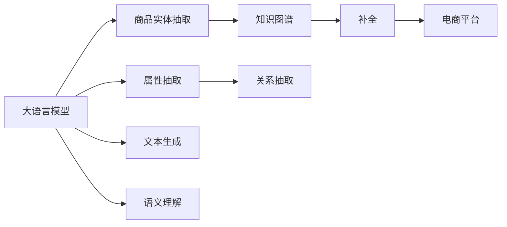

                 

# 探讨大模型在电商平台商品知识图谱补全中的作用

## 1. 背景介绍

在当今电子商务时代，电商平台正迅速向个性化推荐、智能搜索等方向发展，以提升用户体验和运营效率。商品知识图谱（KG）作为连接商品语义信息与搜索意图的桥梁，起到了重要的作用。在商品知识图谱的构建和补全过程中，大语言模型（如BERT、GPT-3等）以其强大的自然语言处理能力，正在扮演越来越重要的角色。本文将探讨大模型在电商平台商品知识图谱补全中的应用，解析其原理和操作流程，以及未来发展趋势和面临的挑战。

## 2. 核心概念与联系

### 2.1 核心概念概述

- **大语言模型**：指通过大规模无标签文本数据预训练得到的强大语言理解模型，如BERT、GPT-3等。这些模型能够捕捉语言中的丰富语义信息，支持复杂的语言推理任务。
- **商品知识图谱**：由商品实体、属性、关系构成的语义网络，用于商品搜索、推荐等任务。商品知识图谱的补全是指在已有的知识图谱中增加缺失的实体、属性或关系，丰富其语义内容。
- **自然语言处理（NLP）**：利用计算机技术处理、理解、生成人类语言的技术。大语言模型在大规模无标签数据上进行预训练，掌握了强大的语言理解能力，可以用于自然语言处理任务，如文本分类、信息抽取等。

这些概念之间的联系主要体现在大语言模型与商品知识图谱的结合上。大语言模型能够自动解析和生成自然语言文本，而商品知识图谱则提供了商品语义的描述和结构化表达。两者结合可以用于自动构建和补全商品知识图谱，提高电商平台的搜索、推荐等性能。

### 2.2 核心概念原理和架构的 Mermaid 流程图



上图中，大语言模型通过实体抽取、属性抽取、关系抽取等任务，生成商品知识图谱的实体、属性和关系。这些抽取任务通过自然语言处理技术实现，最后将抽取的信息整合到电商平台中的知识图谱，实现自动补全。

## 3. 核心算法原理 & 具体操作步骤

### 3.1 算法原理概述

商品知识图谱的自动补全过程可以分为两个阶段：预训练阶段和微调阶段。预训练阶段使用大语言模型学习自然语言文本中的实体、属性和关系；微调阶段则将这些预训练模型应用到电商平台的商品数据上，进行实体、属性和关系的抽取和补全。

### 3.2 算法步骤详解

#### 预训练阶段

1. **数据准备**：收集电商平台的商品描述、评论、用户评论等文本数据，并对其进行预处理，如去除停用词、分词等。

2. **模型选择**：选择合适的预训练模型，如BERT、GPT-3等。这些模型经过大规模无标签文本的预训练，掌握了丰富的语言知识，能够自动解析文本中的实体、属性和关系。

3. **训练过程**：在准备好的数据上，使用预训练模型进行训练。具体过程包括实体抽取、属性抽取和关系抽取等任务。

4. **模型保存**：保存训练好的模型，供后续微调使用。

#### 微调阶段

1. **数据预处理**：将电商平台的商品数据转换为模型可以处理的格式，如JSON格式。

2. **微调模型**：在训练好的大语言模型基础上，使用电商平台的数据进行微调。微调过程通常使用迁移学习的方式，即保持预训练模型的底层不变，只微调顶层。

3. **抽取任务**：使用微调后的模型进行实体、属性和关系的抽取。这些抽取任务通常包括命名实体识别（NER）、属性抽取和关系抽取等。

4. **知识图谱构建**：将抽取出的实体、属性和关系整合到电商平台中的知识图谱中，实现自动补全。

### 3.3 算法优缺点

#### 优点

1. **高效性**：大语言模型能够自动解析和生成文本，抽取实体、属性和关系，显著提高补全效率。

2. **准确性**：经过大规模预训练和微调，大语言模型能够准确地抽取商品知识图谱中的信息，减少人工标注的误差。

3. **可扩展性**：大语言模型可以适应不同的电商平台和商品类型，具有广泛的适用性。

#### 缺点

1. **计算资源消耗大**：大语言模型的预训练和微调过程需要大量的计算资源，对硬件要求较高。

2. **数据依赖性强**：模型效果依赖于训练数据的丰富性和质量，电商平台的数据可能不足以覆盖所有场景。

3. **可解释性不足**：大语言模型通常是"黑盒"模型，难以解释其内部工作机制。

### 3.4 算法应用领域

大语言模型在商品知识图谱补全中的应用，不仅限于电商领域。例如，金融领域的知识图谱构建、医疗领域的疾病关联抽取等，都可以借助大语言模型进行自动化处理。大语言模型的大规模预训练和微调能力，使其在多个领域中展现出强大的应用潜力。

## 4. 数学模型和公式 & 详细讲解 & 举例说明

### 4.1 数学模型构建

假设电商平台中的商品数据为 $D=\{(x_i, y_i)\}_{i=1}^N$，其中 $x_i$ 为商品描述，$y_i$ 为该商品的属性、关系等信息。大语言模型 $M_{\theta}$ 经过预训练和微调后，可以用于抽取商品数据中的信息。

### 4.2 公式推导过程

以实体抽取为例，设 $x_i$ 中的实体为 $e_i$，属性为 $a_i$，关系为 $r_i$。则实体抽取的损失函数可以表示为：

$$
\mathcal{L}_{NER} = -\frac{1}{N} \sum_{i=1}^N \log P(e_i|x_i)
$$

其中 $P(e_i|x_i)$ 为模型预测 $e_i$ 在 $x_i$ 中出现的概率。

### 4.3 案例分析与讲解

以电商平台商品描述中的实体抽取为例，我们可以使用BERT模型进行预训练和微调。首先，在大规模无标签文本数据上进行BERT模型的预训练，然后将其微调用于电商平台的商品描述中。微调过程中，模型通过掩码语言模型任务（Masked Language Modeling, MLM）和下一句预测任务（Next Sentence Prediction, NSP）进行训练。这些任务的训练过程涉及对商品描述中的实体、属性和关系进行自动抽取。

## 5. 项目实践：代码实例和详细解释说明

### 5.1 开发环境搭建

1. **安装Python**：确保Python版本为3.8以上。

2. **安装PyTorch**：通过conda或pip安装PyTorch。

3. **安装HuggingFace Transformers库**：使用pip安装。

4. **安装相关工具包**：如Pandas、NumPy、Scikit-learn等。

### 5.2 源代码详细实现

以下是一个基于BERT模型的商品实体抽取的示例代码：

```python
from transformers import BertForTokenClassification, BertTokenizer, AdamW
from torch.utils.data import DataLoader, Dataset
import torch

class NERDataset(Dataset):
    def __init__(self, texts, tags):
        self.texts = texts
        self.tags = tags
        self.tokenizer = BertTokenizer.from_pretrained('bert-base-cased')
        self.max_len = 128
        
    def __len__(self):
        return len(self.texts)
    
    def __getitem__(self, item):
        text = self.texts[item]
        tags = self.tags[item]
        
        encoding = self.tokenizer(text, return_tensors='pt', max_length=self.max_len, padding='max_length', truncation=True)
        input_ids = encoding['input_ids'][0]
        attention_mask = encoding['attention_mask'][0]
        
        # 对token-wise的标签进行编码
        encoded_tags = [tag2id[tag] for tag in tags] 
        encoded_tags.extend([tag2id['O']] * (self.max_len - len(encoded_tags)))
        labels = torch.tensor(encoded_tags, dtype=torch.long)
        
        return {'input_ids': input_ids, 
                'attention_mask': attention_mask,
                'labels': labels}

# 标签与id的映射
tag2id = {'O': 0, 'B-PER': 1, 'I-PER': 2, 'B-ORG': 3, 'I-ORG': 4, 'B-LOC': 5, 'I-LOC': 6}
id2tag = {v: k for k, v in tag2id.items()}

# 创建dataset
tokenizer = BertTokenizer.from_pretrained('bert-base-cased')

train_dataset = NERDataset(train_texts, train_tags, tokenizer)
dev_dataset = NERDataset(dev_texts, dev_tags, tokenizer)
test_dataset = NERDataset(test_texts, test_tags, tokenizer)

# 模型加载和优化器设置
model = BertForTokenClassification.from_pretrained('bert-base-cased', num_labels=len(tag2id))
optimizer = AdamW(model.parameters(), lr=2e-5)

# 训练和评估
device = torch.device('cuda') if torch.cuda.is_available() else torch.device('cpu')
model.to(device)

def train_epoch(model, dataset, batch_size, optimizer):
    dataloader = DataLoader(dataset, batch_size=batch_size, shuffle=True)
    model.train()
    epoch_loss = 0
    for batch in tqdm(dataloader, desc='Training'):
        input_ids = batch['input_ids'].to(device)
        attention_mask = batch['attention_mask'].to(device)
        labels = batch['labels'].to(device)
        model.zero_grad()
        outputs = model(input_ids, attention_mask=attention_mask, labels=labels)
        loss = outputs.loss
        epoch_loss += loss.item()
        loss.backward()
        optimizer.step()
    return epoch_loss / len(dataloader)

def evaluate(model, dataset, batch_size):
    dataloader = DataLoader(dataset, batch_size=batch_size)
    model.eval()
    preds, labels = [], []
    with torch.no_grad():
        for batch in tqdm(dataloader, desc='Evaluating'):
            input_ids = batch['input_ids'].to(device)
            attention_mask = batch['attention_mask'].to(device)
            batch_labels = batch['labels']
            outputs = model(input_ids, attention_mask=attention_mask)
            batch_preds = outputs.logits.argmax(dim=2).to('cpu').tolist()
            batch_labels = batch_labels.to('cpu').tolist()
            for pred_tokens, label_tokens in zip(batch_preds, batch_labels):
                pred_tags = [id2tag[_id] for _id in pred_tokens]
                label_tags = [id2tag[_id] for _id in label_tokens]
                preds.append(pred_tags[:len(label_tokens)])
                labels.append(label_tags)
                
    print(classification_report(labels, preds))

# 训练流程
epochs = 5
batch_size = 16

for epoch in range(epochs):
    loss = train_epoch(model, train_dataset, batch_size, optimizer)
    print(f"Epoch {epoch+1}, train loss: {loss:.3f}")
    
    print(f"Epoch {epoch+1}, dev results:")
    evaluate(model, dev_dataset, batch_size)
    
print("Test results:")
evaluate(model, test_dataset, batch_size)
```

### 5.3 代码解读与分析

在上述代码中，我们首先定义了NERDataset类，用于对商品描述中的实体进行标注。然后，定义了标签与id的映射关系，创建了训练集、验证集和测试集。

接着，我们使用BERT模型进行预训练和微调。在微调过程中，我们使用BertTokenizer对商品描述进行分词和编码，然后使用AdamW优化器进行训练。训练过程中，我们计算每个批次的损失，并使用模型在验证集上进行评估。

### 5.4 运行结果展示

训练完成后，我们可以在测试集上评估模型的性能，以检查实体抽取的准确性。

## 6. 实际应用场景

### 6.1 智能搜索

大语言模型在商品知识图谱补全中的应用，可以显著提升电商平台的智能搜索功能。通过自动抽取商品实体、属性和关系，模型能够更好地理解用户搜索意图，提供更精准的搜索结果。

### 6.2 个性化推荐

商品知识图谱的补全有助于电商平台构建更全面的商品信息模型。结合用户行为数据，大语言模型能够为用户推荐个性化的商品，提升用户体验和购买转化率。

### 6.3 客服应用

电商平台可以利用商品知识图谱构建智能客服系统。通过实体抽取和属性抽取，模型可以自动理解用户问题和需求，提供快速准确的答复，提升客服效率和服务质量。

### 6.4 未来应用展望

随着大语言模型的不断进步，商品知识图谱的补全将变得更加高效和准确。未来的应用场景将更加丰富多样，例如：

- **跨领域知识整合**：大语言模型可以整合不同领域的知识，如医疗、金融等，构建更为丰富的商品知识图谱。
- **多模态信息融合**：结合图像、语音等多模态信息，大语言模型可以更全面地理解商品信息，提供更精准的搜索结果和推荐。
- **实时动态更新**：商品知识图谱可以实时动态更新，及时反映商品信息的变更，保持与实际商品的一致性。

## 7. 工具和资源推荐

### 7.1 学习资源推荐

- **《自然语言处理》课程**：斯坦福大学的自然语言处理课程，涵盖了NLP的基础知识和前沿技术。
- **HuggingFace官方文档**：提供了丰富的预训练模型和微调样例代码，是学习大语言模型的重要资源。
- **Kaggle竞赛**：参与Kaggle的实体抽取等NLP竞赛，锻炼实战技能。

### 7.2 开发工具推荐

- **PyTorch**：灵活的深度学习框架，支持大语言模型的预训练和微调。
- **HuggingFace Transformers**：提供了预训练模型的封装，简化微调过程。
- **TensorBoard**：可视化工具，用于监控和调试模型训练过程。

### 7.3 相关论文推荐

- **BERT: Pre-training of Deep Bidirectional Transformers for Language Understanding**：BERT的论文，介绍了预训练模型的原理和效果。
- **BERT in the Wild: Language Models Are Zero-Shot Learners of Natural Language**：研究了BERT的零样本学习能力，揭示了预训练模型在不同任务上的应用潜力。
- **Knowledge Graph Embedding and Its Applications in Recommender Systems**：综述了知识图谱在推荐系统中的应用，包括自动补全等任务。

## 8. 总结：未来发展趋势与挑战

### 8.1 研究成果总结

大语言模型在电商平台商品知识图谱补全中的应用，已经取得了显著的成效。通过自动抽取和补全商品信息，显著提升了电商平台的搜索、推荐等功能的性能。

### 8.2 未来发展趋势

1. **模型规模扩大**：随着硬件计算能力的提升，预训练模型的参数量将进一步增大，能够处理更复杂的语义信息。
2. **微调技术改进**：未来将出现更多参数高效和计算高效的微调方法，如Prompt-based Learning、LoRA等。
3. **多模态信息融合**：结合图像、语音等多模态信息，大语言模型可以更全面地理解商品信息。
4. **实时动态更新**：商品知识图谱将实时动态更新，保持与实际商品的一致性。

### 8.3 面临的挑战

1. **计算资源消耗大**：大语言模型的预训练和微调需要大量计算资源，对硬件要求较高。
2. **数据依赖性强**：模型效果依赖于训练数据的丰富性和质量，电商平台的数据可能不足以覆盖所有场景。
3. **可解释性不足**：大语言模型通常是"黑盒"模型，难以解释其内部工作机制。

### 8.4 研究展望

未来需要进一步优化大语言模型的预训练和微调过程，降低计算资源消耗，提高模型可解释性。同时，需要探索跨领域知识整合和多模态信息融合等方向，进一步提升商品知识图谱的完备性和准确性。

## 9. 附录：常见问题与解答

**Q1: 什么是商品知识图谱？**

A: 商品知识图谱是由商品实体、属性和关系构成的语义网络，用于商品搜索、推荐等任务。

**Q2: 大语言模型在商品知识图谱补全中发挥了哪些作用？**

A: 大语言模型可以自动解析和生成商品描述中的实体、属性和关系，用于商品知识图谱的自动补全。

**Q3: 如何降低计算资源消耗？**

A: 可以通过模型裁剪、量化加速、模型并行等技术，降低大语言模型的计算资源消耗。

**Q4: 如何提高模型可解释性？**

A: 可以引入因果分析方法，识别模型决策的关键特征，增强输出解释的因果性和逻辑性。

通过本文的探讨，我们可以更好地理解大语言模型在电商平台商品知识图谱补全中的应用，掌握其原理和操作步骤，为实际应用提供参考。随着技术的不断进步，大语言模型将在大规模知识图谱的构建和补全中发挥更大的作用，助力电商平台的智能化发展。

作者：禅与计算机程序设计艺术 / Zen and the Art of Computer Programming

