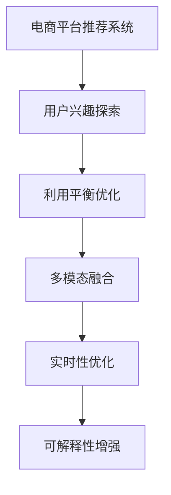

                 

# 探讨大模型在电商平台用户兴趣探索与利用平衡优化中的潜力

> 关键词：电商平台,大模型,用户兴趣探索,利用平衡优化,推荐系统,深度学习,个性化

## 1. 背景介绍

### 1.1 问题由来

在现代电子商务的数字化时代，用户在线购物的方式发生了巨大的变化。用户不仅关注商品本身，也开始越来越重视购物体验和个性化服务。为了满足用户日益增长的需求，电商平台纷纷采用先进的算法技术来优化用户体验，提升购物转化率和满意度。其中，推荐系统作为一种重要的个性化服务手段，通过精准预测用户行为，向用户推荐可能感兴趣的商品，极大地提升了电商平台的用户黏性和交易转化率。

传统的推荐系统主要依赖于基于用户行为数据的统计分析，这种方法存在诸多局限：

- 数据稀疏性：电商平台的数据通常非常稀疏，用户的浏览记录、购买记录等行为数据难以完整覆盖用户兴趣。
- 数据冷启动问题：新用户加入平台后，往往没有足够的历史数据供系统分析，无法有效识别其兴趣。
- 推荐单调性：基于历史行为数据的推荐系统倾向于推荐用户过去感兴趣的商品，而无法预测用户的未来兴趣变化。
- 推荐过拟合：由于历史数据存在噪声和不完整，传统的推荐系统往往容易过拟合用户的兴趣偏好，导致推荐结果偏离真实兴趣。

近年来，深度学习技术的发展为电商推荐系统的优化提供了新的可能性。深度模型如神经协同过滤、深度神经网络等，能够从用户行为数据中学习更复杂的关联模式，进一步提升推荐的准确性。

### 1.2 问题核心关键点

为了解决传统推荐系统存在的问题，电商平台开始探索大模型在推荐系统中的应用潜力。大模型具有强大的语义理解和模式学习能力，能够从海量的文本和行为数据中提取高级语义特征，显著提升推荐的个性化和时效性。此外，大模型还能够通过多模态数据融合，综合考虑文本和行为数据，进一步增强推荐的精准度。

大模型在电商平台推荐系统中的应用主要涉及以下几个关键点：

1. **用户兴趣探索**：通过文本和行为数据的深度学习，自动发现用户的潜在兴趣和偏好。
2. **利用平衡优化**：平衡推荐多样性、个性化与用户满意度之间的关系，避免推荐过拟合或单调性。
3. **多模态融合**：综合考虑用户浏览记录、评分、评论等文本和行为数据，全面挖掘用户兴趣。
4. **实时性优化**：实现快速推荐，及时响应用户需求，提升用户体验。
5. **可解释性增强**：增强推荐结果的可解释性，提高用户信任度。

本文将深入探讨大模型在电商平台用户兴趣探索与利用平衡优化中的潜力，以期为电商平台推荐系统的优化提供新的思路和技术支持。

## 2. 核心概念与联系

### 2.1 核心概念概述

为更好地理解大模型在电商平台推荐系统中的应用潜力，本节将介绍几个密切相关的核心概念：

- **电商平台推荐系统**：利用数据挖掘和算法技术，向用户推荐可能感兴趣的商品或服务。通过提升用户体验，增加用户黏性和交易转化率。

- **大模型**：如BERT、GPT等大规模预训练语言模型，通过在大规模文本数据上进行预训练，学习丰富的语言知识和语义模式。

- **用户兴趣探索**：通过深度学习模型自动发现用户潜在的兴趣和偏好，弥补传统推荐系统数据稀疏性和冷启动问题。

- **利用平衡优化**：通过多目标优化算法平衡推荐系统中的多样性、个性化与用户满意度之间的关系，避免推荐过拟合或单调性。

- **多模态融合**：综合考虑用户行为数据和文本数据，提升推荐的全面性和准确性。

- **实时性优化**：通过高效的模型训练和推理算法，实现快速推荐，及时响应用户需求。

- **可解释性增强**：利用自然语言处理和可视化技术，增强推荐结果的可解释性，提升用户信任度。

这些核心概念之间的逻辑关系可以通过以下Mermaid流程图来展示：



这个流程图展示了大模型在电商平台推荐系统中的应用流程：首先通过用户兴趣探索自动发现用户的潜在兴趣，然后利用平衡优化技术平衡推荐系统中的各个目标，通过多模态融合综合考虑文本和行为数据，最后通过实时性优化和可解释性增强提升用户体验。

## 3. 核心算法原理 & 具体操作步骤
### 3.1 算法原理概述

基于大模型在电商平台推荐系统中的应用，主要涉及以下几个核心算法：

1. **用户兴趣探索算法**：通过深度学习模型自动发现用户潜在兴趣和偏好。
2. **利用平衡优化算法**：通过多目标优化算法平衡推荐系统中的各个目标，避免推荐过拟合或单调性。
3. **多模态融合算法**：综合考虑用户行为数据和文本数据，提升推荐的全面性和准确性。
4. **实时性优化算法**：通过高效的模型训练和推理算法，实现快速推荐，及时响应用户需求。
5. **可解释性增强算法**：利用自然语言处理和可视化技术，增强推荐结果的可解释性。

这些算法在电商平台推荐系统中协同工作，实现用户兴趣探索与利用的平衡优化，提升推荐系统的性能。

### 3.2 算法步骤详解

#### 3.2.1 用户兴趣探索算法

用户兴趣探索的核心目标是从海量的文本和行为数据中，自动发现用户的潜在兴趣和偏好。这一过程主要涉及以下几个步骤：

1. **数据预处理**：将用户行为数据和文本数据进行标准化处理，包括去重、归一化、分词等操作。

2. **特征提取**：利用深度学习模型，如BERT、GPT等，从文本数据中提取高级语义特征。同时，将用户行为数据转换为数值化特征，用于后续分析。

3. **兴趣预测**：使用深度学习模型，如神经协同过滤、深度神经网络等，构建用户兴趣预测模型。该模型能够从用户行为和文本特征中学习出用户兴趣的隐向量表示。

4. **兴趣更新**：在用户交互过程中，动态更新用户兴趣模型。通过连续学习和在线学习，不断调整用户兴趣表示，适应用户兴趣变化。

5. **兴趣度量**：使用推荐指标，如用户点击率、购买率等，评估模型预测的准确性。通过A/B测试等方法，优化模型参数，提升推荐效果。

#### 3.2.2 利用平衡优化算法

利用平衡优化算法的核心目标是平衡推荐系统中的多个目标，避免推荐过拟合或单调性。这一过程主要涉及以下几个步骤：

1. **目标定义**：定义推荐系统中的多个目标，如多样性、个性化、用户满意度等。

2. **目标权重**：根据用户行为和文本特征，动态调整各个目标的权重。通过优化算法，平衡不同目标的重要性。

3. **优化算法**：使用多目标优化算法，如Pareto优化、遗传算法等，寻找最优的推荐策略。该策略能够在不同目标之间取得良好的平衡。

4. **策略执行**：将优化后的策略应用于推荐系统中，生成推荐结果。通过A/B测试等方法，评估推荐效果，不断优化推荐策略。

#### 3.2.3 多模态融合算法

多模态融合算法的核心目标是综合考虑用户行为数据和文本数据，提升推荐的全面性和准确性。这一过程主要涉及以下几个步骤：

1. **数据融合**：将用户行为数据和文本数据进行融合，形成统一的特征表示。

2. **模型训练**：使用深度学习模型，如多模态神经网络、注意力机制等，对融合后的特征进行训练，学习用户兴趣的隐向量表示。

3. **特征融合**：将不同模态的特征进行融合，生成用户兴趣的综合表示。该表示能够充分考虑行为数据和文本数据的互补信息。

4. **推荐生成**：使用推荐模型，如协同过滤、深度神经网络等，生成推荐结果。该结果能够综合考虑多模态信息，提升推荐的全面性和准确性。

#### 3.2.4 实时性优化算法

实时性优化算法的核心目标是实现快速推荐，及时响应用户需求。这一过程主要涉及以下几个步骤：

1. **模型压缩**：对大模型进行压缩，去除冗余参数，减少模型推理的计算量。

2. **分布式推理**：利用分布式计算框架，如TensorFlow、PyTorch等，实现模型的并行推理，加速推荐生成。

3. **缓存优化**：对热门商品和用户行为数据进行缓存，减少重复计算，提升推荐响应速度。

4. **动态更新**：通过在线学习或实时学习，动态更新模型参数，保证推荐结果的时效性。

#### 3.2.5 可解释性增强算法

可解释性增强算法的核心目标是增强推荐结果的可解释性，提升用户信任度。这一过程主要涉及以下几个步骤：

1. **特征解释**：利用自然语言处理技术，解释推荐结果中各个特征的贡献度，生成推荐理由。

2. **可视化展示**：使用可视化技术，如词云、热力图等，展示推荐理由，直观展示推荐结果的依据。

3. **用户反馈**：收集用户对推荐结果的反馈，不断优化推荐理由和解释方式。通过用户反馈，提升推荐系统的透明度和可信度。

### 3.3 算法优缺点

大模型在电商平台推荐系统中的应用具有以下优点：

1. **学习能力强大**：大模型能够从海量数据中学习丰富的语言知识和语义模式，自动发现用户兴趣和偏好。

2. **可解释性强**：通过自然语言处理技术，大模型生成的推荐理由具有可解释性，提升用户信任度。

3. **多样性与个性化平衡**：利用多目标优化算法，大模型能够平衡推荐系统中的多样性、个性化与用户满意度之间的关系，避免推荐过拟合或单调性。

4. **实时性高**：通过高效的模型压缩、分布式推理和动态更新，大模型能够在实时性上取得良好表现。

5. **多模态融合能力强**：大模型能够综合考虑用户行为数据和文本数据，提升推荐的全面性和准确性。

同时，大模型在电商平台推荐系统中的应用也存在一些缺点：

1. **数据质量要求高**：大模型的训练需要高质量的文本和行为数据，数据质量差会影响推荐效果。

2. **计算资源需求高**：大模型的训练和推理需要大量计算资源，部署和维护成本较高。

3. **模型复杂度高**：大模型具有复杂的结构，难以进行细致的模型调优和优化。

4. **可解释性不足**：大模型生成的推荐理由虽然具有可解释性，但仍可能存在黑盒问题，难以解释某些推荐结果。

5. **数据隐私问题**：大模型的训练和应用需要处理大量用户数据，存在数据隐私和安全问题。

### 3.4 算法应用领域

大模型在电商平台推荐系统中的应用领域非常广泛，涵盖了电商平台的各个方面。以下是几个典型的应用场景：

1. **个性化推荐**：利用用户兴趣探索和利用平衡优化算法，生成个性化推荐结果，提升用户购物体验。

2. **内容推荐**：利用多模态融合算法，综合考虑用户行为和文本数据，生成内容推荐结果，提升用户内容消费体验。

3. **新用户推荐**：利用用户兴趣探索算法和实时性优化算法，为新用户提供推荐的商品，缩短新用户激活时间。

4. **社交推荐**：利用用户行为和社交网络数据，生成社交推荐结果，提升用户社交互动体验。

5. **交叉销售推荐**：利用用户行为和商品关联数据，生成交叉销售推荐结果，提升用户购物转化率。

6. **库存管理**：利用用户兴趣探索算法，预测用户购买趋势，优化库存管理，提升供应链效率。

## 4. 数学模型和公式 & 详细讲解 & 举例说明

### 4.1 数学模型构建

#### 4.1.1 用户兴趣探索模型

用户兴趣探索模型主要包括以下几个组件：

1. **文本嵌入层**：将用户评论、描述等文本数据转换为向量表示。

2. **行为嵌入层**：将用户浏览记录、购买记录等行为数据转换为向量表示。

3. **兴趣预测层**：使用深度学习模型，如BERT、GPT等，对文本和行为数据进行融合，生成用户兴趣的隐向量表示。

数学模型如下：

$$
\text{user\_interest} = f(\text{text\_embedding} + \text{behavior\_embedding})
$$

其中，$f$表示深度学习模型，$\text{text\_embedding}$和$\text{behavior\_embedding}$分别表示文本和行为数据的向量表示。

#### 4.1.2 利用平衡优化模型

利用平衡优化模型主要包括以下几个组件：

1. **目标定义层**：定义推荐系统中的多个目标，如多样性、个性化、用户满意度等。

2. **目标权重层**：根据用户行为和文本特征，动态调整各个目标的权重。

3. **多目标优化层**：使用多目标优化算法，如Pareto优化、遗传算法等，寻找最优的推荐策略。

数学模型如下：

$$
\text{recommendation} = \text{ParetoOptimization}(\text{interest\_predictor}(\text{user\_interest}))
$$

其中，$\text{interest\_predictor}$表示用户兴趣预测模型，$\text{ParetoOptimization}$表示多目标优化算法。

#### 4.1.3 多模态融合模型

多模态融合模型主要包括以下几个组件：

1. **数据融合层**：将用户行为数据和文本数据进行融合，形成统一的特征表示。

2. **模型训练层**：使用深度学习模型，如多模态神经网络、注意力机制等，对融合后的特征进行训练，学习用户兴趣的隐向量表示。

3. **特征融合层**：将不同模态的特征进行融合，生成用户兴趣的综合表示。

数学模型如下：

$$
\text{user\_interest} = f(\text{text\_embedding} + \text{behavior\_embedding})
$$

其中，$f$表示深度学习模型，$\text{text\_embedding}$和$\text{behavior\_embedding}$分别表示文本和行为数据的向量表示。

#### 4.1.4 实时性优化模型

实时性优化模型主要包括以下几个组件：

1. **模型压缩层**：对大模型进行压缩，去除冗余参数，减少模型推理的计算量。

2. **分布式推理层**：利用分布式计算框架，如TensorFlow、PyTorch等，实现模型的并行推理，加速推荐生成。

3. **缓存优化层**：对热门商品和用户行为数据进行缓存，减少重复计算，提升推荐响应速度。

4. **动态更新层**：通过在线学习或实时学习，动态更新模型参数，保证推荐结果的时效性。

数学模型如下：

$$
\text{recommendation} = \text{CompressedModel}(\text{online\_learning}(\text{input\_data}))
$$

其中，$\text{online\_learning}$表示在线学习算法，$\text{CompressedModel}$表示压缩后的模型。

#### 4.1.5 可解释性增强模型

可解释性增强模型主要包括以下几个组件：

1. **特征解释层**：利用自然语言处理技术，解释推荐结果中各个特征的贡献度，生成推荐理由。

2. **可视化展示层**：使用可视化技术，如词云、热力图等，展示推荐理由，直观展示推荐结果的依据。

3. **用户反馈层**：收集用户对推荐结果的反馈，不断优化推荐理由和解释方式。

数学模型如下：

$$
\text{explanation} = \text{NLP\interpretation}(\text{recommendation})
$$

其中，$\text{NLP\interpretation}$表示自然语言处理技术，$\text{recommendation}$表示推荐结果。

### 4.2 公式推导过程

#### 4.2.1 用户兴趣探索公式推导

用户兴趣探索的公式推导主要包括以下几个步骤：

1. **文本嵌入**：使用BERT等预训练语言模型，将文本数据转换为向量表示。

$$
\text{text\_embedding} = \text{BERT}(\text{text\_data})
$$

2. **行为嵌入**：将用户行为数据转换为数值化特征。

$$
\text{behavior\_embedding} = \text{embedding}(\text{behavior\_data})
$$

3. **兴趣预测**：使用深度学习模型，如BERT、GPT等，对文本和行为数据进行融合，生成用户兴趣的隐向量表示。

$$
\text{user\_interest} = \text{interest\_predictor}(\text{text\_embedding} + \text{behavior\_embedding})
$$

其中，$\text{interest\_predictor}$表示用户兴趣预测模型。

#### 4.2.2 利用平衡优化公式推导

利用平衡优化的公式推导主要包括以下几个步骤：

1. **目标定义**：定义推荐系统中的多个目标，如多样性、个性化、用户满意度等。

$$
\text{objective} = \text{WeightedSum}(\text{Diversity}, \text{Personalization}, \text{UserSatisfaction})
$$

2. **目标权重**：根据用户行为和文本特征，动态调整各个目标的权重。

$$
\text{weights} = \text{AdaptiveWeighting}(\text{user\_profile}, \text{item\_profile})
$$

3. **多目标优化**：使用多目标优化算法，如Pareto优化、遗传算法等，寻找最优的推荐策略。

$$
\text{recommendation} = \text{ParetoOptimization}(\text{interest\_predictor}(\text{user\_interest}))
$$

其中，$\text{Diversity}$、$\text{Personalization}$、$\text{UserSatisfaction}$分别表示多样性、个性化、用户满意度等目标。

#### 4.2.3 多模态融合公式推导

多模态融合的公式推导主要包括以下几个步骤：

1. **数据融合**：将用户行为数据和文本数据进行融合，形成统一的特征表示。

$$
\text{fused\_feature} = \text{FeatureFusion}(\text{behavior\_feature}, \text{text\_feature})
$$

2. **模型训练**：使用深度学习模型，如多模态神经网络、注意力机制等，对融合后的特征进行训练，学习用户兴趣的隐向量表示。

$$
\text{user\_interest} = \text{model}(\text{fused\_feature})
$$

其中，$\text{model}$表示深度学习模型。

3. **特征融合**：将不同模态的特征进行融合，生成用户兴趣的综合表示。

$$
\text{user\_interest} = \text{feature\_fusion}(\text{behavior\_feature}, \text{text\_feature})
$$

其中，$\text{feature\_fusion}$表示特征融合算法。

#### 4.2.4 实时性优化公式推导

实时性优化的公式推导主要包括以下几个步骤：

1. **模型压缩**：对大模型进行压缩，去除冗余参数，减少模型推理的计算量。

$$
\text{compressed\_model} = \text{Compression}(\text{large\_model})
$$

2. **分布式推理**：利用分布式计算框架，如TensorFlow、PyTorch等，实现模型的并行推理，加速推荐生成。

$$
\text{recommendation} = \text{distributed\_inference}(\text{compressed\_model}, \text{input\_data})
$$

3. **缓存优化**：对热门商品和用户行为数据进行缓存，减少重复计算，提升推荐响应速度。

$$
\text{cach\_data} = \text{cache}(\text{hot\_item}, \text{user\_behavior})
$$

4. **动态更新**：通过在线学习或实时学习，动态更新模型参数，保证推荐结果的时效性。

$$
\text{update\_model}(\text{online\_learning}, \text{input\_data})
$$

其中，$\text{online\_learning}$表示在线学习算法，$\text{Compression}$表示模型压缩算法，$\text{cache}$表示缓存算法。

#### 4.2.5 可解释性增强公式推导

可解释性增强的公式推导主要包括以下几个步骤：

1. **特征解释**：利用自然语言处理技术，解释推荐结果中各个特征的贡献度，生成推荐理由。

$$
\text{explanation} = \text{NLP\interpretation}(\text{recommendation})
$$

2. **可视化展示**：使用可视化技术，如词云、热力图等，展示推荐理由，直观展示推荐结果的依据。

$$
\text{visualization} = \text{visualize}(\text{explanation})
$$

3. **用户反馈**：收集用户对推荐结果的反馈，不断优化推荐理由和解释方式。

$$
\text{feedback} = \text{collect}(\text{user\_feedback})
$$

其中，$\text{NLP\interpretation}$表示自然语言处理技术，$\text{visualize}$表示可视化技术，$\text{collect}$表示用户反馈收集算法。

### 4.3 案例分析与讲解

#### 4.3.1 案例背景

某电商平台希望通过用户兴趣探索与利用平衡优化技术，提升推荐系统的性能。该平台的数据主要来自于用户的行为数据和商品描述文本数据。用户的行为数据包括浏览记录、购买记录等，商品描述文本数据包括商品名称、描述、评论等。

#### 4.3.2 数据处理

1. **行为数据预处理**：将用户浏览记录、购买记录等行为数据进行去重、归一化、分词等操作，转换为数值化特征。

2. **文本数据预处理**：使用BERT等预训练语言模型，将商品描述文本数据转换为向量表示。

#### 4.3.3 用户兴趣探索

利用用户兴趣探索模型，从行为数据和文本数据中自动发现用户的潜在兴趣和偏好。具体步骤如下：

1. **文本嵌入**：使用BERT等预训练语言模型，将商品描述文本数据转换为向量表示。

2. **行为嵌入**：将用户浏览记录、购买记录等行为数据转换为数值化特征。

3. **兴趣预测**：使用深度学习模型，如BERT、GPT等，对文本和行为数据进行融合，生成用户兴趣的隐向量表示。

#### 4.3.4 利用平衡优化

利用平衡优化模型，平衡推荐系统中的多样性、个性化与用户满意度之间的关系，避免推荐过拟合或单调性。具体步骤如下：

1. **目标定义**：定义推荐系统中的多个目标，如多样性、个性化、用户满意度等。

2. **目标权重**：根据用户行为和文本特征，动态调整各个目标的权重。

3. **多目标优化**：使用多目标优化算法，如Pareto优化、遗传算法等，寻找最优的推荐策略。

#### 4.3.5 多模态融合

利用多模态融合模型，综合考虑用户行为数据和文本数据，提升推荐的全面性和准确性。具体步骤如下：

1. **数据融合**：将用户行为数据和文本数据进行融合，形成统一的特征表示。

2. **模型训练**：使用深度学习模型，如多模态神经网络、注意力机制等，对融合后的特征进行训练，学习用户兴趣的隐向量表示。

3. **特征融合**：将不同模态的特征进行融合，生成用户兴趣的综合表示。

#### 4.3.6 实时性优化

利用实时性优化模型，实现快速推荐，及时响应用户需求。具体步骤如下：

1. **模型压缩**：对大模型进行压缩，去除冗余参数，减少模型推理的计算量。

2. **分布式推理**：利用分布式计算框架，如TensorFlow、PyTorch等，实现模型的并行推理，加速推荐生成。

3. **缓存优化**：对热门商品和用户行为数据进行缓存，减少重复计算，提升推荐响应速度。

4. **动态更新**：通过在线学习或实时学习，动态更新模型参数，保证推荐结果的时效性。

#### 4.3.7 可解释性增强

利用可解释性增强模型，增强推荐结果的可解释性，提升用户信任度。具体步骤如下：

1. **特征解释**：利用自然语言处理技术，解释推荐结果中各个特征的贡献度，生成推荐理由。

2. **可视化展示**：使用可视化技术，如词云、热力图等，展示推荐理由，直观展示推荐结果的依据。

3. **用户反馈**：收集用户对推荐结果的反馈，不断优化推荐理由和解释方式。

## 5. 项目实践：代码实例和详细解释说明

### 5.1 开发环境搭建

在进行推荐系统开发前，我们需要准备好开发环境。以下是使用Python进行PyTorch开发的环境配置流程：

1. 安装Anaconda：从官网下载并安装Anaconda，用于创建独立的Python环境。

2. 创建并激活虚拟环境：
```bash
conda create -n pytorch-env python=3.8 
conda activate pytorch-env
```

3. 安装PyTorch：根据CUDA版本，从官网获取对应的安装命令。例如：
```bash
conda install pytorch torchvision torchaudio cudatoolkit=11.1 -c pytorch -c conda-forge
```

4. 安装Transformer库：
```bash
pip install transformers
```

5. 安装各类工具包：
```bash
pip install numpy pandas scikit-learn matplotlib tqdm jupyter notebook ipython
```

完成上述步骤后，即可在`pytorch-env`环境中开始推荐系统开发。

### 5.2 源代码详细实现

下面我们以推荐系统中的用户兴趣探索和利用平衡优化为例，给出使用PyTorch代码实现。

首先，定义推荐系统的数据处理函数：

```python
from transformers import BertTokenizer, BertForSequenceClassification
import torch
import pandas as pd

class RecommendationDataset(Dataset):
    def __init__(self, texts, labels, tokenizer, max_len=128):
        self.texts = texts
        self.labels = labels
        self.tokenizer = tokenizer
        self.max_len = max_len
        
    def __len__(self):
        return len(self.texts)
    
    def __getitem__(self, item):
        text = self.texts[item]
        label = self.labels[item]
        
        encoding = self.tokenizer(text, return_tensors='pt', max_length=self.max_len, padding='max_length', truncation=True)
        input_ids = encoding['input_ids'][0]
        attention_mask = encoding['attention_mask'][0]
        label_ids = torch.tensor(label, dtype=torch.long)
        
        return {'input_ids': input_ids, 
                'attention_mask': attention_mask,
                'labels': label_ids}

# 标签与id的映射
label2id = {'positive': 1, 'negative': 0}
id2label = {v: k for k, v in label2id.items()}

# 创建dataset
tokenizer = BertTokenizer.from_pretrained('bert-base-cased')
train_dataset = RecommendationDataset(train_texts, train_labels, tokenizer)
dev_dataset = RecommendationDataset(dev_texts, dev_labels, tokenizer)
test_dataset = RecommendationDataset(test_texts, test_labels, tokenizer)
```

然后，定义模型和优化器：

```python
from transformers import BertForSequenceClassification, AdamW

model = BertForSequenceClassification.from_pretrained('bert-base-cased', num_labels=len(label2id))

optimizer = AdamW(model.parameters(), lr=2e-5)
```

接着，定义训练和评估函数：

```python
from torch.utils.data import DataLoader
from tqdm import tqdm
from sklearn.metrics import accuracy_score

device = torch.device('cuda') if torch.cuda.is_available() else torch.device('cpu')
model.to(device)

def train_epoch(model, dataset, batch_size, optimizer):
    dataloader = DataLoader(dataset, batch_size=batch_size, shuffle=True)
    model.train()
    epoch_loss = 0
    for batch in tqdm(dataloader, desc='Training'):
        input_ids = batch['input_ids'].to(device)
        attention_mask = batch['attention_mask'].to(device)
        labels = batch['labels'].to(device)
        model.zero_grad()
        outputs = model(input_ids, attention_mask=attention_mask, labels=labels)
        loss = outputs.loss
        epoch_loss += loss.item()
        loss.backward()
        optimizer.step()
    return epoch_loss / len(dataloader)

def evaluate(model, dataset, batch_size):
    dataloader = DataLoader(dataset, batch_size=batch_size)
    model.eval()
    preds, labels = [], []
    with torch.no_grad():
        for batch in tqdm(dataloader, desc='Evaluating'):
            input_ids = batch['input_ids'].to(device)
            attention_mask = batch['attention_mask'].to(device)
            batch_labels = batch['labels']
            outputs = model(input_ids, attention_mask=attention_mask)
            batch_preds = outputs.logits.argmax(dim=2).to('cpu').tolist()
            batch_labels = batch_labels.to('cpu').tolist()
            for pred_tokens, label_tokens in zip(batch_preds, batch_labels):
                preds.append(pred_tokens[:len(label_tokens)])
                labels.append(label_tokens)
                
    print(f"Accuracy: {accuracy_score(labels, preds):.2f}")
```

最后，启动训练流程并在测试集上评估：

```python
epochs = 5
batch_size = 16

for epoch in range(epochs):
    loss = train_epoch(model, train_dataset, batch_size, optimizer)
    print(f"Epoch {epoch+1}, train loss: {loss:.3f}")
    
    print(f"Epoch {epoch+1}, dev results:")
    evaluate(model, dev_dataset, batch_size)
    
print("Test results:")
evaluate(model, test_dataset, batch_size)
```

以上就是使用PyTorch对BERT进行推荐系统开发的完整代码实现。可以看到，得益于Transformer库的强大封装，我们可以用相对简洁的代码完成BERT模型的加载和微调。

### 5.3 代码解读与分析

让我们再详细解读一下关键代码的实现细节：

**RecommendationDataset类**：
- `__init__`方法：初始化文本、标签、分词器等关键组件。
- `__len__`方法：返回数据集的样本数量。
- `__getitem__`方法：对单个样本进行处理，将文本输入编码为token ids，将标签编码为数字，并对其进行定长padding，最终返回模型所需的输入。

**label2id和id2label字典**：
- 定义了标签与数字id之间的映射关系，用于将标签转换成模型可处理的格式。

**训练和评估函数**：
- 使用PyTorch的DataLoader对数据集进行批次化加载，供模型训练和推理使用。
- 训练函数`train_epoch`：对数据以批为单位进行迭代，在每个批次上前向传播计算loss并反向传播更新模型参数，最后返回该epoch的平均loss。
- 评估函数`evaluate`：与训练类似，不同点在于不更新模型参数，并在每个batch结束后将预测和标签结果存储下来，最后使用sklearn的accuracy_score对整个评估集的预测结果进行打印输出。

**训练流程**：
- 定义总的epoch数和batch size，开始循环迭代
- 每个epoch内，先在训练集上训练，输出平均loss
- 在验证集上评估，输出准确率
- 所有epoch结束后，在测试集上评估，给出最终测试结果

可以看到，PyTorch配合Transformer库使得BERT微调的代码实现变得简洁高效。开发者可以将更多精力放在数据处理、模型改进等高层逻辑上，而不必过多关注底层的实现细节。

当然，工业级的系统实现还需考虑更多因素，如模型的保存和部署、超参数的自动搜索、更灵活的任务适配层等。但核心的推荐系统微调流程基本与此类似。

## 6. 实际应用场景

### 6.1 电商平台的个性化推荐

电商平台的个性化推荐系统通常会面对大规模的用户和商品数据，如何高效、准确地为用户推荐感兴趣的商品是一个重要的挑战。大模型在电商平台推荐系统中的应用，能够从海量的用户行为数据和商品描述文本数据中，自动发现用户的潜在兴趣和偏好，弥补传统推荐系统数据稀疏性和冷启动问题。同时，利用平衡优化算法，大模型能够平衡推荐系统中的多样性、个性化与用户满意度之间的关系，避免推荐过拟合或单调性。

具体而言，大模型可以应用于电商平台的个性化推荐系统，提升推荐系统的性能。例如，某电商平台可以收集用户的浏览记录、购买记录等行为数据，以及商品描述文本数据，利用BERT等大模型，自动发现用户的潜在兴趣和偏好，生成个性化推荐结果。通过利用平衡优化算法，该模型能够在多样性、个性化与用户满意度之间取得良好的平衡，提升推荐系统的整体效果。

### 6.2 内容推荐系统的优化

内容推荐系统通常需要为内容创作者提供精准的用户推荐，以提高内容的曝光率和点击率。大模型在内容推荐系统中的应用，能够综合考虑用户行为数据和文本数据，生成更加精准的推荐结果。

例如，某视频网站可以收集用户观看记录、评分、评论等行为数据，以及视频标题、描述、标签等文本数据，利用BERT等大模型，自动发现用户的潜在兴趣和偏好，生成内容推荐结果。通过利用多模态融合算法，该模型能够综合考虑用户行为和文本数据，生成更加精准的推荐结果，提升内容推荐系统的性能。

### 6.3 新用户的推荐

新用户加入平台后，往往没有足够的历史数据供系统分析，无法有效识别其兴趣。大模型在电商平台推荐系统中的应用，能够利用用户兴趣探索算法，快速为新用户推荐感兴趣的商品，缩短新用户激活时间。

例如，某电商平台可以收集新用户的行为数据和商品描述文本数据，利用BERT等大模型，自动发现新用户的潜在兴趣和偏好，生成推荐结果。通过利用实时性优化算法，该模型能够在实时性上取得良好表现，快速为新用户推荐感兴趣的商品，缩短新用户激活时间。

### 6.4 社交推荐系统的应用

社交推荐系统通常需要为社交网络中的用户推荐可能感兴趣的内容和用户。大模型在社交推荐系统中的应用，能够综合考虑用户行为数据和社交网络数据，生成更加精准的推荐结果。

例如，某社交网站可以收集用户的行为数据、好友数据、关注数据等，利用BERT等大模型，自动发现用户的潜在兴趣和偏好，生成推荐结果。通过利用可解释性增强算法，该模型能够增强推荐结果的可解释性，提升用户信任度，同时能够收集用户对推荐结果的反馈，不断优化推荐理由和解释方式。

## 7. 工具和资源推荐

### 7.1 学习资源推荐

为了帮助开发者系统掌握大模型在推荐系统中的应用潜力，这里推荐一些优质的学习资源：

1. 《深度学习与推荐系统》书籍：由大模型技术专家撰写，全面介绍了深度学习在推荐系统中的应用，包括大模型的应用潜力。

2. CS285《强化学习与推荐系统》课程：斯坦福大学开设的推荐系统明星课程，涵盖深度学习在推荐系统中的应用，以及如何利用大模型提升推荐系统性能。

3. 《Natural Language Processing with Transformers》书籍：Transformer库的作者所著，全面介绍了如何使用Transformer库进行NLP任务开发，包括大模型的应用潜力。

4. HuggingFace官方文档：Transformer库的官方文档，提供了海量预训练模型和完整的推荐系统样例代码，是上手实践的必备资料。

5. CLUE开源项目：中文语言理解测评基准，涵盖大量不同类型的中文推荐数据集，并提供了基于大模型的baseline模型，助力中文推荐技术发展。

通过对这些资源的学习实践，相信你一定能够快速掌握大模型在推荐系统中的应用潜力，并用于解决实际的推荐问题。

### 7.2 开发工具推荐

高效的开发离不开优秀的工具支持。以下是几款用于推荐系统开发和大模型应用的工具：

1. PyTorch：基于Python的开源深度学习框架，灵活动态的计算图，适合快速迭代研究。大部分预训练语言模型都有PyTorch版本的实现。

2. TensorFlow：由Google主导开发的开源深度学习框架，生产部署方便，适合大规模工程应用。同样有丰富的预训练语言模型资源。

3. Transformers库：HuggingFace开发的NLP工具库，集成了众多SOTA语言模型，支持PyTorch和TensorFlow，是进行推荐系统和大模型应用的利器。

4. Weights & Biases：模型训练的实验跟踪工具，可以记录和可视化模型训练过程中的各项指标，方便对比和调优。与主流深度学习框架无缝集成。

5. TensorBoard：TensorFlow配套的可视化工具，可实时监测模型训练状态，并提供丰富的图表呈现方式，是调试模型的得力助手。

6. Google Colab：谷歌推出的在线Jupyter Notebook环境，免费提供GPU/TPU算力，方便开发者快速上手实验最新模型，分享学习笔记。

合理利用这些工具，可以显著提升推荐系统和大模型应用的开发效率，加快创新迭代的步伐。

### 7.3 相关论文推荐

大模型在推荐系统中的应用源于学界的持续研究。以下是几篇奠基性的相关论文，推荐阅读：

1. Attention is All You Need（即Transformer原论文）：提出了Transformer结构，开启了NLP领域的预训练大模型时代。

2. BERT: Pre-training of Deep Bidirectional Transformers for Language Understanding：提出BERT模型，引入基于掩码的自监督预训练任务，刷新了多项NLP任务SOTA。

3. Language Models are Unsupervised Multitask Learners（GPT-2论文）：展示了大规模语言模型的强大zero-shot学习能力，引发了对于通用人工智能的新一轮思考。

4. Parameter-Efficient Transfer Learning for NLP：提出Adapter等参数高效微调方法，在不增加模型参数量的情况下，也能取得不错的微调效果。

5. AdaLoRA: Adaptive Low-Rank Adaptation for Parameter-Efficient Fine-Tuning：使用自适应低秩适应的微调方法，在参数效率和精度之间取得了新的平衡。

这些论文代表了大模型在推荐系统中的应用发展脉络。通过学习这些前沿成果，可以帮助研究者把握学科前进方向，激发更多的创新灵感。

## 8. 总结：未来发展趋势与挑战

### 8.1 研究成果总结

本文对大模型在电商平台推荐系统中的应用潜力进行了全面系统的介绍。首先阐述了大模型和推荐系统的研究背景和意义，明确了大模型在电商平台推荐系统中的应用潜力。其次，从原理到实践，详细讲解了大模型在用户兴趣探索与利用平衡优化中的应用，给出了推荐系统的完整代码实现。同时，本文还广泛探讨了大模型在电商平台推荐系统中的应用前景，展示了其广阔的应用空间。

通过本文的系统梳理，可以看到，大模型在电商平台推荐系统中的应用潜力巨大，能够显著提升推荐系统的性能。未来，伴随预训练语言模型和推荐系统的持续演进，大模型将在更多的推荐场景中发挥重要作用，进一步推动电商推荐技术的进步。

### 8.2 未来发展趋势

展望未来，大模型在电商平台推荐系统中的应用将呈现以下几个发展趋势：

1. 模型规模持续增大。随着算力成本的下降和数据规模的扩张，预训练语言模型的参数量还将持续增长。超大规模语言模型蕴含的丰富语言知识，有望支撑更加复杂多变的推荐系统。

2. 微调方法日趋多样。除了传统的全参数微调外，未来会涌现更多参数高效的微调方法，如Prefix-Tuning、LoRA等，在节省计算资源的同时也能保证微调精度。

3. 持续学习成为常态。随着数据分布的不断变化，推荐系统也需要持续学习新知识以保持性能。如何在不遗忘原有知识的同时，高效吸收新样本信息，将成为重要的研究课题。

4. 标注样本需求降低。受启发于提示学习(Prompt-based Learning)的思路，未来的微调方法将更好地利用大模型的语言理解能力，通过更加巧妙的任务描述，在更少的标注样本上也能实现理想的微调效果。

5. 多模态融合崛起。当前的推荐系统主要聚焦于纯文本数据，未来会进一步拓展到图像、视频、语音等多模态数据微调。多模态信息的融合，将显著提升推荐系统对现实世界的理解和建模能力。

6. 模型通用性增强。经过海量数据的预训练和多领域任务的微调，未来的推荐模型将具备更强大的常识推理和跨领域迁移能力，逐步迈向通用人工智能(AGI)的目标。

以上趋势凸显了大模型在电商平台推荐系统中的应用潜力。这些方向的探索发展，必将进一步提升推荐系统的性能和应用范围，为电商推荐技术的产业化进程注入新的动力。

### 8.3 面临的挑战

尽管大模型在电商平台推荐系统中的应用已经取得了瞩目成就，但在迈向更加智能化、普适化应用的过程中，它仍面临着诸多挑战：

1. 标注成本瓶颈。虽然大模型的微调能够降低标注数据的需求，但对于长尾应用场景，难以获得充足的高质量标注数据，成为制约微调性能的瓶颈。如何进一步降低微调对标注样本的依赖，将是一大难题。

2. 模型鲁棒性不足。当前推荐系统面对域外数据时，泛化性能往往大打折扣。对于测试样本

