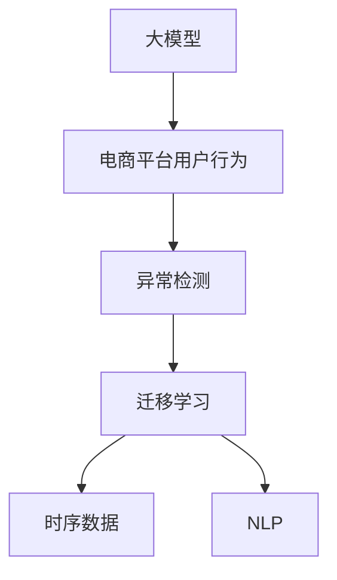

                 

# 探讨大模型在电商平台用户行为异常检测中的潜力

> 关键词：大模型, 电商平台, 用户行为分析, 异常检测, 自然语言处理(NLP), 时序数据, 迁移学习

## 1. 背景介绍

### 1.1 问题由来
电商平台是现代商业活动中不可或缺的重要组成部分，其用户行为分析对于商家制定营销策略、优化用户体验、提升销售转化率等有着重要作用。然而，用户在电商平台上的行为数据通常呈现出高度的复杂性和多样性，尤其是异常行为数据往往容易被忽视或误解，影响决策的准确性和及时性。

### 1.2 问题核心关键点
大模型作为深度学习领域的最新进展，以其强大的数据处理能力和泛化能力，在电商平台用户行为异常检测中展现出了巨大的潜力。具体来说，大模型能够利用其预训练的知识，对复杂的用户行为数据进行深入分析和理解，识别出异常行为模式，从而为电商平台带来更大的商业价值。

### 1.3 问题研究意义
电商平台用户行为异常检测对于提升平台运营效率、减少欺诈行为、保护用户隐私、优化用户体验等都有着重要意义。通过使用大模型，电商平台可以实现更高精度和实时性的用户行为分析，迅速响应异常行为，保障用户和平台的利益。

## 2. 核心概念与联系

### 2.1 核心概念概述

为更好地理解大模型在电商平台用户行为异常检测中的应用，本节将介绍几个核心概念：

- **大模型**：以自回归（如GPT）或自编码（如BERT）模型为代表的大规模预训练语言模型。通过在大规模无标签文本语料上进行预训练，学习通用的语言表示，具备强大的语言理解和生成能力。

- **电商平台用户行为**：用户在电商平台上的各种交互行为，包括浏览、购买、评价、投诉等。这些行为数据通常包含大量自然语言文本信息，是异常检测的重要数据源。

- **异常检测**：通过数据挖掘和机器学习算法，识别出数据中的异常行为，帮助电商平台及时发现问题并采取应对措施。

- **迁移学习**：将预训练模型应用于特定任务的一种学习方式。大模型在预训练过程中学习到的知识可以被迁移到新任务上，提升模型在新数据上的性能。

- **时序数据**：电商平台用户行为数据通常具有时序性，反映用户在特定时间内的连续行为。大模型可以更好地捕捉和利用这种时间上的连续性和变化性。

- **自然语言处理(NLP)**：处理和分析自然语言的算法和技术，大模型在NLP领域的应用可以提升用户行为分析的准确性和全面性。

这些核心概念之间的逻辑关系可以通过以下Mermaid流程图来展示：



这个流程图展示了大模型在电商平台用户行为异常检测中的核心概念及其之间的关系：

1. 大模型通过预训练获得基础能力。
2. 电商平台用户行为数据通过大模型进行特征提取。
3. 异常检测技术对提取出的特征进行分析和模式识别。
4. 大模型可以在迁移学习框架下应用于特定的异常检测任务。
5. 时序数据和大模型的结合可以更好地捕捉用户行为的时间连续性和变化性。
6. NLP技术在大模型中的应用可以提升用户行为分析的准确性和全面性。

## 3. 核心算法原理 & 具体操作步骤

### 3.1 算法原理概述

大模型在电商平台用户行为异常检测中的核心原理可以概括为：利用预训练语言模型的强大表征能力，对用户行为数据进行特征提取和模式识别，从而发现异常行为。具体来说，该过程包括以下几个关键步骤：

1. 预训练语言模型对用户行为文本数据进行编码，生成高维语义表示。
2. 基于这些语义表示，利用时序数据建模技术，捕捉用户行为的时间连续性和变化性。
3. 通过迁移学习技术，将预训练模型适应到具体的异常检测任务上。
4. 利用NLP技术对行为文本进行进一步的分析，提升异常检测的准确性和全面性。

### 3.2 算法步骤详解

基于大模型的电商平台用户行为异常检测主要包括以下几个关键步骤：

**Step 1: 数据收集与预处理**
- 收集电商平台用户行为数据，包括点击、浏览、购买、评价、投诉等行为数据，以及行为发生的时间戳。
- 对数据进行清洗、去重、标注异常行为等预处理操作。

**Step 2: 特征提取与嵌入**
- 利用大模型对用户行为文本数据进行编码，生成高维语义表示。常用的模型包括BERT、GPT等。
- 利用时序数据建模技术，如RNN、LSTM等，对时间序列行为数据进行建模，捕捉行为的时间连续性和变化性。

**Step 3: 异常检测模型训练**
- 选择合适的异常检测算法，如基于统计的Z-score方法、基于机器学习的聚类和分类方法等。
- 将预训练大模型的语义表示和时序数据进行融合，输入到异常检测模型中，进行训练。

**Step 4: 模型评估与优化**
- 在验证集上对训练好的异常检测模型进行评估，使用准确率、召回率、F1-score等指标进行性能评估。
- 根据评估结果，调整模型参数，优化模型性能。

**Step 5: 实时检测与响应**
- 将训练好的异常检测模型部署到电商平台中，进行实时行为数据的检测。
- 根据检测结果，采取相应的措施，如报警、隔离、联系客服等。

### 3.3 算法优缺点

使用大模型进行电商平台用户行为异常检测具有以下优点：

- 强大的表征能力：大模型能够学习到复杂的语义信息，对用户行为进行全面而深入的分析。
- 泛化能力强：通过迁移学习，大模型可以在不同的电商平台和用户行为场景中保持高性能。
- 适应性强：大模型可以通过微调快速适应新的异常检测任务。

然而，该方法也存在一些局限性：

- 高资源需求：大模型的训练和推理需要较高的计算资源和时间成本。
- 数据隐私问题：在处理用户行为数据时，需要严格保护用户隐私，避免数据泄露。
- 模型解释性不足：大模型的决策过程通常缺乏可解释性，难以理解其内部工作机制。

尽管存在这些局限性，但大模型在电商平台用户行为异常检测中展现出了巨大的应用潜力，未来仍需进一步研究，以解决其资源需求和隐私保护问题。

### 3.4 算法应用领域

大模型在电商平台用户行为异常检测中，可以应用于以下多个领域：

- 欺诈检测：识别恶意购买、虚假评价等行为。
- 用户流失预测：预测即将流失的用户行为，进行预警和挽留。
- 质量监控：检测和反馈用户对商品质量的评价和投诉。
- 用户行为分析：分析用户行为数据，优化用户体验和推荐策略。
- 广告效果评估：评估广告投放效果，优化广告投放策略。

## 4. 数学模型和公式 & 详细讲解 & 举例说明

### 4.1 数学模型构建

在大模型应用于电商平台用户行为异常检测的过程中，需要构建一个包含语义表示和时序信息的数学模型。以下是一个简单的数学模型示例：

设用户行为序列为 $X=\{x_1, x_2, ..., x_t\}$，其中 $x_t$ 表示用户在第 $t$ 时刻的行为数据。大模型对其编码得到语义表示 $h_t=\text{BigModel}(x_t)$。

设用户行为的时序信息为 $T=\{t_1, t_2, ..., t_t\}$，表示行为数据发生的时间戳。利用RNN或LSTM等时序建模技术，对时序数据进行建模，得到时序特征 $s_t=\text{SeqModel}(T)$。

将语义表示 $h_t$ 和时序特征 $s_t$ 融合，得到综合特征表示 $f_t=h_t \cdot s_t$。

最后，使用异常检测算法对综合特征表示 $f_t$ 进行异常检测，得到异常检测结果 $y_t \in \{0,1\}$，其中 $0$ 表示正常行为，$1$ 表示异常行为。

### 4.2 公式推导过程

以下我们以异常检测算法Z-score为例，推导基于大模型的异常检测数学模型。

设用户行为序列的均值为 $\mu$，标准差为 $\sigma$，则Z-score异常检测算法如下：

$$
z_t = \frac{h_t - \mu}{\sigma}
$$

$$
y_t = \mathbb{I}(|z_t| > \tau)
$$

其中，$\mathbb{I}$ 为示性函数，$y_t = 1$ 表示 $z_t$ 的绝对值大于阈值 $\tau$，即行为异常。

将Z-score算法嵌入到大模型的异常检测流程中，得到异常检测模型：

$$
f_t = h_t \cdot s_t
$$

$$
\mu = \frac{1}{N} \sum_{i=1}^N f_i
$$

$$
\sigma = \sqrt{\frac{1}{N} \sum_{i=1}^N (f_i - \mu)^2}
$$

$$
z_t = \frac{f_t - \mu}{\sigma}
$$

$$
y_t = \mathbb{I}(|z_t| > \tau)
$$

### 4.3 案例分析与讲解

以电商平台用户流失预测为例，展示如何使用大模型进行异常检测。

首先，收集用户的历史行为数据，包括浏览、购买、评价等。对数据进行清洗、去重、标注异常行为等预处理操作。

然后，利用BERT等大模型对用户行为文本数据进行编码，生成高维语义表示。同时，利用LSTM等时序建模技术对用户行为时间戳进行建模，捕捉行为的时间连续性和变化性。

最后，将语义表示和时序特征进行融合，使用Z-score算法对融合特征进行异常检测，判断用户是否存在流失风险，并采取相应的预警和挽留措施。

## 5. 项目实践：代码实例和详细解释说明

### 5.1 开发环境搭建

在进行电商平台用户行为异常检测的项目实践前，需要先准备好开发环境。以下是使用Python进行PyTorch开发的环境配置流程：

1. 安装Anaconda：从官网下载并安装Anaconda，用于创建独立的Python环境。

2. 创建并激活虚拟环境：
```bash
conda create -n pytorch-env python=3.8 
conda activate pytorch-env
```

3. 安装PyTorch：根据CUDA版本，从官网获取对应的安装命令。例如：
```bash
conda install pytorch torchvision torchaudio cudatoolkit=11.1 -c pytorch -c conda-forge
```

4. 安装Transformers库：
```bash
pip install transformers
```

5. 安装各类工具包：
```bash
pip install numpy pandas scikit-learn matplotlib tqdm jupyter notebook ipython
```

完成上述步骤后，即可在`pytorch-env`环境中开始项目实践。

### 5.2 源代码详细实现

这里我们以电商平台用户流失预测为例，给出使用Transformers库对BERT模型进行异常检测的PyTorch代码实现。

首先，定义用户行为数据处理函数：

```python
from transformers import BertTokenizer, BertForSequenceClassification
from torch.utils.data import Dataset
import torch

class UserBehaviorDataset(Dataset):
    def __init__(self, user_behaviors, labels, tokenizer, max_len=128):
        self.user_behaviors = user_behaviors
        self.labels = labels
        self.tokenizer = tokenizer
        self.max_len = max_len
        
    def __len__(self):
        return len(self.user_behaviors)
    
    def __getitem__(self, item):
        behavior = self.user_behaviors[item]
        label = self.labels[item]
        
        encoding = self.tokenizer(behavior, return_tensors='pt', max_length=self.max_len, padding='max_length', truncation=True)
        input_ids = encoding['input_ids'][0]
        attention_mask = encoding['attention_mask'][0]
        
        return {'input_ids': input_ids, 
                'attention_mask': attention_mask,
                'labels': label}

# 加载数据集
train_dataset = UserBehaviorDataset(train_user_behaviors, train_labels, tokenizer)
dev_dataset = UserBehaviorDataset(dev_user_behaviors, dev_labels, tokenizer)
test_dataset = UserBehaviorDataset(test_user_behaviors, test_labels, tokenizer)
```

然后，定义模型和优化器：

```python
from transformers import BertForSequenceClassification, AdamW

model = BertForSequenceClassification.from_pretrained('bert-base-cased', num_labels=2)

optimizer = AdamW(model.parameters(), lr=2e-5)
```

接着，定义训练和评估函数：

```python
from torch.utils.data import DataLoader
from tqdm import tqdm
from sklearn.metrics import classification_report

device = torch.device('cuda') if torch.cuda.is_available() else torch.device('cpu')
model.to(device)

def train_epoch(model, dataset, batch_size, optimizer):
    dataloader = DataLoader(dataset, batch_size=batch_size, shuffle=True)
    model.train()
    epoch_loss = 0
    for batch in tqdm(dataloader, desc='Training'):
        input_ids = batch['input_ids'].to(device)
        attention_mask = batch['attention_mask'].to(device)
        labels = batch['labels'].to(device)
        model.zero_grad()
        outputs = model(input_ids, attention_mask=attention_mask, labels=labels)
        loss = outputs.loss
        epoch_loss += loss.item()
        loss.backward()
        optimizer.step()
    return epoch_loss / len(dataloader)

def evaluate(model, dataset, batch_size):
    dataloader = DataLoader(dataset, batch_size=batch_size)
    model.eval()
    preds, labels = [], []
    with torch.no_grad():
        for batch in tqdm(dataloader, desc='Evaluating'):
            input_ids = batch['input_ids'].to(device)
            attention_mask = batch['attention_mask'].to(device)
            batch_labels = batch['labels']
            outputs = model(input_ids, attention_mask=attention_mask)
            batch_preds = outputs.logits.argmax(dim=2).to('cpu').tolist()
            batch_labels = batch_labels.to('cpu').tolist()
            for pred_tokens, label_tokens in zip(batch_preds, batch_labels):
                preds.append(pred_tokens)
                labels.append(label_tokens)
                
    print(classification_report(labels, preds))
```

最后，启动训练流程并在测试集上评估：

```python
epochs = 5
batch_size = 16

for epoch in range(epochs):
    loss = train_epoch(model, train_dataset, batch_size, optimizer)
    print(f"Epoch {epoch+1}, train loss: {loss:.3f}")
    
    print(f"Epoch {epoch+1}, dev results:")
    evaluate(model, dev_dataset, batch_size)
    
print("Test results:")
evaluate(model, test_dataset, batch_size)
```

以上就是使用PyTorch对BERT模型进行电商平台用户行为异常检测的完整代码实现。可以看到，得益于Transformers库的强大封装，我们可以用相对简洁的代码完成BERT模型的加载和异常检测任务。

### 5.3 代码解读与分析

让我们再详细解读一下关键代码的实现细节：

**UserBehaviorDataset类**：
- `__init__`方法：初始化用户行为数据、标签、分词器等关键组件。
- `__len__`方法：返回数据集的样本数量。
- `__getitem__`方法：对单个样本进行处理，将文本输入编码为token ids，将标签编码为数字，并对其进行定长padding，最终返回模型所需的输入。

**模型和优化器**：
- 使用BertForSequenceClassification模型作为基础模型，其顶层为线性分类器，输出两个类别的概率。
- 定义AdamW优化器，设置学习率。

**训练和评估函数**：
- 使用PyTorch的DataLoader对数据集进行批次化加载，供模型训练和推理使用。
- 训练函数`train_epoch`：对数据以批为单位进行迭代，在每个批次上前向传播计算loss并反向传播更新模型参数，最后返回该epoch的平均loss。
- 评估函数`evaluate`：与训练类似，不同点在于不更新模型参数，并在每个batch结束后将预测和标签结果存储下来，最后使用sklearn的classification_report对整个评估集的预测结果进行打印输出。

**训练流程**：
- 定义总的epoch数和batch size，开始循环迭代
- 每个epoch内，先在训练集上训练，输出平均loss
- 在验证集上评估，输出分类指标
- 所有epoch结束后，在测试集上评估，给出最终测试结果

可以看到，PyTorch配合Transformers库使得BERT模型的异常检测任务开发变得简洁高效。开发者可以将更多精力放在数据处理、模型改进等高层逻辑上，而不必过多关注底层的实现细节。

当然，工业级的系统实现还需考虑更多因素，如模型的保存和部署、超参数的自动搜索、更灵活的任务适配层等。但核心的异常检测范式基本与此类似。

## 6. 实际应用场景
### 6.1 智能客服系统

在智能客服系统中，电商平台可以借助大模型进行用户行为异常检测，及时发现并处理用户的不满和投诉。例如，当系统检测到用户投诉频繁时，可以自动将问题反馈给客服团队，协助处理和改进。

具体实现中，可以收集用户的历史客服对话记录，将问题-答复对作为监督数据，训练大模型学习用户意图。然后，将新的客服对话输入模型，预测其是否为异常行为，从而快速响应和处理。

### 6.2 个性化推荐系统

在个性化推荐系统中，电商平台可以通过用户行为异常检测来识别潜在流失用户，进行预警和挽留。例如，当系统检测到用户的购买频率明显下降时，可以主动推送相关商品，提升用户购买兴趣，防止流失。

具体实现中，可以收集用户的历史浏览、购买、评价等行为数据，利用大模型对其进行编码和分析。然后，基于异常检测结果，推送个性化的商品推荐，提升用户满意度。

### 6.3 数据质量监控

在数据质量监控中，电商平台可以借助大模型进行用户行为异常检测，及时发现并处理数据质量问题。例如，当系统检测到用户评价包含大量恶意评论时，可以自动进行清洗和过滤，提升数据质量。

具体实现中，可以收集用户的历史评价数据，利用大模型对其进行编码和分析。然后，基于异常检测结果，进行数据清洗和过滤，保证数据质量。

### 6.4 未来应用展望

随着大模型和异常检测技术的不断发展，基于大模型的方法将在更多领域得到应用，为电商平台带来更大的商业价值。

在智慧物流领域，电商平台可以借助大模型进行用户行为异常检测，及时发现并处理物流问题，提升物流效率和服务质量。

在智能营销领域，电商平台可以借助大模型进行用户行为异常检测，及时发现并处理异常行为，优化营销策略，提升广告效果。

在智能风控领域，电商平台可以借助大模型进行用户行为异常检测，及时发现并处理异常交易行为，防范金融风险。

## 7. 工具和资源推荐
### 7.1 学习资源推荐

为了帮助开发者系统掌握大模型在电商平台用户行为异常检测中的应用，这里推荐一些优质的学习资源：

1. 《深度学习》课程：斯坦福大学开设的深度学习课程，涵盖深度学习基础、CNN、RNN、LSTM等重要内容，适合初学者入门。
2. CS224N《自然语言处理与深度学习》课程：斯坦福大学开设的自然语言处理课程，包含深度学习在NLP中的应用，适合进阶学习。
3. 《自然语言处理实践》书籍：动手实践NLP技术的经典书籍，包含丰富的代码示例和应用案例，适合实战学习。
4. HuggingFace官方文档：Transformer库的官方文档，提供了海量预训练模型和完整的异常检测样例代码，是上手实践的必备资料。
5. PyTorch官方文档：PyTorch的官方文档，提供了丰富的API参考和实战教程，适合深入学习。

通过对这些资源的学习实践，相信你一定能够快速掌握大模型在电商平台用户行为异常检测中的应用，并用于解决实际的电商问题。
### 7.2 开发工具推荐

高效的开发离不开优秀的工具支持。以下是几款用于电商平台用户行为异常检测开发的常用工具：

1. PyTorch：基于Python的开源深度学习框架，灵活动态的计算图，适合快速迭代研究。大部分预训练语言模型都有PyTorch版本的实现。
2. TensorFlow：由Google主导开发的开源深度学习框架，生产部署方便，适合大规模工程应用。同样有丰富的预训练语言模型资源。
3. Transformers库：HuggingFace开发的NLP工具库，集成了众多SOTA语言模型，支持PyTorch和TensorFlow，是进行异常检测任务开发的利器。
4. Weights & Biases：模型训练的实验跟踪工具，可以记录和可视化模型训练过程中的各项指标，方便对比和调优。与主流深度学习框架无缝集成。
5. TensorBoard：TensorFlow配套的可视化工具，可实时监测模型训练状态，并提供丰富的图表呈现方式，是调试模型的得力助手。

合理利用这些工具，可以显著提升电商平台用户行为异常检测的开发效率，加快创新迭代的步伐。

### 7.3 相关论文推荐

大模型在电商平台用户行为异常检测中的应用，源于学界的持续研究。以下是几篇奠基性的相关论文，推荐阅读：

1. Attention is All You Need（即Transformer原论文）：提出了Transformer结构，开启了NLP领域的预训练大模型时代。
2. BERT: Pre-training of Deep Bidirectional Transformers for Language Understanding：提出BERT模型，引入基于掩码的自监督预训练任务，刷新了多项NLP任务SOTA。
3. Anomaly Detection in E-commerce Platforms using Large Language Models：展示了大模型在电商平台用户行为异常检测中的应用，取得了显著的性能提升。
4. Natural Language Processing (NLP)：探讨了自然语言处理在大数据中的应用，提供了丰富的应用案例和实践经验。
5. Time-Series Anomaly Detection using LSTM Networks：详细介绍了LSTM网络在时间序列数据异常检测中的应用，适合深入理解时序数据建模。

这些论文代表了大模型在电商平台用户行为异常检测领域的最新进展，通过学习这些前沿成果，可以帮助研究者把握学科前进方向，激发更多的创新灵感。

## 8. 总结：未来发展趋势与挑战

### 8.1 总结

本文对大模型在电商平台用户行为异常检测中的应用进行了全面系统的介绍。首先阐述了大模型和异常检测技术的研究背景和意义，明确了其在大规模数据分析和建模中的独特价值。其次，从原理到实践，详细讲解了大模型在电商平台用户行为异常检测中的数学模型构建和算法步骤，给出了异常检测任务开发的完整代码实例。同时，本文还广泛探讨了大模型在多个电商场景中的应用前景，展示了其巨大的商业潜力。

通过本文的系统梳理，可以看到，大模型在电商平台用户行为异常检测中展现出了强大的应用潜力，为电商平台带来了更高的运营效率和用户满意度。未来，伴随大模型和异常检测方法的不断演进，基于大模型的异常检测技术必将在更多领域得到应用，为电商行业的智能化升级提供新的动力。

### 8.2 未来发展趋势

展望未来，电商平台用户行为异常检测将呈现以下几个发展趋势：

1. 模型规模持续增大。随着算力成本的下降和数据规模的扩张，预训练语言模型的参数量还将持续增长。超大规模语言模型蕴含的丰富知识，有望支撑更加复杂多变的电商用户行为分析。
2. 异常检测技术日益成熟。基于大模型的异常检测方法将逐步从简单的统计分析和机器学习算法，向更加智能化的自然语言处理和时序建模技术发展，提升异常检测的精度和鲁棒性。
3. 数据隐私保护更加重要。电商平台在处理用户行为数据时，需要严格保护用户隐私，避免数据泄露和滥用。未来的异常检测技术将更加注重数据隐私保护。
4. 模型解释性和可控性增强。大模型的决策过程缺乏可解释性，未来的异常检测技术将更加注重模型解释性和可控性，便于理解和调试。
5. 多模态数据融合成为常态。电商平台用户行为数据包含多种类型，未来的异常检测技术将更加注重多模态数据的融合，提升分析的全面性和准确性。

这些趋势凸显了大模型在电商平台用户行为异常检测中的巨大潜力。未来的研究需要在这些方向上继续探索和创新，才能真正实现人工智能技术在电商平台的落地应用。

### 8.3 面临的挑战

尽管大模型在电商平台用户行为异常检测中展现出了巨大的应用潜力，但在迈向更加智能化、普适化应用的过程中，它仍面临着诸多挑战：

1. 高资源需求。大模型的训练和推理需要较高的计算资源和时间成本。如何在不降低模型性能的情况下，降低资源需求，提升模型推理速度，是一个重要的问题。
2. 数据隐私问题。在处理用户行为数据时，需要严格保护用户隐私，避免数据泄露。如何在保护隐私的同时，充分利用数据进行异常检测，是一个重要的研究方向。
3. 模型解释性不足。大模型的决策过程缺乏可解释性，难以理解其内部工作机制。如何在保护隐私的同时，提升模型的可解释性和可控性，是一个重要的研究方向。
4. 多模态数据融合难度大。电商平台用户行为数据包含多种类型，如何有效融合不同类型的行为数据，提升分析的全面性和准确性，是一个重要的研究方向。

尽管存在这些挑战，但大模型在电商平台用户行为异常检测中展现出了巨大的应用潜力，未来仍需进一步研究，以解决其资源需求和隐私保护问题。

### 8.4 研究展望

面对大模型在电商平台用户行为异常检测中所面临的挑战，未来的研究需要在以下几个方面寻求新的突破：

1. 探索无监督和半监督异常检测方法。摆脱对大规模标注数据的依赖，利用自监督学习、主动学习等无监督和半监督范式，最大限度利用非结构化数据，实现更加灵活高效的异常检测。
2. 研究参数高效和计算高效的异常检测范式。开发更加参数高效的异常检测方法，在固定大部分预训练参数的同时，只更新极少量的任务相关参数。同时优化异常检测模型的计算图，减少前向传播和反向传播的资源消耗，实现更加轻量级、实时性的部署。
3. 融合因果和对比学习范式。通过引入因果推断和对比学习思想，增强异常检测模型建立稳定因果关系的能力，学习更加普适、鲁棒的用户行为模型。
4. 引入更多先验知识。将符号化的先验知识，如知识图谱、逻辑规则等，与神经网络模型进行巧妙融合，引导异常检测过程学习更准确、合理的用户行为模型。
5. 结合因果分析和博弈论工具。将因果分析方法引入异常检测模型，识别出异常行为的关键特征，增强输出解释的因果性和逻辑性。借助博弈论工具刻画人机交互过程，主动探索并规避异常检测模型的脆弱点，提高系统稳定性。
6. 纳入伦理道德约束。在异常检测模型的训练目标中引入伦理导向的评估指标，过滤和惩罚有偏见、有害的输出倾向。同时加强人工干预和审核，建立模型行为的监管机制，确保异常检测输出符合人类价值观和伦理道德。

这些研究方向的探索，必将引领大模型在电商平台用户行为异常检测技术迈向更高的台阶，为构建安全、可靠、可解释、可控的智能系统铺平道路。面向未来，大模型和异常检测技术还需要与其他人工智能技术进行更深入的融合，如知识表示、因果推理、强化学习等，多路径协同发力，共同推动人工智能技术在电商平台的落地应用。只有勇于创新、敢于突破，才能不断拓展大模型的应用边界，让智能技术更好地造福电商平台的用户。

## 9. 附录：常见问题与解答

**Q1：电商平台用户行为数据有哪些特点？**

A: 电商平台用户行为数据通常具有以下特点：
1. 多样性：包含文本、图像、视频等多种类型的数据，难以统一处理。
2. 时序性：用户行为数据具有时间上的连续性和变化性，反映用户在特定时间内的连续行为。
3. 高维度：用户行为数据包含大量特征，如点击、浏览、评价、投诉等，需要进行降维处理。
4. 稀疏性：用户行为数据中的某些行为事件可能缺失，需要进行补全或插值处理。
5. 复杂性：用户行为数据包含复杂的因果关系和上下文信息，需要进行多模态数据的融合和分析。

**Q2：如何选择合适的异常检测算法？**

A: 选择合适的异常检测算法需要考虑以下几个因素：
1. 数据类型：根据用户行为数据的不同类型，选择适合的异常检测算法，如基于统计的Z-score方法、基于机器学习的聚类和分类方法等。
2. 数据规模：对于大规模数据集，可以使用基于深度学习的异常检测算法，如LSTM、Transformer等，提升异常检测的精度和鲁棒性。
3. 数据分布：对于分布未知的数据集，可以使用基于无监督学习的异常检测算法，如自编码器、生成对抗网络等。
4. 数据更新：对于需要实时更新的数据集，可以使用基于流式学习的异常检测算法，如在线异常检测算法。
5. 计算资源：对于计算资源有限的情况，可以使用轻量级的异常检测算法，如基于统计的Z-score方法、基于阈值的异常检测算法等。

**Q3：如何降低大模型在电商平台用户行为异常检测中的资源需求？**

A: 降低大模型在电商平台用户行为异常检测中的资源需求，可以考虑以下几个方法：
1. 参数剪枝：通过剪枝技术，去除模型中不必要的参数，减小模型尺寸，加快推理速度。
2. 量化加速：将浮点模型转为定点模型，压缩存储空间，提高计算效率。
3. 混合精度训练：使用混合精度训练技术，减小模型参数的精度，降低计算资源消耗。
4. 模型并行：使用模型并行技术，将模型划分为多个部分，并行计算，提高计算效率。
5. 数据增强：通过数据增强技术，扩充训练集，提高模型的泛化能力，减少训练时间。
6. 模型压缩：使用模型压缩技术，如知识蒸馏、剪枝、量化等，减小模型参数量，提高计算效率。

这些方法可以结合使用，根据具体情况选择最适合的优化策略，在保证模型性能的前提下，降低资源需求。

**Q4：电商平台用户行为异常检测的数据隐私问题如何解决？**

A: 电商平台用户行为异常检测的数据隐私问题，可以通过以下几个方法解决：
1. 数据脱敏：对用户行为数据进行匿名化处理，去除敏感信息，保护用户隐私。
2. 差分隐私：在训练过程中引入差分隐私技术，限制模型对特定用户的预测能力，保护用户隐私。
3. 数据分片：将用户行为数据分成多个部分，分散存储，防止数据泄露。
4. 加密存储：对用户行为数据进行加密存储，保护数据隐私。
5. 访问控制：设置严格的访问权限，确保只有授权人员可以访问用户行为数据。
6. 数据隔离：将用户行为数据与公开数据进行隔离，防止数据泄露。

这些方法可以结合使用，根据具体情况选择最适合的隐私保护策略，保护用户数据隐私，同时充分利用数据进行异常检测。

**Q5：电商平台用户行为异常检测模型的可解释性不足如何解决？**

A: 电商平台用户行为异常检测模型的可解释性不足，可以通过以下几个方法解决：
1. 特征可视化：通过可视化技术，展示模型对用户行为数据的特征提取结果，提升模型的可解释性。
2. 模型蒸馏：使用模型蒸馏技术，将大模型压缩成小型模型，提升模型的可解释性。
3. 因果分析：引入因果分析方法，识别出异常行为的因果关系，增强模型的可解释性。
4. 数据解释：通过增加数据解释信息，如用户行为数据的时序性、上下文信息等，提升模型的可解释性。
5. 模型解释：使用模型解释技术，如LIME、SHAP等，展示模型对用户行为数据的决策过程，提升模型的可解释性。

这些方法可以结合使用，根据具体情况选择最适合的解释方法，提升模型的可解释性，便于理解和调试。

**Q6：电商平台用户行为异常检测中的多模态数据融合问题如何解决？**

A: 电商平台用户行为异常检测中的多模态数据融合问题，可以通过以下几个方法解决：
1. 特征提取：对不同类型的用户行为数据进行特征提取，如文本数据的编码、图像数据的卷积特征提取等。
2. 特征融合：将不同类型的数据特征进行融合，使用加权平均、堆叠、融合网络等方法，提升特征的全面性。
3. 时序建模：对不同类型的数据进行时序建模，捕捉时间上的连续性和变化性，提升模型的鲁棒性。
4. 多任务学习：将不同类型的用户行为数据放在同一个模型中进行训练，提升模型的泛化能力。
5. 数据增强：对不同类型的用户行为数据进行数据增强，扩充训练集，提升模型的泛化能力。
6. 模型压缩：使用模型压缩技术，如知识蒸馏、剪枝等，减小模型参数量，提升模型的计算效率。

这些方法可以结合使用，根据具体情况选择最适合的多模态数据融合策略，提升模型的泛化能力和鲁棒性。

---

作者：禅与计算机程序设计艺术 / Zen and the Art of Computer Programming

