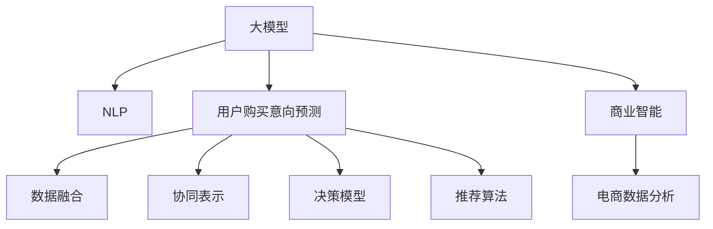

                 

# 探讨大模型在电商平台用户购买意向预测中的潜力

> 关键词：大模型,用户购买意向预测,深度学习,自然语言处理(NLP),商业智能,推荐系统,电商数据分析

## 1. 背景介绍

在数字化转型的浪潮中，电商平台已成为驱动消费和经济增长的重要力量。电商平台通过聚合海量用户行为数据，可对用户购买意向进行精准预测，优化用户体验，提升转化率和销售额。其中，用户购买意向预测已成为电商平台的核心技术之一，直接影响着个性化推荐、库存管理和营销活动的效果。传统统计模型和规则系统在处理大规模非结构化数据时效率低下，无法及时响应用户需求。深度学习和大模型技术的崛起，为电商平台的决策分析注入了新活力。本文将深入探讨大模型在电商平台用户购买意向预测中的潜力，展望未来应用前景。

### 1.1 问题由来

电商平台用户行为数据呈现高度复杂性，如何高效地从海量数据中挖掘有价值的购买意向信息，成为电商数据分析的重大挑战。传统的统计模型和机器学习方法，如线性回归、决策树、随机森林等，对于高维度、大规模数据处理能力有限，难以同时捕捉数据中的隐含关系。同时，这些模型对数据预处理和特征工程依赖性强，训练时间长，难以快速迭代更新。

近年来，深度学习技术，特别是大模型和大规模预训练语言模型，通过在无标签大规模语料上进行自监督学习，具备强大的表征能力和泛化能力。将其应用于电商平台，可以充分挖掘用户行为数据中的深层次信息，预测用户购买意向，为个性化推荐、库存管理等提供有力支持。

### 1.2 问题核心关键点

大模型在电商平台用户购买意向预测中的核心关键点包括：

- 语义理解与特征提取：大模型能够通过自然语言处理(NLP)技术，理解用户评论、浏览记录等文本数据，提取关键特征。
- 数据融合与协同表示：将文本数据与用户行为数据进行融合，构建统一的用户画像。
- 决策模型与推荐算法：基于预测结果构建推荐模型，实现个性化推荐和精准营销。
- 实时响应与系统优化：在大模型基础上实现实时预测和推理，提高电商平台的响应速度和用户体验。

## 2. 核心概念与联系

### 2.1 核心概念概述

为更好地理解大模型在电商平台购买意向预测中的应用，本节将介绍几个关键概念：

- 大模型(Large Model)：以Transformer为基础的大规模预训练语言模型，如GPT、BERT等，具备强大的语言理解和生成能力。
- 用户购买意向预测(User Purchase Intention Prediction)：根据用户行为数据，预测用户是否会进行购买行为，是电商数据分析的重要应用场景。
- 自然语言处理(NLP)：使用深度学习技术处理和理解自然语言，从用户评论、浏览记录等文本数据中提取信息。
- 商业智能(Business Intelligence)：将数据分析和数据可视化技术应用于商业决策，提升电商平台的运营效率和用户满意度。
- 推荐系统(Recommender System)：根据用户历史行为和预测结果，为用户推荐个性化的商品，提升转化率和用户黏性。
- 电商数据分析(E-commerce Data Analysis)：通过数据分析技术，对电商平台用户行为数据进行深入挖掘，优化运营策略。

这些核心概念之间的逻辑关系可以通过以下Mermaid流程图来展示：



这个流程图展示了大模型在电商平台用户购买意向预测中的应用场景及其关键环节：

1. 大模型通过NLP技术，提取用户评论、浏览记录等文本数据的语义信息。
2. 数据融合和协同表示将文本数据与用户行为数据进行整合，构建统一的用户画像。
3. 基于预测结果，构建决策模型和推荐算法，优化电商平台的运营策略。
4. 商业智能和大数据分析技术，辅助决策模型和推荐算法，提升电商平台的决策效率。

## 3. 核心算法原理 & 具体操作步骤
### 3.1 算法原理概述

大模型在电商平台用户购买意向预测中，本质上是一个通过自然语言处理(NLP)技术和深度学习模型，将文本数据转化为购买意向预测结果的过程。具体而言，大模型通过语义理解，将用户评论、产品描述、浏览记录等文本数据转化为数值特征，结合用户行为数据进行协同表示，构建用户画像，进而预测用户的购买意向。

假设电商平台用户历史行为数据为 $X=\{(x_1, y_1), (x_2, y_2), ..., (x_N, y_N)\}$，其中 $x_i$ 为用户行为数据，$y_i$ 为购买行为标签，$0$ 表示不购买，$1$ 表示购买。目标是通过大模型 $M_{\theta}$，在给定新的用户行为数据 $x'$ 的情况下，预测其购买意向 $y'$。

### 3.2 算法步骤详解

基于大模型进行电商平台用户购买意向预测的一般流程如下：

**Step 1: 数据准备与预处理**
- 收集电商平台的用户行为数据，如浏览历史、点击记录、评价评论等。
- 对数据进行清洗、归一化和缺失值填补等预处理。
- 使用NLP技术对文本数据进行分词、去除停用词、词干提取等处理。
- 将文本数据转化为数值特征，如TF-IDF、词嵌入等。

**Step 2: 特征融合与协同表示**
- 将文本特征与用户行为数据进行融合，形成统一的表示向量。
- 使用多模态融合技术，如加权平均、Concatenate等，将不同模态的数据表示进行整合。
- 构建用户画像，通过协同表示方法，如矩阵分解、LSTM等，从融合后的数据中提取用户兴趣和行为模式。

**Step 3: 预测模型训练**
- 选择合适的预测模型，如逻辑回归、二分类支持向量机等。
- 使用大模型提取的特征向量作为模型输入，训练预测模型。
- 调整模型超参数，如学习率、正则化系数等，优化模型性能。

**Step 4: 模型评估与优化**
- 在验证集上评估模型的预测效果，使用准确率、召回率、F1-score等指标。
- 对模型进行调参优化，如增加训练轮数、调整学习率等。
- 引入对抗样本和数据增强技术，提高模型的鲁棒性。

**Step 5: 部署与实时预测**
- 将训练好的模型部署到生产环境中。
- 实时接收用户行为数据，进行预测推理。
- 根据预测结果，动态调整推荐策略，优化用户体验。

### 3.3 算法优缺点

大模型在电商平台用户购买意向预测中的应用具有以下优点：

1. 高效性：大模型能够高效地处理高维度、大规模数据，从海量用户行为数据中提取关键信息。
2. 鲁棒性：通过大规模语料预训练，大模型具备较强的泛化能力，能够适应不同用户行为数据的分布变化。
3. 灵活性：大模型能够快速迭代更新，引入新数据和新特征后，可以实时进行模型优化。
4. 可解释性：大模型的决策过程可解释性强，通过可视化工具，能够理解模型的内部工作机制。

同时，大模型在应用过程中也存在一些局限性：

1. 数据依赖性强：模型的性能依赖于高质量标注数据，标注成本较高。
2. 计算资源消耗大：大模型的参数量巨大，对计算资源和存储空间要求较高。
3. 可解释性不足：大模型通常被视为"黑盒"模型，难以理解其内部决策逻辑。
4. 偏见问题：大模型可能继承数据中的偏见，需要对其进行预处理和修正。

### 3.4 算法应用领域

大模型在电商平台用户购买意向预测中的应用非常广泛，涵盖以下几个关键领域：

- 个性化推荐系统：根据用户历史行为和预测结果，为用户推荐个性化的商品，提升转化率和用户黏性。
- 库存管理：预测商品的需求量，优化库存结构，减少缺货和库存积压。
- 营销活动优化：根据预测结果，设计精准的营销活动，提升活动效果和ROI。
- 客户关系管理：通过预测用户的购买意向，制定针对性的客户维护策略，提升客户满意度和忠诚度。
- 销售预测：预测未来一段时间内的销售额和销售趋势，为运营决策提供参考。

除了上述应用领域外，大模型在电商平台还具备更广阔的应用前景，如商品评价分析、价格优化、广告投放等。随着电商平台的快速发展，大模型的应用价值将日益凸显。

## 4. 数学模型和公式 & 详细讲解  
### 4.1 数学模型构建

假设电商平台用户历史行为数据为 $X=\{(x_1, y_1), (x_2, y_2), ..., (x_N, y_N)\}$，其中 $x_i$ 为用户行为数据，$y_i$ 为购买行为标签。目标是通过大模型 $M_{\theta}$，在给定新的用户行为数据 $x'$ 的情况下，预测其购买意向 $y'$。

形式化地，假设预测模型的决策函数为 $f(x, \theta)$，则用户购买意向预测问题可以表示为：

$$
y' = f(x', \theta)
$$

其中 $f(x, \theta)$ 为模型的预测函数，$\theta$ 为模型参数。

## 4.2 公式推导过程

在用户购买意向预测中，大模型通过语义理解将用户行为数据转化为数值特征，与文本数据进行融合，形成统一的表示向量 $z$。假设文本数据的表示向量为 $z_{text}$，用户行为数据的表示向量为 $z_{behavior}$，则融合后的表示向量 $z$ 可以表示为：

$$
z = w_{text} \cdot z_{text} + w_{behavior} \cdot z_{behavior} + b
$$

其中 $w_{text}, w_{behavior}$ 为融合权重，$b$ 为偏置项。融合后的表示向量 $z$ 用于预测用户购买意向 $y'$。

假设预测模型为逻辑回归模型，其决策函数为：

$$
\hat{y} = \sigma(w_1 \cdot z + w_0)
$$

其中 $\sigma$ 为sigmoid函数，$w_1, w_0$ 为模型参数。预测结果 $\hat{y}$ 需要通过阈值 $\tau$ 进行二值化，得到用户购买意向预测结果 $y'$。

通过训练预测模型，可以最小化预测误差：

$$
\mathcal{L}(y', y) = \frac{1}{N} \sum_{i=1}^N (y_i \log \hat{y_i} + (1-y_i) \log (1-\hat{y_i}))
$$

## 4.3 案例分析与讲解

以电商平台个性化推荐系统为例，具体分析大模型的应用过程。

假设用户 $i$ 的浏览历史为 $\{p_1, p_2, ..., p_M\}$，行为特征向量为 $x_i$，大模型通过语义理解将浏览记录转化为表示向量 $z_{text,i}$。同时，根据用户行为数据，提取行为特征向量 $z_{behavior,i}$。

将 $z_{text,i}$ 和 $z_{behavior,i}$ 进行融合，形成用户 $i$ 的综合表示向量 $z_i$。通过预测模型，计算用户 $i$ 的购买意向预测值 $\hat{y_i}$。根据阈值 $\tau$，将 $\hat{y_i}$ 二值化，得到用户 $i$ 的购买意向 $y_i$。

## 5. 项目实践：代码实例和详细解释说明
### 5.1 开发环境搭建

在进行电商平台用户购买意向预测实践前，需要先准备开发环境。以下是使用Python进行TensorFlow开发的环境配置流程：

1. 安装Anaconda：从官网下载并安装Anaconda，用于创建独立的Python环境。

2. 创建并激活虚拟环境：
```bash
conda create -n tf-env python=3.8 
conda activate tf-env
```

3. 安装TensorFlow：根据CUDA版本，从官网获取对应的安装命令。例如：
```bash
conda install tensorflow -c tensorflow
```

4. 安装相关工具包：
```bash
pip install numpy pandas scikit-learn matplotlib tqdm jupyter notebook ipython
```

完成上述步骤后，即可在`tf-env`环境中开始项目实践。

### 5.2 源代码详细实现

下面我们以电商平台个性化推荐系统为例，给出使用TensorFlow进行用户购买意向预测的Python代码实现。

首先，定义预测模型的输入和输出：

```python
import tensorflow as tf
from tensorflow.keras.layers import Input, Dense, Embedding, Concatenate, BatchNormalization

# 定义输入
user_input = Input(shape=(max_length,), name='user_input')
item_input = Input(shape=(max_length,), name='item_input')

# 定义预训练文本编码层
embedding_dim = 300
text_layer = Embedding(input_dim=vocab_size, output_dim=embedding_dim, name='text_layer')(user_input)
text_layer = BatchNormalization()(text_layer)
text_layer = Dense(hidden_size, activation='relu')(text_layer)

# 定义预训练行为编码层
behavior_layer = Dense(hidden_size, activation='relu')(item_input)
behavior_layer = BatchNormalization()(behavior_layer)

# 定义融合层
fusion_layer = Concatenate()([text_layer, behavior_layer])
fusion_layer = Dense(hidden_size, activation='relu')(fusion_layer)

# 定义输出层
output_layer = Dense(1, activation='sigmoid')(fusion_layer)
```

然后，定义预测模型的训练过程：

```python
# 定义模型
model = tf.keras.Model(inputs=[user_input, item_input], outputs=output_layer)

# 编译模型
model.compile(optimizer='adam', loss='binary_crossentropy', metrics=['accuracy'])

# 定义训练数据集
train_dataset = tf.data.Dataset.from_tensor_slices((train_data, train_labels))
train_dataset = train_dataset.shuffle(buffer_size=10000).batch(batch_size)

# 定义验证数据集
dev_dataset = tf.data.Dataset.from_tensor_slices((dev_data, dev_labels))
dev_dataset = dev_dataset.batch(batch_size)

# 训练模型
model.fit(train_dataset, epochs=10, validation_data=dev_dataset)
```

最后，启动预测流程：

```python
# 定义测试数据集
test_dataset = tf.data.Dataset.from_tensor_slices((test_data, test_labels))
test_dataset = test_dataset.batch(batch_size)

# 预测测试集结果
model.predict(test_dataset)
```

以上就是使用TensorFlow进行电商平台用户购买意向预测的完整代码实现。可以看到，TensorFlow提供了丰富的API和工具，使得模型的构建和训练变得简单易行。

### 5.3 代码解读与分析

让我们再详细解读一下关键代码的实现细节：

**Input层**：
- `Input`层用于定义模型的输入，这里设置了两个输入，分别对应用户行为数据和文本数据的表示向量。

**文本编码层**：
- `Embedding`层将文本数据转化为固定长度的向量表示，通过`BatchNormalization`层进行归一化，`Dense`层进行非线性变换。

**行为编码层**：
- `Dense`层对用户行为数据进行编码，通过`BatchNormalization`层进行归一化。

**融合层**：
- `Concatenate`层将文本编码和行为编码进行融合，`Dense`层进行非线性变换。

**输出层**：
- `Dense`层进行二分类预测，输出用户购买意向的概率。

**模型编译与训练**：
- `compile`方法定义优化器、损失函数和评估指标。
- `fit`方法进行模型训练，`epochs`参数设置训练轮数，`validation_data`参数设置验证数据集。

通过上述代码，我们可以看到，使用TensorFlow进行用户购买意向预测，只需定义模型结构、编译模型、定义数据集、训练模型即可。TensorFlow的高级API使得模型的构建和训练变得高效、直观。

## 6. 实际应用场景
### 6.1 智能推荐

电商平台的个性化推荐系统是电商平台的核心功能之一，通过预测用户购买意向，为用户推荐个性化的商品，提升用户体验和销售转化率。大模型在推荐系统中的应用，能够从用户行为数据中提取更深层次的信息，提升推荐结果的准确性和多样性。

具体而言，大模型可以将用户的浏览记录、点击记录、评价评论等文本数据进行语义理解，提取用户兴趣和偏好。同时，通过将文本数据与用户行为数据进行融合，构建用户画像，实现多模态协同表示。最后，基于预测结果，构建推荐模型，实现精准推荐。

### 6.2 库存管理

电商平台的库存管理需要预测商品的需求量，优化库存结构，避免缺货和库存积压。大模型通过分析用户行为数据，预测商品的销售趋势，优化库存分配，提高库存利用率。

具体而言，大模型可以将用户的浏览记录、点击记录、购买记录等行为数据进行编码，通过预测模型预测商品的未来销售量。结合历史销售数据，优化库存策略，实现供需平衡。

### 6.3 营销活动优化

电商平台需要设计精准的营销活动，提升活动效果和ROI。大模型通过分析用户行为数据，预测用户的购买意向，制定针对性的营销策略，提升活动效果。

具体而言，大模型可以将用户的浏览记录、点击记录、评价评论等文本数据进行语义理解，提取用户兴趣和偏好。同时，通过将文本数据与用户行为数据进行融合，构建用户画像，实现多模态协同表示。最后，基于预测结果，构建推荐模型，优化营销活动。

### 6.4 客户关系管理

电商平台的客户关系管理需要了解用户的购买意向，制定针对性的客户维护策略，提升客户满意度和忠诚度。大模型通过分析用户行为数据，预测用户的购买意向，制定个性化的客户维护策略，提升客户满意度。

具体而言，大模型可以将用户的浏览记录、点击记录、评价评论等文本数据进行语义理解，提取用户兴趣和偏好。同时，通过将文本数据与用户行为数据进行融合，构建用户画像，实现多模态协同表示。最后，基于预测结果，构建推荐模型，制定个性化的客户维护策略。

## 7. 工具和资源推荐
### 7.1 学习资源推荐

为了帮助开发者系统掌握大模型在电商平台用户购买意向预测的理论基础和实践技巧，这里推荐一些优质的学习资源：

1. 《深度学习与自然语言处理》系列博文：由大模型技术专家撰写，深入浅出地介绍了深度学习与自然语言处理的基本概念和前沿技术。

2. TensorFlow官方文档：TensorFlow的官方文档，提供了全面的API介绍和代码示例，是学习深度学习模型的必备资源。

3. PyTorch官方文档：PyTorch的官方文档，提供了丰富的API和工具，方便进行模型的构建和训练。

4. Coursera《深度学习》课程：由斯坦福大学开设的深度学习课程，系统介绍了深度学习的基本理论和应用实践。

5. Kaggle深度学习竞赛：通过参加Kaggle的深度学习竞赛，可以提升深度学习模型的应用技能，了解实际问题中的模型优化技巧。

通过对这些资源的学习实践，相信你一定能够快速掌握大模型在电商平台用户购买意向预测的精髓，并用于解决实际的电商问题。

### 7.2 开发工具推荐

高效的开发离不开优秀的工具支持。以下是几款用于大模型在电商平台用户购买意向预测开发的常用工具：

1. TensorFlow：由Google主导开发的深度学习框架，生产部署方便，适合大规模工程应用。

2. PyTorch：由Facebook开发的深度学习框架，灵活度高，适合快速迭代研究。

3. HuggingFace Transformers：开源的NLP工具库，集成了众多SOTA语言模型，支持PyTorch和TensorFlow，是进行NLP任务开发的利器。

4. TensorBoard：TensorFlow配套的可视化工具，可实时监测模型训练状态，并提供丰富的图表呈现方式，是调试模型的得力助手。

5. Weights & Biases：模型训练的实验跟踪工具，可以记录和可视化模型训练过程中的各项指标，方便对比和调优。

6. Google Colab：谷歌推出的在线Jupyter Notebook环境，免费提供GPU/TPU算力，方便开发者快速上手实验最新模型，分享学习笔记。

合理利用这些工具，可以显著提升大模型在电商平台用户购买意向预测任务的开发效率，加快创新迭代的步伐。

### 7.3 相关论文推荐

大模型在电商平台用户购买意向预测领域的研究始于近年来，以下是几篇奠基性的相关论文，推荐阅读：

1. Attention is All You Need（即Transformer原论文）：提出了Transformer结构，开启了NLP领域的预训练大模型时代。

2. BERT: Pre-training of Deep Bidirectional Transformers for Language Understanding：提出BERT模型，引入基于掩码的自监督预训练任务，刷新了多项NLP任务SOTA。

3. Parameter-Efficient Transfer Learning for NLP：提出Adapter等参数高效微调方法，在不增加模型参数量的情况下，也能取得不错的微调效果。

4. BigQuery from Big Data to Big Learning：介绍如何使用BigQuery进行大规模数据挖掘和分析，为电商平台数据分析提供有力支持。

5. Deep Interest Network: A Neural Collaborative Filtering Approach for Recommendation System：提出深度兴趣网络模型，实现协同过滤推荐，提升了推荐系统的效果。

这些论文代表了大模型在电商平台用户购买意向预测技术的发展脉络。通过学习这些前沿成果，可以帮助研究者把握学科前进方向，激发更多的创新灵感。

## 8. 总结：未来发展趋势与挑战

### 8.1 研究成果总结

本文对大模型在电商平台用户购买意向预测的应用进行了全面系统的介绍。首先阐述了大模型和用户购买意向预测的研究背景和意义，明确了大模型在电商平台中的重要价值。其次，从原理到实践，详细讲解了大模型在电商平台用户购买意向预测中的数学模型和关键步骤，给出了模型开发的完整代码实例。同时，本文还广泛探讨了大模型在电商平台中的多个应用场景，展示了其在电商数据分析中的广泛应用前景。

### 8.2 未来发展趋势

展望未来，大模型在电商平台用户购买意向预测领域将呈现以下几个发展趋势：

1. 模型的多样化和可定制化：随着业务场景的多样化，需要开发多种类型的推荐模型，满足不同业务需求。同时，用户画像的构建需要更加个性化的表示方式，如嵌入式向量表示、多维高斯分布等。

2. 多模态数据的融合：电商平台的数据类型丰富多样，除了文本和行为数据，还有图片、视频、音频等数据。如何高效融合多模态数据，提升用户画像的深度和广度，将是未来研究的重要方向。

3. 模型的可解释性和透明度：电商平台的决策过程需要具备可解释性和透明度，用户能够理解模型的预测结果和决策逻辑。因此，未来的推荐模型需要具备更强的可解释性，帮助用户理解其推荐依据。

4. 实时化的预测和推荐：电商平台需要实时响应用户需求，因此大模型的预测和推荐需要具备实时化能力，能够实时处理新数据并更新模型。

5. 跨领域知识的应用：电商平台的运营需要跨领域的知识支持，如市场趋势、物流信息等。如何在大模型中引入跨领域知识，提升预测和推荐的准确性，将是未来的研究方向。

### 8.3 面临的挑战

尽管大模型在电商平台用户购买意向预测中已经取得了一定的成效，但在迈向更加智能化、普适化应用的过程中，仍面临诸多挑战：

1. 数据获取和预处理难度高：电商平台的运营数据分布不均匀，用户行为数据存在噪声，数据预处理难度较大。

2. 模型参数量巨大：大模型的参数量巨大，对计算资源和存储空间要求较高，导致模型部署和推理效率较低。

3. 模型的泛化能力有限：大模型在电商平台的预测效果依赖于高质量标注数据，标注成本较高。同时，大模型容易过拟合，泛化能力有限。

4. 模型的鲁棒性不足：电商平台的运营数据存在多种噪声，如数据缺失、异常值等，大模型需要具备较强的鲁棒性，才能应对各种复杂场景。

5. 模型的可解释性不足：大模型通常被视为"黑盒"模型，难以理解其内部决策逻辑，用户和业务人员难以对其推荐结果进行解释和信任。

6. 数据隐私和安全问题：电商平台的运营数据涉及用户隐私，大模型的应用需要考虑数据隐私和安全问题，避免数据泄露和滥用。

正视这些挑战，积极应对并寻求突破，将是大模型在电商平台用户购买意向预测领域走向成熟的关键。

### 8.4 研究展望

面向未来，大模型在电商平台用户购买意向预测领域的研究需要在以下几个方面寻求新的突破：

1. 探索无监督和半监督学习方法：摆脱对大规模标注数据的依赖，利用自监督学习、主动学习等无监督和半监督范式，最大化利用非结构化数据，提升模型的泛化能力。

2. 研究多模态数据的融合方法：探索如何高效融合电商平台的多模态数据，提升用户画像的深度和广度，增强推荐模型的准确性。

3. 开发跨领域知识融合技术：研究如何将市场趋势、物流信息等跨领域知识引入大模型，提升推荐模型的泛化能力。

4. 引入对抗生成网络(Generative Adversarial Networks, GAN)技术：通过GAN生成用户行为数据，增强模型的数据量和多样性，提升推荐模型的性能。

5. 引入知识图谱和逻辑规则：研究如何将知识图谱和逻辑规则等专家知识引入大模型，增强模型的决策能力和透明度。

6. 引入因果推理和贝叶斯网络：研究如何将因果推理和贝叶斯网络等方法引入大模型，提升推荐模型的可解释性和可靠性。

这些研究方向的探索，必将引领大模型在电商平台用户购买意向预测领域迈向更高的台阶，为构建安全、可靠、可解释、可控的智能系统铺平道路。

## 9. 附录：常见问题与解答

**Q1：大模型在电商平台用户购买意向预测中会面临哪些资源瓶颈？**

A: 大模型在电商平台用户购买意向预测中面临以下资源瓶颈：
1. 数据获取和预处理难度高：电商平台的运营数据分布不均匀，用户行为数据存在噪声，数据预处理难度较大。
2. 模型参数量巨大：大模型的参数量巨大，对计算资源和存储空间要求较高，导致模型部署和推理效率较低。
3. 模型的泛化能力有限：大模型在电商平台的预测效果依赖于高质量标注数据，标注成本较高。
4. 模型的鲁棒性不足：电商平台的运营数据存在多种噪声，如数据缺失、异常值等，大模型需要具备较强的鲁棒性，才能应对各种复杂场景。
5. 模型的可解释性不足：大模型通常被视为"黑盒"模型，难以理解其内部决策逻辑，用户和业务人员难以对其推荐结果进行解释和信任。
6. 数据隐私和安全问题：电商平台的运营数据涉及用户隐私，大模型的应用需要考虑数据隐私和安全问题，避免数据泄露和滥用。

正视这些挑战，积极应对并寻求突破，将是大模型在电商平台用户购买意向预测领域走向成熟的关键。

**Q2：电商平台的个性化推荐系统如何利用大模型进行用户购买意向预测？**

A: 电商平台的个性化推荐系统通过以下步骤利用大模型进行用户购买意向预测：
1. 收集用户行为数据，如浏览历史、点击记录、评价评论等。
2. 对数据进行清洗、归一化和缺失值填补等预处理。
3. 使用自然语言处理(NLP)技术对文本数据进行分词、去除停用词、词干提取等处理。
4. 将文本数据转化为数值特征，如TF-IDF、词嵌入等。
5. 将文本特征与用户行为数据进行融合，形成统一的表示向量。
6. 使用多模态融合技术，如加权平均、Concatenate等，将不同模态的数据表示进行整合。
7. 构建用户画像，通过协同表示方法，如矩阵分解、LSTM等，从融合后的数据中提取用户兴趣和行为模式。
8. 基于预测结果，构建推荐模型，实现精准推荐。

大模型能够从海量用户行为数据中提取更深层次的信息，提升推荐结果的准确性和多样性。

**Q3：如何在大模型中引入跨领域知识，提升推荐模型的准确性？**

A: 在大模型中引入跨领域知识，提升推荐模型的准确性，可以采用以下方法：
1. 知识图谱嵌入：将知识图谱中的实体和关系嵌入到大模型中，提升模型的跨领域理解能力。
2. 逻辑规则融合：将领域内的逻辑规则嵌入到大模型中，增强模型的逻辑推理能力。
3. 混合表示学习：将知识图谱和逻辑规则与文本数据进行混合表示学习，提升模型的综合能力。
4. 对抗训练：使用对抗样本和对抗训练技术，增强模型对噪声数据的鲁棒性，提升模型的泛化能力。
5. 多任务学习：将跨领域的多项任务作为目标，训练大模型，提升模型的多领域适应能力。

通过引入跨领域知识，大模型可以更好地理解用户的跨领域需求，提升推荐模型的准确性和可靠性。

