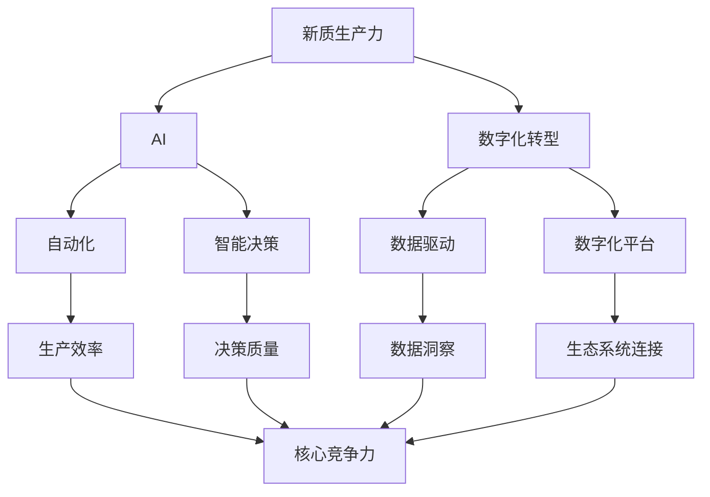

                 

**关键词：新质生产力、核心竞争力、人工智能、数字化转型、自动化、数据驱动、算法、模型、创新**

## 1. 背景介绍

在当今快速变化的数字化时代，企业面临着前所未有的挑战和机遇。要想在激烈的市场竞争中立于不败之地，企业必须发展新质生产力，提高核心竞争力。本文将探讨如何通过人工智能（AI）和数字化转型来实现这一目标，并提供实用的指南和实际项目实践。

## 2. 核心概念与联系

### 2.1 新质生产力与核心竞争力

新质生产力指的是通过技术创新和数字化转型提高生产效率和质量的能力。核心竞争力则是企业在市场竞争中具有独特优势的关键能力。二者密切相关，发展新质生产力是提高核心竞争力的关键。

### 2.2 AI与数字化转型

AI和数字化转型是发展新质生产力的两个关键驱动因素。AI通过自动化和智能决策提高生产效率，而数字化转型则通过数据驱动和数字化平台连接企业内外部生态系统，创造新的价值。



## 3. 核心算法原理 & 具体操作步骤

### 3.1 算法原理概述

AI算法是实现自动化和智能决策的关键。本文重点介绍两种广泛应用于新质生产力开发的算法：机器学习（ML）和深度学习（DL）。

### 3.2 算法步骤详解

#### 3.2.1 机器学习

1. 数据收集：收集与问题相关的数据。
2. 数据预处理：清洗、标准化和转换数据。
3. 特征工程：选择和创建有助于模型学习的特征。
4. 模型选择：选择适合问题的ML算法（如线性回归、决策树、支持向量机等）。
5. 模型训练：使用训练数据调整模型参数。
6. 模型评估：评估模型性能，调整并优化模型。
7. 模型部署：将模型集成到生产环境中。

#### 3.2.2 深度学习

1-7 与ML相同。此外，DL还包括：

8. 网络结构设计：设计神经网络的结构（如全连接网络、卷积网络、循环网络等）。
9. 优化算法选择：选择合适的优化算法（如梯度下降、Adam等）调整模型参数。
10. 正则化和防止过拟合：使用正则化技术（如Dropout、L1/L2正则化）和数据增强防止过拟合。

### 3.3 算法优缺点

**ML优点**：
- 易于理解和实现
- 可以处理结构化和非结构化数据
- 可以处理小规模数据集

**ML缺点**：
- 需要大量特征工程
- 结果不确定性高
- 解释性差

**DL优点**：
- 可以自动学习特征
- 可以处理大规模数据集
- 可以处理复杂的非线性关系

**DL缺点**：
- 理解和实现困难
- 需要大量计算资源
- 结果不确定性高
- 解释性差

### 3.4 算法应用领域

ML和DL广泛应用于新质生产力开发的各个领域，包括预测分析、自然语言处理、图像和语音识别、推荐系统、质量控制等。

## 4. 数学模型和公式 & 详细讲解 & 举例说明

### 4.1 数学模型构建

数学模型是ML和DL算法的基础。本节介绍两种常用的数学模型：线性回归和神经网络。

#### 4.1.1 线性回归

线性回归模型假设输入特征和输出目标之间存在线性关系。其数学表达式为：

$$y = \beta_0 + \beta_1x_1 + \beta_2x_2 + \ldots + \beta_nx_n + \epsilon$$

其中，$y$是目标变量，$x_1, x_2, \ldots, x_n$是输入特征，$\beta_0, \beta_1, \ldots, \beta_n$是模型参数，$\epsilon$是误差项。

#### 4.1.2 神经网络

神经网络模型由输入层、隐藏层和输出层组成。其数学表达式为：

$$y = f(w_2f(w_1x + b_1) + b_2)$$

其中，$x$是输入向量，$y$是输出向量，$w_1$和$w_2$是权重矩阵，$b_1$和$b_2$是偏置向量，$f$是激活函数。

### 4.2 公式推导过程

#### 4.2.1 线性回归参数估计

线性回归模型的参数可以使用最小二乘法估计。其数学表达式为：

$$\hat{\beta} = (X^TX)^{-1}X^Ty$$

其中，$X$是输入特征矩阵，$y$是目标变量向量。

#### 4.2.2 神经网络参数估计

神经网络模型的参数可以使用梯度下降算法估计。其数学表达式为：

$$w_{ij}(t+1) = w_{ij}(t) - \eta \frac{\partial E}{\partial w_{ij}}$$

$$b_{i}(t+1) = b_{i}(t) - \eta \frac{\partial E}{\partial b_{i}}$$

其中，$\eta$是学习率，$E$是误差函数。

### 4.3 案例分析与讲解

假设我们要构建一个预测销售额的ML模型。输入特征包括产品类别、价格、促销活动、季节等，目标变量是销售额。我们可以使用线性回归模型来解决这个问题。

数学模型构建如下：

$$销售额 = \beta_0 + \beta_1 \times 产品类别 + \beta_2 \times 价格 + \beta_3 \times 促销活动 + \beta_4 \times 季节 + \epsilon$$

参数估计使用最小二乘法，公式为：

$$\hat{\beta} = (X^TX)^{-1}X^T销售额$$

其中，$X$是输入特征矩阵，$销售额$是目标变量向量。

## 5. 项目实践：代码实例和详细解释说明

### 5.1 开发环境搭建

本项目使用Python作为编程语言，并依赖于以下库：

- NumPy：数值计算库
- Pandas：数据处理库
- Matplotlib：数据可视化库
- Scikit-learn：ML库
- TensorFlow：DL库

### 5.2 源代码详细实现

以下是使用线性回归模型预测销售额的Python代码示例：

```python
import numpy as np
import pandas as pd
import matplotlib.pyplot as plt
from sklearn.model_selection import train_test_split
from sklearn.linear_model import LinearRegression
from sklearn.metrics import mean_squared_error

# 加载数据
data = pd.read_csv('sales_data.csv')

# 特征工程
X = data[['product_category', 'price', 'promotion','season']]
y = data['sales']

# 数据预处理
X = pd.get_dummies(X, drop_first=True)  # 使用One-Hot Encoding处理类别特征

# 数据分割
X_train, X_test, y_train, y_test = train_test_split(X, y, test_size=0.2, random_state=42)

# 模型训练
model = LinearRegression()
model.fit(X_train, y_train)

# 模型评估
y_pred = model.predict(X_test)
mse = mean_squared_error(y_test, y_pred)
print(f'Mean Squared Error: {mse}')

# 模型可视化
plt.scatter(y_test, y_pred)
plt.xlabel('True Sales')
plt.ylabel('Predicted Sales')
plt.title('Sales Prediction using Linear Regression')
plt.show()
```

### 5.3 代码解读与分析

代码首先加载数据并进行特征工程。然后，使用One-Hot Encoding处理类别特征。之后，数据被分割为训练集和测试集。线性回归模型被训练并用于预测测试集的销售额。最后，模型的性能使用均方误差（MSE）评估，并使用散点图可视化。

### 5.4 运行结果展示

运行结果将显示模型的MSE，并生成一个散点图，显示真实销售额与预测销售额的关系。

## 6. 实际应用场景

### 6.1 制造业

在制造业中，AI和数字化转型可以用于预测设备故障、优化生产计划、改善质量控制等。例如，使用DL模型可以检测机器故障，从而减少停机时间和维护成本。

### 6.2 金融业

在金融业中，AI和数字化转型可以用于风险预测、信用评分、欺诈检测等。例如，使用ML模型可以预测客户流失，从而改善客户保留率。

### 6.3 零售业

在零售业中，AI和数字化转型可以用于销售预测、库存优化、个性化推荐等。例如，使用DL模型可以分析客户行为，从而提供个性化的产品推荐。

### 6.4 未来应用展望

未来，AI和数字化转型将继续渗透到各个行业，创造新的生产力和价值。例如，自动驾驶、人工智能助手、智能城市等领域将会有重大突破。

## 7. 工具和资源推荐

### 7.1 学习资源推荐

- 书籍：《机器学习》作者：Tom Mitchell、《深度学习》作者：Ian Goodfellow、Yoshua Bengio、Aaron Courville
- 在线课程：Coursera、Udacity、edX
- 研究论文：arXiv.org

### 7.2 开发工具推荐

- Python：Anaconda、Jupyter Notebook
- R：RStudio
- DL框架：TensorFlow、PyTorch、Keras

### 7.3 相关论文推荐

- "Artificial Intelligence: A Guide for Thinking Humans"作者：Melanie Mitchell
- "The Master Algorithm"作者：Pedro Domingos
- "Life 3.0: Being Human in the Age of Artificial Intelligence"作者：Max Tegmark

## 8. 总结：未来发展趋势与挑战

### 8.1 研究成果总结

本文介绍了如何通过AI和数字化转型发展新质生产力，提高核心竞争力。我们讨论了ML和DL算法的原理、步骤、优缺点和应用领域。此外，我们还提供了一个项目实践示例，展示了如何使用线性回归模型预测销售额。

### 8.2 未来发展趋势

未来，AI和数字化转型将继续发展，并渗透到更多行业。我们将看到更先进的算法、更大的数据集和更强大的计算资源。此外，AI解释性（XAI）和可信AI（T

