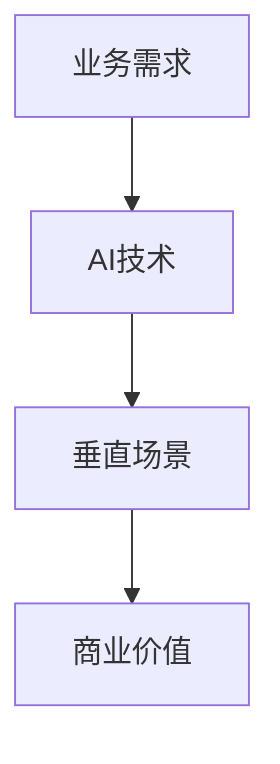

                 

**垂直场景与AI创业的结合**

**作者：禅与计算机程序设计艺术 / Zen and the Art of Computer Programming**

## 1. 背景介绍

在当今快速发展的AI时代，AI技术已经渗透到各行各业，垂直场景应运而生。垂直场景是指在特定行业或领域内，结合业务需求和AI技术，构建的具有特定功能和价值的应用场景。AI创业则是指利用AI技术，创造新的商业价值和市场机会。本文将探讨垂直场景与AI创业的结合，如何在特定行业内创造新的商业价值和市场机会。

## 2. 核心概念与联系

### 2.1 垂直场景

垂直场景是指在特定行业或领域内，结合业务需求和AI技术，构建的具有特定功能和价值的应用场景。垂直场景的特点是高度定制化，深度集成业务流程，具有明显的行业特征。



### 2.2 AI创业

AI创业是指利用AI技术，创造新的商业价值和市场机会。AI创业的特点是技术驱动，创新性强，市场前景广阔。

### 2.3 垂直场景与AI创业的联系

垂直场景与AI创业的联系在于，垂直场景为AI创业提供了特定行业的业务需求和场景，AI创业则为垂直场景提供了先进的AI技术和创新的商业模式。二者结合，可以创造出具有高度定制化、深度集成业务流程、明显行业特征的AI应用，从而创造出新的商业价值和市场机会。

## 3. 核心算法原理 & 具体操作步骤

### 3.1 算法原理概述

在垂直场景与AI创业的结合中，核心算法原理是指在特定行业或领域内，利用AI技术解决业务需求的原理。常见的核心算法原理包括机器学习、深度学习、自然语言处理等。

### 3.2 算法步骤详解

以机器学习为例，其具体操作步骤包括：

1. 数据收集：收集特定行业或领域内的业务数据。
2. 数据预处理：对收集到的数据进行清洗、标注、分割等预处理。
3. 特征工程：提取数据中的特征，为后续的机器学习算法提供输入。
4. 模型选择：选择合适的机器学习算法模型。
5. 模型训练：使用预处理后的数据和特征，训练模型。
6. 模型评估：评估模型的性能，调整模型参数。
7. 模型部署：将训练好的模型部署到特定行业或领域内，为业务提供决策支持。

### 3.3 算法优缺点

机器学习算法的优点包括：

* 可以从数据中学习，无需人工编程。
* 可以适应复杂的业务需求，具有高度的定制化。
* 可以不断学习和改进，具有自适应性。

机器学习算法的缺点包括：

* 依赖于大量的数据，数据质量直接影响模型性能。
* 模型训练和评估需要一定的时间和资源。
* 模型解释性差，LACK OF INTERPRETABILITY。

### 3.4 算法应用领域

机器学习算法在垂直场景与AI创业的结合中，具有广泛的应用领域，包括但不限于：

* 金融行业：风险评估、信用评级、欺诈检测等。
* 制造业：质量控制、设备维护、生产预测等。
* 医疗行业：疾病诊断、药物发现、个性化治疗等。
* 物流行业：路径规划、运输预测、仓储管理等。

## 4. 数学模型和公式 & 详细讲解 & 举例说明

### 4.1 数学模型构建

在垂直场景与AI创业的结合中，数学模型是指用数学语言描述特定行业或领域内业务需求的模型。常见的数学模型包括线性回归模型、逻辑回归模型、支持向量机模型等。

### 4.2 公式推导过程

以线性回归模型为例，其公式推导过程如下：

设有n个样本，每个样本有m个特征，则线性回归模型的公式为：

$$y = \beta_0 + \beta_1x_1 + \beta_2x_2 +... + \beta_mx_m + \epsilon$$

其中，y为目标变量，x1, x2,..., xm为特征变量，β0, β1, β2,..., βm为模型参数，ε为误差项。

模型参数β0, β1, β2,..., βm可以通过最小化误差平方和的方法求解：

$$\min_{\beta_0, \beta_1,..., \beta_m} \sum_{i=1}^{n}(y_i - \hat{y}_i)^2$$

其中，yi为第i个样本的目标变量，$\hat{y}_i$为模型预测的第i个样本的目标变量。

### 4.3 案例分析与讲解

以金融行业的信用评级为例，数学模型可以用于预测借款人的信用等级。设有n个借款人样本，每个样本有m个特征，如年龄、收入、信用记录等，则线性回归模型可以用于预测借款人的信用等级。模型参数β0, β1, β2,..., βm可以通过最小化误差平方和的方法求解，从而得到借款人的信用等级预测值。

## 5. 项目实践：代码实例和详细解释说明

### 5.1 开发环境搭建

在垂直场景与AI创业的结合中，开发环境搭建包括硬件环境和软件环境两个方面。硬件环境包括服务器、存储设备等，软件环境包括操作系统、编程语言、开发框架等。常见的开发环境包括Linux操作系统、Python编程语言、TensorFlow开发框架等。

### 5.2 源代码详细实现

以金融行业的信用评级为例，源代码实现如下：

```python
import numpy as np
from sklearn.linear_model import LinearRegression

# 读取数据
data = np.loadtxt('credit_data.csv', delimiter=',')

# 分割数据
X = data[:, :-1]
y = data[:, -1]

# 创建线性回归模型
model = LinearRegression()

# 训练模型
model.fit(X, y)

# 预测信用等级
predictions = model.predict(X)

# 打印预测结果
print(predictions)
```

### 5.3 代码解读与分析

上述代码实现了金融行业的信用评级功能。首先，使用NumPy库读取数据，并分割数据为特征变量X和目标变量y。然后，使用Scikit-learn库创建线性回归模型，并训练模型。最后，使用训练好的模型预测信用等级，并打印预测结果。

### 5.4 运行结果展示

运行上述代码后，可以得到借款人的信用等级预测值。预测值越高，表示借款人的信用等级越好。

## 6. 实际应用场景

### 6.1 金融行业

在金融行业，垂直场景与AI创业的结合可以创造出新的商业价值和市场机会。例如，信用评级、欺诈检测、风险评估等业务可以利用AI技术进行定制化、深度集成业务流程的应用，从而提高业务效率和准确性。

### 6.2 制造业

在制造业，垂直场景与AI创业的结合可以创造出新的商业价值和市场机会。例如，质量控制、设备维护、生产预测等业务可以利用AI技术进行定制化、深度集成业务流程的应用，从而提高业务效率和准确性。

### 6.3 未来应用展望

未来，垂直场景与AI创业的结合将会在更多行业和领域内创造出新的商业价值和市场机会。例如，自动驾驶、医疗诊断、城市管理等业务都可以利用AI技术进行定制化、深度集成业务流程的应用，从而提高业务效率和准确性。

## 7. 工具和资源推荐

### 7.1 学习资源推荐

* 书籍：《机器学习》作者：Tom Mitchell
* 在线课程：Coursera、Udacity、edX等平台上的机器学习课程
* 论坛：Stack Overflow、KDnuggets等机器学习论坛

### 7.2 开发工具推荐

* 编程语言：Python、R等
* 开发框架：TensorFlow、PyTorch、Keras等
* 数据库：MySQL、PostgreSQL等
* 云平台：AWS、Google Cloud、Azure等

### 7.3 相关论文推荐

* 论文：《深度学习》作者：Ian Goodfellow、Yoshua Bengio、Aaron Courville
* 论文：《机器学习》作者：Tom Mitchell
* 论文：《自然语言处理》作者：Christopher D. Manning、Hinrich Schütze

## 8. 总结：未来发展趋势与挑战

### 8.1 研究成果总结

本文总结了垂直场景与AI创业的结合的核心概念、算法原理、数学模型、项目实践等内容。垂直场景与AI创业的结合可以创造出新的商业价值和市场机会，具有广阔的应用前景。

### 8.2 未来发展趋势

未来，垂直场景与AI创业的结合将会在更多行业和领域内创造出新的商业价值和市场机会。AI技术将会不断发展，为垂直场景提供更先进的技术支撑。同时，垂直场景也将不断丰富和完善，为AI创业提供更多的业务需求和场景。

### 8.3 面临的挑战

垂直场景与AI创业的结合也面临着一定的挑战，包括：

* 数据安全和隐私保护
* AI模型解释性差
* AI技术过度依赖数据
* AI技术伦理和道德挑战

### 8.4 研究展望

未来，垂直场景与AI创业的结合将会是一个重要的研究方向。研究人员需要不断探索新的业务需求和场景，开发新的AI技术和模型，从而创造出更多的商业价值和市场机会。

## 9. 附录：常见问题与解答

**Q1：垂直场景与AI创业的结合有哪些优点？**

A1：垂直场景与AI创业的结合具有高度定制化、深度集成业务流程、明显行业特征等优点，可以创造出新的商业价值和市场机会。

**Q2：垂直场景与AI创业的结合有哪些缺点？**

A2：垂直场景与AI创业的结合也面临着数据安全和隐私保护、AI模型解释性差、AI技术过度依赖数据、AI技术伦理和道德挑战等缺点。

**Q3：垂直场景与AI创业的结合有哪些应用领域？**

A3：垂直场景与AI创业的结合具有广泛的应用领域，包括但不限于金融行业、制造业、医疗行业、物流行业等。

**Q4：垂直场景与AI创业的结合有哪些工具和资源推荐？**

A4：垂直场景与AI创业的结合有学习资源推荐、开发工具推荐、相关论文推荐等。

**Q5：垂直场景与AI创业的结合有哪些未来发展趋势和挑战？**

A5：垂直场景与AI创业的结合具有广阔的应用前景，但也面临着数据安全和隐私保护、AI模型解释性差、AI技术过度依赖数据、AI技术伦理和道德挑战等挑战。

**作者署名：作者：禅与计算机程序设计艺术 / Zen and the Art of Computer Programming**

