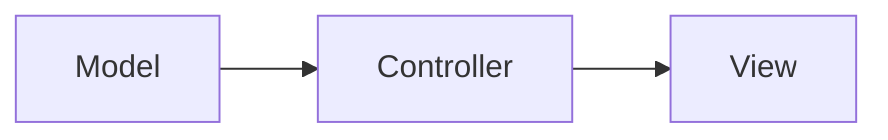

                 

**智能家居**, **MVC设计模式**, **Java**, **家居自动化**, **软件架构**, **设计模式应用**

## 1. 背景介绍

随着物联网和人工智能技术的发展，智能家居已经成为现代生活中的一部分。智能家居系统需要处理大量的设备和数据，因此，设计一个高效、可扩展且易于维护的软件架构至关重要。Model-View-Controller（MVC）是一种广泛应用于软件开发的设计模式，它可以帮助我们构建一个结构清晰、功能分明的智能家居系统。

## 2. 核心概念与联系

MVC设计模式将应用程序分为三个主要组件：模型（Model）、视图（View）和控制器（Controller）。它们的关系如下图所示：



- **模型（Model）**：表示应用程序的数据和业务逻辑。在智能家居系统中，模型负责管理各种设备的状态和控制逻辑。
- **视图（View）**：定义了数据的表示方式。在智能家居系统中，视图负责显示设备的状态和控制面板。
- **控制器（Controller）**：处理用户输入并更新模型和视图。在智能家居系统中，控制器负责处理用户的控制指令，并相应地更新模型和视图。

## 3. 核心算法原理 & 具体操作步骤

### 3.1 算法原理概述

MVC设计模式的核心原理是将应用程序分为三个独立的组件，每个组件都有明确的职责。这种分离有助于提高代码的可维护性、可扩展性和可测试性。

### 3.2 算法步骤详解

1. **定义模型**：创建一个表示智能家居设备状态和控制逻辑的类。例如：

```java
public class LightModel {
    private boolean isOn;
    //... other attributes and methods
}
```

2. **定义视图**：创建一个表示智能家居设备状态和控制面板的类。例如：

```java
public class LightView {
    private LightModel model;
    //... other attributes and methods
}
```

3. **定义控制器**：创建一个处理用户输入并更新模型和视图的类。例如：

```java
public class LightController {
    private LightModel model;
    private LightView view;

    public LightController(LightModel model, LightView view) {
        this.model = model;
        this.view = view;
    }

    public void toggle() {
        model.toggle();
        view.update(model);
    }
}
```

### 3.3 算法优缺点

**优点**：

- 代码结构清晰，易于维护和扩展。
- 降低了模型、视图和控制器之间的耦合度。
- 可以独立地开发和测试模型、视图和控制器。

**缺点**：

- 可能会导致过度设计，增加开发成本。
- 学习曲线较陡，对新手不友好。

### 3.4 算法应用领域

MVC设计模式适用于任何需要处理大量数据和业务逻辑的应用程序，如Web应用程序、桌面应用程序和移动应用程序。在智能家居系统中，MVC设计模式可以帮助我们构建一个结构清晰、功能分明的系统。

## 4. 数学模型和公式 & 详细讲解 & 举例说明

### 4.1 数学模型构建

在智能家居系统中，我们可以使用有向图表示设备之间的关系。设备表示为节点，连接表示为边。例如，智能灯可以连接到智能插座，智能插座又可以连接到智能电表。

### 4.2 公式推导过程

设$G = (V, E)$表示设备图，其中$V$表示设备集合，$E$表示连接集合。设$S \subseteq V$表示需要控制的设备集合，$C \subseteq V$表示受影响的设备集合。则控制影响的公式为：

$$C = \text{reach}(S) \cup S$$

其中$\text{reach}(S)$表示$S$的可达集合，即所有可以从$S$到达的设备集合。

### 4.3 案例分析与讲解

例如，在图$G$中，设$S = \{d_1, d_2\}$表示需要控制的智能灯集合，$C = \{d_1, d_2, s_1, e_1\}$表示受影响的设备集合。则控制影响的公式计算结果为：

$$C = \text{reach}(\{d_1, d_2\}) \cup \{d_1, d_2\} = \{d_1, d_2, s_1, e_1\}$$

## 5. 项目实践：代码实例和详细解释说明

### 5.1 开发环境搭建

我们将使用Java和Spring Framework来构建智能家居系统。首先，我们需要搭建开发环境：

1. 安装JDK 1.8或更高版本。
2. 安装Maven 3.6或更高版本。
3. 创建一个新的Spring Boot项目。

### 5.2 源代码详细实现

以下是智能灯的MVC实现示例：

**模型（LightModel.java）：**

```java
public class LightModel {
    private boolean isOn;

    //... other attributes and methods
}
```

**视图（LightView.java）：**

```java
@Controller
public class LightView {
    @Autowired
    private LightModel model;

    @GetMapping("/light")
    public String viewModel(Model model) {
        model.addAttribute("light", this.model);
        return "light";
    }
}
```

**控制器（LightController.java）：**

```java
@Service
public class LightController {
    @Autowired
    private LightModel model;

    @PostMapping("/light/toggle")
    public ResponseEntity<String> toggle() {
        model.toggle();
        return new ResponseEntity<>("OK", HttpStatus.OK);
    }
}
```

### 5.3 代码解读与分析

- **模型（LightModel.java）**：表示智能灯的状态和控制逻辑。
- **视图（LightView.java）**：定义了智能灯的表示方式，使用Spring MVC的@Controller和@GetMapping注解来处理GET请求。
- **控制器（LightController.java）**：处理用户输入并更新模型，使用Spring MVC的@Service和@PostMapping注解来处理POST请求。

### 5.4 运行结果展示

运行Spring Boot应用程序，访问http://localhost:8080/light，可以看到智能灯的当前状态。发送POST请求到http://localhost:8080/light/toggle，可以切换智能灯的状态。

## 6. 实际应用场景

### 6.1 当前应用

MVC设计模式已经广泛应用于各种智能家居系统，如Amazon Alexa、Google Home和Apple HomeKit。

### 6.2 未来应用展望

随着物联网和人工智能技术的发展，MVC设计模式将继续在智能家居系统中发挥作用。未来，我们将看到更多的智能家居系统采用MVC设计模式，并结合其他设计模式和架构风格，如微服务和事件驱动架构。

## 7. 工具和资源推荐

### 7.1 学习资源推荐

- [Spring Framework Documentation](https://spring.io/projects/spring-framework)
- [MVC Design Pattern](https://refactoring.guru/design-patterns/mvc)

### 7.2 开发工具推荐

- [IntelliJ IDEA](https://www.jetbrains.com/idea/)
- [Eclipse](https://www.eclipse.org/)

### 7.3 相关论文推荐

- [A Survey on Design Patterns for Software Architecture](https://ieeexplore.ieee.org/document/7921367)
- [Model-View-Controller: A Design Pattern for Software Architecture](https://www.researchgate.net/publication/320536758_Model-View-Controller_A_Design_Pattern_for_Software_Architecture)

## 8. 总结：未来发展趋势与挑战

### 8.1 研究成果总结

本文介绍了MVC设计模式在智能家居系统中的应用，并提供了详细的实现示例。我们讨论了MVC设计模式的优缺点，并展示了如何使用数学模型和公式来分析智能家居系统。

### 8.2 未来发展趋势

未来，我们将看到更多的智能家居系统采用MVC设计模式，并结合其他设计模式和架构风格。此外，我们还将看到更多的智能家居系统采用分布式架构和云计算技术。

### 8.3 面临的挑战

智能家居系统面临的挑战包括安全性、隐私保护和互操作性。此外，智能家居系统需要处理大量的设备和数据，因此性能和可扩展性也是关键挑战。

### 8.4 研究展望

未来的研究将关注智能家居系统的安全性、隐私保护和互操作性。此外，我们还将看到更多的智能家居系统采用人工智能和机器学习技术，以提供更智能和个性化的体验。

## 9. 附录：常见问题与解答

**Q1：MVC设计模式适用于哪些场景？**

A1：MVC设计模式适用于任何需要处理大量数据和业务逻辑的应用程序，如Web应用程序、桌面应用程序和移动应用程序。在智能家居系统中，MVC设计模式可以帮助我们构建一个结构清晰、功能分明的系统。

**Q2：MVC设计模式的优缺点是什么？**

A2：MVC设计模式的优点包括代码结构清晰，易于维护和扩展，降低了模型、视图和控制器之间的耦合度，可以独立地开发和测试模型、视图和控制器。缺点包括可能会导致过度设计，增加开发成本，学习曲线较陡，对新手不友好。

**Q3：如何在智能家居系统中使用MVC设计模式？**

A3：在智能家居系统中，我们可以使用MVC设计模式将应用程序分为模型、视图和控制器三个主要组件。模型表示应用程序的数据和业务逻辑，视图定义了数据的表示方式，控制器处理用户输入并更新模型和视图。我们可以使用Java和Spring Framework来实现MVC设计模式。

**Q4：MVC设计模式与其他设计模式有何不同？**

A4：MVC设计模式与其他设计模式的不同之处在于它将应用程序分为三个独立的组件，每个组件都有明确的职责。这种分离有助于提高代码的可维护性、可扩展性和可测试性。与其他设计模式相比，MVC设计模式更侧重于应用程序的结构和架构。

**Q5：如何在智能家居系统中使用数学模型和公式？**

A5：在智能家居系统中，我们可以使用有向图表示设备之间的关系。设备表示为节点，连接表示为边。我们可以使用控制影响公式来分析受影响的设备集合。例如，设$G = (V, E)$表示设备图，其中$V$表示设备集合，$E$表示连接集合。设$S \subseteq V$表示需要控制的设备集合，$C \subseteq V$表示受影响的设备集合。则控制影响的公式为：

$$C = \text{reach}(S) \cup S$$

其中$\text{reach}(S)$表示$S$的可达集合，即所有可以从$S$到达的设备集合。

## 作者：禅与计算机程序设计艺术 / Zen and the Art of Computer Programming

