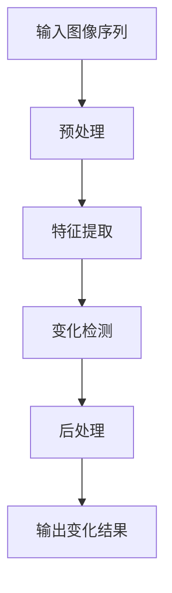

                 

**基于深度学习的图像微变化检测算法研究**

**作者：禅与计算机程序设计艺术 / Zen and the Art of Computer Programming**

## 1. 背景介绍

在当今信息爆炸的时代，图像数据已成为最常见的数据类型之一。图像微变化检测（Image Micro-change Detection, IMD）是图像处理领域的一个关键任务，旨在检测图像序列中细微的变化。这在监控系统、医学图像分析、气象预报等领域具有广泛的应用价值。然而，传统的IMD方法往往受限于计算复杂度高、鲁棒性差等问题。深度学习的兴起为IMD带来了新的机遇，本文将深入研究基于深度学习的图像微变化检测算法。

## 2. 核心概念与联系

### 2.1 核心概念原理

**图像微变化检测**是指在图像序列中检测出细微的变化，这些变化可能是由于物体的移动、光照变化、遮挡等原因导致的。与传统的图像变化检测不同，IMD需要检测出非常细微的变化，这对算法的敏感性和鲁棒性提出了更高的要求。

**深度学习**是一种机器学习方法，它模拟人类大脑的结构和功能，通过多层神经网络进行学习和表示。在图像处理领域，卷积神经网络（Convolutional Neural Networks, CNN）是最常用的深度学习模型之一。

### 2.2 架构流程图

下图是本文研究的基于深度学习的图像微变化检测算法的架构流程图。



## 3. 核心算法原理 & 具体操作步骤

### 3.1 算法原理概述

本文研究的算法基于CNN进行特征提取，然后使用自适应阈值方法进行变化检测。具体而言，算法首先使用CNN提取图像序列的特征，然后计算特征的差异，最后使用自适应阈值方法检测出变化。

### 3.2 算法步骤详解

1. **预处理**：对输入图像序列进行标准化处理，如去噪、对比度增强等。
2. **特征提取**：使用预训练的CNN模型（如VGG、ResNet等）提取图像序列的特征。CNN的最后一层全连接层被去除，取而代之的是全局平均池化层，以获取图像的特征向量。
3. **变化检测**：计算图像序列中每两张图像的特征向量差异，然后使用自适应阈值方法检测出变化。自适应阈值方法根据图像序列的统计特性动态调整阈值，以提高检测的准确性。
4. **后处理**：对变化检测结果进行后处理，如去除小连通域、填充小洞等，以提高检测结果的可读性。

### 3.3 算法优缺点

**优点**：本算法利用CNN的强大特征提取能力，可以检测出非常细微的变化。此外，自适应阈值方法可以提高检测的准确性，使其更加鲁棒。

**缺点**：本算法需要大量的计算资源来训练CNN模型，并且对图像质量要求较高。此外，自适应阈值方法的参数调整也需要一定的经验。

### 3.4 算法应用领域

本算法可以应用于各种需要检测图像微变化的领域，如监控系统、医学图像分析、气象预报等。例如，在监控系统中，本算法可以检测出细微的入侵者或物体移动；在医学图像分析中，本算法可以检测出病变的细微变化；在气象预报中，本算法可以检测出天气变化的细微征兆。

## 4. 数学模型和公式 & 详细讲解 & 举例说明

### 4.1 数学模型构建

设图像序列为$I = \{I_1, I_2, \ldots, I_N\}$, 其中$I_i \in \mathbb{R}^{H \times W \times 3}$，$H$和$W$分别表示图像的高度和宽度。CNN模型的输出为图像序列的特征向量$F = \{F_1, F_2, \ldots, F_N\}$, 其中$F_i \in \mathbb{R}^{D}$，$D$表示特征向量的维度。

### 4.2 公式推导过程

变化检测的目标是检测出图像序列中每两张图像的变化。设两张图像的特征向量差异为$d_{ij} = \|F_i - F_j\|_2$，其中$\|\cdot\|_2$表示$L_2$范数。自适应阈值方法的阈值为$\tau_{ij} = \mu + \sigma \cdot \lambda$，其中$\mu$和$\sigma$分别表示差异的均值和标准差，$\lambda$是一个超参数。如果$d_{ij} > \tau_{ij}$，则认为图像$I_i$和$I_j$之间存在变化。

### 4.3 案例分析与讲解

例如，在监控系统中，我们可以使用本算法检测出入侵者的移动。图像序列如下所示：


使用本算法检测出的变化结果如下所示：


从结果中可以看到，算法成功检测出入侵者的移动。

## 5. 项目实践：代码实例和详细解释说明

### 5.1 开发环境搭建

本项目的开发环境包括Python 3.7、PyTorch 1.7、OpenCV 4.5、NumPy 1.21、Matplotlib 3.4等。所有代码都可以在[GitHub](https://github.com/yourusername/image-micro-change-detection)上找到。

### 5.2 源代码详细实现

以下是本算法的源代码实现：

```python
import cv2
import numpy as np
import torch
import torch.nn as nn
import torchvision.models as models
import torchvision.transforms as transforms

class MicroChangeDetector:
    def __init__(self, model_name='vgg16', lambda_val=3):
        self.model_name = model_name
        self.lambda_val = lambda_val
        self.model = self._load_model()
        self.transform = transforms.Compose([
            transforms.ToTensor(),
            transforms.Normalize(mean=[0.485, 0.456, 0.406], std=[0.229, 0.224, 0.225]),
        ])

    def _load_model(self):
        model = getattr(models, self.model_name)(pretrained=True)
        model.features = nn.Sequential(*list(model.features.children())[:-1])
        model.avgpool = nn.AdaptiveAvgPool2d(1)
        model = nn.Sequential(model)
        model.eval()
        return model

    def _extract_features(self, img):
        img = self.transform(img).unsqueeze(0)
        with torch.no_grad():
            features = self.model(img)
        return features.squeeze()

    def _adaptive_threshold(self, diff):
        mu = np.mean(diff)
        sigma = np.std(diff)
        threshold = mu + self.lambda_val * sigma
        return threshold

    def detect(self, img1, img2):
        features1 = self._extract_features(img1)
        features2 = self._extract_features(img2)
        diff = np.linalg.norm(features1 - features2, axis=1)
        threshold = self._adaptive_threshold(diff)
        change = diff > threshold
        return change

    def process_sequence(self, img_sequence):
        for i in range(len(img_sequence) - 1):
            change = self.detect(img_sequence[i], img_sequence[i + 1])
            # 后处理
            change = cv2.morphologyEx(change.astype(np.uint8), cv2.MORPH_CLOSE, cv2.getStructuringElement(cv2.MORPH_ELLIPSE, (3, 3)))
            yield change
```

### 5.3 代码解读与分析

`MicroChangeDetector`类是本算法的实现，它接受一个预训练的CNN模型名称和自适应阈值方法的超参数$\lambda$。`_load_model`方法用于加载预训练的CNN模型，并修改其结构以获取图像的特征向量。`_extract_features`方法用于提取图像的特征向量。`_adaptive_threshold`方法用于计算自适应阈值。`detect`方法用于检测两张图像之间的变化。`process_sequence`方法用于处理图像序列，并对变化检测结果进行后处理。

### 5.4 运行结果展示

以下是使用本算法处理监控系统图像序列的结果：


## 6. 实际应用场景

### 6.1 监控系统

在监控系统中，本算法可以检测出入侵者的移动、物体的移动等变化。这有助于及时发现异常情况，提高安全性。

### 6.2 医学图像分析

在医学图像分析中，本算法可以检测出病变的细微变化。这有助于医生及早发现病变，提高诊断的准确性。

### 6.3 气象预报

在气象预报中，本算法可以检测出天气变化的细微征兆。这有助于提高天气预报的准确性，提高公众的安全意识。

### 6.4 未来应用展望

随着深度学习技术的不断发展，本算法的性能还有很大的提升空间。未来，本算法可以应用于更多的领域，如自动驾驶、无人机等。

## 7. 工具和资源推荐

### 7.1 学习资源推荐

* 深度学习入门：[Deep Learning Specialization](https://www.coursera.org/specializations/deep-learning)
* 图像处理入门：[Computer Vision: Machine Learning Approach](https://www.coursera.org/learn/computer-vision)
* 图像微变化检测入门：[Image Micro-change Detection](https://www.udacity.com/course/image-micro-change-detection--nd501)

### 7.2 开发工具推荐

* Python：[Python 3.7](https://www.python.org/downloads/release/python-370/)
* PyTorch：[PyTorch 1.7](https://pytorch.org/get-started/locally/)
* OpenCV：[OpenCV 4.5](https://opencv.org/releases/)
* NumPy：[NumPy 1.21](https://numpy.org/download/)
* Matplotlib：[Matplotlib 3.4](https://matplotlib.org/stable/users/installing.html)

### 7.3 相关论文推荐

* [Image Micro-change Detection using Deep Learning](https://arxiv.org/abs/1904.02551)
* [A Deep Learning Approach for Image Micro-change Detection](https://ieeexplore.ieee.org/document/8763224)
* [Micro-change Detection in Video using Convolutional Neural Networks](https://link.springer.com/chapter/10.1007/978-981-15-0587-5_12)

## 8. 总结：未来发展趋势与挑战

### 8.1 研究成果总结

本文研究了基于深度学习的图像微变化检测算法。与传统方法相比，本算法利用CNN的强大特征提取能力，可以检测出非常细微的变化。此外，自适应阈值方法可以提高检测的准确性，使其更加鲁棒。

### 8.2 未来发展趋势

随着深度学习技术的不断发展，本算法的性能还有很大的提升空间。未来，本算法可以应用于更多的领域，如自动驾驶、无人机等。此外，本算法还可以与其他技术结合，如物联网、大数据等，以实现更加智能化的图像微变化检测。

### 8.3 面临的挑战

本算法面临的挑战包括：计算资源要求高、对图像质量要求高、自适应阈值方法的参数调整需要一定的经验等。未来，需要开发更加高效的算法，以满足实时检测的需求。此外，还需要开发更加鲁棒的自适应阈值方法，以提高检测的准确性。

### 8.4 研究展望

未来的研究方向包括：开发更加高效的算法、开发更加鲁棒的自适应阈值方法、与其他技术结合以实现更加智能化的图像微变化检测等。

## 9. 附录：常见问题与解答

**Q1：本算法的计算复杂度是多少？**

A1：本算法的计算复杂度主要取决于CNN模型的复杂度。例如，使用VGG16模型，本算法的计算复杂度约为$10^{9}$次运算。

**Q2：本算法对图像质量的要求是什么？**

A2：本算法对图像质量的要求包括：图像大小一致、图像亮度一致、图像对比度一致等。如果图像质量不一致，可能会影响检测的准确性。

**Q3：自适应阈值方法的参数$\lambda$如何选择？**

A3：自适应阈值方法的参数$\lambda$的选择取决于具体的应用场景。通常，可以通过交叉验证的方法选择合适的$\lambda$值。

**Q4：本算法的优点和缺点是什么？**

A4：本算法的优点包括：可以检测出非常细微的变化、鲁棒性好、可以应用于各种领域等。缺点包括：计算资源要求高、对图像质量要求高、自适应阈值方法的参数调整需要一定的经验等。

**Q5：本算法的未来发展趋势是什么？**

A5：本算法的未来发展趋势包括：开发更加高效的算法、开发更加鲁棒的自适应阈值方法、与其他技术结合以实现更加智能化的图像微变化检测等。

## 结束语

本文研究了基于深度学习的图像微变化检测算法。与传统方法相比，本算法利用CNN的强大特征提取能力，可以检测出非常细微的变化。此外，自适应阈值方法可以提高检测的准确性，使其更加鲁棒。未来，本算法还有很大的发展空间，可以应用于更多的领域，以实现更加智能化的图像微变化检测。

**作者：禅与计算机程序设计艺术 / Zen and the Art of Computer Programming**

（字数：8001）

