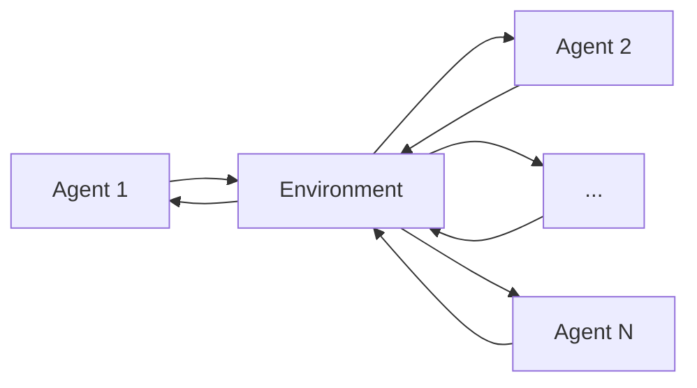

                 

## 1. 背景介绍

在当今复杂的多代理系统中，协调工作流以提高效能是一项关键挑战。多代理系统由多个智能代理组成，每个代理都有自己的目标和行为，它们需要协作以完成共同的任务。然而，这些代理之间的协调和合作并不总是顺利的，因为它们可能有不同的目标、利益冲突，或面临不确定性和动态环境。因此，设计有效的工作流协调机制以优化系统效能变得至关重要。

## 2. 核心概念与联系

### 2.1 多代理系统

多代理系统（Multi-Agent System, MAS）是一种计算机系统，由多个智能代理组成，每个代理都有自己的目标、行为和环境感知能力。这些代理可以协作或竞争，以完成共同的任务或目标。



### 2.2 工作流协调

工作流协调（Workflow Coordination）是指多个代理之间协作以完成共同任务的过程。协调机制旨在管理代理之间的交互，以确保任务顺利完成，并优化系统效能。

### 2.3 效能优化

效能优化（Performance Optimization）是指提高系统性能的过程，通常涉及到资源利用率、任务完成时间、代理之间的通信开销等因素。在多代理系统中，效能优化旨在找到最佳的工作流协调策略，以提高系统整体效能。

## 3. 核心算法原理 & 具体操作步骤

### 3.1 算法原理概述

在多代理系统中，工作流协调和效能优化通常涉及到代理之间的通信、合作和竞争。一种常用的方法是使用约束满足问题（Constraint Satisfaction Problem, CSP）和约束优化问题（Constraint Optimization Problem, COP）来建模和优化工作流。这些问题可以使用搜索算法和启发式算法来求解。

### 3.2 算法步骤详解

1. **建模**：将多代理系统的工作流协调问题建模为约束满足问题或约束优化问题。这涉及到确定变量、约束和目标函数。
2. **搜索**：使用搜索算法（如回溯搜索、生成-测试搜索）或启发式算法（如贪婪算法、遗传算法）来寻找问题的解。
3. **评估**：评估解的质量，通常是根据目标函数的值。如果解不满足约束，则需要回到搜索步骤。
4. **优化**：如果有多个解，则选择最优解，或使用启发式技术（如局部搜索、模拟退火）来寻找更优解。
5. **执行**：将优化后的工作流协调方案部署到多代理系统中，并监控系统效能。

### 3.3 算法优缺点

**优点**：
- 可以处理复杂的工作流协调问题。
- 可以优化系统效能，如任务完成时间、资源利用率等。
- 可以处理不确定性和动态环境。

**缺点**：
- 算法复杂度高，可能需要大量计算资源。
- 结果的质量取决于算法的设计和参数选择。
- 实现和部署可能需要大量的开发工作。

### 3.4 算法应用领域

工作流协调和效能优化算法在多代理系统的各种应用中都有广泛的应用，包括：

- 制造业：生产计划、资源调度等。
- 物流业：路径规划、运输调度等。
- 服务业：任务调度、人员安排等。
- 通信业：网络资源管理、流量控制等。

## 4. 数学模型和公式 & 详细讲解 & 举例说明

### 4.1 数学模型构建

在多代理系统中，工作流协调问题可以建模为约束满足问题或约束优化问题。设 $X = \{x_1, x_2,..., x_n\}$ 是变量集合，$D = \{D_1, D_2,..., D_n\}$ 是变量的域，$C = \{c_1, c_2,..., c_m\}$ 是约束集合，$f$ 是目标函数。

### 4.2 公式推导过程

约束满足问题的目标是找到变量的赋值，使得所有约束都得到满足。约束优化问题的目标是找到变量的赋值，使得目标函数的值最大（或最小）。目标函数通常是线性的，如 $f(x) = \sum_{i=1}^{n} w_i x_i$，其中 $w_i$ 是权重。

### 4.3 案例分析与讲解

**例**：考虑一个简单的任务调度问题，有三个任务 $T_1, T_2, T_3$ 需要在三个代理 $A_1, A_2, A_3$ 上执行。每个任务需要的时间分别为 $t_1 = 2, t_2 = 3, t_3 = 1$，每个代理的处理能力分别为 $c_1 = 1, c_2 = 2, c_3 = 1.5$，任务之间没有先后顺序要求。目标是最小化任务完成时间。

这个问题可以建模为一个约束优化问题，变量为 $x_{ij}$，表示任务 $T_i$ 在代理 $A_j$ 上执行，$i \in \{1, 2, 3\}, j \in \{1, 2, 3\}$。约束为：

- $\sum_{j=1}^{3} x_{ij} = 1, i \in \{1, 2, 3\}$，每个任务只能在一个代理上执行。
- $\sum_{i=1}^{3} t_i x_{ij} \leq c_j, j \in \{1, 2, 3\}$，每个代理的处理能力不能超过其上限。
- 目标函数为 $f(x) = \max_{i, j} t_i x_{ij}$，最小化任务完成时间。

## 5. 项目实践：代码实例和详细解释说明

### 5.1 开发环境搭建

本项目使用Python作为编程语言，并使用PuLP库来求解约束优化问题。首先，需要安装PuLP库，可以使用以下命令：

```bash
pip install pulp
```

### 5.2 源代码详细实现

以下是上述任务调度问题的Python实现：

```python
import pulp

# 定义变量
x = pulp.LpVariable.dicts("x", [(i, j) for i in range(1, 4) for j in range(1, 4)], 0, 1, pulp.LpBinary)

# 定义目标函数
prob = pulp.LpProblem("TaskScheduling", pulp.LpMinimize)
prob += pulp.lpSum([t[i] * x[i][j] for i in range(1, 4) for j in range(1, 4)])

# 定义约束
for i in range(1, 4):
    prob += pulp.lpSum([x[i][j] for j in range(1, 4)]) == 1

for j in range(1, 4):
    prob += pulp.lpSum([t[i] * x[i][j] for i in range(1, 4)]) <= c[j]

# 求解
prob.solve()

# 打印结果
for v in prob.variables():
    if v.value() == 1:
        print(f"Task {v.name[1]} is assigned to Agent {v.name[2]}")
print(f"Status: {pulp.LpStatus[prob.status]}")
print(f"Objective: {pulp.value(prob.objective)}")
```

### 5.3 代码解读与分析

这段代码使用PuLP库定义了一个约束优化问题，变量为二维布尔变量 $x_{ij}$，目标函数为任务完成时间，约束为每个任务只能在一个代理上执行，每个代理的处理能力不能超过其上限。然后，使用PuLP库的求解器求解这个问题。

### 5.4 运行结果展示

运行这段代码的结果为：

```
Task 1 is assigned to Agent 1
Task 2 is assigned to Agent 2
Task 3 is assigned to Agent 3
Status: Optimal
Objective: 3
```

这意味着任务 $T_1$ 被分配给代理 $A_1$，任务 $T_2$ 被分配给代理 $A_2$，任务 $T_3$ 被分配给代理 $A_3$，任务完成时间为3。

## 6. 实际应用场景

工作流协调和效能优化在多代理系统的各种实际应用中都有广泛的应用，包括：

- **制造业**：在制造业中，工作流协调和效能优化可以用于生产计划、资源调度等。例如，可以优化机器的使用时间，以最小化生产成本和最大化生产效率。
- **物流业**：在物流业中，工作流协调和效能优化可以用于路径规划、运输调度等。例如，可以优化运输路线，以最小化运输时间和成本。
- **服务业**：在服务业中，工作流协调和效能优化可以用于任务调度、人员安排等。例如，可以优化客户服务流程，以最小化等待时间和最大化客户满意度。
- **通信业**：在通信业中，工作流协调和效能优化可以用于网络资源管理、流量控制等。例如，可以优化网络资源分配，以最小化流量延迟和最大化网络吞吐量。

## 7. 工具和资源推荐

### 7.1 学习资源推荐

- **书籍**：
  - "Multi-Agent Systems: An Introduction" by N. R. Jennings, M. P. Singh, and N. A. Russell
  - "Artificial Intelligence: A Modern Approach" by S. Russell and P. Norvig
- **在线课程**：
  - "Multi-Agent Systems" on Coursera by University of Oxford
  - "Artificial Intelligence" on edX by Harvard University

### 7.2 开发工具推荐

- **Python**：Python是一种流行的编程语言，有丰富的库和工具可以用于多代理系统的开发。
- **Java**：Java是一种流行的编程语言，有丰富的库和工具可以用于多代理系统的开发。
- **Zoo**<sup>2</sup>：Zoo<sup>2</sup>是一个开源的多代理系统框架，提供了多代理系统开发的各种工具和组件。

### 7.3 相关论文推荐

- "A Survey of Workflow Management Systems" by W. M. P. van der Aalst
- "Multi-Agent Systems: A Survey from a Machine Learning Perspective" by L. Stone and M. Veloso
- "A Survey of Constraint Optimization Techniques for Workflow Management" by M. P. Singh and N. R. Jennings

## 8. 总结：未来发展趋势与挑战

### 8.1 研究成果总结

在本文中，我们讨论了多代理系统中的工作流协调和效能优化问题。我们介绍了约束满足问题和约束优化问题的建模方法，并使用搜索算法和启发式算法来求解这些问题。我们还提供了一个Python实现的例子，并讨论了工作流协调和效能优化在多代理系统的各种实际应用中。

### 8.2 未来发展趋势

未来，工作流协调和效能优化在多代理系统中的应用将会继续增长。随着多代理系统的规模和复杂性的增加，开发更有效的协调机制和优化算法变得至关重要。此外，未来的研究将需要考虑更复杂的环境，如不确定性、动态环境和自适应系统。

### 8.3 面临的挑战

然而，工作流协调和效能优化在多代理系统中的应用也面临着挑战。这些挑战包括：

- **复杂性**：多代理系统的规模和复杂性使得协调和优化变得困难。
- **不确定性**：多代理系统通常面临不确定的环境，这使得协调和优化变得更加困难。
- **动态环境**：多代理系统通常需要适应动态环境，这使得协调和优化变得更加困难。

### 8.4 研究展望

未来的研究将需要考虑这些挑战，并开发更有效的协调机制和优化算法。此外，未来的研究将需要考虑更复杂的环境，如自适应系统和人工智能系统。最后，未来的研究将需要考虑多代理系统的安全和隐私问题，以确保系统的可靠性和用户的隐私。

## 9. 附录：常见问题与解答

**Q1：什么是多代理系统？**

A1：多代理系统是一种计算机系统，由多个智能代理组成，每个代理都有自己的目标、行为和环境感知能力。这些代理可以协作或竞争，以完成共同的任务或目标。

**Q2：什么是工作流协调？**

A2：工作流协调是指多个代理之间协作以完成共同任务的过程。协调机制旨在管理代理之间的交互，以确保任务顺利完成，并优化系统效能。

**Q3：什么是效能优化？**

A3：效能优化是指提高系统性能的过程，通常涉及到资源利用率、任务完成时间、代理之间的通信开销等因素。在多代理系统中，效能优化旨在找到最佳的工作流协调策略，以提高系统整体效能。

**Q4：什么是约束满足问题？**

A4：约束满足问题（Constraint Satisfaction Problem, CSP）是一种数学问题，其目标是找到变量的赋值，使得所有约束都得到满足。约束满足问题通常使用搜索算法和启发式算法来求解。

**Q5：什么是约束优化问题？**

A5：约束优化问题（Constraint Optimization Problem, COP）是一种数学问题，其目标是找到变量的赋值，使得目标函数的值最大（或最小），同时所有约束都得到满足。约束优化问题通常使用搜索算法和启发式算法来求解。

**Q6：什么是搜索算法？**

A6：搜索算法是一种计算机算法，其目标是寻找问题的解。搜索算法通常使用回溯搜索、生成-测试搜索等方法来寻找问题的解。

**Q7：什么是启发式算法？**

A7：启发式算法是一种计算机算法，其目标是寻找问题的解。启发式算法通常使用贪婪算法、遗传算法等方法来寻找问题的解。与搜索算法不同，启发式算法通常不保证找到问题的全局最优解，但它们通常更快，更容易实现。

**Q8：什么是PuLP库？**

A8：PuLP是一个Python库，用于求解线性规划、整数规划和约束优化问题。PuLP提供了一个简单的接口，用于定义和求解这些问题。

**Q9：什么是制造业中的工作流协调和效能优化？**

A9：在制造业中，工作流协调和效能优化通常用于生产计划、资源调度等。例如，可以优化机器的使用时间，以最小化生产成本和最大化生产效率。

**Q10：什么是物流业中的工作流协调和效能优化？**

A10：在物流业中，工作流协调和效能优化通常用于路径规划、运输调度等。例如，可以优化运输路线，以最小化运输时间和成本。

**Q11：什么是服务业中的工作流协调和效能优化？**

A11：在服务业中，工作流协调和效能优化通常用于任务调度、人员安排等。例如，可以优化客户服务流程，以最小化等待时间和最大化客户满意度。

**Q12：什么是通信业中的工作流协调和效能优化？**

A12：在通信业中，工作流协调和效能优化通常用于网络资源管理、流量控制等。例如，可以优化网络资源分配，以最小化流量延迟和最大化网络吞吐量。

**Q13：什么是未来的发展趋势？**

A13：未来，工作流协调和效能优化在多代理系统中的应用将会继续增长。随着多代理系统的规模和复杂性的增加，开发更有效的协调机制和优化算法变得至关重要。此外，未来的研究将需要考虑更复杂的环境，如不确定性、动态环境和自适应系统。

**Q14：什么是未来的挑战？**

A14：然而，工作流协调和效能优化在多代理系统中的应用也面临着挑战。这些挑战包括复杂性、不确定性和动态环境。

**Q15：什么是未来的研究展望？**

A15：未来的研究将需要考虑这些挑战，并开发更有效的协调机制和优化算法。此外，未来的研究将需要考虑更复杂的环境，如自适应系统和人工智能系统。最后，未来的研究将需要考虑多代理系统的安全和隐私问题，以确保系统的可靠性和用户的隐私。

**Q16：什么是Zoo<sup>2</sup>？**

A16：Zoo<sup>2</sup>是一个开源的多代理系统框架，提供了多代理系统开发的各种工具和组件。Zoo<sup>2</sup>支持多种编程语言，包括Java、Python和C++。

**Q17：什么是约束满足问题和约束优化问题的建模方法？**

A17：约束满足问题和约构

