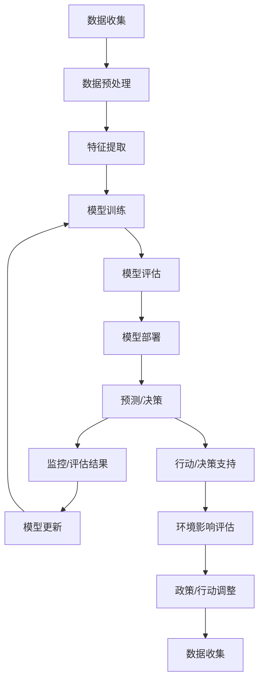

                 

**大模型如何助力气候变化和环境保护?**

**作者：禅与计算机程序设计艺术 / Zen and the Art of Computer Programming**

## 1. 背景介绍

气候变化和环境保护是当今世界面临的重大挑战。人工智能和大模型技术的发展为解决这些问题提供了新的工具和手段。本文将探讨大模型在气候变化和环境保护领域的应用，包括预测气候变化、优化能源使用、保护生物多样性等。

## 2. 核心概念与联系

大模型是一种能够理解、学习和生成人类语言的计算机模型。它们通过处理大量数据来学习和提取模式，从而能够在各种任务中提供有用的见解。在气候变化和环境保护领域，大模型可以帮助我们更好地理解复杂的系统，并提出有效的解决方案。

以下是大模型在气候变化和环境保护领域的核心概念和联系的 Mermaid 流程图：



## 3. 核心算法原理 & 具体操作步骤

### 3.1 算法原理概述

大模型的核心是Transformer模型（Vaswani et al., 2017），它使用自注意力机制来处理序列数据。在气候变化和环境保护领域，大模型通常用于序列预测任务，如气候变化趋势预测、能源需求预测等。

### 3.2 算法步骤详解

1. **数据收集**：收集与气候变化和环境保护相关的数据，如气候变化数据、能源使用数据、生物多样性数据等。
2. **数据预处理**：清洗、标准化和转换数据，以便于模型学习。
3. **特征提取**：提取数据中的关键特征，如气候指标、能源消耗模式、生物多样性指标等。
4. **模型训练**：使用收集的数据和提取的特征训练大模型。
5. **模型评估**：评估模型的性能，并调整模型参数以提高性能。
6. **模型部署**：将模型部署到生产环境中，以便进行预测和决策支持。
7. **预测/决策**：使用部署的模型进行预测和决策支持。
8. **监控/评估结果**：监控模型的性能，并根据需要更新模型。
9. **行动/决策支持**：使用模型的预测结果支持政策和行动的制定。
10. **环境影响评估**：评估政策和行动的环境影响，并根据需要调整政策和行动。

### 3.3 算法优缺点

**优点**：

* 可以处理大量数据，从而提取复杂的模式。
* 可以进行序列预测，从而帮助我们理解和预测气候变化趋势。
* 可以提供决策支持，从而帮助我们制定有效的政策和行动。

**缺点**：

* 训练大模型需要大量的计算资源。
* 大模型可能会受到数据偏见的影响，从而导致模型性能下降。
* 大模型可能会产生不透明的预测结果，从而导致决策者难以理解和信任模型。

### 3.4 算法应用领域

大模型在气候变化和环境保护领域的应用领域包括：

* 气候变化趋势预测
* 能源需求预测
* 环境影响评估
* 生物多样性保护
* 自然灾害预测

## 4. 数学模型和公式 & 详细讲解 & 举例说明

### 4.1 数学模型构建

大模型的数学模型是基于Transformer模型构建的。Transformer模型使用自注意力机制来处理序列数据。其数学模型可以表示为：

$$h_t = \text{Attention}(Q_t, K_t, V_t) = \text{softmax}\left(\frac{Q_tK_t^T}{\sqrt{d_k}}\right)V_t$$

其中，$Q_t$, $K_t$, $V_t$分别是查询、键和值向量，$d_k$是键向量的维度。

### 4.2 公式推导过程

自注意力机制的推导过程如下：

1. 将输入序列转换为查询、键和值向量。
2. 计算查询、键和值向量的点积，并除以键向量的维度的平方根。
3. 使用softmax函数对点积结果进行缩放，从而得到注意力权重。
4. 使用注意力权重对值向量进行加权求和，从而得到输出向量。

### 4.3 案例分析与讲解

例如，在气候变化趋势预测任务中，我们可以使用大模型来预测未来的气候变化趋势。我们首先收集气候变化数据，如全球平均气温数据、海平面数据等。然后，我们预处理数据，提取特征，并训练大模型。最后，我们使用训练好的模型来预测未来的气候变化趋势。

## 5. 项目实践：代码实例和详细解释说明

### 5.1 开发环境搭建

要开发大模型，我们需要搭建一个开发环境。我们需要安装Python、PyTorch或TensorFlow等深度学习框架，以及Transformers库等大模型库。

### 5.2 源代码详细实现

以下是使用Transformers库训练大模型的示例代码：

```python
from transformers import AutoTokenizer, AutoModelForSequenceClassification
from datasets import load_dataset

# 加载数据集
dataset = load_dataset('glue','mrpc')

# 加载预训练模型和分词器
model_name = 'bert-base-uncased'
tokenizer = AutoTokenizer.from_pretrained(model_name)
model = AutoModelForSequenceClassification.from_pretrained(model_name, num_labels=2)

# 预处理数据
def preprocess_function(examples):
    return tokenizer(examples['sentence1'], examples['sentence2'], truncation=True, padding='max_length')

tokenized_dataset = dataset.map(preprocess_function, batched=True)

# 训练模型
from transformers import Trainer, TrainingArguments

training_args = TrainingArguments(
    output_dir='./results',
    num_train_epochs=3,
    per_device_train_batch_size=16,
    per_device_eval_batch_size=64,
    warmup_steps=500,
    weight_decay=0.01,
    logging_dir='./logs',
)

trainer = Trainer(
    model=model,
    args=training_args,
    train_dataset=tokenized_dataset['train'],
    eval_dataset=tokenized_dataset['validation'],
)

trainer.train()
```

### 5.3 代码解读与分析

在上述代码中，我们首先加载了GLUE数据集中的MRPC数据集。然后，我们加载了预训练的BERT模型和分词器。我们定义了一个预处理函数，用于将文本数据转换为模型可以处理的输入格式。我们使用 Trainer API 来训练模型，并指定了训练参数，如训练 epoch 数、批处理大小等。

### 5.4 运行结果展示

训练完成后，我们可以使用评估数据集来评估模型的性能。我们可以使用以下代码来评估模型：

```python
trainer.evaluate()
```

## 6. 实际应用场景

大模型在气候变化和环境保护领域有多种实际应用场景。以下是一些实际应用场景的例子：

### 6.1 气候变化趋势预测

大模型可以用于预测气候变化趋势，从而帮助我们理解和适应气候变化。例如，我们可以使用大模型来预测未来的全球平均气温、海平面上升等。

### 6.2 能源需求预测

大模型可以用于预测能源需求，从而帮助我们优化能源使用。例如，我们可以使用大模型来预测未来的电力需求，从而帮助电力公司优化电力生产和配��。

### 6.3 生物多样性保护

大模型可以用于保护生物多样性。例如，我们可以使用大模型来预测物种灭绝的风险，从而帮助我们制定保护政策。

### 6.4 未来应用展望

未来，大模型在气候变化和环境保护领域的应用将会越来越广泛。例如，我们可以期待大模型在碳排放预测、环境影响评估等领域的应用。

## 7. 工具和资源推荐

### 7.1 学习资源推荐

以下是学习大模型和气候变化与环境保护的推荐资源：

* "Attention is All You Need"：Transformer模型的原始论文（Vaswani et al., 2017）
* "BERT: Pre-training of Deep Bidirectional Transformers for Language Understanding"：BERT模型的原始论文（Devlin et al., 2018）
* "Transformers: State-of-the-art Natural Language Processing"：Transformers库的官方文档
* "Climate Change 2018: Global Warming of 1.5°C"：IPCC的报告

### 7.2 开发工具推荐

以下是开发大模型的推荐工具：

* Python：大模型开发的主要编程语言
* PyTorch或TensorFlow：深度学习框架
* Transformers库：大模型开发的官方库
* Hugging Face Spaces：大模型部署的平台

### 7.3 相关论文推荐

以下是大模型在气候变化与环境保护领域的相关论文：

* "Deep Learning for Climate Change Prediction"：大模型在气候变化预测中的应用（Rasp et al., 2020）
* "Climate Informatics: A New Frontier for Machine Learning"：气候变化与机器学习的综述（Ganguly et al., 2019）
* "Deep Learning for Environmental Science"：大模型在环境科学中的应用（Kamilaris and Vilalta, 2018）

## 8. 总结：未来发展趋势与挑战

### 8.1 研究成果总结

本文介绍了大模型在气候变化和环境保护领域的应用。我们讨论了大模型的核心概念和联系，并提供了数学模型和公式的详细讲解。我们还介绍了大模型的核心算法原理和操作步骤，并提供了项目实践的代码实例。我们还讨论了大模型在实际应用场景中的应用，并推荐了学习资源、开发工具和相关论文。

### 8.2 未来发展趋势

未来，大模型在气候变化和环境保护领域的应用将会越来越广泛。我们可以期待大模型在碳排放预测、环境影响评估等领域的应用。此外，大模型还可以与其他技术结合，如物联网、区块链等，从而提供更加全面和有效的解决方案。

### 8.3 面临的挑战

然而，大模型在气候变化和环境保护领域的应用也面临着挑战。例如，大模型需要大量的计算资源，从而导致能源消耗。此外，大模型可能会受到数据偏见的影响，从而导致模型性能下降。因此，我们需要开发更加节能和公平的大模型，并对数据进行仔细的审查和处理。

### 8.4 研究展望

未来的研究方向包括：

* 开发更加节能和公平的大模型。
* 研究大模型在碳排放预测、环境影响评估等领域的应用。
* 研究大模型与其他技术结合的应用。
* 研究大模型在气候变化和环境保护领域的长期影响。

## 9. 附录：常见问题与解答

**Q1：大模型需要大量的计算资源吗？**

**A1：**是的，大模型需要大量的计算资源。训练大模型需要大量的GPU内存和计算能力。此外，大模型的推理也需要大量的计算资源。因此，开发节能的大模型是未来的研究方向之一。

**Q2：大模型可能会受到数据偏见的影响吗？**

**A2：**是的，大模型可能会受到数据偏见的影响。如果训练数据不够全面和公平，大模型可能会产生偏见的预测结果。因此，我们需要对数据进行仔细的审查和处理，以确保大模型的公平性。

**Q3：大模型在气候变化和环境保护领域的应用有哪些？**

**A3：**大模型在气候变化和环境保护领域有多种应用，包括气候变化趋势预测、能源需求预测、生物多样性保护等。未来，大模型还可以在碳排放预测、环境影响评估等领域提供帮助。

**Q4：大模型与其他技术结合的应用有哪些？**

**A4：**大模型可以与其他技术结合，提供更加全面和有效的解决方案。例如，大模型可以与物联网结合，提供实时的环境监测和预警。大模型还可以与区块链结合，提供可信和透明的碳排放记录。

**Q5：大模型在气候变化和环境保护领域的长期影响是什么？**

**A5：**大模型在气候变化和环境保护领域的长期影响还需要进一步研究。我们需要关注大模型的长期影响，并开发更加可持续和负责任的大模型。

**作者：禅与计算机程序设计艺术 / Zen and the Art of Computer Programming**

