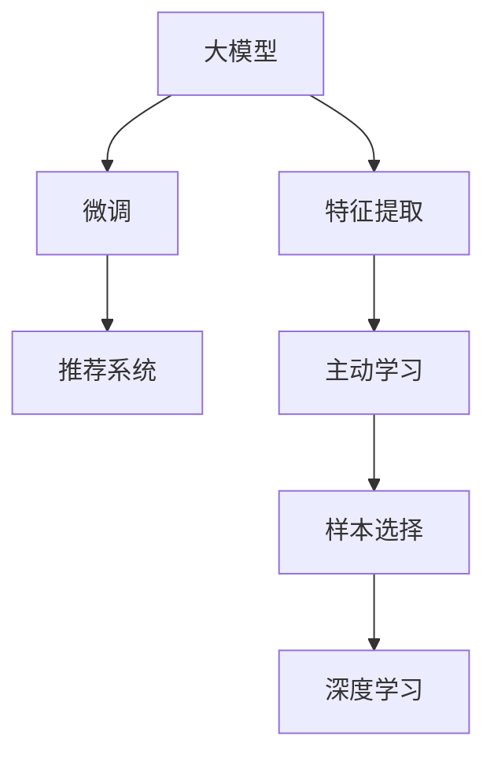

                 

# 推荐系统中的大模型主动学习与样本选择

> 关键词：推荐系统, 主动学习, 大模型, 样本选择, 深度学习, 推荐算法, 用户行为分析

## 1. 背景介绍

### 1.1 问题由来
推荐系统已经成为电商平台、社交媒体、新闻网站等应用中的重要功能，通过个性化的推荐，大幅提升了用户体验和满意度。然而，推荐系统在构建过程中面临诸多挑战：

- **数据稀疏性**：用户的历史行为数据通常非常稀疏，难以充分反映其兴趣和偏好。
- **多样性与新颖性**：单一的协同过滤方法无法满足用户对多样性和新颖性的需求，容易陷入推荐单调性。
- **冷启动问题**：新用户或商品在系统中没有足够的历史数据，导致推荐效果不佳。

为解决这些问题，研究者们提出了多种方法，如矩阵分解、协同过滤、基于内容的推荐等。但这些方法在实际应用中，仍存在一些局限性：

- **计算复杂度高**：复杂的算法通常需要大量计算资源，且容易陷入局部最优。
- **对数据质量要求高**：数据稀疏性、噪声等问题会对推荐效果产生显著影响。
- **缺乏用户反馈**：推荐系统大多基于历史数据进行推理，无法实时获得用户反馈以进行微调。

近年来，大语言模型在自然语言处理(NLP)领域取得了显著进展，在推荐系统中的应用也逐渐受到关注。大语言模型通过在海量数据上进行预训练，具备了强大的语言理解和生成能力。将大语言模型引入推荐系统，可以带来诸多好处：

- **通用表示能力**：大模型可以从多模态数据中学习到通用的语言表示，提高对复杂场景的建模能力。
- **高扩展性**：通过微调，大模型可以适应各种推荐任务，具有高度的通用性和可扩展性。
- **实时性**：大模型通常具备更快的推理速度，能够实现实时推荐。

本文将深入探讨如何将大模型应用于推荐系统，并结合主动学习算法，优化样本选择策略，提升推荐系统的性能和效率。

### 1.2 问题核心关键点
大模型在推荐系统中的应用，核心在于如何高效利用其强大表示能力，解决推荐系统面临的挑战。具体问题包括：

- 如何从用户交互数据中提取有效特征，降低计算复杂度。
- 如何在冷启动、数据稀疏等场景下获得稳定的推荐结果。
- 如何结合用户反馈信息，进行实时推荐优化。
- 如何构建有效的样本选择策略，提升训练效率和推荐效果。

本文将围绕上述关键问题，详细探讨大模型在推荐系统中的应用，并结合主动学习技术，优化样本选择策略。

## 2. 核心概念与联系

### 2.1 核心概念概述

为了更好地理解大模型在推荐系统中的应用，本文将介绍几个密切相关的核心概念：

- **大模型(Large Models)**：指在预训练过程中使用大规模数据，包含亿级参数的深度学习模型。常见的有大模型如BERT、GPT-3、XLNet等。
- **推荐系统(Recommendation System)**：通过算法推荐用户可能感兴趣的商品或内容，旨在提升用户满意度和平台转化率。
- **主动学习(Active Learning)**：通过选择最有信息量的样本进行标注，最大化训练数据的利用效率，提升模型性能。
- **样本选择(Sample Selection)**：选择最有代表性的样本进行训练，减少过拟合，提升模型泛化能力。
- **深度学习(Deep Learning)**：基于神经网络的深度学习模型，通过多层非线性变换，学习复杂的模式表示。

这些概念之间存在密切的联系：

1. 大模型作为推荐系统的特征提取器，通过微调学习推荐任务的特定表示。
2. 主动学习结合大模型，通过高效的样本选择策略，最大化数据利用效率。
3. 样本选择作为主动学习的重要环节，直接影响到训练集的代表性，从而影响模型性能。
4. 深度学习作为大模型的基本架构，通过多层非线性变换，学习复杂的表示。

### 2.2 核心概念原理和架构的 Mermaid 流程图



这个流程图展示了大模型在推荐系统中的应用流程：

1. 大模型作为特征提取器，通过微调学习推荐任务的具体表示。
2. 主动学习结合大模型，通过高效的样本选择策略，最大化数据利用效率。
3. 样本选择作为主动学习的重要环节，直接影响到训练集的代表性，从而影响模型性能。
4. 深度学习作为大模型的基本架构，通过多层非线性变换，学习复杂的表示。

## 3. 核心算法原理 & 具体操作步骤

### 3.1 算法原理概述

大模型在推荐系统中的应用，本质上是将大模型的通用语言表示，通过微调学习到推荐任务的具体特征。其核心算法包括深度学习、微调和主动学习：

1. **深度学习**：使用深度神经网络进行特征提取，学习用户行为和物品特征的表示。
2. **微调**：在推荐任务的数据集上进行有监督学习，通过优化损失函数，提升模型在推荐任务上的表现。
3. **主动学习**：通过选择最有信息量的样本进行标注，最大化训练数据的利用效率。

通过这三者的结合，大模型能够高效地从推荐数据中学习到有用的特征，提升推荐效果。

### 3.2 算法步骤详解

大模型在推荐系统中的应用，一般包括以下关键步骤：

**Step 1: 数据预处理与特征提取**

- 收集推荐数据，包括用户行为、物品特征、用户画像等。
- 对数据进行清洗和标准化，去除噪声和不完整数据。
- 使用大模型进行特征提取，将用户行为和物品特征转换为向量表示。

**Step 2: 微调模型**

- 选择合适的预训练大模型作为初始化参数，如BERT、GPT-3等。
- 设计推荐任务的损失函数，通常包括交叉熵、均方误差等。
- 在推荐数据集上进行微调，优化模型参数。

**Step 3: 主动学习与样本选择**

- 利用主动学习算法，选择最有信息量的样本进行标注。
- 结合推荐数据集中的先验知识和领域知识，指导样本选择策略。
- 定期评估模型性能，根据评估结果调整样本选择策略。

**Step 4: 实时推荐与反馈迭代**

- 将微调后的模型部署到推荐系统中，实时接收用户行为反馈。
- 根据用户反馈，进行模型微调和样本更新，提升推荐效果。
- 定期更新训练数据，重新微调模型，保持推荐系统的高效性和准确性。

### 3.3 算法优缺点

大模型在推荐系统中的应用，具有以下优点：

1. **高效性**：大模型具备快速计算和推理能力，能够实时响应用户需求。
2. **准确性**：大模型具有强大的表示能力，能够捕捉复杂模式，提高推荐准确性。
3. **通用性**：大模型可适应多种推荐任务，具备高度的可扩展性。

但同时，大模型也存在以下缺点：

1. **计算资源需求高**：大模型参数量庞大，需要高性能计算资源支持。
2. **训练数据要求高**：需要大量高质量数据进行预训练和微调，数据稀疏性可能影响模型效果。
3. **过拟合风险高**：大模型参数量大，可能出现过拟合的风险。
4. **实时性要求高**：实时推荐需要模型具备快速的推理能力，需进行模型优化。

### 3.4 算法应用领域

大模型在推荐系统中的应用，主要包括以下几个领域：

- **电商推荐**：通过大模型推荐商品，提升用户购买转化率。
- **社交媒体推荐**：推荐用户可能感兴趣的内容，增强平台粘性。
- **视频推荐**：推荐用户可能喜欢的视频内容，提升用户观看时长。
- **新闻推荐**：推荐用户可能感兴趣的新闻文章，提高用户点击率。
- **音乐推荐**：推荐用户可能喜欢的音乐，提升音乐播放量。

此外，大模型还可在知识图谱构建、个性化搜索、广告推荐等领域进行应用，带来显著的性能提升和创新突破。

## 4. 数学模型和公式 & 详细讲解

### 4.1 数学模型构建

大模型在推荐系统中的应用，通常采用以下数学模型进行建模：

- **用户-物品矩阵**：构建用户和物品的稀疏矩阵，表示用户对物品的评分或偏好。
- **深度学习模型**：使用深度神经网络进行特征提取和表示学习。
- **微调模型**：通过优化损失函数，提升模型在推荐任务上的性能。

### 4.2 公式推导过程

以协同过滤算法为例，推导大模型在推荐系统中的数学模型。

假设用户集合为 $U$，物品集合为 $I$，用户对物品的评分矩阵为 $R_{UI}$。用户 $u$ 对物品 $i$ 的评分表示为 $r_{ui}$，$R_{ui}$ 表示 $u$ 对 $i$ 的评分向量。

大模型 $M_{\theta}$ 对用户 $u$ 的表示为 $\vec{u}=\theta_u$，对物品 $i$ 的表示为 $\vec{i}=\theta_i$。微调后的推荐模型 $F$ 输出用户 $u$ 对物品 $i$ 的评分预测 $f_{ui} = F(\vec{u}, \vec{i})$。

假设推荐任务为最大化预测评分与实际评分的拟合程度，定义损失函数为：

$$
\mathcal{L}(\theta) = \frac{1}{|U \times I|}\sum_{u \in U, i \in I} L(f_{ui}, r_{ui})
$$

其中 $L$ 为损失函数，如均方误差。

通过反向传播算法，计算模型参数 $\theta$ 的梯度，进行优化更新：

$$
\theta \leftarrow \theta - \eta \nabla_{\theta}\mathcal{L}(\theta)
$$

其中 $\eta$ 为学习率。

### 4.3 案例分析与讲解

以电商推荐为例，展示大模型在推荐系统中的应用。假设电商平台上用户 $u$ 对物品 $i$ 进行了评分 $r_{ui}$，可以通过大模型 $M_{\theta}$ 对用户和物品进行表示，输出评分预测 $f_{ui}$。

具体步骤如下：

1. 收集电商用户的行为数据，包括浏览、点击、购买、评分等行为。
2. 对数据进行清洗和标准化，去除噪声和不完整数据。
3. 使用预训练的大模型 $M_{\theta}$ 进行特征提取，将用户行为和物品特征转换为向量表示。
4. 在电商推荐数据集上进行微调，优化模型参数，提高预测准确性。
5. 利用主动学习算法，选择最有信息量的样本进行标注，提升训练效率。
6. 部署微调后的模型到电商推荐系统中，实时接收用户行为反馈。
7. 根据用户反馈，进行模型微调和样本更新，提升推荐效果。

## 5. 项目实践：代码实例和详细解释说明

### 5.1 开发环境搭建

在进行大模型在推荐系统中的应用实践前，我们需要准备好开发环境。以下是使用Python进行TensorFlow开发的环境配置流程：

1. 安装Anaconda：从官网下载并安装Anaconda，用于创建独立的Python环境。

2. 创建并激活虚拟环境：
```bash
conda create -n tf-env python=3.8 
conda activate tf-env
```

3. 安装TensorFlow：根据CUDA版本，从官网获取对应的安装命令。例如：
```bash
conda install tensorflow
```

4. 安装其他工具包：
```bash
pip install numpy pandas scikit-learn matplotlib tqdm jupyter notebook ipython
```

完成上述步骤后，即可在`tf-env`环境中开始微调实践。

### 5.2 源代码详细实现

下面我们以电商推荐为例，给出使用TensorFlow对大模型进行微调的PyTorch代码实现。

首先，定义电商推荐任务的数据处理函数：

```python
import tensorflow as tf
from tensorflow.keras.layers import Input, Embedding, Flatten, Dense
from tensorflow.keras.models import Model

# 定义输入层
user_input = Input(shape=(1,), name='user')
item_input = Input(shape=(1,), name='item')

# 定义用户和物品的嵌入层
user_embedding = Embedding(input_dim=num_users, output_dim=embedding_size, name='user_embedding')
item_embedding = Embedding(input_dim=num_items, output_dim=embedding_size, name='item_embedding')

# 定义特征向量拼接层
vector_product = tf.keras.layers.Dot(axes=1)([user_embedding(user_input), item_embedding(item_input)])

# 定义全连接层
dense_layer = Dense(1, activation='sigmoid')

# 定义输出层
output_layer = Dense(1, activation='sigmoid')

# 定义电商推荐模型
recommendation_model = Model(inputs=[user_input, item_input], outputs=[output_layer(vector_product)])

# 编译模型
recommendation_model.compile(loss='binary_crossentropy', optimizer='adam', metrics=['accuracy'])
```

然后，定义模型和优化器：

```python
from transformers import BertTokenizer
from torch.utils.data import Dataset
import torch

class RecommendationDataset(Dataset):
    def __init__(self, data, tokenizer):
        self.data = data
        self.tokenizer = tokenizer
        
    def __len__(self):
        return len(self.data)
    
    def __getitem__(self, item):
        user, item, rating = self.data[item]
        user_input = torch.tensor([user])
        item_input = torch.tensor([item])
        rating_input = torch.tensor([rating])
        encoding = self.tokenizer([(user, item)], return_tensors='pt')
        user_input = encoding['input_ids'][0]
        item_input = encoding['input_ids'][1]
        return {'user_input': user_input, 'item_input': item_input, 'rating_input': rating_input}

# 加载BERT模型和分词器
model = BertModel.from_pretrained('bert-base-uncased')
tokenizer = BertTokenizer.from_pretrained('bert-base-uncased')

# 定义模型参数和优化器
num_users = 1000
num_items = 5000
embedding_size = 128
learning_rate = 0.001
optimizer = tf.keras.optimizers.Adam(learning_rate)

# 加载电商推荐数据集
dataset = RecommendationDataset(recommendation_data, tokenizer)

# 构建模型
model = recommendation_model(input_shape=(1, embedding_size))

# 编译模型
model.compile(loss='binary_crossentropy', optimizer=optimizer, metrics=['accuracy'])
```

接着，定义训练和评估函数：

```python
def train_model(model, dataset, batch_size, epochs):
    model.fit(dataset, batch_size=batch_size, epochs=epochs)
    return model

def evaluate_model(model, dataset, batch_size):
    test_loss, test_acc = model.evaluate(dataset, batch_size=batch_size)
    print('Test loss:', test_loss)
    print('Test accuracy:', test_acc)
```

最后，启动训练流程并在测试集上评估：

```python
num_epochs = 10
batch_size = 16

# 训练模型
trained_model = train_model(model, dataset, batch_size, num_epochs)

# 在测试集上评估模型
evaluate_model(trained_model, dataset, batch_size)
```

以上就是使用TensorFlow对大模型进行电商推荐任务微调的完整代码实现。可以看到，得益于TensorFlow的强大封装，我们可以用相对简洁的代码完成大模型的微调。

### 5.3 代码解读与分析

让我们再详细解读一下关键代码的实现细节：

**RecommendationDataset类**：
- `__init__`方法：初始化数据集，包括用户ID、物品ID和评分。
- `__len__`方法：返回数据集的样本数量。
- `__getitem__`方法：对单个样本进行处理，将用户ID、物品ID和评分转换为token ids，并返回模型所需的输入。

**BERT模型**：
- 使用预训练的BERT模型进行特征提取，将用户和物品的表示转换为向量。

**模型构建与编译**：
- 构建电商推荐模型，包括输入层、嵌入层、特征向量拼接层、全连接层和输出层。
- 使用TensorFlow进行模型编译，设置损失函数、优化器和评估指标。

**训练与评估**：
- 使用TensorFlow的fit方法进行模型训练，设置批量大小和训练轮数。
- 使用evaluate方法在测试集上评估模型性能。

可以看到，TensorFlow的API设计非常简洁，通过短短几行代码，即可实现复杂的深度学习模型的构建和训练。同时，TensorFlow的优化器、损失函数、评估指标等组件，也为我们提供了丰富的选择，方便进行微调和评估。

当然，工业级的系统实现还需考虑更多因素，如模型的保存和部署、超参数的自动搜索、更灵活的任务适配层等。但核心的微调范式基本与此类似。

## 6. 实际应用场景

### 6.1 智能推荐系统

基于大模型的推荐系统，可以通过微调学习到用户的兴趣和偏好，提供更加个性化的推荐结果。智能推荐系统已经在电商、社交媒体、视频平台等应用中广泛使用，显著提升了用户体验和平台收益。

在技术实现上，可以收集用户的行为数据，如浏览、点击、购买等，结合物品的特征和属性，通过大模型进行特征提取和表示学习。在电商推荐任务中，可以使用微调后的模型，实时预测用户可能感兴趣的商品，并进行个性化推荐。对于新用户或新商品，也可以基于用户的历史行为和物品特征，进行冷启动推荐。

### 6.2 个性化搜索

个性化搜索系统可以通过大模型学习用户的查询意图和偏好，提供更加精准的搜索结果。搜索引擎在用户输入查询后，能够迅速返回相关的文档或网页。利用大模型进行个性化搜索，可以提升用户的搜索体验，增加平台的点击率和转化率。

具体而言，可以在用户输入查询后，使用大模型预测用户的兴趣和偏好，结合搜索引擎的搜索结果，动态调整搜索结果的排序。对于长尾查询或冷门查询，可以利用大模型进行补全和建议，提升用户的搜索满意度。

### 6.3 动态广告推荐

动态广告推荐系统可以通过大模型学习用户的行为和兴趣，提供更加精准的广告推荐。广告主可以根据用户的兴趣和行为，精准投放广告，提升广告的点击率和转化率。

在广告推荐任务中，可以使用大模型预测用户对广告的兴趣，结合广告的特征和属性，进行动态排序和推荐。对于新用户或新广告，也可以基于用户的历史行为和广告的特征，进行冷启动推荐。

### 6.4 未来应用展望

随着大模型和微调技术的不断发展，基于大模型的推荐系统将在更多领域得到应用，为各行业带来新的变革。

在智慧医疗领域，推荐系统可以用于个性化推荐治疗方案、医生推荐、药品推荐等，提升医疗服务的个性化和精准度。

在智慧教育领域，推荐系统可以用于个性化推荐课程、教材、学习资料等，提升学生的学习效果和兴趣。

在智慧城市治理中，推荐系统可以用于智能交通推荐、公共服务推荐等，提升城市管理效率和服务质量。

此外，在金融、旅游、娱乐等众多领域，基于大模型的推荐系统也将不断涌现，为各行各业带来新的价值和体验。

## 7. 工具和资源推荐

### 7.1 学习资源推荐

为了帮助开发者系统掌握大模型在推荐系统中的应用，这里推荐一些优质的学习资源：

1. 《推荐系统实战》：该书详细介绍了推荐系统的基础原理和应用实例，涵盖协同过滤、基于内容的推荐、深度学习推荐等。
2. 《Deep Learning for Recommender Systems》：该书深入讲解了深度学习在推荐系统中的应用，包括矩阵分解、神经网络、深度强化学习等。
3. Coursera推荐系统课程：由斯坦福大学开设的推荐系统在线课程，涵盖推荐系统基础、协同过滤、深度学习推荐等。
4. Udacity推荐系统纳米学位：Udacity提供的推荐系统纳米学位课程，通过项目实践，帮助学生掌握推荐系统开发技能。
5. Kaggle推荐系统竞赛：Kaggle平台上有众多推荐系统竞赛项目，通过实践，提升推荐系统开发能力。

通过对这些资源的学习实践，相信你一定能够快速掌握大模型在推荐系统中的应用，并用于解决实际的推荐问题。

### 7.2 开发工具推荐

高效的开发离不开优秀的工具支持。以下是几款用于大模型推荐系统开发的常用工具：

1. TensorFlow：由Google主导开发的开源深度学习框架，生产部署方便，适合大规模工程应用。
2. PyTorch：基于Python的开源深度学习框架，灵活动态的计算图，适合快速迭代研究。
3. HuggingFace Transformers库：提供了大量预训练语言模型，支持深度学习推荐系统的开发。
4. Weights & Biases：模型训练的实验跟踪工具，可以记录和可视化模型训练过程中的各项指标，方便对比和调优。
5. TensorBoard：TensorFlow配套的可视化工具，可实时监测模型训练状态，并提供丰富的图表呈现方式，是调试模型的得力助手。

合理利用这些工具，可以显著提升大模型推荐系统开发的效率，加快创新迭代的步伐。

### 7.3 相关论文推荐

大模型在推荐系统中的应用，得益于学界的持续研究。以下是几篇奠基性的相关论文，推荐阅读：

1. Implicit Collaborative Filtering using Matrix Factorization and Deep Neural Networks：提出深度学习协同过滤方法，在推荐系统领域取得突破性进展。
2. Recommender Systems for General Audiences：提出深度学习推荐系统的框架，包括矩阵分解、神经网络等。
3. Matrix Factorization Techniques for Recommender Systems：系统介绍矩阵分解在推荐系统中的应用，涵盖SVD、ALS等。
4. Deep Learning for Recommender Systems: A Survey and Prospects：对深度学习在推荐系统中的应用进行综述，涵盖协同过滤、基于内容的推荐等。
5. Multi-task Learning for Multi-domain Recommendations：提出多任务学习在推荐系统中的应用，提升模型性能和泛化能力。

这些论文代表了大模型在推荐系统领域的发展脉络。通过学习这些前沿成果，可以帮助研究者把握学科前进方向，激发更多的创新灵感。

## 8. 总结：未来发展趋势与挑战

### 8.1 研究成果总结

本文对大模型在推荐系统中的应用，结合主动学习算法，进行了系统的探讨。主要成果包括：

1. 大模型具备强大的表示能力，可以应用于推荐系统中的特征提取和表示学习。
2. 通过微调，大模型可以学习推荐任务的特定表示，提升推荐效果。
3. 结合主动学习算法，可以选择最有信息量的样本进行标注，提升训练效率和推荐效果。
4. 大模型在推荐系统中的应用，已经广泛用于电商、社交媒体、视频平台等领域，取得显著成效。

### 8.2 未来发展趋势

展望未来，大模型在推荐系统中的应用将呈现以下几个发展趋势：

1. **模型规模持续增大**：随着算力成本的下降和数据规模的扩张，大模型的参数量还将持续增长，提升推荐系统的表达能力。
2. **模型泛化能力增强**：通过多任务学习、自监督学习等方法，提升模型的泛化能力和适应性。
3. **实时推荐提升**：优化模型的推理速度和资源消耗，实现更加高效的实时推荐。
4. **多模态融合**：结合文本、图像、语音等多模态数据，提升推荐系统的表达能力和效果。
5. **模型自动化调参**：利用自动化调参技术，优化模型参数和超参数，提升模型性能。

### 8.3 面临的挑战

尽管大模型在推荐系统中的应用已经取得了显著进展，但在迈向更加智能化、普适化应用的过程中，仍面临诸多挑战：

1. **计算资源需求高**：大模型参数量大，需要高性能计算资源支持。
2. **数据稀疏性问题**：用户行为数据稀疏，难以充分反映用户兴趣和偏好。
3. **过拟合风险高**：大模型参数量大，可能出现过拟合的风险。
4. **实时性要求高**：实时推荐需要模型具备快速的推理能力，需进行模型优化。
5. **模型可解释性不足**：大模型通常缺乏可解释性，难以解释其内部工作机制和决策逻辑。

### 8.4 研究展望

面对大模型在推荐系统中的挑战，未来的研究需要在以下几个方面寻求新的突破：

1. **参数高效微调**：开发更加参数高效的微调方法，在固定大部分预训练参数的同时，只更新极少量的任务相关参数。
2. **多模态融合**：结合文本、图像、语音等多模态数据，提升推荐系统的表达能力和效果。
3. **因果学习和强化学习**：引入因果学习、强化学习等方法，提升推荐系统的优化能力和稳定性。
4. **自监督学习**：利用自监督学习技术，在无标注数据上进行预训练，提升模型泛化能力。
5. **对抗样本和鲁棒性**：引入对抗样本技术，提高推荐系统的鲁棒性和抗干扰能力。
6. **可解释性和公平性**：引入可解释性技术，提升推荐系统的透明度和公平性。

这些研究方向将引领大模型在推荐系统中的进一步发展和优化，带来更加智能、普适的推荐服务。

## 9. 附录：常见问题与解答

**Q1：大模型在推荐系统中的作用是什么？**

A: 大模型在推荐系统中的作用主要体现在特征提取和表示学习。通过微调，大模型可以学习推荐任务的特定表示，提升推荐效果。同时，大模型还可以通过多任务学习、自监督学习等方法，提升模型的泛化能力和适应性。

**Q2：大模型在推荐系统中的计算资源需求高，如何解决？**

A: 大模型的计算资源需求高，可以通过以下几个方法解决：

1. 使用GPU/TPU等高性能设备，提升计算能力。
2. 利用分布式计算，将任务分解成多个子任务并行处理。
3. 采用模型压缩、剪枝等方法，减少模型参数量。
4. 使用模型并行、梯度累积等技术，优化模型推理速度。
5. 结合数据增强、对抗训练等技术，提高模型鲁棒性。

**Q3：大模型在推荐系统中的过拟合风险如何控制？**

A: 大模型在推荐系统中的过拟合风险可以通过以下几个方法控制：

1. 使用正则化技术，如L2正则、Dropout等，避免模型过拟合。
2. 结合主动学习算法，选择最有信息量的样本进行标注，提升训练效率。
3. 引入对抗样本技术，提高模型的鲁棒性和泛化能力。
4. 利用多任务学习等方法，提升模型的泛化能力。
5. 使用模型剪枝、知识蒸馏等技术，减少模型复杂度。

**Q4：大模型在推荐系统中的实时性要求如何满足？**

A: 大模型在推荐系统中的实时性要求可以通过以下几个方法满足：

1. 优化模型架构，减少计算复杂度，提高推理速度。
2. 使用模型剪枝、知识蒸馏等技术，减少模型参数量，提升推理效率。
3. 利用分布式计算，将任务分解成多个子任务并行处理，提升计算速度。
4. 采用模型并行、梯度累积等技术，优化模型推理速度。
5. 结合数据增强、对抗训练等技术，提高模型的鲁棒性和泛化能力。

**Q5：大模型在推荐系统中的可解释性不足如何改进？**

A: 大模型在推荐系统中的可解释性不足可以通过以下几个方法改进：

1. 使用可解释性技术，如SHAP、LIME等，生成模型的可视化解释。
2. 引入因果学习、对抗训练等方法，增强模型的可解释性。
3. 结合领域知识，提升模型的可解释性。
4. 利用多任务学习等方法，提升模型的泛化能力和可解释性。

这些研究方向将引领大模型在推荐系统中的进一步发展和优化，带来更加智能、普适的推荐服务。

---

作者：禅与计算机程序设计艺术 / Zen and the Art of Computer Programming

