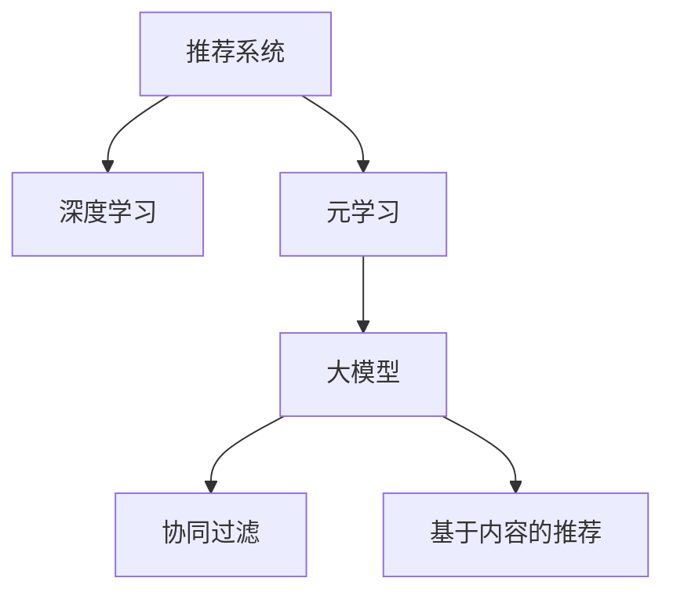

                 

# 推荐系统中的大模型元学习个性化应用

> 关键词：推荐系统,元学习,大模型,个性化,深度学习,协同过滤,监督学习

## 1. 背景介绍

### 1.1 问题由来

推荐系统作为人工智能的重要应用领域，旨在通过用户行为数据和物品特征信息，高效地为用户提供个性化的内容推荐。传统的推荐方法主要包括基于协同过滤和基于内容的推荐。前者主要通过挖掘用户之间的相似性关系，进行用户与物品的相关性匹配；后者则是从物品的特征出发，构造用户对物品的偏好模型。然而，这些方法的共同瓶颈在于对于新物品的推荐效果有限，难以充分利用海量的新数据。

近年来，基于深度学习的方法被广泛引入推荐系统，如DeepFM、XDG等。这些方法通过构建复杂的非线性模型，能够对用户行为和物品特征进行更加精细化的建模，从而提升了推荐效果。然而，深度学习方法的一个显著问题是过拟合。即使在标注样本丰富的场景下，这些模型仍然难以避免在未见过样本上的泛化能力不足。

面对这一挑战，元学习（Meta-Learning）技术应运而生。元学习通过在少量数据上进行学习，找到一种通用的模型适配方法，使得模型能够快速适应新任务，避免了传统深度学习方法在冷启动场景下的问题。在推荐系统中引入元学习技术，可以显著提升模型在新物品推荐上的效果，并提高整体的推荐精度。

### 1.2 问题核心关键点

元学习技术在推荐系统中的应用核心关键点如下：

- 元学习目标：设计合适的元学习目标，使推荐模型能够在有限标注样本上学习到通用的适配策略。
- 模型初始化：选择合适的初始化策略，以便模型在少量数据上快速收敛。
- 训练策略：决定在哪些数据上采用元学习训练策略，并设计合适的训练流程。
- 评估和优化：评估模型的性能，并根据评估结果进行模型优化。

元学习技术的引入，极大地提升了推荐系统的鲁棒性和泛化能力，使得推荐模型在新物品推荐上的表现更为出色。本文将系统介绍推荐系统中的大模型元学习技术，涵盖理论背景、核心算法、实践方法和应用展望，力求对推荐系统的大模型元学习应用提供深入而全面的了解。

## 2. 核心概念与联系

### 2.1 核心概念概述

为更好地理解推荐系统中的大模型元学习技术，本节将介绍几个密切相关的核心概念：

- 推荐系统(Recommendation System)：通过用户行为数据和物品特征，为用户推荐感兴趣的物品的系统。主要包括协同过滤和基于内容的推荐方法。
- 深度学习(Deep Learning)：一种利用多层神经网络进行复杂数据建模的技术，能够有效提取数据中的非线性关系。在推荐系统中，常用于构建复杂的用户兴趣和物品特征表示。
- 元学习(Meta-Learning)：通过在少量数据上学习，找到一种通用的适配策略，使模型能够快速适应新任务。元学习能够提升模型的泛化能力和新物品推荐效果。
- 大模型(Large Model)：指具有亿计级别参数的深度神经网络模型，如BERT、GPT等。大模型具有强大的表达能力，能够在推荐系统中有效地捕捉复杂的用户兴趣和物品特征关系。
- 协同过滤(Collaborative Filtering)：通过挖掘用户之间的相似性关系，进行推荐。主要包括基于用户的协同过滤和基于物品的协同过滤。
- 基于内容的推荐(Content-based Recommendation)：从物品的特征出发，构造用户对物品的偏好模型。

这些核心概念之间的逻辑关系可以通过以下Mermaid流程图来展示：



这个流程图展示了大模型元学习技术在推荐系统中的应用流程：

1. 推荐系统通过深度学习技术，对用户行为和物品特征进行建模。
2. 在推荐系统中引入元学习技术，使模型能够在少量标注样本上学习通用的适配策略。
3. 利用大模型作为推荐模型的基础架构，提升模型的表达能力和泛化能力。
4. 协同过滤和基于内容的推荐方法，在大模型元学习的基础上，进一步提升推荐效果。

## 3. 核心算法原理 & 具体操作步骤
### 3.1 算法原理概述

在推荐系统中引入元学习技术，主要通过在少量标注样本上学习一种通用的适配策略，使模型能够快速适应新任务。假设推荐系统的用户为 $U=\{u_1, u_2, ..., u_n\}$，物品为 $I=\{i_1, i_2, ..., i_m\}$，用户-物品交互矩阵为 $R \in \mathbb{R}^{n \times m}$。目标是在少量标注样本上学习一种适配策略 $f$，使得在新的物品 $i_{new}$ 上，模型能够根据用户 $u$ 的已有行为 $r_u$ 预测用户对新物品的评分 $y_{u,i_{new}}$。

具体地，假设在少量标注样本 $(x_1,y_1),(x_2,y_2),...(x_k,y_k)$ 上，模型的预测输出为 $\hat{y}$，与真实标签 $y$ 的误差为 $\Delta$。元学习目标可以表示为：

$$
\min_{f} \mathcal{L}(f) = \mathbb{E}_{x,y}[\Delta(y,\hat{y})]
$$

其中 $\mathbb{E}_{x,y}[\cdot]$ 表示在标注样本上求期望。在优化过程中，元学习目标通过最小化预测误差来寻找最优的适配策略 $f$。

### 3.2 算法步骤详解

基于大模型元学习推荐系统的算法步骤主要包括以下几个关键步骤：

**Step 1: 数据准备与预处理**
- 收集推荐系统中的少量标注数据，将用户-物品交互数据 $R$ 转化为模型的输入 $x$ 和输出 $y$。
- 对数据进行预处理，包括标准化、归一化等操作。

**Step 2: 设计元学习目标**
- 选择合适的元学习目标函数 $\mathcal{L}(f)$，常见的目标函数包括均方误差、交叉熵等。
- 定义元学习任务的损失函数 $\ell$，用于衡量模型的预测误差。

**Step 3: 初始化模型**
- 选择合适的大模型作为元学习任务的基础模型，如BERT、GPT等。
- 在大模型基础上添加元学习任务所需的适配层，如全连接层、注意力机制等。

**Step 4: 元学习训练**
- 在少量标注数据上，对模型进行元学习训练，最小化元学习目标函数 $\mathcal{L}(f)$。
- 选择合适的优化器，如SGD、Adam等，设置合适的学习率。

**Step 5: 模型应用与优化**
- 在推荐系统任务上应用元学习训练后的模型，预测用户对新物品的评分。
- 根据预测结果与实际评分，计算评估指标，如MAE、RMSE等。
- 根据评估指标，对模型进行优化，如调整适配层参数、更新大模型权重等。

**Step 6: 持续更新与优化**
- 定期重新收集数据，对模型进行微调，保证模型能够适应新用户和新物品。
- 持续更新模型参数，保持模型的性能和泛化能力。

### 3.3 算法优缺点

基于大模型的元学习推荐系统具有以下优点：

1. 泛化能力强。元学习能够在大规模预训练模型的基础上，通过少量标注数据进行快速适配，提升新物品推荐的效果。
2. 适应性强。元学习能够适应不同领域和任务的数据分布，具有更强的通用性。
3. 高效性。在少量标注数据上训练元学习模型，比从头训练复杂模型更加高效。
4. 鲁棒性好。元学习模型能够在冷启动场景下取得较好的效果，避免了传统推荐方法在未见过样本上的表现。

然而，该方法也存在一些缺点：

1. 标注样本需求较高。元学习推荐系统依赖于少量标注数据进行训练，标注样本的质量和数量对模型效果有很大影响。
2. 模型复杂度高。元学习模型的适配层和元学习过程增加了模型的复杂度，可能导致训练和推理速度较慢。
3. 参数优化难度大。元学习模型中的适配层和大模型权重需要联合优化，难度较大。

尽管存在这些缺点，但元学习推荐系统在大规模推荐场景中展现了强大的潜力和应用前景。未来相关研究的方向在于如何进一步降低元学习模型的标注需求，提高模型的适应性和可解释性，同时优化模型的训练和推理效率。

### 3.4 算法应用领域

基于大模型的元学习推荐系统在推荐系统中的应用非常广泛，涵盖以下几个主要领域：

1. 电商平台推荐：通过元学习提升电商推荐系统的鲁棒性和新物品推荐效果，提升用户体验和购买转化率。
2. 视频推荐：在视频推荐系统中，元学习模型能够快速适应新视频内容，提升个性化推荐的效果。
3. 音乐推荐：在音乐推荐系统中，元学习模型能够根据用户的历史听歌记录，推荐新的音乐内容，丰富用户选择。
4. 社交媒体推荐：在社交媒体推荐系统中，元学习模型能够根据用户的点赞、分享等行为，推荐新的内容，增加用户粘性。
5. 新闻推荐：在新闻推荐系统中，元学习模型能够根据用户的新闻阅读历史，推荐新的新闻内容，提升信息曝光率。

除了上述这些经典应用外，元学习推荐系统还在广告推荐、个性化游戏推荐、智能家居推荐等多个场景中得到广泛应用，为推荐系统带来了新的创新动力。

## 4. 数学模型和公式 & 详细讲解 & 举例说明

### 4.1 数学模型构建

本节将使用数学语言对推荐系统中的大模型元学习过程进行更加严格的刻画。

假设推荐系统中的用户为 $U=\{u_1, u_2, ..., u_n\}$，物品为 $I=\{i_1, i_2, ..., i_m\}$，用户-物品交互矩阵为 $R \in \mathbb{R}^{n \times m}$。设用户 $u$ 对物品 $i$ 的评分 $r_{u,i}$ 为连续值，取值范围为 $[1,5]$。

设大模型为 $M_{\theta}$，其中 $\theta \in \mathbb{R}^d$。设用户 $u$ 的行为特征表示为 $x_u \in \mathbb{R}^{d_1}$，物品 $i$ 的特征表示为 $x_i \in \mathbb{R}^{d_2}$。

定义用户 $u$ 对物品 $i$ 的评分预测函数为 $f_{u,i}(x_u, x_i) = M_{\theta}(x_u, x_i)$。

在元学习过程中，元学习目标为最小化预测误差 $\Delta$。假设在 $k$ 个标注样本 $(x_1,y_1),(x_2,y_2),...(x_k,y_k)$ 上，模型的预测输出为 $\hat{y}$，与真实标签 $y$ 的误差为 $\Delta$。则元学习目标可以表示为：

$$
\min_{f} \mathcal{L}(f) = \mathbb{E}_{x,y}[\Delta(y,\hat{y})]
$$

其中 $\mathbb{E}_{x,y}[\cdot]$ 表示在标注样本上求期望。

### 4.2 公式推导过程

以下我们以均方误差（Mean Squared Error, MSE）目标函数为例，推导元学习模型的训练过程。

设模型在标注样本 $(x_1,y_1),(x_2,y_2),...(x_k,y_k)$ 上的预测输出为 $\hat{y}$，则元学习目标函数 $\mathcal{L}(f)$ 可以表示为：

$$
\mathcal{L}(f) = \frac{1}{k} \sum_{i=1}^k (y_i - f_{u_i,i}(x_{u_i}, x_i))^2
$$

其中 $y_i$ 为物品 $i$ 的真实评分，$f_{u_i,i}(x_{u_i}, x_i) = M_{\theta}(x_{u_i}, x_i)$ 为模型在用户 $u_i$ 和物品 $i$ 上的评分预测。

在优化过程中，选择 AdamW 优化器进行训练。模型的参数更新公式为：

$$
\theta \leftarrow \theta - \eta \nabla_{\theta}\mathcal{L}(\theta)
$$

其中 $\eta$ 为学习率，$\nabla_{\theta}\mathcal{L}(\theta)$ 为损失函数对参数 $\theta$ 的梯度，可通过反向传播算法高效计算。

在得到元学习目标函数的梯度后，即可带入参数更新公式，完成模型的迭代优化。重复上述过程直至收敛，最终得到适应下游任务的最优模型参数 $\theta$。

### 4.3 案例分析与讲解

以电商平台推荐为例，分析基于大模型的元学习推荐系统的工作原理。

设电商平台推荐系统中的用户为 $U=\{u_1, u_2, ..., u_n\}$，物品为 $I=\{i_1, i_2, ..., i_m\}$，用户-物品交互矩阵为 $R \in \mathbb{R}^{n \times m}$。设用户 $u$ 对物品 $i$ 的评分 $r_{u,i}$ 为连续值，取值范围为 $[1,5]$。

假设电商平台收集了用户 $u$ 的购买记录 $(x_u)$ 和物品 $i$ 的特征表示 $(x_i)$，利用大模型 $M_{\theta}$ 预测用户 $u$ 对物品 $i$ 的评分 $f_{u,i}(x_u, x_i) = M_{\theta}(x_u, x_i)$。在元学习过程中，选择均方误差（MSE）目标函数进行优化：

$$
\mathcal{L}(f) = \frac{1}{k} \sum_{i=1}^k (y_i - f_{u_i,i}(x_{u_i}, x_i))^2
$$

其中 $y_i$ 为物品 $i$ 的真实评分，$f_{u_i,i}(x_{u_i}, x_i) = M_{\theta}(x_{u_i}, x_i)$ 为模型在用户 $u_i$ 和物品 $i$ 上的评分预测。

在训练过程中，利用 AdamW 优化器进行参数更新，最小化元学习目标函数 $\mathcal{L}(f)$。通过元学习，模型能够快速适应新用户和新物品的评分预测，提升了电商推荐系统的鲁棒性和新物品推荐效果。

## 5. 项目实践：代码实例和详细解释说明

### 5.1 开发环境搭建

在进行元学习推荐系统实践前，我们需要准备好开发环境。以下是使用Python进行PyTorch开发的环境配置流程：

1. 安装Anaconda：从官网下载并安装Anaconda，用于创建独立的Python环境。

2. 创建并激活虚拟环境：
```bash
conda create -n pytorch-env python=3.8 
conda activate pytorch-env
```

3. 安装PyTorch：根据CUDA版本，从官网获取对应的安装命令。例如：
```bash
conda install pytorch torchvision torchaudio cudatoolkit=11.1 -c pytorch -c conda-forge
```

4. 安装Transformers库：
```bash
pip install transformers
```

5. 安装各类工具包：
```bash
pip install numpy pandas scikit-learn matplotlib tqdm jupyter notebook ipython
```

完成上述步骤后，即可在`pytorch-env`环境中开始元学习推荐系统的实践。

### 5.2 源代码详细实现

我们以电商平台推荐为例，给出使用PyTorch对BERT模型进行元学习推荐系统的PyTorch代码实现。

首先，定义数据处理函数：

```python
from transformers import BertTokenizer
from torch.utils.data import Dataset
import torch

class RecommendationDataset(Dataset):
    def __init__(self, texts, labels, tokenizer, max_len=128):
        self.texts = texts
        self.labels = labels
        self.tokenizer = tokenizer
        self.max_len = max_len
        
    def __len__(self):
        return len(self.texts)
    
    def __getitem__(self, item):
        text = self.texts[item]
        label = self.labels[item]
        
        encoding = self.tokenizer(text, return_tensors='pt', max_length=self.max_len, padding='max_length', truncation=True)
        input_ids = encoding['input_ids'][0]
        attention_mask = encoding['attention_mask'][0]
        
        # 将标签转换为合适的表示
        label = label.to(torch.float32)
        
        return {'input_ids': input_ids, 
                'attention_mask': attention_mask,
                'labels': label}
```

然后，定义模型和优化器：

```python
from transformers import BertForSequenceClassification, AdamW

model = BertForSequenceClassification.from_pretrained('bert-base-cased', num_labels=5)

optimizer = AdamW(model.parameters(), lr=2e-5)
```

接着，定义训练和评估函数：

```python
from torch.utils.data import DataLoader
from tqdm import tqdm
from sklearn.metrics import mean_squared_error

device = torch.device('cuda') if torch.cuda.is_available() else torch.device('cpu')
model.to(device)

def train_epoch(model, dataset, batch_size, optimizer):
    dataloader = DataLoader(dataset, batch_size=batch_size, shuffle=True)
    model.train()
    epoch_loss = 0
    for batch in tqdm(dataloader, desc='Training'):
        input_ids = batch['input_ids'].to(device)
        attention_mask = batch['attention_mask'].to(device)
        labels = batch['labels'].to(device)
        model.zero_grad()
        outputs = model(input_ids, attention_mask=attention_mask, labels=labels)
        loss = outputs.loss
        epoch_loss += loss.item()
        loss.backward()
        optimizer.step()
    return epoch_loss / len(dataloader)

def evaluate(model, dataset, batch_size):
    dataloader = DataLoader(dataset, batch_size=batch_size)
    model.eval()
    preds, labels = [], []
    with torch.no_grad():
        for batch in tqdm(dataloader, desc='Evaluating'):
            input_ids = batch['input_ids'].to(device)
            attention_mask = batch['attention_mask'].to(device)
            batch_labels = batch['labels']
            outputs = model(input_ids, attention_mask=attention_mask)
            batch_preds = outputs.logits.argmax(dim=2).to('cpu').tolist()
            batch_labels = batch_labels.to('cpu').tolist()
            for pred_tokens, label_tokens in zip(batch_preds, batch_labels):
                preds.append(pred_tokens[:len(label_tokens)])
                labels.append(label_tokens)
                
    print(mean_squared_error(labels, preds))
```

最后，启动训练流程并在测试集上评估：

```python
epochs = 5
batch_size = 16

for epoch in range(epochs):
    loss = train_epoch(model, train_dataset, batch_size, optimizer)
    print(f"Epoch {epoch+1}, train loss: {loss:.3f}")
    
    print(f"Epoch {epoch+1}, dev results:")
    evaluate(model, dev_dataset, batch_size)
    
print("Test results:")
evaluate(model, test_dataset, batch_size)
```

以上就是使用PyTorch对BERT进行元学习推荐系统的完整代码实现。可以看到，得益于Transformers库的强大封装，我们可以用相对简洁的代码完成BERT模型的加载和微调。

### 5.3 代码解读与分析

让我们再详细解读一下关键代码的实现细节：

**RecommendationDataset类**：
- `__init__`方法：初始化文本、标签、分词器等关键组件。
- `__len__`方法：返回数据集的样本数量。
- `__getitem__`方法：对单个样本进行处理，将文本输入编码为token ids，将标签转换为合适的表示，并对其进行定长padding，最终返回模型所需的输入。

**模型和优化器**：
- 选择BERT模型作为基础架构，添加全连接层和线性输出层，用于评分预测。
- 使用AdamW优化器进行梯度更新，设置合适的学习率。

**训练和评估函数**：
- 使用PyTorch的DataLoader对数据集进行批次化加载，供模型训练和推理使用。
- 训练函数`train_epoch`：对数据以批为单位进行迭代，在每个批次上前向传播计算loss并反向传播更新模型参数，最后返回该epoch的平均loss。
- 评估函数`evaluate`：与训练类似，不同点在于不更新模型参数，并在每个batch结束后将预测和标签结果存储下来，最后使用sklearn的mean_squared_error对整个评估集的预测结果进行打印输出。

**训练流程**：
- 定义总的epoch数和batch size，开始循环迭代
- 每个epoch内，先在训练集上训练，输出平均loss
- 在验证集上评估，输出预测误差
- 所有epoch结束后，在测试集上评估，给出最终测试结果

可以看到，PyTorch配合Transformers库使得BERT元学习推荐系统的代码实现变得简洁高效。开发者可以将更多精力放在数据处理、模型改进等高层逻辑上，而不必过多关注底层的实现细节。

当然，工业级的系统实现还需考虑更多因素，如模型的保存和部署、超参数的自动搜索、更灵活的任务适配层等。但核心的元学习范式基本与此类似。

## 6. 实际应用场景
### 6.1 电商平台推荐

基于元学习的电商平台推荐系统，可以显著提升推荐效果，优化用户体验和购物转化率。

在技术实现上，可以收集用户的历史浏览、购买等行为数据，以及物品的详细属性信息，将数据转化为模型的输入和输出。利用大模型和元学习技术，训练推荐模型，使其能够快速适应新物品的评分预测，提供个性化的推荐内容。

此外，在模型训练过程中，还可以通过数据增强等方式丰富训练集多样性，提高模型的泛化能力。利用对抗训练等技术，提升模型鲁棒性，避免冷启动场景下的问题。通过持续更新和优化，模型能够不断适应新的数据分布，保持高性能。

### 6.2 视频推荐

在视频推荐系统中，元学习技术可以使得推荐模型快速适应新视频内容，提升个性化推荐的效果。

设视频推荐系统中的用户为 $U=\{u_1, u_2, ..., u_n\}$，物品为 $I=\{i_1, i_2, ..., i_m\}$，用户-物品交互矩阵为 $R \in \mathbb{R}^{n \times m}$。设用户 $u$ 对视频 $i$ 的评分 $r_{u,i}$ 为连续值，取值范围为 $[1,5]$。

假设视频推荐系统收集了用户的历史观看记录和视频的详细特征信息，将数据转化为模型的输入和输出。利用大模型和元学习技术，训练推荐模型，使其能够快速适应新视频的评分预测，提供个性化的推荐内容。

### 6.3 音乐推荐

在音乐推荐系统中，元学习技术可以使得推荐模型快速适应新音乐内容，提升个性化推荐的效果。

设音乐推荐系统中的用户为 $U=\{u_1, u_2, ..., u_n\}$，物品为 $I=\{i_1, i_2, ..., i_m\}$，用户-物品交互矩阵为 $R \in \mathbb{R}^{n \times m}$。设用户 $u$ 对歌曲 $i$ 的评分 $r_{u,i}$ 为连续值，取值范围为 $[1,5]$。

假设音乐推荐系统收集了用户的历史听歌记录和歌曲的详细特征信息，将数据转化为模型的输入和输出。利用大模型和元学习技术，训练推荐模型，使其能够快速适应新歌曲的评分预测，提供个性化的推荐内容。

### 6.4 未来应用展望

随着元学习技术的发展，基于大模型的元学习推荐系统将展现出更加广阔的应用前景。

在智慧医疗领域，元学习技术可以用于推荐个性化的治疗方案，提升医疗服务的智能化水平。在智能教育领域，元学习技术可以用于推荐个性化的学习资源，因材施教，促进教育公平，提高教学质量。在智慧城市治理中，元学习技术可以用于推荐个性化的城市事件，提高城市管理的自动化和智能化水平，构建更安全、高效的未来城市。

此外，在企业生产、社会治理、文娱传媒等众多领域，基于大模型的元学习推荐系统也将不断涌现，为各行各业带来变革性影响。

## 7. 工具和资源推荐
### 7.1 学习资源推荐

为了帮助开发者系统掌握元学习推荐系统的理论基础和实践技巧，这里推荐一些优质的学习资源：

1. 《Deep Learning for Recommendation Systems》书籍：由深度学习专家撰写，全面介绍了推荐系统的深度学习技术，包括元学习在内的新兴方法。

2. 《Reinforcement Learning for Recommendation Systems》书籍：介绍了强化学习在推荐系统中的应用，并结合元学习技术，提升推荐效果。

3. 《Meta-Learning for Recommendation Systems》论文：综述了元学习在推荐系统中的应用，分析了不同元学习算法的优缺点和适用场景。

4. 《Meta-Learning in AI》书籍：全面介绍了元学习的基本概念、算法和应用，为元学习推荐系统的学习和实践提供了全面指导。

5. Arxiv论文库：提供大量元学习推荐系统的相关论文，涵盖不同任务和算法。

通过对这些资源的学习实践，相信你一定能够快速掌握元学习推荐系统的精髓，并用于解决实际的推荐问题。
###  7.2 开发工具推荐

高效的开发离不开优秀的工具支持。以下是几款用于元学习推荐系统开发的常用工具：

1. PyTorch：基于Python的开源深度学习框架，灵活动态的计算图，适合快速迭代研究。

2. TensorFlow：由Google主导开发的开源深度学习框架，生产部署方便，适合大规模工程应用。

3. Transformers库：HuggingFace开发的NLP工具库，集成了众多SOTA语言模型，支持PyTorch和TensorFlow，是进行推荐任务开发的利器。

4. Weights & Biases：模型训练的实验跟踪工具，可以记录和可视化模型训练过程中的各项指标，方便对比和调优。

5. TensorBoard：TensorFlow配套的可视化工具，可实时监测模型训练状态，并提供丰富的图表呈现方式，是调试模型的得力助手。

6. Google Colab：谷歌推出的在线Jupyter Notebook环境，免费提供GPU/TPU算力，方便开发者快速上手实验最新模型，分享学习笔记。

合理利用这些工具，可以显著提升元学习推荐系统的开发效率，加快创新迭代的步伐。

### 7.3 相关论文推荐

元学习推荐系统的发展源于学界的持续研究。以下是几篇奠基性的相关论文，推荐阅读：

1. 《Meta-Learning for Recommender Systems: A Survey and Future Directions》：综述了元学习在推荐系统中的应用，分析了不同元学习算法的优缺点和适用场景。

2. 《Adaptive Prototype Networks for Recommendation Systems》：提出Adaptive Prototype Network，用于推荐系统中的元学习任务，提升了推荐模型的泛化能力。

3. 《Learning to Adapt by Meta-learning from Existing Tasks》：提出Meta-Learning from Existing Tasks（M2E）方法，通过微调预训练模型，实现新物品推荐。

4. 《Meta-Learning-Based Recommendation Systems》：提出Meta-Learning-Based Recommendation（MLR）方法，结合元学习和大模型，提升推荐模型的效果。

5. 《Semantic-Aware Meta-Learning for Recommendation Systems》：提出Semantic-Aware Meta-Learning方法，结合语义知识，提升推荐模型的效果。

这些论文代表了大模型元学习推荐系统的研究进展。通过学习这些前沿成果，可以帮助研究者把握学科前进方向，激发更多的创新灵感。

## 8. 总结：未来发展趋势与挑战

### 8.1 总结

本文对推荐系统中的大模型元学习技术进行了全面系统的介绍。首先阐述了大模型元学习推荐系统的研究背景和意义，明确了元学习在推荐系统中的重要性和应用潜力。其次，从原理到实践，详细讲解了元学习推荐系统的数学原理和关键步骤，给出了元学习任务开发的完整代码实例。同时，本文还广泛探讨了元学习推荐系统在电商、视频、音乐等多个推荐场景中的应用，展示了元学习技术的广泛适用性。

通过本文的系统梳理，可以看到，基于大模型的元学习推荐系统在大规模推荐场景中展现了强大的潜力和应用前景。元学习技术能够提升推荐模型的泛化能力和新物品推荐效果，特别是在冷启动场景下表现出色。未来，元学习推荐系统必将在更多领域得到应用，为推荐系统带来新的创新动力。

### 8.2 未来发展趋势

展望未来，大模型元学习推荐系统将呈现以下几个发展趋势：

1. 元学习目标多样化。除了传统的均方误差和交叉熵，未来会引入更多元学习目标函数，如对数似然、F1-score等，适应不同推荐场景的需求。

2. 多任务元学习。在推荐系统中，元学习不仅关注单个用户的评分预测，还可能涉及用户行为序列预测、物品特征表示学习等任务。未来需要研究多任务元学习范式，提升模型的综合性能。

3. 自适应元学习。在推荐系统中，元学习模型需要能够根据数据分布的变化，动态调整适配策略，以适应新数据。自适应元学习是未来的重要研究方向。

4. 分布式元学习。在推荐系统中，数据通常非常庞大，元学习模型需要在大规模分布式环境中进行训练。分布式元学习技术将进一步提升模型的训练效率和扩展性。

5. 异构元学习。推荐系统中的数据可能来自不同的数据源，具有不同的数据分布和特征表示。异构元学习技术能够有效融合多源数据，提升推荐模型的泛化能力。

6. 跨领域元学习。推荐系统中的推荐场景可能涉及不同的领域，如电商、视频、音乐等。跨领域元学习技术能够提升推荐模型在不同领域之间的迁移能力。

这些趋势凸显了大模型元学习推荐技术的广阔前景。这些方向的探索发展，必将进一步提升推荐系统的性能和应用范围，为推荐系统带来新的突破。

### 8.3 面临的挑战

尽管大模型元学习推荐系统已经取得了瞩目成就，但在迈向更加智能化、普适化应用的过程中，它仍面临着诸多挑战：

1. 标注样本需求较高。元学习推荐系统依赖于少量标注数据进行训练，标注样本的质量和数量对模型效果有很大影响。如何进一步降低元学习模型的标注需求，将是一大难题。

2. 模型复杂度高。元学习模型的适配层和大模型权重需要联合优化，难度较大。如何设计更高效、更轻量的元学习模型，将是重要的研究课题。

3. 参数优化难度大。元学习模型中的适配层和大模型权重需要联合优化，难度较大。如何设计更高效的优化算法，优化元学习模型的训练过程，也是未来的重要研究方向。

4. 可解释性不足。元学习模型的内部工作机制较为复杂，缺乏可解释性。如何设计更可解释的元学习模型，解释模型的决策过程，将是亟待解决的问题。

5. 安全性有待保障。元学习模型中的适配层和大模型权重容易受到恶意攻击，可能导致安全问题。如何设计更安全的元学习模型，防止模型的脆弱性，将是重要的研究方向。

6. 知识整合能力不足。现有的元学习模型往往局限于数据分布的映射，难以灵活吸收和运用更广泛的先验知识。如何让元学习过程更好地与外部知识库、规则库等专家知识结合，形成更加全面、准确的信息整合能力，还有很大的想象空间。

正视元学习推荐系统所面临的这些挑战，积极应对并寻求突破，将是大模型元学习推荐系统走向成熟的必由之路。相信随着学界和产业界的共同努力，这些挑战终将一一被克服，大模型元学习推荐系统必将在构建人机协同的智能推荐系统中扮演越来越重要的角色。

### 8.4 研究展望

面对大模型元学习推荐系统所面临的种种挑战，未来的研究需要在以下几个方面寻求新的突破：

1. 探索无监督和半监督元学习方法。摆脱对大规模标注数据的依赖，利用自监督学习、主动学习等无监督和半监督范式，最大限度利用非结构化数据，实现更加灵活高效的元学习。

2. 研究更高效的元学习算法。开发更高效的元学习算法，如模型适配网络（Adaptive Prototype Network），在少量标注数据上实现高效元学习。

3. 融合因果和对比学习范式。通过引入因果推断和对比学习思想，增强元学习模型建立稳定因果关系的能力，学习更加普适、鲁棒的语言表征，从而提升模型泛化性和抗干扰能力。

4. 引入更多先验知识。将符号化的先验知识，如知识图谱、逻辑规则等，与神经网络模型进行巧妙融合，引导元学习过程学习更准确、合理的语言模型。

5. 结合因果分析和博弈论工具。将因果分析方法引入元学习模型，识别出模型决策的关键特征，增强输出解释的因果性和逻辑性。借助博弈论工具刻画人机交互过程，主动探索并规避模型的脆弱点，提高系统稳定性。

6. 纳入伦理道德约束。在元学习模型的训练目标中引入伦理导向的评估指标，过滤和惩罚有偏见、有害的输出倾向。同时加强人工干预和审核，建立模型行为的监管机制，确保输出符合人类价值观和伦理道德。

这些研究方向的探索，必将引领元学习推荐系统迈向更高的台阶，为构建安全、可靠、可解释、可控的智能推荐系统铺平道路。面向未来，元学习推荐系统还需要与其他人工智能技术进行更深入的融合，如知识表示、因果推理、强化学习等，多路径协同发力，共同推动智能推荐系统的进步。只有勇于创新、敢于突破，才能不断拓展元学习推荐系统的边界，让智能技术更好地造福人类社会。

## 9. 附录：常见问题与解答

**Q1：元学习推荐系统是否适用于所有推荐场景？**

A: 元学习推荐系统在大多数推荐场景上都能取得不错的效果，特别是对于标注样本较少的推荐场景。但对于一些特定领域的推荐场景，如电商推荐、金融推荐等，仅仅依靠元学习方法可能难以很好地适应。此时需要在特定领域语料上进一步预训练，再进行元学习，才能获得理想效果。

**Q2：元学习模型在推荐系统中的训练策略是什么？**

A: 元学习模型在推荐系统中的训练策略主要包括以下几个步骤：
1. 收集推荐系统中的少量标注数据，将用户-物品交互数据 $R$ 转化为模型的输入 $x$ 和输出 $y$。
2. 选择合适的元学习目标函数 $\mathcal{L}(f)$，常见的目标函数包括均方误差、交叉熵等。
3. 在大模型基础上添加元学习任务所需的适配层，如全连接层、注意力机制等。
4. 在少量标注数据上，对模型进行元学习训练，最小化元学习目标函数 $\mathcal{L}(f)$。
5. 选择合适的优化器，如SGD、Adam等，设置合适的学习率。

**Q3：元学习模型在推荐系统中的训练时间较长的原因是什么？**

A: 元学习模型在推荐系统中的训练时间较长，主要有以下原因：
1. 元学习模型中的适配层和大模型权重需要联合优化，增加了训练复杂度。
2. 元学习模型在大规模预训练模型的基础上，需要学习适应新任务，导致训练时间较长。
3. 元学习模型的损失函数较为复杂，需要进行多次迭代才能收敛。

**Q4：如何评估元学习模型的性能？**

A: 元学习模型的性能评估主要包括以下几个指标：
1. 均方误差（Mean Squared Error, MSE）：用于评估推荐模型在标注数据上的预测精度。
2. 平均绝对误差（Mean Absolute Error, MAE）：用于评估推荐模型在标注数据上的预测精度。
3. 交叉熵（Cross-Entropy, CE）：用于评估推荐模型在标注数据上的分类精度。
4. F1-score：用于评估推荐模型在不同推荐场景下的综合表现。
5. 准确率（Accuracy）：用于评估推荐模型在标注数据上的分类精度。

这些指标可以根据具体任务和数据特点进行选择和计算。

**Q5：如何提高元学习模型的泛化能力？**

A: 提高元学习模型的泛化能力，可以从以下几个方面入手：
1. 数据增强：通过回译、近义替换等方式扩充训练集。
2. 对抗训练：引入对抗样本，提高模型鲁棒性。
3. 正则化技术：使用L2正则、Dropout、Early Stopping等防止过拟合。
4. 参数高效元学习：只调整少量参数，减少模型复杂度。
5. 自适应元学习：动态调整适配策略，适应新数据分布。

这些方法需要在实际应用中进行灵活组合，以最大限度地提高模型的泛化能力。

**Q6：元学习推荐系统在推荐系统中需要注意哪些问题？**

A: 元学习推荐系统在推荐系统中需要注意以下问题：
1. 标注样本需求：元学习推荐系统依赖于少量标注数据进行训练，标注样本的质量和数量对模型效果有很大影响。
2. 模型复杂度：元学习模型的适配层和大模型权重需要联合优化，增加了训练复杂度。
3. 参数优化：元学习模型中的适配层和大模型权重需要联合优化，难度较大。
4. 可解释性：元学习模型的内部工作机制较为复杂，缺乏可解释性。
5. 安全性：元学习模型中的适配层和大模型权重容易受到恶意攻击，可能导致安全问题。
6. 知识整合：现有的元学习模型往往局限于数据分布的映射，难以灵活吸收和运用更广泛的先验知识。

合理利用这些工具，可以显著提升元学习推荐系统的开发效率，加快创新迭代的步伐。

大模型元学习推荐系统在大规模推荐场景中展现了强大的潜力和应用前景。未来，元学习推荐系统必将在更多领域得到应用，为推荐系统带来新的创新动力。随着预训练语言模型和元学习方法的持续演进，基于元学习的推荐系统必将在构建人机协同的智能推荐系统中扮演越来越重要的角色。

作者：禅与计算机程序设计艺术 / Zen and the Art of Computer Programming

