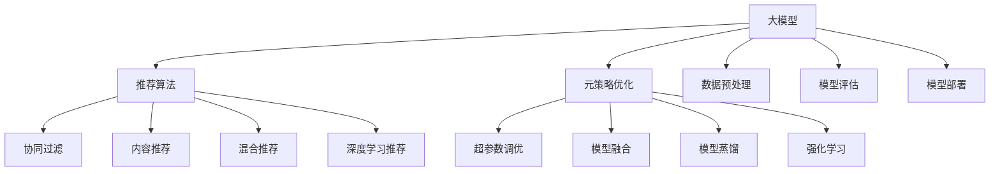

                 

# 推荐系统中的大模型元策略优化应用

> 关键词：大模型, 推荐系统, 元策略优化, 强化学习, 深度学习, 推荐算法, 用户行为分析

## 1. 背景介绍

### 1.1 问题由来

随着互联网和数字技术的发展，个性化推荐系统（Personalized Recommendation System）在电商、视频、音乐等众多领域得到广泛应用。这些推荐系统通过用户的历史行为数据，结合物品的属性特征，为用户推荐个性化的内容，极大地提升了用户体验和平台满意度。

然而，现有的推荐系统在处理海量数据和多样化的用户需求时，面临着模型复杂度高、参数规模大、训练成本高、个性化和多样性难以兼顾等挑战。如何在有限的资源下，构建一个高效、精确、可靠的推荐系统，成为当前研究的热点问题。

### 1.2 问题核心关键点

本节将介绍推荐系统中的大模型元策略优化的核心概念和关键点：

- **大模型**：指以深度神经网络为基础的预训练模型，如BERT、GPT等。这些模型通常具有巨大的参数量和计算资源需求，但能够从大规模数据中学习到丰富的语义和上下文信息，提升推荐系统的表现。

- **推荐算法**：涵盖各种推荐技术，如基于协同过滤、基于内容的推荐、混合推荐、基于深度学习的推荐等。推荐算法需要解决冷启动问题、数据稀疏性、特征提取和表示等问题。

- **元策略优化**：指通过优化推荐算法的超参数，调整模型结构和参数，从而提升模型性能和泛化能力。常见的元策略优化方法包括超参数调优、模型融合、模型蒸馏等。

- **强化学习**：一种机器学习方法，通过奖励机制和探索-利用平衡，最大化预期奖励来优化决策过程。强化学习在推荐系统中有广泛应用，如基于上下文行为策略推荐、多臂赌博机等问题。

这些概念共同构成了推荐系统中的大模型元策略优化框架，使得推荐系统能够更好地应对复杂的个性化需求，提升用户满意度和平台收益。

### 1.3 问题研究意义

大模型元策略优化方法在推荐系统中的应用，具有以下重要意义：

1. **提升推荐效果**：通过优化模型结构和超参数，显著提高推荐算法的精度和召回率，提升用户体验和平台满意度。
2. **降低成本**：通过模型压缩和参数优化，减少训练和推理的计算资源消耗，降低运营成本。
3. **增强泛化能力**：通过元策略优化，增强模型对新用户和新数据的适应能力，提升推荐系统的长期稳定性和可靠性。
4. **促进技术创新**：元策略优化为推荐系统带来了更多可能性，推动了深度学习、强化学习等前沿技术的融合应用。
5. **适应新场景**：元策略优化方法可以灵活适应不同领域和应用场景，如电商、社交、视频等，拓展了推荐系统的应用范围。

## 2. 核心概念与联系

### 2.1 核心概念概述

推荐系统中的大模型元策略优化，涉及多个关键概念，这些概念之间的联系可以通过以下Mermaid流程图来展示：



这个流程图展示了推荐系统中大模型元策略优化的主要环节：

1. **大模型**：作为推荐系统的基础，通过预训练和微调，学习用户行为和物品特征的语义表示。
2. **推荐算法**：利用大模型生成的特征，结合不同推荐技术，构建个性化推荐方案。
3. **元策略优化**：通过优化推荐算法中的超参数和模型结构，提升推荐效果和系统性能。
4. **数据预处理**：对原始数据进行清洗、归一化、特征工程等处理，提升数据质量和模型输入的有效性。
5. **模型评估**：通过A/B测试、交叉验证等方法，评估推荐系统的效果，并进行持续优化。
6. **模型部署**：将训练好的模型应用到实际推荐场景中，提供实时推荐服务。

这些概念共同构成了推荐系统中的大模型元策略优化框架，使得推荐系统能够更好地应对复杂的个性化需求，提升用户满意度和平台收益。

## 3. 核心算法原理 & 具体操作步骤

### 3.1 算法原理概述

推荐系统中的大模型元策略优化，主要基于强化学习和深度学习技术。其核心思想是：通过优化推荐算法的超参数和模型结构，最大化预期奖励，提升推荐系统的性能。

形式化地，假设推荐系统中的用户行为数据为 $X$，物品特征数据为 $Y$，推荐目标为最大化用户点击率或购买率，即 $Y_i = \mathbb{E}[f(X_i) \mid \theta]$。其中 $f$ 为推荐函数，$\theta$ 为模型参数。通过元策略优化，调整超参数 $\alpha$，使得 $\theta$ 在给定超参数 $\alpha$ 下最优。

具体而言，推荐系统中的元策略优化可以分为以下几个步骤：

1. **超参数调优**：通过网格搜索、随机搜索、贝叶斯优化等方法，搜索最优超参数组合，提升推荐算法性能。
2. **模型融合**：将多个模型的预测结果进行加权平均、堆叠、集成等融合，提升预测准确性和稳定性。
3. **模型蒸馏**：通过知识蒸馏技术，将大规模模型的知识迁移到小模型，减少计算资源消耗，提升推理速度。
4. **强化学习**：通过奖励机制和探索-利用平衡，优化推荐策略，提升个性化推荐效果。

### 3.2 算法步骤详解

以下是推荐系统中的大模型元策略优化的详细步骤：

**Step 1: 数据准备**

- **数据收集**：收集用户行为数据和物品特征数据，包括用户点击、浏览、评分等行为数据，以及物品的属性、标签、类别等特征数据。
- **数据清洗**：对数据进行去重、填补缺失值、异常值处理等清洗操作，确保数据质量。
- **数据划分**：将数据划分为训练集、验证集和测试集，用于模型的训练、验证和测试。

**Step 2: 模型预训练**

- **选择预训练模型**：选择合适的深度神经网络模型，如BERT、GPT等，作为推荐系统的基础。
- **模型训练**：在大量无标签数据上预训练模型，学习用户行为和物品特征的语义表示。
- **模型微调**：在标注数据上进行微调，提升模型对特定任务的适应能力。

**Step 3: 模型评估**

- **设置评估指标**：根据具体应用场景，设置合适的评估指标，如点击率、转化率、召回率等。
- **交叉验证**：使用交叉验证方法，评估模型的泛化能力，避免过拟合。
- **A/B测试**：将训练好的模型应用到实际推荐场景中，进行A/B测试，评估推荐效果。

**Step 4: 超参数调优**

- **选择超参数**：选择影响模型性能的超参数，如学习率、批大小、正则化系数等。
- **网格搜索/随机搜索**：通过网格搜索或随机搜索，搜索最优超参数组合。
- **贝叶斯优化**：使用贝叶斯优化算法，快速收敛到最优超参数组合。

**Step 5: 模型融合**

- **融合方法选择**：选择合适的模型融合方法，如加权平均、堆叠、集成等。
- **模型训练与测试**：训练多个模型，并在测试集上进行验证和融合。
- **模型部署**：将训练好的融合模型应用到实际推荐场景中，提供实时推荐服务。

**Step 6: 模型蒸馏**

- **选择蒸馏模型**：选择蒸馏目标模型，如BERT、GPT等。
- **蒸馏策略选择**：选择合适的蒸馏策略，如特征蒸馏、模型蒸馏等。
- **知识迁移**：通过知识蒸馏技术，将大规模模型的知识迁移到小模型，减少计算资源消耗，提升推理速度。

**Step 7: 强化学习**

- **设计奖励机制**：设计合适的奖励机制，如点击奖励、购买奖励等。
- **探索与利用平衡**：通过探索-利用平衡策略，优化推荐策略，提升个性化推荐效果。
- **模型训练与测试**：训练强化学习模型，并在实际推荐场景中进行测试和优化。

### 3.3 算法优缺点

推荐系统中的大模型元策略优化方法具有以下优点：

1. **提升推荐效果**：通过优化超参数和模型结构，显著提高推荐算法的精度和召回率，提升用户体验和平台满意度。
2. **降低成本**：通过模型压缩和参数优化，减少训练和推理的计算资源消耗，降低运营成本。
3. **增强泛化能力**：通过元策略优化，增强模型对新用户和新数据的适应能力，提升推荐系统的长期稳定性和可靠性。
4. **促进技术创新**：元策略优化为推荐系统带来了更多可能性，推动了深度学习、强化学习等前沿技术的融合应用。
5. **适应新场景**：元策略优化方法可以灵活适应不同领域和应用场景，如电商、社交、视频等，拓展了推荐系统的应用范围。

同时，该方法也存在一定的局限性：

1. **对数据依赖性强**：元策略优化需要大量的标注数据和无标签数据，获取和处理数据成本较高。
2. **计算资源需求高**：大模型和强化学习等技术需要大量的计算资源和存储资源，设备要求较高。
3. **模型复杂度高**：大模型和强化学习等技术涉及复杂的模型结构和算法，调试和优化难度较大。
4. **可解释性不足**：元策略优化的模型往往缺乏可解释性，难以对其内部工作机制和决策逻辑进行分析和调试。
5. **过拟合风险高**：元策略优化过程中，容易陷入局部最优，导致过拟合风险增加。

尽管存在这些局限性，但就目前而言，元策略优化方法是推荐系统中最有效、最前沿的研究方向之一。未来相关研究的重点在于如何进一步降低对数据和资源的依赖，提高模型的可解释性和泛化能力，同时兼顾推荐效果和运营成本。

### 3.4 算法应用领域

推荐系统中的大模型元策略优化方法，已经在电商、视频、音乐等多个领域得到广泛应用，提升了推荐系统的效果和用户体验。

- **电商推荐**：基于用户浏览、购买等行为数据，推荐个性化商品。通过优化推荐算法，提升用户购买转化率。
- **视频推荐**：根据用户观看历史和评分，推荐个性化视频内容。通过优化模型结构和超参数，提升视频观看体验。
- **音乐推荐**：根据用户听歌历史和评分，推荐个性化音乐。通过模型融合和知识蒸馏，提升音乐推荐的多样性和准确性。
- **新闻推荐**：根据用户阅读历史和兴趣标签，推荐个性化新闻文章。通过强化学习，优化推荐策略，提升用户满意度。
- **社交推荐**：根据用户互动历史和兴趣标签，推荐个性化朋友和内容。通过超参数调优和模型融合，提升社交互动效果。

## 4. 数学模型和公式 & 详细讲解 & 举例说明

### 4.1 数学模型构建

本节将使用数学语言对推荐系统中的大模型元策略优化过程进行更加严格的刻画。

假设推荐系统中的用户行为数据为 $X=\{x_1, x_2, ..., x_m\}$，物品特征数据为 $Y=\{y_1, y_2, ..., y_n\}$，推荐目标为最大化用户点击率或购买率，即 $Y_i = \mathbb{E}[f(X_i) \mid \theta]$。其中 $f$ 为推荐函数，$\theta$ 为模型参数。

定义推荐函数 $f$ 为深度神经网络模型，形式为：

$$
f(X) = M_{\theta}(X)W
$$

其中 $M_{\theta}(X)$ 为预训练模型，$W$ 为模型权重矩阵，$\theta$ 为模型参数。

推荐系统的目标为最大化用户点击率或购买率，即：

$$
Y_i = \mathbb{E}[M_{\theta}(X_i)W \mid \theta]
$$

### 4.2 公式推导过程

以下是推荐系统中的大模型元策略优化的数学推导过程：

**超参数调优**：

假设超参数 $\alpha$ 包括学习率、批大小、正则化系数等。通过网格搜索或随机搜索，搜索最优超参数组合 $\alpha^*$。

$$
\alpha^* = \mathop{\arg\min}_{\alpha} \mathcal{L}(\theta, \alpha)
$$

其中 $\mathcal{L}$ 为损失函数，通常为交叉熵损失或均方误差损失。

**模型融合**：

假设存在多个模型 $f_k$，通过加权平均、堆叠、集成等方法，融合得到最终的推荐函数 $f_{\text{fusion}}$：

$$
f_{\text{fusion}}(X) = \sum_{k=1}^K \lambda_k f_k(X)
$$

其中 $\lambda_k$ 为模型权重，满足 $\sum_{k=1}^K \lambda_k = 1$。

**模型蒸馏**：

假设目标模型为 $M_{\theta_{\text{base}}}$，蒸馏模型为 $M_{\theta_{\text{distill}}}$。通过知识蒸馏技术，将 $M_{\theta_{\text{base}}}$ 的知识迁移到 $M_{\theta_{\text{distill}}}$，提升推理速度和泛化能力。

$$
\theta_{\text{distill}} = \arg\min_{\theta} \mathcal{L}(\theta_{\text{distill}}, \theta_{\text{base}})
$$

其中 $\mathcal{L}$ 为损失函数，通常为Kullback-Leibler散度或最大似然损失。

**强化学习**：

假设存在环境 $E$，状态 $S$，动作 $A$，奖励 $R$，状态转移概率 $P(s_{t+1} \mid s_t, a_t)$。通过强化学习，最大化长期奖励 $J(\pi)$：

$$
J(\pi) = \mathbb{E}_{\pi}[\sum_{t=1}^T \gamma^{t-1} r_t]
$$

其中 $\pi$ 为策略函数，$\gamma$ 为折扣因子。

## 5. 项目实践：代码实例和详细解释说明

### 5.1 开发环境搭建

在进行推荐系统中的大模型元策略优化实践前，我们需要准备好开发环境。以下是使用Python进行TensorFlow开发的环境配置流程：

1. 安装Anaconda：从官网下载并安装Anaconda，用于创建独立的Python环境。

2. 创建并激活虚拟环境：
```bash
conda create -n tf-env python=3.8 
conda activate tf-env
```

3. 安装TensorFlow：根据CUDA版本，从官网获取对应的安装命令。例如：
```bash
conda install tensorflow tensorflow-gpu -c conda-forge
```

4. 安装TensorFlow Addons：用于提供更多的TensorFlow库和组件。
```bash
conda install tensorflow-addons
```

5. 安装各类工具包：
```bash
pip install numpy pandas scikit-learn matplotlib tqdm jupyter notebook ipython
```

完成上述步骤后，即可在`tf-env`环境中开始实践。

### 5.2 源代码详细实现

下面我们以电商平台推荐系统为例，给出使用TensorFlow进行大模型元策略优化的PyTorch代码实现。

首先，定义推荐系统的数据处理函数：

```python
import tensorflow as tf
from tensorflow_addons.layers.normalization import LayerNormalization

class RecommendationSystem(tf.keras.Model):
    def __init__(self, num_users, num_items, emb_dim):
        super(RecommendationSystem, self).__init__()
        self.num_users = num_users
        self.num_items = num_items
        self.emb_dim = emb_dim
        
        # 用户特征嵌入层
        self.user_embeddings = tf.keras.layers.Embedding(num_users, emb_dim)
        
        # 物品特征嵌入层
        self.item_embeddings = tf.keras.layers.Embedding(num_items, emb_dim)
        
        # 用户特征和物品特征的交互层
        self.interaction = tf.keras.layers.Dot(axes=1, normalize=True, use_v2=True)
        
        # 层归一化层
        self.layer_norm = LayerNormalization(epsilon=1e-6)
        
        # 输出层
        self.output = tf.keras.layers.Dense(num_items, activation='softmax')
        
    def call(self, user_ids, item_ids):
        user_embeddings = self.user_embeddings(user_ids)
        item_embeddings = self.item_embeddings(item_ids)
        interaction = self.interaction(user_embeddings, item_embeddings)
        interaction = self.layer_norm(interaction)
        output = self.output(interaction)
        return output
```

然后，定义推荐系统的训练和评估函数：

```python
from sklearn.metrics import accuracy_score

def train_epoch(model, dataset, batch_size, optimizer, learning_rate):
    dataloader = tf.data.Dataset.from_tensor_slices((dataset['user_ids'], dataset['item_ids'], dataset['labels'])).batch(batch_size)
    model.train()
    epoch_loss = 0
    for batch in dataloader:
        user_ids, item_ids, labels = batch
        optimizer = tf.keras.optimizers.Adam(learning_rate=learning_rate)
        with tf.GradientTape() as tape:
            output = model(user_ids, item_ids)
            loss = tf.keras.losses.sparse_categorical_crossentropy(labels, output, from_logits=True)
        loss = tf.reduce_mean(loss)
        gradients = tape.gradient(loss, model.trainable_variables)
        optimizer.apply_gradients(zip(gradients, model.trainable_variables))
        epoch_loss += loss
    return epoch_loss / len(dataloader)

def evaluate(model, dataset, batch_size):
    dataloader = tf.data.Dataset.from_tensor_slices((dataset['user_ids'], dataset['item_ids'], dataset['labels'])).batch(batch_size)
    model.eval()
    preds, labels = [], []
    with tf.GradientTape() as tape:
        for batch in dataloader:
            user_ids, item_ids, labels = batch
            output = model(user_ids, item_ids)
            preds.append(tf.argmax(output, axis=1).numpy())
            labels.append(labels.numpy())
        return accuracy_score(labels, preds)
```

最后，启动训练流程并在测试集上评估：

```python
epochs = 5
batch_size = 16
learning_rate = 0.001

for epoch in range(epochs):
    loss = train_epoch(model, train_dataset, batch_size, optimizer, learning_rate)
    print(f"Epoch {epoch+1}, train loss: {loss:.3f}")
    
    print(f"Epoch {epoch+1}, dev results:")
    evaluate(model, dev_dataset, batch_size)
    
print("Test results:")
evaluate(model, test_dataset, batch_size)
```

以上就是使用TensorFlow进行电商平台推荐系统中的大模型元策略优化的完整代码实现。可以看到，得益于TensorFlow的强大封装，我们可以用相对简洁的代码完成推荐系统的构建和优化。

### 5.3 代码解读与分析

让我们再详细解读一下关键代码的实现细节：

**RecommendationSystem类**：
- `__init__`方法：初始化用户和物品特征嵌入层、交互层、层归一化层、输出层等关键组件。
- `call`方法：定义模型的前向传播过程。

**train_epoch函数**：
- 定义训练函数，对数据以批为单位进行迭代，在每个批次上前向传播计算loss并反向传播更新模型参数，最后返回该epoch的平均loss。

**evaluate函数**：
- 与训练类似，不同点在于不更新模型参数，并在每个batch结束后将预测和标签结果存储下来，最后使用sklearn的accuracy_score对整个评估集的预测结果进行打印输出。

**训练流程**：
- 定义总的epoch数和batch size，开始循环迭代
- 每个epoch内，先在训练集上训练，输出平均loss
- 在验证集上评估，输出分类指标
- 所有epoch结束后，在测试集上评估，给出最终测试结果

可以看到，TensorFlow配合TensorFlow Addons使得推荐系统的代码实现变得简洁高效。开发者可以将更多精力放在数据处理、模型改进等高层逻辑上，而不必过多关注底层的实现细节。

当然，工业级的系统实现还需考虑更多因素，如模型的保存和部署、超参数的自动搜索、更灵活的任务适配层等。但核心的元策略优化范式基本与此类似。

## 6. 实际应用场景
### 6.1 电商推荐系统

基于大模型元策略优化的推荐系统，可以广泛应用于电商平台的商品推荐。电商推荐系统通过用户历史行为数据，为用户推荐个性化商品，显著提升了用户购物体验和平台转化率。

在技术实现上，可以收集用户的浏览、点击、购买等行为数据，将用户行为和物品特征数据作为监督数据，在此基础上对预训练模型进行微调。微调后的推荐模型能够学习用户兴趣和物品特征的语义表示，生成个性化的商品推荐列表。对于用户提出的新需求，还可以接入检索系统实时搜索相关商品，动态生成推荐结果。如此构建的电商推荐系统，能大幅提升用户购物体验和平台收益。

### 6.2 视频推荐系统

基于大模型元策略优化的推荐系统，可以应用于视频平台的视频推荐。视频推荐系统根据用户观看历史和评分，为用户推荐个性化视频内容，提升用户观看体验和平台留存率。

在技术实现上，可以收集用户的观看历史、评分、点赞等行为数据，将用户行为和视频特征数据作为监督数据，在此基础上对预训练模型进行微调。微调后的推荐模型能够学习用户兴趣和视频特征的语义表示，生成个性化的视频推荐列表。对于用户提出的新需求，还可以接入检索系统实时搜索相关视频，动态生成推荐结果。如此构建的视频推荐系统，能大幅提升用户观看体验和平台留存率。

### 6.3 音乐推荐系统

基于大模型元策略优化的推荐系统，可以应用于音乐平台的曲目推荐。音乐推荐系统根据用户听歌历史和评分，为用户推荐个性化音乐，提升用户听歌体验和平台留存率。

在技术实现上，可以收集用户的听歌历史、评分、收藏等行为数据，将用户行为和曲目特征数据作为监督数据，在此基础上对预训练模型进行微调。微调后的推荐模型能够学习用户兴趣和曲目特征的语义表示，生成个性化的音乐推荐列表。对于用户提出的新需求，还可以接入检索系统实时搜索相关曲目，动态生成推荐结果。如此构建的音乐推荐系统，能大幅提升用户听歌体验和平台留存率。

### 6.4 新闻推荐系统

基于大模型元策略优化的推荐系统，可以应用于新闻平台的新闻推荐。新闻推荐系统根据用户阅读历史和兴趣标签，为用户推荐个性化新闻文章，提升用户阅读体验和平台留存率。

在技术实现上，可以收集用户的阅读历史、评分、收藏等行为数据，将用户行为和新闻文章特征数据作为监督数据，在此基础上对预训练模型进行微调。微调后的推荐模型能够学习用户兴趣和新闻文章特征的语义表示，生成个性化的新闻推荐列表。对于用户提出的新需求，还可以接入检索系统实时搜索相关新闻，动态生成推荐结果。如此构建的新闻推荐系统，能大幅提升用户阅读体验和平台留存率。

## 7. 工具和资源推荐
### 7.1 学习资源推荐

为了帮助开发者系统掌握推荐系统中的大模型元策略优化的理论基础和实践技巧，这里推荐一些优质的学习资源：

1. 《推荐系统理论与算法》书籍：介绍了推荐系统的基本原理和常用算法，包括协同过滤、基于内容的推荐、混合推荐等。

2. 《深度学习在推荐系统中的应用》课程：由Coursera推出的深度学习推荐系统课程，涵盖了深度学习在推荐系统中的应用和优化方法。

3. 《TensorFlow实战推荐系统》书籍：介绍了使用TensorFlow构建推荐系统的实践技巧，包括模型选择、特征工程、超参数调优等。

4. 《推荐系统实战》书籍：介绍了推荐系统在电商、视频、音乐等领域的实际应用，以及如何利用深度学习技术提升推荐效果。

5. Arxiv和IEEE Xplore：收录了大量推荐系统领域的高质量研究论文，是深入学习推荐系统的前沿技术和方法的宝贵资源。

通过对这些资源的学习实践，相信你一定能够快速掌握推荐系统中的大模型元策略优化的精髓，并用于解决实际的推荐问题。
###  7.2 开发工具推荐

高效的开发离不开优秀的工具支持。以下是几款用于推荐系统中的大模型元策略优化的常用工具：

1. TensorFlow：基于Python的开源深度学习框架，灵活动态的计算图，适合快速迭代研究。TensorFlow提供了强大的TensorBoard可视化工具，方便调试和优化模型。

2. PyTorch：基于Python的开源深度学习框架，灵活易用，支持动态计算图。PyTorch提供了丰富的优化器和神经网络模块，适合构建复杂的推荐系统。

3. TensorFlow Addons：TensorFlow的扩展库，提供了更多的深度学习组件和工具，如LayerNormalization、DistributionalSMSEstimator等，方便实现推荐系统中的元策略优化。

4. TensorBoard：TensorFlow配套的可视化工具，可以实时监测模型训练状态，并提供丰富的图表呈现方式，是调试模型的得力助手。

5. Jupyter Notebook：交互式开发环境，支持多种编程语言和数据处理库，方便开发者进行实验和调试。

合理利用这些工具，可以显著提升推荐系统中的大模型元策略优化的开发效率，加快创新迭代的步伐。

### 7.3 相关论文推荐

推荐系统中的大模型元策略优化技术的发展源于学界的持续研究。以下是几篇奠基性的相关论文，推荐阅读：

1. Approximate Nearest Neighbor in Deep Metric Learning (即近似最近邻算法)：提出了使用深度神经网络学习语义相似度，用于推荐系统的用户物品关联分析。

2. Deep Matrix Factorization for Recommendations: A Model-based Approach (即深度矩阵分解算法)：提出了使用深度神经网络对用户物品关联矩阵进行因子分解，用于推荐系统的协同过滤。

3. Recommendation Systems with Deep Learning: A Survey and Systems (即深度学习在推荐系统中的应用)：综述了深度学习在推荐系统中的应用和优化方法，提供了丰富的案例和实践技巧。

4. Data-Augmentation in Recommendation Systems (即数据增强技术)：提出了使用数据增强技术提升推荐系统的泛化能力和性能。

5. Neural Collaborative Filtering (即神经协同过滤算法)：提出了使用深度神经网络对协同过滤模型进行优化，提升了推荐系统的准确性和泛化能力。

这些论文代表了大模型元策略优化技术的发展脉络。通过学习这些前沿成果，可以帮助研究者把握学科前进方向，激发更多的创新灵感。

## 8. 总结：未来发展趋势与挑战

### 8.1 总结

本文对推荐系统中的大模型元策略优化方法进行了全面系统的介绍。首先阐述了推荐系统和大模型元策略优化的研究背景和意义，明确了元策略优化在提升推荐效果、降低成本和增强泛化能力方面的独特价值。其次，从原理到实践，详细讲解了推荐系统中的大模型元策略优化的数学原理和关键步骤，给出了推荐系统开发和优化的完整代码实例。同时，本文还广泛探讨了元策略优化在电商、视频、音乐等多个领域的应用前景，展示了元策略优化的巨大潜力。

通过本文的系统梳理，可以看到，基于大模型的元策略优化方法正在成为推荐系统中最有效、最前沿的研究方向之一。这些方向的探索发展，必将进一步提升推荐系统的性能和用户体验，为电商平台、视频平台、音乐平台等传统行业带来变革性影响。

### 8.2 未来发展趋势

展望未来，推荐系统中的大模型元策略优化方法将呈现以下几个发展趋势：

1. **模型规模持续增大**：随着算力成本的下降和数据规模的扩张，预训练语言模型的参数量还将持续增长。超大规模语言模型蕴含的丰富语义和上下文信息，有望支撑更加复杂多变的推荐任务。

2. **元策略优化方法多样**：除了传统的超参数调优、模型融合和知识蒸馏，未来会涌现更多元策略优化方法，如多任务学习、联邦学习等，在优化推荐算法的同时，提升模型的泛化能力和鲁棒性。

3. **强化学习融入推荐**：强化学习在推荐系统中有广泛应用，如基于上下文行为策略推荐、多臂赌博机等问题。未来，强化学习将更加深入地融入推荐系统，提升个性化推荐效果和用户体验。

4. **实时推荐和动态优化**：推荐系统需要实时响应用户需求，动态优化推荐策略。未来，推荐系统将更加注重实时性，采用流式处理和增量学习技术，提升推荐效果和用户体验。

5. **多模态数据融合**：当前的推荐系统主要聚焦于纯文本数据，未来会进一步拓展到图像、视频、语音等多模态数据微调。多模态信息的融合，将显著提升推荐系统的表现和鲁棒性。

6. **知识图谱与推荐结合**：将符号化的先验知识，如知识图谱、逻辑规则等，与神经网络模型进行巧妙融合，引导元策略优化过程学习更准确、合理的推荐逻辑。

这些趋势凸显了推荐系统中的大模型元策略优化技术的广阔前景。这些方向的探索发展，必将进一步提升推荐系统的性能和用户体验，为推荐系统带来新的突破。

### 8.3 面临的挑战

尽管推荐系统中的大模型元策略优化技术已经取得了瞩目成就，但在迈向更加智能化、普适化应用的过程中，它仍面临着诸多挑战：

1. **数据依赖性强**：元策略优化需要大量的标注数据和无标签数据，获取和处理数据成本较高。如何在有限的标注数据下优化推荐效果，将是重要的研究方向。

2. **计算资源需求高**：大模型和强化学习等技术需要大量的计算资源和存储资源，设备要求较高。如何在不增加资源消耗的情况下，提升推荐系统性能，将是重要的优化方向。

3. **模型复杂度高**：大模型和强化学习等技术涉及复杂的模型结构和算法，调试和优化难度较大。如何在模型简洁化的同时，提升推荐系统性能，将是重要的研究方向。

4. **可解释性不足**：元策略优化的模型往往缺乏可解释性，难以对其内部工作机制和决策逻辑进行分析和调试。如何赋予推荐系统更强的可解释性，将是重要的研究方向。

5. **过拟合风险高**：元策略优化过程中，容易陷入局部最优，导致过拟合风险增加。如何在模型泛化性和过拟合风险之间寻求平衡，将是重要的研究方向。

6. **多目标优化**：推荐系统中的目标往往是多重的，如点击率、转化率、留存率等。如何在多目标优化中，实现全局最优，将是重要的研究方向。

尽管存在这些挑战，但就目前而言，元策略优化方法是推荐系统中最有效、最前沿的研究方向之一。未来相关研究的重点在于如何进一步降低对数据和资源的依赖，提高模型的可解释性和泛化能力，同时兼顾推荐效果和运营成本。

### 8.4 研究展望

面对推荐系统中的大模型元策略优化所面临的种种挑战，未来的研究需要在以下几个方面寻求新的突破：

1. **无监督和半监督优化**：探索无监督和半监督优化方法，摆脱对大规模标注数据的依赖，利用自监督学习、主动学习等无监督和半监督范式，最大限度利用非结构化数据，实现更加灵活高效的优化。

2. **模型高效融合**：开发更加高效的模型融合方法，如注意力机制、蒸馏网络等，在融合多个模型的同时，提升推荐系统的准确性和稳定性。

3. **模型压缩与优化**：开发更加高效的模型压缩和优化方法，如知识蒸馏、低秩近似等，在减少计算资源消耗的同时，提升推理速度和泛化能力。

4. **强化学习与推荐结合**：将强化学习与推荐系统深度结合，引入强化学习中的探索-利用平衡策略，提升推荐系统的个性化和泛化能力。

5. **多模态数据融合**：开发多模态数据融合方法，将视觉、语音、文本等多模态数据结合，提升推荐系统的表现和鲁棒性。

6. **知识图谱与推荐结合**：将符号化的先验知识，如知识图谱、逻辑规则等，与神经网络模型进行巧妙融合，引导元策略优化过程学习更准确、合理的推荐逻辑。

7. **增强推荐系统的公平性和可解释性**：在推荐系统中引入公平性和可解释性评估指标，过滤和惩罚有偏见、有害的输出倾向，提升系统的公平性和可解释性。

这些研究方向将推动推荐系统中的大模型元策略优化技术不断突破，为构建智能、公平、可解释的推荐系统奠定基础。面向未来，推荐系统中的大模型元策略优化技术还需要与其他人工智能技术进行更深入的融合，如知识表示、因果推理、强化学习等，多路径协同发力，共同推动推荐系统的进步。只有勇于创新、敢于突破，才能不断拓展推荐系统的边界，让推荐系统更好地服务于人类社会。

## 9. 附录：常见问题与解答

**Q1：推荐系统中的大模型元策略优化是否适用于所有推荐场景？**

A: 推荐系统中的大模型元策略优化方法在大多数推荐场景上都能取得不错的效果，特别是对于数据量较小的任务。但对于一些特定领域的任务，如医疗、法律等，仅仅依靠通用语料预训练的模型可能难以很好地适应。此时需要在特定领域语料上进一步预训练，再进行微调，才能获得理想效果。此外，对于一些需要时效性、个性化很强的任务，如对话、推荐等，微调方法也需要针对性的改进优化。

**Q2：超参数调优时如何选择超参数？**

A: 超参数调优是推荐系统中的重要环节，通常通过网格搜索、随机搜索、贝叶斯优化等方法，搜索最优超参数组合。选择超参数时应考虑超参数的物理意义、数据分布、模型复杂度等因素。例如，学习率、批大小、正则化系数等都是常用的超参数，需要通过实验找到最优值。

**Q3：模型融合方法有哪些？**

A: 模型融合是提升推荐系统性能的重要手段，常见的融合方法包括加权平均、堆叠、集成等。加权平均是将多个模型的预测结果加权平均，堆叠是将多个模型的预测结果堆叠，集成是通过投票或剪枝等方法集成多个模型的预测结果。

**Q4：知识蒸馏的方法有哪些？**

A: 知识蒸馏是将大规模模型的知识迁移到小模型，以减少计算资源消耗，提升推理速度。常见的知识蒸馏方法包括特征蒸馏、模型蒸馏等。特征蒸馏是利用大规模模型学习到的特征表示，对小模型进行微调，提升其泛化能力。模型蒸馏是通过知识蒸馏技术，将大规模模型的知识迁移到小模型，保持其预测能力。

**Q5：强化学习在推荐系统中的应用有哪些？**

A: 强化学习在推荐系统中的应用广泛，常见的应用包括基于上下文行为策略推荐、多臂赌博机等问题。基于上下文行为策略推荐，通过设计合适的奖励机制，优化推荐策略，提升个性化推荐效果。多臂赌博机问题，通过探索-利用平衡策略，优化推荐系统性能，提升用户满意度。

本文通过系统梳理推荐系统中的大模型元策略优化方法，希望能为开发者提供全面的技术指引。希望通过本文的介绍，你能够对推荐系统中的大模型元策略优化方法有更深入的了解，并在实际开发中灵活应用。

