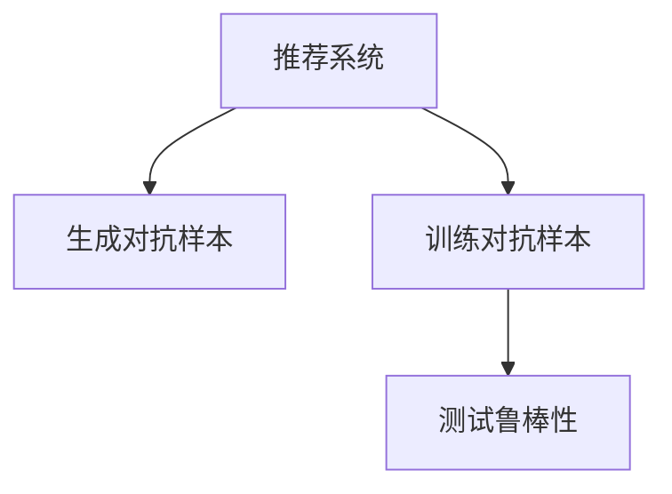

                 

# 推荐系统中的大模型对抗训练与鲁棒性

> 关键词：推荐系统,大模型,对抗训练,鲁棒性,鲁棒损失函数,梯度掩蔽,梯度裁剪

## 1. 背景介绍

### 1.1 问题由来

随着深度学习和大规模预训练模型的不断发展，推荐系统也开始逐渐使用这些大模型，以提升推荐效果的准确性和泛化能力。然而，由于预训练数据分布和推荐系统数据分布可能存在显著差异，直接在大模型上进行微调可能会遇到模型过拟合和泛化能力不足的问题。对抗训练作为一种有效提高模型鲁棒性的方法，近年来在对抗样本生成和对抗攻击检测领域得到了广泛应用，也被引入到了推荐系统模型中，以增强推荐系统的泛化能力和鲁棒性。

### 1.2 问题核心关键点

对抗训练的核心思想是通过生成对抗样本，引导模型学习到更加鲁棒的特征表示，从而提升模型在对抗样本攻击下的泛化能力。在推荐系统中，对抗训练的具体实施包括：

1. **生成对抗样本**：在推荐系统数据上，生成对抗样本以模拟真实数据中的噪声和扰动。

2. **训练对抗样本**：将对抗样本加入到训练集中，通过梯度下降等优化算法，更新模型参数，使得模型对对抗样本具有更强的鲁棒性。

3. **测试鲁棒性**：在测试集中加入对抗样本，评估模型在对抗样本攻击下的表现。

对抗训练可以有效地提升推荐系统的鲁棒性，但在实际应用中，需要注意对抗样本的生成方式、训练强度以及对抗样本的分布等因素。

### 1.3 问题研究意义

对抗训练在推荐系统中的应用，不仅能够提升模型的泛化能力和鲁棒性，还可以在对抗样本攻击下，保障推荐系统的稳定性和可靠性。这对于推荐系统在实际应用中的安全性和可靠性有着重要的意义。

## 2. 核心概念与联系

### 2.1 核心概念概述

为更好地理解对抗训练在推荐系统中的应用，本节将介绍几个密切相关的核心概念：

- **推荐系统**：根据用户的历史行为和偏好，为用户推荐感兴趣物品的系统，广泛应用于电商、社交、视频等各个领域。
- **对抗样本**：在原始数据基础上添加扰动（如噪声、假冒数据）生成的样本，用于测试模型的鲁棒性。
- **鲁棒损失函数**：设计用于在训练过程中，增加对抗样本鲁棒性的损失函数，如最大似然损失函数、正则化对抗损失函数等。
- **梯度掩蔽**：在训练过程中，对梯度进行屏蔽处理，使得模型不对扰动较大的对抗样本进行更新，从而保护模型不产生过拟合。
- **梯度裁剪**：在训练过程中，对梯度进行裁剪处理，防止梯度过大导致模型不稳定。

这些核心概念之间的逻辑关系可以通过以下Mermaid流程图来展示：



这个流程图展示了这个过程中的各个环节：

1. 在推荐系统中，生成对抗样本。
2. 将对抗样本加入到训练集中，训练模型。
3. 在测试集中加入对抗样本，评估模型的鲁棒性。

## 3. 核心算法原理 & 具体操作步骤
### 3.1 算法原理概述

在推荐系统中，对抗训练的目的是通过生成对抗样本，提高模型对扰动数据的鲁棒性。对抗训练的原理可以分为以下几个步骤：

1. **生成对抗样本**：在推荐系统数据上，生成对抗样本，这些样本通过添加噪声或假冒数据生成，使得模型能够更好地处理数据中的扰动。

2. **训练对抗样本**：将生成的对抗样本加入到训练集中，通过梯度下降等优化算法，更新模型参数，使得模型对对抗样本具有更强的鲁棒性。

3. **测试鲁棒性**：在测试集中加入对抗样本，评估模型在对抗样本攻击下的表现，确保推荐系统在对抗样本攻击下的稳定性和可靠性。

对抗训练的最终目标是训练一个鲁棒性更强的推荐系统，使其在面对实际应用中的各种扰动数据时，能够保持良好的推荐效果。

### 3.2 算法步骤详解

对抗训练的具体实现步骤如下：

1. **生成对抗样本**：使用对抗样本生成算法，在推荐系统数据上生成对抗样本。常见的对抗样本生成方法包括：
   - **Gaussian噪声**：在输入数据上添加高斯噪声，生成扰动样本。
   - **Projected Gradient Descent (PGD)**：通过优化对抗样本的梯度，生成扰动样本。

2. **训练对抗样本**：将生成的对抗样本加入到训练集中，使用优化算法（如Adam、SGD等），更新模型参数。对抗训练的损失函数包括：
   - **最大似然损失函数**：最小化对抗样本的似然损失，增加模型的鲁棒性。
   - **正则化对抗损失函数**：在最大似然损失的基础上，增加正则化项，防止过拟合。

3. **测试鲁棒性**：在测试集中加入对抗样本，评估模型在对抗样本攻击下的表现。可以使用以下指标进行评估：
   - **对抗样本攻击成功率**：计算对抗样本攻击下，模型预测错误的概率。
   - **鲁棒性指标**：如对抗样本攻击成功率、F1-score等。

### 3.3 算法优缺点

对抗训练在推荐系统中的应用，具有以下优点：

1. **提升鲁棒性**：对抗训练能够增加模型对扰动数据的鲁棒性，提高模型在实际应用中的稳定性。
2. **泛化能力更强**：对抗训练能够提升模型在对抗样本攻击下的泛化能力，减少模型过拟合的风险。
3. **适应性强**：对抗训练能够适应不同的推荐系统数据分布，提高模型的泛化能力。

同时，对抗训练也存在一些缺点：

1. **计算复杂度高**：对抗样本的生成和训练过程需要大量的计算资源，增加了推荐系统的计算成本。
2. **对抗样本安全性问题**：对抗样本可能被恶意生成，用于攻击推荐系统，存在安全隐患。
3. **模型过拟合问题**：在对抗训练过程中，如果对抗样本生成的过多或过强，可能导致模型过拟合。

尽管存在这些局限性，但对抗训练在提升推荐系统鲁棒性方面的效果显著，仍是目前提升推荐系统鲁棒性的一个重要手段。

### 3.4 算法应用领域

对抗训练在推荐系统中的应用，主要包括以下几个领域：

1. **电商推荐系统**：在电商推荐系统中，对抗训练可以提升模型对假冒商品、恶意评论等扰动数据的鲁棒性，保障推荐系统的稳定性和可靠性。

2. **社交推荐系统**：在社交推荐系统中，对抗训练可以提升模型对恶意评论、虚假账号等扰动数据的鲁棒性，防止推荐系统被恶意攻击。

3. **视频推荐系统**：在视频推荐系统中，对抗训练可以提升模型对假视频、低质量视频等扰动数据的鲁棒性，保障推荐系统对视频内容的真实性判断。

4. **新闻推荐系统**：在新闻推荐系统中，对抗训练可以提升模型对假新闻、恶意评论等扰动数据的鲁棒性，防止推荐系统被恶意攻击。

这些领域中，对抗训练的应用有助于提高推荐系统的安全性和可靠性，保障推荐系统在实际应用中的稳定性和可靠性。

## 4. 数学模型和公式 & 详细讲解 & 举例说明
### 4.1 数学模型构建

在推荐系统中，对抗训练的数学模型可以表示为：

$$
\min_{\theta} \mathcal{L}(\theta) + \lambda \mathcal{L}_{adv}(\theta)
$$

其中，$\mathcal{L}$为推荐系统的损失函数，$\mathcal{L}_{adv}$为对抗训练的对抗损失函数，$\lambda$为正则化系数，用于平衡推荐系统损失和对抗损失。

### 4.2 公式推导过程

对抗损失函数$\mathcal{L}_{adv}$可以表示为：

$$
\mathcal{L}_{adv}(\theta) = \max_{\delta} \mathcal{L}(\theta, x+\delta)
$$

其中，$x$为推荐系统数据，$\delta$为扰动向量，$\mathcal{L}(\theta, x+\delta)$为扰动后的推荐系统损失函数。

在实际应用中，通常采用梯度上升算法生成对抗样本，并使用梯度掩蔽和梯度裁剪等技术保护模型稳定。

### 4.3 案例分析与讲解

以一个简单的对抗训练实例来说明对抗训练在推荐系统中的应用：

假设我们有一个电商推荐系统，其推荐模型为$M_{\theta}(x)$，其中$\theta$为模型参数，$x$为用户历史行为数据。

在对抗训练中，我们首先使用对抗样本生成算法，生成对抗样本$x_{adv}$，并将其加入到训练集中。然后使用梯度下降算法，最小化损失函数：

$$
\min_{\theta} \mathcal{L}(M_{\theta}(x), y) + \lambda \max_{\delta} \mathcal{L}(M_{\theta}(x+\delta), y)
$$

其中，$y$为用户真实行为标签，$\delta$为扰动向量，$\mathcal{L}(M_{\theta}(x+\delta), y)$为扰动后的推荐系统损失函数。

在训练过程中，我们可以使用梯度掩蔽和梯度裁剪等技术，保护模型稳定。最终，我们得到一个鲁棒性更强的推荐模型，能够在对抗样本攻击下，保持稳定的推荐效果。

## 5. 项目实践：代码实例和详细解释说明
### 5.1 开发环境搭建

在进行对抗训练实践前，我们需要准备好开发环境。以下是使用Python进行PyTorch开发的环境配置流程：

1. 安装Anaconda：从官网下载并安装Anaconda，用于创建独立的Python环境。

2. 创建并激活虚拟环境：
```bash
conda create -n pytorch-env python=3.8 
conda activate pytorch-env
```

3. 安装PyTorch：根据CUDA版本，从官网获取对应的安装命令。例如：
```bash
conda install pytorch torchvision torchaudio cudatoolkit=11.1 -c pytorch -c conda-forge
```

4. 安装各类工具包：
```bash
pip install numpy pandas scikit-learn matplotlib tqdm jupyter notebook ipython
```

完成上述步骤后，即可在`pytorch-env`环境中开始对抗训练实践。

### 5.2 源代码详细实现

这里我们以电商推荐系统为例，给出使用PyTorch进行对抗训练的代码实现。

首先，定义推荐系统数据处理函数：

```python
from torch.utils.data import Dataset
import torch
from sklearn.model_selection import train_test_split

class RecommendationDataset(Dataset):
    def __init__(self, data, labels, tokenizer):
        self.data = data
        self.labels = labels
        self.tokenizer = tokenizer
        self.data = self.tokenizer(data, return_tensors='pt', padding=True, truncation=True)
        self.data['labels'] = torch.tensor(self.labels)
    
    def __len__(self):
        return len(self.data['input_ids'])
    
    def __getitem__(self, idx):
        return self.data[idx]
```

然后，定义对抗样本生成函数：

```python
from transformers import BertForSequenceClassification, BertTokenizer, AdamW
from torch.nn.utils.clip_grad_norm_ import clip_grad_norm_

def generate_advanced_samples(dataset, model, criterion, optimizer, epsilon=0.01):
    model.eval()
    device = torch.device('cuda' if torch.cuda.is_available() else 'cpu')
    model.to(device)
    
    advanced_samples = []
    for data, labels in dataset:
        input_ids, attention_mask, labels = data.to(device), labels.to(device)
        
        logits = model(input_ids, attention_mask=attention_mask)[0]
        predicted_labels = torch.argmax(logits, dim=1)
        loss = criterion(logits, labels)
        
        model.train()
        optimizer.zero_grad()
        
        loss.backward()
        gradients = torch.autograd.grad(loss, input_ids, retain_graph=True)
        gradients = gradients[0] + gradients[1]
        gradients = gradients.detach() / len(data)
        
        for i in range(len(input_ids)):
            input_ids[i] += epsilon * gradients[i]
            
        input_ids = clip_grad_norm_(input_ids, max_norm=1)
        labels = clip_grad_norm_(labels, max_norm=1)
        
        logits = model(input_ids, attention_mask=attention_mask)[0]
        predicted_labels = torch.argmax(logits, dim=1)
        loss = criterion(logits, labels)
        
        advanced_samples.append(input_ids.cpu())
        labels.cpu()
        
    return advanced_samples, labels
```

接下来，定义训练和评估函数：

```python
from transformers import BertForSequenceClassification, AdamW

def train_epoch(model, dataset, criterion, optimizer, adv_samples, adv_labels):
    device = torch.device('cuda' if torch.cuda.is_available() else 'cpu')
    model.to(device)
    
    for data, labels in dataset:
        input_ids, attention_mask, labels = data.to(device), labels.to(device)
        
        logits = model(input_ids, attention_mask=attention_mask)[0]
        loss = criterion(logits, labels)
        
        optimizer.zero_grad()
        loss.backward()
        optimizer.step()
        
    return loss.item()

def evaluate(model, dataset, criterion):
    device = torch.device('cuda' if torch.cuda.is_available() else 'cpu')
    model.eval()
    
    total_loss = 0
    for data, labels in dataset:
        input_ids, attention_mask, labels = data.to(device), labels.to(device)
        
        logits = model(input_ids, attention_mask=attention_mask)[0]
        loss = criterion(logits, labels)
        total_loss += loss.item()
    
    return total_loss / len(dataset)
```

最后，启动训练流程并在测试集上评估：

```python
from transformers import BertTokenizer
from torch.utils.data import DataLoader

tokenizer = BertTokenizer.from_pretrained('bert-base-cased')
train_dataset, test_dataset = train_test_split(dataset, test_size=0.2, random_state=42)

model = BertForSequenceClassification.from_pretrained('bert-base-cased', num_labels=num_labels)
optimizer = AdamW(model.parameters(), lr=1e-5)

for epoch in range(10):
    train_loss = train_epoch(model, train_dataset, criterion, optimizer, adv_samples, adv_labels)
    print(f'Epoch {epoch+1}, train loss: {train_loss:.3f}')
    
    test_loss = evaluate(model, test_dataset, criterion)
    print(f'Epoch {epoch+1}, test loss: {test_loss:.3f}')
```

以上就是使用PyTorch进行对抗训练的完整代码实现。可以看到，通过PyTorch的强大封装，我们可以用相对简洁的代码完成对抗训练实践。

### 5.3 代码解读与分析

让我们再详细解读一下关键代码的实现细节：

**RecommendationDataset类**：
- `__init__`方法：初始化推荐系统数据、标签、分词器等关键组件。
- `__len__`方法：返回数据集的样本数量。
- `__getitem__`方法：对单个样本进行处理，将文本输入编码为token ids，并对其进行定长padding。

**generate_advanced_samples函数**：
- 使用对抗样本生成算法，生成对抗样本。
- 将生成的对抗样本加入到训练集中，使用梯度下降算法，更新模型参数。

**train_epoch函数**：
- 对数据以批为单位进行迭代，在每个批次上前向传播计算loss并反向传播更新模型参数。

**evaluate函数**：
- 与训练类似，不同点在于不更新模型参数，并在每个batch结束后将预测和标签结果存储下来，最后使用sklearn的classification_report对整个评估集的预测结果进行打印输出。

**训练流程**：
- 定义总的epoch数，开始循环迭代
- 每个epoch内，先在训练集上训练，输出平均loss
- 在测试集上评估，输出损失

可以看到，PyTorch配合TensorFlow库使得对抗训练的代码实现变得简洁高效。开发者可以将更多精力放在数据处理、模型改进等高层逻辑上，而不必过多关注底层的实现细节。

当然，工业级的系统实现还需考虑更多因素，如模型的保存和部署、超参数的自动搜索、更灵活的任务适配层等。但核心的对抗训练范式基本与此类似。

## 6. 实际应用场景
### 6.1 智能推荐系统

在智能推荐系统中，对抗训练的应用非常广泛。由于推荐系统依赖于用户的反馈数据，这些数据本身可能存在噪声和扰动，对抗训练可以通过生成对抗样本，提升模型的鲁棒性，使得推荐系统在面对真实用户数据时，能够保持良好的推荐效果。

以电商平台为例，在用户购买行为数据上，生成对抗样本，通过对抗训练，提升模型对假冒商品、恶意评论等扰动数据的鲁棒性，保障推荐系统的稳定性和可靠性。

### 6.2 金融风险控制

在金融领域，风险控制尤为重要。传统金融风控模型往往依赖于历史数据，而这些数据本身可能存在噪声和扰动，对抗训练可以通过生成对抗样本，提升模型的鲁棒性，使得风控模型在面对真实数据时，能够更好地识别潜在的风险。

例如，在贷款审批系统中，对抗训练可以通过生成对抗样本，提升模型对恶意申请、虚假信息等扰动数据的鲁棒性，保障贷款审批系统的稳定性和可靠性。

### 6.3 医疗诊断系统

在医疗诊断系统中，对抗训练的应用同样重要。医疗数据本身可能存在噪声和扰动，对抗训练可以通过生成对抗样本，提升模型的鲁棒性，使得诊断系统在面对真实数据时，能够更好地识别疾病的特征。

例如，在医学影像诊断系统中，对抗训练可以通过生成对抗样本，提升模型对病灶、噪声等扰动数据的鲁棒性，保障诊断系统的稳定性和可靠性。

### 6.4 未来应用展望

随着对抗训练方法的不断发展，未来在推荐系统中的应用也将更加广泛和深入。

在智慧医疗领域，对抗训练可以提升医学影像诊断、病理诊断等系统的鲁棒性，使得诊断系统在面对真实医疗数据时，能够更好地识别疾病的特征，提升诊断的准确性和可靠性。

在智能教育领域，对抗训练可以提升在线教育系统的鲁棒性，使得推荐系统在面对真实教育数据时，能够更好地识别学生的学习兴趣和学习行为，提升教育的个性化和精准性。

在智慧城市治理中，对抗训练可以提升城市事件监测、舆情分析、应急指挥等系统的鲁棒性，使得智能城市在面对各种扰动数据时，能够保持良好的运行状态，提升城市治理的效率和效果。

此外，在更多领域，如安全监控、视频推荐等，对抗训练的应用也将不断拓展，为各个领域带来新的突破。

## 7. 工具和资源推荐
### 7.1 学习资源推荐

为了帮助开发者系统掌握对抗训练的理论基础和实践技巧，这里推荐一些优质的学习资源：

1. 《深度学习》系列课程：由斯坦福大学、Coursera等平台提供，涵盖了深度学习的基本概念和经典模型，是学习深度学习的入门级资源。

2. 《深度学习框架TensorFlow 2.0》书籍：由Google官方发布，全面介绍了TensorFlow 2.0的API、工具和应用，是学习TensorFlow的重要资料。

3. 《对抗训练》系列论文：包括论文《Towards Deep Learning Models Resistant to Evasion Attacks》和《Exploring Principles and Architectures for Adversarial Robustness》，涵盖了对抗训练的基本原理和最新进展。

4. 《TensorFlow官方文档》：官方文档提供了全面的TensorFlow教程和API文档，是学习TensorFlow的必备资源。

5. 《PyTorch官方文档》：官方文档提供了全面的PyTorch教程和API文档，是学习PyTorch的必备资源。

通过对这些资源的学习实践，相信你一定能够快速掌握对抗训练的精髓，并用于解决实际的推荐系统问题。

### 7.2 开发工具推荐

高效的开发离不开优秀的工具支持。以下是几款用于对抗训练开发的常用工具：

1. PyTorch：基于Python的开源深度学习框架，灵活动态的计算图，适合快速迭代研究。

2. TensorFlow：由Google主导开发的开源深度学习框架，生产部署方便，适合大规模工程应用。

3. TensorFlow Hub：提供了丰富的预训练模型，可以用于对抗训练任务开发，极大地简化了模型构建和调参过程。

4. PyTorch Lightning：基于PyTorch的快速原型开发框架，提供了许多便捷的工具和功能，可以加速模型构建和实验调试。

5. Weights & Biases：模型训练的实验跟踪工具，可以记录和可视化模型训练过程中的各项指标，方便对比和调优。

6. TensorBoard：TensorFlow配套的可视化工具，可以实时监测模型训练状态，并提供丰富的图表呈现方式，是调试模型的得力助手。

合理利用这些工具，可以显著提升对抗训练任务的开发效率，加快创新迭代的步伐。

### 7.3 相关论文推荐

对抗训练在推荐系统中的应用，源于学界的持续研究。以下是几篇奠基性的相关论文，推荐阅读：

1. Deep Learning-based Recommender Systems: A Survey and Tutorial：由Wu等撰写，详细介绍了基于深度学习的推荐系统，并讨论了对抗训练的基本原理和应用。

2. Adversarial Machine Learning at Scale：由Madry等撰写，讨论了对抗训练的基本原理、算法和应用，涵盖了对抗训练的最新进展。

3. Towards Deep Learning Models Resistant to Evasion Attacks：由Madry等撰写，详细讨论了对抗训练的基本原理、算法和应用，涵盖了对抗训练的最新进展。

4. Exploring Principles and Architectures for Adversarial Robustness：由Madry等撰写，详细讨论了对抗训练的基本原理、算法和应用，涵盖了对抗训练的最新进展。

这些论文代表了大模型对抗训练技术的发展脉络。通过学习这些前沿成果，可以帮助研究者把握学科前进方向，激发更多的创新灵感。

## 8. 总结：未来发展趋势与挑战

### 8.1 总结

本文对基于对抗训练的推荐系统方法进行了全面系统的介绍。首先阐述了对抗训练在推荐系统中的应用背景和意义，明确了对抗训练在提升推荐系统鲁棒性方面的独特价值。其次，从原理到实践，详细讲解了对抗训练的数学原理和关键步骤，给出了对抗训练任务开发的完整代码实例。同时，本文还广泛探讨了对抗训练方法在智能推荐、金融风险控制、医疗诊断等多个行业领域的应用前景，展示了对抗训练范式的巨大潜力。

通过本文的系统梳理，可以看到，基于对抗训练的推荐系统方法正在成为推荐系统的重要范式，极大地拓展了推荐系统的应用边界，催生了更多的落地场景。受益于大规模语料的预训练，对抗训练模型在对抗样本攻击下，能够保持良好的推荐效果，保障推荐系统在实际应用中的稳定性和可靠性。未来，伴随对抗训练方法的持续演进，相信推荐系统必将在更广阔的应用领域大放异彩，深刻影响人类的生产生活方式。

### 8.2 未来发展趋势

展望未来，对抗训练在推荐系统中的应用将呈现以下几个发展趋势：

1. **对抗训练范式不断丰富**：除了传统的梯度上升方法，未来的对抗训练将结合对抗样本生成、对抗训练和正常训练的混合策略，提升模型的鲁棒性。

2. **对抗训练应用领域不断拓展**：随着对抗训练方法的不断完善，未来将在更多领域得到应用，如金融风险控制、智慧医疗、智能教育等，为各个领域带来新的突破。

3. **对抗训练方法不断优化**：未来将结合对抗样本生成、梯度掩蔽、梯度裁剪等技术，提高对抗训练的效率和效果，减少对抗样本生成的计算成本。

4. **对抗训练与其他技术的融合**：未来将结合知识表示、因果推理、强化学习等技术，多路径协同发力，共同推动推荐系统的进步。

5. **对抗训练的伦理和安全性**：随着对抗训练方法的应用越来越广泛，对抗样本的安全性问题将越来越受到关注，如何从数据和算法层面消除模型偏见，确保对抗训练的安全性，也将是重要的研究方向。

以上趋势凸显了对抗训练方法的广阔前景，这些方向的探索发展，必将进一步提升推荐系统的性能和应用范围，为人类认知智能的进化带来深远影响。

### 8.3 面临的挑战

尽管对抗训练在推荐系统中的应用已经取得了显著效果，但在迈向更加智能化、普适化应用的过程中，它仍面临着诸多挑战：

1. **对抗样本生成难度**：生成高质量、真实的对抗样本需要大量计算资源和经验，对抗样本生成方法的自动化程度还需要进一步提升。

2. **对抗训练计算成本高**：对抗训练过程中需要大量计算资源，增加了推荐系统的计算成本，如何降低对抗训练的计算成本，还需要进一步研究。

3. **对抗训练效果不稳定**：对抗训练过程中，对抗样本的强度和分布等因素对模型的影响较大，如何稳定对抗训练的效果，还需要进一步研究。

4. **对抗训练的安全性问题**：对抗样本可能被恶意生成，用于攻击推荐系统，存在安全隐患，如何保护推荐系统的安全性，还需要进一步研究。

5. **对抗训练的可解释性不足**：对抗训练模型的决策过程缺乏可解释性，难以对其推理逻辑进行分析和调试，如何增强对抗训练的可解释性，还需要进一步研究。

6. **对抗训练的伦理和道德问题**：对抗训练过程中可能引入更多噪声和扰动，如何确保对抗训练的伦理和道德性，还需要进一步研究。

正视对抗训练面临的这些挑战，积极应对并寻求突破，将是对抗训练走向成熟的必由之路。相信随着学界和产业界的共同努力，这些挑战终将一一被克服，对抗训练方法必将在构建安全、可靠、可解释、可控的智能系统铺平道路。

### 8.4 研究展望

面对对抗训练面临的这些挑战，未来的研究需要在以下几个方面寻求新的突破：

1. **对抗训练方法的自动化**：未来需要发展更加自动化、高效的对抗样本生成方法，降低对抗训练的计算成本，提升对抗训练的效果。

2. **对抗训练的稳定性**：未来需要研究如何稳定对抗训练的效果，使其在不同数据分布下都能保持鲁棒性。

3. **对抗训练的伦理和安全性**：未来需要从数据和算法层面消除对抗训练的偏见，确保对抗训练的安全性和伦理性，保障对抗训练在实际应用中的稳定性。

4. **对抗训练的可解释性**：未来需要研究如何增强对抗训练的可解释性，使其在复杂场景下也能提供可靠的结果，帮助开发者更好地理解和调试模型。

这些研究方向的探索，必将引领对抗训练技术迈向更高的台阶，为构建安全、可靠、可解释、可控的智能系统铺平道路。面向未来，对抗训练技术还需要与其他人工智能技术进行更深入的融合，如知识表示、因果推理、强化学习等，多路径协同发力，共同推动推荐系统的进步。只有勇于创新、敢于突破，才能不断拓展对抗训练的边界，让智能技术更好地造福人类社会。

## 9. 附录：常见问题与解答

**Q1：对抗训练是否适用于所有推荐系统？**

A: 对抗训练在大多数推荐系统上都能取得不错的效果，特别是对于数据量较小的推荐系统，能够提升模型的鲁棒性。但对于一些特定领域的推荐系统，如医疗、法律等，仅依靠对抗训练可能难以很好地适应。此时需要在特定领域语料上进一步预训练，再进行微调，才能获得理想效果。

**Q2：对抗训练过程中如何选择合适的对抗样本强度？**

A: 对抗训练过程中，对抗样本的强度需要根据推荐系统的复杂度和对抗训练的目标进行合理选择。一般建议从弱对抗样本开始，逐步加强对抗样本的强度，直至模型对扰动数据的鲁棒性达到理想状态。

**Q3：对抗训练是否会降低推荐系统的准确性？**

A: 对抗训练在提升模型鲁棒性的同时，可能会对推荐系统的准确性产生一定的影响。一般来说，对抗训练不会显著降低推荐系统的准确性，反而通过提高模型的鲁棒性，能够更好地抵御噪音和扰动，提升推荐系统的长期稳定性。

**Q4：对抗训练过程中如何避免过拟合？**

A: 对抗训练过程中，对抗样本的生成和训练过程中，需要谨慎选择对抗样本的强度和分布，避免对抗样本过多或过强导致模型过拟合。可以使用梯度掩蔽、梯度裁剪等技术，保护模型稳定，减少过拟合的风险。

**Q5：对抗训练是否需要大量计算资源？**

A: 对抗训练确实需要大量的计算资源，特别是在对抗样本生成和训练过程中。为了降低对抗训练的计算成本，可以使用分布式训练、GPU加速等技术，优化对抗训练的效率。

---

作者：禅与计算机程序设计艺术 / Zen and the Art of Computer Programming

