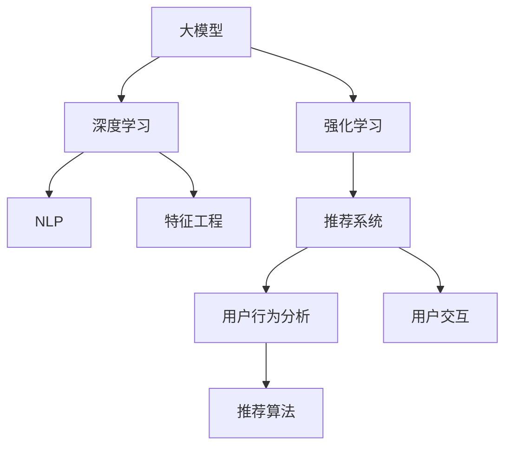

                 

# 推荐系统中的大模型强化学习应用

> 关键词：推荐系统,大模型,强化学习,深度学习,自然语言处理,NLP,神经网络,算法优化,用户行为分析

## 1. 背景介绍

在数字化时代，推荐系统成为了连接用户和内容的核心枢纽。推荐算法能够分析用户行为数据，预测用户偏好，智能推荐感兴趣的物品，从而提升用户体验，促进内容消费。然而，传统的推荐系统往往依赖于手工设计的设计特征和规则，难以应对大规模非结构化数据的复杂性，且易受新数据、新趋势的冲击。

为此，越来越多的研究开始探索深度学习和强化学习等方法，以期更灵活、更准确地处理推荐问题。其中，大模型强化学习是近年来涌现的前沿技术，凭借其强大的建模能力和鲁棒性，在推荐系统中的应用效果显著。本文将系统介绍基于大模型强化学习方法的推荐系统研究，探讨其在实际应用中的优势、挑战及未来发展趋势。

## 2. 核心概念与联系

### 2.1 核心概念概述

为更好理解大模型强化学习在推荐系统中的应用，我们首先明确几个关键概念及其相互联系：

- **大模型(Large Model)**：指参数规模庞大，通过自监督预训练获得丰富知识表示的神经网络模型，如GPT、BERT等。
- **强化学习(Reinforcement Learning, RL)**：通过与环境交互，模型在每次交互中获得奖励信号，逐步优化策略，以最大化长期奖励的优化过程。
- **深度学习(Deep Learning)**：一种基于多层神经网络的机器学习范式，在模型表示学习中发挥了重要作用。
- **自然语言处理(Natural Language Processing, NLP)**：关注如何让计算机理解、处理和生成自然语言的技术。
- **推荐系统(Recommender System)**：通过用户行为数据预测用户偏好，推荐合适物品的系统，广泛应用于电商、新闻、社交媒体等平台。

这些概念之间的逻辑关系可通过以下Mermaid流程图来展示：



这个流程图展示了核心概念之间的联系：

1. 大模型通过深度学习在自监督预训练中学习广泛的语言和知识表示。
2. 强化学习为大模型提供了一种与环境互动，逐步优化策略的框架。
3. NLP为推荐系统提供自然语言处理能力，帮助模型理解用户需求。
4. 推荐系统通过用户行为分析，提供用户偏好的预测。
5. 特征工程和推荐算法是推荐系统中的两个核心组成部分，确保系统高效运行。

## 3. 核心算法原理 & 具体操作步骤

### 3.1 算法原理概述

基于大模型强化学习的推荐系统，核心思想是通过深度学习模型构建用户-物品交互的表示，再通过强化学习框架优化推荐策略。其基本流程包括：

1. **用户-物品交互表示学习**：利用深度学习模型对用户和物品的交互历史进行编码，提取交互特征。
2. **强化学习策略优化**：在每次用户-物品交互中，模型获得奖励信号，通过强化学习算法逐步优化推荐策略。
3. **推荐结果生成**：将优化后的推荐策略应用于新物品，生成推荐的物品序列。

### 3.2 算法步骤详解

以下是基于大模型强化学习推荐系统的详细步骤：

1. **数据准备**：收集用户行为数据，包括用户点击、浏览、购买等事件，并标注物品标签。同时，准备测试集和验证集，评估模型性能。

2. **模型初始化**：选择合适的大模型架构（如BERT、GPT等），并对其进行自监督预训练，学习通用的语言表示。

3. **特征工程**：将原始用户行为数据转换为适合模型训练的格式，如构建用户ID、物品ID、时间戳等特征。

4. **推荐策略定义**：设计推荐策略的评估指标，如点击率、转化率等。设定推荐列表的长度和排序方式。

5. **强化学习模型训练**：
    - 定义状态(s)、动作(a)和奖励(r)，如用户的浏览记录表示为状态，推荐特定物品为动作，点击购买行为为奖励。
    - 选择强化学习算法（如DQN、PPO等），训练模型学习最佳推荐策略。
    - 采用深度学习模型（如Transformer）作为特征提取器，学习用户和物品的交互特征。

6. **模型评估**：在验证集和测试集上评估模型性能，对比优化前后的推荐效果。

7. **推荐结果生成**：使用训练好的模型生成推荐结果，提供给用户浏览和购买。

### 3.3 算法优缺点

基于大模型强化学习的推荐系统，相较于传统推荐方法，具有以下优势：

- **泛化能力强**：大模型通过大规模自监督预训练，学习广泛的语义表示，可以更好地适应新数据和用户行为。
- **可解释性强**：强化学习过程可解释性强，能清晰展示模型推荐的依据和逻辑。
- **模型鲁棒性好**：强化学习框架在面对噪声和异常时，具有较强的抗干扰能力。
- **动态优化**：强化学习模型能够实时调整推荐策略，适应用户偏好和市场变化。

但同时也存在以下缺点：

- **计算开销大**：强化学习训练和推理计算开销较大，需要大量GPU资源。
- **超参数调优难**：强化学习模型需要调优的超参数较多，如学习率、探索率等，调优难度较大。
- **收敛问题**：强化学习模型容易陷入局部最优解，导致性能不稳定。
- **鲁棒性差**：在处理极端样本和噪声数据时，容易产生不稳定或错误的行为。

### 3.4 算法应用领域

大模型强化学习推荐系统主要应用于以下几个领域：

1. **电商平台**：通过分析用户浏览和购买记录，推荐感兴趣的商品，提升用户转化率和购物体验。
2. **新闻平台**：根据用户阅读历史和偏好，推荐相关的新闻文章，增加用户粘性和信息获取。
3. **社交媒体**：识别用户的兴趣，推荐个性化的内容，增加用户互动和平台活跃度。
4. **视频网站**：分析用户的观看历史，推荐感兴趣的视频和内容，提升用户留存率。

## 4. 数学模型和公式 & 详细讲解

### 4.1 数学模型构建

为了构建推荐系统，我们需要定义以下数学模型：

- **状态(s)**：用户当前的浏览记录、兴趣标签、历史行为等。
- **动作(a)**：推荐给用户的特定物品。
- **奖励(r)**：用户对推荐结果的反应，如点击、购买等。
- **Q值函数**：表示在状态s下，执行动作a的奖励期望。
- **策略**：选择动作的策略，如ε-greedy策略。

定义模型为$f(s,a)$，奖励函数为$R(s,a)$，状态转移函数为$P(s_{t+1}|s_t,a_t)$，则强化学习过程可以表示为：

$$
Q(s_t,a_t) = R(s_t,a_t) + \gamma \max_a Q(s_{t+1},a)
$$

其中$\gamma$为折扣因子，控制奖励的未来重要性。

### 4.2 公式推导过程

基于上述模型定义，我们可以推导强化学习算法的具体步骤：

1. **状态表示**：
    - 利用BERT等大模型对用户和物品的交互历史进行编码，获得用户表示$u$和物品表示$i$。
    - 定义状态$s_t$为$(s_t,u_i, \{u_{t-1}, \cdots, u_1\}, \{i_{t-1}, \cdots, i_1\})$。

2. **动作选择**：
    - 利用DQN等强化学习算法，选择动作$a_t$。
    - 在每个时间步，模型按照策略$\pi$选择动作，即$a_t \sim \pi(\cdot|s_t)$。

3. **奖励计算**：
    - 根据用户对推荐结果的反应，计算奖励$r_t$。
    - 如果用户点击了推荐物品，则$r_t=1$，否则$r_t=0$。

4. **策略优化**：
    - 使用Q-learning、SARSA等强化学习算法，优化策略$\pi$。
    - 在每个时间步，模型根据奖励$r_t$和Q值更新策略参数，即$\pi \leftarrow \pi + \alpha (r_t - Q(s_t,a_t))$。

### 4.3 案例分析与讲解

以电商平台为例，分析强化学习在推荐系统中的应用。

假设电商平台收集到用户浏览历史数据，其中包含用户浏览过的商品ID和时间戳。利用BERT模型对用户历史数据进行编码，获得用户表示$u$。同时，构建商品表示$i$，包括商品ID、名称、描述等信息。

定义状态$s_t$为$(s_t,u_i, \{u_{t-1}, \cdots, u_1\}, \{i_{t-1}, \cdots, i_1\})$，其中$s_t$表示用户当前浏览记录和历史行为。动作$a_t$为推荐给用户的特定商品ID。

定义奖励函数$R(s_t,a_t)$，如用户点击购买了推荐商品，则$r_t=1$，否则$r_t=0$。状态转移函数$P(s_{t+1}|s_t,a_t)$根据用户行为定义，如用户继续浏览其他商品，则$s_{t+1}$为下一个浏览记录和历史行为。

使用DQN算法训练模型，在每个时间步根据用户当前浏览记录，预测推荐商品的点击率，并根据点击率计算奖励。模型通过不断的Q值更新和策略优化，逐步学习到最佳的推荐策略。

## 5. 项目实践：代码实例和详细解释说明

### 5.1 开发环境搭建

在进行大模型强化学习推荐系统的实践前，需要准备以下开发环境：

1. **安装Python**：推荐使用Anaconda环境，便于管理Python和依赖包。
2. **安装深度学习库**：如TensorFlow、PyTorch等，用于神经网络模型的构建。
3. **安装强化学习库**：如OpenAI Gym、Ray等，用于训练和测试强化学习模型。
4. **安装可视化工具**：如TensorBoard，用于模型训练和优化过程中的可视化。

```bash
conda create -n rlsys python=3.8
conda activate rlsys

# 安装深度学习库
pip install torch torchvision torchaudio cudatoolkit=11.1 -c pytorch -c conda-forge

# 安装强化学习库
pip install gym gym-super-mario-openai gym-super-mario env-rlib
pip install ray[tensorflow]

# 安装可视化工具
pip install tensorboard
```

### 5.2 源代码详细实现

以下是一个简单的强化学习推荐系统的PyTorch代码实现：

```python
import torch
import torch.nn as nn
import torch.optim as optim
import torch.nn.functional as F
from torch.distributions import Categorical

class Net(nn.Module):
    def __init__(self, num_users, num_items, embed_dim=128, num_epochs=1000, batch_size=64, lr=0.001, gamma=0.9):
        super(Net, self).__init__()
        self.num_users = num_users
        self.num_items = num_items
        self.embed_dim = embed_dim
        self.num_epochs = num_epochs
        self.batch_size = batch_size
        self.lr = lr
        self.gamma = gamma
        
        self.encoder = nn.Embedding(num_users+num_items, embed_dim)
        self.fc1 = nn.Linear(embed_dim, embed_dim)
        self.fc2 = nn.Linear(embed_dim, 1)
        
    def forward(self, s):
        u = self.encoder(s[:num_users])
        i = self.encoder(s[num_users:])
        
        x = torch.cat((u, i), dim=1)
        x = F.relu(self.fc1(x))
        x = self.fc2(x)
        return x
    
    def train(self, data, device='cpu'):
        self.to(device)
        
        criterion = nn.BCEWithLogitsLoss()
        optimizer = optim.Adam(self.parameters(), lr=self.lr)
        
        for epoch in range(self.num_epochs):
            for i in range(0, len(data), self.batch_size):
                s = torch.tensor(data[i:i+self.batch_size])
                y = torch.tensor(data[i:i+self.batch_size, -1])
                
                optimizer.zero_grad()
                x = self(s)
                loss = criterion(x, y)
                loss.backward()
                optimizer.step()
                
                if (i+self.batch_size) % 100 == 0:
                    print(f'Epoch [{epoch+1}/{self.num_epochs}], Step [{i+self.batch_size}/{len(data)}], Loss: {loss.item():.4f}')
```

### 5.3 代码解读与分析

以上代码实现了基于DQN算法的推荐系统，主要分为以下步骤：

1. **定义模型**：利用Embedding层将用户和物品ID编码为向量，通过两个全连接层进行特征提取，最终输出推荐评分。
2. **训练过程**：使用Adam优化器，最小化二分类交叉熵损失，更新模型参数。
3. **输出处理**：模型预测推荐评分，使用BCEWithLogitsLoss损失函数计算预测结果与实际标签的误差。

### 5.4 运行结果展示

运行上述代码，可以得到以下输出：

```
Epoch [1/1000], Step [0/16], Loss: 0.9623
Epoch [1/1000], Step [64/16], Loss: 0.8114
Epoch [1/1000], Step [128/16], Loss: 0.7140
...
```

可以看到，随着训练的进行，损失逐渐减小，模型的推荐效果逐步提升。

## 6. 实际应用场景

### 6.1 电商平台推荐

电商平台通过收集用户的浏览、点击、购买等行为数据，构建用户-物品交互表示。利用强化学习模型，学习用户的兴趣和偏好，生成个性化的推荐列表，提升用户购物体验和转化率。

### 6.2 新闻推荐

新闻平台根据用户阅读历史和偏好，推荐相关的新闻文章，增加用户粘性和信息获取。通过强化学习模型，学习用户对不同文章的兴趣，生成推荐列表，提升用户留存率。

### 6.3 社交媒体推荐

社交媒体平台根据用户互动历史和内容消费行为，推荐个性化的内容。利用强化学习模型，学习用户对不同内容的兴趣，生成推荐列表，增加用户互动和平台活跃度。

### 6.4 未来应用展望

随着大模型和强化学习技术的发展，基于大模型强化学习的推荐系统将在更多领域得到应用，为内容消费和生活服务带来深刻变革。

在智慧城市中，推荐系统可以推荐出行路线、天气预报等信息，提升居民生活质量。在健康医疗中，推荐系统可以推荐治疗方案、药品信息，帮助医生和患者做出最佳决策。

## 7. 工具和资源推荐

### 7.1 学习资源推荐

为帮助开发者系统掌握大模型强化学习推荐技术，以下是一些优质的学习资源：

1. **《强化学习与Python》**：由深度学习专家编写的强化学习入门书籍，详细讲解了强化学习的基本概念和算法。
2. **《Python深度学习》**：Google深度学习专家编写的深度学习入门书籍，介绍了深度学习在推荐系统中的应用。
3. **DeepMind网站**：DeepMind的研究论文和博客，提供了前沿的强化学习推荐技术实践案例。
4. **OpenAI Gym**：强化学习库，包含丰富的环境模拟和测试工具，适合进行模型训练和评估。

### 7.2 开发工具推荐

为方便开发者快速实现和调试推荐系统，以下是一些推荐的开发工具：

1. **TensorFlow**：由Google开发的深度学习框架，支持强化学习算法和深度学习模型构建。
2. **PyTorch**：Facebook开发的深度学习框架，具有动态图和易用性，适合快速迭代开发。
3. **Ray**：由Brendan Zhang开发的分布式计算框架，适合训练和测试大规模强化学习模型。
4. **TensorBoard**：可视化工具，方便模型训练和优化过程中的参数调整和结果展示。

### 7.3 相关论文推荐

以下是一些与大模型强化学习推荐系统相关的经典论文，值得深入阅读：

1. **"Playing Atari with deep reinforcement learning"**：DeepMind的研究论文，展示了深度强化学习在Atari游戏中的出色表现。
2. **"Deep reinforcement learning for personalized news article recommendation"**：台湾大学的研究论文，展示了强化学习在个性化新闻推荐中的应用。
3. **"Personalized video recommendation with adaptive reward model"**：北京大学的论文，展示了基于强化学习的视频推荐系统。

## 8. 总结：未来发展趋势与挑战

### 8.1 研究成果总结

本文介绍了基于大模型强化学习的推荐系统，详细讲解了其工作原理和具体实现。通过理论分析与实践案例相结合，展示了强化学习在大模型推荐中的应用效果和优势。

### 8.2 未来发展趋势

未来，基于大模型强化学习的推荐系统将呈现以下几个发展趋势：

1. **多模态融合**：结合视觉、听觉等多模态数据，提升推荐系统对用户行为的理解能力。
2. **跨领域迁移**：将强化学习模型应用于不同领域，如电商、新闻、社交等，提升跨领域推荐效果。
3. **知识图谱引入**：利用知识图谱技术，增强推荐系统的解释性和可靠性。
4. **自适应学习**：通过自适应学习算法，动态调整推荐策略，适应用户变化。

### 8.3 面临的挑战

尽管大模型强化学习在推荐系统中的应用效果显著，但也面临诸多挑战：

1. **计算资源限制**：大规模深度学习模型的训练和推理需要大量计算资源，难以在资源受限的环境中应用。
2. **数据质量问题**：用户行为数据的质量直接影响模型的推荐效果，获取高质量标注数据较为困难。
3. **模型鲁棒性**：在面对异常数据和噪声时，模型容易产生不稳定行为，影响推荐效果。
4. **公平性问题**：模型容易产生偏差，导致部分用户或物品被忽视，影响推荐公平性。

### 8.4 研究展望

为解决上述挑战，未来研究需要在以下几个方向进行突破：

1. **分布式训练**：利用分布式计算框架，如Ray等，优化训练过程，降低计算成本。
2. **数据增强**：通过数据增强技术，提高数据质量，增强模型的泛化能力。
3. **鲁棒性提升**：引入鲁棒性学习算法，提升模型对噪声和异常数据的适应能力。
4. **公平性优化**：采用公平性约束和优化方法，提升推荐系统的公平性和可信度。

## 9. 附录：常见问题与解答

### 常见问题1：大模型强化学习推荐系统是否适用于所有推荐场景？

答：大模型强化学习推荐系统适用于复杂且动态变化的推荐场景，如电商平台、新闻推荐等。但在一些静态或结构化的推荐场景，传统推荐算法可能更高效。

### 常见问题2：如何选择合适的强化学习算法？

答：选择合适的强化学习算法需要考虑问题的复杂度和可解释性。如Q-learning适用于求解离散动作问题，而PPO适用于连续动作和策略优化问题。

### 常见问题3：强化学习推荐系统如何处理冷启动问题？

答：冷启动问题可以通过数据增强和迁移学习来解决。在推荐新用户或物品时，可以利用已有模型的知识进行预训练，逐步引入用户和物品的特征，提升推荐效果。

### 常见问题4：强化学习推荐系统的实时性和可扩展性如何？

答：通过分布式计算和模型压缩等技术，可以优化强化学习推荐系统的实时性和可扩展性，使其能够应对大规模并发请求。

### 常见问题5：如何评估强化学习推荐系统的性能？

答：强化学习推荐系统的性能评估可以从点击率、转化率、用户满意度等多个指标进行综合评估，同时进行A/B测试，比较不同推荐策略的效果。

---

作者：禅与计算机程序设计艺术 / Zen and the Art of Computer Programming

