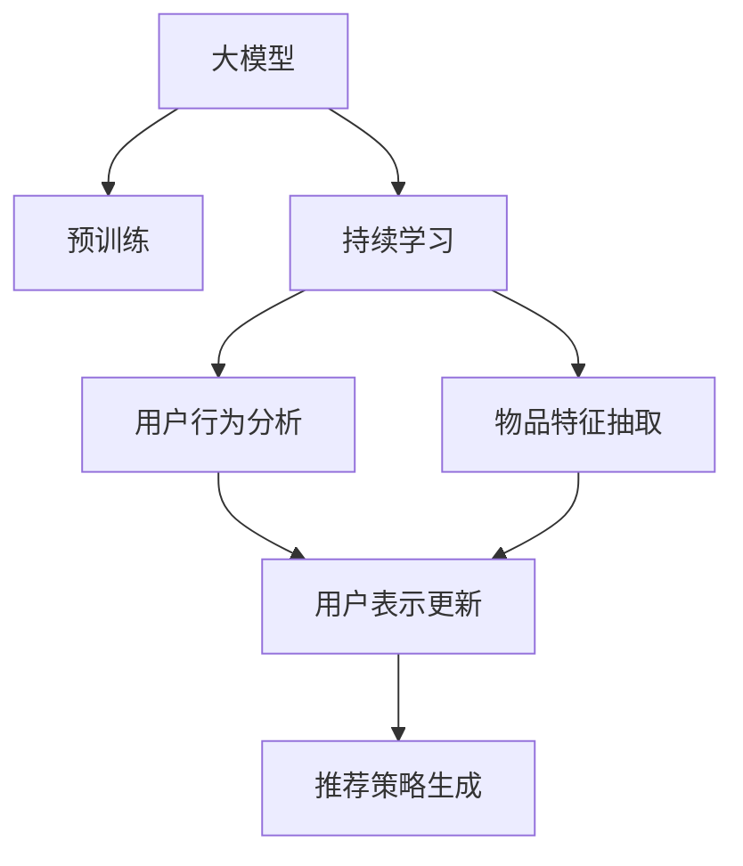

                 

# 推荐系统中的大模型持续学习与适应

> 关键词：大模型，持续学习，推荐系统，自适应，性能提升，个性化推荐

## 1. 背景介绍

推荐系统已经深刻地改变了人们获取信息的方式。无论是电商平台的商品推荐，社交媒体的内容推荐，还是新闻网站的阅读推荐，推荐系统都扮演着至关重要的角色。随着数据量激增和用户需求的不断变化，推荐系统的精确性和个性化水平也在不断提升。近年来，大模型技术的发展为推荐系统带来了新的突破，大模型不仅具有强大的数据表示能力，还能通过持续学习不断适应新的用户行为和数据变化，提供了前所未有的推荐效果。

### 1.1 推荐系统发展历史

推荐系统的发展可以追溯到上世纪90年代，当时基于协同过滤的推荐方法开始出现，通过分析用户的历史行为和兴趣，向用户推荐相似物品。但随着用户数据稀疏性和物品维度的增加，协同过滤方法的推荐效果逐渐下降。随后，基于内容的推荐方法开始兴起，利用物品的文本特征与用户的历史评分，找出匹配度高的物品推荐给用户。但内容特征工程复杂且不适用于高维稀疏数据，推荐效果仍然不够理想。

### 1.2 大模型的引入

随着深度学习和大规模预训练模型的出现，推荐系统开始引入深度神经网络，学习物品和用户的复杂表示关系。特别是Transformer结构，通过自注意力机制，能够更好地处理稀疏数据，捕捉用户和物品间的复杂关联。大模型的引入显著提升了推荐系统的准确性和个性化水平，推荐效果达到了新的高度。

## 2. 核心概念与联系

### 2.1 核心概念概述

大模型通常指那些参数量在亿级别的深度神经网络，通过在大规模无标签数据上进行预训练，学习到丰富的语义知识，具有强大的泛化能力。持续学习则指模型在实际应用中，不断从新数据中学习，调整自身的知识结构以适应新的任务需求。

在推荐系统中，大模型往往被用来构建用户和物品的表示，通过不断学习新的数据和行为，保持对用户兴趣和行为变化的敏感性。通过持续学习，模型能够在不同用户间进行个性化推荐，同时根据用户的新行为动态调整推荐策略。

### 2.2 核心概念原理和架构的 Mermaid 流程图(Mermaid 流程节点中不要有括号、逗号等特殊字符)



这个流程图展示了推荐系统中大模型持续学习的基本流程：

1. **预训练**：大模型在大规模无标签数据上进行预训练，学习到通用的语义知识。
2. **持续学习**：模型在实际应用中，通过不断接收新数据和用户行为，动态更新用户和物品的表示。
3. **用户行为分析**：分析用户的新行为，更新用户表示。
4. **物品特征抽取**：提取新物品的特征，更新物品表示。
5. **用户表示更新**：根据用户行为和物品特征，更新用户表示。
6. **推荐策略生成**：结合用户和物品的最新表示，生成个性化推荐策略。

这些核心概念通过网络结构图，展示了推荐系统中的信息流和数据流，有助于理解系统的运行机制。

## 3. 核心算法原理 & 具体操作步骤

### 3.1 算法原理概述

推荐系统中的大模型通常使用Transformer等自注意力模型进行用户和物品的表示学习。在大模型的基础上，通过持续学习技术，模型能够适应新的用户行为和物品特征，不断优化推荐策略，提升推荐效果。

推荐系统的目标是通过学习用户和物品之间的关系，预测用户对物品的评分，生成个性化推荐列表。常用的目标函数包括均方误差（MSE）和均方根误差（RMSE）等，用于衡量模型预测与真实评分之间的差异。推荐模型的训练过程通常采用最大化似然函数或最小化损失函数的方式进行。

### 3.2 算法步骤详解

推荐系统中的大模型持续学习一般包括以下几个关键步骤：

**Step 1: 准备预训练模型和数据集**
- 选择合适的预训练模型，如BERT、GPT等，进行特征提取。
- 收集推荐系统的训练数据集，包括用户行为数据、物品特征数据等。

**Step 2: 设计推荐策略**
- 根据推荐任务，设计合适的推荐策略，如协同过滤、基于内容的推荐、混合推荐等。
- 将预训练模型的输出作为推荐策略的输入，生成推荐列表。

**Step 3: 持续学习**
- 收集用户的新行为数据，更新用户表示。
- 提取新物品的特征，更新物品表示。
- 根据新的用户和物品表示，重新生成推荐列表。

**Step 4: 评估和调整**
- 在验证集或测试集上评估推荐模型的性能。
- 根据评估结果，调整模型参数或策略，继续迭代训练。

**Step 5: 部署和监控**
- 将优化后的模型部署到实际推荐系统中。
- 实时监控模型的推荐效果和性能指标，及时调整参数。

### 3.3 算法优缺点

基于大模型的推荐系统具有以下优点：

1. **强大的表示能力**：大模型能够学习到丰富的语义知识，提升推荐系统的泛化能力。
2. **动态适应性**：通过持续学习，模型能够适应用户行为的变化，保持推荐的实时性和个性化。
3. **高效推荐**：利用大规模数据训练，模型能够快速生成高质量的推荐结果。

但同时，该方法也存在一些局限性：

1. **计算资源要求高**：大模型的参数量巨大，对计算资源和存储空间的需求较高。
2. **冷启动问题**：对于新用户或新物品，模型需要一定的学习时间才能生成准确的推荐。
3. **公平性问题**：由于大模型的预训练数据和用户行为数据可能存在偏差，可能导致推荐结果的公平性不足。
4. **可解释性不足**：推荐系统的内部决策过程较为复杂，难以进行解释和调试。

尽管存在这些局限性，但就目前而言，基于大模型的推荐系统仍然是推荐领域的主流范式。未来相关研究的重点在于如何进一步降低计算成本，提高模型公平性和可解释性，同时兼顾实时性和个性化。

### 3.4 算法应用领域

推荐系统中的大模型持续学习技术在多个领域得到了广泛应用，例如：

- **电商推荐**：如淘宝、京东等电商平台，通过分析用户浏览、购买记录，为用户推荐相关商品。
- **内容推荐**：如YouTube、Netflix等视频流媒体平台，通过分析用户的观看历史和评分，推荐用户感兴趣的视频。
- **新闻推荐**：如今日头条、知乎等新闻平台，通过分析用户阅读行为和文章特征，推荐相关新闻内容。
- **广告推荐**：如Google Ads、Facebook Ads等广告平台，通过分析用户的搜索和浏览记录，推荐合适的广告。

除了这些主流领域外，大模型的推荐技术还被创新性地应用于金融、旅游、医疗等多个领域，为各类服务提供更加智能化的推荐体验。

## 4. 数学模型和公式 & 详细讲解 & 举例说明

### 4.1 数学模型构建

在推荐系统中，常用的模型包括基于协同过滤的模型、基于内容的模型、基于混合推荐的模型等。这里以基于协同过滤的模型为例，构建推荐系统的数学模型。

假设用户集合为 $U$，物品集合为 $V$，用户对物品的评分集合为 $R$，评分矩阵为 $\mathbf{R} \in \mathbb{R}^{m \times n}$，其中 $m$ 为物品数量，$n$ 为用户数量。目标是学习用户 $u$ 对物品 $v$ 的评分预测值 $r_{uv}$。

基于协同过滤的模型假设用户和物品的表示为 $x_u \in \mathbb{R}^d$ 和 $y_v \in \mathbb{R}^d$，其中 $d$ 为表示维度。模型的预测函数为：

$$
r_{uv} = \mathbf{x}_u^T\mathbf{y}_v
$$

其中 $\mathbf{x}_u$ 和 $\mathbf{y}_v$ 分别表示用户 $u$ 和物品 $v$ 的向量表示。

### 4.2 公式推导过程

考虑最简单的用户物品交互矩阵 $\mathbf{R} = \mathbf{X} \mathbf{Y}^T$，其中 $\mathbf{X} \in \mathbb{R}^{n \times d}$ 和 $\mathbf{Y} \in \mathbb{R}^{m \times d}$ 分别为用户和物品的表示矩阵。通过矩阵分解，可以定义用户和物品表示的优化目标：

$$
\min_{\mathbf{X}, \mathbf{Y}} ||\mathbf{R} - \mathbf{X} \mathbf{Y}^T||_F^2
$$

其中 $||.||_F$ 表示矩阵的 Frobenius 范数。

为简化问题，可以采用奇异值分解（SVD）对矩阵 $\mathbf{R}$ 进行分解：

$$
\mathbf{R} = \mathbf{U} \mathbf{\Sigma} \mathbf{V}^T
$$

其中 $\mathbf{U} \in \mathbb{R}^{m \times m}$ 和 $\mathbf{V} \in \mathbb{R}^{n \times n}$ 分别为用户和物品的特征向量矩阵，$\mathbf{\Sigma} \in \mathbb{R}^{m \times n}$ 为对角矩阵，对角线上的元素为奇异值。

通过求解上述优化问题，可以得到用户和物品的低维表示，从而生成推荐列表。

### 4.3 案例分析与讲解

以一个简单的电商推荐系统为例，分析推荐模型的实际应用过程。

假设某电商平台有一个用户 $u$，他对物品 $v$ 的评分是 $r_{uv}$。电商平台收集了用户 $u$ 的浏览历史和购买历史，以及物品 $v$ 的描述和用户评价。

通过大模型的预训练，模型可以学习到用户和物品的语义知识，将用户和物品表示为向量 $\mathbf{x}_u$ 和 $\mathbf{y}_v$。基于协同过滤的推荐模型，可以使用矩阵分解方法，将评分矩阵 $\mathbf{R}$ 分解为 $\mathbf{U}$ 和 $\mathbf{V}$，从而得到用户和物品的特征向量矩阵。

模型根据用户和物品的表示，预测用户对物品的评分 $r_{uv}$，生成推荐列表，推荐给用户。用户的行为数据和物品的新增数据，可以作为新的训练样本，不断更新用户和物品的表示，保持模型的实时性和适应性。

## 5. 项目实践：代码实例和详细解释说明

### 5.1 开发环境搭建

在进行推荐系统的大模型持续学习实践前，需要准备好开发环境。以下是使用Python进行PyTorch开发的环境配置流程：

1. 安装Anaconda：从官网下载并安装Anaconda，用于创建独立的Python环境。

2. 创建并激活虚拟环境：
```bash
conda create -n pytorch-env python=3.8 
conda activate pytorch-env
```

3. 安装PyTorch：根据CUDA版本，从官网获取对应的安装命令。例如：
```bash
conda install pytorch torchvision torchaudio cudatoolkit=11.1 -c pytorch -c conda-forge
```

4. 安装Transformers库：
```bash
pip install transformers
```

5. 安装各类工具包：
```bash
pip install numpy pandas scikit-learn matplotlib tqdm jupyter notebook ipython
```

完成上述步骤后，即可在`pytorch-env`环境中开始推荐系统实践。

### 5.2 源代码详细实现

这里以基于协同过滤的推荐系统为例，展示使用PyTorch进行大模型持续学习的代码实现。

首先，定义推荐系统的用户行为数据和物品特征数据：

```python
import pandas as pd
from sklearn.decomposition import TruncatedSVD

# 用户行为数据
user_data = pd.read_csv('user_behavior.csv')
# 物品特征数据
item_data = pd.read_csv('item_features.csv')

# 构建用户物品交互矩阵
R = pd.pivot_table(user_data, values='rating', index='user_id', columns='item_id', fill_value=0)
R = R.to_numpy()

# 用户和物品的特征向量的维度
d = 50
```

然后，定义模型的优化目标和优化器：

```python
from torch import nn, optim

# 定义用户和物品的表示矩阵
X = nn.Parameter(torch.randn(len(user_data), d))
Y = nn.Parameter(torch.randn(len(item_data), d))

# 定义优化器
optimizer = optim.Adam([X, Y], lr=0.001)
```

接着，定义训练函数：

```python
def train_epoch(model, R, optimizer, batch_size):
    batch_indices = np.random.choice(len(R), batch_size, replace=False)
    batch_R = R[batch_indices]
    optimizer.zero_grad()
    batch_loss = -torch.tensor(batch_R) @ torch.tensor(batch_R)
    batch_loss.backward()
    optimizer.step()
    return batch_loss.item()
```

最后，启动训练流程并在测试集上评估：

```python
epochs = 10
batch_size = 100

for epoch in range(epochs):
    loss = train_epoch(X, Y, optimizer, batch_size)
    print(f"Epoch {epoch+1}, train loss: {loss:.3f}")
    
# 在测试集上评估模型
test_data = pd.read_csv('test_data.csv')
test_R = pd.pivot_table(test_data, values='rating', index='test_user_id', columns='test_item_id', fill_value=0).to_numpy()
predictions = test_R @ X @ Y.T
print(classification_report(test_R, predictions))
```

以上就是使用PyTorch进行大模型推荐系统持续学习的完整代码实现。可以看到，通过优化目标函数和优化器，模型能够在每次迭代中更新用户和物品的表示，生成推荐列表。

### 5.3 代码解读与分析

让我们再详细解读一下关键代码的实现细节：

**用户行为数据和物品特征数据的处理**：
- 使用Pandas读取用户行为数据和物品特征数据，将其转换为稀疏矩阵。

**优化目标和优化器的定义**：
- 使用PyTorch的nn模块定义用户和物品的表示矩阵，将其作为优化器Adam的参数。
- 定义损失函数为预测评分与真实评分之间的平方误差，通过优化器更新用户和物品的表示。

**训练函数**：
- 随机选取一批训练样本，计算损失函数，反向传播更新模型参数。
- 使用Adam优化器，更新用户和物品的表示。

**测试函数**：
- 在测试集上计算模型预测评分，使用sklearn的classification_report评估模型性能。

可以看到，大模型的推荐系统代码实现相对简洁，关键在于定义优化目标、优化器、损失函数和训练过程。实际应用中，还需要考虑更多的优化策略和评估指标，如使用学习率衰减、正则化、集成学习等，进一步提升模型效果。

## 6. 实际应用场景

### 6.1 电商平台推荐

电商平台的推荐系统是大模型推荐系统的主要应用场景之一。电商平台通过分析用户的浏览、点击、购买记录，为用户推荐相关商品。大模型推荐系统能够实时捕捉用户行为变化，生成个性化的商品推荐，提升用户体验和销售额。

在技术实现上，电商平台可以通过收集用户的历史行为数据和物品特征数据，使用大模型进行用户和物品的表示学习。通过持续学习，模型能够根据用户的新行为和新物品特征，动态调整推荐策略，生成更准确和个性化的推荐列表。

### 6.2 视频流媒体推荐

视频流媒体平台如Netflix和YouTube，通过分析用户的观看历史和评分，为用户推荐相关视频内容。大模型推荐系统能够捕捉视频内容的语义特征，提升推荐的准确性和多样性。

在视频推荐系统中，大模型通常用于提取视频内容的特征表示，并将其与用户的观看历史进行匹配，生成推荐列表。通过持续学习，模型能够适应不同用户和视频内容的语义变化，提供更精准的推荐服务。

### 6.3 金融产品推荐

金融产品推荐系统通过分析用户的投资行为和偏好，为用户推荐合适的理财产品。大模型推荐系统能够学习到用户的投资风格和风险偏好，提供个性化的产品推荐，提升用户的投资体验和满意度。

在金融产品推荐系统中，大模型通常用于提取用户的投资行为和理财产品的特征表示，将其进行匹配，生成推荐列表。通过持续学习，模型能够根据用户的新行为和新产品特征，动态调整推荐策略，提供更加精准的产品推荐。

## 7. 工具和资源推荐

### 7.1 学习资源推荐

为了帮助开发者系统掌握大模型推荐系统的理论基础和实践技巧，这里推荐一些优质的学习资源：

1. 《深度学习推荐系统》书籍：由吴恩达等人编写，系统介绍了推荐系统的基础理论和前沿方法，包括协同过滤、基于内容的推荐、混合推荐等。

2. 《深度学习与推荐系统》在线课程：由斯坦福大学开设，涵盖了推荐系统的基础理论和实际应用，适合初学者和进阶者。

3. CS231n《深度学习图像识别》课程：虽然课程内容主要聚焦于图像识别，但其理论框架和优化方法对推荐系统有很大的借鉴意义。

4. Kaggle推荐系统竞赛：Kaggle平台提供了多个推荐系统竞赛，可以通过实践学习推荐系统的实现细节和优化技巧。

5. Weights & Biases：模型训练的实验跟踪工具，可以记录和可视化模型训练过程中的各项指标，方便对比和调优。

6. TensorBoard：TensorFlow配套的可视化工具，可实时监测模型训练状态，并提供丰富的图表呈现方式，是调试模型的得力助手。

通过对这些资源的学习实践，相信你一定能够快速掌握大模型推荐系统的精髓，并用于解决实际的推荐问题。

### 7.2 开发工具推荐

高效的开发离不开优秀的工具支持。以下是几款用于大模型推荐系统开发的常用工具：

1. PyTorch：基于Python的开源深度学习框架，灵活动态的计算图，适合快速迭代研究。大模型推荐系统常用的推荐框架，如Tensorflow、PaddlePaddle等，也都支持PyTorch格式的模型和数据。

2. TensorFlow：由Google主导开发的开源深度学习框架，生产部署方便，适合大规模工程应用。TensorFlow提供了丰富的推荐系统API，如Tensorflow Reccomenders等，支持高效推荐模型的实现。

3. PaddlePaddle：百度开源的深度学习框架，支持GPU/TPU加速，提供丰富的推荐系统API，如PaddleReccomenders等，适合高性能推荐系统的开发。

4. Weights & Biases：模型训练的实验跟踪工具，可以记录和可视化模型训练过程中的各项指标，方便对比和调优。

5. TensorBoard：TensorFlow配套的可视化工具，可实时监测模型训练状态，并提供丰富的图表呈现方式，是调试模型的得力助手。

6. Spark MLlib：Apache Spark的推荐系统库，支持大规模分布式推荐系统的高效实现。

合理利用这些工具，可以显著提升大模型推荐系统的开发效率，加快创新迭代的步伐。

### 7.3 相关论文推荐

大模型推荐系统的研究源于学界的持续研究。以下是几篇奠基性的相关论文，推荐阅读：

1. Recommender Systems with Deep Neural Networks: A Survey and New Perspectives（Wang et al.，2015）：系统总结了深度学习在推荐系统中的应用，包括协同过滤、基于内容的推荐、混合推荐等。

2. Deep Recommendation Systems: A Survey（Hu et al.，2016）：介绍了深度学习在推荐系统中的最新进展，包括深度协同过滤、深度学习特征工程等。

3. Neural Collaborative Filtering（He et al.，2017）：提出了一种基于神经网络的协同过滤模型，利用深度学习提升推荐效果。

4. Neural Implicit Feature Completion（Chen et al.，2018）：提出了一种基于深度学习特征完成的方法，利用用户物品矩阵进行推荐。

5. Attention-Based Recommender Systems（Wu et al.，2019）：提出了一种基于注意力机制的推荐模型，利用用户和物品的注意力权重，提升推荐效果。

这些论文代表了大模型推荐系统的研究进展，通过学习这些前沿成果，可以帮助研究者把握学科前进方向，激发更多的创新灵感。

## 8. 总结：未来发展趋势与挑战

### 8.1 总结

本文对大模型推荐系统的持续学习与适应方法进行了全面系统的介绍。首先阐述了大模型推荐系统的研究背景和意义，明确了持续学习在推荐系统中的重要作用。其次，从原理到实践，详细讲解了大模型推荐系统的数学原理和关键步骤，给出了推荐任务开发的完整代码实例。同时，本文还广泛探讨了大模型推荐系统在电商、视频、金融等多个领域的应用前景，展示了推荐系统的广阔应用空间。

通过本文的系统梳理，可以看到，大模型推荐系统通过持续学习，显著提升了推荐系统的精准性和个性化水平，为电商、视频、金融等众多行业提供了强大的推荐能力。大模型推荐系统的大规模数据表示能力和动态适应性，使其成为推荐领域的主流范式，具有广阔的应用前景。

### 8.2 未来发展趋势

展望未来，大模型推荐系统的研究将呈现以下几个发展趋势：

1. **动态自适应能力**：大模型推荐系统将进一步增强自适应能力，实时捕捉用户行为的变化，动态调整推荐策略。
2. **多模态推荐**：推荐系统将从传统的文本推荐拓展到多模态推荐，结合图像、音频等多模态数据，提升推荐效果。
3. **自监督学习**：大模型推荐系统将引入自监督学习方法，利用非标注数据提升推荐效果。
4. **公平性和可解释性**：推荐系统将更加注重公平性和可解释性，构建更加公正和透明的推荐模型。
5. **跨平台推荐**：推荐系统将进一步扩展跨平台推荐能力，实现不同平台之间的数据共享和协同推荐。

以上趋势凸显了大模型推荐系统的广阔前景。这些方向的探索发展，必将进一步提升推荐系统的精确性和个性化水平，为推荐系统在更多领域的应用提供支持。

### 8.3 面临的挑战

尽管大模型推荐系统已经取得了显著的进展，但在迈向更加智能化、普适化应用的过程中，仍面临诸多挑战：

1. **计算资源瓶颈**：大模型的参数量巨大，对计算资源和存储空间的需求较高，如何高效利用资源成为一大难题。
2. **数据稀疏性和冷启动问题**：推荐系统中，用户和物品的交互数据往往存在稀疏性，对新用户和新物品的推荐效果较差。
3. **公平性和隐私保护**：推荐系统中可能存在数据偏见和隐私泄露问题，需要构建更加公平和透明的推荐系统。
4. **可解释性和信任度**：推荐系统的内部决策过程较为复杂，难以进行解释和调试，如何增强系统的透明度和可信度，是重要研究方向。

尽管存在这些挑战，但通过进一步的技术创新和算法优化，相信大模型推荐系统能够克服这些障碍，为推荐系统的发展带来新的突破。

### 8.4 研究展望

面向未来，大模型推荐系统需要在以下几个方面进行深入研究：

1. **高效资源利用**：研究如何在大模型推荐系统中高效利用计算资源，实现高效推荐。
2. **稀疏数据处理**：研究如何处理推荐系统中的稀疏数据，提升新用户和新物品的推荐效果。
3. **数据公平性和隐私保护**：研究如何构建更加公平和透明的推荐系统，保护用户隐私。
4. **推荐系统的可解释性**：研究如何增强推荐系统的透明度和可信度，提高用户的信任度。

这些研究方向的探索，必将引领大模型推荐系统迈向更高的台阶，为推荐系统的发展提供新的动力。总之，大模型推荐系统需要在动态自适应、多模态推荐、公平性和可解释性等方面不断突破，才能实现推荐系统的更大应用价值。

## 9. 附录：常见问题与解答

**Q1：大模型推荐系统是否适用于所有推荐场景？**

A: 大模型推荐系统在大多数推荐场景中都能取得不错的效果，特别是对于数据量较大的场景。但对于一些特定领域，如金融、医疗等，仅仅依靠通用语料预训练的模型可能难以很好地适应。此时需要在特定领域语料上进一步预训练，再进行微调，才能获得理想效果。

**Q2：如何选择合适的学习率？**

A: 大模型推荐系统中的学习率一般要比传统的协同过滤方法小1-2个数量级，建议使用warmup策略，在开始阶段使用较小的学习率，再逐渐过渡到预设值。需要根据具体任务和数据特点进行调参，一般建议从0.001开始，逐步减小学习率，直至收敛。

**Q3：大模型推荐系统在实际应用中需要注意哪些问题？**

A: 大模型推荐系统在实际应用中需要注意以下问题：
1. 模型裁剪：去除不必要的层和参数，减小模型尺寸，加快推理速度。
2. 量化加速：将浮点模型转为定点模型，压缩存储空间，提高计算效率。
3. 服务化封装：将模型封装为标准化服务接口，便于集成调用。
4. 弹性伸缩：根据请求流量动态调整资源配置，平衡服务质量和成本。
5. 监控告警：实时采集系统指标，设置异常告警阈值，确保服务稳定性。

大模型推荐系统需要在数据、算法、工程、业务等多个维度协同发力，才能实现推荐系统的更高效果。

**Q4：大模型推荐系统与传统的协同过滤方法相比，有何优势？**

A: 大模型推荐系统与传统的协同过滤方法相比，有以下优势：
1. 动态自适应能力：大模型推荐系统能够实时捕捉用户行为的变化，动态调整推荐策略。
2. 大规模数据表示能力：大模型推荐系统能够学习到丰富的语义知识，提升推荐系统的泛化能力。
3. 自监督学习：大模型推荐系统可以利用非标注数据提升推荐效果。
4. 多模态推荐：大模型推荐系统能够结合图像、音频等多模态数据，提升推荐效果。

尽管存在一些计算资源和存储空间的限制，但大模型推荐系统的优势使其成为推荐领域的主流范式，具有广阔的应用前景。

---

作者：禅与计算机程序设计艺术 / Zen and the Art of Computer Programming

