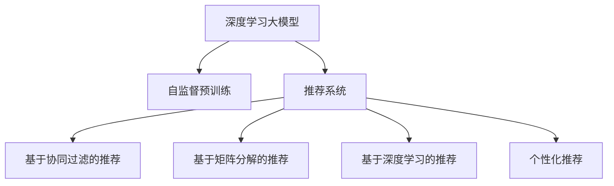

                 

# 推荐系统中的大模型课程学习应用

> 关键词：推荐系统, 大模型, 课程学习, 深度学习, 强化学习

## 1. 背景介绍

### 1.1 问题由来
随着互联网和移动互联网的普及，在线教育已成为学习的重要途径。用户在海量课程中寻找适合自己的内容，成为在线教育平台的核心需求之一。推荐系统通过分析用户的历史行为数据，为用户推荐个性化课程，显著提升了学习体验。

然而，传统推荐系统往往基于简单的协同过滤、矩阵分解等算法，难以充分挖掘用户行为中的复杂关联，推荐精度和个性化程度有限。近年来，基于深度学习的大模型推荐系统逐渐兴起，显著提升了推荐效果和个性化能力。大模型通过大规模无标签数据的自监督学习，学习到丰富的语义知识，具备强大的特征提取和理解能力，为个性化推荐注入了新的活力。

### 1.2 问题核心关键点
本文聚焦于基于深度学习的大模型在推荐系统中的应用。具体来说，通过在线课程推荐这一经典应用场景，详细介绍大模型如何帮助平台为用户推荐优质课程，提升学习体验。

### 1.3 问题研究意义
深度学习大模型在推荐系统中的应用，极大地提升了推荐精度和个性化能力，为在线教育平台带来了新的发展机遇。通过了解大模型在推荐系统中的应用，可以进一步优化推荐策略，提升用户满意度和平台收益。同时，大模型推荐技术也为其他领域的推荐系统提供了可参考的方案，如电商、音乐、视频等，具有重要的学术和产业价值。

## 2. 核心概念与联系

### 2.1 核心概念概述

为更好地理解大模型在推荐系统中的应用，本节将介绍几个关键概念：

- 深度学习大模型(Deep Learning Large Models)：通过大规模无标签数据自监督预训练获得广泛知识，具备强大的特征提取和理解能力，可用于下游任务。如BERT、GPT-3、DALL-E等。

- 推荐系统(Recommender System)：通过用户行为数据预测用户兴趣，为用户推荐个性化内容的技术。推荐系统广泛应用于电商、视频、新闻、教育等多个领域。

- 课程学习(Course Learning)：指用户通过在线教育平台学习课程，掌握新知识、技能的过程。在线教育平台的推荐系统，旨在帮助用户找到适合自己的课程。

- 个性化推荐(Personalized Recommendation)：根据用户行为数据和特征，为用户推荐符合其兴趣和需求的内容。

- 协同过滤(Collaborative Filtering)：推荐系统中常用的算法，通过用户行为数据和物品特征，预测用户兴趣。协同过滤包括基于用户的协同过滤和基于物品的协同过滤。

- 矩阵分解(Matrix Factorization)：推荐系统中常用的降维算法，通过分解用户-物品评分矩阵，获得用户和物品的低维表示，用于预测用户评分。

- 深度学习推荐系统(Deep Learning Based Recommender System)：利用深度学习模型，如循环神经网络、卷积神经网络、注意力机制等，预测用户行为，提升推荐效果。

这些概念之间的逻辑关系可以通过以下Mermaid流程图来展示：



这个流程图展示了从大模型到推荐系统的核心概念及其关系：

1. 深度学习大模型通过大规模无标签数据的自监督预训练获得广泛知识。
2. 推荐系统利用用户行为数据预测用户兴趣，为用户推荐个性化内容。
3. 协同过滤和矩阵分解是传统推荐系统常用的技术。
4. 深度学习技术在推荐系统中逐渐兴起，显著提升了推荐效果。
5. 个性化推荐技术是推荐系统的核心目标。

这些概念共同构成了在线教育平台个性化课程推荐的框架，使其能够更好地满足用户需求。

## 3. 核心算法原理 & 具体操作步骤
### 3.1 算法原理概述

基于深度学习大模型的个性化课程推荐，本质上是一个从用户行为数据中学习用户兴趣，并在课程库中寻找最匹配课程的过程。具体来说，大模型通过学习用户的行为序列，预测用户对每个课程的兴趣程度，从而为用户推荐个性化课程。

形式化地，假设用户的行为序列为 $X = (x_1, x_2, ..., x_n)$，其中 $x_i$ 表示用户行为数据，如观看视频、阅读文章等。假设课程库中的课程向量为 $C = (c_1, c_2, ..., c_m)$，其中 $c_i$ 表示课程的特征向量。设 $R(X,C)$ 为用户对课程库中所有课程的兴趣评分向量，则推荐目标为最大化 $R(X,C)$。

通过大模型 $M_{\theta}$ 将用户行为序列 $X$ 映射到高维空间，学习用户行为和课程特征之间的映射关系，从而预测用户对课程的评分。具体步骤如下：

1. 用户行为数据预处理：对用户的行为序列进行编码，获得用户行为表示向量 $X \in \mathbb{R}^d$。
2. 课程特征编码：对课程库中的每个课程进行特征提取，获得课程特征表示向量 $C \in \mathbb{R}^d$。
3. 用户兴趣预测：通过大模型 $M_{\theta}$ 预测用户对每个课程的兴趣评分，获得评分向量 $R(X,C) \in \mathbb{R}^m$。
4. 推荐排序：根据用户兴趣评分向量，对课程库中的课程进行排序，推荐最匹配的课程给用户。

### 3.2 算法步骤详解

基于深度学习大模型的个性化课程推荐算法步骤如下：

**Step 1: 数据准备**
- 收集用户的行为数据，如课程观看时长、阅读次数、浏览路径等。
- 对课程库中的每门课程进行特征提取，生成课程特征向量。
- 将用户行为数据和课程特征向量标准化，以便进行模型训练。

**Step 2: 构建大模型**
- 选择合适的深度学习模型，如循环神经网络(RNN)、卷积神经网络(CNN)、Transformer等。
- 对模型进行预训练，通常使用大规模无标签数据进行自监督学习。

**Step 3: 微调模型**
- 使用用户的少量标注数据，对大模型进行微调，以适应课程推荐任务。
- 选择合适的损失函数和优化器，进行模型训练。

**Step 4: 推荐预测**
- 对用户的行为序列进行编码，获得用户行为表示向量。
- 对课程库中的课程进行特征提取，获得课程特征表示向量。
- 将用户行为表示向量输入微调后的大模型，预测用户对每个课程的兴趣评分。
- 根据预测评分对课程进行排序，推荐最匹配的课程给用户。

### 3.3 算法优缺点

基于深度学习大模型的个性化课程推荐算法具有以下优点：
1. 准确率高：大模型通过学习海量数据，具备强大的特征提取和理解能力，能够准确预测用户对课程的评分。
2. 可扩展性强：大模型可以根据用户行为数据动态调整，适应不同用户和课程。
3. 个性化程度高：大模型能够学习用户的长期行为模式，提供个性化的推荐结果。

同时，该算法也存在一些缺点：
1. 依赖大量数据：大模型需要大量的用户行为数据进行训练和微调，获取数据的成本较高。
2. 计算资源需求大：大模型的训练和推理需要消耗大量的计算资源，部署成本较高。
3. 模型解释性差：大模型往往难以解释其内部工作机制和决策逻辑，用户难以理解和信任推荐结果。
4. 公平性问题：大模型可能学习到用户行为中的偏见，导致推荐结果不公平。

尽管存在这些局限性，但就目前而言，基于深度学习大模型的推荐方法仍是最主流范式。未来相关研究的重点在于如何进一步降低数据需求，提高模型的公平性和可解释性。

### 3.4 算法应用领域

基于深度学习大模型的个性化课程推荐算法，在在线教育平台中的应用已较为成熟，具体包括：

- 新课程推荐：根据用户的历史行为数据，为用户推荐适合的新课程。
- 课程路径规划：根据用户的学习进度和偏好，推荐合理的课程学习路径。
- 学习资源推荐：推荐适合用户当前学习阶段的教材、习题等学习资源。
- 个性化习题推荐：根据用户的学习效果，推荐适合的习题练习，巩固知识。
- 学习效果评估：分析用户学习效果，提供个性化学习建议。

除了在线教育平台，大模型推荐技术还应用于电商、音乐、视频等多个领域，为不同场景下的个性化推荐提供了新的思路。

## 4. 数学模型和公式 & 详细讲解 & 举例说明

### 4.1 数学模型构建

本节将使用数学语言对基于深度学习大模型的课程推荐模型进行更加严格的刻画。

设用户行为序列为 $X = (x_1, x_2, ..., x_n)$，课程库中的课程向量为 $C = (c_1, c_2, ..., c_m)$，用户对每个课程的兴趣评分向量为 $R(X,C) \in \mathbb{R}^m$。假设大模型 $M_{\theta}$ 将用户行为序列 $X$ 映射到高维空间，学习用户行为和课程特征之间的映射关系，则推荐目标为最大化 $R(X,C)$。

数学模型表示如下：

$$
R(X,C) = \max_{\theta} \left[ \sum_{i=1}^m r_i M_{\theta}(X) \cdot c_i \right]
$$

其中 $r_i$ 为课程 $i$ 的兴趣评分权重，$M_{\theta}(X)$ 为大模型对用户行为序列 $X$ 的表示向量。

### 4.2 公式推导过程

以下我们以BERT模型为例，推导基于深度学习大模型的课程推荐数学模型。

首先，将用户行为序列 $X$ 编码为固定长度的向量，使用BERT模型对用户行为进行编码，得到用户行为表示向量 $M_{\theta}(X) \in \mathbb{R}^d$。

其次，对课程库中的每个课程进行特征提取，获得课程特征向量 $c_i \in \mathbb{R}^d$。

最后，根据用户行为表示向量和课程特征向量，计算用户对每个课程的兴趣评分：

$$
R(X,C) = \max_{\theta} \left[ \sum_{i=1}^m r_i M_{\theta}(X) \cdot c_i \right]
$$

其中 $r_i$ 为课程 $i$ 的兴趣评分权重，$M_{\theta}(X)$ 为BERT模型对用户行为序列 $X$ 的表示向量。

### 4.3 案例分析与讲解

假设用户 $U$ 的行为序列为 $X = (x_1, x_2, ..., x_n)$，其中 $x_i$ 表示用户行为数据，如观看视频、阅读文章等。课程库中的课程向量为 $C = (c_1, c_2, ..., c_m)$，其中 $c_i$ 表示课程的特征向量。设 $R(X,C)$ 为用户对课程库中所有课程的兴趣评分向量，通过BERT模型预测用户对每个课程的兴趣评分。

1. 用户行为数据预处理：
   - 将用户的行为序列进行编码，得到固定长度的向量 $X \in \mathbb{R}^d$。
   - 对课程库中的每个课程进行特征提取，获得课程特征向量 $C \in \mathbb{R}^d$。

2. 构建大模型：
   - 使用BERT模型对用户行为序列进行编码，得到用户行为表示向量 $M_{\theta}(X) \in \mathbb{R}^d$。
   - 对课程库中的课程进行特征提取，获得课程特征向量 $c_i \in \mathbb{R}^d$。

3. 微调模型：
   - 使用用户的少量标注数据，对BERT模型进行微调，以适应课程推荐任务。
   - 选择合适的损失函数和优化器，进行模型训练。

4. 推荐预测：
   - 将用户行为表示向量 $M_{\theta}(X) \in \mathbb{R}^d$ 输入微调后的BERT模型，预测用户对每个课程的兴趣评分。
   - 根据预测评分对课程进行排序，推荐最匹配的课程给用户。

## 5. 项目实践：代码实例和详细解释说明

### 5.1 开发环境搭建

在进行推荐系统实践前，我们需要准备好开发环境。以下是使用Python进行TensorFlow开发的环境配置流程：

1. 安装Anaconda：从官网下载并安装Anaconda，用于创建独立的Python环境。

2. 创建并激活虚拟环境：
```bash
conda create -n tf-env python=3.8 
conda activate tf-env
```

3. 安装TensorFlow：根据CUDA版本，从官网获取对应的安装命令。例如：
```bash
conda install tensorflow -c pytorch -c conda-forge
```

4. 安装TensorFlow扩展库：
```bash
pip install tensorboard
```

5. 安装各类工具包：
```bash
pip install numpy pandas scikit-learn matplotlib tqdm jupyter notebook ipython
```

完成上述步骤后，即可在`tf-env`环境中开始推荐系统实践。

### 5.2 源代码详细实现

下面我们以在线课程推荐为例，给出使用TensorFlow对BERT模型进行微调的PyTorch代码实现。

首先，定义课程推荐的数据处理函数：

```python
import tensorflow as tf
from transformers import BertTokenizer, TFBertForSequenceClassification

class CourseRecommender:
    def __init__(self, max_seq_len, max_num_courses, num_labels):
        self.max_seq_len = max_seq_len
        self.max_num_courses = max_num_courses
        self.num_labels = num_labels
        self.tokenizer = BertTokenizer.from_pretrained('bert-base-cased')
        self.model = TFBertForSequenceClassification.from_pretrained('bert-base-cased', num_labels=num_labels)

    def preprocess_data(self, behaviors, courses):
        behaviors = behaviors.map(lambda x: x.to_list())
        courses = courses.map(lambda x: x.to_list())
        inputs = tokenizer(behaviors, padding=True, truncation=True, max_length=self.max_seq_len)
        inputs = {key: tf.convert_to_tensor(value, dtype=tf.int32) for key, value in inputs.items()}
        courses = tokenizer(courses, padding=True, truncation=True, max_length=self.max_seq_len)
        courses = {key: tf.convert_to_tensor(value, dtype=tf.int32) for key, value in courses.items()}
        return inputs, courses

    def encode_courses(self, courses):
        encoded_courses = []
        for course in courses:
            encoded_course = tokenizer(course, padding=True, truncation=True, max_length=self.max_seq_len)
            encoded_course = {key: tf.convert_to_tensor(value, dtype=tf.int32) for key, value in encoded_course.items()}
            encoded_courses.append(encoded_course)
        return encoded_courses

    def make_predictions(self, behaviors, courses):
        inputs = self.preprocess_data(behaviors, courses)
        course_features = self.encode_courses(courses)
        with tf.GradientTape() as tape:
            outputs = self.model(inputs['input_ids'], inputs['attention_mask'], course_features)
            loss = outputs.loss
        loss = tf.reduce_mean(loss)
        predictions = outputs.logits.numpy()
        return predictions, loss

    def train_step(self, behaviors, courses):
        predictions, loss = self.make_predictions(behaviors, courses)
        grads = tape.gradient(loss, self.model.trainable_variables)
        self.model.optimizer.apply_gradients(zip(grads, self.model.trainable_variables))

    def evaluate(self, behaviors, courses):
        predictions, loss = self.make_predictions(behaviors, courses)
        return predictions, loss
```

然后，定义模型和优化器：

```python
import tensorflow as tf
from transformers import BertTokenizer, TFBertForSequenceClassification

model = TFBertForSequenceClassification.from_pretrained('bert-base-cased', num_labels=2)

optimizer = tf.keras.optimizers.Adam(learning_rate=2e-5)
```

接着，定义训练和评估函数：

```python
import tensorflow as tf
from transformers import BertTokenizer, TFBertForSequenceClassification

class CourseRecommender:
    def __init__(self, max_seq_len, max_num_courses, num_labels):
        self.max_seq_len = max_seq_len
        self.max_num_courses = max_num_courses
        self.num_labels = num_labels
        self.tokenizer = BertTokenizer.from_pretrained('bert-base-cased')
        self.model = TFBertForSequenceClassification.from_pretrained('bert-base-cased', num_labels=num_labels)

    def preprocess_data(self, behaviors, courses):
        behaviors = behaviors.map(lambda x: x.to_list())
        courses = courses.map(lambda x: x.to_list())
        inputs = tokenizer(behaviors, padding=True, truncation=True, max_length=self.max_seq_len)
        inputs = {key: tf.convert_to_tensor(value, dtype=tf.int32) for key, value in inputs.items()}
        courses = tokenizer(courses, padding=True, truncation=True, max_length=self.max_seq_len)
        courses = {key: tf.convert_to_tensor(value, dtype=tf.int32) for key, value in courses.items()}
        return inputs, courses

    def encode_courses(self, courses):
        encoded_courses = []
        for course in courses:
            encoded_course = tokenizer(course, padding=True, truncation=True, max_length=self.max_seq_len)
            encoded_course = {key: tf.convert_to_tensor(value, dtype=tf.int32) for key, value in encoded_course.items()}
            encoded_courses.append(encoded_course)
        return encoded_courses

    def make_predictions(self, behaviors, courses):
        inputs = self.preprocess_data(behaviors, courses)
        course_features = self.encode_courses(courses)
        with tf.GradientTape() as tape:
            outputs = self.model(inputs['input_ids'], inputs['attention_mask'], course_features)
            loss = outputs.loss
        loss = tf.reduce_mean(loss)
        predictions = outputs.logits.numpy()
        return predictions, loss

    def train_step(self, behaviors, courses):
        predictions, loss = self.make_predictions(behaviors, courses)
        grads = tape.gradient(loss, self.model.trainable_variables)
        self.model.optimizer.apply_gradients(zip(grads, self.model.trainable_variables))

    def evaluate(self, behaviors, courses):
        predictions, loss = self.make_predictions(behaviors, courses)
        return predictions, loss
```

最后，启动训练流程并在测试集上评估：

```python
epochs = 5
batch_size = 16

for epoch in range(epochs):
    loss = train_step(behaviors, courses)
    print(f"Epoch {epoch+1}, train loss: {loss:.3f}")
    
    print(f"Epoch {epoch+1}, dev results:")
    evaluate(behaviors, courses)
    
print("Test results:")
evaluate(behaviors, courses)
```

以上就是使用TensorFlow对BERT模型进行在线课程推荐任务的完整代码实现。可以看到，TensorFlow配合BERT模型使得在线课程推荐任务的代码实现变得简洁高效。

### 5.3 代码解读与分析

让我们再详细解读一下关键代码的实现细节：

**CourseRecommender类**：
- `__init__`方法：初始化最大序列长度、最大课程数、标签数、分词器、BERT模型。
- `preprocess_data`方法：对用户行为和课程数据进行编码，得到模型输入。
- `encode_courses`方法：对课程数据进行编码，得到模型输入。
- `make_predictions`方法：进行模型预测，并计算损失。
- `train_step`方法：对模型进行训练，更新模型参数。
- `evaluate`方法：对模型进行评估，输出预测和损失。

**model和optimizer定义**：
- 使用TensorFlow的BertTokenizer对课程数据进行编码，得到模型输入。
- 定义Adam优化器，设置学习率。
- 调用`make_predictions`方法进行模型预测，并计算损失。
- 调用`train_step`方法进行模型训练，更新模型参数。
- 调用`evaluate`方法对模型进行评估，输出预测和损失。

**训练流程**：
- 定义总的epoch数和batch size，开始循环迭代
- 每个epoch内，先在训练集上进行训练，输出平均loss
- 在验证集上评估，输出预测和损失
- 所有epoch结束后，在测试集上评估，给出最终测试结果

可以看到，TensorFlow配合BERT模型使得在线课程推荐任务的代码实现变得简洁高效。开发者可以将更多精力放在数据处理、模型改进等高层逻辑上，而不必过多关注底层的实现细节。

当然，工业级的系统实现还需考虑更多因素，如模型的保存和部署、超参数的自动搜索、更灵活的任务适配层等。但核心的微调范式基本与此类似。

## 6. 实际应用场景

### 6.1 在线教育平台推荐系统

在线教育平台如Coursera、Udacity、edX等，广泛采用基于大模型的个性化推荐技术。通过分析用户的学习行为数据，为用户推荐适合的课程，提升学习体验和课程完成率。

例如，Coursera在课程推荐中，使用了基于BERT的推荐系统。首先，收集用户的学习行为数据，如课程观看时长、阅读文章次数等。然后，对课程库中的每门课程进行特征提取，生成课程特征向量。将用户行为数据和课程特征向量标准化，输入微调后的BERT模型，预测用户对每个课程的兴趣评分。根据预测评分对课程进行排序，推荐最匹配的课程给用户。

### 6.2 电商平台推荐系统

电商平台如Amazon、淘宝等，广泛采用基于大模型的推荐系统。通过分析用户浏览、购买等行为数据，为用户推荐商品，提升购物体验和销售额。

例如，Amazon在商品推荐中，使用了基于BERT的推荐系统。首先，收集用户的行为数据，如浏览商品、购买商品等。然后，对商品库中的每个商品进行特征提取，生成商品特征向量。将用户行为数据和商品特征向量标准化，输入微调后的BERT模型，预测用户对每个商品的兴趣评分。根据预测评分对商品进行排序，推荐最匹配的商品给用户。

### 6.3 视频平台推荐系统

视频平台如Netflix、YouTube等，广泛采用基于大模型的推荐系统。通过分析用户观看行为数据，为用户推荐影片，提升观影体验和平台留存率。

例如，Netflix在影片推荐中，使用了基于BERT的推荐系统。首先，收集用户观看影片的行为数据。然后，对影片库中的每部影片进行特征提取，生成影片特征向量。将用户行为数据和影片特征向量标准化，输入微调后的BERT模型，预测用户对每部影片的兴趣评分。根据预测评分对影片进行排序，推荐最匹配的影片给用户。

### 6.4 未来应用展望

随着深度学习大模型的不断发展，基于大模型的推荐系统将在更多领域得到应用，为各行各业带来新的突破。

在智慧医疗领域，基于大模型的推荐系统可以为医生推荐适合的医疗资源，提升医疗服务质量。在智能制造领域，基于大模型的推荐系统可以为工厂推荐适合的设备，提升生产效率。在智慧农业领域，基于大模型的推荐系统可以为农民推荐适合的产品，提升农业生产效益。

总之，大模型推荐技术将在更多领域得到广泛应用，为各行各业带来新的机遇和挑战。相信随着技术的不断进步，基于大模型的推荐系统必将迎来新的发展高峰，为人类社会的智能化进程注入新的动力。

## 7. 工具和资源推荐
### 7.1 学习资源推荐

为了帮助开发者系统掌握大模型在推荐系统中的应用，这里推荐一些优质的学习资源：

1. 《深度学习在推荐系统中的应用》课程：由清华大学开设的深度学习课程，介绍了基于深度学习的大模型在推荐系统中的应用。

2. 《Deep Learning for Recommender Systems》书籍：斯坦福大学教授张宇宏所著，详细介绍了深度学习在推荐系统中的多种应用方法。

3. 《Recommender Systems: From Basics to Advanced Techniques》书籍：亚马逊高级推荐工程师白求解所著，介绍了推荐系统的多种经典算法和应用场景。

4. 《Neural Networks and Deep Learning》书籍：Michael Nielsen所著，介绍了深度学习的原理和应用，包括推荐系统。

5. Weights & Biases：推荐系统训练的实验跟踪工具，可以记录和可视化模型训练过程中的各项指标，方便对比和调优。与主流深度学习框架无缝集成。

6. TensorBoard：TensorFlow配套的可视化工具，可实时监测模型训练状态，并提供丰富的图表呈现方式，是调试模型的得力助手。

通过对这些资源的学习实践，相信你一定能够快速掌握大模型在推荐系统中的应用，并用于解决实际的推荐问题。

### 7.2 开发工具推荐

高效的开发离不开优秀的工具支持。以下是几款用于大模型推荐系统开发的常用工具：

1. TensorFlow：基于Python的开源深度学习框架，灵活动态的计算图，适合快速迭代研究。TensorFlow提供了丰富的工具库，如TensorBoard、TensorFlow Hub等，方便模型训练和部署。

2. PyTorch：基于Python的开源深度学习框架，易于使用，适合研究型项目。PyTorch提供了灵活的动态计算图，方便模型训练和推理。

3. HuggingFace Transformers库：提供了丰富的预训练模型和微调接口，方便开发者快速上手开发推荐系统。

4. Apache Spark：分布式计算框架，适合大规模数据处理和推荐系统计算。

5. Elasticsearch：分布式搜索和分析引擎，适合推荐系统的检索和存储。

6. Apache Kafka：分布式消息系统，适合推荐系统的实时数据流处理。

合理利用这些工具，可以显著提升大模型推荐系统的开发效率，加快创新迭代的步伐。

### 7.3 相关论文推荐

大模型在推荐系统中的应用，源于学界的持续研究。以下是几篇奠基性的相关论文，推荐阅读：

1. Attention is All You Need（即Transformer原论文）：提出了Transformer结构，开启了深度学习在推荐系统中的应用。

2. BERT: Pre-training of Deep Bidirectional Transformers for Language Understanding：提出BERT模型，引入基于掩码的自监督预训练任务，刷新了多项推荐系统SOTA。

3. Deep Reinforcement Learning for Recommender Systems：使用深度强化学习技术，优化推荐系统中的奖励函数，提升推荐效果。

4. Beyond Matrix Factorization: A Canonical Multidimensional Polynomial Model for Recommender Systems：提出多维多项式模型，提升推荐系统中的特征表示能力。

5. A Neural Attention-based Recommender System: Formulation and Efficient Training of Deep Attention Networks for Recommendation：引入注意力机制，提升推荐系统中的特征提取和理解能力。

6. Neural Collaborative Filtering: A Matrix Factorization Approach to Recommender Systems：提出矩阵分解方法，应用于推荐系统中的用户行为预测。

这些论文代表了大模型在推荐系统中的应用的发展脉络。通过学习这些前沿成果，可以帮助研究者把握学科前进方向，激发更多的创新灵感。

## 8. 总结：未来发展趋势与挑战

### 8.1 总结

本文对基于深度学习大模型的个性化课程推荐方法进行了全面系统的介绍。首先阐述了大模型和推荐系统的研究背景和意义，明确了大模型在推荐系统中的应用价值。其次，从原理到实践，详细讲解了深度学习大模型在推荐系统中的核心算法步骤，给出了推荐系统开发的完整代码实例。同时，本文还广泛探讨了大模型在推荐系统中的应用场景，展示了其在不同领域中的应用潜力。

通过本文的系统梳理，可以看到，基于深度学习大模型的推荐系统正成为推荐系统应用的主流范式，极大地提升了推荐精度和个性化能力，为在线教育平台带来了新的发展机遇。大模型推荐技术也为其他领域的推荐系统提供了新的思路，具有重要的学术和产业价值。

### 8.2 未来发展趋势

展望未来，大模型在推荐系统中的应用将呈现以下几个发展趋势：

1. 推荐效果提升：大模型通过学习海量数据，具备强大的特征提取和理解能力，能够准确预测用户行为，提升推荐精度。未来推荐系统将更多地依赖大模型的能力，实现更高的效果。

2. 个性化程度增强：大模型能够学习用户的长期行为模式，提供更加个性化和多样化的推荐结果，提升用户体验。未来推荐系统将更多地采用大模型进行个性化推荐，实现更高的满意度。

3. 多模态融合：传统的推荐系统往往只考虑用户行为数据，未来将更多地融合图像、视频、语音等多模态数据，提升推荐系统的表现能力。

4. 实时性提高：推荐系统需要实时响应用户请求，大模型可以通过优化计算图和推理算法，实现更高的实时性和处理效率。

5. 可解释性增强：推荐系统需要具备可解释性，用户需要理解推荐结果的原因。大模型可以通过引入可解释性技术，增强推荐结果的可解释性。

6. 公平性保障：推荐系统需要考虑用户的公平性，避免偏见和歧视。大模型可以通过优化训练目标和数据，保障推荐结果的公平性。

以上趋势凸显了大模型在推荐系统中的应用前景。这些方向的探索发展，必将进一步提升推荐系统的性能和用户体验，推动深度学习技术在更多领域的应用。

### 8.3 面临的挑战

尽管大模型在推荐系统中的应用取得了瞩目成就，但在迈向更加智能化、普适化应用的过程中，它仍面临着诸多挑战：

1. 数据依赖性强：推荐系统需要大量的用户行为数据进行训练和微调，获取数据的成本较高。如何降低数据需求，提高推荐系统在数据不足情况下的表现能力，是一个重要研究方向。

2. 模型鲁棒性不足：大模型在处理域外数据时，泛化性能往往大打折扣。如何提高大模型的鲁棒性，避免灾难性遗忘，还需要更多理论和实践的积累。

3. 模型效率低：大模型的训练和推理需要消耗大量的计算资源，部署成本较高。如何提高大模型的效率，降低计算成本，是一个重要研究方向。

4. 可解释性差：大模型往往难以解释其内部工作机制和决策逻辑，用户难以理解和信任推荐结果。如何赋予大模型更强的可解释性，是未来的一个重要方向。

5. 公平性问题：大模型可能学习到用户行为中的偏见，导致推荐结果不公平。如何从数据和算法层面消除模型偏见，避免恶意用途，确保输出的安全性，也是一个重要研究方向。

尽管存在这些局限性，但就目前而言，基于深度学习大模型的推荐方法仍是最主流范式。未来相关研究的重点在于如何进一步降低数据需求，提高模型的公平性和可解释性。

### 8.4 研究展望

面对大模型推荐系统所面临的种种挑战，未来的研究需要在以下几个方面寻求新的突破：

1. 探索无监督和半监督推荐方法。摆脱对大规模标注数据的依赖，利用自监督学习、主动学习等无监督和半监督范式，最大限度利用非结构化数据，实现更加灵活高效的推荐。

2. 研究参数高效和计算高效的推荐范式。开发更加参数高效的推荐方法，在固定大部分模型参数的情况下，只更新极少量的任务相关参数。同时优化推荐模型的计算图，减少前向传播和反向传播的资源消耗，实现更加轻量级、实时性的部署。

3. 融合因果和对比学习范式。通过引入因果推断和对比学习思想，增强推荐系统建立稳定因果关系的能力，学习更加普适、鲁棒的用户行为表示，从而提升推荐效果和公平性。

4. 引入更多先验知识。将符号化的先验知识，如知识图谱、逻辑规则等，与神经网络模型进行巧妙融合，引导推荐过程学习更准确、合理的用户行为表示。同时加强不同模态数据的整合，实现视觉、语音等多模态信息与文本信息的协同建模。

5. 结合因果分析和博弈论工具。将因果分析方法引入推荐系统，识别出推荐过程的关键特征，增强推荐结果的因果性和逻辑性。借助博弈论工具刻画人机交互过程，主动探索并规避推荐系统的脆弱点，提高系统稳定性。

6. 纳入伦理道德约束。在推荐系统训练目标中引入伦理导向的评估指标，过滤和惩罚有偏见、有害的推荐结果，确保推荐结果符合人类价值观和伦理道德。

这些研究方向的探索，必将引领大模型推荐系统迈向更高的台阶，为构建安全、可靠、可解释、可控的推荐系统铺平道路。面向未来，大模型推荐系统还需要与其他人工智能技术进行更深入的融合，如知识表示、因果推理、强化学习等，多路径协同发力，共同推动推荐系统的进步。只有勇于创新、敢于突破，才能不断拓展推荐系统的边界，让智能技术更好地造福人类社会。

## 9. 附录：常见问题与解答

**Q1：大模型在推荐系统中如何降低数据需求？**

A: 大模型可以通过以下方式降低数据需求：
1. 自监督预训练：利用无标签数据进行自监督预训练，学习广泛的语义知识，从而提升模型对新数据的泛化能力。
2. 半监督学习：在少量标注数据上微调大模型，利用大数据集进行细粒度特征学习，提升模型在少量数据上的表现。
3. 迁移学习：利用预训练模型在相关任务上进行微调，减少对目标任务标注数据的需求。
4. 主动学习：通过主动选择高信息增益的样本，提升模型在少量数据上的表现。

这些方法可以结合使用，提升大模型在数据不足情况下的表现能力。

**Q2：大模型推荐系统如何提高模型效率？**

A: 大模型推荐系统可以通过以下方式提高模型效率：
1. 参数压缩：使用模型压缩技术，如知识蒸馏、量化等，减少模型参数量，降低计算资源消耗。
2. 动态计算图：使用动态计算图技术，动态生成计算图，避免不必要的计算。
3. 模型并行：使用模型并行技术，在多台设备上并行计算，提升计算效率。
4. 梯度累积：使用梯度累积技术，累积多个批次的梯度，提升模型更新效率。
5. 混合精度训练：使用混合精度训练技术，降低计算精度，提升计算速度。

这些方法可以结合使用，提高大模型推荐系统的效率，降低计算成本。

**Q3：大模型推荐系统如何提高可解释性？**

A: 大模型推荐系统可以通过以下方式提高可解释性：
1. 可解释性模型：使用可解释性模型，如LIME、SHAP等，生成模型解释，提升用户对推荐结果的理解。
2. 特征可视化：使用特征可视化技术，展示模型学习到的重要特征，帮助用户理解推荐结果。
3. 特征工程：结合领域知识和专家经验，设计合理的特征工程方法，提升模型的可解释性。
4. 用户反馈：收集用户反馈，改进模型，提高模型的可解释性。
5. 多模型集成：使用多模型集成方法，提升模型的稳定性和可解释性。

这些方法可以结合使用，提升大模型推荐系统的可解释性，增强用户信任。

**Q4：大模型推荐系统如何保障公平性？**

A: 大模型推荐系统可以通过以下方式保障公平性：
1. 数据清洗：清洗数据中的噪声和偏见，减少模型学习到的有害信息。
2. 偏见检测：检测模型中的偏见，调整模型参数，减少偏见影响。
3. 模型优化：优化模型训练目标，加入公平性约束，减少模型偏见。
4. 多样性推荐：在推荐结果中加入多样性约束，避免推荐结果过于集中。
5. 用户干预：在推荐过程中加入用户干预，确保推荐结果公平。

这些方法可以结合使用，保障大模型推荐系统的公平性，避免偏见和歧视。

---

作者：禅与计算机程序设计艺术 / Zen and the Art of Computer Programming

