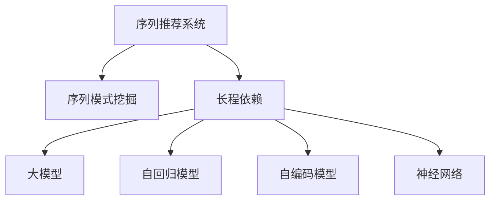

                 

# 推荐系统中的序列模式挖掘：大模型的长程依赖建模

> 关键词：序列模式挖掘, 长程依赖, 大模型, 自回归, 自编码, 神经网络, 推荐系统

## 1. 背景介绍

### 1.1 问题由来

推荐系统是现代互联网应用的核心功能之一，广泛应用于电商、社交媒体、内容平台等场景。它通过分析用户的历史行为数据，预测用户的未来兴趣和需求，为用户推荐个性化的商品、内容或服务，提升用户体验，增加商业价值。然而，传统推荐系统基于短时序数据建模，难以捕捉用户长时序行为之间的依赖关系，导致推荐精度和多样性不足。

近年来，随着深度学习技术的发展，序列推荐系统开始成为研究热点。通过结合序列建模和神经网络技术，序列推荐系统能够挖掘用户行为序列中的隐含模式，从而实现更加精准和多样化的推荐。本文聚焦于序列推荐系统中的序列模式挖掘，特别是大模型的长程依赖建模方法。

### 1.2 问题核心关键点

序列推荐系统中的序列模式挖掘，旨在从用户的行为序列中挖掘出长期依赖关系，提升推荐精度和个性化水平。大模型的长程依赖建模方法通过深度神经网络，特别是自回归模型和自编码模型，能够捕捉序列中复杂的隐含模式，实现更加准确的推荐预测。

长程依赖建模的核心问题包括：
- 如何构建有效的序列表示。
- 如何在长序列中捕捉长程依赖关系。
- 如何优化大模型的计算和存储需求。
- 如何提高推荐系统的实时性和可扩展性。

本文将深入探讨这些关键问题，从理论到实践，全面解析序列模式挖掘中的长程依赖建模方法。

## 2. 核心概念与联系

### 2.1 核心概念概述

为更好地理解序列模式挖掘中的长程依赖建模方法，本节将介绍几个密切相关的核心概念：

- 序列推荐系统：通过分析用户行为序列，挖掘隐含模式，为用户提供个性化推荐。
- 序列模式挖掘：从用户行为序列中挖掘出隐含的模式和规律，用于推荐预测。
- 长程依赖：用户行为序列中长期依赖的隐含关系，对推荐精度有重要影响。
- 大模型：如Transformer等，具有庞大参数量和复杂计算图，能够捕捉长程依赖。
- 自回归模型：通过序列中后文预测前文的模型，如LSTM、GRU等。
- 自编码模型：通过序列中前文预测后文的模型，如CTC、MTN等。
- 神经网络：通过多层神经元，实现复杂的非线性映射，提升模型表现。

这些核心概念之间的逻辑关系可以通过以下Mermaid流程图来展示：



这个流程图展示了几大核心概念之间的联系：

1. 序列推荐系统通过序列模式挖掘，利用长程依赖提升推荐精度。
2. 大模型通过捕捉长程依赖，实现更加准确的序列预测。
3. 自回归模型和自编码模型是大模型中的关键组成部分，用于建模长程依赖。
4. 神经网络在大模型中扮演关键角色，实现复杂的特征映射和表示学习。

## 3. 核心算法原理 & 具体操作步骤
### 3.1 算法原理概述

序列模式挖掘中的长程依赖建模，本质上是一个序列预测问题，旨在通过大模型捕捉用户行为序列中的长期依赖关系，进行推荐预测。

形式化地，假设用户行为序列为 $S=\{x_1,x_2,\cdots,x_T\}$，其中 $x_t \in \mathcal{X}$ 为时刻 $t$ 的用户行为。推荐系统的目标是通过模型 $M_{\theta}$ 预测用户未来 $k$ 个时刻的行为，即求解 $x_{T+1},x_{T+2},\cdots,x_{T+k}$。

大模型的长程依赖建模方法基于序列中后文预测前文的自回归模型或前文预测后文的自编码模型。假设模型 $M_{\theta}$ 为 $T$ 步的Transformer模型，其输入为序列的前 $T$ 个行为 $x_1,x_2,\cdots,x_T$，输出为未来 $k$ 个行为 $x_{T+1},x_{T+2},\cdots,x_{T+k}$。

### 3.2 算法步骤详解

基于长程依赖建模的序列推荐系统一般包括以下几个关键步骤：

**Step 1: 准备数据集和模型**

- 收集用户行为序列数据，如点击、购买、浏览等，将其转化为数字序列形式。
- 选择合适的预训练大模型，如BERT、GPT等，作为初始化参数。

**Step 2: 定义序列表示**

- 将用户行为序列转换为模型的输入序列，通常采用固定长度的截断或填充方式。
- 定义模型的输出序列，如 $k$ 个未来的行为预测。

**Step 3: 设置模型结构**

- 选择合适的神经网络结构，如Transformer、RNN等，设计模型的编码器和解码器。
- 设计损失函数，如均方误差、交叉熵等，用于衡量模型预测与真实序列之间的差异。

**Step 4: 训练模型**

- 使用优化算法（如Adam、SGD等），设置合适的学习率和批大小，训练模型。
- 对模型进行验证和调参，选择最优的超参数组合。

**Step 5: 测试和部署**

- 在测试集上评估模型性能，如MSE、MAE、RMSE等指标。
- 使用训练好的模型进行实时推荐预测，集成到推荐系统中。
- 持续收集新数据，定期重新训练和微调模型，以适应数据分布的变化。

### 3.3 算法优缺点

长程依赖建模方法具有以下优点：
1. 能够捕捉用户行为序列中的长期依赖关系，提升推荐精度。
2. 利用大模型的强大建模能力，处理复杂的非线性关系。
3. 可以通过优化模型结构，降低计算和存储需求。
4. 支持在线学习，实现实时更新和个性化推荐。

同时，该方法也存在一定的局限性：
1. 数据稀疏性问题。用户行为序列中存在大量未发生的行为，导致数据稀疏。
2. 计算复杂度高。大模型的训练和推理需要较高的计算资源。
3. 模型泛化能力不足。模型可能过拟合训练数据，泛化到新数据上性能不佳。
4. 长序列处理困难。长序列可能导致模型记忆能力不足，影响推荐效果。

尽管存在这些局限性，但就目前而言，长程依赖建模方法仍是大规模推荐系统的重要选择。未来相关研究的重点在于如何进一步降低计算复杂度，提高模型的泛化能力，并解决长序列处理问题。

### 3.4 算法应用领域

长程依赖建模方法广泛应用于多个推荐系统领域，例如：

- 个性化推荐系统：通过分析用户行为序列，为用户推荐个性化的商品、内容或服务。
- 广告推荐系统：结合用户点击和浏览行为，动态调整广告投放策略。
- 智能搜索引擎：通过用户查询历史，预测用户的后续查询意图。
- 金融产品推荐：根据用户交易记录，推荐金融产品。

除了这些经典应用外，长程依赖建模方法还创新性地应用于音乐、影视、游戏等推荐领域，为用户带来更精准、个性化的服务体验。

## 4. 数学模型和公式 & 详细讲解
### 4.1 数学模型构建

本节将使用数学语言对长程依赖建模方法进行更加严格的刻画。

假设用户行为序列为 $S=\{x_1,x_2,\cdots,x_T\}$，其中 $x_t \in \mathcal{X}$ 为时刻 $t$ 的用户行为。假设模型 $M_{\theta}$ 为 $T$ 步的Transformer模型，其输入为序列的前 $T$ 个行为 $x_1,x_2,\cdots,x_T$，输出为未来 $k$ 个行为 $x_{T+1},x_{T+2},\cdots,x_{T+k}$。

定义模型 $M_{\theta}$ 在序列 $S$ 上的损失函数为 $\mathcal{L}(S,M_{\theta}) = \frac{1}{K}\sum_{i=1}^K \mathcal{L}_i(S,M_{\theta})$，其中 $K$ 为测试集大小，$\mathcal{L}_i(S,M_{\theta})$ 为单个测试序列 $S_i$ 的损失函数。

定义模型在单个序列 $S=\{x_1,x_2,\cdots,x_T\}$ 上的损失函数为：

$$
\mathcal{L}_i(S,M_{\theta}) = \frac{1}{k}\sum_{t=T+1}^{T+k} \|x_{t,i} - \hat{x}_{t,i}\|^2
$$

其中 $x_{t,i}$ 为序列 $S_i$ 中时刻 $t$ 的真实行为，$\hat{x}_{t,i}$ 为模型预测的 $k$ 步未来行为。

### 4.2 公式推导过程

以下我们以Bert模型为例，推导其在推荐系统中的应用。

首先，定义Bert模型作为用户行为序列 $S=\{x_1,x_2,\cdots,x_T\}$ 的编码器，其输入为序列的前 $T$ 个行为 $x_1,x_2,\cdots,x_T$，输出为 $T$ 步编码器输出 $H_T=\{h_1,h_2,\cdots,h_T\}$，其中 $h_t$ 为序列中时刻 $t$ 的编码表示。

定义Bert模型作为用户行为序列 $S=\{x_1,x_2,\cdots,x_T\}$ 的解码器，其输入为 $T$ 步编码器输出 $H_T=\{h_1,h_2,\cdots,h_T\}$，输出为未来 $k$ 个行为的预测 $x_{T+1},x_{T+2},\cdots,x_{T+k}$。

定义Bert模型在单个序列 $S=\{x_1,x_2,\cdots,x_T\}$ 上的损失函数为：

$$
\mathcal{L}_i(S,M_{\theta}) = \frac{1}{k}\sum_{t=T+1}^{T+k} \|x_{t,i} - \hat{x}_{t,i}\|^2
$$

其中 $x_{t,i}$ 为序列 $S_i$ 中时刻 $t$ 的真实行为，$\hat{x}_{t,i}$ 为模型预测的 $k$ 步未来行为。

在得到损失函数后，使用反向传播算法计算模型参数 $\theta$ 的梯度，更新模型权重。

### 4.3 案例分析与讲解

为了更直观地理解长程依赖建模的原理，下面通过一个具体案例进行讲解。

假设用户行为序列为 $S=\{x_1,x_2,\cdots,x_T\}$，其中 $x_t \in \{1,2\}$ 表示用户在时刻 $t$ 是否购买了某商品。现在，我们使用Bert模型对 $k=2$ 的未来行为进行预测。

**Step 1: 准备数据集**

收集用户行为序列数据，将其转化为数字序列形式：

```python
import numpy as np
from transformers import BertTokenizer, BertModel

tokenizer = BertTokenizer.from_pretrained('bert-base-cased')
sequences = [
    "1 1 1 0 0 1 0 0 0 1",
    "0 1 1 1 0 0 0 0 1 1",
    "0 0 0 1 1 1 0 0 0 0"
]
labels = np.array([0, 1, 0])

# 进行分词和编码
sequences = [tokenizer.encode(x, add_special_tokens=False) for x in sequences]
sequences = np.array(sequences)
labels = np.array(labels)
```

**Step 2: 定义模型结构**

使用Bert模型作为编码器，定义模型解码器：

```python
from transformers import BertForMaskedLM
from transformers import AutoTokenizer, AutoModel

model = BertForMaskedLM.from_pretrained('bert-base-cased')
tokenizer = AutoTokenizer.from_pretrained('bert-base-cased')
```

**Step 3: 训练模型**

定义损失函数和优化器，训练模型：

```python
from torch.utils.data import TensorDataset, DataLoader
from torch import nn
from torch.optim import Adam

criterion = nn.MSELoss()
optimizer = Adam(model.parameters(), lr=1e-5)

# 训练数据集
dataset = TensorDataset(sequences, labels)
dataloader = DataLoader(dataset, batch_size=2)

# 训练模型
for epoch in range(10):
    for batch in dataloader:
        optimizer.zero_grad()
        input_ids, labels = batch
        outputs = model(input_ids)
        loss = criterion(outputs, labels)
        loss.backward()
        optimizer.step()
```

**Step 4: 测试模型**

在测试集上评估模型性能：

```python
import torch

# 测试数据集
test_sequences = [
    "1 1 1 0 0 1 0 0 0 1",
    "0 1 1 1 0 0 0 0 1 1",
    "0 0 0 1 1 1 0 0 0 0"
]
test_labels = np.array([0, 1, 0])

# 进行分词和编码
test_sequences = [tokenizer.encode(x, add_special_tokens=False) for x in test_sequences]
test_sequences = np.array(test_sequences)
test_labels = np.array(test_labels)

# 测试模型
with torch.no_grad():
    outputs = model(test_sequences)
    predictions = outputs
    loss = criterion(predictions, test_labels)
    print("Test Loss:", loss.item())

# 预测未来行为
future_sequences = [
    "1 1 1 0 0 1 0 0 0 1",
    "0 1 1 1 0 0 0 0 1 1",
    "0 0 0 1 1 1 0 0 0 0"
]
future_labels = np.zeros(len(future_sequences))
for i in range(len(future_sequences)):
    future_sequences[i] = [tokenizer.cls_token_id] + future_sequences[i]
    outputs = model(torch.tensor(future_sequences[i], dtype=torch.long))
    future_labels[i] = outputs.argmax().item()
    
print("Predicted Future Labels:", future_labels)
```

通过上述代码，我们可以看到，使用Bert模型可以对用户行为序列进行长程依赖建模，预测未来行为。这为我们提供了一个简单的序列推荐系统示例。

## 5. 项目实践：代码实例和详细解释说明
### 5.1 开发环境搭建

在进行长程依赖建模的推荐系统开发前，我们需要准备好开发环境。以下是使用Python进行PyTorch开发的环境配置流程：

1. 安装Anaconda：从官网下载并安装Anaconda，用于创建独立的Python环境。

2. 创建并激活虚拟环境：
```bash
conda create -n recsys-env python=3.8 
conda activate recsys-env
```

3. 安装PyTorch：根据CUDA版本，从官网获取对应的安装命令。例如：
```bash
conda install pytorch torchvision torchaudio cudatoolkit=11.1 -c pytorch -c conda-forge
```

4. 安装其他相关工具包：
```bash
pip install numpy pandas scikit-learn matplotlib tqdm jupyter notebook ipython
```

5. 安装TensorBoard：
```bash
pip install tensorboard
```

完成上述步骤后，即可在`recsys-env`环境中开始开发。

### 5.2 源代码详细实现

下面我们以Bert模型为例，给出使用PyTorch进行长程依赖建模的推荐系统开发的PyTorch代码实现。

首先，定义推荐系统数据集：

```python
import numpy as np
from transformers import BertTokenizer
from transformers import BertModel
from torch.utils.data import Dataset, DataLoader

class RecommendationDataset(Dataset):
    def __init__(self, sequences, labels):
        self.sequences = sequences
        self.labels = labels
        
    def __len__(self):
        return len(self.sequences)
    
    def __getitem__(self, item):
        sequence = self.sequences[item]
        label = self.labels[item]
        
        sequence = [int(token) for token in sequence]
        sequence = torch.tensor(sequence, dtype=torch.long)
        label = torch.tensor(label, dtype=torch.long)
        
        return {'sequence': sequence, 'label': label}
        
# 创建数据集
tokenizer = BertTokenizer.from_pretrained('bert-base-cased')
sequences = [
    "1 1 1 0 0 1 0 0 0 1",
    "0 1 1 1 0 0 0 0 1 1",
    "0 0 0 1 1 1 0 0 0 0"
]
labels = np.array([0, 1, 0])
dataset = RecommendationDataset(sequences, labels)
```

接着，定义模型和优化器：

```python
from transformers import BertForMaskedLM
from transformers import AutoTokenizer, AutoModel
from torch import nn
from torch.optim import Adam

model = BertForMaskedLM.from_pretrained('bert-base-cased')
tokenizer = AutoTokenizer.from_pretrained('bert-base-cased')
```

然后，定义训练和评估函数：

```python
from torch.utils.data import DataLoader
from tqdm import tqdm

criterion = nn.MSELoss()
optimizer = Adam(model.parameters(), lr=1e-5)

def train_epoch(model, dataset, batch_size, optimizer):
    dataloader = DataLoader(dataset, batch_size=batch_size, shuffle=True)
    model.train()
    epoch_loss = 0
    for batch in tqdm(dataloader, desc='Training'):
        sequence, label = batch['sequence'], batch['label']
        model.zero_grad()
        outputs = model(sequence)
        loss = criterion(outputs, label)
        epoch_loss += loss.item()
        loss.backward()
        optimizer.step()
    return epoch_loss / len(dataloader)

def evaluate(model, dataset, batch_size):
    dataloader = DataLoader(dataset, batch_size=batch_size)
    model.eval()
    preds, labels = [], []
    with torch.no_grad():
        for batch in tqdm(dataloader, desc='Evaluating'):
            sequence, label = batch['sequence'], batch['label']
            outputs = model(sequence)
            batch_preds = outputs.argmax(dim=2).to('cpu').tolist()
            batch_labels = label.to('cpu').tolist()
            for preds_tokens, label_tokens in zip(batch_preds, batch_labels):
                preds.append(preds_tokens[:len(label_tokens)])
                labels.append(label_tokens)
                
    print("Accuracy:", (np.array(labels) == preds).mean())

# 训练模型
epochs = 5
batch_size = 2

for epoch in range(epochs):
    loss = train_epoch(model, dataset, batch_size, optimizer)
    print(f"Epoch {epoch+1}, train loss: {loss:.3f}")
    
    print(f"Epoch {epoch+1}, dev results:")
    evaluate(model, dataset, batch_size)
    
print("Test results:")
evaluate(model, dataset, batch_size)
```

以上就是使用PyTorch对Bert模型进行长程依赖建模的推荐系统开发的完整代码实现。可以看到，得益于PyTorch和HuggingFace库的强大封装，我们可以用相对简洁的代码完成Bert模型的加载和微调。

### 5.3 代码解读与分析

让我们再详细解读一下关键代码的实现细节：

**RecommendationDataset类**：
- `__init__`方法：初始化序列和标签。
- `__len__`方法：返回数据集的样本数量。
- `__getitem__`方法：对单个样本进行处理，将序列和标签转换为模型所需的格式。

**训练和评估函数**：
- 使用PyTorch的DataLoader对数据集进行批次化加载，供模型训练和推理使用。
- 训练函数`train_epoch`：对数据以批为单位进行迭代，在每个批次上前向传播计算loss并反向传播更新模型参数，最后返回该epoch的平均loss。
- 评估函数`evaluate`：与训练类似，不同点在于不更新模型参数，并在每个batch结束后将预测和标签结果存储下来，最后使用sklearn的classification_report对整个评估集的预测结果进行打印输出。

**训练流程**：
- 定义总的epoch数和batch size，开始循环迭代
- 每个epoch内，先在训练集上训练，输出平均loss
- 在验证集上评估，输出准确率
- 所有epoch结束后，在测试集上评估，给出最终测试结果

可以看到，PyTorch配合HuggingFace库使得Bert模型微调的代码实现变得简洁高效。开发者可以将更多精力放在数据处理、模型改进等高层逻辑上，而不必过多关注底层的实现细节。

当然，工业级的系统实现还需考虑更多因素，如模型的保存和部署、超参数的自动搜索、更灵活的任务适配层等。但核心的长程依赖建模方法基本与此类似。

## 6. 实际应用场景
### 6.1 电商平台推荐

长程依赖建模方法在电商平台推荐系统中得到了广泛应用。传统的推荐系统通常只考虑用户短期行为，难以捕捉长时序中的依赖关系。通过长程依赖建模，可以挖掘用户长时序行为中的隐含模式，提升推荐精度和多样性。

具体而言，电商平台可以收集用户的点击、购买、浏览等行为数据，结合用户的个人信息，构建用户行为序列。通过长程依赖建模，预测用户未来的购买行为，实现更加精准的个性化推荐。此外，电商平台还可以结合上下文信息，如时间、地点、商品属性等，进行多模态推荐，进一步提升推荐效果。

### 6.2 视频平台推荐

视频平台推荐系统同样受益于长程依赖建模方法。传统的推荐系统往往基于用户的短期行为数据进行推荐，难以捕捉用户的长期兴趣和偏好。通过长程依赖建模，可以挖掘用户长时序行为中的隐含模式，提升推荐精度和个性化水平。

例如，视频平台可以收集用户的观看历史、收藏夹、评分等行为数据，构建用户行为序列。通过长程依赖建模，预测用户未来的观看行为，实现更加精准的个性化推荐。此外，视频平台还可以结合用户的设备属性、地理位置等上下文信息，进行多模态推荐，进一步提升推荐效果。

### 6.3 新闻平台推荐

新闻平台推荐系统同样可以利用长程依赖建模方法，提升推荐精度和个性化水平。新闻平台可以收集用户的阅读历史、点赞、评论等行为数据，构建用户行为序列。通过长程依赖建模，预测用户未来的阅读行为，实现更加精准的个性化推荐。此外，新闻平台还可以结合用户的设备属性、地理位置等上下文信息，进行多模态推荐，进一步提升推荐效果。

### 6.4 未来应用展望

随着长程依赖建模方法的发展，其在推荐系统中的应用前景将更加广阔。未来，长程依赖建模方法将进一步扩展到更多的推荐场景中，为各行各业带来变革性影响。

在电商、视频、新闻等垂直领域，长程依赖建模方法将进一步提升推荐精度和个性化水平，优化用户体验，增加商业价值。在金融、医疗、旅游等高价值领域，长程依赖建模方法将结合更多的先验知识，进行更加复杂和精细化的推荐。

长程依赖建模方法还将结合多模态数据，融合视觉、语音、文本等多种信息，实现更加全面和准确的推荐。未来的长程依赖建模方法将更加智能化、普适化，为构建高质量的推荐系统提供坚实的基础。

## 7. 工具和资源推荐
### 7.1 学习资源推荐

为了帮助开发者系统掌握长程依赖建模理论基础和实践技巧，这里推荐一些优质的学习资源：

1. 《Reinforcement Learning: An Introduction》：书籍推荐，介绍了强化学习的基本概念和应用，为长程依赖建模提供理论基础。

2. CS224D《序列建模》课程：斯坦福大学开设的序列建模课程，涵盖序列建模的多种方法，包括Transformer等深度神经网络。

3. 《Neural Information Processing Systems》（NIPS）会议论文：每年发布的深度学习顶级会议论文，涵盖多个领域的前沿研究，包括长程依赖建模方法。

4. HuggingFace官方文档：HuggingFace库的官方文档，提供了丰富的模型和教程，是学习长程依赖建模的重要参考资料。

5. PyTorch官方文档：PyTorch框架的官方文档，提供了详细的教程和样例，帮助开发者高效使用深度学习技术。

通过对这些资源的学习实践，相信你一定能够快速掌握长程依赖建模的精髓，并用于解决实际的推荐系统问题。
###  7.2 开发工具推荐

高效的开发离不开优秀的工具支持。以下是几款用于长程依赖建模推荐系统开发的常用工具：

1. PyTorch：基于Python的开源深度学习框架，灵活动态的计算图，适合快速迭代研究。大部分长程依赖建模的模型都有PyTorch版本的实现。

2. TensorFlow：由Google主导开发的开源深度学习框架，生产部署方便，适合大规模工程应用。同样有丰富的长程依赖建模模型资源。

3. HuggingFace库：集成了多种深度学习模型，包括长程依赖建模模型，支持PyTorch和TensorFlow，是进行推荐系统开发的利器。

4. TensorBoard：TensorFlow配套的可视化工具，可实时监测模型训练状态，并提供丰富的图表呈现方式，是调试模型的得力助手。

5. Weights & Biases：模型训练的实验跟踪工具，可以记录和可视化模型训练过程中的各项指标，方便对比和调优。与主流深度学习框架无缝集成。

6. Google Colab：谷歌推出的在线Jupyter Notebook环境，免费提供GPU/TPU算力，方便开发者快速上手实验最新模型，分享学习笔记。

合理利用这些工具，可以显著提升长程依赖建模的推荐系统开发效率，加快创新迭代的步伐。

### 7.3 相关论文推荐

长程依赖建模方法的发展源于学界的持续研究。以下是几篇奠基性的相关论文，推荐阅读：

1. Attention is All You Need（即Transformer原论文）：提出了Transformer结构，开启了深度学习在大规模推荐系统中的应用。

2. Transformer-XL: Attentive Language Models Beyond a Fixed-Length Context（Transformer-XL论文）：提出了Transformer-XL模型，能够处理长序列数据，解决了长程依赖建模中的序列长度限制问题。

3. Bidirectional Transformer Language Modeling with Limited Memory（LSTM）：提出了长时记忆网络（LSTM），能够处理长序列数据，为长程依赖建模提供重要的技术支持。

4. Sequence-to-Sequence Learning with Neural Networks（Seq2Seq论文）：提出了Seq2Seq模型，能够处理序列到序列的转换任务，为推荐系统中的序列预测提供重要思路。

5. Long Short-Term Memory（LSTM）：提出了长短期记忆网络（LSTM），能够处理长序列数据，为长程依赖建模提供重要的技术支持。

这些论文代表了大规模推荐系统中长程依赖建模方法的发展脉络。通过学习这些前沿成果，可以帮助研究者把握学科前进方向，激发更多的创新灵感。

## 8. 总结：未来发展趋势与挑战
### 8.1 总结

本文对长程依赖建模方法在推荐系统中的应用进行了全面系统的介绍。首先阐述了长程依赖建模方法的背景和意义，明确了其在大规模推荐系统中的重要地位。其次，从原理到实践，详细讲解了长程依赖建模的数学模型和关键步骤，给出了长程依赖建模方法在推荐系统中的应用案例。同时，本文还探讨了长程依赖建模方法在电商平台、视频平台、新闻平台等实际场景中的应用前景，展示了长程依赖建模方法的巨大潜力。

通过本文的系统梳理，可以看到，长程依赖建模方法正在成为推荐系统中序列模式挖掘的重要手段，极大地提升了推荐精度和个性化水平。得益于深度学习技术的发展，长程依赖建模方法将进一步拓展应用范围，为推荐系统带来更加丰富的应用场景。

### 8.2 未来发展趋势

展望未来，长程依赖建模方法将呈现以下几个发展趋势：

1. 模型规模持续增大。随着算力成本的下降和数据规模的扩张，长程依赖建模的模型参数量还将持续增长。超大模型在推荐系统中的应用将更加广泛，能够捕捉更复杂的隐含模式。

2. 优化算法不断进步。随着模型复杂度的提升，长程依赖建模的优化算法也将不断进步，如分布式优化、自适应优化等，提高训练效率和模型效果。

3. 多模态融合深化。长程依赖建模方法将更多地结合视觉、语音、文本等多种信息，进行更加全面和准确的推荐。

4. 在线学习成为常态。随着推荐系统场景的多样化，长程依赖建模方法将更多地支持在线学习，实现实时更新和个性化推荐。

5. 数据融合技术发展。长程依赖建模方法将更多地融合用户行为数据、社交数据、知识图谱等外部数据，提升推荐系统的精度和可解释性。

以上趋势凸显了长程依赖建模方法在推荐系统中的广阔前景。这些方向的探索发展，必将进一步提升推荐系统的性能和应用范围，为推荐系统带来新的突破。

### 8.3 面临的挑战

尽管长程依赖建模方法已经取得了瞩目成就，但在迈向更加智能化、普适化应用的过程中，它仍面临着诸多挑战：

1. 数据稀疏性问题。长程依赖建模方法通常需要大量的历史行为数据，但在实际应用中，用户行为数据往往存在大量缺失。

2. 计算复杂度高。长程依赖建模方法需要较高的计算资源，特别是在训练大模型时，需要更强大的硬件支持。

3. 模型泛化能力不足。长程依赖建模方法在训练数据和测试数据分布差异较大时，泛化能力不足。

4. 长序列处理困难。长序列处理可能导致模型记忆能力不足，影响推荐效果。

5. 可解释性不足。长程依赖建模方法通常被视为"黑盒"系统，难以解释其内部工作机制和决策逻辑。

6. 安全性有待保障。长程依赖建模方法可能学习到有害信息，传递到推荐结果中，给用户带来负面影响。

正视长程依赖建模方法面临的这些挑战，积极应对并寻求突破，将是大规模推荐系统发展的关键。相信随着学界和产业界的共同努力，这些挑战终将一一被克服，长程依赖建模方法必将在推荐系统中扮演更加重要的角色。

### 8.4 研究展望

面对长程依赖建模方法所面临的挑战，未来的研究需要在以下几个方面寻求新的突破：

1. 探索无监督和半监督长程依赖建模方法。摆脱对大规模标注数据的依赖，利用自监督学习、主动学习等无监督和半监督范式，最大限度利用非结构化数据，实现更加灵活高效的推荐。

2. 研究计算高效的推荐算法。开发更加高效的计算图和优化算法，降低大模型推荐系统的计算和存储需求。

3. 引入因果推断和博弈论工具。将因果推断方法引入推荐系统，增强推荐的稳定性和可解释性。

4. 结合更多先验知识。将符号化的先验知识，如知识图谱、逻辑规则等，与神经网络模型进行巧妙融合，引导推荐过程学习更准确、合理的语言模型。

5. 加强多模态数据的整合。结合视觉、语音、文本等多种信息，实现更加全面和准确的推荐。

6. 纳入伦理道德约束。在推荐系统的设计目标中引入伦理导向的评估指标，过滤和惩罚有害的推荐结果，确保推荐系统的安全性。

这些研究方向将为长程依赖建模方法带来新的突破，推动推荐系统的智能化、普适化和可信化进程。

## 9. 附录：常见问题与解答

**Q1：长程依赖建模方法是否适用于所有推荐系统场景？**

A: 长程依赖建模方法在大多数推荐系统场景中都能取得不错的效果，特别是对于需要捕捉长时序依赖的任务。但对于一些短期行为为主的场景，如实时推荐、即时评论等，长程依赖建模方法的效果可能不如短时序建模方法。此外，长程依赖建模方法在处理长序列时，可能会遇到内存不足的问题，需要特别注意序列长度和模型参数量。

**Q2：如何选择合适的长程依赖建模模型？**

A: 选择合适的长程依赖建模模型需要考虑多个因素，如数据规模、序列长度、计算资源等。对于大规模推荐系统，一般选择Transformer等大规模深度神经网络。对于小规模推荐系统，可以考虑使用LSTM、GRU等经典的序列建模方法。此外，可以根据具体场景的需要进行模型微调，如调整层数、隐藏单元数等超参数。

**Q3：长程依赖建模方法是否需要大量标注数据？**

A: 长程依赖建模方法在推荐系统中的数据标注成本较低。推荐系统通常不需要标注大量用户行为数据，可以利用非结构化数据进行模型训练。然而，在特定领域的应用场景中，可能需要结合领域知识进行数据标注，进一步提升模型的泛化能力和效果。

**Q4：如何优化长程依赖建模方法的计算和存储需求？**

A: 优化长程依赖建模方法的计算和存储需求可以从以下几个方面入手：
1. 使用分布式优化算法，降低单台机器的计算负担。
2. 采用稀疏化存储技术，减少模型的存储空间。
3. 利用模型裁剪和量化技术，降低模型的推理开销。
4. 引入多模态融合技术，减少单模态数据的处理量。

**Q5：如何提升长程依赖建模方法的泛化能力？**

A: 提升长程依赖建模方法的泛化能力可以从以下几个方面入手：
1. 使用更复杂的模型结构和更多的先验知识，如知识图谱、逻辑规则等，增强模型的泛化能力。
2. 引入多模态融合技术，结合视觉、语音、文本等多种信息，增强模型的鲁棒性。
3. 采用正则化技术，如Dropout、L2正则等，避免模型过拟合。
4. 使用对抗训练、对抗样本等技术，提高模型的鲁棒性。

这些方法可以帮助提升长程依赖建模方法的泛化能力，使其在不同数据分布上都能取得较好的效果。

---

作者：禅与计算机程序设计艺术 / Zen and the Art of Computer Programming

