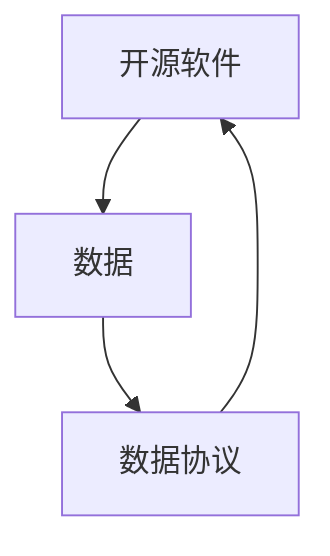

                 

**大模型时代的开源与数据协议**

**作者：禅与计算机程序设计艺术 / Zen and the Art of Computer Programming**

## 1. 背景介绍

随着人工智能和机器学习的飞速发展，大模型（Large Language Models）已经成为当今最先进的技术之一。这些模型需要大量的数据和计算资源来训练，这导致了开源和数据协议的重要性日益凸显。本文将探讨大模型时代开源和数据协议的必要性、挑战，并提供解决方案和最佳实践。

## 2. 核心概念与联系

### 2.1 开源与数据协议的定义

- **开源（Open Source）**：指的是一种软件开发模式，允许用户免费使用、修改和分发软件源代码。
- **数据协议（Data Protocol）**：指的是一套规则，定义了如何交换和共享数据，以确保数据的完整性、一致性和安全性。

### 2.2 开源与数据协议的关系

开源和数据协议密切相关，因为开源软件需要数据来训练和测试，而数据协议则确保数据的共享和交换。开源软件可以帮助建立和维护数据协议，而数据协议则可以帮助开源软件更好地利用数据。



## 3. 核心算法原理 & 具体操作步骤

### 3.1 算法原理概述

大模型的训练和部署需要一系列的算法，包括数据预处理、模型训练、模型评估和模型部署。这些算法需要与开源和数据协议相结合，以确保模型的可靠性和可扩展性。

### 3.2 算法步骤详解

1. **数据预处理**：收集、清洗、转换和整合数据，并将其格式化为模型可以接受的格式。
2. **模型训练**：使用预处理后的数据训练大模型，通常使用反向传播算法和优化器。
3. **模型评估**：评估模型的性能，通常使用验证集和测试集。
4. **模型部署**：将训练好的模型部署到生产环境，以提供预测和推理服务。

### 3.3 算法优缺点

**优点**：开源和数据协议可以提高模型的可靠性、可扩展性和可维护性。它们可以帮助建立和维护模型的可信度，并鼓励模型的进一步发展。

**缺点**：开源和数据协议需要大量的时间和资源来建立和维护。它们还可能导致数据泄露和安全风险。

### 3.4 算法应用领域

开源和数据协议在大模型的各个领域都有应用，包括自然语言处理、计算机视觉、推荐系统和自动驾驶等。

## 4. 数学模型和公式 & 详细讲解 & 举例说明

### 4.1 数学模型构建

大模型的数学模型通常是神经网络，可以表示为：

$$y = f(x; \theta)$$

其中，$x$是输入，$y$是输出，$\theta$是模型的参数。

### 4.2 公式推导过程

模型的参数$\theta$通常通过最小化损失函数$L(y, \hat{y})$来学习，其中$\hat{y}$是模型的预测输出。损失函数可以表示为：

$$L(y, \hat{y}) = -\sum_{i=1}^{n}y_i\log(\hat{y}_i)$$

### 4.3 案例分析与讲解

例如，在自然语言处理领域，大模型可以用于文本分类任务。输入$x$是一段文本，输出$y$是文本的类别。模型的参数$\theta$可以通过最小化交叉熵损失函数来学习。

## 5. 项目实践：代码实例和详细解释说明

### 5.1 开发环境搭建

大模型的开发需要一个强大的开发环境，包括GPU、大量内存和高速存储。推荐使用Python和TensorFlow或PyTorch作为开发语言和框架。

### 5.2 源代码详细实现

以下是一个简单的大模型训练示例，使用TensorFlow和IMDB数据集进行文本分类：

```python
import tensorflow as tf
from tensorflow.keras.datasets import imdb

# Load data
(x_train, y_train), (x_test, y_test) = imdb.load_data(num_words=10000)

# Build model
model = tf.keras.Sequential([
    tf.keras.layers.Embedding(10000, 16),
    tf.keras.layers.GlobalAveragePooling1D(),
    tf.keras.layers.Dense(16, activation='relu'),
    tf.keras.layers.Dense(1, activation='sigmoid')
])

# Compile model
model.compile(optimizer='adam', loss='binary_crossentropy', metrics=['accuracy'])

# Train model
model.fit(x_train, y_train, epochs=10, validation_data=(x_test, y_test))
```

### 5.3 代码解读与分析

这段代码首先加载IMDB数据集，然后构建一个简单的大模型。模型由嵌入层、全局平均池化层、密集连接层和输出层组成。然后，模型被编译并使用训练数据进行训练。

### 5.4 运行结果展示

训练完成后，模型的准确性可以使用测试数据进行评估。通常，模型的准确性会随着训练次数的增加而提高。

## 6. 实际应用场景

### 6.1 当前应用

开源和数据协议已经在大模型的各种应用中得到广泛应用，包括搜索引擎、推荐系统、自动驾驶和医疗诊断等。

### 6.2 未来应用展望

未来，开源和数据协议将继续在大模型的发展中发挥关键作用。随着数据的增长和模型的复杂性，开源和数据协议将变得更加重要，以确保模型的可靠性和可扩展性。

## 7. 工具和资源推荐

### 7.1 学习资源推荐

- **书籍**："Hands-On Machine Learning with Scikit-Learn, Keras, and TensorFlow" by Aurélien Géron
- **在线课程**：Coursera的"Deep Learning"课程

### 7.2 开发工具推荐

- **编程语言**：Python
- **框架**：TensorFlow和PyTorch
- **开发环境**：Jupyter Notebook

### 7.3 相关论文推荐

- "Attention Is All You Need" by Vaswani et al.
- "BERT: Pre-training of Deep Bidirectional Transformers for Language Understanding" by Jacob Devlin and Ming-Wei Chang

## 8. 总结：未来发展趋势与挑战

### 8.1 研究成果总结

本文总结了大模型时代开源和数据协议的必要性、挑战和解决方案。开源和数据协议是大模型发展的关键因素，可以提高模型的可靠性、可扩展性和可维护性。

### 8.2 未来发展趋势

未来，开源和数据协议将继续在大模型的发展中发挥关键作用。随着数据的增长和模型的复杂性，开源和数据协议将变得更加重要，以确保模型的可靠性和可扩展性。

### 8.3 面临的挑战

开源和数据协议面临的挑战包括数据泄露、安全风险和建立和维护的成本。

### 8.4 研究展望

未来的研究将关注开源和数据协议的安全性、隐私保护和可解释性。此外，研究还将关注如何建立和维护开源和数据协议，以确保模型的可靠性和可扩展性。

## 9. 附录：常见问题与解答

**Q：开源和数据协议有什么区别？**

**A：开源和数据协议是相关但不同的概念。开源软件允许用户免费使用、修改和分发软件源代码，而数据协议则定义了如何交换和共享数据，以确保数据的完整性、一致性和安全性。**

**Q：开源和数据协议为什么重要？**

**A：开源和数据协议在大模型的发展中发挥着关键作用，因为它们可以提高模型的可靠性、可扩展性和可维护性。**

**Q：开源和数据协议面临的挑战是什么？**

**A：开源和数据协议面临的挑战包括数据泄露、安全风险和建立和维护的成本。**

**Q：未来的研究方向是什么？**

**A：未来的研究将关注开源和数据协议的安全性、隐私保护和可解释性。此外，研究还将关注如何建立和维护开源和数据协议，以确保模型的可靠性和可扩展性。**

**作者：禅与计算机程序设计艺术 / Zen and the Art of Computer Programming**

