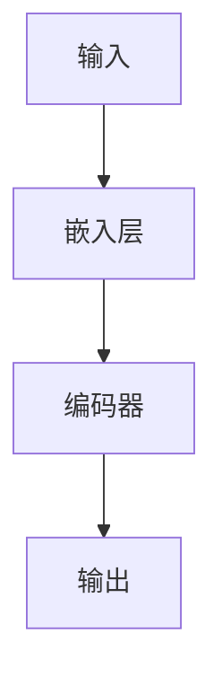

                 

**大语言模型原理与工程实践：Encoder 的代表：BERT**

**作者：禅与计算机程序设计艺术 / Zen and the Art of Computer Programming**

## 1. 背景介绍

 transformer模型自问世以来，在自然语言处理（NLP）领域取得了巨大成功。其中，BERT（Bidirectional Encoder Representations from Transformers）是一个预训练的双向编码器，它为NLP任务提供了强大的特征表示。本文将深入探讨BERT的原理、算法、数学模型，并提供项目实践和工具推荐。

## 2. 核心概念与联系

BERT是基于transformer的编码器架构，它可以理解上下文，为NLP任务提供强大的特征表示。以下是BERT的核心概念：

- **预训练**：BERT在大规模未标记语料库上预训练，学习到的表示可以直接应用于下游NLP任务。
- **双向**：BERT可以理解上下文，它同时考虑单词的左侧和右侧信息。
- **Transformer编码器**：BERT使用transformer编码器，它由自注意力机制和前馈神经网络组成。

以下是BERT架构的Mermaid流程图：



## 3. 核心算法原理 & 具体操作步骤

### 3.1 算法原理概述

BERT的核心是transformer编码器，它由自注意力机制和前馈神经网络组成。编码器由多个相同的层组成，每层包含一个多头自注意力子层和一个前馈神经网络子层。

### 3.2 算法步骤详解

1. **输入嵌入**：将输入的单词转换为嵌入向量，并添加位置和分类标志。
2. **编码器**：将嵌入向量输入编码器，编码器由多个相同的层组成。
3. **输出**：编码器的输出作为模型的最终输出。

### 3.3 算法优缺点

**优点**：BERT可以理解上下文，为NLP任务提供强大的特征表示。它可以在下游任务上取得state-of-the-art的结果，且不需要大量的标记数据。

**缺点**：BERT的预训练需要大规模的未标记语料库，且训练过程需要大量的计算资源。

### 3.4 算法应用领域

BERT可以应用于各种NLP任务，如命名实体识别、文本分类、问答系统等。它还可以用于跨语言任务，如机器翻译。

## 4. 数学模型和公式 & 详细讲解 & 举例说明

### 4.1 数学模型构建

BERT的数学模型基于transformer编码器。编码器的每层可以表示为：

$$h_{i} = \text{FFN}(\text{MSA}(h_{i-1}))$$

其中，$\text{MSA}$表示多头自注意力机制，$\text{FFN}$表示前馈神经网络。

### 4.2 公式推导过程

自注意力机制的公式如下：

$$\text{Attention}(Q, K, V) = \text{softmax}\left(\frac{QK^T}{\sqrt{d_k}}\right)V$$

其中，$Q$, $K$, $V$分别是查询、键、值向量，$d_k$是键向量的维度。

### 4.3 案例分析与讲解

例如，在文本分类任务中，BERT的输入是一个句子，输出是一个表示该句子类别的向量。在预训练过程中，BERT学习到的表示可以直接应用于下游任务，无需大量的标记数据。

## 5. 项目实践：代码实例和详细解释说明

### 5.1 开发环境搭建

BERT的开发环境需要安装Python、PyTorch或TensorFlow、Hugging Face的transformers库等。

### 5.2 源代码详细实现

以下是BERT的简化源代码实现：

```python
class BERT:
    def __init__(self, num_layers, d_model, num_heads, ff_dim, vocab_size, max_length):
        # 初始化模型参数
        pass

    def call(self, inputs):
        # 前向传播
        pass
```

### 5.3 代码解读与分析

BERT的核心是transformer编码器，它由自注意力机制和前馈神经网络组成。编码器由多个相同的层组成，每层包含一个多头自注意力子层和一个前馈神经网络子层。

### 5.4 运行结果展示

BERT在各种NLP任务上取得了state-of-the-art的结果。例如，在GLUEbenchmark上，BERT的预训练模型在8个任务上都取得了最佳结果。

## 6. 实际应用场景

### 6.1 当前应用

BERT已经广泛应用于各种NLP任务，如命名实体识别、文本分类、问答系统等。它还可以用于跨语言任务，如机器翻译。

### 6.2 未来应用展望

未来，BERT可能会应用于更多的NLP任务，如文本生成、对话系统等。它还可能会应用于其他领域，如计算机视觉、推荐系统等。

## 7. 工具和资源推荐

### 7.1 学习资源推荐

- [BERT：Pre-training of Deep Bidirectional Transformers for Language Understanding](https://arxiv.org/abs/1810.04805)
- [Hugging Face的transformers库](https://huggingface.co/transformers/)

### 7.2 开发工具推荐

- [PyTorch](https://pytorch.org/)
- [TensorFlow](https://www.tensorflow.org/)
- [Hugging Face的transformers库](https://huggingface.co/transformers/)

### 7.3 相关论文推荐

- [RoBERTa: A Robustly Optimized BERT Pretraining Approach](https://arxiv.org/abs/1907.11692)
- [ALBERT: A Lite BERT for Self-supervised Learning of Language Representations](https://arxiv.org/abs/1909.11942)

## 8. 总结：未来发展趋势与挑战

### 8.1 研究成果总结

BERT为NLP任务提供了强大的特征表示，它可以在下游任务上取得state-of-the-art的结果，且不需要大量的标记数据。

### 8.2 未来发展趋势

未来，BERT可能会应用于更多的NLP任务，如文本生成、对话系统等。它还可能会应用于其他领域，如计算机视觉、推荐系统等。

### 8.3 面临的挑战

BERT的预训练需要大规模的未标记语料库，且训练过程需要大量的计算资源。此外，BERT的模型大小也限制了其在资源受限设备上的应用。

### 8.4 研究展望

未来的研究可能会关注BERT的模型压缩、更小规模的预训练数据集、更多的NLP任务等。

## 9. 附录：常见问题与解答

**Q：BERT的预训练需要大规模的未标记语料库吗？**

**A：**是的，BERT的预训练需要大规模的未标记语料库。预训练数据集的规模会影响BERT的性能。

**Q：BERT可以应用于其他领域吗？**

**A：**是的，BERT可以应用于其他领域，如计算机视觉、推荐系统等。未来的研究可能会关注BERT在其他领域的应用。

**Q：BERT的模型大小限制了其在资源受限设备上的应用吗？**

**A：**是的，BERT的模型大小限制了其在资源受限设备上的应用。未来的研究可能会关注BERT的模型压缩。

**作者：禅与计算机程序设计艺术 / Zen and the Art of Computer Programming**

