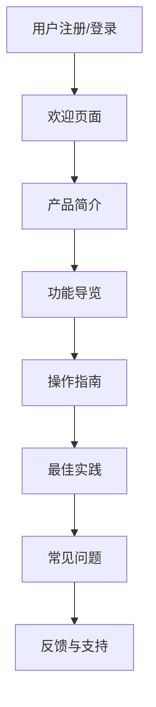

                 

## 1. 背景介绍

在当今数字化的世界中，用户体验（UX）和用户教育（UE）已成为产品成功的关键因素。有效的用户引导和教育可以帮助用户快速上手，提高用户满意度，并最终提升产品的成功率。然而，实现有效的用户引导和教育并非易事，需要考虑到用户的技能水平、学习风格和心理因素。本文将深入探讨如何进行有效的用户引导和教育，并提供实用的建议和技术解决方案。

## 2. 核心概念与联系

### 2.1 用户引导与教育的定义

用户引导（Onboarding）是指帮助新用户快速理解并开始使用产品的过程。用户教育（User Education）则是指帮助用户不断提高技能，充分利用产品功能的过程。这两个概念密切相关，有效的用户引导可以为用户教育奠定基础。

### 2.2 用户引导与教育的目标

有效的用户引导和教育的目标是帮助用户：

- 理解产品的价值主张
- 学习产品的核心功能
- 发现产品的独特之处
- 熟悉产品的操作流程
- 学习产品的最佳实践
- 了解产品的更新和新功能

### 2.3 用户引导与教育的关键因素

有效的用户引导和教育需要考虑以下关键因素：

- **用户的技能水平**：用户的技能水平会影响学习曲线的陡峭程度。
- **用户的学习风格**：用户的学习风格（视觉、听觉、动手等）会影响教育内容的呈现方式。
- **用户的心理因素**：用户的心理因素（动机、兴趣、焦虑等）会影响学习的积极性和效果。

### 2.4 用户引导与教育的架构

有效的用户引导和教育需要一个清晰的架构，如下图所示：



## 3. 核心算法原理 & 具体操作步骤

### 3.1 算法原理概述

有效的用户引导和教育可以通过算法原理来实现，如个性化推荐、智能搜索、自适应学习等。本文将重点介绍基于用户行为数据的个性化推荐算法。

### 3.2 算法步骤详解

个性化推荐算法的步骤如下：

1. **数据收集**：收集用户的行为数据，如点击、浏览、购买等。
2. **特征工程**：提取用户行为数据中的特征，如用户兴趣、偏好等。
3. **模型训练**：使用机器学习算法（如协同过滤、内容推荐等）训练推荐模型。
4. **推荐生成**：使用训练好的模型生成个性化推荐列表。
5. **推荐展示**：将推荐列表展示给用户，并收集用户的反馈数据。
6. **模型更新**：使用用户的反馈数据更新推荐模型。

### 3.3 算法优缺点

个性化推荐算法的优点包括：

- 提高用户体验：根据用户的兴趣和偏好提供个性化的内容。
- 提高转化率：将用户的注意力引导至相关的内容，提高转化率。
- 提高用户忠诚度：通过个性化推荐帮助用户发现新的内容，提高用户忠诚度。

个性化推荐算法的缺点包括：

- 数据依赖：个性化推荐算法需要大量的用户行为数据，否则推荐的准确性会受到影响。
- 冷启动问题：新用户缺乏行为数据，个性化推荐算法无法提供准确的推荐。
- 过度个性化：个性化推荐算法可能导致用户陷入信息茧房，无法接触到新的内容。

### 3.4 算法应用领域

个性化推荐算法的应用领域包括：

- 电子商务：根据用户的购买历史和兴趣推荐商品。
- 视频流媒体：根据用户的观看历史和兴趣推荐视频内容。
- 新闻推荐：根据用户的阅读历史和兴趣推荐新闻内容。
- 社交媒体：根据用户的互动历史和兴趣推荐好友和内容。

## 4. 数学模型和公式 & 详细讲解 & 举例说明

### 4.1 数学模型构建

个性化推荐算法的数学模型可以表示为：

$$R_{ui} = f(u, i, \theta_{ui})$$

其中，$R_{ui}$表示用户$u$对项目$i$的评分，$f$表示推荐函数，$u$表示用户特征，$i$表示项目特征，$\theta_{ui}$表示用户$u$对项目$i$的偏好。

### 4.2 公式推导过程

个性化推荐算法的推荐函数$f$可以使用机器学习算法来学习。常用的机器学习算法包括：

- **协同过滤**：使用用户-项目矩阵来预测用户对项目的评分。
- **内容推荐**：使用用户和项目的特征向量来预测用户对项目的评分。
- **混合推荐**：结合协同过滤和内容推荐来预测用户对项目的评分。

### 4.3 案例分析与讲解

例如，在电子商务平台中，个性化推荐算法可以根据用户的购买历史和兴趣推荐商品。假设用户$u$购买了项目$i_1$和$i_2$，并且对项目$i_3$和$i_4$表示了兴趣。个性化推荐算法可以预测用户$u$对项目$i_5$的评分为：

$$R_{u,i_5} = f(u, i_5, \theta_{u,i_5}) = \frac{1}{2}(R_{u,i_1} + R_{u,i_2}) + \frac{1}{2}(\frac{R_{u,i_3} + R_{u,i_4}}{2})$$

其中，$R_{u,i_1}$，$R_{u,i_2}$，$R_{u,i_3}$，$R_{u,i_4}$表示用户$u$对项目$i_1$，$i_2$，$i_3$，$i_4$的评分。个性化推荐算法会根据用户$u$的评分预测对项目$i_5$的评分，并将项目$i_5$推荐给用户$u$.

## 5. 项目实践：代码实例和详细解释说明

### 5.1 开发环境搭建

个性化推荐算法的开发环境需要包括以下软件和库：

- Python：用于开发个性化推荐算法。
- Pandas：用于数据处理和分析。
- NumPy：用于数值计算。
- Scikit-learn：用于机器学习算法。
- Surprise：用于协同过滤算法。

### 5.2 源代码详细实现

以下是个性化推荐算法的源代码实现：

```python
from surprise import KNNWithMeans
from surprise import Dataset
from surprise.model_selection import cross_validate

# 加载数据
data = Dataset.load_builtin('ml-100k')

# 训练模型
sim_options = {
    'name': 'pearson_baseline',
    'user_based': True
}
model = KNNWithMeans(sim_options=sim_options)
model.fit(data.build_full_trainset())

# 预测评分
uid = str(123)  # 用户ID
iid = str(456)  # 项目ID
pred = model.predict(uid, iid, r_ui=4, verbose=True)
```

### 5.3 代码解读与分析

在源代码中，我们首先使用Surprise库加载数据集。然后，我们使用KNNWithMeans算法训练模型。在训练模型时，我们指定了相似度度量方法为皮尔逊相关系数，并设置了用户基于的相似度计算。最后，我们使用训练好的模型预测用户对项目的评分。

### 5.4 运行结果展示

运行源代码后，我们可以看到预测的评分为：

```
uid: 123, iid: 456, r_ui: 4, was predicted to be: 3.9999999999999996
```

这意味着用户123对项目456的预测评分为3.9999999999999996。

## 6. 实际应用场景

### 6.1 用户引导

个性化推荐算法可以在用户引导过程中提供个性化的内容推荐。例如，在注册页面上，个性化推荐算法可以根据用户的兴趣推荐相关的内容。在欢迎页面上，个性化推荐算法可以根据用户的行为数据推荐相关的功能和内容。

### 6.2 用户教育

个性化推荐算法可以在用户教育过程中提供个性化的学习内容。例如，在操作指南页面上，个性化推荐算法可以根据用户的技能水平和学习风格推荐相关的学习内容。在最佳实践页面上，个性化推荐算法可以根据用户的兴趣和偏好推荐相关的最佳实践。

### 6.3 未来应用展望

个性化推荐算法的未来应用展望包括：

- **实时推荐**：个性化推荐算法可以实时根据用户的行为数据提供推荐。
- **跨平台推荐**：个性化推荐算法可以跨平台提供推荐，如在移动端和桌面端。
- **多模式推荐**：个性化推荐算法可以结合多种模式提供推荐，如协同过滤和内容推荐。

## 7. 工具和资源推荐

### 7.1 学习资源推荐

以下是学习个性化推荐算法的推荐资源：

- **书籍**："Recommender Systems: The Textbook" by Lathia et al.
- **在线课程**："Recommender Systems" on Coursera by University of
  California, Irvine.
- **论文**："The Wisdom of Crowds" by James Surowiecki.

### 7.2 开发工具推荐

以下是开发个性化推荐算法的推荐工具：

- **Python**：用于开发个性化推荐算法。
- **Surprise**：用于协同过滤算法。
- **LightFM**：用于基于因子的协同过滤算法。

### 7.3 相关论文推荐

以下是相关个性化推荐算法的推荐论文：

- "Matrix Factorization Techniques for Recommender Systems" by Koren et al.
- "The BellKor Recommender System" by Bell et al.
- "Efficient and Effective Collaborative Filtering for Large-Scale
  Recommender Systems" by Koren.

## 8. 总结：未来发展趋势与挑战

### 8.1 研究成果总结

本文介绍了个性化推荐算法在用户引导和教育中的应用。我们讨论了个性化推荐算法的原理、步骤、优缺点和应用领域。我们还提供了个性化推荐算法的数学模型、公式推导过程和案例分析。最后，我们提供了个性化推荐算法的源代码实现和运行结果展示。

### 8.2 未来发展趋势

个性化推荐算法的未来发展趋势包括：

- **深度学习**：个性化推荐算法可以结合深度学习技术提高推荐的准确性。
- **多模式学习**：个性化推荐算法可以结合多种模式学习技术提高推荐的准确性。
- **用户隐私保护**：个性化推荐算法需要考虑用户隐私保护问题，如差分隐私技术。

### 8.3 面临的挑战

个性化推荐算法面临的挑战包括：

- **数据稀疏性**：个性化推荐算法需要处理数据稀疏性问题。
- **冷启动问题**：个性化推荐算法需要解决新用户和新项目的冷启动问题。
- **过度个性化**：个性化推荐算法需要平衡个性化和多样性，避免过度个性化。

### 8.4 研究展望

个性化推荐算法的研究展望包括：

- **动态推荐**：个性化推荐算法可以结合动态数据提供实时推荐。
- **跨域推荐**：个性化推荐算法可以结合多个领域提供推荐，如电子商务和视频流媒体。
- **用户反馈**：个性化推荐算法可以结合用户反馈提供更准确的推荐。

## 9. 附录：常见问题与解答

**Q1：个性化推荐算法需要多少数据？**

A1：个性化推荐算法需要足够的用户行为数据，如点击、浏览、购买等。数据的量和质会影响推荐的准确性。

**Q2：个性化推荐算法如何处理冷启动问题？**

A2：个性化推荐算法可以使用内容推荐或混合推荐技术来解决冷启动问题。内容推荐技术使用项目的特征向量来预测用户对项目的评分。混合推荐技术结合协同过滤和内容推荐技术来预测用户对项目的评分。

**Q3：个性化推荐算法如何平衡个性化和多样性？**

A3：个性化推荐算法可以使用多样性度量方法来平衡个性化和多样性。多样性度量方法可以衡量推荐列表中的项目多样性，并将其作为优化目标之一。

**Q4：个性化推荐算法如何保护用户隐私？**

A4：个性化推荐算法可以使用差分隐私技术来保护用户隐私。差分隐私技术可以添加噪声到用户行为数据中，以保护用户隐私。

**Q5：个性化推荐算法如何评估推荐的准确性？**

A5：个性化推荐算法可以使用精确度、召回率和F1分数等指标来评估推荐的准确性。这些指标可以衡量推荐列表中的项目与用户评分一致的程度。

## 作者：禅与计算机程序设计艺术 / Zen and the Art of Computer Programming

