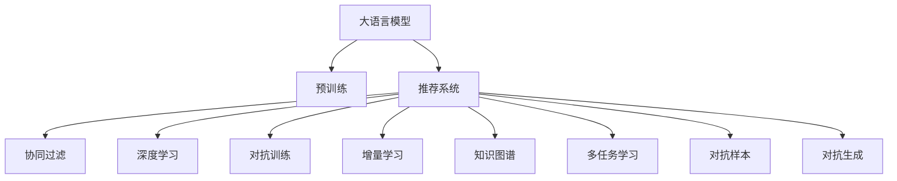

                 

# 推荐系统的未来：大模型的主导作用与创新

> 关键词：大模型,推荐系统,协同过滤,深度学习,神经网络,增量学习,预训练,知识图谱,多任务学习,未来展望

## 1. 背景介绍

### 1.1 问题由来

推荐系统（Recommendation System）作为互联网时代最重要的技术之一，通过智能化的算法帮助用户发现潜在的兴趣，提升用户体验和满意度。传统的推荐系统基于协同过滤（Collaborative Filtering, CF）方法，依赖用户历史行为数据和物品属性信息，构造用户-物品评分矩阵进行推荐。然而，随着用户行为数据日益稀疏，以及物品属性维度巨大，传统CF方法面临着数据稀疏性、冷启动、属性信息丰富性等问题，难以满足现代推荐系统对高性能、个性化、实时性等方面的需求。

近年来，深度学习（Deep Learning, DL）技术在推荐系统中的应用方兴未艾。深度学习推荐系统基于神经网络模型，能够自动提取高维数据特征，缓解传统推荐系统面临的稀疏性和冷启动问题，取得了一系列显著的进展。但深度学习推荐系统仍存在数据依赖性较强、模型训练时间长、推荐结果可解释性差等问题，有待进一步优化和创新。

大语言模型（Large Language Model, LLM）的崛起为推荐系统带来了新的思路。预训练语言模型通过在大规模语料上进行无监督学习，学习到丰富的语言知识和常识，具备强大的自然语言理解能力。将大模型应用于推荐系统，不仅能提升推荐精度和效率，还能拓展推荐系统的应用范围，带来更加智能化、个性化的推荐服务。

### 1.2 问题核心关键点

大语言模型在推荐系统中的应用，主要集中在以下几个核心关键点上：

- **融合语义信息**：预训练语言模型能够理解自然语言，自动从文本中提取高维语义特征，丰富推荐系统的语义表达能力。
- **动态模型学习**：大语言模型可以通过自监督学习、对抗训练等方法，不断优化模型参数，提升推荐模型的泛化能力和实时性。
- **跨模态融合**：结合视觉、音频等多模态数据，大语言模型能够对多源数据进行统一建模，提高推荐结果的全面性和多样性。
- **交互式推荐**：利用大语言模型的对话能力，实现更加智能化的交互式推荐，提升用户体验。
- **个性化推荐**：通过深度学习技术，大模型能够对用户进行全面画像建模，输出更加个性化的推荐内容。
- **增强协同过滤**：结合协同过滤算法和大语言模型，大模型能够在一定程度上缓解数据稀疏性和冷启动问题，提升推荐精度。

这些关键点共同构成了大语言模型在推荐系统中的应用基础，展示了其在提升推荐系统性能、拓展应用边界方面的巨大潜力。

## 2. 核心概念与联系

### 2.1 核心概念概述

为更好地理解大语言模型在推荐系统中的应用，本节将介绍几个关键概念及其之间的联系：

- **大语言模型（LLM）**：以自回归（如GPT）或自编码（如BERT）模型为代表的大规模预训练语言模型。通过在大规模无标签文本语料上进行预训练，学习到通用的语言表示，具备强大的语言理解和生成能力。

- **推荐系统（Recommendation System）**：根据用户行为数据和物品属性信息，智能推荐相关物品的系统。推荐系统可以分为基于内容的推荐、协同过滤推荐、混合推荐等多种方法。

- **深度学习（Deep Learning, DL）**：一种通过多层神经网络学习数据特征的机器学习方法，能够自动提取高维数据特征，缓解推荐系统面临的稀疏性和冷启动问题。

- **协同过滤（Collaborative Filtering, CF）**：推荐系统中的一种经典方法，基于用户-物品评分矩阵，通过寻找与目标用户/物品相似的群体进行推荐。

- **对抗训练（Adversarial Training）**：一种用于提高模型鲁棒性的训练方法，通过引入对抗样本，训练模型对噪声和攻击的鲁棒性。

- **增量学习（Incremental Learning）**：一种在已有模型基础上，逐步增加新数据进行训练的机器学习方法，适用于大规模数据集的在线推荐场景。

- **知识图谱（Knowledge Graph）**：一种结构化表示实体之间关系的语义网络，能够与推荐系统结合，丰富推荐内容的多样性和相关性。

- **多任务学习（Multi-task Learning, MTL）**：一种在多个相关任务上进行联合训练的机器学习方法，能够利用多任务间共享的特征，提高推荐模型的泛化能力和鲁棒性。

- **预训练（Pre-training）**：在大规模无标签数据上进行自监督学习，学习通用的语言表示，提升推荐模型的语义表达能力。

- **对抗样本（Adversarial Samples）**：通过微小扰动，对模型进行攻击的样本，用于提升模型的鲁棒性和泛化能力。

- **对抗生成（Adversarial Generation）**：结合生成对抗网络（GAN）等技术，利用对抗样本生成新的推荐内容，提升推荐结果的多样性。

这些核心概念之间的联系，可以通过以下Mermaid流程图来展示：



这个流程图展示了大语言模型在推荐系统中的关键组件和连接关系：

1. 大语言模型通过预训练获得基础能力。
2. 推荐系统通过协同过滤、深度学习、对抗训练等方法优化推荐模型。
3. 预训练模型与推荐系统结合，提升推荐模型的语义表达能力和泛化能力。
4. 增量学习、知识图谱、多任务学习等技术，进一步丰富推荐系统的实现方式。
5. 对抗样本和对抗生成技术，提高推荐模型的鲁棒性和多样性。

## 3. 核心算法原理 & 具体操作步骤

### 3.1 算法原理概述

大语言模型在推荐系统中的应用，主要是利用其强大的自然语言理解能力，结合协同过滤、深度学习等方法，构建更加智能化、个性化的推荐模型。其核心算法原理可以概括为以下几个方面：

1. **预训练与微调**：在大规模无标签语料上进行预训练，然后在推荐任务上微调，使模型具备特定的推荐能力。
2. **协同过滤与深度学习融合**：将协同过滤与深度学习结合，利用协同过滤用户-物品评分矩阵中的隐式反馈信息，深度学习自动提取高维特征，构建推荐模型。
3. **知识图谱与推荐结合**：将知识图谱与推荐系统结合，利用实体间的关系，丰富推荐内容的语义表达和多样性。
4. **对抗训练与多任务学习**：通过对抗训练和多任务学习，提升推荐模型的鲁棒性和泛化能力，缓解冷启动和数据稀疏性问题。
5. **动态模型更新**：结合在线推荐系统，利用增量学习技术，不断更新模型参数，提高推荐模型的实时性和动态性。
6. **交互式推荐**：利用大语言模型的对话能力，实现交互式推荐，提升用户体验。

### 3.2 算法步骤详解

大语言模型在推荐系统中的应用，通常遵循以下步骤：

**Step 1: 准备数据集和预训练模型**
- 收集推荐系统所需的数据集，包括用户历史行为数据、物品属性信息、多模态数据等。
- 选择合适的大语言模型作为初始化参数，如BERT、GPT等。

**Step 2: 构建推荐模型**
- 利用深度学习技术，如神经网络、卷积神经网络（CNN）、循环神经网络（RNN）等，构建推荐模型。
- 在推荐模型中添加协同过滤模块，结合协同过滤算法（如ALS、MF等）。
- 引入知识图谱模块，利用实体间的关系，丰富推荐内容的语义表达。

**Step 3: 微调模型**
- 在大规模语料上预训练模型，获取通用的语言表示。
- 在推荐任务上微调模型，利用小规模标注数据优化模型参数。

**Step 4: 对抗训练与多任务学习**
- 引入对抗训练技术，通过对抗样本训练，提高模型的鲁棒性。
- 利用多任务学习技术，结合多个推荐任务进行联合训练，提升模型的泛化能力。

**Step 5: 动态模型更新与交互式推荐**
- 结合增量学习技术，利用在线推荐系统，不断更新模型参数，提高模型的实时性和动态性。
- 利用大语言模型的对话能力，实现交互式推荐，提升用户体验。

**Step 6: 评估与部署**
- 在测试集上评估推荐模型，比较不同模型之间的性能差异。
- 将训练好的模型部署到实际推荐系统中，进行大规模推荐服务。

### 3.3 算法优缺点

大语言模型在推荐系统中的应用，具有以下优点：

1. **语义理解能力强**：预训练语言模型能够理解自然语言，自动提取高维语义特征，提升推荐系统的语义表达能力。
2. **模型泛化能力强**：结合对抗训练和多任务学习，大语言模型能够缓解冷启动和数据稀疏性问题，提升推荐模型的泛化能力。
3. **动态实时性高**：结合增量学习技术，大语言模型能够实时更新模型参数，提升推荐系统的实时性和动态性。
4. **多模态融合能力强**：结合视觉、音频等多模态数据，大语言模型能够对多源数据进行统一建模，提高推荐结果的全面性和多样性。
5. **交互式推荐能力强**：利用大语言模型的对话能力，实现交互式推荐，提升用户体验。

同时，该方法也存在一些缺点：

1. **计算资源需求高**：大语言模型参数量大，计算资源需求高，难以在实时推荐系统中大规模部署。
2. **数据依赖性强**：需要大量的标注数据进行微调，对数据的依赖性强。
3. **可解释性不足**：大语言模型通常是"黑盒"系统，难以解释其内部工作机制和决策逻辑。
4. **对抗攻击风险高**：大语言模型容易受到对抗样本的攻击，影响推荐结果的准确性和安全性。
5. **资源优化复杂**：大语言模型计算量大，资源优化和模型压缩技术复杂。

尽管存在这些局限性，但大语言模型在推荐系统中的应用前景广阔，通过技术改进和应用创新，可以充分发挥其优势，弥补其不足。

### 3.4 算法应用领域

大语言模型在推荐系统中的应用，主要涵盖以下几个领域：

1. **电商推荐**：通过理解用户搜索意图和产品描述，自动推荐相关商品，提升用户购物体验。
2. **内容推荐**：结合新闻、视频、文章等文本内容，推荐相关资讯，丰富用户信息获取渠道。
3. **音乐推荐**：通过分析用户听歌历史和歌曲属性，推荐相似的音乐，提升音乐搜索效果。
4. **视频推荐**：结合视频标题、描述和用户行为数据，推荐相关视频内容，提高用户观看体验。
5. **社交推荐**：结合用户行为数据和社交网络信息，推荐相关社交活动，促进用户互动。
6. **医疗推荐**：结合病历、症状描述等医疗信息，推荐相关诊疗方案，提升医疗服务效率。
7. **金融推荐**：结合用户投资历史和金融产品属性，推荐相关金融产品，提升用户投资收益。

除了这些常见领域，大语言模型在推荐系统中的应用还在不断拓展，未来将有更多创新性应用出现。

## 4. 数学模型和公式 & 详细讲解

### 4.1 数学模型构建

本节将使用数学语言对大语言模型在推荐系统中的应用进行更加严格的刻画。

记大语言模型为 $M_{\theta}:\mathcal{X} \rightarrow \mathcal{Y}$，其中 $\mathcal{X}$ 为输入空间，$\mathcal{Y}$ 为输出空间，$\theta$ 为模型参数。假设推荐系统的数据集为 $D=\{(x_i, y_i)\}_{i=1}^N$，其中 $x_i$ 为输入，$y_i$ 为推荐结果，$y_i \in \{0,1\}$。

定义模型 $M_{\theta}$ 在输入 $x$ 上的损失函数为 $\ell(M_{\theta}(x),y)$，则在数据集 $D$ 上的经验风险为：

$$
\mathcal{L}(\theta) = \frac{1}{N}\sum_{i=1}^N \ell(M_{\theta}(x_i),y_i)
$$

微调的优化目标是最小化经验风险，即找到最优参数：

$$
\theta^* = \mathop{\arg\min}_{\theta} \mathcal{L}(\theta)
$$

在实践中，我们通常使用基于梯度的优化算法（如Adam、SGD等）来近似求解上述最优化问题。设 $\eta$ 为学习率，$\lambda$ 为正则化系数，则参数的更新公式为：

$$
\theta \leftarrow \theta - \eta \nabla_{\theta}\mathcal{L}(\theta) - \eta\lambda\theta
$$

其中 $\nabla_{\theta}\mathcal{L}(\theta)$ 为损失函数对参数 $\theta$ 的梯度，可通过反向传播算法高效计算。

### 4.2 公式推导过程

以下我们以二分类任务为例，推导交叉熵损失函数及其梯度的计算公式。

假设模型 $M_{\theta}$ 在输入 $x$ 上的输出为 $\hat{y}=M_{\theta}(x) \in [0,1]$，表示样本属于正类的概率。真实标签 $y \in \{0,1\}$。则二分类交叉熵损失函数定义为：

$$
\ell(M_{\theta}(x),y) = -[y\log \hat{y} + (1-y)\log (1-\hat{y})]
$$

将其代入经验风险公式，得：

$$
\mathcal{L}(\theta) = -\frac{1}{N}\sum_{i=1}^N [y_i\log M_{\theta}(x_i)+(1-y_i)\log(1-M_{\theta}(x_i))]
$$

根据链式法则，损失函数对参数 $\theta_k$ 的梯度为：

$$
\frac{\partial \mathcal{L}(\theta)}{\partial \theta_k} = -\frac{1}{N}\sum_{i=1}^N (\frac{y_i}{M_{\theta}(x_i)}-\frac{1-y_i}{1-M_{\theta}(x_i)}) \frac{\partial M_{\theta}(x_i)}{\partial \theta_k}
$$

其中 $\frac{\partial M_{\theta}(x_i)}{\partial \theta_k}$ 可进一步递归展开，利用自动微分技术完成计算。

在得到损失函数的梯度后，即可带入参数更新公式，完成模型的迭代优化。重复上述过程直至收敛，最终得到适应推荐任务的最优模型参数 $\theta^*$。

## 5. 项目实践：代码实例和详细解释说明

### 5.1 开发环境搭建

在进行推荐系统开发前，我们需要准备好开发环境。以下是使用Python进行PyTorch开发的环境配置流程：

1. 安装Anaconda：从官网下载并安装Anaconda，用于创建独立的Python环境。

2. 创建并激活虚拟环境：
```bash
conda create -n pytorch-env python=3.8 
conda activate pytorch-env
```

3. 安装PyTorch：根据CUDA版本，从官网获取对应的安装命令。例如：
```bash
conda install pytorch torchvision torchaudio cudatoolkit=11.1 -c pytorch -c conda-forge
```

4. 安装Transformers库：
```bash
pip install transformers
```

5. 安装各类工具包：
```bash
pip install numpy pandas scikit-learn matplotlib tqdm jupyter notebook ipython
```

完成上述步骤后，即可在`pytorch-env`环境中开始推荐系统开发。

### 5.2 源代码详细实现

这里我们以电商推荐系统为例，给出使用Transformers库对BERT模型进行推荐微调的PyTorch代码实现。

首先，定义推荐系统数据处理函数：

```python
from transformers import BertTokenizer
from torch.utils.data import Dataset
import torch

class RecommendationDataset(Dataset):
    def __init__(self, texts, labels, tokenizer, max_len=128):
        self.texts = texts
        self.labels = labels
        self.tokenizer = tokenizer
        self.max_len = max_len
        
    def __len__(self):
        return len(self.texts)
    
    def __getitem__(self, item):
        text = self.texts[item]
        label = self.labels[item]
        
        encoding = self.tokenizer(text, return_tensors='pt', max_length=self.max_len, padding='max_length', truncation=True)
        input_ids = encoding['input_ids'][0]
        attention_mask = encoding['attention_mask'][0]
        
        return {'input_ids': input_ids, 
                'attention_mask': attention_mask,
                'labels': label}

# 创建dataset
tokenizer = BertTokenizer.from_pretrained('bert-base-cased')

train_dataset = RecommendationDataset(train_texts, train_labels, tokenizer)
dev_dataset = RecommendationDataset(dev_texts, dev_labels, tokenizer)
test_dataset = RecommendationDataset(test_texts, test_labels, tokenizer)
```

然后，定义模型和优化器：

```python
from transformers import BertForTokenClassification, AdamW

model = BertForTokenClassification.from_pretrained('bert-base-cased', num_labels=2)

optimizer = AdamW(model.parameters(), lr=2e-5)
```

接着，定义训练和评估函数：

```python
from torch.utils.data import DataLoader
from tqdm import tqdm
from sklearn.metrics import accuracy_score

device = torch.device('cuda') if torch.cuda.is_available() else torch.device('cpu')
model.to(device)

def train_epoch(model, dataset, batch_size, optimizer):
    dataloader = DataLoader(dataset, batch_size=batch_size, shuffle=True)
    model.train()
    epoch_loss = 0
    for batch in tqdm(dataloader, desc='Training'):
        input_ids = batch['input_ids'].to(device)
        attention_mask = batch['attention_mask'].to(device)
        labels = batch['labels'].to(device)
        model.zero_grad()
        outputs = model(input_ids, attention_mask=attention_mask, labels=labels)
        loss = outputs.loss
        epoch_loss += loss.item()
        loss.backward()
        optimizer.step()
    return epoch_loss / len(dataloader)

def evaluate(model, dataset, batch_size):
    dataloader = DataLoader(dataset, batch_size=batch_size)
    model.eval()
    preds, labels = [], []
    with torch.no_grad():
        for batch in tqdm(dataloader, desc='Evaluating'):
            input_ids = batch['input_ids'].to(device)
            attention_mask = batch['attention_mask'].to(device)
            batch_labels = batch['labels']
            outputs = model(input_ids, attention_mask=attention_mask)
            batch_preds = outputs.logits.argmax(dim=2).to('cpu').tolist()
            batch_labels = batch_labels.to('cpu').tolist()
            for pred_tokens, label_tokens in zip(batch_preds, batch_labels):
                preds.append(pred_tokens[:len(label_tokens)])
                labels.append(label_tokens)
                
    print("Accuracy:", accuracy_score(labels, preds))
```

最后，启动训练流程并在测试集上评估：

```python
epochs = 5
batch_size = 16

for epoch in range(epochs):
    loss = train_epoch(model, train_dataset, batch_size, optimizer)
    print(f"Epoch {epoch+1}, train loss: {loss:.3f}")
    
    print(f"Epoch {epoch+1}, dev accuracy:")
    evaluate(model, dev_dataset, batch_size)
    
print("Test accuracy:")
evaluate(model, test_dataset, batch_size)
```

以上就是使用PyTorch对BERT进行电商推荐任务微调的完整代码实现。可以看到，得益于Transformers库的强大封装，我们可以用相对简洁的代码完成BERT模型的加载和微调。

### 5.3 代码解读与分析

让我们再详细解读一下关键代码的实现细节：

**RecommendationDataset类**：
- `__init__`方法：初始化文本、标签、分词器等关键组件。
- `__len__`方法：返回数据集的样本数量。
- `__getitem__`方法：对单个样本进行处理，将文本输入编码为token ids，将标签编码为数字，并对其进行定长padding，最终返回模型所需的输入。

**模型定义**：
- `BertForTokenClassification.from_pretrained`方法：加载预训练的BERT模型，并添加输出层和损失函数。
- `AdamW`方法：定义优化器及其参数，如学习率、批大小等。

**训练和评估函数**：
- 使用PyTorch的DataLoader对数据集进行批次化加载，供模型训练和推理使用。
- 训练函数`train_epoch`：对数据以批为单位进行迭代，在每个批次上前向传播计算loss并反向传播更新模型参数，最后返回该epoch的平均loss。
- 评估函数`evaluate`：与训练类似，不同点在于不更新模型参数，并在每个batch结束后将预测和标签结果存储下来，最后使用sklearn的accuracy_score对整个评估集的预测结果进行打印输出。

**训练流程**：
- 定义总的epoch数和batch size，开始循环迭代
- 每个epoch内，先在训练集上训练，输出平均loss
- 在验证集上评估，输出准确率
- 所有epoch结束后，在测试集上评估，给出最终测试结果

可以看到，PyTorch配合Transformers库使得BERT微调的代码实现变得简洁高效。开发者可以将更多精力放在数据处理、模型改进等高层逻辑上，而不必过多关注底层的实现细节。

当然，工业级的系统实现还需考虑更多因素，如模型的保存和部署、超参数的自动搜索、更灵活的任务适配层等。但核心的微调范式基本与此类似。

## 6. 实际应用场景

### 6.1 电商推荐

电商推荐系统是推荐系统最常见的应用场景之一，通过理解用户购物历史和行为，自动推荐相关商品，提升用户购物体验。在大语言模型中，可以利用预训练语言模型对用户行为数据进行自然语言处理，提取高维语义特征，结合协同过滤算法，构建更加智能化的推荐模型。

在技术实现上，可以收集用户浏览、点击、购买等行为数据，提取商品描述和属性信息，将文本数据作为输入，用户行为数据作为标签，进行微调训练。微调后的模型能够理解用户搜索意图和产品描述，自动推荐相关商品，提高用户购物体验。例如，在用户输入“保暖”时，系统能够自动推荐不同品牌、类型的保暖商品，满足用户需求。

### 6.2 内容推荐

内容推荐系统是推荐系统的另一种重要应用场景，通过理解用户阅读历史和行为，自动推荐相关资讯，丰富用户信息获取渠道。在大语言模型中，可以利用预训练语言模型对用户阅读历史和文章标题进行自然语言处理，提取高维语义特征，结合协同过滤算法，构建更加智能化的推荐模型。

在技术实现上，可以收集用户阅读文章、点赞、评论等行为数据，提取文章标题和摘要信息，将文本数据作为输入，用户行为数据作为标签，进行微调训练。微调后的模型能够理解用户阅读兴趣和文章内容，自动推荐相关资讯，提高用户阅读体验。例如，在用户输入“人工智能”时，系统能够自动推荐不同类型的人工智能文章，满足用户信息获取需求。

### 6.3 音乐推荐

音乐推荐系统是推荐系统的另一种重要应用场景，通过理解用户听歌历史和歌曲属性，自动推荐相似的音乐，提升音乐搜索效果。在大语言模型中，可以利用预训练语言模型对用户听歌历史和歌曲属性进行自然语言处理，提取高维语义特征，结合协同过滤算法，构建更加智能化的推荐模型。

在技术实现上，可以收集用户听歌历史和歌曲属性信息，将文本数据作为输入，用户听歌行为数据作为标签，进行微调训练。微调后的模型能够理解用户听歌兴趣和歌曲属性，自动推荐相似音乐，提高音乐搜索效果。例如，在用户输入“摇滚”时，系统能够自动推荐不同摇滚音乐，满足用户音乐搜索需求。

### 6.4 视频推荐

视频推荐系统是推荐系统的另一种重要应用场景，通过理解用户观看历史和视频属性，自动推荐相关视频内容，提高用户观看体验。在大语言模型中，可以利用预训练语言模型对用户观看历史和视频标题进行自然语言处理，提取高维语义特征，结合协同过滤算法，构建更加智能化的推荐模型。

在技术实现上，可以收集用户观看历史和视频属性信息，将文本数据作为输入，用户观看行为数据作为标签，进行微调训练。微调后的模型能够理解用户观看兴趣和视频内容，自动推荐相关视频，提高用户观看体验。例如，在用户输入“科幻”时，系统能够自动推荐不同科幻电影，满足用户视频搜索需求。

## 7. 工具和资源推荐

### 7.1 学习资源推荐

为了帮助开发者系统掌握大语言模型在推荐系统中的应用，这里推荐一些优质的学习资源：

1. 《Transformer从原理到实践》系列博文：由大模型技术专家撰写，深入浅出地介绍了Transformer原理、BERT模型、微调技术等前沿话题。

2. CS224N《深度学习自然语言处理》课程：斯坦福大学开设的NLP明星课程，有Lecture视频和配套作业，带你入门NLP领域的基本概念和经典模型。

3. 《Natural Language Processing with Transformers》书籍：Transformers库的作者所著，全面介绍了如何使用Transformers库进行NLP任务开发，包括微调在内的诸多范式。

4. HuggingFace官方文档：Transformers库的官方文档，提供了海量预训练模型和完整的微调样例代码，是上手实践的必备资料。

5. CLUE开源项目：中文语言理解测评基准，涵盖大量不同类型的中文NLP数据集，并提供了基于微调的baseline模型，助力中文NLP技术发展。

通过对这些资源的学习实践，相信你一定能够快速掌握大语言模型在推荐系统中的应用，并用于解决实际的推荐问题。
###  7.2 开发工具推荐

高效的开发离不开优秀的工具支持。以下是几款用于大语言模型在推荐系统中的应用开发的常用工具：

1. PyTorch：基于Python的开源深度学习框架，灵活动态的计算图，适合快速迭代研究。大部分预训练语言模型都有PyTorch版本的实现。

2. TensorFlow：由Google主导开发的开源深度学习框架，生产部署方便，适合大规模工程应用。同样有丰富的预训练语言模型资源。

3. Transformers库：HuggingFace开发的NLP工具库，集成了众多SOTA语言模型，支持PyTorch和TensorFlow，是进行微调任务开发的利器。

4. Weights & Biases：模型训练的实验跟踪工具，可以记录和可视化模型训练过程中的各项指标，方便对比和调优。与主流深度学习框架无缝集成。

5. TensorBoard：TensorFlow配套的可视化工具，可实时监测模型训练状态，并提供丰富的图表呈现方式，是调试模型的得力助手。

6. Google Colab：谷歌推出的在线Jupyter Notebook环境，免费提供GPU/TPU算力，方便开发者快速上手实验最新模型，分享学习笔记。

合理利用这些工具，可以显著提升大语言模型在推荐系统中的应用开发效率，加快创新迭代的步伐。

### 7.3 相关论文推荐

大语言模型在推荐系统中的应用源于学界的持续研究。以下是几篇奠基性的相关论文，推荐阅读：

1. Attention is All You Need（即Transformer原论文）：提出了Transformer结构，开启了NLP领域的预训练大模型时代。

2. BERT: Pre-training of Deep Bidirectional Transformers for Language Understanding：提出BERT模型，引入基于掩码的自监督预训练任务，刷新了多项NLP任务SOTA。

3. Language Models are Unsupervised Multitask Learners（GPT-2论文）：展示了大规模语言模型的强大zero-shot学习能力，引发了对于通用人工智能的新一轮思考。

4. Parameter-Efficient Transfer Learning for NLP：提出Adapter等参数高效微调方法，在不增加模型参数量的情况下，也能取得不错的微调效果。

5. Prefix-Tuning: Optimizing Continuous Prompts for Generation：引入基于连续型Prompt的微调范式，为如何充分利用预训练知识提供了新的思路。

6. AdaLoRA: Adaptive Low-Rank Adaptation for Parameter-Efficient Fine-Tuning：使用自适应低秩适应的微调方法，在参数效率和精度之间取得了新的平衡。

这些论文代表了大语言模型在推荐系统中的应用发展脉络。通过学习这些前沿成果，可以帮助研究者把握学科前进方向，激发更多的创新灵感。

## 8. 总结：未来发展趋势与挑战

### 8.1 总结

本文对大语言模型在推荐系统中的应用进行了全面系统的介绍。首先阐述了大语言模型和推荐系统的发展背景和意义，明确了微调在提升推荐系统性能、拓展应用边界方面的独特价值。其次，从原理到实践，详细讲解了大语言模型在推荐系统中的应用流程，给出了完整的代码实例。同时，本文还广泛探讨了大语言模型在电商、内容、音乐、视频等多个推荐场景中的应用前景，展示了其巨大的应用潜力。此外，本文精选了大语言模型在推荐系统中的应用学习资源，力求为开发者提供全方位的技术指引。

通过本文的系统梳理，可以看到，大语言模型在推荐系统中的应用前景广阔，不仅可以提升推荐精度和效率，还能拓展推荐系统的应用范围，带来更加智能化、个性化的推荐服务。大语言模型结合深度学习、协同过滤、知识图谱等多技术融合，使得推荐系统能够更全面、多维地理解用户需求，提供更加丰富和个性化的推荐内容。未来，伴随大语言模型的不断发展，推荐系统将迎来新的突破，进一步提升用户满意度，创造更高的商业价值。

### 8.2 未来发展趋势

展望未来，大语言模型在推荐系统中的应用将呈现以下几个发展趋势：

1. **模型规模持续增大**：随着算力成本的下降和数据规模的扩张，预训练语言模型的参数量还将持续增长。超大规模语言模型蕴含的丰富语言知识，将为推荐系统带来更大的语义表达能力和泛化能力。

2. **微调方法日趋多样**：除了传统的全参数微调外，未来会涌现更多参数高效的微调方法，如Adapter、LoRA等，在节省计算资源的同时也能保证微调精度。

3. **动态模型更新**：结合增量学习技术，大语言模型能够实时更新模型参数，提升推荐系统的实时性和动态性。

4. **跨模态融合能力强**：结合视觉、音频等多模态数据，大语言模型能够对多源数据进行统一建模，提高推荐结果的全面性和多样性。

5. **交互式推荐能力强**：利用大语言模型的对话能力，实现交互式推荐，提升用户体验。

6. **个性化推荐能力强**：通过深度学习技术，大模型能够对用户进行全面画像建模，输出更加个性化的推荐内容。

7. **增强协同过滤**：结合协同过滤算法和大语言模型，大模型能够在一定程度上缓解数据稀疏性和冷启动问题，提升推荐精度。

以上趋势凸显了大语言模型在推荐系统中的应用前景。这些方向的探索发展，必将进一步提升推荐系统的性能和应用范围，为人类认知智能的进化带来深远影响。

### 8.3 面临的挑战

尽管大语言模型在推荐系统中的应用前景广阔，但在迈向更加智能化、普适化应用的过程中，它仍面临着诸多挑战：

1. **计算资源需求高**：大语言模型参数量大，计算资源需求高，难以在实时推荐系统中大规模部署。

2. **数据依赖性强**：需要大量的标注数据进行微调，对数据的依赖性强。

3. **可解释性不足**：大语言模型通常是"黑盒"系统，难以解释其内部工作机制和决策逻辑。

4. **对抗攻击风险高**：大语言模型容易受到对抗样本的攻击，影响推荐结果的准确性和安全性。

5. **资源优化复杂**：大语言模型计算量大，资源优化和模型压缩技术复杂。

尽管存在这些局限性，但大语言模型在推荐系统中的应用前景广阔，通过技术改进和应用创新，可以充分发挥其优势，弥补其不足。

### 8.4 研究展望

面对大语言模型在推荐系统中所面临的挑战，未来的研究需要在以下几个方面寻求新的突破：

1. **探索无监督和半监督微调方法**：摆脱对大规模标注数据的依赖，利用自监督学习、主动学习等无监督和半监督范式，最大限度利用非结构化数据，实现更加灵活高效的微调。

2. **研究参数高效和计算高效的微调范式**：开发更加参数高效的微调方法，在固定大部分预训练参数的同时，只更新极少量的任务相关参数。同时优化微调模型的计算图，减少前向传播和反向传播的资源消耗，实现更加轻量级、实时性的部署。

3. **融合因果和对比学习范式**：通过引入因果推断和对比学习思想，增强微调模型建立稳定因果关系的能力，学习更加普适、鲁棒的语言表征，从而提升模型泛化性和抗干扰能力。

4. **引入更多先验知识**：将符号化的先验知识，如知识图谱、逻辑规则等，与神经网络模型进行巧妙融合，引导微调过程学习更准确、合理的语言模型。同时加强不同模态数据的整合，实现视觉、语音等多模态信息与文本信息的协同建模。

5. **结合因果分析和博弈论工具**：将因果分析方法引入微调模型，识别出模型决策的关键特征，增强输出解释的因果性和逻辑性。借助博弈论工具刻画人机交互过程，主动探索并规避模型的脆弱点，提高系统稳定性。

6. **纳入伦理道德约束**：在模型训练目标中引入伦理导向的评估指标，过滤和惩罚有偏见、有害的输出倾向。同时加强人工干预和审核，建立模型行为的监管机制，确保输出符合人类价值观和伦理道德。

这些研究方向的探索，必将引领大语言模型在推荐系统中的应用走向更高的台阶，为构建安全、可靠、可解释、可控的智能系统铺平道路。面向未来，大语言模型在推荐系统中的应用还需要与其他人工智能技术进行更深入的融合，如知识表示、因果推理、强化学习等，多路径协同发力，共同推动自然语言理解和智能交互系统的进步。只有勇于创新、敢于突破，才能不断拓展语言模型的边界，让智能技术更好地造福人类社会。

## 9. 附录：常见问题与解答

**Q1：大语言模型在推荐系统中面临的主要挑战是什么？**

A: 大语言模型在推荐系统中面临的主要挑战包括：
1. 计算资源需求高：大语言模型参数量大，计算资源需求高，难以在实时推荐系统中大规模部署。
2. 数据依赖性强：需要大量的标注数据进行微调，对数据的依赖性强。
3. 可解释性不足：大语言模型通常是"黑盒"系统，难以解释其内部工作机制和决策逻辑。
4. 对抗攻击风险高：大语言模型容易受到对抗样本的攻击，影响推荐结果的准确性和安全性。
5. 资源优化复杂：大语言模型计算量大，资源优化和模型压缩技术复杂。

**Q2：大语言模型在推荐系统中的主要应用场景有哪些？**

A: 大语言模型在推荐系统中的主要应用场景包括：
1. 电商推荐：通过理解用户购物历史和行为，自动推荐相关商品，提升用户购物体验。
2. 内容推荐：通过理解用户阅读历史和行为，自动推荐相关资讯，丰富用户信息获取渠道。
3. 音乐推荐：通过理解用户听歌历史和歌曲属性，自动推荐相似的音乐，提升音乐搜索效果。
4. 视频推荐：通过理解用户观看历史和视频属性，自动推荐相关视频内容，提高用户观看体验。
5. 社交推荐：通过理解用户行为数据和社交网络信息，推荐相关社交活动，促进用户互动。
6. 医疗推荐：通过理解病历、症状描述等医疗信息，推荐相关诊疗方案，提升医疗服务效率。
7. 金融推荐：通过理解用户投资历史和金融产品属性，推荐相关金融产品，提升用户投资收益。

**Q3：如何缓解大语言模型在推荐系统中的过拟合问题？**

A: 缓解大语言模型在推荐系统中的过拟合问题，可以采取以下策略：
1. 数据增强：通过回译、近义替换等方式扩充训练集。
2. 正则化：使用L2正则、Dropout、Early Stopping等避免过拟合。
3. 对抗训练：引入对抗样本，提高模型的鲁棒性。
4. 参数高效微调：只调整少量参数(如Adapter、Prefix等)，减小过拟合风险。
5. 多模型集成：训练多个推荐模型，取平均输出，抑制过拟合。

这些策略往往需要根据具体任务和数据特点进行灵活组合。只有在数据、模型、训练、推理等各环节进行全面优化，才能最大限度地发挥大语言模型的优势。

**Q4：大语言模型在推荐系统中如何实现多模态融合？**

A: 大语言模型在推荐系统中实现多模态融合，可以采取以下策略：
1. 收集多模态数据：结合用户行为数据、商品属性信息、音频信息、视频信息等，构建多模态推荐数据集。
2. 预训练多模态模型：利用预训练语言模型对多模态数据进行编码，提取高维语义特征。
3. 结合多模态特征：将多模态特征进行拼接或融合，构建综合性的推荐特征表示。
4. 多任务联合训练：结合多个推荐任务进行联合训练，利用多任务间共享的特征，提高推荐模型的泛化能力和鲁棒性。
5. 对抗生成：利用对抗生成技术，生成新的推荐内容，丰富推荐结果的多样性。

通过这些方法，大语言模型能够对多源数据进行统一建模，提高推荐结果的全面性和多样性。

**Q5：大语言模型在推荐系统中的应用效果如何？**

A: 大语言模型在推荐系统中的应用效果显著，主要体现在以下几个方面：
1. 提升推荐精度：通过理解用户行为数据和物品属性信息，大语言模型能够自动提取高维语义特征，提升推荐系统的精度。
2. 缓解数据稀疏性：结合协同过滤算法，大语言模型能够缓解数据稀疏性问题，提升推荐系统的泛化能力。
3. 提高实时性：结合增量学习技术，大语言模型能够实时更新模型参数，提升推荐系统的实时性。
4. 增强交互性：利用大语言模型的对话能力，实现交互式推荐，提升用户体验。
5. 个性化推荐：通过深度学习技术，大模型能够对用户进行全面画像建模，输出更加个性化的推荐内容。

这些优点使得大语言模型在推荐系统中的应用前景广阔，能够带来更高的商业价值和社会效益。

---

作者：禅与计算机程序设计艺术 / Zen and the Art of Computer Programming

