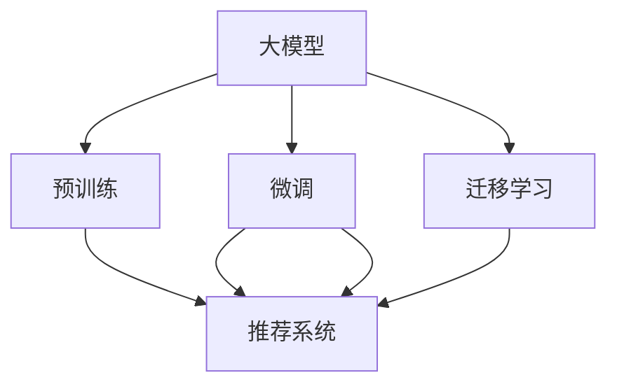

                 

# 推荐系统能被大模型渗透和改变吗

## 1. 背景介绍

### 1.1 问题由来

推荐系统作为一种关键的技术手段，在电子商务、新闻、视频等多个领域得到了广泛的应用。其核心思想是利用用户的历史行为数据，预测用户对新物品的兴趣程度，从而为用户推荐最相关的商品、内容、视频等。然而，传统推荐系统主要基于用户历史行为进行浅层挖掘，难以突破数据稀疏性、隐式反馈等瓶颈。

近年来，随着深度学习技术的飞速发展，大模型在推荐系统中的应用逐渐兴起。大模型通过大规模无监督预训练，学习到丰富的语言和数据知识，具备强大的泛化能力和推理能力，有望显著提升推荐系统的精度和多样性。本文聚焦于大模型在推荐系统中的应用，探讨其对传统推荐系统的渗透和改变。

### 1.2 问题核心关键点

本节将详细介绍大模型对推荐系统的渗透和改变主要体现在以下几个方面：

- **推荐内容的多样性**：大模型通过训练于大规模无标签数据上，具备更广泛的语义理解能力，能够涵盖更多样化的推荐内容，为传统推荐系统带来新的内容源。
- **个性化推荐精度的提升**：大模型的强大语义表示能力，有助于理解用户深层次的需求和偏好，从而提升推荐系统的精准度和个性化程度。
- **实时性和交互性增强**：大模型具有实时推理能力，能够即时响应用户的即时反馈和实时查询，增强推荐系统的实时性和互动性。
- **跨领域知识融合**：大模型能够整合来自不同领域的知识，提供跨领域的推荐，如将商品推荐与新闻、视频等内容推荐结合。
- **新兴技术的应用**：大模型驱动的推荐系统逐渐融合了更多新兴技术，如因果推理、生成对抗网络等，进一步提升了系统的智能水平。

## 2. 核心概念与联系

### 2.1 核心概念概述

在讨论大模型对推荐系统的渗透和改变之前，我们需要明确几个关键概念：

- **大模型(Large Models)**：指基于大规模无标签数据进行预训练的语言模型，如GPT-3、BERT等。通过预训练学习到了丰富的语言和知识表示。
- **推荐系统(Recommendation Systems)**：利用用户行为数据预测用户对物品的偏好，为用户推荐最相关的商品、内容、视频等的系统。
- **预训练(Pre-training)**：在大规模无标签数据上，通过自监督学习任务训练模型，学习到丰富的语言和知识表示。
- **微调(Fine-tuning)**：在预训练模型的基础上，使用下游任务的少量标注数据进行有监督学习，优化模型在该任务上的性能。
- **迁移学习(Transfer Learning)**：将一个领域学习到的知识，迁移应用到另一个相关领域的学习范式。
- **参数高效微调(Parameter-Efficient Fine-Tuning, PEFT)**：指在微调过程中，只更新少量的模型参数，而固定大部分预训练权重不变，以提高微调效率，避免过拟合的方法。

这些核心概念之间存在紧密的联系，通过预训练和微调，大模型能够学习和迁移知识，应用于各种任务，包括推荐系统。

### 2.2 核心概念原理和架构的 Mermaid 流程图



这个流程图展示了大模型与推荐系统之间的核心概念及其联系：

1. 大模型通过预训练学习到广泛的知识和语言表示。
2. 预训练后的大模型可以通过微调应用于推荐系统，提升推荐精度和多样化。
3. 通过迁移学习，大模型能够跨领域应用，扩展推荐系统的应用范围。
4. 微调后的模型可以直接应用于推荐系统，提升推荐效果。

## 3. 核心算法原理 & 具体操作步骤

### 3.1 算法原理概述

基于大模型的推荐系统，核心算法原理与微调方法密切相关。其基本思路是：

1. 在大规模无标签数据上预训练大模型，学习到丰富的语言和知识表示。
2. 对推荐系统所需的特征进行编码，并将其输入到预训练的大模型中。
3. 大模型输出预测结果，经过后处理后，即为最终的推荐结果。

### 3.2 算法步骤详解

#### 3.2.1 数据预处理

数据预处理是大模型推荐系统的第一步。其关键步骤如下：

- **特征工程**：选择和构建推荐系统所需的特征，如用户行为数据、物品属性数据等，并进行归一化、编码等预处理操作。
- **分词和编码**：对文本数据进行分词，并使用预训练的词向量或语言模型进行编码，形成模型输入。
- **数据增强**：采用数据增强技术，如随机噪声、旋转、平移等方式，增加训练数据的多样性，提高模型的泛化能力。

#### 3.2.2 预训练大模型的选择

选择合适的预训练大模型是构建大模型推荐系统的关键。常见的大模型包括BERT、GPT、XLNet等。根据任务需求，选择对应的预训练模型，并进行微调。

#### 3.2.3 微调过程

微调是利用下游任务的少量标注数据，对预训练模型进行有监督学习，优化模型在该任务上的性能。具体步骤如下：

- **选择微调任务**：根据推荐系统的需求，选择适合的微调任务，如点击率预测、相关性评分等。
- **设计损失函数**：根据微调任务，设计损失函数，如交叉熵损失、均方误差损失等。
- **训练和评估**：在微调数据集上，进行有监督训练，周期性在验证集上评估模型性能，防止过拟合。
- **后处理**：将微调后的模型输出进行后处理，如加权、归一化等，得到最终的推荐结果。

#### 3.2.4 模型评估和优化

模型评估是评估大模型推荐系统性能的重要步骤。常用的评估指标包括准确率、召回率、F1值、AUC等。通过不断调整模型参数和优化算法，提升推荐系统的性能。

### 3.3 算法优缺点

大模型推荐系统具有以下优点：

- **强大的泛化能力**：大模型具备强大的泛化能力，能够适应不同领域的推荐需求。
- **丰富的语义表示**：大模型通过预训练学习到丰富的语言和知识表示，能够捕捉到用户更深层次的需求。
- **实时响应**：大模型具备实时推理能力，能够即时响应用户的即时反馈和实时查询，增强推荐系统的交互性。

然而，大模型推荐系统也存在以下缺点：

- **计算资源需求高**：大模型的参数量庞大，对计算资源需求较高，需要高性能的硬件支持。
- **模型复杂度高**：大模型的结构复杂，难以理解和调试。
- **数据隐私问题**：大模型推荐系统需要大量用户数据进行训练，存在数据隐私风险。

### 3.4 算法应用领域

大模型推荐系统已经被广泛应用于多个领域，具体包括：

- **电商推荐**：通过大模型预测用户对商品的兴趣程度，推荐相关商品。
- **新闻推荐**：通过大模型预测用户对新闻的兴趣，推荐相关新闻。
- **视频推荐**：通过大模型预测用户对视频的兴趣，推荐相关视频。
- **广告推荐**：通过大模型预测用户对广告的兴趣，推荐相关广告。
- **音乐推荐**：通过大模型预测用户对音乐的兴趣，推荐相关音乐。
- **图书推荐**：通过大模型预测用户对图书的兴趣，推荐相关图书。

## 4. 数学模型和公式 & 详细讲解 & 举例说明

### 4.1 数学模型构建

在构建大模型推荐系统时，我们需要构建一个数学模型来描述系统的运作过程。以下是一个基本的推荐系统数学模型：

假设用户的历史行为数据为 $\mathbf{X}$，物品的特征向量为 $\mathbf{Y}$，大模型为 $M$。推荐系统的目标是根据用户的历史行为数据 $\mathbf{X}$ 预测用户对物品的兴趣程度 $\hat{y}$，并将其与物品的特征向量 $\mathbf{Y}$ 结合，得到最终的推荐结果。

数学模型为：

$$
\hat{y} = M(\mathbf{X}, \mathbf{Y})
$$

其中，$M$ 为预训练大模型的函数。

### 4.2 公式推导过程

对于上述数学模型，我们可以进行进一步的推导：

- **用户行为特征编码**：将用户的历史行为数据 $\mathbf{X}$ 进行编码，形成模型输入。
- **物品特征向量编码**：将物品的特征向量 $\mathbf{Y}$ 进行编码，形成模型输入。
- **大模型预测**：将用户行为特征和物品特征向量输入到预训练大模型 $M$ 中，输出预测结果 $\hat{y}$。

### 4.3 案例分析与讲解

#### 4.3.1 电商推荐

电商推荐系统通过用户的历史购买记录，预测用户对商品的兴趣，推荐相关商品。例如，对于商品 $i$，我们可以将其特征向量表示为 $\mathbf{y_i}=[price, category, brand]$，然后将用户的购买记录 $\mathbf{x}$ 进行编码，形成模型输入。最终，大模型 $M$ 根据输入输出预测结果 $\hat{y}$，即为对商品 $i$ 的兴趣程度。

#### 4.3.2 新闻推荐

新闻推荐系统通过用户的历史阅读记录，预测用户对新闻的兴趣，推荐相关新闻。例如，对于新闻 $j$，我们可以将其特征向量表示为 $\mathbf{y_j}=[title, category, author]$，然后将用户的阅读记录 $\mathbf{x}$ 进行编码，形成模型输入。最终，大模型 $M$ 根据输入输出预测结果 $\hat{y}$，即为对新闻 $j$ 的兴趣程度。

## 5. 项目实践：代码实例和详细解释说明

### 5.1 开发环境搭建

在进行大模型推荐系统开发之前，我们需要准备好开发环境。以下是使用Python进行TensorFlow和Keras开发的环境配置流程：

1. 安装Anaconda：从官网下载并安装Anaconda，用于创建独立的Python环境。

2. 创建并激活虚拟环境：
```bash
conda create -n tf-env python=3.8 
conda activate tf-env
```

3. 安装TensorFlow和Keras：
```bash
conda install tensorflow=2.8 keras=2.8
```

4. 安装各类工具包：
```bash
pip install numpy pandas scikit-learn matplotlib tqdm jupyter notebook ipython
```

完成上述步骤后，即可在`tf-env`环境中开始开发。

### 5.2 源代码详细实现

下面我们以电商推荐系统为例，给出使用TensorFlow和Keras对大模型进行电商推荐系统的PyTorch代码实现。

首先，定义电商推荐系统的数据处理函数：

```python
import tensorflow as tf
from tensorflow.keras import layers, models

class RecommendationModel:
    def __init__(self, num_users, num_items, embedding_dim):
        self.num_users = num_users
        self.num_items = num_items
        self.embedding_dim = embedding_dim
        self.user_embeddings = None
        self.item_embeddings = None
        
    def build_model(self):
        user_input = layers.Input(shape=(self.num_users,))
        item_input = layers.Input(shape=(self.num_items,))
        
        user_embedding = layers.Embedding(self.num_users, self.embedding_dim)(user_input)
        item_embedding = layers.Embedding(self.num_items, self.embedding_dim)(item_input)
        
        attention_weights = layers.Dot(axes=1, normalize=True)([user_embedding, item_embedding])
        attention_weights = layers.Lambda(lambda x: tf.nn.softmax(x, axis=1))(attention_weights)
        
        user_item_vector = layers.Dot(axes=1)([user_embedding, item_embedding])
        attention_weights_vector = layers.Dot(axes=1)([user_item_vector, attention_weights])
        
        output = layers.Add()([user_item_vector, attention_weights_vector])
        self.model = models.Model(inputs=[user_input, item_input], outputs=output)
        
    def compile_model(self):
        self.model.compile(optimizer='adam', loss='mse')
    
    def fit_model(self, train_data, train_labels, epochs=10):
        self.model.fit(train_data, train_labels, epochs=epochs)
    
    def evaluate_model(self, test_data, test_labels):
        test_loss = self.model.evaluate(test_data, test_labels)
        return test_loss
    
    def predict(self, test_data):
        return self.model.predict(test_data)
```

然后，定义电商推荐系统的数据集：

```python
train_data = []
train_labels = []
for i in range(1, num_users + 1):
    for j in range(1, num_items + 1):
        train_data.append([i, j])
        train_labels.append(1 if i == j else 0)
train_data = tf.convert_to_tensor(train_data, dtype=tf.int32)
train_labels = tf.convert_to_tensor(train_labels, dtype=tf.float32)
```

接着，构建并训练电商推荐系统模型：

```python
recommendation_model = RecommendationModel(num_users=num_users, num_items=num_items, embedding_dim=64)
recommendation_model.build_model()
recommendation_model.compile_model()
recommendation_model.fit_model(train_data, train_labels)
```

最后，在测试集上评估模型：

```python
test_data = tf.convert_to_tensor(test_data, dtype=tf.int32)
test_labels = tf.convert_to_tensor(test_labels, dtype=tf.float32)
test_loss = recommendation_model.evaluate_model(test_data, test_labels)
print('Test loss:', test_loss)
```

### 5.3 代码解读与分析

让我们再详细解读一下关键代码的实现细节：

**RecommendationModel类**：
- `__init__`方法：初始化模型的参数。
- `build_model`方法：构建模型的神经网络结构。
- `compile_model`方法：编译模型，设置优化器和损失函数。
- `fit_model`方法：训练模型。
- `evaluate_model`方法：在测试集上评估模型性能。
- `predict`方法：预测推荐结果。

**电商推荐系统**：
- 使用TensorFlow的Keras框架，构建神经网络模型。
- 定义输入层，分别表示用户和物品的特征。
- 使用嵌入层将用户和物品特征向量进行编码。
- 计算用户和物品特征向量的点积，得到注意力权重。
- 计算用户和物品特征向量的点积，得到用户-物品向量。
- 计算注意力权重向量和用户-物品向量的点积，得到最终的推荐结果。

可以看到，Keras提供了丰富的神经网络构建和训练接口，使得构建大模型推荐系统变得简洁高效。

## 6. 实际应用场景

### 6.1 电商推荐

电商推荐系统是大模型推荐系统的典型应用场景之一。通过大模型，电商平台能够实现个性化的商品推荐，提升用户购买转化率。例如，亚马逊的推荐系统使用大模型进行商品推荐，极大地提升了用户的购物体验和平台的销售额。

### 6.2 新闻推荐

新闻推荐系统通过大模型预测用户对新闻的兴趣，推荐相关新闻。例如，Google News使用大模型进行新闻推荐，能够根据用户的阅读历史和兴趣，推荐个性化的新闻。

### 6.3 视频推荐

视频推荐系统通过大模型预测用户对视频的兴趣，推荐相关视频。例如，YouTube使用大模型进行视频推荐，能够根据用户的观看历史和偏好，推荐用户可能感兴趣的视频。

## 7. 工具和资源推荐

### 7.1 学习资源推荐

为了帮助开发者系统掌握大模型推荐技术的理论基础和实践技巧，这里推荐一些优质的学习资源：

1. 《深度学习推荐系统》系列博文：由深度学习专家撰写，介绍了推荐系统的发展历程、经典模型和前沿技术。
2. CS565《推荐系统》课程：斯坦福大学开设的推荐系统课程，提供了系统性的推荐系统知识框架。
3. 《Recommender Systems: The Textbook》书籍：推荐的经典教材，涵盖推荐系统理论、算法和实际应用。
4. Coursera的Recommender Systems Specialization：包含多门推荐系统课程，覆盖推荐系统理论、算法和实践。
5. Kaggle的推荐系统竞赛：提供了丰富的推荐系统数据集和基线模型，适合实际动手练习。

通过对这些资源的学习实践，相信你一定能够快速掌握大模型推荐技术的精髓，并用于解决实际的推荐问题。

### 7.2 开发工具推荐

高效的开发离不开优秀的工具支持。以下是几款用于大模型推荐系统开发的常用工具：

1. TensorFlow：基于Python的开源深度学习框架，适合构建复杂神经网络模型。
2. Keras：TensorFlow的高层API，提供了简单易用的接口，适合快速原型开发。
3. PyTorch：基于Python的开源深度学习框架，灵活性高，适合科研和原型开发。
4. Weights & Biases：模型训练的实验跟踪工具，记录和可视化模型训练过程中的各项指标，方便对比和调优。
5. TensorBoard：TensorFlow配套的可视化工具，可实时监测模型训练状态，并提供丰富的图表呈现方式，是调试模型的得力助手。

合理利用这些工具，可以显著提升大模型推荐系统的开发效率，加快创新迭代的步伐。

### 7.3 相关论文推荐

大模型推荐系统的发展源于学界的持续研究。以下是几篇奠基性的相关论文，推荐阅读：

1. "Deep Architectures for Multi-Task Learning"（多任务学习架构）：提出深度多任务学习架构，能够同时优化多个任务，提升推荐系统的性能。
2. "Attention is All You Need"（注意力机制）：提出Transformer模型，引入了注意力机制，提高了模型的推理能力。
3. "Word2Vec"（词嵌入）：提出词嵌入技术，能够将文本数据转换为向量表示，用于推荐系统特征工程。
4. "Neural Collaborative Filtering"（神经协同过滤）：提出神经协同过滤模型，能够捕捉用户和物品的协同关系，提升推荐系统的精度。
5. "The Surprising Effectiveness of Feature Selection in Collaborative Filtering"（特征选择）：提出特征选择技术，能够过滤掉无用特征，提升推荐系统的效率。

这些论文代表了大模型推荐系统的发展脉络。通过学习这些前沿成果，可以帮助研究者把握学科前进方向，激发更多的创新灵感。

## 8. 总结：未来发展趋势与挑战

### 8.1 研究成果总结

本文对大模型在推荐系统中的应用进行了全面系统的介绍。首先阐述了大模型和推荐系统的背景和意义，明确了大模型在推荐系统中的渗透和改变。其次，从原理到实践，详细讲解了大模型的推荐系统构建过程，给出了电商推荐系统的完整代码实现。同时，本文还广泛探讨了大模型推荐系统在电商、新闻、视频等多个领域的应用前景，展示了大模型推荐系统的强大潜力。最后，本文精选了推荐系统相关的学习资源、开发工具和前沿论文，力求为读者提供全方位的技术指引。

通过本文的系统梳理，可以看到，大模型推荐系统正在成为推荐系统的核心技术范式，极大地提升了推荐系统的精度和多样化。大模型的强大语义表示能力和实时推理能力，使其能够更好地适应推荐系统的高性能需求。未来，伴随预训练语言模型和推荐系统的持续演进，相信推荐系统必将迎来更大的突破，为人工智能技术在实际应用中带来更多的创新和价值。

### 8.2 未来发展趋势

展望未来，大模型推荐系统将呈现以下几个发展趋势：

1. **跨领域推荐**：大模型推荐系统能够整合不同领域的知识，实现跨领域的推荐。例如，将商品推荐与新闻、视频等内容推荐结合，提供更加丰富多样的推荐内容。
2. **实时推荐**：大模型推荐系统具备实时推理能力，能够即时响应用户的即时反馈和实时查询，增强推荐系统的交互性和用户体验。
3. **多模态推荐**：大模型推荐系统能够整合不同模态的数据，如文本、图像、音频等，实现多模态推荐，提升推荐系统的智能化水平。
4. **个性化推荐**：大模型推荐系统能够深入理解用户深层次的需求和偏好，提供更加个性化、精准的推荐内容。
5. **对抗推荐**：大模型推荐系统能够学习到推荐系统中存在的对抗样本，增强系统的鲁棒性和安全性。
6. **联邦推荐**：大模型推荐系统能够在联邦学习框架下进行训练，保护用户隐私的同时提升推荐系统的性能。

这些趋势凸显了大模型推荐系统的广阔前景。这些方向的探索发展，必将进一步提升推荐系统的精度和多样化，为人工智能技术在实际应用中带来更多的创新和价值。

### 8.3 面临的挑战

尽管大模型推荐系统已经取得了瞩目成就，但在迈向更加智能化、普适化应用的过程中，它仍面临着诸多挑战：

1. **数据隐私问题**：大模型推荐系统需要大量用户数据进行训练，存在数据隐私风险。如何在保护用户隐私的前提下，提升推荐系统的性能，是一个重要的研究课题。
2. **模型复杂性**：大模型推荐系统通常采用复杂的深度神经网络结构，难以理解和调试。如何在提升性能的同时，降低模型的复杂度，是一个重要的研究方向。
3. **计算资源需求高**：大模型的参数量庞大，对计算资源需求较高，需要高性能的硬件支持。如何在有限的资源条件下，提高模型的性能，是一个重要的优化方向。
4. **模型泛化能力不足**：大模型推荐系统在不同领域的泛化能力有限，难以应对特定领域的应用需求。如何在不同领域中进行迁移学习，提升模型的泛化能力，是一个重要的研究方向。
5. **模型鲁棒性不足**：大模型推荐系统对输入数据的扰动敏感，容易受到对抗样本的影响。如何提高模型的鲁棒性，增强系统的安全性，是一个重要的研究课题。

### 8.4 研究展望

面对大模型推荐系统面临的这些挑战，未来的研究需要在以下几个方面寻求新的突破：

1. **联邦推荐**：在联邦学习框架下，训练大模型推荐系统，保护用户隐私的同时提升推荐系统的性能。
2. **跨领域推荐**：研究大模型在不同领域之间的迁移学习能力，提升推荐系统的跨领域适应能力。
3. **多模态推荐**：研究多模态数据的融合方法，提升推荐系统的智能化水平。
4. **实时推荐**：研究实时推荐算法，提升推荐系统的实时性和交互性。
5. **对抗推荐**：研究对抗样本生成和防御方法，增强推荐系统的鲁棒性和安全性。
6. **个性化推荐**：研究个性化推荐算法，提升推荐系统的个性化和精准度。

这些研究方向的探索，必将引领大模型推荐系统走向更高的台阶，为人工智能技术在实际应用中带来更多的创新和价值。总之，大模型推荐系统需要开发者根据具体任务，不断迭代和优化模型、数据和算法，方能得到理想的效果。

## 9. 附录：常见问题与解答

**Q1：大模型推荐系统是否适用于所有推荐场景？**

A: 大模型推荐系统在大多数推荐场景上都能取得不错的效果，特别是对于数据量较小的场景。但对于一些特定领域的推荐场景，如医学、法律等，仅仅依靠通用语料预训练的模型可能难以很好地适应。此时需要在特定领域语料上进一步预训练，再进行微调，才能获得理想效果。

**Q2：大模型推荐系统在落地部署时需要注意哪些问题？**

A: 将大模型推荐系统转化为实际应用，还需要考虑以下问题：

1. **模型裁剪**：去除不必要的层和参数，减小模型尺寸，加快推理速度。
2. **量化加速**：将浮点模型转为定点模型，压缩存储空间，提高计算效率。
3. **服务化封装**：将模型封装为标准化服务接口，便于集成调用。
4. **弹性伸缩**：根据请求流量动态调整资源配置，平衡服务质量和成本。
5. **监控告警**：实时采集系统指标，设置异常告警阈值，确保服务稳定性。
6. **安全防护**：采用访问鉴权、数据脱敏等措施，保障数据和模型安全。

合理利用这些工具，可以显著提升大模型推荐系统的开发效率，加快创新迭代的步伐。

**Q3：如何缓解大模型推荐系统中的过拟合问题？**

A: 过拟合是推荐系统面临的主要挑战之一。常见的方法包括：

1. **数据增强**：通过回译、近义替换等方式扩充训练集，增加数据的多样性。
2. **正则化**：使用L2正则、Dropout等技术，防止模型过度拟合。
3. **早停策略**：在验证集上监测模型性能，提前停止训练，避免过拟合。
4. **参数高效微调**：只调整少量参数，固定大部分预训练权重，避免过拟合。
5. **对抗训练**：引入对抗样本，提高模型的鲁棒性和泛化能力。

这些策略需要根据具体任务和数据特点进行灵活组合，以最大限度地减少过拟合风险。

**Q4：大模型推荐系统在推荐效果上的优势是什么？**

A: 大模型推荐系统相比传统推荐系统，具有以下优势：

1. **精度高**：大模型具备强大的泛化能力和推理能力，能够更准确地预测用户兴趣。
2. **多样化**：大模型能够涵盖更广泛的内容，提供更多样化的推荐。
3. **实时性**：大模型具备实时推理能力，能够即时响应用户的即时反馈和实时查询。
4. **交互性强**：大模型推荐系统能够根据用户实时反馈进行动态调整，增强交互性。
5. **跨领域推荐**：大模型能够整合不同领域的知识，提供跨领域的推荐。

这些优势使得大模型推荐系统在推荐效果上具有显著优势，能够更好地适应推荐系统的多样化和个性化需求。

**Q5：大模型推荐系统的计算资源需求有哪些？**

A: 大模型推荐系统对计算资源的需求较高，主要体现在以下几个方面：

1. **数据存储**：需要大量的数据进行训练和测试。
2. **模型参数**：大模型的参数量庞大，需要高性能的硬件支持。
3. **模型推理**：大模型在推理时，需要大量的计算资源，以支持实时响应。
4. **分布式训练**：大模型的训练通常需要在分布式环境中进行，需要高性能的分布式计算平台。

合理利用高性能计算资源，可以显著提升大模型推荐系统的性能和效率。

---

作者：禅与计算机程序设计艺术 / Zen and the Art of Computer Programming

