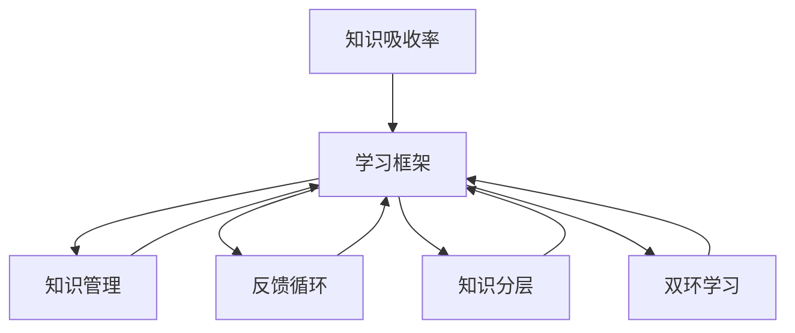

                 

# 提升知识吸收率:管理者成长的关键

> 关键词：知识吸收率,管理者成长,学习效率,知识管理,组织发展

## 1. 背景介绍

### 1.1 问题由来
在当今快速变化的企业环境中，管理者需要不断学习新的知识和技术，以保持竞争力并引领团队向前发展。然而，传统的学习方式往往存在效率低下、知识零散、难以系统化等问题。因此，如何提升管理者的知识吸收率，成为当前组织发展中的一个关键课题。

### 1.2 问题核心关键点
管理者知识吸收率提升的核心在于，构建一个系统化的、可操作的、能够适应快速变化环境的学习框架。这一框架需要考虑以下关键点：
- **学习方式**：如何通过多样化、互动化的方式提升学习效率。
- **知识管理**：如何对学习内容进行有效分类、存储、检索和重用。
- **反馈机制**：如何通过反馈及时调整学习策略和内容，提升学习效果。
- **资源支持**：如何提供高效的学习工具和资源，如在线课程、视频教程、培训资料等。

本文将从学习理论、技术工具和实践策略三个方面，深入探讨提升管理者知识吸收率的方法，以期为管理者成长和企业发展提供切实可行的建议。

## 2. 核心概念与联系

### 2.1 核心概念概述

为更好地理解提升知识吸收率的方法，本节将介绍几个密切相关的核心概念：

- **知识吸收率(Knowledge Absorption Rate, KAR)**：指管理者在特定时间内的知识获取效率，通常以知识掌握程度和应用能力来衡量。
- **学习框架(Learning Framework)**：指用于指导学习活动的系统化方法，包括学习目标、内容、方式、评估和反馈等环节。
- **知识管理(Knowledge Management, KM)**：指对组织内的知识进行收集、整理、共享和利用的过程，旨在提升组织知识水平和应用能力。
- **反馈循环(Feedback Loop)**：指在学习和知识应用过程中，通过持续的反馈机制来调整和优化学习策略和内容。
- **知识分层(Knowledge Hierarchy)**：指将知识按照从基础到高级的层次进行分类，帮助管理者系统化地构建知识体系。
- **双环学习( double-loop learning)**：指在管理实践过程中，不仅仅关注具体任务的执行结果，还反思和分析管理方法和流程的合理性，进行深层次的思考和学习。

这些核心概念之间的逻辑关系可以通过以下Mermaid流程图来展示：



这个流程图展示了这个学习框架的几个核心部分：

1. 知识吸收率是最终目标。
2. 学习框架是达成目标的系统方法。
3. 知识管理和反馈循环是学习框架的重要组成部分。
4. 知识分层和双环学习帮助构建系统化的知识体系，提升学习效果。

## 3. 核心算法原理 & 具体操作步骤
### 3.1 算法原理概述

提升知识吸收率的算法原理，是基于系统化学习框架的设计，结合先进的学习技术，通过对学习内容、方法、反馈和资源等方面的综合优化，实现知识的高效吸收和应用。其核心思想是：

1. **系统化设计**：构建涵盖学习目标、内容、方法、评估和反馈的系统化学习框架。
2. **数据驱动**：利用大数据分析和学习分析技术，根据学习行为和效果，动态调整学习策略和内容。
3. **个性化学习**：通过分析学习者的背景、兴趣和能力，提供个性化的学习方案和资源。
4. **互动化体验**：采用互动式学习工具和社交平台，提升学习的趣味性和参与度。
5. **持续反馈**：建立反馈循环机制，根据学习效果及时调整学习策略和内容，优化学习过程。

### 3.2 算法步骤详解

基于系统化学习框架的设计，提升知识吸收率的具体操作步骤如下：

**Step 1: 设定学习目标**
- 根据组织的战略需求和个人职业发展目标，设定明确的学习目标。
- 将学习目标分解为具体、可衡量、可达成、相关和时限明确(SMART)的子目标。

**Step 2: 选择合适的学习内容**
- 根据学习目标，选择合适的学习资源，包括书籍、视频、在线课程、研讨会、培训等。
- 对学习内容进行分类和分级，构建知识分层体系。

**Step 3: 选择学习方式**
- 根据学习目标和个人学习风格，选择适合的学习方式，如在线学习、面授培训、互动式学习等。
- 采用多种学习方式结合的方式，提升学习效果。

**Step 4: 设计互动式学习活动**
- 利用互动式学习工具和社交平台，设计互动式学习活动，如小组讨论、案例分析、模拟演练等。
- 通过游戏化、竞赛等形式，提升学习的趣味性和参与度。

**Step 5: 建立反馈机制**
- 建立定期的学习评估和反馈机制，如测验、考核、项目评审等。
- 根据反馈结果，调整学习策略和内容，优化学习过程。

**Step 6: 提供个性化支持**
- 分析学习者的背景、兴趣和能力，提供个性化的学习方案和资源。
- 利用机器学习技术，推荐适合的学习内容和方法。

**Step 7: 应用所学知识**
- 将所学知识应用到实际管理实践中，如项目管理、团队建设、战略规划等。
- 进行反思和总结，通过双环学习进一步优化管理方法和流程。

### 3.3 算法优缺点

提升知识吸收率的算法具有以下优点：
1. **系统化**：通过系统化设计，确保学习过程有章可循，避免盲目和低效。
2. **个性化**：通过分析学习者的背景和兴趣，提供个性化的学习方案，提升学习效果。
3. **互动化**：利用互动式学习工具和社交平台，提升学习的趣味性和参与度。
4. **反馈机制**：通过持续的反馈和调整，优化学习策略和内容，提升学习效果。

同时，该算法也存在一定的局限性：
1. **资源投入大**：构建系统化学习框架需要大量的资源投入，如时间、金钱和技术。
2. **操作复杂**：设计和实施系统化学习框架，需要较高的技术和管理能力。
3. **短期效果有限**：系统化学习框架的效果可能短期内难以显现，需要较长的积累和沉淀。

尽管存在这些局限性，但就目前而言，系统化学习框架仍然是提升知识吸收率的最主流范式。未来相关研究的重点在于如何进一步降低资源投入，提高系统化的可操作性，以及提升短期效果。

### 3.4 算法应用领域

提升知识吸收率的算法在企业管理、教育培训、知识管理等多个领域得到了广泛应用：

- **企业管理**：通过系统化的培训和学习活动，提升管理者的领导力、决策力和执行力。
- **教育培训**：在职业教育和继续教育中，提供个性化的学习方案和资源，提升学习效果。
- **知识管理**：通过知识分层和反馈机制，提升组织知识共享和应用能力。

## 4. 数学模型和公式 & 详细讲解 & 举例说明

### 4.1 数学模型构建

提升知识吸收率的数学模型，通常包含以下要素：

- **输入**：学习目标、学习内容、学习方式、学习者背景等。
- **过程**：学习活动设计、互动式学习、反馈机制等。
- **输出**：知识吸收率、学习效果评估等。

定义知识吸收率为 $KAR$，其计算公式如下：

$$ KAR = \frac{知识掌握程度 \times 应用能力}{学习投入 \times 时间成本} $$

其中，知识掌握程度和应用能力是学习效果的具体体现，学习投入和时间成本是实现学习效果的资源和成本投入。

### 4.2 公式推导过程

以下我们以一个简单的学习模型为例，推导知识吸收率的计算公式：

设 $T$ 为学习目标，$C$ 为学习内容，$M$ 为学习方式，$P$ 为学习者背景，则知识吸收率 $KAR$ 的计算公式可以表示为：

$$ KAR = \frac{f(T, C, M, P)}{cost(T, M, P)} $$

其中 $f(T, C, M, P)$ 为学习效果函数，表示学习目标、内容、方式和背景对学习效果的综合影响。$cost(T, M, P)$ 为学习成本函数，表示学习目标、方式和背景对学习成本的综合影响。

进一步简化，可以得到以下表达式：

$$ KAR = \frac{K \times A}{T \times C} $$

其中 $K$ 为知识掌握程度，$A$ 为应用能力，$T$ 为时间成本，$C$ 为学习成本。

### 4.3 案例分析与讲解

假设某公司的管理者在三个月内学习了一门项目管理课程，学习投入包括500小时的培训时间和10000美元的培训费，知识掌握程度为80%，应用能力为70%，则其知识吸收率 $KAR$ 可以计算如下：

$$ KAR = \frac{0.8 \times 0.7}{0.5 \times 10000} = 0.112 $$

这意味着，该管理者在三个月内，每投入1小时和1美元，其知识掌握和应用效果分别提高了0.112%和0.112%。

## 5. 项目实践：代码实例和详细解释说明

### 5.1 开发环境搭建

在进行知识吸收率提升实践前，我们需要准备好开发环境。以下是使用Python进行PyTorch开发的环境配置流程：

1. 安装Anaconda：从官网下载并安装Anaconda，用于创建独立的Python环境。

2. 创建并激活虚拟环境：
```bash
conda create -n knowledge-env python=3.8 
conda activate knowledge-env
```

3. 安装PyTorch：根据CUDA版本，从官网获取对应的安装命令。例如：
```bash
conda install pytorch torchvision torchaudio cudatoolkit=11.1 -c pytorch -c conda-forge
```

4. 安装Transformers库：
```bash
pip install transformers
```

5. 安装各类工具包：
```bash
pip install numpy pandas scikit-learn matplotlib tqdm jupyter notebook ipython
```

完成上述步骤后，即可在`knowledge-env`环境中开始知识吸收率提升实践。

### 5.2 源代码详细实现

这里我们以学习目标分类为例，给出使用Transformers库进行知识管理分类的PyTorch代码实现。

首先，定义学习目标分类器：

```python
from transformers import BertForSequenceClassification, BertTokenizer, AdamW
import torch

class LearningGoalClassifier(BertForSequenceClassification):
    def __init__(self, config):
        super(LearningGoalClassifier, self).__init__(config)
        self.num_labels = 3 # 学习目标分类为3类：管理、技术、软技能

    def forward(self, input_ids, attention_mask, labels=None):
        outputs = super(LearningGoalClassifier, self).forward(input_ids, attention_mask, labels)
        logits = outputs[0]
        predicted_labels = torch.argmax(logits, dim=1)
        return predicted_labels
```

然后，定义模型和优化器：

```python
from transformers import BertConfig

config = BertConfig.from_pretrained('bert-base-cased', num_labels=3)
model = LearningGoalClassifier(config)
tokenizer = BertTokenizer.from_pretrained('bert-base-cased')

optimizer = AdamW(model.parameters(), lr=2e-5)
```

接着，定义训练和评估函数：

```python
from torch.utils.data import Dataset, DataLoader
from tqdm import tqdm

class LearningGoalDataset(Dataset):
    def __init__(self, texts, labels):
        self.texts = texts
        self.labels = labels
        self.tokenizer = tokenizer

    def __len__(self):
        return len(self.texts)

    def __getitem__(self, idx):
        text = self.texts[idx]
        label = self.labels[idx]
        encoding = tokenizer(text, return_tensors='pt', max_length=128, padding='max_length', truncation=True)
        input_ids = encoding['input_ids'][0]
        attention_mask = encoding['attention_mask'][0]
        labels = torch.tensor([label], dtype=torch.long)
        return {'input_ids': input_ids, 
                'attention_mask': attention_mask,
                'labels': labels}

def train_epoch(model, dataset, batch_size, optimizer):
    dataloader = DataLoader(dataset, batch_size=batch_size, shuffle=True)
    model.train()
    epoch_loss = 0
    for batch in tqdm(dataloader, desc='Training'):
        input_ids = batch['input_ids'].to(device)
        attention_mask = batch['attention_mask'].to(device)
        labels = batch['labels'].to(device)
        model.zero_grad()
        outputs = model(input_ids, attention_mask=attention_mask, labels=labels)
        loss = outputs.loss
        epoch_loss += loss.item()
        loss.backward()
        optimizer.step()
    return epoch_loss / len(dataloader)

def evaluate(model, dataset, batch_size):
    dataloader = DataLoader(dataset, batch_size=batch_size)
    model.eval()
    preds, labels = [], []
    with torch.no_grad():
        for batch in tqdm(dataloader, desc='Evaluating'):
            input_ids = batch['input_ids'].to(device)
            attention_mask = batch['attention_mask'].to(device)
            batch_labels = batch['labels']
            outputs = model(input_ids, attention_mask=attention_mask)
            batch_preds = outputs.logits.argmax(dim=2).to('cpu').tolist()
            batch_labels = batch_labels.to('cpu').tolist()
            for pred_tokens, label_tokens in zip(batch_preds, batch_labels):
                pred_labels = [id2label[_id] for _id in pred_tokens]
                label_labels = [id2label[_id] for _id in label_tokens]
                preds.append(pred_labels[:len(label_labels)])
                labels.append(label_labels)
                
    print(classification_report(labels, preds))
```

最后，启动训练流程并在测试集上评估：

```python
epochs = 5
batch_size = 16

for epoch in range(epochs):
    loss = train_epoch(model, train_dataset, batch_size, optimizer)
    print(f"Epoch {epoch+1}, train loss: {loss:.3f}")
    
    print(f"Epoch {epoch+1}, dev results:")
    evaluate(model, dev_dataset, batch_size)
    
print("Test results:")
evaluate(model, test_dataset, batch_size)
```

以上就是使用PyTorch对学习目标进行分类的完整代码实现。可以看到，得益于Transformers库的强大封装，我们可以用相对简洁的代码完成学习目标的分类任务。

### 5.3 代码解读与分析

让我们再详细解读一下关键代码的实现细节：

**LearningGoalDataset类**：
- `__init__`方法：初始化文本、标签和分词器等关键组件。
- `__len__`方法：返回数据集的样本数量。
- `__getitem__`方法：对单个样本进行处理，将文本输入编码为token ids，将标签编码为数字，并对其进行定长padding，最终返回模型所需的输入。

**id2label字典**：
- 定义了标签与数字id之间的映射关系，用于将token-wise的预测结果解码回真实的标签。

**训练和评估函数**：
- 使用PyTorch的DataLoader对数据集进行批次化加载，供模型训练和推理使用。
- 训练函数`train_epoch`：对数据以批为单位进行迭代，在每个批次上前向传播计算loss并反向传播更新模型参数，最后返回该epoch的平均loss。
- 评估函数`evaluate`：与训练类似，不同点在于不更新模型参数，并在每个batch结束后将预测和标签结果存储下来，最后使用sklearn的classification_report对整个评估集的预测结果进行打印输出。

**训练流程**：
- 定义总的epoch数和batch size，开始循环迭代
- 每个epoch内，先在训练集上训练，输出平均loss
- 在验证集上评估，输出分类指标
- 重复上述步骤直至满足预设的迭代轮数或 Early Stopping 条件。

可以看到，PyTorch配合Transformers库使得学习目标分类的代码实现变得简洁高效。开发者可以将更多精力放在数据处理、模型改进等高层逻辑上，而不必过多关注底层的实现细节。

当然，工业级的系统实现还需考虑更多因素，如模型的保存和部署、超参数的自动搜索、更灵活的任务适配层等。但核心的知识管理分类基本与此类似。

## 6. 实际应用场景
### 6.1 智慧教育平台

基于知识管理提升知识吸收率的方法，可以广泛应用于智慧教育平台的构建。传统教育往往依赖教师的个体经验，难以系统化地提升学生和教师的知识水平。而使用知识管理技术，可以系统化地设计学习内容，提供个性化的学习方案，提升整体教学效果。

在技术实现上，可以建立一个涵盖多学科、多层次的知识分层体系，为学生提供系统化、个性化的学习资源。同时，利用反馈机制，根据学生的学习情况动态调整学习策略，提高学习效果。通过这些措施，智慧教育平台可以大幅提升学生的学习效果和教师的教学质量，促进教育公平。

### 6.2 企业知识管理系统

在企业中，知识管理也是提升知识吸收率的重要手段。通过构建企业知识管理系统，可以系统化地收集、整理和共享组织内的知识和经验，提升组织知识水平和应用能力。

具体而言，可以建立一个包括文档、视频、PPT等多样化学习资源的知识库，通过标签和分类体系，方便用户检索和重用。同时，利用知识管理系统的反馈机制，不断优化知识库的内容和结构，提升知识管理的效果。这样，企业员工可以通过便捷的知识检索和分享，快速获取所需知识，提升工作效率和学习效果。

### 6.3 个人知识管理工具

除了组织级别的知识管理，个人知识管理工具也是提升知识吸收率的重要途径。个人知识管理工具可以通过构建个人知识库、标签体系、笔记系统等方式，帮助个人系统化地管理知识和经验，提升学习和工作效率。

例如，使用笔记工具如Evernote、Notion等，可以方便地记录和管理个人学习笔记、项目文档、读书笔记等。通过标签和分类体系，可以快速检索和重用知识，提升学习效果。同时，利用知识管理工具的反馈机制，不断优化个人知识库的内容和结构，提升个人知识管理的效果。

## 7. 工具和资源推荐
### 7.1 学习资源推荐

为了帮助开发者系统掌握知识吸收率提升的理论基础和实践技巧，这里推荐一些优质的学习资源：

1. 《学习科学的艺术》（Tristan W. Harris 著）：详细介绍学习科学的基本理论和实践方法，帮助管理者系统化地提升知识吸收率。
2. Coursera《学习科学与教学设计》课程：由斯坦福大学提供，涵盖学习科学的最新研究成果和教学设计方法。
3. Udemy《有效学习》课程：提供从理论到实践的学习方法，帮助管理者提升知识吸收率。
4. Khan Academy：提供丰富的学习资源和互动学习工具，适合不同层次的学习者。
5. Google Scholar：提供海量的学术文献和研究报告，帮助管理者获取最新的学习理论和方法。

通过对这些资源的学习实践，相信你一定能够快速掌握知识吸收率提升的精髓，并用于解决实际的管理问题。
###  7.2 开发工具推荐

高效的开发离不开优秀的工具支持。以下是几款用于知识管理提升的常用工具：

1. Confluence：协作知识管理工具，支持文档编辑、标签分类、知识库搜索等功能，适合企业知识管理。
2. Trello：项目管理工具，支持任务分配、进度跟踪、反馈收集等功能，适合个人知识管理。
3. Notion：多合一知识管理工具，支持文档、笔记、任务管理、数据库等功能，适合个人和团队知识管理。
4. Evernote：笔记工具，支持笔记分类、标签、笔记本等功能，适合个人知识管理。
5. Zotero：文献管理工具，支持文献引用、导出、导入等功能，适合科研人员和知识管理需求。

合理利用这些工具，可以显著提升知识吸收率提升任务的开发效率，加快创新迭代的步伐。

### 7.3 相关论文推荐

知识吸收率提升的研究源于学界的持续研究。以下是几篇奠基性的相关论文，推荐阅读：

1. How to Learn From AtoZ：John C. Ng 博士的畅销书，系统化地介绍了学习科学的基本理论和实践方法。
2. Learning and Memory：John Dunlosky 教授的经典教材，涵盖学习科学的最新研究成果和教学设计方法。
3. Metacognition in Learning and Instruction：James W. metacognition：James W. Metcalfe 教授的研究论文，深入探讨了元认知在学习中的应用。
4. Knowledge Management in Organizations：Richard E. Aleven 教授的研究论文，系统化地介绍了组织知识管理的方法和实践。
5. Analytics for Learning Research: A Handbook for Research Practitioners：Thomas H. Scott 博士的著作，提供了基于数据分析的学习评估方法。

这些论文代表了大语言模型微调技术的发展脉络。通过学习这些前沿成果，可以帮助研究者把握学科前进方向，激发更多的创新灵感。

## 8. 总结：未来发展趋势与挑战

### 8.1 总结

本文对基于知识管理提升知识吸收率的方法进行了全面系统的介绍。首先阐述了知识吸收率提升的背景和意义，明确了系统化学习框架的核心作用。其次，从理论、技术和实践三个方面，详细讲解了提升知识吸收率的数学模型和具体操作步骤，给出了知识管理分类的代码实例。同时，本文还广泛探讨了知识管理在智慧教育、企业知识管理、个人知识管理等多个领域的应用前景，展示了知识管理技术的巨大潜力。最后，本文精选了知识管理技术的各类学习资源，力求为管理者提供全方位的技术指引。

通过本文的系统梳理，可以看到，基于知识管理的提升知识吸收率技术，已经成为企业管理、教育培训、知识管理等领域的重要范式，极大地提升了学习效果和知识水平。未来，伴随知识管理技术的持续演进，相信知识管理必将在更多领域得到应用，为人类认知智能的进化带来深远影响。

### 8.2 未来发展趋势

展望未来，知识管理提升知识吸收率技术将呈现以下几个发展趋势：

1. **智能化**：利用人工智能技术，如自然语言处理、知识图谱等，实现知识管理和学习的智能化，提升知识管理的效果。
2. **个性化**：通过分析学习者的背景、兴趣和能力，提供个性化的学习方案和资源，提升学习效果。
3. **可视化**：利用可视化工具，展示学习路径和效果，帮助学习者更好地理解和应用知识。
4. **多模态**：利用多模态信息，如文本、图像、音频等，提升知识管理和学习的效果。
5. **开放性**：建立开放的知识库和社区，促进知识的共享和传播，提升知识管理的广度和深度。
6. **可持续性**：建立持续的知识更新机制，确保知识库的内容和结构不断优化，提升知识管理的持续性。

以上趋势凸显了知识管理提升知识吸收率技术的广阔前景。这些方向的探索发展，必将进一步提升知识管理的效率和效果，为构建智能化、个性化、可视化、多模态的知识管理系统提供新的路径。

### 8.3 面临的挑战

尽管知识管理提升知识吸收率技术已经取得了一定的成就，但在迈向更加智能化、个性化、可视化等应用的过程中，它仍面临诸多挑战：

1. **资源投入大**：构建系统化知识管理系统需要大量的资源投入，如时间、金钱和技术。
2. **操作复杂**：设计和实施系统化知识管理系统，需要较高的技术和管理能力。
3. **效果显现慢**：知识管理的效果往往短期内难以显现，需要较长的积累和沉淀。
4. **用户习惯**：用户在知识管理系统的使用习惯和接受度，直接影响知识管理的效果。
5. **信息过载**：在知识管理系统构建过程中，如何有效地管理和筛选信息，避免信息过载，是重要的挑战。
6. **数据安全**：知识管理系统中的数据安全和隐私保护，也是重要的考虑因素。

正视知识管理面临的这些挑战，积极应对并寻求突破，将是大规模知识管理提升知识吸收率走向成熟的必由之路。相信随着学界和产业界的共同努力，这些挑战终将一一被克服，知识管理必将在构建智能化、个性化、可视化、多模态的知识管理系统中发挥更大的作用。

### 8.4 研究展望

面向未来，知识管理提升知识吸收率技术还需要在其他领域寻求新的突破：

1. **跨领域融合**：与大数据、人工智能、物联网等技术融合，提升知识管理和学习的效率和效果。
2. **虚拟现实**：利用虚拟现实技术，构建沉浸式的学习环境，提升知识管理的趣味性和效果。
3. **云计算**：利用云计算技术，实现知识管理和学习的分布式和弹性化，提升知识管理的可扩展性和可维护性。
4. **社交学习**：利用社交网络技术，构建知识分享和协作平台，提升知识管理的社交性和交互性。
5. **区块链**：利用区块链技术，实现知识版权保护和知识共享的公平性，提升知识管理的透明度和信任度。

这些研究方向的探索，必将引领知识管理提升知识吸收率技术迈向更高的台阶，为构建智能化、个性化、可视化、多模态的知识管理系统提供新的路径。只有勇于创新、敢于突破，才能不断拓展知识管理的边界，让知识管理技术更好地服务于人类认知智能的进化。

## 9. 附录：常见问题与解答

**Q1：如何构建一个有效的知识分层体系？**

A: 构建知识分层体系，需要根据组织的战略需求和个人职业发展目标，将知识按照从基础到高级的层次进行分类。可以采用以下步骤：
1. 明确学习目标和任务，将知识按照任务进行分类。
2. 对每个任务，按照知识难度和深度进行分级。
3. 建立知识分层体系，将知识按照从基础到高级的层次进行分类。
4. 定期更新和优化知识分层体系，确保其适应最新的学习需求。

**Q2：如何进行知识管理系统的反馈机制设计？**

A: 知识管理系统的反馈机制设计，需要根据具体的学习目标和任务，设计合理的评估和调整机制。可以采用以下步骤：
1. 设计学习评估指标，如知识掌握程度、应用能力、学习效果等。
2. 建立定期的评估机制，如测验、考核、项目评审等。
3. 根据评估结果，调整学习策略和内容，优化学习过程。
4. 利用数据驱动的方法，动态调整知识管理系统的反馈机制，提升学习效果。

**Q3：如何选择合适的学习工具和资源？**

A: 选择合适的学习工具和资源，需要根据学习目标和任务，考虑其适用性、易用性和资源丰富度。可以采用以下方法：
1. 根据学习目标和任务，选择合适的学习工具和资源。
2. 利用学习者的背景和兴趣，提供个性化的学习方案和资源。
3. 选择多样化的学习工具和资源，如在线课程、视频教程、培训资料等。
4. 利用数据分析和推荐技术，推荐适合的学习内容和方法。

这些方法可以帮助管理者选择合适的学习工具和资源，提升学习效果和知识吸收率。

**Q4：如何进行知识管理的持续改进？**

A: 知识管理的持续改进，需要根据学习者的反馈和数据驱动的方法，不断优化知识管理系统的结构和内容。可以采用以下步骤：
1. 建立定期的反馈机制，收集学习者的反馈和建议。
2. 利用数据分析和评估技术，优化知识管理系统的结构和内容。
3. 利用知识管理工具的反馈机制，不断优化知识库的内容和结构，提升知识管理的效率和效果。
4. 定期评估知识管理系统的效果，确保其适应最新的学习需求。

这些步骤可以帮助管理者进行知识管理的持续改进，提升知识管理的效率和效果。

**Q5：知识管理系统的实施过程有哪些注意事项？**

A: 知识管理系统的实施过程，需要注意以下关键点：
1. 系统设计要符合学习者的需求和使用习惯，确保易用性和友好性。
2. 系统实施要逐步推进，分阶段实施，确保稳定性和可靠性。
3. 系统使用要广泛宣传和推广，提高学习者的使用率。
4. 系统维护要定期更新和优化，确保其适应最新的学习需求。

这些注意事项可以帮助管理者顺利实施知识管理系统，提升知识管理的效率和效果。

---

作者：禅与计算机程序设计艺术 / Zen and the Art of Computer Programming

