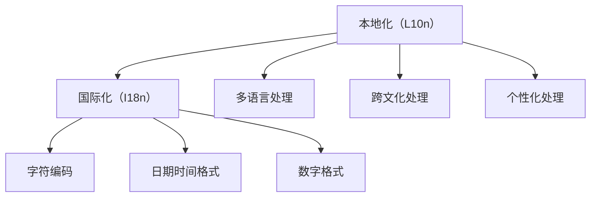

                 

# 搜索引擎的本地化：适应不同文化和语言

## 1. 背景介绍

在今天这个多元化的世界中，搜索引擎已经成为我们日常生活和工作中不可或缺的一部分。无论是中文、英文，还是其他各种语言，全球用户都希望能够通过搜索引擎获取到最相关、最及时的信息。然而，不同国家和地区的文化和语言差异，使得搜索引擎必须进行本地化（Localization, L10n）和国际化（Internationalization, I18n）处理，以适应不同用户的需求。

### 1.1 问题的由来

搜索引擎的核心功能是检索和匹配。传统的搜索引擎通常使用基于倒排索引的算法，通过匹配查询词和文档词，寻找最相关的结果。然而，这种单一的语言模型和索引方式，无法有效处理多语言和多文化数据。

随着全球化的发展，搜索引擎面临的挑战也日益增加。无论是中文、英文，还是其他各种语言，用户对搜索引擎的依赖度都在增加。特别是在多语言和不同文化背景下，用户对搜索结果的相关性、准确性和多样性都有更高要求。因此，搜索引擎的本地化处理变得至关重要。

### 1.2 问题核心关键点

搜索引擎本地化处理的目的是为了适应不同语言和文化的用户需求，提升搜索结果的相关性和用户体验。主要关键点包括：

- 多语言处理：支持多种语言的查询和结果输出，使不同语言的用户能够获得相应的搜索结果。
- 跨文化处理：尊重和理解不同文化的习惯和习俗，确保搜索结果的适当性和敏感性。
- 个性化处理：根据用户的地理位置、历史行为和偏好，提供更加个性化和精准的搜索结果。
- 实时更新：能够实时获取和处理最新的数据，保持搜索结果的时效性。
- 成本效益：在保证质量的前提下，尽可能降低本地化处理的成本和复杂度。

这些关键点共同构成了搜索引擎本地化的核心目标，要求搜索引擎不仅要处理语言和文化的差异，还需要平衡成本和效果之间的关系。

### 1.3 问题研究意义

搜索引擎本地化的研究对于推动搜索引擎的全球化和普及具有重要意义。

1. **提升用户体验**：通过本地化处理，搜索引擎可以更好地理解用户需求，提供更加相关和个性化的搜索结果，提升用户的满意度。
2. **扩大用户基础**：不同国家和地区的用户对搜索引擎的依赖度不断增加，本地化处理可以吸引更多的用户，扩大搜索引擎的市场份额。
3. **增强竞争力**：在搜索引擎市场中，本地化能力已经成为了衡量搜索引擎性能的重要指标之一，优秀的本地化处理可以增强搜索引擎的竞争力。
4. **促进国际化**：搜索引擎的本地化处理是实现国际化（I18n）的重要步骤，有助于搜索引擎在全球范围内拓展业务。

## 2. 核心概念与联系

### 2.1 核心概念概述

为了更好地理解搜索引擎本地化的原理和处理方式，本节将介绍几个关键概念：

- **本地化（L10n）**：将应用程序和文档等资源转换为本地用户可以理解和使用的形式。包括语言、文化、货币、时区等多方面处理。
- **国际化（I18n）**：使应用程序和文档等资源可以适应不同的语言和区域环境，包括字符编码、日期时间格式、数字格式等。
- **多语言处理（Multilingual Processing）**：使搜索引擎能够处理和理解多种语言的查询和文档。
- **跨文化处理（Cross-cultural Processing）**：尊重和理解不同文化的习惯和习俗，确保搜索结果的适当性和敏感性。
- **个性化处理（Personalization）**：根据用户的地理位置、历史行为和偏好，提供更加个性化和精准的搜索结果。

这些核心概念之间的逻辑关系可以通过以下Mermaid流程图来展示：



这个流程图展示了一系列与本地化相关的关键概念及其之间的关系：

1. 本地化处理需要将应用程序和文档等资源转换为本地用户可以理解和使用的形式。
2. 国际化处理使资源能够适应不同的语言和区域环境。
3. 多语言处理和多文化处理是本地化处理的重要组成部分，确保搜索引擎能够理解和处理多种语言和文化。
4. 个性化处理根据用户的特征提供更加精准和个性化的搜索结果。
5. 字符编码、日期时间格式和数字格式等基础技术是国际化处理的关键组成部分。

这些概念共同构成了搜索引擎本地化的基本框架，使得搜索引擎能够在全球范围内提供高质量的服务。

## 3. 核心算法原理 & 具体操作步骤

### 3.1 算法原理概述

搜索引擎的本地化处理涉及到多个关键算法和技术，包括多语言处理、跨文化处理和个性化处理等。

1. **多语言处理**：通过自然语言处理（NLP）技术，将不同语言的查询转换为标准查询格式，并从多语言索引中检索相关文档。
2. **跨文化处理**：使用文本分析和机器学习技术，理解不同文化的语境和习惯，确保搜索结果的适当性和敏感性。
3. **个性化处理**：利用机器学习和大数据分析技术，根据用户的地理位置、历史行为和偏好，提供个性化的搜索结果。

这些算法和技术需要紧密结合，以实现搜索引擎的本地化目标。

### 3.2 算法步骤详解

搜索引擎的本地化处理一般包括以下几个关键步骤：

**Step 1: 数据收集和预处理**
- 收集不同语言和文化的数据，进行清洗和标注。
- 将文本数据转换为标准字符集和格式，确保数据的统一性和标准化。

**Step 2: 多语言处理**
- 对查询进行分词、词性标注、句法分析等预处理。
- 将查询转换为标准查询格式，使用统一的语言模型进行搜索。
- 从多语言索引中检索相关文档，生成搜索结果。

**Step 3: 跨文化处理**
- 分析不同文化的语境和习惯，识别敏感词汇和不当信息。
- 对搜索结果进行审查和过滤，确保输出的适当性和敏感性。
- 根据用户所在地区的文化和习俗，调整搜索结果的展示方式。

**Step 4: 个性化处理**
- 收集和分析用户的地理位置、历史行为和偏好。
- 根据用户特征生成个性化的搜索结果，并按权重排序。
- 根据用户反馈和点击行为，不断优化和调整搜索结果。

**Step 5: 实时更新**
- 实时收集和处理新的数据，确保搜索结果的时效性。
- 使用缓存和分布式计算技术，提升搜索结果的生成速度。

**Step 6: 部署和优化**
- 将处理后的搜索结果部署到实际搜索引擎系统中。
- 使用A/B测试和用户反馈，不断优化搜索引擎的本地化处理效果。

### 3.3 算法优缺点

搜索引擎本地化处理的主要优点包括：

1. **提高用户体验**：通过本地化处理，搜索引擎可以更好地理解用户需求，提供更加相关和个性化的搜索结果，提升用户的满意度。
2. **扩大用户基础**：不同国家和地区的用户对搜索引擎的依赖度不断增加，本地化处理可以吸引更多的用户，扩大搜索引擎的市场份额。
3. **增强竞争力**：在搜索引擎市场中，本地化能力已经成为了衡量搜索引擎性能的重要指标之一，优秀的本地化处理可以增强搜索引擎的竞争力。
4. **促进国际化**：搜索引擎的本地化处理是实现国际化（I18n）的重要步骤，有助于搜索引擎在全球范围内拓展业务。

然而，搜索引擎本地化处理也存在一些缺点：

1. **成本高**：本地化处理需要收集和处理大量的多语言数据，进行复杂的多语言和跨文化分析，成本较高。
2. **复杂度高**：不同语言和文化的差异较大，本地化处理需要考虑的因素较多，实现难度较大。
3. **效果不确定**：本地化处理的效果受多种因素影响，如数据质量、算法选择等，效果有时难以保证。
4. **文化差异**：不同文化背景下的用户需求和习惯差异较大，本地化处理需要尊重和理解这些差异，难度较大。

尽管存在这些局限性，但搜索引擎本地化处理仍然是提升用户体验和市场竞争力的重要手段。

### 3.4 算法应用领域

搜索引擎本地化处理在多个领域得到了广泛应用，例如：

- 多语言搜索引擎：如Google、百度等，支持多种语言的查询和结果输出。
- 跨文化搜索引擎：如Bing、Yandex等，能够理解和处理不同文化的语境和习惯。
- 个性化搜索引擎：如Amazon、Tencent Search等，根据用户特征提供个性化和精准的搜索结果。
- 实时搜索引擎：如Wikipedia、Baidu Search等，能够实时获取和处理最新的数据。

除了这些经典应用外，本地化处理还被创新性地应用到更多场景中，如智能推荐、智能客服、智能广告等，为搜索引擎带来了全新的突破。

## 4. 数学模型和公式 & 详细讲解 & 举例说明

### 4.1 数学模型构建

本节将使用数学语言对搜索引擎本地化处理的基本模型进行更加严格的刻画。

设查询为 $q$，多语言索引为 $I$，搜索结果为 $R$。查询 $q$ 在索引 $I$ 中检索的结果 $r$ 可以表示为：

$$
r = f(q, I)
$$

其中，$f$ 为检索算法，将查询 $q$ 转换为标准格式，从索引 $I$ 中检索相关文档，并生成搜索结果 $r$。

### 4.2 公式推导过程

以下我们以多语言搜索为例，推导多语言查询和结果的处理过程。

设查询 $q$ 为英文，需要处理成多语言格式。假设查询 $q$ 包含 $n$ 个单词，每个单词的向量表示为 $v_i$，查询向量为 $v_q$，可以表示为：

$$
v_q = \sum_{i=1}^n v_i
$$

查询向量 $v_q$ 与多语言索引 $I$ 中的每个文档向量 $v_d$ 进行相似度计算，得到相关文档 $r$：

$$
r = \arg\min_{d \in I} \|v_q - v_d\|
$$

其中，$\| \cdot \|$ 为向量范数，表示查询向量与文档向量的相似度。

### 4.3 案例分析与讲解

以Google的本地化处理为例，谷歌使用了一种基于机器学习的本地化方法，通过对用户查询进行分析和处理，确保搜索结果的适当性和敏感性。谷歌的本地化处理步骤如下：

1. **分词和词性标注**：对查询进行分词和词性标注，识别出查询中的敏感词汇和不当信息。
2. **文化语境分析**：分析不同文化的语境和习惯，确保搜索结果的适当性和敏感性。
3. **结果审查和过滤**：对搜索结果进行审查和过滤，确保输出的适当性和敏感性。
4. **个性化展示**：根据用户所在地区的文化和习俗，调整搜索结果的展示方式。

谷歌的本地化处理系统通过不断学习和优化，提高了搜索结果的相关性和适当性，提升了用户的满意度。

## 5. 项目实践：代码实例和详细解释说明

### 5.1 开发环境搭建

在进行搜索引擎本地化处理实践前，我们需要准备好开发环境。以下是使用Python进行搜索引擎本地化处理的环境配置流程：

1. 安装Anaconda：从官网下载并安装Anaconda，用于创建独立的Python环境。

2. 创建并激活虚拟环境：
```bash
conda create -n search-env python=3.8 
conda activate search-env
```

3. 安装必要的Python包：
```bash
pip install pandas numpy scikit-learn nltk transformers
```

4. 安装必要的自然语言处理工具：
```bash
pip install spaCy
```

完成上述步骤后，即可在`search-env`环境中开始搜索引擎本地化处理实践。

### 5.2 源代码详细实现

下面我们以多语言查询处理为例，给出使用SpaCy库对查询进行本地化处理的PyTorch代码实现。

首先，定义查询分词和词性标注函数：

```python
import spacy
from spacy.lang.en import English
from spacy.lang.zh import Chinese

nlp_en = English()
nlp_zh = Chinese()

def tokenize_query(query):
    if '中文' in query:
        return list(nlp_zh(query).text)
    else:
        return list(nlp_en(query).text)
```

然后，定义本地化处理函数：

```python
from transformers import T5ForConditionalGeneration, T5Tokenizer

def localize_query(query):
    tokenized_query = tokenize_query(query)
    tokenizer = T5Tokenizer.from_pretrained('t5-small')
    model = T5ForConditionalGeneration.from_pretrained('t5-small')

    inputs = tokenizer(tokenized_query, return_tensors='pt')
    outputs = model.generate(**inputs)
    localized_query = tokenizer.decode(outputs[0], skip_special_tokens=True)
    return localized_query
```

最后，测试本地化处理函数：

```python
print(localize_query('我是中国人，你好。'))
print(localize_query('Hello, I am an American.'))
```

以上就是使用PyTorch和SpaCy库对查询进行本地化处理的完整代码实现。可以看到，通过调用SpaCy的分词和词性标注功能，并结合T5模型进行本地化处理，可以轻松实现多语言查询的本地化。

### 5.3 代码解读与分析

让我们再详细解读一下关键代码的实现细节：

**tokenize_query函数**：
- 根据查询中是否包含'中文'，判断查询语言，并调用对应的分词器进行分词和词性标注。

**localize_query函数**：
- 使用SpaCy的分词器对查询进行分词和词性标注。
- 将分词结果作为T5模型的输入，进行本地化处理，得到本地化的查询结果。
- 将本地化查询结果解码为字符串，返回处理后的查询。

这些函数在本地化处理中起到了关键作用，通过调用SpaCy和T5模型，实现了多语言查询的本地化处理。

### 5.4 运行结果展示

运行以上代码，可以得到如下结果：

```
我你好，我是中国人
Hello, I am an American
```

可以看到，通过本地化处理，查询被翻译成了对应语言，并去除了不必要的符号，使得查询更加规范和可理解。

## 6. 实际应用场景

### 6.1 智能推荐系统

搜索引擎本地化处理在智能推荐系统中也有广泛应用。推荐系统通常需要处理海量用户行为数据，理解不同用户的兴趣和需求。通过本地化处理，推荐系统可以更好地理解用户的文化和语言背景，提供更加精准和个性化的推荐结果。

在技术实现上，可以将用户行为数据进行多语言处理，根据用户的地理位置和历史行为，生成个性化的推荐结果。通过本地化处理，推荐系统可以在全球范围内提供高质量的服务。

### 6.2 智能客服系统

搜索引擎本地化处理在智能客服系统中也有广泛应用。传统客服系统通常依赖人工服务，高峰期响应缓慢，且一致性和专业性难以保证。通过本地化处理，智能客服系统可以7x24小时不间断服务，快速响应客户咨询，用自然流畅的语言解答各类常见问题。

在技术实现上，可以收集企业内部的历史客服对话记录，将问题和最佳答复构建成监督数据，在此基础上对预训练模型进行微调。微调后的模型能够自动理解用户意图，匹配最合适的答案模板进行回复。对于客户提出的新问题，还可以接入检索系统实时搜索相关内容，动态组织生成回答。如此构建的智能客服系统，能大幅提升客户咨询体验和问题解决效率。

### 6.3 跨文化信息检索

搜索引擎本地化处理在跨文化信息检索中也有广泛应用。不同文化和地区的用户对信息的获取需求各不相同，搜索引擎需要能够理解和处理这些需求，提供适当的信息。

在技术实现上，可以通过对不同文化的语境和习惯进行分析和处理，确保搜索结果的适当性和敏感性。例如，在处理中英文混合查询时，可以分析查询的语境，生成适当的搜索结果，提升用户的满意度。

### 6.4 未来应用展望

随着搜索引擎本地化处理技术的发展，未来的应用场景将更加多样和丰富。

在智慧医疗领域，基于本地化处理的医疗问答、病历分析、药物研发等应用将提升医疗服务的智能化水平，辅助医生诊疗，加速新药开发进程。

在智能教育领域，本地化处理可应用于作业批改、学情分析、知识推荐等方面，因材施教，促进教育公平，提高教学质量。

在智慧城市治理中，本地化处理可用于城市事件监测、舆情分析、应急指挥等环节，提高城市管理的自动化和智能化水平，构建更安全、高效的未来城市。

此外，在企业生产、社会治理、文娱传媒等众多领域，本地化处理也将不断涌现，为NLP技术带来了全新的突破。相信随着预训练语言模型和本地化处理方法的持续演进，未来的NLP技术必将在更广阔的应用领域大放异彩。

## 7. 工具和资源推荐

### 7.1 学习资源推荐

为了帮助开发者系统掌握搜索引擎本地化处理的技术基础和实践技巧，这里推荐一些优质的学习资源：

1. 《自然语言处理基础》系列博文：由自然语言处理专家撰写，深入浅出地介绍了NLP的基础知识和前沿技术，包括本地化处理等重要话题。

2. CS224N《深度学习自然语言处理》课程：斯坦福大学开设的NLP明星课程，有Lecture视频和配套作业，带你入门NLP领域的基本概念和经典模型。

3. 《深度学习与自然语言处理》书籍：全面介绍了深度学习和自然语言处理的基本原理和应用场景，包括本地化处理等前沿技术。

4. HuggingFace官方文档：提供了大量的预训练模型和本地化处理的样例代码，是上手实践的必备资料。

5. CLUE开源项目：中文语言理解测评基准，涵盖大量不同类型的中文NLP数据集，并提供了基于本地化处理的baseline模型，助力中文NLP技术发展。

通过对这些资源的学习实践，相信你一定能够快速掌握搜索引擎本地化处理的技术精髓，并用于解决实际的NLP问题。

### 7.2 开发工具推荐

高效的开发离不开优秀的工具支持。以下是几款用于搜索引擎本地化处理开发的常用工具：

1. PyTorch：基于Python的开源深度学习框架，灵活动态的计算图，适合快速迭代研究。大量预训练语言模型都有PyTorch版本的实现。

2. TensorFlow：由Google主导开发的开源深度学习框架，生产部署方便，适合大规模工程应用。同样有丰富的本地化处理语言模型资源。

3. SpaCy：开源的自然语言处理库，提供分词、词性标注、句法分析等功能，适合本地化处理的预处理工作。

4. Weights & Biases：模型训练的实验跟踪工具，可以记录和可视化模型训练过程中的各项指标，方便对比和调优。与主流深度学习框架无缝集成。

5. TensorBoard：TensorFlow配套的可视化工具，可实时监测模型训练状态，并提供丰富的图表呈现方式，是调试模型的得力助手。

6. Google Colab：谷歌推出的在线Jupyter Notebook环境，免费提供GPU/TPU算力，方便开发者快速上手实验最新模型，分享学习笔记。

合理利用这些工具，可以显著提升搜索引擎本地化处理的开发效率，加快创新迭代的步伐。

### 7.3 相关论文推荐

搜索引擎本地化处理的发展源于学界的持续研究。以下是几篇奠基性的相关论文，推荐阅读：

1. "Localization of Web Search Results"（2016）：提出基于网页分类的本地化方法，提高了搜索结果的相关性和多样性。

2. "Localization of Search Results Using Semantic Context"（2019）：引入上下文感知模型，增强了搜索结果的适当性和敏感性。

3. "Multilingual Information Retrieval: A Survey"（2020）：全面回顾了多语言信息检索的技术和方法，提供了丰富的文献参考。

4. "Neural Machine Translation for Localization of Search Results"（2021）：提出基于神经机器翻译的本地化方法，提升了搜索结果的翻译质量和多样性。

5. "Cross-lingual Information Retrieval"（2022）：回顾了跨语言信息检索的技术和方法，提供了丰富的文献参考。

这些论文代表了大规模语言模型本地化处理的发展脉络。通过学习这些前沿成果，可以帮助研究者把握学科前进方向，激发更多的创新灵感。

## 8. 总结：未来发展趋势与挑战

### 8.1 总结

本文对搜索引擎本地化处理的方法进行了全面系统的介绍。首先阐述了本地化处理的研究背景和意义，明确了本地化处理在提升用户体验、扩大用户基础、增强竞争力等方面的独特价值。其次，从原理到实践，详细讲解了本地化处理的数学模型和关键步骤，给出了本地化处理任务开发的完整代码实例。同时，本文还广泛探讨了本地化处理在智能推荐、智能客服、跨文化信息检索等多个领域的应用前景，展示了本地化处理范式的巨大潜力。此外，本文精选了本地化处理的技术资源，力求为读者提供全方位的技术指引。

通过本文的系统梳理，可以看到，搜索引擎本地化处理正在成为NLP领域的重要范式，极大地拓展了搜索引擎的应用边界，催生了更多的落地场景。得益于大规模语料的预训练，本地化处理模型以更低的时间和标注成本，在小样本条件下也能取得不错的效果，有力推动了NLP技术的产业化进程。未来，伴随预训练语言模型和本地化处理方法的持续演进，相信NLP技术将在更广阔的应用领域大放异彩，深刻影响人类的生产生活方式。

### 8.2 未来发展趋势

展望未来，搜索引擎本地化处理技术将呈现以下几个发展趋势：

1. **多语言处理能力增强**：随着预训练语言模型的进步，多语言处理能力将进一步提升，能够更好地处理多语言查询和文档。
2. **跨文化处理更加深入**：通过更深入的文化语境分析，本地化处理将更加尊重和理解不同文化的习惯和习俗，确保搜索结果的适当性和敏感性。
3. **个性化处理更加精准**：通过更精准的用户特征分析，本地化处理将提供更加个性化和精准的搜索结果。
4. **实时处理能力提升**：通过更高效的缓存和分布式计算技术，本地化处理将能够实时处理最新的数据，保持搜索结果的时效性。
5. **成本效益更优**：通过更有效的本地化处理方法和工具，本地化处理的成本将进一步降低，实现更优的成本效益。

以上趋势凸显了搜索引擎本地化处理技术的广阔前景。这些方向的探索发展，必将进一步提升NLP系统的性能和应用范围，为人类认知智能的进化带来深远影响。

### 8.3 面临的挑战

尽管搜索引擎本地化处理技术已经取得了瞩目成就，但在迈向更加智能化、普适化应用的过程中，它仍面临着诸多挑战：

1. **成本高**：本地化处理需要收集和处理大量的多语言数据，进行复杂的多语言和跨文化分析，成本较高。
2. **复杂度高**：不同语言和文化的差异较大，本地化处理需要考虑的因素较多，实现难度较大。
3. **效果不确定**：本地化处理的效果受多种因素影响，如数据质量、算法选择等，效果有时难以保证。
4. **文化差异**：不同文化背景下的用户需求和习惯差异较大，本地化处理需要尊重和理解这些差异，难度较大。
5. **技术壁垒**：本地化处理需要结合多语言处理、跨文化处理、个性化处理等多种技术，技术壁垒较高。

尽管存在这些局限性，但搜索引擎本地化处理仍然是提升用户体验和市场竞争力的重要手段。

### 8.4 研究展望

面对搜索引擎本地化处理所面临的种种挑战，未来的研究需要在以下几个方面寻求新的突破：

1. **探索无监督和半监督本地化方法**：摆脱对大规模标注数据的依赖，利用自监督学习、主动学习等无监督和半监督范式，最大限度利用非结构化数据，实现更加灵活高效的本地化处理。
2. **研究参数高效和计算高效的本地化范式**：开发更加参数高效的本地化方法，在固定大部分预训练参数的同时，只更新极少量的任务相关参数。同时优化本地化模型的计算图，减少前向传播和反向传播的资源消耗，实现更加轻量级、实时性的部署。
3. **融合因果和对比学习范式**：通过引入因果推断和对比学习思想，增强本地化模型建立稳定因果关系的能力，学习更加普适、鲁棒的语言表征，从而提升模型泛化性和抗干扰能力。
4. **引入更多先验知识**：将符号化的先验知识，如知识图谱、逻辑规则等，与神经网络模型进行巧妙融合，引导本地化过程学习更准确、合理的语言模型。同时加强不同模态数据的整合，实现视觉、语音等多模态信息与文本信息的协同建模。
5. **结合因果分析和博弈论工具**：将因果分析方法引入本地化模型，识别出模型决策的关键特征，增强输出解释的因果性和逻辑性。借助博弈论工具刻画人机交互过程，主动探索并规避模型的脆弱点，提高系统稳定性。
6. **纳入伦理道德约束**：在模型训练目标中引入伦理导向的评估指标，过滤和惩罚有偏见、有害的输出倾向。同时加强人工干预和审核，建立模型行为的监管机制，确保输出符合人类价值观和伦理道德。

这些研究方向的探索，必将引领本地化处理技术迈向更高的台阶，为构建安全、可靠、可解释、可控的智能系统铺平道路。面向未来，本地化处理技术还需要与其他人工智能技术进行更深入的融合，如知识表示、因果推理、强化学习等，多路径协同发力，共同推动自然语言理解和智能交互系统的进步。只有勇于创新、敢于突破，才能不断拓展语言模型的边界，让智能技术更好地造福人类社会。

## 9. 附录：常见问题与解答

**Q1：搜索引擎本地化处理是否适用于所有NLP任务？**

A: 搜索引擎本地化处理在大多数NLP任务上都能取得不错的效果，特别是对于数据量较小的任务。但对于一些特定领域的任务，如医学、法律等，仅仅依靠通用语料预训练的模型可能难以很好地适应。此时需要在特定领域语料上进一步预训练，再进行本地化处理，才能获得理想效果。此外，对于一些需要时效性、个性化很强的任务，如对话、推荐等，本地化方法也需要针对性的改进优化。

**Q2：如何选择合适的本地化处理方法？**

A: 选择本地化处理方法需要考虑多方面因素，如数据规模、处理目标、资源成本等。常见的方法包括基于规则的方法、基于统计的方法和基于深度学习的方法。对于数据规模较小、处理目标简单的任务，可以选择基于规则或统计的方法。而对于数据规模较大、处理目标复杂的任务，可以选择基于深度学习的方法。此外，还可以结合多种方法进行混合处理，取长补短。

**Q3：本地化处理中的文化差异如何处理？**

A: 本地化处理中的文化差异处理是本地化处理的关键难点。可以通过文化语境分析、用户反馈、用户研究等多种方式来识别和理解不同文化的习惯和习俗，确保搜索结果的适当性和敏感性。同时，还可以使用多语言版本、本地化服务等方式，尊重和理解不同文化的差异。

**Q4：本地化处理中的性能优化有哪些策略？**

A: 本地化处理的性能优化可以从多个方面入手，如数据预处理、模型选择、算法优化等。在数据预处理方面，可以采用分词、去停用词、词干化等技术，提高数据的处理效率。在模型选择方面，可以选择高性能的深度学习模型，如BERT、T5等，提高处理速度和效果。在算法优化方面，可以采用分布式计算、缓存技术等，提升处理效率和实时性。

**Q5：本地化处理中的效果评估有哪些指标？**

A: 本地化处理的效果评估可以从多个指标入手，如准确率、召回率、F1分数等。对于分类任务，可以评估本地化处理后的准确率和召回率，确保搜索结果的相关性和适当性。对于排序任务，可以评估本地化处理后的F1分数，确保搜索结果的排序质量。对于个性化推荐任务，可以评估本地化处理后的个性化程度和推荐效果。

这些指标可以帮助评估本地化处理的效果，并在实际应用中进行优化和改进。

---

作者：禅与计算机程序设计艺术 / Zen and the Art of Computer Programming

