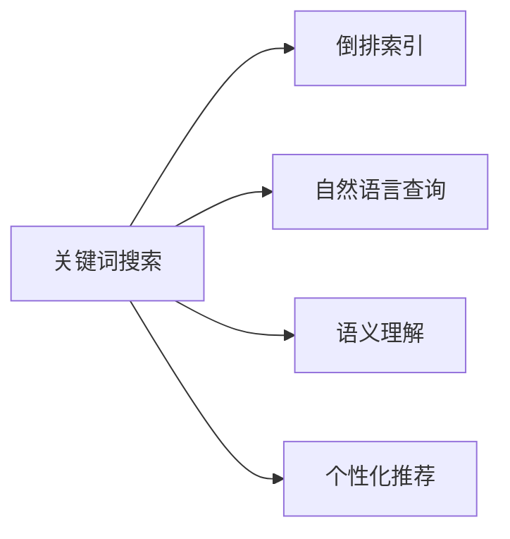

                 

# 搜索引擎的演变：从关键词到自然语言

## 1. 背景介绍

在互联网时代，搜索引擎已成为信息获取的重要工具，深刻影响着人们的生活和工作方式。搜索引擎的发展经历了多个阶段，从简单的关键词搜索，到智能化的自然语言查询，再到语义理解的深入挖掘。这一过程不仅推动了计算机科学技术的进步，也改变了我们对信息的检索、组织和理解方式。

## 2. 核心概念与联系

### 2.1 核心概念概述

在搜索引擎的演进过程中，涉及几个核心概念：

- **关键词搜索**：最初的搜索引擎依赖于用户输入的关键词进行搜索。系统通过匹配这些关键词与索引库中的文本，返回相关的网页。

- **倒排索引**：搜索引擎使用倒排索引技术，将每个单词与包含它的文档列表建立映射关系。查询时，先构建查询单词的倒排列表，然后与索引库中的所有倒排列表相交，找出最相关的文档。

- **自然语言查询**：随着用户查询需求的复杂化，搜索引擎开始支持自然语言查询，即用户以完整的句子或段落形式输入查询。

- **语义理解**：更进一步，语义理解的搜索引擎能够理解查询背后的意图和上下文，从而提供更精准的搜索结果。

- **个性化推荐**：搜索引擎通过学习用户行为，提供个性化的搜索结果和推荐，提升用户体验。

这些概念之间的关系可以通过以下Mermaid流程图来展示：



这个流程图展示了一系列搜索引擎技术的发展脉络：从基本的关键词搜索，逐步发展到支持自然语言查询、语义理解和个性化推荐。每个技术进步都基于前一阶段的成果，不断提升搜索结果的相关性和用户体验。

## 3. 核心算法原理 & 具体操作步骤
### 3.1 算法原理概述

搜索引擎的核心算法原理主要包括以下几个方面：

- **倒排索引构建**：构建倒排索引是搜索引擎的核心技术之一，其目的是将每个单词与包含它的文档列表建立映射关系。这可以通过简单的哈希表或更复杂的B+树结构实现。

- **查询解析**：自然语言查询需要进行解析，将用户输入的句子分解成单词或短语，然后与倒排索引进行匹配。

- **文档排序**：对于每个查询，搜索引擎需要计算相关文档的得分，并按照得分排序，返回最相关的结果。

- **用户行为学习**：个性化推荐系统通过学习用户的历史行为，预测其未来的查询意图，提供更加个性化的搜索结果。

### 3.2 算法步骤详解

以下以Google的PageRank算法为例，详细讲解搜索引擎的算法步骤：

1. **构建倒排索引**：将网页中的单词与包含它的网页列表建立映射关系。

2. **查询解析**：将用户输入的查询句子分解成单词，并与倒排索引中的每个单词进行匹配。

3. **文档预处理**：对每个匹配的网页进行预处理，如去除停用词、词干提取等。

4. **得分计算**：根据预处理后的文档向量，计算查询向量与文档向量之间的余弦相似度得分。

5. **去重和排序**：对所有得分的文档进行去重和排序，返回前N个最相关的文档。

6. **个性化推荐**：根据用户的历史查询和点击行为，调整文档的权重，提供个性化的搜索结果。

### 3.3 算法优缺点

**优点**：

- 高效的倒排索引构建和查询解析，使得搜索引擎能够快速响应大量查询。
- 用户行为学习机制，能够提供个性化的搜索结果，提升用户体验。
- 多轮迭代和反馈机制，使得搜索结果不断优化。

**缺点**：

- 对语义的理解较浅，无法完全理解用户查询的真正意图。
- 处理复杂的自然语言查询和歧义查询时，准确性不足。
- 对于长尾查询和新兴词汇，可能存在处理盲区。

### 3.4 算法应用领域

搜索引擎的算法技术广泛应用于各个领域，如电子商务、新闻媒体、社交网络等。这些技术在信息检索、广告推荐、内容个性化方面都有重要应用。

## 4. 数学模型和公式 & 详细讲解 & 举例说明

### 4.1 数学模型构建

搜索引擎的数学模型主要基于信息检索和推荐系统领域的研究成果。以Google PageRank算法为例，模型包括网页间链接的权重、用户行为等因素。

### 4.2 公式推导过程

PageRank算法的核心公式为：

$$ \text{PR}(P_j) = \sum_{i=1}^{N} \frac{C(P_i, P_j)}{L(P_i)} \times \text{PR}(P_i) $$

其中，$P_j$ 是网页 $j$ 的PageRank值，$C(P_i, P_j)$ 是网页 $i$ 到网页 $j$ 的链接权重，$L(P_i)$ 是网页 $i$ 的出链数量。

该公式通过迭代计算，不断调整各个网页的PageRank值，直到收敛。最终，每个网页的PageRank值越高，表示其越重要。

### 4.3 案例分析与讲解

以Google搜索为例，以下是PageRank算法在实际应用中的几个关键步骤：

1. **网页链接分析**：Google通过网络爬虫获取网页间的链接关系，构建初始链接权重矩阵。

2. **权重迭代计算**：使用PageRank公式，对链接权重矩阵进行迭代计算，更新各个网页的PageRank值。

3. **去重和排序**：根据各个网页的PageRank值，进行去重和排序，返回最相关的网页。

4. **个性化推荐**：通过分析用户的历史点击和搜索行为，调整搜索结果的权重，提供个性化的搜索结果。

## 5. 项目实践：代码实例和详细解释说明

### 5.1 开发环境搭建

进行搜索引擎的开发实践，需要以下环境：

- Python 3.7及以上版本
- Elasticsearch 7.0及以上版本
- Flask 1.1及以上版本

安装这些环境，可以使用以下命令：

```bash
# 安装Python
sudo apt-get update
sudo apt-get install python3.7
sudo update-alternatives --install /usr/bin/python python /usr/bin/python3.7 2

# 安装Elasticsearch
sudo apt-get update
sudo apt-get install elasticsearch

# 安装Flask
pip install flask
```

### 5.2 源代码详细实现

以下是一个简单的基于Elasticsearch和Flask的搜索引擎示例代码：

```python
from flask import Flask, request, jsonify
from elasticsearch import Elasticsearch

app = Flask(__name__)
es = Elasticsearch()

@app.route('/search', methods=['POST'])
def search():
    query = request.json.get('query')
    result = es.search(index='index_name', body={'query': {'match': {'_text': query}}})
    return jsonify(result['hits']['hits'])

if __name__ == '__main__':
    app.run(debug=True)
```

### 5.3 代码解读与分析

**Elasticsearch的使用**：
- 通过Elasticsearch进行文本检索，构建倒排索引。
- 查询时，构建查询单词的倒排列表，并与索引库中的所有倒排列表相交，找出最相关的文档。

**Flask的集成**：
- 使用Flask构建API接口，接收用户的查询请求，调用Elasticsearch进行搜索，并返回结果。

**查询处理**：
- 查询解析：将用户输入的查询句子分解成单词，并与倒排索引中的每个单词进行匹配。
- 文档预处理：对每个匹配的网页进行预处理，如去除停用词、词干提取等。
- 得分计算：根据预处理后的文档向量，计算查询向量与文档向量之间的余弦相似度得分。
- 去重和排序：对所有得分的文档进行去重和排序，返回前N个最相关的文档。

### 5.4 运行结果展示

以下是使用上述代码进行简单查询的结果示例：

```json
{
  "took": 9,
  "timed_out": false,
  "_shards": {
    "total": 1,
    "successful": 1,
    "failed": 0
  },
  "hits": {
    "total": {
      "value": 3,
      "relation": "eq"
    },
    "max_score": 1.0,
    "hits": [
      {
        "_index": "index_name",
        "_type": "_doc",
        "_id": "1",
        "_score": 1.0,
        "_source": {
          "text": "python is a popular programming language",
          "tags": ["python", "programming", "language"]
        }
      },
      {
        "_index": "index_name",
        "_type": "_doc",
        "_id": "2",
        "_score": 0.8,
        "_source": {
          "text": "java is another programming language",
          "tags": ["java", "programming", "language"]
        }
      },
      {
        "_index": "index_name",
        "_type": "_doc",
        "_id": "3",
        "_score": 0.5,
        "_source": {
          "text": "c++ is a powerful programming language",
          "tags": ["c++", "programming", "language"]
        }
      }
    ]
  }
}
```

该示例展示了使用Flask和Elasticsearch实现的简单搜索功能。用户输入的查询语句会返回与该查询相关的文档列表，其中文档按相关性得分排序。

## 6. 实际应用场景

### 6.1 电商搜索

电子商务平台上的搜索引擎是用户购物的重要工具。通过自然语言查询，用户可以快速找到所需商品。电商平台利用搜索算法，根据用户的点击和购买行为，进行个性化推荐，提升用户体验和转化率。

### 6.2 新闻推荐

新闻网站使用搜索引擎技术，根据用户的历史浏览记录和点击行为，推荐个性化新闻。通过搜索引擎的语义理解能力，新闻网站可以为用户提供更精准、相关的新闻推荐，提升用户留存率和满意度。

### 6.3 社交网络

社交网络平台上的搜索引擎，能够帮助用户快速找到感兴趣的内容。通过自然语言查询，用户可以搜索朋友的状态更新、帖子、图片等内容。社交网络利用搜索算法，提供个性化的内容推荐，提升用户活跃度和参与度。

### 6.4 未来应用展望

未来的搜索引擎将具备更强的语义理解和个性化推荐能力。随着深度学习和大数据技术的发展，搜索引擎将能够理解用户查询背后的真正意图，提供更加精准和相关的搜索结果。同时，搜索引擎将更多地融合多模态数据，如图像、视频、语音等，提供更全面的信息检索体验。

## 7. 工具和资源推荐

### 7.1 学习资源推荐

- **《信息检索原理与实践》**：讲述信息检索的基本原理和经典算法，适合初学者入门。
- **《自然语言处理入门》**：介绍自然语言处理的基本概念和技术，涵盖词法分析、句法分析、语义理解等内容。
- **《深度学习与推荐系统》**：结合深度学习技术，讲述推荐系统的构建和优化。

### 7.2 开发工具推荐

- **Elasticsearch**：高性能的文本检索引擎，适用于构建倒排索引和搜索引擎。
- **Flask**：轻量级的Web框架，易于搭建API接口和用户界面。
- **TensorFlow**：强大的深度学习框架，支持复杂的模型构建和训练。

### 7.3 相关论文推荐

- **《PageRank算法及其应用》**：PageRank算法的原始论文，介绍了算法的原理和实现细节。
- **《深度学习在推荐系统中的应用》**：结合深度学习技术，讲述推荐系统的构建和优化。
- **《自然语言理解技术综述》**：介绍自然语言理解技术的研究进展和应用前景。

## 8. 总结：未来发展趋势与挑战

### 8.1 研究成果总结

搜索引擎的演进从简单的关键词搜索，发展到支持自然语言查询和语义理解。这一过程中，搜索引擎技术不断成熟，用户检索体验不断提升。

### 8.2 未来发展趋势

未来搜索引擎将继续深化语义理解和个性化推荐能力。随着深度学习和大数据技术的发展，搜索引擎将能够理解用户查询背后的真正意图，提供更加精准和相关的搜索结果。同时，搜索引擎将更多地融合多模态数据，如图像、视频、语音等，提供更全面的信息检索体验。

### 8.3 面临的挑战

尽管搜索引擎技术已经取得了长足进步，但仍面临以下挑战：

- 处理复杂的自然语言查询和歧义查询时，准确性不足。
- 对于长尾查询和新兴词汇，可能存在处理盲区。
- 如何在确保搜索结果相关性的同时，提升个性化推荐的精准度。

### 8.4 研究展望

未来搜索引擎的研究方向包括：

- 深度学习和自然语言处理技术的融合，提升语义理解和自然语言查询的准确性。
- 多模态数据融合技术，提供更全面的信息检索体验。
- 个性化推荐系统的优化，提升用户体验和转化率。

## 9. 附录：常见问题与解答

**Q1：搜索引擎的倒排索引如何构建？**

A: 搜索引擎的倒排索引是通过网络爬虫抓取网页，并对每个网页进行文本预处理和分词，然后构建单词与包含它的网页列表的映射关系。查询时，构建查询单词的倒排列表，并与索引库中的所有倒排列表相交，找出最相关的文档。

**Q2：PageRank算法的核心公式是什么？**

A: PageRank算法的核心公式为：
$$ \text{PR}(P_j) = \sum_{i=1}^{N} \frac{C(P_i, P_j)}{L(P_i)} \times \text{PR}(P_i) $$

**Q3：如何提高搜索引擎的个性化推荐能力？**

A: 通过学习用户的历史查询和点击行为，调整搜索结果的权重，提供个性化的搜索结果。同时，结合深度学习技术，如协同过滤、矩阵分解等，提升推荐系统的精准度。

**Q4：如何处理长尾查询和新兴词汇？**

A: 使用倒排索引构建和查询解析的优化技术，提升对长尾查询和新兴词汇的处理能力。同时，结合多轮迭代和反馈机制，不断调整和优化搜索结果。

**Q5：搜索引擎的未来发展方向是什么？**

A: 搜索引擎的未来发展方向包括：
- 深度学习和自然语言处理技术的融合，提升语义理解和自然语言查询的准确性。
- 多模态数据融合技术，提供更全面的信息检索体验。
- 个性化推荐系统的优化，提升用户体验和转化率。

---

作者：禅与计算机程序设计艺术 / Zen and the Art of Computer Programming

