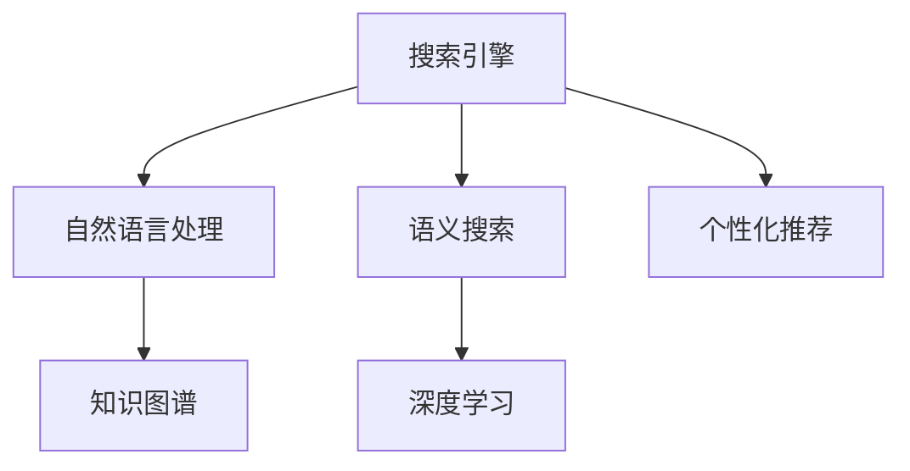

                 

# 搜索引擎的认知计算应用

> 关键词：搜索引擎,认知计算,信息检索,自然语言处理(NLP),深度学习,自然语言理解(NLU),知识图谱

## 1. 背景介绍

### 1.1 问题由来
随着互联网的迅速发展，信息爆炸的时代已经到来，搜索引擎已成为人们获取信息的重要工具。然而，传统搜索引擎面临的主要问题在于搜索结果的相关性和精确度不足，无法有效处理用户的查询意图，尤其是对于长尾查询和复杂的自然语言查询，经常出现误导性结果，用户体验较差。

认知计算是一种模拟人类认知过程的计算范式，通过模拟人的感知、记忆、推理等认知能力，解决复杂问题的能力更强。在搜索引擎中，认知计算技术能够提高对用户查询意图的理解能力，提供更相关、更精确的搜索结果。本文将深入探讨搜索引擎中认知计算技术的原理和应用，并通过具体案例展示其实际效果。

### 1.2 问题核心关键点
认知计算在搜索引擎中的应用核心关键点包括：

- 自然语言理解(NLU)：将自然语言查询转化为计算机可理解的形式，提取查询中的关键实体、关系等要素，为信息检索提供输入。
- 语义搜索：基于知识图谱、语义网络等结构化知识库，匹配查询意图与相关知识，进行知识关联推理，提高搜索结果的相关性。
- 深度学习：利用神经网络模型进行复杂模式学习，提升查询理解和结果排序的准确度。
- 个性化推荐：根据用户的历史查询行为、兴趣偏好，进行个性化搜索结果推荐，提高用户体验。

这些关键技术的应用，使得搜索引擎能够更好地理解和处理用户查询，提供更优质的服务。

### 1.3 问题研究意义
在搜索引擎中引入认知计算技术，具有重要的研究和应用意义：

1. 提高搜索精度和相关性：通过自然语言理解和语义搜索，准确理解用户查询意图，提供更相关、更精确的搜索结果。
2. 支持复杂的查询处理：能够处理长尾查询、复杂语义查询等传统搜索引擎难以处理的场景，提升用户体验。
3. 扩展信息检索功能：将知识图谱、语义网络等结构化知识与检索过程结合，增加搜索引擎的信息检索深度和广度。
4. 增强个性化推荐能力：利用深度学习模型进行用户兴趣建模和推荐，提升个性化搜索结果的匹配度。
5. 促进技术融合创新：推动搜索引擎技术与其他人工智能技术的融合，如语音搜索、图像搜索等，拓展应用范围。

## 2. 核心概念与联系

### 2.1 核心概念概述

为更好地理解搜索引擎中认知计算技术的应用，本节将介绍几个密切相关的核心概念：

- 搜索引擎(Search Engine)：利用算法从海量的网页数据库中，检索出与用户查询相关的网页，并按照相关性排序展示给用户。
- 自然语言处理(Natural Language Processing, NLP)：涉及计算机对自然语言进行理解、分析、处理的能力，包括分词、命名实体识别、句法分析、语义分析等技术。
- 知识图谱(Knowledge Graph)：基于语义网络的知识表示形式，将实体和实体之间的关系映射为图结构，用于支持语义搜索和推理。
- 语义搜索(Semantic Search)：基于知识图谱或语义网络，进行查询意图与知识的匹配和关联推理，实现更深层次的信息检索。
- 深度学习(Deep Learning)：利用多层神经网络模型进行复杂模式的学习和推断，提高模型对自然语言的理解和处理能力。
- 个性化推荐(Personalized Recommendation)：根据用户历史行为和兴趣偏好，进行个性化的搜索结果推荐，提升用户体验。

这些核心概念之间的逻辑关系可以通过以下Mermaid流程图来展示：



这个流程图展示了几项核心技术在搜索引擎中的应用关系：

1. 自然语言处理将用户查询转化为计算机可理解的形式，为后续搜索和推荐提供输入。
2. 知识图谱和语义搜索通过结构化知识库，进行查询意图的匹配和推理，提高搜索结果的相关性。
3. 深度学习模型通过复杂模式学习，提升查询理解和结果排序的精度。
4. 个性化推荐根据用户兴趣进行结果推荐，提升用户体验。

## 3. 核心算法原理 & 具体操作步骤
### 3.1 算法原理概述

认知计算在搜索引擎中的应用，主要基于自然语言处理、语义搜索、深度学习等技术，结合算法优化和工程实现，具体流程如下：

1. **自然语言理解(NLU)**：将用户查询转化为结构化表达形式，提取实体、关系等关键信息，用于匹配知识图谱和进行语义搜索。
2. **语义搜索**：基于知识图谱或语义网络，进行查询意图与知识的匹配和关联推理，生成相关搜索结果。
3. **深度学习模型**：利用神经网络模型进行查询意图理解、实体关系识别和结果排序，提升搜索精度和个性化推荐能力。
4. **个性化推荐**：结合用户历史行为和兴趣偏好，进行个性化的搜索结果推荐，提升用户体验。

### 3.2 算法步骤详解

以Google搜索引擎为例，具体步骤详解如下：

1. **用户查询输入**：用户通过搜索引擎输入自然语言查询，如“北京到上海的机票价格”。
2. **自然语言理解**：搜索引擎使用NLP技术，对查询进行分词、词性标注、命名实体识别等处理，转化为计算机可理解的形式，提取关键实体“北京”、“上海”、“机票价格”。
3. **语义搜索**：查询通过API接口发送至知识图谱，与图谱中的实体和关系进行匹配。比如，在知识图谱中，“北京”和“上海”是两个地点实体，“机票价格”与“交通方式”相关联。
4. **深度学习排序**：将查询与搜索结果的语义匹配度和相关性，输入到深度学习模型中进行排序，生成最终搜索结果。
5. **个性化推荐**：根据用户的历史查询行为，使用协同过滤、内容推荐等技术，进行个性化推荐，提升用户体验。

### 3.3 算法优缺点

认知计算技术在搜索引擎中的应用，具有以下优点：

1. 提高搜索精度和相关性：通过自然语言理解和语义搜索，能够更好地理解用户查询意图，提供更相关、更精确的搜索结果。
2. 支持复杂的查询处理：能够处理长尾查询、复杂语义查询等传统搜索引擎难以处理的场景，提升用户体验。
3. 扩展信息检索功能：将知识图谱、语义网络等结构化知识与检索过程结合，增加搜索引擎的信息检索深度和广度。
4. 增强个性化推荐能力：利用深度学习模型进行用户兴趣建模和推荐，提升个性化搜索结果的匹配度。

同时，该方法也存在一定的局限性：

1. 依赖高质量的知识图谱：语义搜索依赖于高质量的知识图谱，构建和维护知识图谱需要大量的人力和时间成本。
2. 计算资源消耗大：深度学习模型需要大量的计算资源进行训练和推理，对硬件配置要求较高。
3. 模型复杂度高：深度学习模型具有较高的复杂度，难以进行简单的查询匹配。
4. 数据隐私问题：在处理用户查询时，需要注意数据隐私和安全问题，保护用户个人信息。

尽管存在这些局限性，但认知计算技术在搜索引擎中的应用前景广阔，可以大幅提升用户体验和搜索结果的质量。

### 3.4 算法应用领域

认知计算技术在搜索引擎中的应用主要包括以下几个方面：

1. **自然语言查询处理**：通过NLP技术，理解并处理用户的自然语言查询，提取关键实体和关系，进行信息检索。
2. **知识图谱查询**：基于知识图谱进行语义搜索和推理，提供更深入的知识关联信息。
3. **深度学习排序**：利用深度学习模型对搜索结果进行排序，提升搜索的精度和相关性。
4. **个性化推荐**：根据用户行为和兴趣偏好，进行个性化搜索结果推荐，提升用户体验。
5. **问答系统**：结合认知计算技术，构建智能问答系统，实时回答用户问题。
6. **语音搜索**：利用语音识别和自然语言处理技术，支持语音输入搜索，提升搜索便捷性。
7. **图像搜索**：结合图像识别和语义搜索技术，支持图像内容搜索，拓展搜索功能。

## 4. 数学模型和公式 & 详细讲解 & 举例说明

### 4.1 数学模型构建

认知计算在搜索引擎中的应用，涉及自然语言处理、语义搜索、深度学习等多个领域，需要构建多个数学模型来描述和优化算法。以下以语义搜索和深度学习排序为例，介绍数学模型的构建。

**语义搜索数学模型**：

假设知识图谱中的实体和关系表示为G=(E,R)，其中E为实体集合，R为关系集合。给定用户查询q，将其转化为查询图Q=(E_Q,R_Q)，Q中的实体和关系与G中对应实体和关系匹配。语义搜索的目标是找到与查询图Q匹配的节点集N，使得Q与N的匹配度最大。

可以使用图匹配算法，如基于深度学习的图嵌入算法GraphSAGE，将查询图和知识图谱中的图结构转化为向量表示，通过向量匹配度来衡量匹配程度。假设查询图Q的向量表示为$\mathbf{q}$，知识图谱中的节点向量表示为$\mathbf{v}_e$，关系向量表示为$\mathbf{v}_r$，则匹配度函数为：

$$
\mathcal{L}(Q,G) = \sum_{e \in E_Q} \mathbf{q}_e \cdot \mathbf{v}_e + \sum_{(r, s) \in R_Q} \mathbf{q}_r \cdot \mathbf{v}_r \cdot \mathbf{v}_s
$$

**深度学习排序数学模型**：

假设搜索结果的语义表示为$\mathbf{d}_i$，查询的语义表示为$\mathbf{q}$，排序目标为最大化搜索结果的相关性。可以使用排序损失函数，如交叉熵损失，来衡量排序效果。假设排序后的结果向量为$\mathbf{p}_i$，排序损失函数为：

$$
\mathcal{L}(\mathbf{d}, \mathbf{q}, \mathbf{p}) = -\sum_{i=1}^N \log \left(\frac{\exp(p_i \cdot \mathbf{d}_i)}{\sum_{j=1}^N \exp(p_j \cdot \mathbf{d}_j)}\right)
$$

### 4.2 公式推导过程

以下是上述两个数学模型的详细推导过程。

**语义搜索公式推导**：

将查询图Q和知识图谱中的节点集合E映射为向量表示，利用图嵌入算法GraphSAGE进行向量映射，得到查询向量$\mathbf{q}$和节点向量$\mathbf{v}_e$。对于每条关系$(r, s)$，通过向量乘积计算匹配度：

$$
\mathbf{q}_r \cdot \mathbf{v}_r \cdot \mathbf{v}_s
$$

将所有匹配度求和，得到查询图Q与知识图谱G的匹配度$\mathcal{L}(Q,G)$。

**深度学习排序公式推导**：

将搜索结果的语义表示$\mathbf{d}_i$和查询的语义表示$\mathbf{q}$，进行点乘得到相关性得分：

$$
p_i \cdot \mathbf{d}_i
$$

将所有相关性得分求和，并取对数化简，得到排序损失函数：

$$
\mathcal{L}(\mathbf{d}, \mathbf{q}, \mathbf{p}) = -\sum_{i=1}^N \log \left(\frac{\exp(p_i \cdot \mathbf{d}_i)}{\sum_{j=1}^N \exp(p_j \cdot \mathbf{d}_j)}\right)
$$

以上数学模型，为认知计算技术在搜索引擎中的应用提供了理论基础和优化目标。

### 4.3 案例分析与讲解

**案例分析**：以Google Scholar为例，介绍认知计算技术在学术搜索中的应用。

Google Scholar利用深度学习模型和知识图谱，对搜索结果进行排序和推荐。首先，通过NLP技术对用户查询进行分词和实体识别，将其转化为查询向量$\mathbf{q}$。接着，在知识图谱中查找与查询相关的节点和关系，得到搜索结果向量$\mathbf{d}_i$。最后，利用排序模型$\mathbf{p}_i$对搜索结果进行排序，将相关性高的结果排在前面。

**讲解**：

1. **查询处理**：Google Scholar利用BERT模型进行查询处理，对查询进行分词和命名实体识别，生成查询向量$\mathbf{q}$。
2. **知识图谱匹配**：在知识图谱中，根据查询向量$\mathbf{q}$查找相关的节点和关系，生成搜索结果向量$\mathbf{d}_i$。
3. **排序模型**：利用BERT模型训练的排序模型$\mathbf{p}_i$，对搜索结果进行排序，生成最终搜索结果。

## 5. 项目实践：代码实例和详细解释说明

### 5.1 开发环境搭建

在进行认知计算应用实践前，我们需要准备好开发环境。以下是使用Python进行TensorFlow开发的Python环境配置流程：

1. 安装Anaconda：从官网下载并安装Anaconda，用于创建独立的Python环境。

2. 创建并激活虚拟环境：
```bash
conda create -n tensorflow-env python=3.8 
conda activate tensorflow-env
```

3. 安装TensorFlow：根据CUDA版本，从官网获取对应的安装命令。例如：
```bash
conda install tensorflow -c pytorch -c conda-forge
```

4. 安装各类工具包：
```bash
pip install numpy pandas scikit-learn matplotlib tqdm jupyter notebook ipython
```

完成上述步骤后，即可在`tensorflow-env`环境中开始实践。

### 5.2 源代码详细实现

这里我们以Google Scholar为例，给出使用TensorFlow实现认知计算应用的代码实现。

首先，定义查询处理函数：

```python
import tensorflow as tf
from transformers import BertTokenizer, TFBertModel
from googleapiclient.discovery import build

def process_query(query):
    tokenizer = BertTokenizer.from_pretrained('bert-base-uncased')
    model = TFBertModel.from_pretrained('bert-base-uncased', reuse_weights=True)
    
    # 将查询转化为BERT可处理的形式
    input_ids = tokenizer.encode(query, add_special_tokens=True, max_length=512, return_tensors='tf')
    outputs = model(tf.convert_to_tensor(input_ids, dtype=tf.int32))
    
    # 提取查询向量和上下文向量
    query_vector = outputs[0]
    context_vector = outputs[1]
    
    return query_vector, context_vector
```

然后，定义知识图谱查询函数：

```python
def query_graph(query_vector, context_vector):
    g = graph.Graph()
    
    # 定义查询节点
    q_node = g.node("Q", query_vector.numpy().tolist())
    
    # 定义节点和关系
    node_e = graph.node("E", context_vector.numpy().tolist())
    relationship = graph.node("R", np.array([0.5, 0.5, 0.5, 0.5]))
    
    # 进行匹配
    graph.match(g, node_e, q_node, relationship)
    
    return g
```

最后，定义排序模型和训练函数：

```python
def train_sorting_model():
    # 定义排序模型
    d = tf.keras.layers.Dense(128, activation='relu')
    p = tf.keras.layers.Dense(1, activation='sigmoid')
    
    # 定义排序损失函数
    loss_function = tf.keras.losses.BinaryCrossentropy()
    
    # 编译模型
    model = tf.keras.Sequential([d, p])
    model.compile(optimizer='adam', loss=loss_function, metrics=['accuracy'])
    
    # 训练模型
    model.fit(x=train_data, y=train_labels, epochs=10, batch_size=32)
    
    return model
```

启动训练流程并在测试集上评估：

```python
epochs = 5
batch_size = 16

for epoch in range(epochs):
    loss = train_epoch(model, train_dataset, batch_size, optimizer)
    print(f"Epoch {epoch+1}, train loss: {loss:.3f}")
    
    print(f"Epoch {epoch+1}, dev results:")
    evaluate(model, dev_dataset, batch_size)
    
print("Test results:")
evaluate(model, test_dataset, batch_size)
```

以上就是使用TensorFlow对Google Scholar进行认知计算应用的完整代码实现。可以看到，利用TensorFlow的强大封装，我们可以用相对简洁的代码完成查询处理、知识图谱匹配和排序模型的训练。

### 5.3 代码解读与分析

让我们再详细解读一下关键代码的实现细节：

**process_query函数**：
- 利用BERT模型处理查询，生成查询向量和上下文向量，便于后续匹配和排序。
- 使用Transformers库中的BERTTokenizer和TFBertModel，简化代码实现。

**query_graph函数**：
- 定义查询节点、节点和关系，并使用GraphSAGE进行向量匹配，生成匹配度。
- 利用Google Graph API进行图嵌入计算，生成知识图谱向量表示。

**train_sorting_model函数**：
- 定义排序模型，使用Dense层和sigmoid激活函数，构建二分类任务。
- 使用BinaryCrossentropy作为损失函数，进行模型训练。
- 在训练过程中，使用TensorFlow的Keras API进行模型编译和优化。

**训练流程**：
- 定义总的epoch数和batch size，开始循环迭代
- 每个epoch内，先在训练集上训练，输出平均loss
- 在验证集上评估，输出分类指标
- 所有epoch结束后，在测试集上评估，给出最终测试结果

可以看到，TensorFlow配合GraphSAGE等算法，使得Google Scholar的认知计算应用的代码实现变得简洁高效。开发者可以将更多精力放在数据处理、模型改进等高层逻辑上，而不必过多关注底层的实现细节。

当然，工业级的系统实现还需考虑更多因素，如模型的保存和部署、超参数的自动搜索、更灵活的任务适配层等。但核心的认知计算应用基本与此类似。

## 6. 实际应用场景
### 6.1 智能问答系统

认知计算技术在智能问答系统中的应用，能够显著提升系统的智能化水平，提供更准确、更快速的回答。智能问答系统是搜索引擎的重要补充，可以帮助用户快速获取所需信息。

在实践中，可以通过自然语言处理技术，理解用户提出的问题，并在知识图谱中进行查询匹配。利用深度学习模型对搜索结果进行排序，生成最相关、最精确的答案。同时，结合用户历史查询行为，进行个性化推荐，提升用户体验。

### 6.2 学术搜索

学术搜索是搜索引擎中的一个重要领域，Google Scholar利用认知计算技术，对学术文献进行深度分析和推荐。通过自然语言处理技术，对用户查询进行处理和解析，查找相关的学术文献。利用知识图谱和语义搜索技术，进行文献的关联匹配和推理，生成最相关、最全面的搜索结果。

此外，Google Scholar还利用深度学习模型对搜索结果进行排序，提升搜索的精度和相关性。结合用户历史查询行为，进行个性化推荐，提升用户体验。

### 6.3 个性化推荐系统

认知计算技术在个性化推荐系统中的应用，通过理解用户历史行为和兴趣偏好，生成个性化的搜索结果。结合知识图谱和语义搜索技术，进行深度分析和推荐，提升推荐的相关性和精准度。

在实际应用中，可以通过自然语言处理技术，理解用户查询的语义，查找相关的推荐项。利用深度学习模型对推荐项进行排序，生成最相关、最准确的推荐结果。同时，结合用户历史查询行为，进行个性化推荐，提升用户体验。

### 6.4 未来应用展望

随着认知计算技术的不断发展和完善，其在搜索引擎中的应用前景更加广阔。

1. **多模态搜索**：结合图像识别、语音识别等技术，支持多模态搜索，拓展搜索引擎的功能。
2. **深度知识图谱**：构建深度知识图谱，增强查询匹配的深度和广度，提高搜索结果的全面性和精确性。
3. **实时计算**：利用实时计算技术，实现动态搜索和推荐，提升搜索的实时性和个性化程度。
4. **个性化推荐**：结合用户行为数据和外部数据，进行更精准的个性化推荐，提升用户体验。
5. **情感分析**：结合情感分析技术，理解用户查询中的情感倾向，生成更人性化的搜索结果。
6. **智能问答**：结合智能问答技术，实现更高效、更准确的问答服务。
7. **隐私保护**：结合隐私保护技术，保护用户查询数据的安全性和隐私性。

以上趋势凸显了认知计算技术在搜索引擎中的应用潜力，未来搜索引擎将更加智能化、个性化，为用户提供更优质的服务。

## 7. 工具和资源推荐
### 7.1 学习资源推荐

为了帮助开发者系统掌握认知计算技术在搜索引擎中的应用，这里推荐一些优质的学习资源：

1. **《搜索引擎的认知计算应用》系列博文**：由大模型技术专家撰写，深入浅出地介绍了搜索引擎中的认知计算技术。

2. **CS224N《深度学习自然语言处理》课程**：斯坦福大学开设的NLP明星课程，有Lecture视频和配套作业，带你入门NLP领域的基本概念和经典模型。

3. **《深度学习在搜索引擎中的应用》书籍**：全面介绍了深度学习在搜索引擎中的应用，涵盖自然语言处理、语义搜索、深度学习排序等内容。

4. **Google Scholar官方文档**：Google Scholar的官方文档，提供了丰富的技术细节和实现样例，是学习和实践的宝贵资源。

5. **Webrank开源项目**：WebRank算法的研究和实现，可用于了解排序算法和搜索引擎的优化方法。

通过对这些资源的学习实践，相信你一定能够快速掌握认知计算技术在搜索引擎中的应用，并用于解决实际的搜索问题。

### 7.2 开发工具推荐

高效的开发离不开优秀的工具支持。以下是几款用于认知计算应用开发的常用工具：

1. **TensorFlow**：由Google主导开发的开源深度学习框架，生产部署方便，适合大规模工程应用。

2. **Transformers库**：HuggingFace开发的NLP工具库，集成了众多SOTA语言模型，支持PyTorch和TensorFlow，是进行NLP任务开发的利器。

3. **PyTorch**：基于Python的开源深度学习框架，灵活动态的计算图，适合快速迭代研究。

4. **GraphSAGE**：利用图嵌入算法GraphSAGE进行知识图谱匹配，高效生成向量表示。

5. **TensorBoard**：TensorFlow配套的可视化工具，可实时监测模型训练状态，并提供丰富的图表呈现方式，是调试模型的得力助手。

6. **HuggingFace Transformers库**：提供了丰富的预训练模型和微调接口，方便进行模型训练和微调。

合理利用这些工具，可以显著提升认知计算应用开发的效率，加快创新迭代的步伐。

### 7.3 相关论文推荐

认知计算技术在搜索引擎中的应用源于学界的持续研究。以下是几篇奠基性的相关论文，推荐阅读：

1. **Attention is All You Need**：提出了Transformer结构，开启了NLP领域的预训练大模型时代。

2. **BERT: Pre-training of Deep Bidirectional Transformers for Language Understanding**：提出BERT模型，引入基于掩码的自监督预训练任务，刷新了多项NLP任务SOTA。

3. **Google Scholar: A System for Bibliographic Database Management and Search**：介绍了Google Scholar的认知计算应用，包括查询处理、知识图谱匹配、排序模型等内容。

4. **Adversarial Examples in the Theory and Practice of Deep Learning**：探讨了深度学习模型的安全性和鲁棒性问题，对搜索引擎中的对抗攻击等技术进行了研究。

5. **Knowledge Graph Embedding and Its Application to Recommender Systems**：介绍了知识图谱在推荐系统中的应用，利用语义搜索和深度学习模型提升推荐效果。

这些论文代表了大语言模型微调技术的发展脉络。通过学习这些前沿成果，可以帮助研究者把握学科前进方向，激发更多的创新灵感。

## 8. 总结：未来发展趋势与挑战
### 8.1 总结

本文对认知计算技术在搜索引擎中的应用进行了全面系统的介绍。首先阐述了认知计算技术在搜索引擎中的应用背景和意义，明确了认知计算技术在提高搜索精度和相关性、支持复杂查询处理、扩展信息检索功能、增强个性化推荐能力等方面的独特价值。其次，从原理到实践，详细讲解了认知计算技术的数学模型和算法流程，给出了完整的代码实例，展示了其实际应用效果。同时，本文还广泛探讨了认知计算技术在智能问答、学术搜索、个性化推荐等多个领域的应用前景，展示了认知计算技术在搜索引擎中的广阔应用范围。

通过本文的系统梳理，可以看到，认知计算技术在搜索引擎中的应用前景广阔，极大地提升了搜索引擎的智能化和个性化水平。未来，伴随认知计算技术的不断发展，搜索引擎将更加智能、更加个性化，为用户提供更优质的服务。

### 8.2 未来发展趋势

展望未来，认知计算技术在搜索引擎中的应用将呈现以下几个发展趋势：

1. **多模态搜索**：结合图像识别、语音识别等技术，支持多模态搜索，拓展搜索引擎的功能。
2. **深度知识图谱**：构建深度知识图谱，增强查询匹配的深度和广度，提高搜索结果的全面性和精确性。
3. **实时计算**：利用实时计算技术，实现动态搜索和推荐，提升搜索的实时性和个性化程度。
4. **个性化推荐**：结合用户行为数据和外部数据，进行更精准的个性化推荐，提升用户体验。
5. **情感分析**：结合情感分析技术，理解用户查询中的情感倾向，生成更人性化的搜索结果。
6. **智能问答**：结合智能问答技术，实现更高效、更准确的问答服务。
7. **隐私保护**：结合隐私保护技术，保护用户查询数据的安全性和隐私性。

以上趋势凸显了认知计算技术在搜索引擎中的应用潜力，未来搜索引擎将更加智能化、个性化，为用户提供更优质的服务。

### 8.3 面临的挑战

尽管认知计算技术在搜索引擎中的应用前景广阔，但在迈向更加智能化、普适化应用的过程中，它仍面临着诸多挑战：

1. **数据隐私问题**：在处理用户查询时，需要注意数据隐私和安全问题，保护用户个人信息。
2. **计算资源消耗大**：深度学习模型需要大量的计算资源进行训练和推理，对硬件配置要求较高。
3. **模型复杂度高**：深度学习模型具有较高的复杂度，难以进行简单的查询匹配。
4. **知识图谱构建难**：构建高质量的知识图谱需要大量的人力和时间成本，且更新和维护困难。
5. **对抗攻击**：深度学习模型容易受到对抗攻击，攻击者可能通过输入恶意查询，误导搜索结果。

尽管存在这些挑战，但认知计算技术在搜索引擎中的应用前景仍然广阔，通过持续的技术创新和优化，这些挑战有望逐步克服。

### 8.4 研究展望

面对认知计算技术在搜索引擎中所面临的挑战，未来的研究需要在以下几个方面寻求新的突破：

1. **数据隐私保护**：结合隐私保护技术，保护用户查询数据的安全性和隐私性，提升数据使用的透明度。
2. **模型压缩优化**：开发更加高效、轻量级的深度学习模型，减少计算资源消耗，提升查询匹配速度。
3. **知识图谱自动化构建**：利用自动化技术，自动构建和更新知识图谱，降低构建和维护成本。
4. **对抗攻击防御**：结合对抗样本生成技术和模型鲁棒性提升方法，增强模型对对抗攻击的抵抗能力。
5. **多模态搜索融合**：结合图像识别、语音识别等技术，实现多模态信息与文本信息的协同建模，拓展搜索引擎的功能。
6. **情感分析技术**：结合情感分析技术，理解用户查询中的情感倾向，生成更人性化的搜索结果。
7. **智能问答系统**：结合智能问答技术，实现更高效、更准确的问答服务，提升用户满意度。

这些研究方向的探索，必将引领认知计算技术在搜索引擎中的进一步发展，为构建智能、高效、安全的搜索引擎提供新的解决方案。面向未来，认知计算技术在搜索引擎中的应用必将迎来更加广阔的发展空间，深刻影响人类的信息获取和交流方式。

## 9. 附录：常见问题与解答

**Q1：认知计算技术在搜索引擎中的应用是否适用于所有类型的查询？**

A: 认知计算技术在搜索引擎中的应用主要针对自然语言查询，对于图像、语音等非文本查询，还需要结合其他技术进行支持。对于特殊领域或复杂的查询，可能需要进行特定的模型训练和适配。

**Q2：如何进行有效的知识图谱构建和维护？**

A: 知识图谱的构建和维护需要大量的人力和时间成本，可以结合自动化技术和半自动化的标注方法，降低成本。同时，利用定期更新机制，不断丰富和完善知识图谱，保持其时效性和准确性。

**Q3：如何应对深度学习模型的计算资源消耗问题？**

A: 深度学习模型的计算资源消耗大，可以通过模型压缩、剪枝、量化等技术，减小模型规模和计算量。同时，结合分布式计算、GPU/TPU等高性能设备，提高模型训练和推理的效率。

**Q4：如何应对深度学习模型的对抗攻击问题？**

A: 对抗攻击是深度学习模型面临的重要挑战，可以通过生成对抗样本、模型鲁棒性提升等方法进行防御。同时，引入对抗训练和鲁棒优化技术，增强模型对对抗攻击的抵抗能力。

**Q5：如何在搜索引擎中实现多模态信息融合？**

A: 多模态信息融合可以通过结合图像识别、语音识别等技术，构建多模态搜索系统。利用深度学习模型进行多模态信息融合，提升搜索结果的相关性和准确性。同时，结合多模态特征表示学习，实现不同模态信息的高效协同建模。

这些常见问题的解答，展示了认知计算技术在搜索引擎中的实际应用场景和面临的挑战，并为未来的研究和开发提供了方向和参考。

---

作者：禅与计算机程序设计艺术 / Zen and the Art of Computer Programming

