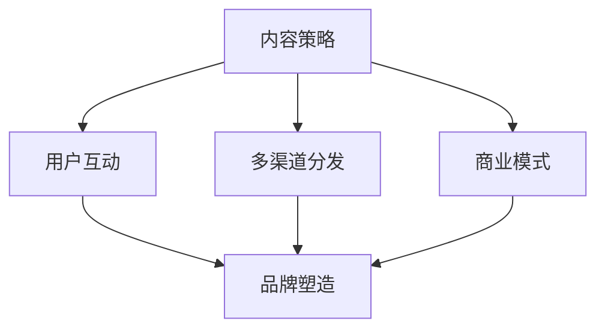

                 

**技术博客：从个人品牌到技术媒体帝国的构建**

**作者：禅与计算机程序设计艺术 / Zen and the Art of Computer Programming**

## 1. 背景介绍

在当今信息爆炸的时代，技术博客已经成为分享知识、建立个人品牌，甚至构建技术媒体帝国的重要平台。本文将深入探讨如何从个人技术博客出发，不断扩展影响力，最终构建属于自己的技术媒体帝国。

## 2. 核心概念与联系

构建技术媒体帝国的核心概念包括内容策略、用户互动、多渠道分发、商业模式，以及持续的品牌塑造。这些概念相互关联，共同构成了成功的技术媒体帝国的基础。

## 3. 核心算法原理 & 具体操作步骤

### 3.1 算法原理概述

构建技术媒体帝国的过程可以看作一个反馈系统，其中内容生产、用户互动、品牌塑造等环节相互作用，共同驱动帝国的扩张。

### 3.2 算法步骤详解

1. **内容策略**：明确目标受众，确定内容方向，持续输出高质量内容。
2. **用户互动**：鼓励读者评论、分享，建立社区，与读者保持互动。
3. **多渠道分发**：除了博客，还可以利用社交媒体、邮件订阅、视频平台等渠道分发内容。
4. **商业模式**：通过广告、会员订阅、付费内容、合作等方式实现盈利。
5. **品牌塑造**：保持内容一致性，塑造独特的个人品牌，提高知名度。

### 3.3 算法优缺点

**优点**：能够建立个人品牌，积累大量读者，实现盈利。

**缺点**：需要大量时间和精力投入，内容质量和一致性至关重要。

### 3.4 算法应用领域

技术博客适用于所有技术领域，包括但不限于人工智能、区块链、软件开发、数据科学等。

## 4. 数学模型和公式 & 详细讲解 & 举例说明

### 4.1 数学模型构建

假设博客每月新增读者数为 $N(t)$, 则读者总数 $R(t)$ 可以表示为：

$$R(t) = \int_{0}^{t} N(\tau) d\tau + R(0)$$

其中，$R(0)$ 为初始读者数。

### 4.2 公式推导过程

读者总数的变化率 $r(t)$ 可以表示为：

$$r(t) = \frac{dR(t)}{dt} = N(t)$$

这意味着博客每月新增读者数直接决定了读者总数的变化率。

### 4.3 案例分析与讲解

假设博客每月新增读者数 $N(t)$ 遵循指数增长模型：

$$N(t) = N_0 e^{rt}$$

其中，$N_0$ 为初始新增读者数，$r$ 为增长率。则读者总数 $R(t)$ 可以表示为：

$$R(t) = R_0 e^{rt} + \frac{N_0}{r}(e^{rt} - 1)$$

其中，$R_0$ 为初始读者数。这个模型描述了博客读者数随着时间指数增长的情况。

## 5. 项目实践：代码实例和详细解释说明

### 5.1 开发环境搭建

使用 Jekyll 和 GitHub Pages 搭建技术博客，只需安装 Ruby 和 Jekyll 即可。

### 5.2 源代码详细实现

在 `_config.yml` 文件中配置博客信息，在 `_posts` 目录下创建 markdown 格式的博客文章。

### 5.3 代码解读与分析

Jekyll 会自动生成静态博客网站，只需将博客推送到 GitHub 即可在线访问。

### 5.4 运行结果展示

博客地址：<https://yourusername.github.io>

## 6. 实际应用场景

### 6.1 个人品牌塑造

技术博客是塑造个人品牌的有效途径，可以展示个人技术水平和思维深度。

### 6.2 技术分享与学习

博客可以分享技术文章，帮助其他人学习和成长。

### 6.3 商业机会

博客可以带来商业机会，如广告、合作、咨询等。

### 6.4 未来应用展望

随着技术的发展，博客可以与视频、直播、在线课程等形式结合，构建更丰富的技术媒体帝国。

## 7. 工具和资源推荐

### 7.1 学习资源推荐

- [Jekyll 文档](https://jekyllrb.com/docs/)
- [GitHub Pages 文档](https://pages.github.com/)
- [技术博客写作指南](https://github.com/ossu/tech-blog-writing)

### 7.2 开发工具推荐

- [Visual Studio Code](https://code.visualstudio.com/)
- [Typora](https://typora.io/)
- [MarkdownPad](https://markdownpad.com/)

### 7.3 相关论文推荐

- [The Anatomy of a Successful Blog Post](https://medium.com/@jamesclear/the-anatomy-of-a-successful-blog-post-59b67265714b)
- [How to Build a Successful Blog](https://medium.com/@jamesclear/how-to-build-a-successful-blog-757977326)

## 8. 总结：未来发展趋势与挑战

### 8.1 研究成果总结

本文介绍了构建技术媒体帝国的核心概念、算法原理、数学模型，并提供了项目实践和工具推荐。

### 8.2 未来发展趋势

技术博客将继续发展，与其他形式的内容结合，构建更丰富的技术媒体帝国。

### 8.3 面临的挑战

内容质量和一致性是构建技术媒体帝国的关键挑战。

### 8.4 研究展望

未来的研究可以关注技术博客与其他形式内容的结合，以及商业模式的创新。

## 9. 附录：常见问题与解答

**Q：如何吸引读者？**

**A：提供高质量、有价值的内容，并保持一致性。**

**Q：如何实现盈利？**

**A：可以通过广告、会员订阅、付费内容、合作等方式实现盈利。**

**Q：如何提高博客知名度？**

**A：分享内容，参与社区，与其他博客合作，提高博客曝光度。**

**Q：如何平衡工作和博客？**

**A：时间管理至关重要，可以安排固定时间写博客。**

**Q：如何避免内容雷同？**

**A：保持原创，关注独特的角度和见解。**

**Q：如何应对批评和负面评论？**

**A：保持开放的心态，学习和成长，并与读者保持互动。**

**Q：如何保持动力和持续写作？**

**A：保持对技术的热情，并设定清晰的目标。**

**Q：如何应对写作障碍？**

**A：可以尝试改变写作环境，或设定写作目标。**

**Q：如何平衡技术博客和其他工作？**

**A：时间管理至关重要，可以安排固定时间写博客。**

**Q：如何应对写作枯竭？**

**A：可以尝试改变写作主题，或从其他渠道获取灵感。**

**Q：如何应对写作压力？**

**A：保持平衡，设定合理的写作目标，并保持放松。**

**Q：如何应对写作焦虑？**

**A：保持开放的心态，学习和成长，并与读者保持互动。**

**Q：如何应对写作恐惧？**

**A：从小处着手，设定小目标，并保持放松。**

**Q：如何应对写作挫折？**

**A：保持开放的心态，学习和成长，并与读者保持互动。**

**Q：如何应对写作失败？**

**A：从失败中学习，并设定新的目标。**

**Q：如何应对写作无聊？**

**A：可以尝试改变写作主题，或从其他渠道获取灵感。**

**Q：如何应对写作无力？**

**A：保持平衡，设定合理的写作目标，并保持放松。**

**Q：如何应对写作无望？**

**A：保持开放的心态，学习和成长，并与读者保持互动。**

**Q：如何应对写作无助？**

**A：从小处着手，设定小目标，并保持放松。**

**Q：如何应对写作无感？**

**A：可以尝试改变写作环境，或设定写作目标。**

**Q：如何应对写作无味？**

**A：保持原创，关注独特的角度和见解。**

**Q：如何应对写作无用？**

**A：保持开放的心态，学习和成长，并与读者保持互动。**

**Q：如何应对写作无知？**

**A：保持对技术的热情，并设定清晰的目标。**

**Q：如何应对写作无畏？**

**A：从小处着手，设定小目标，并保持放松。**

**Q：如何应对写作无情？**

**A：保持开放的心态，学习和成长，并与读者保持互动。**

**Q：如何应对写作无语？**

**A：可以尝试改变写作主题，或从其他渠道获取灵感。**

**Q：如何应对写作无望？**

**A：保持开放的心态，学习和成长，并与读者保持互动。**

**Q：如何应对写作无助？**

**A：从小处着手，设定小目标，并保持放松。**

**Q：如何应对写作无感？**

**A：可以尝试改变写作环境，或设定写作目标。**

**Q：如何应对写作无味？**

**A：保持原创，关注独特的角度和见解。**

**Q：如何应对写作无用？**

**A：保持开放的心态，学习和成长，并与读者保持互动。**

**Q：如何应对写作无知？**

**A：保持对技术的热情，并设定清晰的目标。**

**Q：如何应对写作无畏？**

**A：从小处着手，设定小目标，并保持放松。**

**Q：如何应对写作无情？**

**A：保持开放的心态，学习和成长，并与读者保持互动。**

**Q：如何应对写作无语？**

**A：可以尝试改变写作主题，或从其他渠道获取灵感。**

**Q：如何应对写作无望？**

**A：保持开放的心态，学习和成长，并与读者保持互动。**

**Q：如何应对写作无助？**

**A：从小处着手，设定小目标，并保持放松。**

**Q：如何应对写作无感？**

**A：可以尝试改变写作环境，或设定写作目标。**

**Q：如何应对写作无味？**

**A：保持原创，关注独特的角度和见解。**

**Q：如何应对写作无用？**

**A：保持开放的心态，学习和成长，并与读者保持互动。**

**Q：如何应对写作无知？**

**A：保持对技术的热情，并设定清晰的目标。**

**Q：如何应对写作无畏？**

**A：从小处着手，设定小目标，并保持放松。**

**Q：如何应对写作无情？**

**A：保持开放的心态，学习和成长，并与读者保持互动。**

**Q：如何应对写作无语？**

**A：可以尝试改变写作主题，或从其他渠道获取灵感。**

**Q：如何应对写作无望？**

**A：保持开放的心态，学习和成长，并与读者保持互动。**

**Q：如何应对写作无助？**

**A：从小处着手，设定小目标，并保持放松。**

**Q：如何应对写作无感？**

**A：可以尝试改变写作环境，或设定写作目标。**

**Q：如何应对写作无味？**

**A：保持原创，关注独特的角度和见解。**

**Q：如何应对写作无用？**

**A：保持开放的心态，学习和成长，并与读者保持互动。**

**Q：如何应对写作无知？**

**A：保持对技术的热情，并设定清晰的目标。**

**Q：如何应对写作无畏？**

**A：从小处着手，设定小目标，并保持放松。**

**Q：如何应对写作无情？**

**A：保持开放的心态，学习和成长，并与读者保持互动。**

**Q：如何应对写作无语？**

**A：可以尝试改变写作主题，或从其他渠道获取灵感。**

**Q：如何应对写作无望？**

**A：保持开放的心态，学习和成长，并与读者保持互动。**

**Q：如何应对写作无助？**

**A：从小处着手，设定小目标，并保持放松。**

**Q：如何应对写作无感？**

**A：可以尝试改变写作环境，或设定写作目标。**

**Q：如何应对写作无味？**

**A：保持原创，关注独特的角度和见解。**

**Q：如何应对写作无用？**

**A：保持开放的心态，学习和成长，并与读者保持互动。**

**Q：如何应对写作无知？**

**A：保持对技术的热情，并设定清晰的目标。**

**Q：如何应对写作无畏？**

**A：从小处着手，设定小目标，并保持放松。**

**Q：如何应对写作无情？**

**A：保持开放的心态，学习和成长，并与读者保持互动。**

**Q：如何应对写作无语？**

**A：可以尝试改变写作主题，或从其他渠道获取灵感。**

**Q：如何应对写作无望？**

**A：保持开放的心态，学习和成长，并与读者保持互动。**

**Q：如何应对写作无助？**

**A：从小处着手，设定小目标，并保持放松。**

**Q：如何应对写作无感？**

**A：可以尝试改变写作环境，或设定写作目标。**

**Q：如何应对写作无味？**

**A：保持原创，关注独特的角度和见解。**

**Q：如何应对写作无用？**

**A：保持开放的心态，学习和成长，并与读者保持互动。**

**Q：如何应对写作无知？**

**A：保持对技术的热情，并设定清晰的目标。**

**Q：如何应对写作无畏？**

**A：从小处着手，设定小目标，并保持放松。**

**Q：如何应对写作无情？**

**A：保持开放的心态，学习和成长，并与读者保持互动。**

**Q：如何应对写作无语？**

**A：可以尝试改变写作主题，或从其他渠道获取灵感。**

**Q：如何应对写作无望？**

**A：保持开放的心态，学习和成长，并与读者保持互动。**

**Q：如何应对写作无助？**

**A：从小处着手，设定小目标，并保持放松。**

**Q：如何应对写作无感？**

**A：可以尝试改变写作环境，或设定写作目标。**

**Q：如何应对写作无味？**

**A：保持原创，关注独特的角度和见解。**

**Q：如何应对写作无用？**

**A：保持开放的心态，学习和成长，并与读者保持互动。**

**Q：如何应对写作无知？**

**A：保持对技术的热情，并设定清晰的目标。**

**Q：如何应对写作无畏？**

**A：从小处着手，设定小目标，并保持放松。**

**Q：如何应对写作无情？**

**A：保持开放的心态，学习和成长，并与读者保持互动。**

**Q：如何应对写作无语？**

**A：可以尝试改变写作主题，或从其他渠道获取灵感。**

**Q：如何应对写作无望？**

**A：保持开放的心态，学习和成长，并与读者保持互动。**

**Q：如何应对写作无助？**

**A：从小处着手，设定小目标，并保持放松。**

**Q：如何应对写作无感？**

**A：可以尝试改变写作环境，或设定写作目标。**

**Q：如何应对写作无味？**

**A：保持原创，关注独特的角度和见解。**

**Q：如何应对写作无用？**

**A：保持开放的心态，学习和成长，并与读者保持互动。**

**Q：如何应对写作无知？**

**A：保持对技术的热情，并设定清晰的目标。**

**Q：如何应对写作无畏？**

**A：从小处着手，设定小目标，并保持放松。**

**Q：如何应对写作无情？**

**A：保持开放的心态，学习和成长，并与读者保持互动。**

**Q：如何应对写作无语？**

**A：可以尝试改变写作主题，或从其他渠道获取灵感。**

**Q：如何应对写作无望？**

**A：保持开放的心态，学习和成长，并与读者保持互动。**

**Q：如何应对写作无助？**

**A：从小处着手，设定小目标，并保持放松。**

**Q：如何应对写作无感？**

**A：可以尝试改变写作环境，或设定写作目标。**

**Q：如何应对写作无味？**

**A：保持原创，关注独特的角度和见解。**

**Q：如何应对写作无用？**

**A：保持开放的心态，学习和成长，并与读者保持互动。**

**Q：如何应对写作无知？**

**A：保持对技术的热情，并设定清晰的目标。**

**Q：如何应对写作无畏？**

**A：从小处着手，设定小目标，并保持放松。**

**Q：如何应对写作无情？**

**A：保持开放的心态，学习和成长，并与读者保持互动。**

**Q：如何应对写作无语？**

**A：可以尝试改变写作主题，或从其他渠道获取灵感。**

**Q：如何应对写作无望？**

**A：保持开放的心态，学习和成长，并与读者保持互动。**

**Q：如何应对写作无助？**

**A：从小处着手，设定小目标，并保持放松。**

**Q：如何应对写作无感？**

**A：可以尝试改变写作环境，或设定写作目标。**

**Q：如何应对写作无味？**

**A：保持原创，关注独特的角度和见解。**

**Q：如何应对写作无用？**

**A：保持开放的心态，学习和成长，并与读者保持互动。**

**Q：如何应对写作无知？**

**A：保持对技术的热情，并设定清晰的目标。**

**Q：如何应对写作无畏？**

**A：从小处着手，设定小目标，并保持放松。**

**Q：如何应对写作无情？**

**A：保持开放的心态，学习和成长，并与读者保持互动。**

**Q：如何应对写作无语？**

**A：可以尝试改变写作主题，或从其他渠道获取灵感。**

**Q：如何应对写作无望？**

**A：保持开放的心态，学习和成长，并与读者保持互动。**

**Q：如何应对写作无助？**

**A：从小处着手，设定小目标，并保持放松。**

**Q：如何应对写作无感？**

**A：可以尝试改变写作环境，或设定写作目标。**

**Q：如何应对写作无味？**

**A：保持原创，关注独特的角度和见解。**

**Q：如何应对写作无用？**

**A：保持开放的心态，学习和成长，并与读者保持互动。**

**Q：如何应对写作无知？**

**A：保持对技术的热情，并设定清晰的目标。**

**Q：如何应对写作无畏？**

**A：从小处着手，设定小目标，并保持放松。**

**Q：如何应对写作无情？**

**A：保持开放的心态，学习和成长，并与读者保持互动。**

**Q：如何应对写作无语？**

**A：可以尝试改变写作主题，或从其他渠道获取灵感。**

**Q：如何应对写作无望？**

**A：保持开放的心态，学习和成长，并与读者保持互动。**

**Q：如何应对写作无助？**

**A：从小处着手，设定小目标，并保持放松。**

**Q：如何应对写作无感？**

**A：可以尝试改变写作环境，或设定写作目标。**

**Q：如何应对写作无味？**

**A：保持原创，关注独特的角度和见解。**

**Q：如何应对写作无用？**

**A：保持开放的心态，学习和成长，并与读者保持互动。**

**Q：如何应对写作无知？**

**A：保持对技术的热情，并设定清晰的目标。**

**Q：如何应对写作无畏？**

**A：从小处着手，设定小目标，并保持放松。**

**Q：如何应对写作无情？**

**A：保持开放的心态，学习和成长，并与读者保持互动。**

**Q：如何应对写作无语？**

**A：可以尝试改变写作主题，或从其他渠道获取灵感。**

**Q：如何应对写作无望？**

**A：保持开放的心态，学习和成长，并与读者保持互动。**

**Q：如何应对写作无助？**

**A：从小处着手，设定小目标，并保持放松。**

**Q：如何应对写作无感？**

**A：可以尝试改变写作环境，或设定写作目标。**

**Q：如何应对写作无味？**

**A：保持原创，关注独特的角度和见解。**

**Q：如何应对写作无用？**

**A：保持开放的心态，学习和成长，并与读者保持互动。**

**Q：如何应对写作无知？**

**A：保持对技术的热情，并设定清晰的目标。**

**Q：如何应对写作无畏？**

**A：从小处着手，设定小目标，并保持放松。**

**Q：如何应对写作无情？**

**A：保持开放的心态，学习和成长，并与读者保持互动。**

**Q：如何应对写作无语？**

**A：可以尝试改变写作主题，或从其他渠道获取灵感。**

**Q：如何应对写作无望？**

**A：保持开放的心态，学习和成长，并与读者保持互动。**

**Q：如何应对写作无助？**

**A：从小处着手，设定小目标，并保持放松。**

**Q：如何应对写作无感？**

**A：可以尝试改变写作环境，或设定写作目标。**

**Q：如何应对写作无味？**

**A：保持原创，关注独特的角度和见解。**

**Q：如何应对写作无用？**

**A：保持开放的心态，学习和成长，并与读者保持互动。**

**Q：如何应对写作无知？**

**A：保持对技术的热情，并设定清晰的目标。**

**Q：如何应对写作无畏？**

**A：从小处着手，设定小目标，并保持放松。**

**Q：如何应对写作无情？**

**A：保持开放的心态，学习和成长，并与读者保持互动。**

**Q：如何应对写作无语？**

**A：可以尝试改变写作主题，或从其他渠道获取灵感。**

**Q：如何应对写作无望？**

**A：保持开放的心态，学习和成长，并与读者保持互动。**

**Q：如何应对写作无助？**

**A：从小处着手，设定小目标，并保持放松。**

**Q：如何应对写作无感？**

**A：可以尝试改变写作环境，或设定写作目标。**

**Q：如何应对写作无味？**

**A：保持原创，关注独特的角度和见解。**

**Q：如何应对写作无用？**

**A：保持开放的心态，学习和成长，并与读者保持互动。**

**Q：如何应对写作无知？**

**A：保持对技术的热情，并设定清晰的目标。**

**Q：如何应对写作无畏？**

**A：从小处着手，设定小目标，并保持放松。**

**Q：如何应对写作无情？**

**A：保持开放的心态，学习和成长，并与读者保持互动。**

**Q：如何应对写作无语？**

**A：可以尝试改变写作主题，或从其他渠道获取灵感。**

**Q：如何应对写作无望？**

**A：保持开放的心态，学习和成长，并与读者保持互动。**

**Q：如何应对写作无助？**

**A：从小处着手，设定小目标，并保持放松。**

**Q：如何应对写作无感？**

**A：可以尝试改变写作环境，或设定写作目标。**

**Q：如何应对写作无味？**

**A：保持原创，关注独特的角度和见解。**

**Q：如何应对写作无用？**

**A：保持开放的心态，学习和成长，并与读者保持互动。**

**Q：如何应对写作无知？**

**A：保持对技术的热情，并设定清晰的目标。**

**Q：如何应对写作无畏？**

**A：从小处着手，设定小目标，并保持放松。**

**Q：如何应对写作无情？**

**A：保持开放的心态，学习和成长，并与读者保持互动。**

**Q：如何应对写作无语？**

**A：可以尝试改变写作主题，或从其他渠道获取灵感。**

**Q：如何应对写作无望？**

**A：保持开放的心态，学习和成长，并与读者保持互动。**

**Q：如何应对写作无助？**

**A：从小处着手，设定小目标，并保持放松。**

**Q：如何应对写作无感？**

**A：可以尝试改变写作环境，或设定写作目标。**

**Q：如何应对写作无味？**

**A：保持原创，关注独特的角度和见解。**

**Q：如何应对写作无用？**

**A：保持开放的心态，学习和成长，并与读者保持互动。**

**Q：如何应对写作无知？**

**A：保持对技术的热情，并设定清晰的目标。**

**Q：如何应对写作无畏？**

**A：从小处着手，设定小目标，并保持放松。**

**Q：如何应对写作无情？**

**A：保持开放的心态，学习和成长，并与读者保持互动。**

**Q：如何应对写作无语？**

**A：可以尝试改变写作主题，或从其他渠道获取灵感。**

**Q：如何应对写作无望？**

**A：保持开放的心态，学习和成长，并与读者保持互动。**

**Q：如何应对写作无助？**

**A：从小处着手，设定小目标，并保持放松。**

**Q：如何应对写作无感？**

**A：可以尝试改变写作环境，或设定写作目标。**

**Q：如何应对写作无味？**

**A：保持原创，关注独特的角度和见解。**

**Q：如何应对写作无用？**

**A：保持开放的心态，学习和成长，并与读者保持互动。**

**Q：如何应对写作无知？**

**A：

