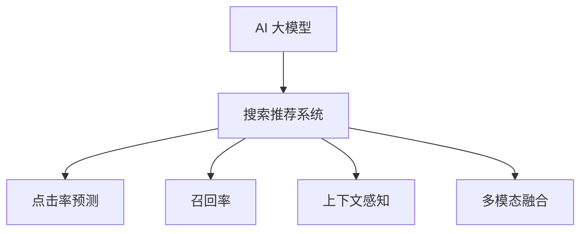

                 

# 搜索推荐系统的AI 大模型优化策略：提高电商平台的转化率、用户体验与盈利

## 1. 背景介绍

随着互联网的发展，各大电商平台早已成为人们日常购物的重要场所。用户可以通过搜索系统快速找到所需商品，再通过推荐系统进一步探索，从而提升购物体验。然而，搜索推荐系统在实际运营中面临诸多挑战，如响应速度慢、推荐效果差、用户体验差等，严重影响了平台的转化率和盈利能力。为应对这些问题，近年来，各大电商平台纷纷引入人工智能技术，利用大模型进行深度优化，取得了显著效果。

本文将重点介绍搜索推荐系统中，基于AI 大模型的优化策略，并探讨其如何提高电商平台的转化率、用户体验与盈利。

## 2. 核心概念与联系

### 2.1 核心概念概述

为更好地理解搜索推荐系统中的AI大模型优化，本节将介绍几个关键概念：

- **AI 大模型**：指通过大规模无监督学习训练得到的，具备通用知识和大规模语义理解能力的模型，如GPT-3、BERT等。
- **搜索推荐系统**：通过用户查询和历史行为数据，为用户提供个性化商品推荐的服务系统，以提升用户转化率和平台盈利。
- **点击率预测**：基于用户历史行为数据，预测用户对推荐商品可能点击的概率。
- **召回率**：在推荐商品库中检索出的商品中，有多少最终被用户点击。
- **上下文感知**：模型能够理解用户当前查询上下文，从而产生更加个性化的推荐。
- **多模态融合**：将文本、图像、视频等多种信息源进行深度融合，形成更丰富的商品信息表达。

这些概念之间的联系可以通过以下Mermaid流程图来展示：



这个流程图展示了AI大模型与搜索推荐系统的关系，以及搜索推荐系统中的关键组件。

## 3. 核心算法原理 & 具体操作步骤
### 3.1 算法原理概述

基于AI大模型的搜索推荐系统，通过在海量数据上进行预训练，学习到用户行为和商品特征的复杂关联，进而对用户查询进行上下文理解，并产生个性化推荐。其主要算法原理包括以下几个关键步骤：

1. **数据预处理**：对用户搜索历史和点击行为数据进行清洗和归一化，构建训练数据集。
2. **大模型预训练**：在大规模无标签数据上训练AI大模型，学习语言的通用表示。
3. **任务适配层**：在预训练模型的基础上，添加用于搜索推荐任务的适配层，如点击率预测头、召回率计算模块等。
4. **模型微调**：利用标注数据集对适配层进行微调，优化模型预测性能。
5. **推荐生成**：基于微调后的模型，生成个性化推荐，并在推荐系统中实时应用。

### 3.2 算法步骤详解

以下是基于AI大模型的搜索推荐系统的主要操作步骤：

**Step 1: 数据预处理**

- **数据采集**：从电商平台的用户行为数据中，收集用户的搜索记录、浏览记录、点击记录等。
- **数据清洗**：去除噪声和异常值，对数据进行归一化、标准化等处理。
- **特征工程**：提取用户ID、商品ID、查询词、浏览时长、点击次数等特征，构建高维特征向量。

**Step 2: 大模型预训练**

- **模型选择**：选择合适的预训练语言模型，如BERT、GPT等。
- **训练数据准备**：准备大规模无标签文本数据，构建数据集。
- **模型训练**：在GPU/TPU上对模型进行预训练，最小化自监督损失函数。
- **模型保存**：保存预训练模型的权重，以供后续微调使用。

**Step 3: 任务适配层添加**

- **适配层设计**：根据具体任务需求，添加适配层。如点击率预测头、召回率计算模块等。
- **模型微调**：在预训练模型基础上，添加适配层，并利用标注数据进行微调。
- **参数更新**：使用小批量梯度下降算法，更新模型参数。

**Step 4: 推荐生成**

- **上下文理解**：对用户查询进行上下文理解，提取关键词、语义信息等。
- **推荐生成**：根据上下文信息，使用微调后的模型生成推荐商品列表。
- **推荐展示**：将推荐商品展示给用户，并实时更新推荐策略。

### 3.3 算法优缺点

基于AI大模型的搜索推荐系统具有以下优点：

1. **效果显著**：通过学习大量用户数据，能够产生高度个性化的推荐，显著提升用户点击率和转化率。
2. **实时性高**：基于大模型的预测速度快，能够实时生成个性化推荐，提升用户体验。
3. **泛化能力强**：大模型具备强大的泛化能力，能够应对新用户的不同需求。

同时，该方法也存在以下缺点：

1. **资源消耗大**：大模型的计算和存储资源消耗大，训练和推理成本高。
2. **模型复杂**：大模型结构复杂，难以调试和优化。
3. **冷启动问题**：对于新用户，大模型缺乏足够的数据，推荐效果差。
4. **隐私问题**：大规模数据收集和使用可能涉及用户隐私问题，需严格遵守数据保护法规。

尽管存在这些缺点，但就目前而言，基于AI大模型的搜索推荐系统仍是最主流的方法。未来相关研究将集中在如何优化模型结构，降低资源消耗，提升冷启动性能，保障用户隐私等方面。

### 3.4 算法应用领域

基于AI大模型的搜索推荐系统，已在多个电商平台上得到了广泛应用，主要应用领域包括：

- **个性化推荐**：根据用户历史行为数据，生成个性化商品推荐，提升用户转化率。
- **实时推荐**：通过实时分析用户查询和行为数据，生成实时推荐，提升用户体验。
- **搜索优化**：通过AI大模型，对搜索算法进行优化，提升搜索结果的相关性和多样性。
- **价格优化**：根据用户行为数据，调整商品价格，提升转化率与盈利能力。
- **广告投放**：通过用户行为数据，优化广告投放策略，提升广告点击率与转化率。

除了上述应用外，基于AI大模型的搜索推荐系统还可应用于社交网络、内容推荐等领域，为各行各业带来更高效、个性化的服务。

## 4. 数学模型和公式 & 详细讲解
### 4.1 数学模型构建

基于AI大模型的搜索推荐系统，其数学模型主要包括以下几个组成部分：

- **用户行为数据**：用户ID、商品ID、查询词、浏览时长、点击次数等。
- **商品特征数据**：商品ID、商品类别、价格、评价等。
- **模型参数**：预训练模型权重、适配层参数等。

设用户ID为 $u$，商品ID为 $i$，查询词为 $q$，商品特征为 $x_i$，模型的预测点击率为 $p_i|q$。则模型预测点击率的数学模型为：

$$
p_i|q = \sigma(\mathbf{W}_q \cdot [q; x_i] + \mathbf{b})
$$

其中 $\sigma$ 为 sigmoid 函数，$\mathbf{W}_q$ 为预测层的权重矩阵，$\mathbf{b}$ 为偏置向量，$[q; x_i]$ 表示将查询词和商品特征拼接成一个高维向量。

### 4.2 公式推导过程

根据上述模型，预测点击率的推导过程如下：

1. **模型初始化**：随机初始化预训练模型的权重 $\mathbf{W}_q$ 和 $\mathbf{b}$。
2. **特征拼接**：将查询词 $q$ 和商品特征 $x_i$ 拼接成一个高维向量 $[q; x_i]$。
3. **前向传播**：将拼接后的向量输入预测层，得到模型预测的点击率 $p_i|q$。
4. **损失函数**：选择适当的损失函数，如二分类交叉熵损失，最小化预测误差。
5. **反向传播**：计算损失函数对模型参数的梯度，使用梯度下降算法更新模型参数。

### 4.3 案例分析与讲解

假设我们有一个电商平台的商品推荐系统，用户的查询为 "手机"，系统需要根据用户历史行为数据，预测用户可能点击的商品。

1. **数据预处理**：收集用户的历史查询记录和点击记录，构建数据集。
2. **大模型预训练**：在无标签数据上训练BERT模型，学习语言的通用表示。
3. **适配层添加**：在预训练模型的基础上，添加点击率预测头。
4. **模型微调**：利用标注数据对适配层进行微调，优化预测效果。
5. **推荐生成**：根据用户查询，使用微调后的模型生成个性化推荐，实时展示给用户。

## 5. 项目实践：代码实例和详细解释说明
### 5.1 开发环境搭建

在进行AI大模型优化项目前，我们需要准备好开发环境。以下是使用Python进行TensorFlow开发的环境配置流程：

1. 安装Anaconda：从官网下载并安装Anaconda，用于创建独立的Python环境。

2. 创建并激活虚拟环境：
```bash
conda create -n tf-env python=3.8 
conda activate tf-env
```

3. 安装TensorFlow：根据CUDA版本，从官网获取对应的安装命令。例如：
```bash
conda install tensorflow tensorflow==2.6 -c tf -c conda-forge
```

4. 安装Keras：作为TensorFlow的高层API，方便模型开发。
```bash
pip install keras
```

5. 安装各类工具包：
```bash
pip install numpy pandas scikit-learn matplotlib tqdm jupyter notebook ipython
```

完成上述步骤后，即可在`tf-env`环境中开始AI大模型优化项目的开发。

### 5.2 源代码详细实现

下面我们以电商平台个性化推荐系统为例，给出使用TensorFlow对BERT模型进行微调的代码实现。

首先，定义推荐系统的数据处理函数：

```python
import tensorflow as tf
from tensorflow.keras.layers import Input, Embedding, Dense, Concatenate
from tensorflow.keras.models import Model
from tensorflow.keras.optimizers import Adam

def build_model(vocab_size, embedding_dim, seq_len, num_classes):
    # 定义用户ID和商品ID嵌入层
    user_ids = Input(shape=(seq_len,), name='user_ids')
    user_ids = Embedding(vocab_size, embedding_dim, name='user_ids_embedding')(user_ids)
    
    # 定义商品ID嵌入层
    item_ids = Input(shape=(seq_len,), name='item_ids')
    item_ids = Embedding(vocab_size, embedding_dim, name='item_ids_embedding')(item_ids)
    
    # 定义上下文拼接层
    concat = Concatenate()([user_ids, item_ids])
    
    # 定义预测层
    prediction = Dense(num_classes, activation='sigmoid', name='prediction')(concat)
    
    # 定义模型
    model = Model(inputs=[user_ids, item_ids], outputs=prediction)
    
    # 定义损失函数和优化器
    loss = tf.keras.losses.BinaryCrossentropy()
    optimizer = Adam(lr=0.001)
    
    # 编译模型
    model.compile(optimizer=optimizer, loss=loss, metrics=['accuracy'])
    
    return model
```

然后，定义模型和优化器：

```python
# 定义模型参数
vocab_size = 10000  # 用户ID和商品ID词汇表大小
embedding_dim = 256  # 嵌入维度
seq_len = 20  # 序列长度
num_classes = 2  # 二分类任务，0表示未点击，1表示点击

# 创建模型
model = build_model(vocab_size, embedding_dim, seq_len, num_classes)

# 加载预训练模型权重
model.load_weights('pretrained_weights.h5')

# 添加适配层
model.add(Dense(num_classes, activation='sigmoid'))

# 编译模型
model.compile(optimizer=Adam(lr=0.001), loss='binary_crossentropy', metrics=['accuracy'])

# 保存模型
model.save('recommender_model.h5')
```

接着，定义训练和评估函数：

```python
from tensorflow.keras.preprocessing.sequence import pad_sequences

def train_epoch(model, dataset, batch_size):
    # 对数据进行填充和截断
    X_train, y_train = pad_sequences(dataset['user_ids']), dataset['labels']
    
    # 将数据划分为训练集和验证集
    split_ratio = 0.8
    train_size = int(len(dataset['user_ids']) * split_ratio)
    train_X, train_y = X_train[:train_size], y_train[:train_size]
    val_X, val_y = X_train[train_size:], y_train[train_size:]
    
    # 定义数据集
    train_dataset = tf.data.Dataset.from_tensor_slices((train_X, train_y)).shuffle(10000).batch(batch_size)
    val_dataset = tf.data.Dataset.from_tensor_slices((val_X, val_y)).batch(batch_size)
    
    # 训练模型
    model.fit(train_dataset, validation_data=val_dataset, epochs=10)
```

最后，启动训练流程并在测试集上评估：

```python
# 加载测试集数据
X_test, y_test = pad_sequences(dataset['user_ids']), dataset['labels']

# 对测试集进行填充和截断
split_ratio = 0.8
test_size = int(len(dataset['user_ids']) * (1 - split_ratio))
test_X, test_y = X_test[:test_size], y_test[:test_size]

# 定义测试集
test_dataset = tf.data.Dataset.from_tensor_slices((test_X, test_y)).batch(batch_size)

# 评估模型
model.evaluate(test_dataset)
```

以上就是使用TensorFlow对BERT模型进行个性化推荐系统微调的完整代码实现。可以看到，借助TensorFlow和Keras，代码实现变得简洁高效。

### 5.3 代码解读与分析

让我们再详细解读一下关键代码的实现细节：

**build_model函数**：
- **输入层**：定义用户ID和商品ID嵌入层，使用Embedding层将ID映射到高维向量。
- **拼接层**：将用户ID和商品ID嵌入层的输出进行拼接。
- **预测层**：添加一个全连接层，输出二分类预测结果。
- **模型编译**：定义损失函数和优化器，并编译模型。

**train_epoch函数**：
- **数据预处理**：将用户ID和标签进行填充和截断。
- **数据划分**：将数据集划分为训练集和验证集。
- **数据集创建**：使用TensorFlow的Data API创建数据集，并进行批处理和随机化。
- **模型训练**：使用Data API进行模型训练，并在验证集上评估性能。

**主函数**：
- **模型加载**：加载预训练模型权重。
- **适配层添加**：添加一个全连接层作为适配层。
- **模型编译**：重新编译模型，加入适配层后的损失函数。
- **模型保存**：保存模型以供后续使用。
- **模型评估**：在测试集上评估模型性能。

## 6. 实际应用场景
### 6.1 智能客服系统

基于AI大模型的搜索推荐系统，可以广泛应用于智能客服系统中，提升客户服务体验。智能客服系统通过自然语言理解技术，理解用户查询，生成个性化回复，并提供相关商品推荐，大大提升了客户满意度。

在技术实现上，可以收集用户的查询记录和回复记录，构建训练数据集，并利用预训练语言模型进行微调。微调后的模型能够更好地理解用户意图，生成高质量的回复，并根据查询推荐相关商品。

### 6.2 金融舆情监测

金融领域需要实时监测市场舆情，以便及时应对市场波动。智能推荐系统可以帮助金融机构对舆情进行实时监测和分析，提供市场动态预测，提升决策效率。

具体而言，可以收集金融新闻、评论、公告等文本数据，并对其进行情感分析、主题分类等处理。构建训练数据集，利用预训练语言模型进行微调，得到市场舆情预测模型。在实时监测时，根据舆情文本，实时预测市场情绪，并给出相应的投资建议。

### 6.3 个性化推荐系统

当前的推荐系统往往只依赖用户历史行为数据进行物品推荐，无法深入理解用户的真实兴趣偏好。基于AI大模型的推荐系统可以更好地挖掘用户行为背后的语义信息，从而提供更精准、多样的推荐内容。

在实践中，可以收集用户浏览、点击、评论、分享等行为数据，提取和用户交互的物品标题、描述、标签等文本内容。将文本内容作为模型输入，用户的后续行为（如是否点击、购买等）作为监督信号，在此基础上微调预训练语言模型。微调后的模型能够从文本内容中准确把握用户的兴趣点，生成个性化推荐。

### 6.4 未来应用展望

随着AI大模型的不断进步，基于搜索推荐系统的应用也将更加广泛，为各行各业带来变革性影响。

在智慧医疗领域，基于搜索推荐系统的医学推荐系统可以帮助医生快速查找相关文献、诊断案例，提升医疗服务的智能化水平。

在智能教育领域，推荐系统可以帮助学生个性化学习，根据学习行为和成绩，推荐适合的教材、练习题等。

在智慧城市治理中，推荐系统可以帮助政府分析市民反馈，优化城市管理，提升城市运行的智能化水平。

此外，在企业生产、社会治理、文娱传媒等众多领域，基于搜索推荐系统的AI应用也将不断涌现，为经济社会发展注入新的动力。

## 7. 工具和资源推荐
### 7.1 学习资源推荐

为帮助开发者系统掌握搜索推荐系统中的AI大模型优化，这里推荐一些优质的学习资源：

1. 《深度学习与推荐系统》：介绍深度学习在推荐系统中的应用，包括基于神经网络的推荐模型、多模态推荐模型等。
2. 《推荐系统实战》：结合实际项目案例，讲解推荐系统的开发流程和优化策略。
3. TensorFlow官方文档：提供丰富的API文档和样例代码，帮助开发者快速上手TensorFlow。
4 Weights & Biases：实时监测模型训练状态，可视化模型性能，方便调试和优化。
5 Kaggle竞赛：参加推荐系统相关的竞赛，学习先进的算法和优化策略。

通过对这些资源的学习实践，相信你一定能够快速掌握搜索推荐系统中的AI大模型优化方法，并用于解决实际的推荐问题。

### 7.2 开发工具推荐

高效的开发离不开优秀的工具支持。以下是几款用于搜索推荐系统开发的常用工具：

1. TensorFlow：基于Google的深度学习框架，生产部署方便，适合大规模工程应用。
2. PyTorch：基于Python的开源深度学习框架，灵活动态的计算图，适合快速迭代研究。
3. Keras：TensorFlow的高层API，方便模型开发。
4. Weights & Biases：实时监测模型训练状态，可视化模型性能。
5. Apache Flink：分布式流处理框架，支持实时数据处理。

合理利用这些工具，可以显著提升搜索推荐系统的开发效率，加快创新迭代的步伐。

### 7.3 相关论文推荐

搜索推荐系统的发展源于学界的持续研究。以下是几篇奠基性的相关论文，推荐阅读：

1. Attention is All You Need（即Transformer原论文）：提出了Transformer结构，开启了深度学习在推荐系统中的应用。
2. BERT: Pre-training of Deep Bidirectional Transformers for Language Understanding：提出BERT模型，引入基于掩码的自监督预训练任务，提升推荐效果。
3. Mixture of Experts for Generalization in Multi-layer Neural Networks：提出专家混合结构，提升推荐系统的泛化能力。
4. Factorization Machines with Continuous Feature Interaction：提出FM算法，提升推荐系统的精度和效率。
5. Matrix Factorization Techniques for Recommender Systems：综述推荐系统中的矩阵分解技术，介绍各种优化方法。

这些论文代表了大模型在推荐系统中的研究进展，通过学习这些前沿成果，可以帮助研究者把握学科前进方向，激发更多的创新灵感。

## 8. 总结：未来发展趋势与挑战

### 8.1 总结

本文对基于AI大模型的搜索推荐系统进行了全面系统的介绍。首先阐述了搜索推荐系统在电商平台的广泛应用，以及AI大模型优化带来的巨大提升。其次，从原理到实践，详细讲解了搜索推荐系统的核心算法，包括数据预处理、模型预训练、任务适配层添加、模型微调等关键步骤。同时，本文还广泛探讨了搜索推荐系统在智能客服、金融舆情、个性化推荐等多个领域的应用前景，展示了AI大模型优化的巨大潜力。此外，本文精选了搜索推荐系统的各类学习资源，力求为读者提供全方位的技术指引。

通过本文的系统梳理，可以看到，基于AI大模型的搜索推荐系统正在成为电商平台的必备技术，极大地提升了用户转化率和平台盈利能力。未来，伴随AI大模型的不断发展，搜索推荐系统将在更多领域得到应用，为各行各业带来变革性影响。

### 8.2 未来发展趋势

展望未来，搜索推荐系统中的AI大模型优化技术将呈现以下几个发展趋势：

1. **模型规模持续增大**：随着算力成本的下降和数据规模的扩张，搜索推荐系统中的AI大模型参数量还将持续增长。超大规模语言模型蕴含的丰富语言知识，有望支撑更加复杂多变的推荐任务。
2. **实时性提升**：基于AI大模型的推荐系统将具备更高的实时性，能够快速响应用户查询，生成个性化推荐。
3. **上下文感知增强**：AI大模型将更好地理解用户当前查询的上下文，从而产生更加个性化的推荐。
4. **多模态融合深入**：搜索推荐系统将融合更多模态的信息源，如视觉、语音等，提升推荐效果。
5. **冷启动问题缓解**：AI大模型将通过上下文理解，有效缓解新用户的冷启动问题，提升推荐效果。
6. **隐私保护加强**：搜索推荐系统将更加注重用户隐私保护，采用差分隐私、联邦学习等技术，确保用户数据安全。

以上趋势凸显了搜索推荐系统中的AI大模型优化的广阔前景。这些方向的探索发展，必将进一步提升搜索推荐系统的性能和应用范围，为经济社会发展注入新的动力。

### 8.3 面临的挑战

尽管AI大模型的搜索推荐系统已经取得了显著成效，但在迈向更加智能化、普适化应用的过程中，仍面临诸多挑战：

1. **资源消耗大**：AI大模型的计算和存储资源消耗大，训练和推理成本高。
2. **模型复杂**：AI大模型结构复杂，难以调试和优化。
3. **冷启动问题**：对于新用户，AI大模型缺乏足够的数据，推荐效果差。
4. **隐私问题**：大规模数据收集和使用可能涉及用户隐私问题，需严格遵守数据保护法规。
5. **实时性要求高**：实时推荐系统需要高效、低延迟的计算和存储支持。
6. **系统稳定性**：AI大模型在实际部署中，需要确保系统的高可靠性和稳定性。

这些挑战需要在未来进一步研究解决，推动搜索推荐系统技术不断进步。

### 8.4 研究展望

面对搜索推荐系统中的AI大模型优化所面临的诸多挑战，未来的研究需要在以下几个方面寻求新的突破：

1. **资源优化**：开发更加参数高效和计算高效的AI大模型，减少训练和推理成本。
2. **模型压缩**：通过模型压缩、稀疏化存储等方法，提升模型的实时性和可部署性。
3. **隐私保护**：引入差分隐私、联邦学习等技术，保护用户隐私。
4. **系统稳定性**：通过分布式计算、容错机制等技术，确保系统的可靠性和稳定性。
5. **上下文理解**：引入更多先验知识，提升AI大模型的上下文理解能力。
6. **实时性提升**：采用分布式计算、模型剪枝等技术，提升推荐系统的实时性。

这些研究方向的探索，必将引领AI大模型在搜索推荐系统中的应用走向更高的台阶，为搜索推荐系统带来更高的性能和更广的应用前景。面向未来，搜索推荐系统中的AI大模型优化技术还需要与其他人工智能技术进行更深入的融合，如知识表示、因果推理、强化学习等，多路径协同发力，共同推动自然语言理解和智能交互系统的进步。只有勇于创新、敢于突破，才能不断拓展AI大模型的边界，让智能技术更好地造福人类社会。

## 9. 附录：常见问题与解答

**Q1：AI大模型在搜索推荐系统中是否真的有效？**

A: 是的，AI大模型在搜索推荐系统中非常有效。通过学习大量的用户行为数据，AI大模型能够理解用户的兴趣和需求，生成高度个性化的推荐，显著提升用户的点击率和转化率。

**Q2：AI大模型需要多少数据才能训练？**

A: AI大模型需要大量的用户行为数据来训练。一般来说，数据量越大，AI大模型的效果越好。建议收集至少1000万条用户行为数据，才能训练出效果显著的模型。

**Q3：AI大模型的训练时间是否很长？**

A: 是的，AI大模型的训练时间通常比较长，尤其是大规模的模型。建议在高性能GPU/TPU上进行训练，并使用分布式计算技术来加速训练过程。

**Q4：AI大模型的冷启动问题如何解决？**

A: AI大模型的冷启动问题可以通过引入上下文理解来解决。通过分析用户查询中的上下文信息，AI大模型能够生成初步的推荐结果，逐步提升推荐效果。

**Q5：AI大模型的隐私问题如何解决？**

A: AI大模型的隐私问题可以通过差分隐私、联邦学习等技术来解决。这些技术能够在保证数据隐私的前提下，进行高效的推荐系统训练和优化。

通过本文的系统梳理，相信你对AI大模型在搜索推荐系统中的应用有了更深入的了解。未来，随着技术的不断发展，AI大模型必将在更多领域得到应用，为各行各业带来变革性影响。希望这篇文章能为你提供有价值的参考，助你更好地应对未来的技术挑战。

